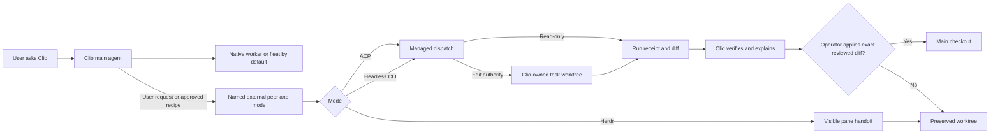

# Clio Coder v0.5.5 — Native Agent Delegation Sprint Spec

Status: founder decisions captured; ready for implementation planning
Scope: one Clio-owned sprint across dispatch, worker runtimes, worktrees, receipts, and operator surfaces
Source snapshot: 2026-09-24. Recheck touched code before editing because dispatch and context code are under active development.

## 1. Product contract

Clio's main agent is the operator's control point. Clio-native workers and fleets remain the normal execution path. External coding agents are an optional, explicitly authorized reach feature: a user can ask Clio to give a bounded task to a familiar CLI, watch its progress, judge its output, and decide whether its code enters the main checkout. Clio owns the task, workspace, evidence, and final explanation.

An external agent may run only when the user requests it or an approved fleet recipe names it. Clio does not silently choose an external agent. If a requested execution mode is unavailable, Clio explains the reason and asks for an explicit mode switch. No implicit switch to another agent, ACP bridge, CLI mode, or pane.

The v0.5.5 release promise is:

1. Claude Code, Codex, and OpenCode pass the managed ACP release gate.
2. Claude Code's existing managed headless runtime passes the same lifecycle gate; Codex gains a managed `codex exec` runtime.
3. Editing external runs use a Clio-owned Git task worktree, stay there after completion, and enter the main checkout only after diff review, verification status, and an explicit operator apply action.
4. Herdr panes offer a visible interactive handoff, clearly distinguished from a managed run.
5. Antigravity CLI's existing experimental headless runtime is hardened if it passes the gate. Pi is the next new integration candidate if its installed CLI or ACP implementation passes the readiness criteria. Neither candidate delays the three ACP peers or managed Codex headless gate.

### User-visible flow

Example interaction: “Clio, have Codex fix the failing parser test.” Clio shows the chosen Codex mode and its limits, starts the task in a separate worktree, keeps a bounded live status visible, then says which files changed, which checks passed or failed, and what it could not observe. The user reviews the diff and applies that exact reviewed state. Clio remains the conversation partner throughout.

## 2. Design rules

- Extend Clio's existing dispatch, worker runtime, worktree, receipt, and pane contracts. Do not add a universal agent protocol, a central backend router, an external gateway, or code copied from another project.
- ACP, headless CLI, and Herdr are distinct Clio execution surfaces. A2A is an existing ecosystem standard that may be evaluated later; this source snapshot contains no Clio A2A runtime, so it is outside the v0.5.5 gate.
- A direct peer integration is a Clio-maintained recipe and test set for that peer. A community ACP bridge may be a dependency of a recipe, but Clio owns launch validation, version expectations, user-facing limits, and regression tests.
- Keep external peers locally placed for this sprint. Do not imply that a local CLI can be moved to a fleet node or inherits remote worker attestation.
- A Git worktree isolates changes from the main checkout; it is not an OS sandbox. An external agent with its own shell or network tools may access paths or services outside that worktree unless separate OS controls exist. Say this in the admission UI and receipt.
- Never claim per-tool write roots, protected-artifact enforcement, a complete tool trace, or live steering for a peer that Clio cannot actually control. Preserve current fail-closed behavior for unsupported constraints.
- Context sent in the initial task is bounded: task, selected project instructions, and explicitly selected relevant files. Record the selected paths and content hash; do not send a full context dump. Respect an explicit `projectContext: none` setting. The peer's own tools may still read the checkout, which the UI must explain.
- Cost and token fields are reported values with provenance, or unknown. Zero must not stand in for missing telemetry.

## 3. Source facts and gaps to address

| Existing Clio source | What it establishes | v0.5.5 action |
| --- | --- | --- |
| `src/domains/interop/registry.ts` | ACP recipes exist for Claude Code, Codex, and OpenCode; Antigravity has a separate `agy` identity. | Probe and gate the three ACP peers; use the current Antigravity name. |
| `src/engine/acp/adapter.ts`, `src/engine/acp/tool-mediator.ts` | ACP has managed process lifecycle, event mapping, cancellation, and permission mediation. | Prove these behaviors end to end for each peer and report coverage honestly. |
| `src/domains/dispatch/extension.ts` | ACP dispatch has receipts and deliberately refuses unenforceable write roots and protected-artifact guarantees; ACP members currently skip host verification. | Preserve refusals; add external post-run verification tied to worktree state. |
| `src/engine/claude/subprocess-runtime.ts`, `src/engine/worker-runtime.ts` | `claude -p` already runs as a managed worker runtime. | Harden and test it; do not launch a duplicate shell path. |
| `src/engine/antigravity/subprocess-runtime.ts` and provider runtime | Antigravity CLI already has an experimental managed stream JSON implementation. | Gate or keep experimental based on live compatibility; do not recreate it. |
| `src/tools/bash.ts`, `src/core/bash-exec.ts` | Bash is a bounded foreground tool call with a default timeout and output cap. | Do not use `bash &`, `nohup`, or detached shell tricks as managed agent execution. |
| `src/tools/dispatch-background.ts`, `src/tools/dispatch-runner.ts` | Attached dispatch can become background work with native monitoring. | Reuse this lifecycle for headless peers. |
| `src/tools/task-worktree.ts`, `src/domains/dispatch/extension.ts` | Task worktrees exist, but `apply` defaults to `merge` and collect can merge immediately; preserved claims and diff hashes exist. | Make external editing default to preserve and add a separate explicit apply action. |
| `src/domains/mux/contract.ts`, `src/interactive/panes-runtime.ts` | Herdr opens owned panes and runs argv, but the public Clio contract does not expose a managed peer transcript or turn result. | Offer a handoff; do not manufacture a run receipt for interactive pane work. |
| `src/interactive/slash-commands.ts` | `/delegate` currently names an ACP agent; `/panes open <argv>` can launch a CLI. | Make mode and limitations visible without breaking existing commands. |

## 4. Functional requirements

### FR-1. Direct peer readiness and admission

Maintain a per-peer capability record within existing provider, delegation, and interop settings. It must expose the modes Clio can actually start, binary or bridge version, auth/probe result, ability to edit, cancellation behavior, tool observability, and known limitations. Do not infer capability from an executable being present alone. `doctor` and the delegation picker must show “ready”, “unavailable”, or “experimental” with a next step.

The required v0.5.5 managed matrix is:

| Peer | ACP | Headless CLI | Herdr handoff |
| --- | --- | --- | --- |
| Claude Code | Required, including its pinned bridge | Required through existing `claude-code` runtime | Explicit handoff when Herdr is available |
| Codex | Required, including its pinned bridge | Required through new managed `codex exec` runtime | Explicit handoff when Herdr is available |
| OpenCode | Required through its native ACP command | Optional only if a stable headless contract is proven | Explicit handoff when Herdr is available |
| Antigravity CLI | Candidate if a working ACP path is established | Existing experimental `antigravity-code`; harden and gate if ready | Explicit handoff when Herdr is available |
| Pi coding agent | Candidate after core gates | Choose ACP or headless only from observed CLI behavior | Explicit handoff when Herdr is available |

Probe the installed binary and the exact launched bridge where applicable. Pin and test bridge versions used in Clio's recipes. A third-party ACP wrapper is allowed as a declared, reviewable recipe dependency, never an auto-installed hidden fallback. Use Antigravity CLI for the existing `agy` integration and avoid duplicate candidate work.

### FR-2. Managed lifecycle

A managed external run must enter ordinary dispatch and produce a run ID, live event journal, terminal outcome, receipt, and operator-facing board entry. It must support bounded connect/start time, inactivity detection, cancellation, process-tree cleanup, output bounds, and restart reconciliation. A late event must not resurrect a terminal run. A stall or crash must preserve the worktree and identify partial output as partial.

ACP uses the existing adapter. Codex headless uses the existing `WorkerRunHandle` and runtime descriptor pattern, with a peer-specific launch and parser. Feed the prompt through stdin or another tested channel that avoids task text in process argv. Treat streamed JSON, stderr, exit code, usage, and termination independently. Only parse documented or observed fields; malformed or oversized output becomes a bounded failure with retained diagnostics. Never use generic Bash output as a substitute for a managed lifecycle.

The initial v0.5.5 steering promise is cancel/kill and a new run using a revised task. The UI must say live steering is unsupported for a peer unless the particular transport implements and passes it. A user request to steer must never be reported as delivered when it was only queued in Clio.

### FR-3. Worktree, verification, and explicit apply

For every external run with edit authority, dispatch creates a Clio-owned task worktree before launching the peer and sets the peer's cwd there. External editing defaults to `apply: preserve`, regardless of the current general task-worktree merge default. Read-only external work need not create a worktree. Existing native-worker defaults remain a separate policy decision.

On completion Clio:

1. Settles the worktree and records its branch, base commit, changed paths, diff hash, and run outcome.
2. Shows a reviewable diff including untracked, deleted, renamed, and binary files; no path is omitted because a Git diff command only saw committed content.
3. Runs configured host verification in the worktree when allowed, even for ACP delegation; stores each command, exit status, output tail, and the exact diff hash it checked. A peer's self-reported “tests passed” is not host verification.
4. If no checks are configured, marks the result `unverified` and still offers an explicit apply action with that status visible.
5. Holds the branch and worktree until the operator applies or later cleans it up.

Add a concrete `/worktree review <run-id>` and `/worktree apply <run-id>` flow, or one equivalent existing TUI action backed by the same typed service. The apply request must name the run ID and reviewed diff hash. Before applying, revalidate ownership claim, branch/base, current worktree diff hash, verification binding, protected-path policy, destination HEAD, and destination working-tree state. Any changed diff or stale destination invalidates prior approval and requires review again. A conflict or failed check preserves the worktree and returns a clear reason. A failed check may be explicitly applied only if the operator sees the failure and confirms that exact diff. No model tool may silently apply on the user's behalf.

Keep the original run receipt immutable. Record a separate, integrity-linked apply decision with actor, time, run receipt digest, reviewed diff hash, verification status, destination before/after, and result. This makes a run's execution facts and the later human choice independently auditable.

### FR-4. Permission and context truth

Before an external run, display: peer, mode, binary/bridge, worktree path, read/edit authority, context selected for the prompt, network and filesystem caveat, and unsupported Clio guarantees. Existing `toolGovernance` choices stay visible. Under ACP, Clio mediates reported permission requests; it does not claim visibility over every tool the peer can run. Under headless CLI, map Clio autonomy only to CLI modes that the adapter can prove; refuse `suggest` or any narrower profile that cannot be honored. Preserve explicit full-access gates.

For the bounded context default, select concise project instructions and task-relevant files using Clio's existing context pipeline; enforce an explicit byte budget and record provenance. Respect opt-out. Do not silently import another agent's private configuration, credentials, hooks, or skills into the prompt. Check that an external peer's worktree contains only the project state intended for that run, and disclose that its local tooling may inspect more than the prompt includes.

### FR-5. Herdr interactive handoff

Provide a Clio-owned pane action for a named installed CLI, rooted in the task worktree for editing handoffs. Show the exact task brief and let the operator approve sending it or paste it. If implementing direct pane text injection, expose an ownership-checked method on `MuxContract` and require a reliable readiness signal; never rely on an arbitrary sleep after pane creation. Existing `/panes open <argv>` remains usable. A pane is shown as “interactive handoff”; Clio can link its pane ID and worktree to the task but cannot call it a managed run, verified result, or complete transcript without actual capture and lifecycle support. Pane work is reviewed and applied through the same worktree gate when Clio owns that workspace.

### FR-6. Clio-led operator experience

The main agent presents native workers and fleets as the normal choice. On explicit external intent it presents named available modes and their limits, starts the selected one, monitors it through existing tasks/dispatch surfaces, and returns a concise decision brief: task result, diff summary, checks, receipt link, unknowns, and next action. Keep the user's conversation in Clio. Do not ask them to manage terminal windows, copy output into chat, or manually merge branches for a managed run.

## 5. Work order and acceptance criteria

### P0-A — Baseline and fix the three ACP peers

Owner areas: `src/domains/interop/registry.ts`, `src/engine/acp/*`, dispatch admission/receipt, configuration and doctor.

- Build repeatable live smoke fixtures for installed Claude Code, Codex, and OpenCode ACP recipes. Record exact peer and bridge versions in test evidence.
- For each peer, prove connect, bounded task, edit in task worktree, permission denial, cancel/kill, stall cleanup, and terminal receipt. Exercise missing binary, stale bridge, malformed events, and auth failure.
- Fix observed failures in Clio's direct recipe, adapter, or UX. If a peer cannot pass, v0.5.5 does not claim it is supported.
- Acceptance: each required peer has a green documented run on supported platforms plus deterministic contract tests for lifecycle edge cases; no orphaned process or falsely successful receipt.

### P0-B — Preserve, review, verify, apply

Owner areas: `src/tools/task-worktree.ts`, `src/domains/dispatch/extension.ts`, receipt/ledger types, interactive worktree action.

- Default editing external runs to preserve. Leave existing native-worker merge behavior untouched unless a shared bug requires a separately reviewed change.
- Implement complete worktree change inventory and host verification after ACP/headless completion.
- Add typed review/apply service and user action with hash-bound approval and a separate apply record.
- Acceptance: an external edit never changes main checkout before explicit apply; stale diff, dirty destination, changed base, failed verification, protected path, and merge conflict each produce a reproducible, preserved, explained state. No-check projects show `unverified` and can still apply explicitly.

### P0-C — Managed headless Claude and Codex

Owner areas: `src/engine/claude/subprocess-runtime.ts`, new Codex-specific worker runtime, `src/engine/worker-runtime.ts`, provider registry, dispatch UI.

- Reuse Claude's current `claude -p` runner and bring its lifecycle/receipt into the common release matrix.
- Add a Codex runtime for `codex exec` with version probe, safe prompt channel, structured output parsing, termination, and honest usage/cost fields.
- Acceptance: both can start as background dispatch work, stream bounded progress, cancel cleanly, preserve edits in worktrees, and produce honest terminal receipts. No `bash &` workaround is involved.

### P1-D — Peer discovery and Herdr handoff

Owner areas: interop discovery, `src/interactive/panes-runtime.ts`, `src/domains/mux/contract.ts`, `doctor`, operator help.

- Display per-peer modes and limitations; make unavailable-mode switching explicit.
- Launch owned CLI panes with a task brief, worktree link, and handoff label. Do not imply managed telemetry.
- Acceptance: missing Herdr or binary gives a useful next step; closing/restarting Clio does not claim a pane run completed; user-owned panes remain untouched.

### P1-E — Antigravity hardening and Pi readiness

Owner areas: existing Antigravity runtime/tests, interop registry, one peer-specific Pi recipe only if ready.

- Run the same headless compatibility and worktree gate against installed `agy`; remove “experimental” only if it passes.
- Investigate Pi's actual installed CLI/ACP behavior from executable output and source before selecting one direct integration mode. No assumption that Clio's pi-ai dependencies are the Pi coding-agent CLI.
- Acceptance: at most one or two additional integrations ship after P0 is green; each has a named version, capability record, real smoke run, and regression tests. Otherwise keep an honest candidate note and ship the core gate.

## 6. Release test matrix

| Scenario | Required evidence |
| --- | --- |
| Three ACP peers | Real connect/task/edit/deny/cancel receipt on each; replayable parser and lifecycle tests. |
| Claude and Codex headless | Real dispatch, streamed status, abort, nonzero exit, malformed/large output, and preserved worktree. |
| Apply gate | Main checkout untouched before approval; exact diff hash binds review, checks, and apply; stale state refuses. |
| Verification | Passed, failed, timeout, and absent checks are displayed distinctly; self-report never becomes host evidence. |
| Safety | Worktree caveat visible; unsupported write roots and protected guarantees refuse before spend; no hidden mode fallback. |
| Recovery | Clio restart, process crash, and pane exit leave accurate run/worktree states and no fabricated success. |
| Native priority | Ordinary user tasks still route through Clio-native workers/fleets; explicit external intent is required. |

Test with disposable Git repositories and stub binaries for failure paths. Live peer smoke tests are a release gate, not a substitute for deterministic contract tests. Verify source and tests against the moving branch before changing dispatch code. A release note must state the peer versions and modes actually tested.

## 7. Explicit exclusions and decision record

The sprint does not add a new cross-agent protocol, generic external gateway, automatic agent substitution, hidden dependency installation, autonomous external selection, automatic worktree merge, remote fleet placement for local CLIs, or a managed result claim for interactive panes. A2A can be considered in a later sprint if a concrete peer and user need justify it.

Founder decisions captured for this spec: native Clio first; external agents only by user request or approved recipe; required ACP peers Claude Code, Codex, OpenCode; managed headless Claude and Codex; Clio-owned editing worktrees; review, verification status, explicit apply; worktree plus visible limits as the safety promise; bounded selected context by default with opt-out; explicit mode switch when unavailable; Antigravity CLI and Pi as conditional next candidates.
