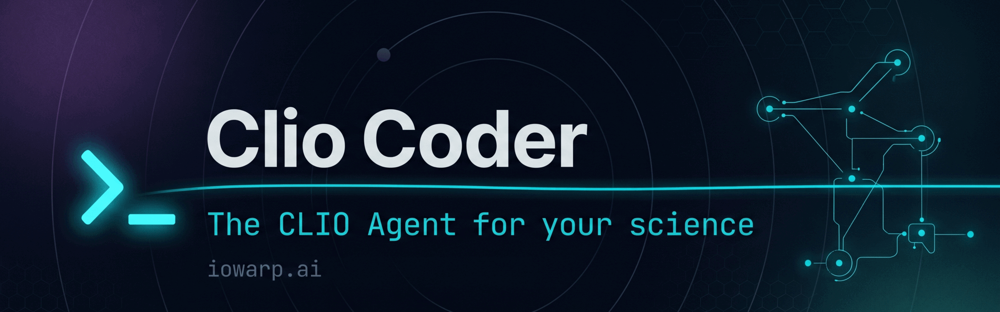

<p align="center">
  <picture>
    <source srcset="assets/banner.webp" type="image/webp" />
    
  </picture>
</p>

<h1 align="center">Clio Coder</h1>

<p align="center"><strong>The coding agent in IOWarp's CLIO ecosystem of agentic science.</strong></p>

<p align="center">
  Terminal-first. Model-flexible. Agent-aware. Built for HPC and scientific-software developers who want AI assistance on real research code without giving up review, control, or auditability.
</p>

<p align="center">
  <a href="https://github.com/iowarp/clio-coder/releases"></a>
  <a href="#install"></a>
  <a href="LICENSE"></a>
  <a href="https://github.com/iowarp/clio-coder/actions"></a>
  <a href="https://www.npmjs.com/package/@iowarp/clio-coder"></a>
  <a href="https://iowarp.ai"></a>
</p>

---

## What is Clio Coder?

Clio Coder is the coding agent in IOWarp's CLIO ecosystem of agentic science, part of the NSF-funded IOWarp project at [iowarp.ai](https://iowarp.ai). It targets HPC and scientific-software developers across research-software domains and runs as a supervised AI coding harness inside their repositories.

It gives you an interactive terminal UI, configurable local and cloud model targets, dispatchable coding agents, persistent sessions, cost receipts, and an audit trail. It is designed for developers and research teams who want AI to help inspect, plan, modify, and review code while keeping humans in control.

Clio Coder is currently in **alpha**. The current release is **v0.1.5**.

## Release 0.1.5 Alpha

This is the first public alpha release of Clio Coder. It is ready for hands-on testing by developers who are comfortable with experimental tooling, source installs, and sharp feedback loops. It is not yet a polished production assistant.

- **Interactive terminal coding.** Launch `clio` inside a repository, inspect the workspace dashboard, chat with an assistant, run slash commands, switch models, review receipts, and keep the workflow in the shell.
- **Model targets and routing.** Configure named targets for local servers, cloud APIs, and CLI-backed assistants. Probe target health, inspect available models, switch the active model from the TUI, and route worker agents through their own defaults.
- **Built-in coding agents.** Use focused agents for scouting, planning, reviewing, implementation, debugging, regression scouting, benchmarking, memory curation, evolution planning, and scientific validation.
- **Session continuity.** Resume, fork, compact, replay, and reset sessions. `clio init` and `/init` create a checked-in `CLIO.md` project guide and local fingerprint state so project context is explicit instead of being re-discovered on every turn.
- **Workspace and code context.** The dashboard and `workspace_context` tool expose cwd, project type, git state, branch, remote, and recent commits. Codewiki tools can index and query repository entry points and symbols.
- **Safety and auditability.** Default, advise, and super modes control tool access. Privileged actions require confirmation, protected artifacts are tracked, receipts record run metadata, audit JSONL captures safety-relevant events, and finish-contract advisories warn when a completion claim lacks validation evidence.
- **Evidence, eval, and memory.** Build evidence corpora from runs, sessions, receipts, audit rows, and eval results. Run local eval task files, compare baseline and candidate runs, and curate approved memory records that are injected under a fixed budget.
- **TUI polish and usage clarity.** Tool output, thinking blocks, popups, `/cost`, `/model`, `/hotkeys`, and receipt views have been hardened for long text, terminal width, local usage accounting, and clearer visual hierarchy.

See [CHANGELOG.md](CHANGELOG.md) for full detail.

### Previous Alpha Notes

- **Live tool output.** Long-running bash, grep, and shell commands now stream their output into the expanded tool block as it arrives, with a dim `(running...)` marker that disappears when the call finishes. Previously the block was empty until the command exited.
- **Bash command echo.** Successful `bash` results print `$ <command>` on its own line under the rail before the output, matching what you would see in a real terminal.
- **Thinking expansion (`Ctrl+T`).** Each assistant turn that emitted a thinking block now shows a one-line dim preview by default; press `Ctrl+T` to expand the most recent one and read the full reasoning chain. Symmetric with `Ctrl+O` for tool segments.
- **Footer git branch.** The status footer now shows `branch:<name>` when you launch from inside a git repository. One-shot at boot; no live refresh yet.
- **CI hardening.** The runner now installs `fd-find` so slash-autocomplete `@path` completion is exercised every push. The self-development mode adds a `CLIO_DEV_ALLOW_PROTECTED_BRANCH=1` opt-out for trusted contexts and tests.

Use it if you want to:

- work with AI inside a repository from the terminal;
- connect local models, cloud APIs, or CLI-backed model runtimes;
- dispatch specialized agents for exploration, planning, review, and implementation;
- resume, fork, and compact long coding sessions;
- keep receipts for completed runs, including model, token, cost, and integrity metadata;
- test a serious AI coding workflow before the system is polished.

Do not use it yet if you need a fully stable production coding assistant with a mature plugin ecosystem and zero rough edges.

---

## Why try it now?

Clio Coder is looking for its first alpha users: people willing to test it on real repositories and give precise feedback about where the workflow helps, where it breaks, and where it needs sharper ergonomics.

The most useful alpha users are:

- developers working in non-trivial repositories;
- users running local models through Ollama, LM Studio, llama.cpp, vLLM, SGLang, or OpenAI-compatible servers;
- users with cloud model API keys who want target-first model routing;
- teams that care about receipts, replay, and controlled agent execution;
- researchers building multi-agent or scientific-computing workflows.

Good alpha feedback includes the command you ran, what target/model you used, what you expected, what happened, and whether `clio doctor` or the saved receipt exposed anything useful.

---

## Core features

| Feature | What it gives you |
| --- | --- |
| Interactive terminal UI | Work with an assistant inside your repository without leaving the shell. |
| Target-first model configuration | Route chat and workers through local HTTP runtimes, cloud APIs, OAuth-backed runtimes, or CLI-backed tools. |
| Built-in coding agents | Dispatch `scout`, `planner`, `reviewer`, `worker`, and other focused agents. |
| Persistent sessions | Resume, fork, compact, and replay coding sessions. |
| Project context | Use checked-in `CLIO.md` as the canonical project guide, with `/init` and `clio init` to fold existing agent instruction files into it. |
| Safety modes | Use default, advise, or super mode to gate which tools the assistant can see. |
| Receipts and audit logs | Track completed runs, token usage, cost, tool activity, mode changes, aborts, and session park/resume events. |
| Local + cloud model support | Use a local model for private repo exploration, a cloud model for deeper reasoning, or both. |

---

## Install

### Requirements

- Node.js `>=22`
- npm
- A model target, such as:
  - a local OpenAI-compatible server;
  - Ollama, LM Studio, llama.cpp, vLLM, SGLang, or another supported local runtime;
  - a cloud API key;
  - a supported CLI-backed runtime.

### Install from source

This is the recommended alpha path.

```bash
git clone https://github.com/iowarp/clio-coder.git
cd clio-coder
git checkout v0.1.5
npm install
npm run build
npm link
clio
```

`npm link` exposes the `clio` binary from the built output. Use the latest GitHub release tag for reproducible installs, or omit `git checkout v0.1.5` if you intentionally want the current development branch. If you change the TypeScript source, run `npm run build` again before testing the linked command.

### Install from npm

The package is planned for npm distribution.

```bash
npm install -g @iowarp/clio-coder
```

Use the source install path if the npm package is not available yet.

---

## First run

Start Clio Coder from the repository you want to work on:

```bash
cd /path/to/your/repo
clio
```

On first run, Clio Coder creates its config, data, and cache directories. If no usable model target exists, it guides you into configuration.

Useful first commands:

```bash
clio configure
clio targets
clio targets --probe
clio models
clio doctor
```

For LM Studio and Ollama, prefer the native runtimes so Clio can manage the
resident-model lifecycle (eviction, `keep_alive`, GPU placement):

```bash
clio configure --runtime lmstudio-native --id lmstudio --url http://127.0.0.1:1234 --model your-model
clio configure --runtime ollama-native --id ollama --url http://127.0.0.1:11434 --model your-model
```

Existing `openai-compat` targets pointing at LM Studio or Ollama can be
migrated with `clio targets convert <id> --runtime <native>`.

For llama.cpp, vLLM, and SGLang, use the runtime that matches the server you
started:

```bash
clio configure --runtime llamacpp --id llamacpp --url http://127.0.0.1:8080 --model your-model
clio configure --runtime vllm --id vllm --url http://127.0.0.1:8000 --model your-model
clio configure --runtime sglang --id sglang --url http://127.0.0.1:30000 --model your-model
```

For OpenRouter free-model testing:

```bash
clio configure --runtime openrouter --id openrouter-free --model tencent/hy3-preview:free --api-key-env OPENROUTER_API_KEY --set-orchestrator --set-worker-default
clio targets --probe --target openrouter-free
```

A good first non-interactive test is:

```bash
clio run --agent scout "Summarize this repository layout and identify the main entry points."
```

Inside the interactive UI, try:

```text
/run scout summarize the repo structure
/run planner propose a safe first change for improving the README
/targets
/model
/cost
/receipts
```

---

## Five-minute alpha test

Use this sequence if you want to quickly decide whether Clio Coder is useful in your environment.

```bash
cd /path/to/your/repo
clio doctor
clio configure
clio targets --probe
clio run --agent scout "Map the repository: key directories, entry points, tests, and likely build commands."
clio
```

Then, inside the TUI:

```text
/run planner identify one small, low-risk improvement
/run reviewer check whether that plan is safe and complete
/receipts
/cost
```

If this fails, open an issue with:

- OS and shell;
- Node.js version;
- Clio Coder version;
- model target and model name;
- command or slash command used;
- relevant `clio doctor` output;
- receipt ID, if one was written;
- redacted logs or screenshots if helpful.

Never paste API keys, private prompts, or proprietary source code into a public issue.

---

## CLI commands

| Command | Purpose |
| --- | --- |
| `clio` | Launch the interactive terminal UI. |
| `clio configure` | Run the configuration wizard. |
| `clio init [--yes]` | Create or refresh `CLIO.md` and local project fingerprint state. |
| `clio targets` | List configured targets, health, auth, runtime, model, and capabilities. |
| `clio targets add` | Add a target interactively or through flags. |
| `clio targets use <id>` | Set chat and worker defaults to one target. |
| `clio targets remove <id>` | Remove a target. |
| `clio targets rename <old> <new>` | Rename a target id. |
| `clio models [search] [--target <id>]` | List discovered or known models. |
| `clio auth list` | Show known auth entries. |
| `clio auth status [target-or-runtime]` | Inspect auth state. |
| `clio auth login <target-or-runtime>` | Add credentials through the supported flow. |
| `clio auth logout <target-or-runtime>` | Remove stored credentials. |
| `clio doctor [--fix]` | Diagnose state; with `--fix`, repair or create missing state. |
| `clio reset [--state\|--auth\|--config\|--all]` | Reset selected Clio Coder state. |
| `clio uninstall [--keep-config] [--keep-data]` | Remove Clio Coder state and print uninstall guidance. |
| `clio agents` | List built-in agent specs. |
| `clio components [--json]` | List behavior-affecting harness components. |
| `clio components snapshot --out <path>` | Write a component snapshot JSON file. |
| `clio components diff --from <a> --to <b>` | Compare two component snapshots. |
| `clio evolve manifest init\|validate\|summarize` | Create and check typed harness change manifests. |
| `clio evidence build\|inspect\|list` | Build and inspect deterministic evidence artifacts. |
| `clio eval run\|report\|compare` | Run local eval task files and compare results. |
| `clio memory list\|propose\|approve\|reject\|prune` | Manage scoped, evidence-linked memory records. |
| `clio run [flags] "<task>"` | Dispatch one worker non-interactively and write a receipt. |
| `clio upgrade` | Check for and apply runtime upgrades. |
| `clio --version` | Print the installed version. |
| `clio --no-context-files` (alias `-nc`) | Top-level flag that skips loading `CLIO.md` project context for one invocation. |

Example:

```bash
clio run \
  --agent scout \
  --target mini \
  --model Qwen3.6-35B-A3B-UD-Q4_K_XL \
  "Find the test command and summarize the project structure."
```

---

## Interactive slash commands

Slash commands are available inside the terminal UI. Type `/` at the start of the prompt to open autocomplete.

| Command | Purpose |
| --- | --- |
| `/run <agent> <task>` | Dispatch a worker and stream its events into the transcript. |
| `/init` | Create or refresh the checked-in `CLIO.md` project guide. |
| `/targets` | Show target health, auth, runtime, model, and capabilities. |
| `/connect [target]` | Connect to a target or runtime. |
| `/disconnect [target]` | Disconnect a target or runtime when Clio owns the connection state. |
| `/model [pattern[:thinking]]` | Open the model selector or set the orchestrator model. |
| `/scoped-models` | Edit the model list used by model cycling. |
| `/thinking` | Open the thinking-level selector. |
| `/settings` | Open interactive settings controls. |
| `/resume` | Resume an existing session. |
| `/new` | Start a fresh session. |
| `/tree` | Navigate the session tree. |
| `/fork` | Branch from an earlier assistant turn. |
| `/compact [instructions]` | Compact earlier session context. |
| `/cost` | Show token and USD totals for completed runs in the session. |
| `/receipts` | Browse saved run receipts. |
| `/receipts verify <runId>` | Verify a receipt against the persisted run ledger. |
| `/help` | Show the slash-command reference. |
| `/hotkeys` | Show resolved keyboard bindings. |
| `/quit` | Exit the TUI cleanly. |

---

## Built-in agents

Clio Coder ships with built-in agent specs for common coding workflows.

| Agent | Use it for |
| --- | --- |
| `scout` | Fast repository exploration and context assembly. |
| `planner` | Turning a goal into a reviewable implementation plan. |
| `researcher` | Documentation, literature, and web-grounded investigation. |
| `reviewer` | Reviewing work against a plan or coding standard. |
| `delegate` | Routing work across multiple sub-agents. |
| `context-builder` | Building focused context bundles for downstream agents. |
| `worker` | General bounded execution tasks. |
| `memory-curator` | Proposing scoped memory records from evidence artifacts. |
| `debugger` | Explaining a failing run, session, or evidence id. |
| `regression-scout` | Finding likely regressions and targeted negative tests. |
| `middleware-author` | Drafting declarative middleware rules for review. |
| `attributor` | Mapping eval changes to keep, rollback, or inconclusive calls. |
| `evolver` | Drafting change manifests and minimal implementation plans. |
| `benchmark-runner` | Running eval suites and summarizing budget and failures. |
| `scientific-validator` | Drafting validation contracts for scientific artifacts. |

Examples:

```bash
clio run --agent scout "Find the main build, test, and lint commands."
clio run --agent planner "Plan a minimal change to add JSON output to the CLI."
clio run --agent reviewer "Review the current diff for correctness and regressions."
```

Agent specs are Markdown files with frontmatter. Built-ins live under:

```text
src/domains/agents/builtins/
```

---

## Model targets and runtimes

Clio Coder is target-first. A target describes how to reach a model and what capabilities it has.

| Group | Examples |
| --- | --- |
| Featured / subscription | `openai-codex` |
| Cloud APIs | `anthropic`, `openai`, `google`, `groq`, `mistral`, `openrouter`, `bedrock`, `deepseek` |
| Local HTTP | `openai-compat`, `lmstudio-native`, `ollama-native`, `llamacpp`, `vllm`, `sglang`, `lemonade` |
| CLI runtimes | `codex-cli`, `claude-code-cli`, `gemini-cli`, `copilot-cli`, `opencode-cli` |
| SDK runtimes | `claude-code-sdk` (Claude Agent SDK worker path) |

Runtime tiers:

| Tier | Meaning |
| --- | --- |
| `protocol` | HTTP targets that speak a supported model API protocol. |
| `cloud` | Managed API providers with API-key, OAuth, or platform auth. |
| `local-native` | Local model runtimes reached through native HTTP or SDK surfaces. |
| `cli-gold`, `cli-silver`, `cli-bronze`, `cli` | CLI-backed runtimes launched through installed command-line tools. |
| `sdk` | In-process SDK worker paths such as the Claude Agent SDK. |

Inspect target state with:

```bash
clio targets
clio targets --probe
clio models
```

---

## Configuration

Clio Coder reads `settings.yaml` from the platform config directory by default:

| Platform | Default config path |
| --- | --- |
| Linux | `~/.config/clio/settings.yaml` |
| macOS | `~/Library/Application Support/clio/settings.yaml` |
| Windows | `%APPDATA%/clio/settings.yaml` |

You can isolate state with environment variables:

| Env var | Purpose |
| --- | --- |
| `CLIO_HOME` | Optional single-tree root for all Clio Coder state. |
| `CLIO_CONFIG_DIR` | Location of `settings.yaml`. |
| `CLIO_DATA_DIR` | Receipts, ledgers, sessions, audit logs, evidence, evals, and memory. |
| `CLIO_CACHE_DIR` | Transient cache location. |
| `ANTHROPIC_API_KEY` | Enables Anthropic-backed targets when configured. |
| `OPENAI_API_KEY` | Enables OpenAI-backed targets when configured. |
| `OPENROUTER_API_KEY` | Enables OpenRouter-backed targets when configured. |

Example local target configuration:

```yaml
version: 1

targets:
  - id: mini
    runtime: openai-compat
    url: http://127.0.0.1:8080
    defaultModel: Qwen3.6-35B-A3B-UD-Q4_K_XL
    capabilities:
      contextWindow: 262144
      reasoning: true

orchestrator:
  target: mini
  model: Qwen3.6-35B-A3B-UD-Q4_K_XL
  thinkingLevel: off

workers:
  default:
    target: mini
    model: Qwen3.6-35B-A3B-UD-Q4_K_XL
    thinkingLevel: off

scope:
  - mini

compaction:
  threshold: 0.8
  auto: true

retry:
  enabled: true
  maxRetries: 3
  baseDelayMs: 2000
  maxDelayMs: 60000
```

Credentials can come from environment variables referenced by `targets[].auth.apiKeyEnvVar`, or from Clio Coder’s credential store through:

```bash
clio auth login <target-or-runtime>
```

---

## Project context

Clio Coder uses `CLIO.md` as the canonical project guide. Before each interactive turn, it loads the nearest applicable `CLIO.md` and includes that guidance in the prompt unless `--no-context-files` is set.

Run `/init` in the TUI or `clio init` from the shell to create or refresh this file. During init, Clio can read existing agent instruction files and fold their useful content into `CLIO.md` so the repository has one explicit source of guidance:

```text
CLAUDE.md
AGENTS.md
CODEX.md
GEMINI.md
```

Clio stores local fingerprint state under `.clio/state.json` so it can warn when `CLIO.md` no longer matches the current project state and should be refreshed.

To skip project context for a single invocation:

```bash
clio --no-context-files
clio -nc run --agent scout "..."
```

Use these files to tell Clio Coder and other AI agents how to work in your repository.

Example `CLIO.md`:

```markdown
# Agent instructions

- Use `npm run ci` before claiming the repo is healthy.
- Prefer small, reviewable changes.
- Do not edit generated files under `dist/`.
- Do not change public APIs without an explicit plan.
- Keep documentation examples synchronized with CLI behavior.
- When uncertain, inspect the source instead of guessing.
```

This is the best place to encode repository-specific rules, test commands, style constraints, forbidden paths, review requirements, and release procedures.

---

## Safety model

Clio Coder is designed for supervised work. It does not treat the model as an unrestricted shell user.

| Mode | Behavior |
| --- | --- |
| `default` | Read, write, edit, bash, search, and dispatch tools are visible. |
| `advise` | Read-oriented mode. Filesystem mutation is disabled. |
| `super` | Allows privileged writes outside the working directory. Requires explicit confirmation. |

Key safety behavior:

- `Alt+S` opens the super-mode confirmation overlay.
- Dangerous Bash patterns are blocked by hardcoded damage-control rules.
- Known blocked patterns include commands like `rm -rf /`, force-pushing `main`, and raw `dd` writes to block devices.
- Bash subprocess abort escalates from `SIGTERM` to `SIGKILL` after a grace period.
- Tool and bash activity is rendered into the transcript with status, elapsed time, and command previews.

The damage-control rules live in:

```text
damage-control-rules.yaml
```

---

## Sessions, replay, and context compaction

Interactive sessions persist under:

```text
<dataDir>/sessions/
```

Sessions are append-only JSONL with tree metadata. This supports:

- resuming previous sessions;
- replaying rich transcript entries;
- forking from earlier assistant turns;
- compacting old context;
- preserving bash, tool, summary, checkpoint, and branch entries when durable entries exist.

Useful commands:

```text
/resume
/new
/tree
/fork
/compact
```

Automatic compaction can be enabled in settings:

```yaml
compaction:
  threshold: 0.8
  auto: true
```

Manual compaction:

```text
/compact summarize previous implementation details but keep API decisions and test failures
```

---

## Receipts, cost, and auditability

Every completed run writes a receipt to:

```text
<dataDir>/receipts/<runId>.json
```

A receipt records:

- run id;
- model and target;
- token counts;
- estimated USD cost;
- tool statistics;
- integrity metadata;
- a SHA-256 hash over receipt fields plus the matching run ledger entry.

Use:

```text
/receipts
/receipts verify <runId>
/cost
```

Clio Coder also writes structured audit rows under:

```text
<dataDir>/audit/YYYY-MM-DD.jsonl
```

Audit entries cover classified tool calls, mode transitions, run aborts, and session park/resume events.

---

## Keybindings

| Binding | Action |
| --- | --- |
| `Shift+Tab` | Cycle thinking level. |
| `Alt+M` | Cycle mode: `default` / `advise`. |
| `Alt+S` | Open the super-mode confirmation overlay. |
| `Alt+T` | Open the session tree navigator. |
| `Ctrl+L` | Open the model selector. |
| `Ctrl+P` | Cycle the scoped model set forward. |
| `Shift+Ctrl+P` | Cycle the scoped model set backward. |
| `Ctrl+B` | Toggle the dispatch-board overlay. |
| `Ctrl+O` | Toggle the most recent tool segment between collapsed subline and full body. |
| `Ctrl+C` | Cancel a stream, clear input, or press twice to exit. |
| `Ctrl+D` | Exit. |
| `Esc` | Cancel a stream or close the active overlay. |

Run this inside the TUI for the resolved binding table:

```text
/hotkeys
```

---

## Troubleshooting

| Problem | Try this |
| --- | --- |
| `clio: command not found` | Run `npm run build && npm link` from the Clio Coder source tree. |
| No model target is available | Run `clio configure`, then `clio targets --probe`. |
| Local model does not respond | Confirm the local runtime is running and that the target URL is correct. |
| Cloud model auth fails | Check `clio auth status <target>` and verify the relevant API key or login flow. |
| Source changes do not appear | Re-run `npm run build`; the linked CLI points at `dist/`. |
| Session replay looks incomplete | Confirm durable session entries exist for the relevant tool, bash, or display activity. |
| State appears corrupted | Run `clio doctor`; if needed, run `clio doctor --fix`. |
| You need a clean start | Use `clio reset --state`, `--auth`, `--config`, or `--all` depending on what you want to remove. |

For issue reports, include:

```bash
clio --version
node --version
clio doctor
clio targets
```

Redact secrets and private repository content.

---

## For AI agents and coding assistants reading this README

You are reading the product README for **Clio Coder**.

Use these instructions when helping a user with this repository or with Clio Coder itself:

1. Refer to the product as **Clio Coder** and the CLI binary as `clio`.
2. Treat the project as alpha software. Do not imply production stability.
3. Prefer the source install path unless npm availability has been explicitly confirmed.
4. Do not invent unsupported commands, runtimes, plugins, or capabilities.
5. When explaining configuration, use the target-first model: `targets[]`, then `orchestrator`, then `workers.default`.
6. When helping with a repository that uses Clio Coder, inspect `CLIO.md` before proposing changes. If a repository still has older agent instruction files, recommend `/init` or `clio init` to fold them into `CLIO.md`.
7. Keep safety modes distinct: `default`, `advise`, and `super`.
8. Recommend `clio doctor`, `clio targets --probe`, and receipts when debugging.
9. For repo edits, prefer small, reviewable patches and state which command should validate the change.
10. Do not tell users to paste API keys, private source code, or proprietary prompts into public issues.
11. If asked to summarize this README, preserve the alpha status, install path, model-target concept, safety model, and receipt/audit features.
12. If asked to generate documentation for Clio Coder, keep the tone technical and direct. Avoid hype.

---

## Development

Most users do not need this section. It is for contributors.

| Script | Purpose |
| --- | --- |
| `npm run ci` | Full repo gate: typecheck, lint, tests, build, and e2e tests. |
| `npm run typecheck` | Strict TypeScript pass. |
| `npm run format` | Biome formatting pass. |
| `npm run lint` | Biome checks. |
| `npm run test` | Unit, integration, and boundary tests. |
| `npm run test:e2e` | Build first, then run end-to-end tests. |
| `npm run build` | Production bundle through `tsup`. |
| `npm run dev` | `tsup --watch`. |
| `npm run clean` | Remove `dist/`. |
| `npm run hooks:install` | Install the optional pre-commit hook. |

Core source areas:

```text
src/cli/           CLI entry points
src/interactive/   terminal UI
src/engine/        model/provider engine boundary
src/worker/        worker dispatch and runtime rehydration
src/domains/       domain logic and built-in agent specs
src/harness/       contributor-facing self-development harness
tests/             unit, integration, boundary, and e2e tests
```

Contributor rules live in:

```text
CONTRIBUTING.md
CLIO.md
```

---

## Architecture notes

Clio Coder keeps model execution, worker dispatch, interactive UI state, and domain logic separated.

Boundary tests enforce three rules at build time:

1. **Engine boundary.** Only `src/engine/**` value-imports `@mariozechner/pi-*`. Type-only imports are allowed anywhere.
2. **Worker isolation.** `src/worker/**` never imports `src/domains/**` except `src/domains/providers`, which carries pure runtime descriptors the worker rehydrates from stdin.
3. **Domain independence.** `src/domains/<x>/**` never imports another domain's `extension.ts`. Cross-domain traffic flows through `SafeEventBus`.

This keeps provider-specific code contained and the system easier to reason about as more runtimes and agents are added.

---

## Roadmap

Current release:

- **v0.1.5** (alpha). First public alpha release. Highlights: interactive terminal coding, target-first model routing, built-in coding agents, persistent sessions, checked-in `CLIO.md` project context, workspace orientation, codewiki lookup tools, safety modes, receipts, audit logs, evidence and eval workflows, scoped memory, clearer usage accounting, and polished TUI popups.
- **v0.1.4** (alpha). Highlights: workspace orientation in the welcome dashboard plus a `workspace_context` tool, component snapshots and diffs, typed evolve manifests, deterministic evidence corpora, local eval run/report/compare, scoped long-term memory injected into orchestrator and workers under a fixed budget, declarative middleware with tool-surface enforcement, protected-artifact safety, finish-contract advisories, eight new specialist agents, doctor migration from `llamacpp-completion` to `llamacpp`, compaction parity, and consistent `--help` across every subcommand.
- **v0.1.3** (alpha). Highlights: live tool-output streaming inside the expanded tool block with a dim `(running...)` marker, bash subrenderer that echoes `$ <command>` before its output, `Ctrl+T` to expand an assistant turn's thinking block (symmetric with `Ctrl+O`), footer git-branch indicator resolved once at boot, autocomplete `fd`/`fdfind` resolver fix, and a self-dev `CLIO_DEV_ALLOW_PROTECTED_BRANCH=1` opt-out for trusted contexts.
- **v0.1.2** (alpha). Highlights: transient provider/stream retry with cancel-aware countdowns and persisted recovery, bash abort that escalates `SIGTERM` to `SIGKILL` after a grace period, structured tool and bash transcript rendering with `Ctrl+O` expand toggle and edit-tool diff preview, mode-colored editor rails, slash-command autocomplete, welcome dashboard at TUI launch, per-tool stats in run receipts, five-arm audit JSONL (tool calls, mode changes, run aborts, session park/resume), reasoning probe state surfaced in `clio targets --json`, provider catalog aligned with pi SDK 0.70.2, and `/thinking` plus `clio run` working against local `openai-compat` and LM Studio backends.

Near-term direction:

- broader runtime hardening;
- MCP support;
- better first-run and target setup ergonomics;
- more complete context and resource loading;
- stronger docs for local model workflows;
- expanded CLIO Core and CLIO Agent integration.

Longer horizon:

- first-class multi-agent coding workflows;
- deeper scientific-computing recipes;
- composition with CLIO Agent;
- integration with CLIO Core context storage.

---

## Lineage

Clio Coder is part of the IOWarp CLIO family.

Related projects:

- [clio-core](https://github.com/iowarp/clio-core): Chimaera-based context storage runtime.
- [clio-kit](https://github.com/iowarp/clio-kit): MCP servers for scientific data, including HDF5, Slurm, ParaView, Pandas, ArXiv, NetCDF, FITS, Zarr, and more.

Clio Coder is the code-focused sibling: usable as a standalone terminal coding harness and designed to compose into broader CLIO Agent workflows.

---

## License

Apache-2.0. See [LICENSE](LICENSE).
