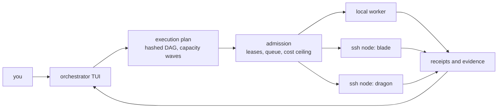
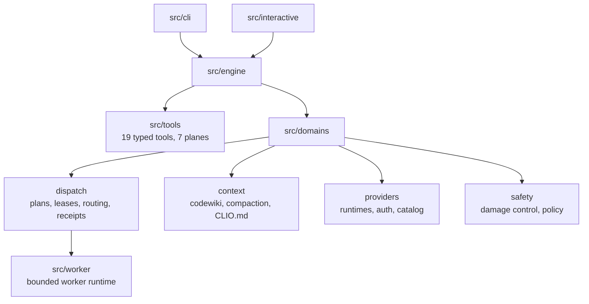

<p align="center">
  <picture>
    <source srcset="https://raw.githubusercontent.com/iowarp/clio-coder/main/assets/banner.webp" type="image/webp" />
    
  </picture>
</p>

<h1 align="center">Clio Coder</h1>

<p align="center"><strong>A supervised coding agent for research software, built to run on your models, on your machines, with a receipt for everything it did.</strong></p>

<p align="center">
  <a href="https://github.com/iowarp/clio-coder/releases/latest"></a>
  <a href="https://github.com/iowarp/clio-coder/actions/workflows/ci.yml"></a>
  <a href="#requirements">=22.19" src="https://img.shields.io/badge/node-%3E%3D22.19-147366?style=flat-square" /></a>
  <a href="LICENSE"></a>
  <a href="https://iowarp.ai"></a>
  <a href="https://www.nsf.gov/awardsearch/showAward?AWD_ID=2411318"></a>
</p>

---

Clio Coder is a terminal coding agent for people who work on real scientific
and HPC codebases: simulation kernels, data pipelines, numerical libraries,
build systems that take twenty minutes and break in ways no cloud model has
ever seen.

You bring the model. A local llama.cpp, Ollama, LM Studio, vLLM, or SGLang
server; a cloud API; your ChatGPT or Claude subscription; or an Argonne
Leadership Computing Facility inference gateway. Clio brings the harness
around it: a terminal UI, nineteen typed tools instead of an unrestricted
shell, a fleet of bounded worker agents that can run across your whole
cluster over SSH, durable sessions, and an integrity-sealed receipt for every run.

CLIO stands for Context Layer for Input/Output. Clio Coder is the interactive
coding agent in IOWarp's ecosystem of agentic science, named for the Greek
muse of history and built by the Gnosis Research Center at Illinois Tech.

### Pick your path

|  | You are | Start here |
| --- | --- | --- |
| 🔬 | A researcher or developer who wants to use it | [Install](#install) → [Five-minute start](#five-minute-start) → [Bring your own model](#bring-your-own-model) |
| 🤖 | An AI agent that just landed in this repository | [For agents](#for-agents) |
| 🛠️ | A developer who wants to contribute | [For contributors](#for-contributors) |

---

## Why Clio is different

Most coding agents ask you to trust a remote model with a shell. Clio makes a
different bet: the harness should be strong enough that a 20B model running on
your own GPU is useful, and honest enough that you can reconstruct every
decision afterward.

**The model never gets a shell by default.** The tool surface is nineteen
typed tools organized into seven policy planes. Bash is default-deny, filtered
through [damage-control rules](damage-control-rules.yaml) and per-project
policy. Reads are bounded, writes are queued and reviewable, and every
privileged call passes through one admission path that cannot be widened by
the model asking nicely.

**Local models are the design target, not a fallback.** llama.cpp and similar
servers expose a single prefix-cache slot. Clio keeps the compiled prompt and
provider tool schemas byte-stable so that slot stays hot across turns and
sessions, bounds every tool result so one `grep` cannot blow the window, and
records a per-call cache verdict (`hot`, `partial`, `cold`, `small`) in the
session ledger so you can see when and why the cache went cold.

**Work is delegated to bounded workers, not to one long context.** The
orchestrator dispatches focused agents with explicit tool profiles, call
budgets, cost ceilings, and typed result contracts. A worker that cannot
produce a conforming answer fails loudly instead of returning confident prose.

**Your cluster is the runtime.** Declare your nodes and the same worker
protocol tunnels over SSH. A remote worker gets the same prompts, the same
safety matrix, the same receipts. Placement is deterministic and pinnable, and
capacity is governed by durable expiring leases that survive process death.

**Everything is auditable.** Each run seals a receipt covering token usage,
priced cost, tool activity, safety decisions, routing intent, the resolved
route, worker attestation, and result-contract conformance. `clio evidence`
and `/view verify` check them; nothing in the audit trail is reconstructed
from prose.

**Science is a first-class domain.** [clio-kit](https://github.com/iowarp/clio-kit)
contributes MCP servers for HDF5, Slurm, ParaView, Pandas, NetCDF, FITS, Zarr,
and ArXiv, and the shipped skills catalog includes scientific debugging and
experiment-protocol guides.

---

# For humans

## Requirements

- Node.js `>=22.19.0` and npm
- Linux or macOS. Windows is best effort until a stable release.
- At least one model target: a local OpenAI-compatible server, Ollama, LM
  Studio, llama.cpp, vLLM, SGLang, a cloud API key, a ChatGPT or Claude
  subscription login, an ALCF Globus account, or an installed `claude` command

## Install

```bash
git clone https://github.com/iowarp/clio-coder.git
cd clio-coder
npm run install:local
hash -r
clio --version
```

`npm run install:local` verifies dependencies, builds the CLI, installs a
symlink at `${CLIO_BIN_DIR:-$HOME/.local/bin}/clio`, and runs the installed
CLI's structure repair so a fresh install passes plain `clio doctor` with no
manual steps. It warns if the bin directory is not on your `PATH`. The symlink
executes `dist/cli/index.js`, so re-run `npm run build` after editing
TypeScript sources.

To remove it, preview first:

```bash
clio uninstall --dry-run
clio uninstall --remove-binary --force
hash -r
```

For selective wipes that keep settings or credentials, use `clio reset`. Full
details live in [docs/installation-and-lifecycle.md](docs/installation-and-lifecycle.md).

## Five-minute start

Run Clio from the repository you want to work on and point one target at a
running model server. This example uses LM Studio; other local runtime ids
include `ollama-native`, `llamacpp`, `vllm`, and `sglang`.

```bash
cd /path/to/your/repo

clio configure \
  --id local-lmstudio \
  --runtime lmstudio-native \
  --url http://localhost:1234 \
  --model your-model-id \
  --set-orchestrator \
  --set-fleet-default

clio targets use local-lmstudio
clio targets --probe
```

Once the target probes healthy, teach Clio about your project, try a headless
turn, then open the TUI:

```bash
clio context init      # writes a checked-in CLIO.md grounded in your real source tree
clio run "Summarize this repository layout and identify the main entry points."
clio                   # interactive terminal UI
```

Inside the TUI, `/targets`, `/agents`, `/fleet`, and `/skill` confirm what the
session can see. `/help` opens the interactive help center.

## Bring your own model

Clio treats models as named **targets**. A target is a runtime plus an
endpoint plus a model plus credentials, and you can route interactive chat and
fleet dispatch through different targets independently.

### Local runtimes

| Runtime id | Server |
| --- | --- |
| `llamacpp`, `llamacpp-anthropic`, `llamacpp-completion` | llama.cpp and llama-swap routers |
| `lmstudio-native` | LM Studio |
| `ollama-native` | Ollama |
| `vllm`, `sglang` | vLLM and SGLang |
| `lemonade`, `lemonade-anthropic` | Lemonade |
| `openai-compat`, `anthropic-compat` | Any OpenAI- or Anthropic-shaped endpoint |

### Cloud APIs

`openai`, `anthropic`, `google`, `groq`, `mistral`, `deepseek`, `openrouter`,
`bedrock`, and `alcf` for Argonne's Sophia and Metis gateways over Globus
OAuth. See [docs/alcf-provider.md](docs/alcf-provider.md) for the HPC path.

### Subscriptions

You can drive Clio from a ChatGPT Plus/Pro or Claude Pro/Max subscription
instead of an API key.

```bash
clio auth login anthropic-max     # Claude Pro/Max OAuth
clio auth login openai-codex      # ChatGPT Plus/Pro OAuth

clio configure --id claude-sub  --runtime anthropic-max --model claude-sonnet-5 --set-orchestrator
clio configure --id chatgpt-sub --runtime openai-codex  --model gpt-5.4        --set-orchestrator
```

Pick model ids from `clio models --target <id>` after login.

> [!NOTE]
> Connecting a Claude Pro/Max subscription over OAuth uses the same path as
> Claude Code. Using subscription credentials outside a vendor's first-party
> apps may not align with their terms of service. Enable at your own
> discretion.

### Subscription-backed workers

Clio can also drive other coding agents as workers while keeping its own
permission gating in front of them.

```bash
claude auth login   # authenticate the official Claude CLI first

# Claude Code SDK worker, with enforced per-tool safety
clio configure --id claude-sdk-worker --runtime claude-sdk --model sonnet --set-fleet-default

# claude -p subprocess worker, advisory permission-mode gating only
clio configure --id claude-code-worker --runtime claude-code --model sonnet

# Google Antigravity subprocess worker, under your existing agy login
clio configure --id agy-worker --runtime antigravity-code --model "Gemini 3.5 Flash (High)"
```

### Mixing them

The interesting configuration is a strong orchestrator with cheap local
muscle, or the reverse.

```bash
clio configure --id chatgpt-orch --runtime openai-codex --model gpt-5.4 --set-orchestrator
clio configure --id claude-worker --runtime claude-sdk --model sonnet
clio configure --id local-fleet --runtime lmstudio-native --url http://localhost:1234 \
  --model qwen-7b --set-fleet-default

clio targets profile claude-sdk claude-worker --model sonnet
clio run --agent coder "Refactor src/engine/parser.ts"
```

Full reference: [docs/configuration-and-targets.md](docs/configuration-and-targets.md).

### Keeping a scout model resident

Fast scout agents work best when a small scout model is already loaded beside
your main coding model on a local router. This is only safe when the combined
weights, KV caches, context windows, and parallel slots fit in GPU memory. If
the router spills into CPU RAM, both scout calls and main turns get slow.

Load both models manually on the target host, then point the orchestrator and
the scout worker profile at them. On llama.cpp routers, keep `max_instances`
at least as high as the number of models you want resident. Clio can see which
router instances are loaded and the router's instance limit, but current
llama.cpp router responses do not expose free VRAM, so confirming the loaded
set fits remains the operator's job. Workers on other nodes are unaffected.

## Safety and autonomy

There is one tool surface and one admission path. What changes is the autonomy
level, set in `/settings` or overridden for a single run with `--autonomy`.

| Level | Behavior |
| --- | --- |
| `read-only` | Inspection only. Every mutation and execution is denied. |
| `suggest` | Mutations are proposed and parked for your approval. |
| `auto-edit` | File edits proceed; execution and dispatch still gate. |
| `full-auto` | Approved classes proceed unattended, still inside damage-control rules. |

Notices name their mechanism so you always know who stopped a call:
`[safety-net]` for level-independent blocks, `[approval]` for parked calls,
`[autonomy]` for read-only denials, and `[middleware]` for hook diagnostics.

Workers can never exceed the orchestrator's authority. A dispatch request can
only narrow it, and reviewers and judges always run read-only. Details:
[docs/safety-model.md](docs/safety-model.md).

## The fleet: one machine or your whole cluster

Clio's orchestrator delegates work to bounded workers. With a fleet declared,
those workers run on other machines over SSH while every guarantee holds: one
admission path, one autonomy matrix, one receipt chain.


```mermaid
flowchart LR
  U["you"] --> O["orchestrator TUI"]
  O --> P["execution plan<br/>hashed DAG, capacity waves"]
  P --> A["admission<br/>leases, queue, cost ceiling"]
  A --> L["local worker"]
  A --> S1["ssh node: blade"]
  A --> S2["ssh node: dragon"]
  L --> R["receipts and evidence"]
  S1 --> R
  S2 --> R
  R --> O
```

Declare nodes in `settings.yaml` and the implicit `local` node is always
present:

```yaml
fleet:
  nodes:
    - id: blade
      host: blade.example.net
      maxWorkers: 2
      residency: observe
    - id: dragon
      host: dragon.example.net
      maxWorkers: 1
```

Then `clio doctor` runs a per-node preflight, `clio fleet list|run|status`
drives contracts, and the `/fleet` overlay shows nodes, profiles, bindings,
and live runs. Nodes must share the project filesystem at the same absolute
path; hosts that do not fail admission with a clear reason. Target URLs
resolve on the node the worker runs on, so `localhost` means that node's own
inference server and there is no central proxy.

Everything you need to reproduce it end to end, including a recorded
multi-node demo script, is in [docs/fleet-dispatch.md](docs/fleet-dispatch.md)
and [docs/fleet-demo-runbook.md](docs/fleet-demo-runbook.md).

Routing is measured but conservative. Every dispatch records a joint decision
over agent, target, model, runtime, and node, while shadow mode leaves the
explicit route unchanged. Operators can activate only named read-only and
quality roles, and only after the exact tuple has enough integrity-valid
quality, reliability, cost, freshness, and decision-latency evidence:

```yaml
routing:
  activeRoles: [researcher, verifier, reviewer, judge]
  activePostures: [quality, balanced]
  agentAutomation:
    activeAgentRoles: [] # stays advisory until exact agent/role pairs are named
```

Manual pins and `failover: none` remain exact. Active mode fails closed when
no route is ready. `agent: auto` is separately bounded by recipe audience,
authority, tools, skills, result contract, locality, and approved governance;
changing from a read-only Scout phase to workspace editing requires an
authenticated plan approval or authority already granted by full-auto policy.

## Project context: CLIO.md

Clio loads a checked-in `CLIO.md` as the canonical project guide on every
session. `clio context init` bootstraps one by exploring your actual source
tree, and it can adopt existing `CLAUDE.md`, `AGENTS.md`, `GEMINI.md`, Cursor,
and Copilot context with provenance and conflict reporting.

This repository's own [CLIO.md](CLIO.md) is the maintained reference example
of the format: one identity paragraph, a short list of verifiable conventions,
build-enforced hard invariants, and dense sections covering architecture
boundaries, workflow traps, and artifact policy.

Alongside it, `clio context index` builds a structural codewiki that the
`code_nav` tool navigates, so a model can find a symbol without reading half
the repository into its window.

## Skills

Skills are reusable `SKILL.md` guides the model loads on demand. Clio
discovers them from per-user and per-project roots, including `.clio/skills`
and cross-harness layouts such as `.claude/skills` and `.codex/skills`. A
skill's `allowed-tools` declaration is enforced at tool admission, and a skill
can ship executable RED-GREEN evals that `clio skills eval <name>` runs
instead of trusting the prose.

This repository ships a curated catalog under [skills/](skills/README.md) with
provenance frontmatter, evals, and content hashes pinned in
`skills/registry.yaml`, so an installed copy verifies against its audited
source at activation. Nothing auto-loads.

```bash
clio skills install context-handoff   # copy into .clio/skills
clio skills list                      # confirm Clio sees it
```

The catalog includes [`find-skills`](skills/find-skills/), which routes
discovery through `clio skills search` and `clio skills install`. Install it
with `clio skills install find-skills --user` so it outranks the community
skill of the same name that other installers drop into compat roots.

## Memory that survives long tasks

Long agentic runs decay: a requirement or a failed attempt is still in the
transcript but no longer influences the next action. Clio's proactive task
memory watches tool and lifecycle hooks, keeps a session task bank, and
surfaces visible advisory reminders at trigger boundaries.

The default tier is rules-only and makes no model calls. An LLM memory tier is
opt-in through an independent background route. The action agent's prompt and
tool surface never change, `/memory` inspects the bank, and disabling
`memory.intervention.enabled` removes the whole mechanism. Durable lessons are
separate, scoped, evidence-linked, and managed through `clio memory
list|propose|approve|reject|prune`. Design notes:
[docs/proactive-memory.md](docs/proactive-memory.md).

## Status

Clio Coder is alpha software distributed from source. The current release is
**v0.2.9**. Interfaces may still move between minor versions, and
model-specific behavior varies by target.

Release notes live in the [CHANGELOG](CHANGELOG.md), the detailed developer
log lives in [DEVLOG.md](DEVLOG.md), and every release is gated by the
deterministic `npm run ci:release` suite.

## Troubleshooting

| Problem | Try this |
| --- | --- |
| `clio: command not found` | Run `npm run install:local`, then `hash -r`; confirm `${CLIO_BIN_DIR:-$HOME/.local/bin}` is on `PATH`. |
| No model target is available | Run `clio configure`, then `clio targets --probe`. |
| Local model does not respond | Confirm the local runtime is running and the target URL is correct. |
| Cloud model auth fails | Check `clio auth status <target>` and verify the API key or login flow. |
| A fleet node never gets work | Run `clio doctor`; per-node preflight reports filesystem parity and target facts. |
| Source changes do not appear | Re-run `npm run build`; the linked CLI points at `dist/`. |
| State appears corrupted | Run `clio doctor`, then `clio doctor --fix`. |

When filing an issue, include the output of `clio --version`, `node
--version`, `clio doctor`, and `clio targets`. Redact secrets, private
prompts, logs, and proprietary code.

---

# For agents

If you are an AI agent operating inside this repository or driving Clio as a
tool, this section is the orientation you need.

## Orienting in this repository

Do not read broadly. Start from the codewiki, which indexes 927 source files.
Use `code_nav` in `entries`, `path`, or `symbol` mode before any wide read.
The indexed entry points are `src/cli/index.ts`, `src/domains/agents/index.ts`,
`src/domains/components/index.ts`, `src/domains/config/index.ts`,
`src/domains/context/bootstrap.ts`, `src/domains/context/index.ts`,
`src/domains/dispatch/index.ts`, and `src/domains/eval/index.ts`. Read
[CLIO.md](CLIO.md) first; it carries the invariants that are enforced at build
time and the traps that are not obvious from the source.

## The tool surface

Nineteen tools in seven planes. Each plane is one policy unit covering action
class, size posture, result schema, and concurrency rule.

| Plane | Tools | Posture |
| --- | --- | --- |
| OBSERVE | `read`, `grep`, `find`, `ls`, `code_nav`, `context`, `credential_present` | Read class, parallel, bounded by a truncation envelope |
| MUTATE | `write`, `edit` | Write class, sequential, queued through the file-mutation queue |
| EXECUTE | `bash`, `git`, `verify` | Containment posture; `bash` is default-deny, `git` is read-only inspection |
| ORCHESTRATE | `dispatch`, `monitor`, `steer`, `tasks` | Dispatch class, sequential except read-only `monitor` |
| RETRIEVE | `web_fetch` | Network read, parallel |
| INTERACT | `ask_user` | Host-owned operator interview |
| ARTIFACT | `artifact` | Plans, reviews, and reports as durable artifacts |

Every observation carries a truncation envelope with offload paths and next
hints, so a large result is bounded rather than silently cut. Full parameter
and payload reference: [docs/tool-usage.md](docs/tool-usage.md).

## Dispatch topologies

All topologies go through the same tool, admission chain, and autonomy matrix.

| Topology | Invocation | Semantics |
| --- | --- | --- |
| Singular | `task: "..."` | One assignment, with an optional separate `briefing`. |
| Parallel | `tasks: [...]` | Fan out, wait for all, one summary. |
| Sequential | `mode: "sequential"` | One at a time, stop reporting on timeout or abort. |
| Pipeline | `mode: "pipeline"` | Each step receives the previous step's output as data. |
| Detached | `detach: true` | Return assignment ids immediately and collect later. |
| Review gate | `review: {reviewer?, max_cycles?}` | Builder, read-only verifier verdict, bounded revise loop. |
| Compete | `mode: "compete", candidates: 2..4` | N candidates in scratch worktrees, read-only judge, winner applied. |

Detached batches are durable, so collection survives session exit. Use
`monitor` with `mode="collect"` as the authoritative terminal barrier over a
batch, and collect every detached batch before final synthesis.

## Execution roles and typed results

Every dispatch carries an `ExecutionRole`: `builder`, `reviewer`, `judge`,
`researcher`, `verifier`, or `recovery`. The role is typed on every request,
ledger envelope, receipt, route candidate, plan task, and route decision.
Route statistics never mix roles, and any attempt after the first is
`recovery`.

Workers answer typed terminal contracts, not trailing prose. A `scout-report`
carries findings as `{claim, path, line}`, and grounding is structural rather
than a regex over prose: a cited line must fall inside a span this run
actually read, so an estimated line number cannot pass as an observation. A
worker validates its own result and spends a bounded number of repair rounds
before failing the run; the orchestrator's sealed validation is the authority.

Review and compete gates default to the builtin `verifier` and never fall back
to the builder agent. A gate decider's postcondition is the gate result
contract, not its own recipe contract.

## The built-in fleet

`architect`, `coder`, `tester`, `verifier`, `debugger`, `documenter`, `scout`,
`researcher`, and `provenance`. Each is a versioned frontmatter recipe with an
explicit tool profile, call and cost budget, and result contract. Malformed
custom recipes are quarantined with a diagnostic; malformed builtins fail
startup. Reference: [docs/built-in-agents.md](docs/built-in-agents.md).

## Programmatic interfaces

```bash
clio run "<task>" --json                 # one headless turn, JSONL events
clio run "<task>" --agent coder          # one explicit fleet agent, writes a receipt
clio acp                                 # serve ACP v1 over stdio for ACP frontends
clio fleet run <contract>                # run a fleet DAG contract
clio evidence build|inspect|list         # deterministic evidence artifacts
clio eval validate|run|report|compare|gate
```

Dispatch can also delegate to external ACP agents while Clio mediates
permissions. Clio implements the
[Agent Client Protocol](https://agentclientprotocol.com) so the engine stays
decoupled from IDE frontends.

## What gets recorded

Every run seals a receipt. Receipt integrity is at v12 and covers normalized
routing intent, the resolved route, worker attestation, priced cost, phase
timing, tool activity, safety decisions, and result-contract conformance.
Gate decisions are v2 artifacts that seal route correlation across agent,
target, model family, runtime, and node, and they cross a staged durable
boundary rather than being written directly.

A worker attests its protocol version, pid, process-group id, host, settings
fingerprint, WorkerSpec digest, runtime, target, endpoint identity hash, wire
model, effective tool signature, and bounded resource facts before any model
call. Any drift from the approved identity kills the worker.

Verify from the TUI with `/view verify <runId>`, or from the shell with `clio
evidence inspect`. See [docs/observability.md](docs/observability.md).

---

# For contributors

Contributions are welcome, and the fastest way in is to fix something you hit
while using it on your own research code.

## Architecture at a glance


```mermaid
flowchart TB
  CLI["src/cli"] --> ENG["src/engine"]
  TUI["src/interactive"] --> ENG
  ENG --> TOOLS["src/tools<br/>19 typed tools, 7 planes"]
  ENG --> DOM["src/domains"]
  DOM --> DISP["dispatch<br/>plans, leases, routing, receipts"]
  DOM --> CTX["context<br/>codewiki, compaction, CLIO.md"]
  DOM --> PROV["providers<br/>runtimes, auth, catalog"]
  DOM --> SAFE["safety<br/>damage control, policy"]
  DISP --> WORK["src/worker<br/>bounded worker runtime"]
```

The largest indexed areas are `src/domains` (392 files), `tests/contracts`
(236), `src/interactive` (83), `src/cli` (48), `src/tools` (42), `src/engine`
(40), and `src/core` (35). Compile-time boundaries between domains are
enforced by a test suite, not by convention. Read
[docs/architecture.md](docs/architecture.md) before adding a cross-domain
import.

## Local development

```bash
npm ci
npm run dev        # tsup watch build
npm run ci         # the full local gate
```

Targeted checks when the risk is narrower:

| Check | Command |
| --- | --- |
| Types | `npm run typecheck` |
| Style | `npm run lint` |
| Contracts | `npm run test:contracts` |
| Smoke flows | `npm run test:smoke` |
| Domain boundaries | `npm run check:boundaries` |
| Everything | `npm run test` |

Conventions worth knowing before your first PR: local imports end in `.js`,
tests use `node:test`, and `any` needs a tracking issue.

## Release verification

```bash
npm run ci:release
```

That runs typecheck, Biome, the skills pin check, the production build, the
contract, smoke, and boundary suites, and the `check-release` dist and package
audit. Live model validation is separate, manual, and opt-in, because no
deterministic suite can promise that every local model behaves identically:

```bash
CLIO_LIVE_SMOKE=1 \
CLIO_LIVE_TARGET=openai-compat \
CLIO_LIVE_RUNTIME=openai-compat \
CLIO_LIVE_MODEL=your-model \
CLIO_LIVE_BASE_URL=http://localhost:8080/v1 \
npm run test:live

CLIO_LIVE_SMOKE=1 npm run test:live -- --delegation   # needs local opencode and copilot
npm run test:live-eval:fleet-dispatch                 # multi-node dispatch regression
```

Benchmarks against public suites live under `benchmarks/`:

```bash
npm run bench:swe        # SWE-bench Lite
npm run bench:scicode    # SciCode
```

## Where to start

Read [CONTRIBUTING.md](CONTRIBUTING.md) for setup, architecture invariants,
branch and commit conventions, and the review rubric. Good first areas:
provider adapters for a runtime you use
([cookbook](docs/provider-adapter-cookbook.md)), skills for a scientific
domain you know ([catalog](skills/README.md)), and documentation gaps you hit
during onboarding.

Security reports go through [SECURITY.md](SECURITY.md), not public issues.

---

## Documentation

The full set lives under [docs/](docs/README.md), and `clio docs` serves it
locally with interactive blueprints.

| Topic | Guide |
| --- | --- |
| Commands, slash commands, operating posture, keybindings, dispatch, verification, troubleshooting | [commands-and-modes.md](docs/commands-and-modes.md) |
| Multi-node fleet dispatch: SSH transport, doctor preflight, placement, topologies, receipts | [fleet-dispatch.md](docs/fleet-dispatch.md) |
| Executable multi-node demo with a reviewer gate and receipt provenance walkthrough | [fleet-demo-runbook.md](docs/fleet-demo-runbook.md) |
| NDJSON parent-child protocols, watchdog timers, and exit status mapping | [worker-dispatch-mechanics.md](docs/worker-dispatch-mechanics.md) |
| Built-in agent recipes, discovery roots, frontmatter schema, dispatch admission | [built-in-agents.md](docs/built-in-agents.md) |
| Context window resolution, probe capabilities, token accounting, compaction, priming | [context-engine.md](docs/context-engine.md) |
| Proactive task memory, session task bank, intervention rules, handoff carrying | [proactive-memory.md](docs/proactive-memory.md) |
| Runtime targets, local model configuration, fleet profiles, auth | [configuration-and-targets.md](docs/configuration-and-targets.md) |
| Argonne ALCF Sophia and Metis inference targets over Globus OAuth | [alcf-provider.md](docs/alcf-provider.md) |
| Safety posture, default-deny Bash, project policy, damage-control rules, typed validation | [safety-model.md](docs/safety-model.md) |
| Source layout, compile-time boundaries, domain loading, runtime data flow | [architecture.md](docs/architecture.md) |
| Reference for all 19 worker tools: parameters, payloads, error examples | [tool-usage.md](docs/tool-usage.md) |
| Prompt envelope reuse, provider tool delivery, bounded tool results | [prompt-envelope-and-tools.md](docs/prompt-envelope-and-tools.md) |
| Implementing custom model runtimes and inference server integrations | [provider-adapter-cookbook.md](docs/provider-adapter-cookbook.md) |
| Artifact browsing, receipt verification, dispatch diagnostics, observability routing | [observability.md](docs/observability.md) |
| Evidence directory structures, findings, operator-approved memory retrieval | [evidence-and-memory.md](docs/evidence-and-memory.md) |
| Local YAML eval suites, reports, comparisons, command evidence | [eval-runner.md](docs/eval-runner.md) |
| Installation, upgrade, reset, uninstallation, configuration folders, permissions | [installation-and-lifecycle.md](docs/installation-and-lifecycle.md) |
| Every environment variable the runtime reads | [environment-variables.md](docs/environment-variables.md) |
| Prompt and skill resources, extension manifests, portable share archives | [extensions-and-sharing.md](docs/extensions-and-sharing.md) |
| Skills Hub marketplace discovery, cache behavior, install actions, publishing | [skills-marketplace.md](docs/skills-marketplace.md) |
| Runtime model refresh, catalog sources, local and cloud model quirks | [model-catalog.md](docs/model-catalog.md) |
| Active component snapshots and the experimental middleware hook contract | [middleware-and-components.md](docs/middleware-and-components.md) |
| Advisory validation-contract patterns for scientific artifacts and HPC assumptions | [scientific-validation.md](docs/scientific-validation.md) |
| Falsifiable Change Manifest templates, auditability, and `clio evolve` | [evolution.md](docs/evolution.md) |
| Interface layout, palette, Unicode vocabulary, drawing choreography | [tui-design.md](docs/tui-design.md) |
| Source-first docs workflow, mapping matrix, alpha wording guidance | [documentation-guide.md](docs/documentation-guide.md) |
| Private context index determinism and target smoke matrices (internal) | [evals-internal.md](docs/evals-internal.md) |
| Point-in-time inventory of legacy environment variables (historical) | [config-knobs-audit.md](docs/config-knobs-audit.md) |

## Measuring local model performance

llama.cpp and similar backends often expose a single prefix-cache slot. When
dispatch traffic or compaction invalidates it, the next turn records the
expected-cold reasons and shows one dim notice. Per-call cache verdicts
(`hot`, `partial`, `cold`, `small`) are persisted with timing and prompt-cache
counters in each session's `context-snapshots.jsonl`, so a slow session can be
diagnosed from the ledger alone.

```bash
clio usage report --days 7      # cost and token facts with cited run ids
```

Inside the TUI, `/cost` shows session totals and `/context` opens the
context-window ledger. See [docs/context-engine.md](docs/context-engine.md)
for how the context engine measures and protects the prompt prefix.

---

## Heritage, lineage, and funding

Clio Coder is developed under the [IOWarp](https://iowarp.ai) project by the
[Gnosis Research Center](https://grc.iit.edu) at the
[Illinois Institute of Technology](https://www.iit.edu) in collaboration with
the University of Utah.

IOWarp and the CLIO (Context Layer for Input/Output) architecture are funded by
the National Science Foundation under
[Award #2411318](https://www.nsf.gov/awardsearch/showAward?AWD_ID=2411318) for
2024 through 2029. Principal Investigator: Dr. Xian-He Sun. Co-Principal
Investigators: Dr. Anthony Kougkas, Dr. Jake Hochhalter, and Dr. Vivek
Srikumar.

Clio Coder is the interactive coding orchestrator in a larger ecosystem:

- [clio-core](https://github.com/iowarp/clio-core) is the foundational storage
  layer using Chimaera-based tiered data and context storage.
- [clio-kit](https://github.com/iowarp/clio-kit) is a suite of 15+
  [Model Context Protocol](https://modelcontextprotocol.io) servers exposing
  150+ tools for scientific computing domains including HDF5, Slurm, ParaView,
  Pandas, ArXiv, NetCDF, FITS, and Zarr.

### Built on

- **Pi Agent Framework** from [Earendil Works](https://github.com/earendil-works):
  the [@earendil-works/pi-ai](https://www.npmjs.com/package/@earendil-works/pi-ai)
  execution engine, [@earendil-works/pi-tui](https://www.npmjs.com/package/@earendil-works/pi-tui)
  terminal rendering, and [@earendil-works/pi-agent-core](https://www.npmjs.com/package/@earendil-works/pi-agent-core)
  subagent orchestration.
- **Anthropic Claude Agent SDK** through
  [@anthropic-ai/claude-agent-sdk](https://www.npmjs.com/package/@anthropic-ai/claude-agent-sdk)
  for Claude Code worker runs under Pro/Max subscriptions.
- **Agent Client Protocol** for decoupling the engine from IDE frontends.
- **Globus Auth** for authenticating against ALCF's Sophia and Metis inference
  gateways.

### Evaluation

Subagents and prompt techniques are evaluated against
[SWE-bench](https://www.swebench.com) and SciCode. Every subagent run produces
structured execution evidence, matched against baseline and candidate
evaluations to catch silent regressions.

---

<p align="center">
  Licensed under Apache-2.0. See <a href="LICENSE">LICENSE</a> and <a href="NOTICE">NOTICE</a>.<br />
  <sub>Built for the people who maintain the code that science runs on.</sub>
</p>
