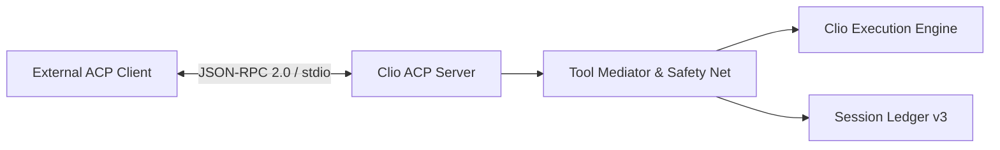

# Agent Client Protocol (ACP) Server

This document defines the architecture, transport protocols, tool mediation layers, permission handling, and error taxonomy for Clio Coder's Agent Client Protocol (ACP) server implementation in `v0.3.0`.

Source implementations: `src/engine/acp/` and `src/cli/acp.ts`.

---

## 1. Overview & Protocol Specification

Clio Coder provides a native ACP server via the `clio-coder acp` command. The server implements the open Agent Client Protocol specification (ACP v1 / schema 0.4.5) over standard I/O JSON-RPC 2.0 transport (`src/engine/acp/transport.ts`).

The ACP server allows external IDEs, editors (such as Zed), and automated orchestration engines to drive Clio Coder sessions over a structured protocol.



---

## 2. Server Command & Transport Wiring

The server is invoked via:

```bash
clio-coder acp [--cwd PATH] [--permission-timeout MS]
```

- `--cwd PATH`: Sets the initial workspace root directory for ACP sessions.
- `--permission-timeout MS`: Configures the maximum timeout for delegated permission resolution (defaults to `DEFAULT_DELEGATION_PERMISSION_TIMEOUT_MS = 120000` ms from `src/core/defaults.ts:40`).

Transport frames are JSON-RPC 2.0 messages serialized over `stdin`/`stdout`. All logging and diagnostic output is strictly routed to `stderr` to preserve standard I/O framing integrity.

---

## 3. Supported ACP Methods

The ACP server implements the core ACP RPC methods (`src/engine/acp/server.ts`):

| Method | Direction | Description |
| :--- | :--- | :--- |
| `initialize` | Client → Server | Negotiates protocol version, agent capabilities, and server implementation info. |
| `session/new` | Client → Server | Initializes a new Clio session, snapshotting the active autonomy posture and working directory. |
| `session/load` | Client → Server | Resumes an existing session by ID and synchronizes message history. |
| `session/list` | Client → Server | Lists known sessions for the current workspace root. |
| `session/delete` | Client → Server | Deletes a session and its persistent files. |
| `session/prompt` | Client → Server | Submits a user prompt to the session execution loop. |
| `session/cancel` | Client → Server | Cancels an in-flight prompt stream or running tool operation. |
| `session/request_permission` | Server → Client | Requests permission from the client for gated tool operations. |

---

## 4. Tool Mediation & Safety Governance

Tool execution entering through the ACP server is mediated by `src/engine/acp/tool-mediator.ts:createAcpToolMediator`.

### Canonical Tool Mapping

Clio tool names are mapped to the closed ACP `ToolKind` enumeration (`src/engine/acp/types.ts`):

| Clio Tool Name | ACP `ToolKind` | Primary Action Category |
| :--- | :--- | :--- |
| `read`, `ls`, `context` | `read` | Workspace inspection |
| `write`, `edit`, `artifact` | `edit` | Workspace mutation |
| `grep`, `find`, `code_nav` | `search` | Codebase exploration |
| `bash`, `verify`, `git` | `execute` | Shell & command execution |
| `web_fetch` | `fetch` | Network retrieval |
| Dynamic / MCP tools | `other` | Unmapped fallback |

### Non-Stall Permission Mediation

Under `clio-policy` governance:
1. Tool calls evaluate through the 10-step safety net policy engine.
2. If the safety net or autonomy level yields an `ask` verdict (such as mutating actions at `suggest` level or unrecognized bash at `auto-edit` level), the mediator resolves the ask as a **non-stall denial** (`autonomyDenyRejection`).
3. This non-stall behavior prevents external non-interactive client connections from hanging indefinitely while preserving safety boundaries.

---

## 5. Security & Boundary Guarantees

The ACP boundary enforces strict isolation rules:

1. **Autonomy Snapshotting**: The autonomy level is snapshotted at `session/new`. A subsequent configuration change on the host does not alter an active remote session's security policy.
2. **Metadata Namespacing**: Clio-specific extensions travel exclusively within namespaced metadata fields (`ACP_USAGE_META_KEY = "clio.coder/usage"`, `ACP_SESSION_META_KEY = "clio.coder/session"` in `src/engine/acp/types.ts:8-9`). Strict clients (e.g. Zed Serde deserializers) never encounter unmapped top-level keys.
3. **No External Outcome Overrides**: External ACP processes cannot self-assert terminal outcome codes (e.g. `worker_final_output_missing` is enforced at Clio's trusted finalization seam).

---

## 6. Error Taxonomy

The ACP subsystem defines four typed error classes (`src/engine/acp/errors.ts`):

```typescript
export class AcpError extends Error {
  readonly code: string;
  readonly data?: unknown;
}

export class AcpProtocolError extends AcpError {
  constructor(message: string, data?: unknown) {
    super("acp_protocol_error", message, data);
  }
}

export class AcpTimeoutError extends AcpError {
  constructor(message: string, data?: unknown) {
    super("acp_timeout", message, data);
  }
}

export class AcpProcessError extends AcpError {
  constructor(message: string, data?: unknown) {
    super("acp_process_error", message, data);
  }
}
```
