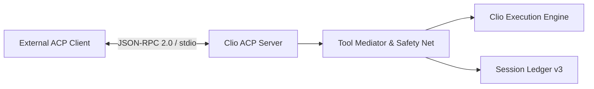

# Agent Client Protocol (ACP) Server

This document defines the architecture, transport protocols, tool mediation layers, permission handling, and error taxonomy for Clio Coder's Agent Client Protocol (ACP) server implementation in `v0.3.1`.

Source implementations: `src/engine/acp/` and `src/cli/acp.ts`.

---

## 1. Overview & Protocol Specification

Clio Coder provides a native ACP server via the `clio-coder acp` command. The server implements the open Agent Client Protocol specification (ACP v1 / schema 0.4.5) over standard I/O JSON-RPC 2.0 transport (`src/engine/acp/transport.ts`).

The ACP server allows external IDEs, editors (such as Zed), and automated orchestration engines to drive Clio Coder sessions over a structured protocol.



---

## 2. Server Command & Transport Wiring

The server is invoked via:

```bash
clio-coder acp [--cwd PATH] [--permission-timeout MS]
```

- `--cwd PATH`: Workspace root the server boots in. The path is resolved and then canonicalized with `fs.realpath`, so a symlinked launch root, a trailing slash, and a `/.` suffix all name the same workspace. Clio changes into that canonical path before it reads settings, builds project context, or opens a session ledger, so a session opens at that root. A path that does not exist or that the process cannot enter exits 2 without starting the server. The canonical path is the server's workspace identity for its whole life: `session/new` must carry a `cwd` that canonicalizes to the same path, and nothing after boot ever changes the process directory.
- `--permission-timeout MS`: How long a mediated permission request may wait for the client before it is denied, as a positive whole number of milliseconds. It overrides `delegation.defaults.permissionTimeoutMs` for this server only, which itself defaults to `DEFAULT_DELEGATION_PERMISSION_TIMEOUT_MS = 120000` (`src/core/defaults.ts:143`).

Transport frames are JSON-RPC 2.0 messages serialized over `stdin`/`stdout`. All logging and diagnostic output is strictly routed to `stderr` to preserve standard I/O framing integrity.

---

## 3. Supported ACP Methods

These are every method the server answers (`src/engine/acp/server.ts`). Anything else returns `-32601`.

| Method | Direction | Description |
| :--- | :--- | :--- |
| `initialize` | Client → Server | Negotiates the protocol version, agent capabilities, and server implementation info. Must be called first, exactly once. |
| `session/new` | Client → Server | Opens the one session this process hosts, snapshotting the active autonomy posture and pinning the workspace root. |
| `session/prompt` | Client → Server | Submits a user prompt to the session execution loop. |
| `session/cancel` | Client → Server | Cancels the in-flight prompt, its running tools, and any outstanding permission request. Accepted as a request (returns `{}`) and as a notification (returns nothing). |
| `session/close` | Client → Server | Closes the durable session and returns `{}`. Not an ACP v1 method: it is advertised through `agentCapabilities._meta["clio-coder/session"].close === true`. |
| `session/request_permission` | Server → Client | Requests permission from the client for a gated tool operation. |

There is no `session/load`, `session/list`, or `session/delete`. `loadSession` is advertised as `false`, nothing survives process exit, and a client that wants a second workspace starts a second process.

---

## 4. Initial Safe Profile

This section states what the server guarantees on the wire. It is the source-side contract Workbench and any other strict client can hold Clio to.

### Error envelope

JSON-RPC layer codes stay standard: `-32700` parse, `-32600` invalid request, `-32601` method not found, `-32602` invalid params. Every Clio-originated failure is `-32000`. Every error frame, whatever its code, carries its machine-readable detail in exactly one place:

```json
{"code":-32000,"message":"<one line, ≤256 chars, no paths, no stack>",
 "data":{"_meta":{"clio-coder/error":{"version":1,"code":"<closed-set string>","reason":"<optional>","supported":[1]}}}}
```

`data` never carries a stack, an echoed frame, a filesystem path, provider text, or a secret. Neither does `message`. Every message on the wire is authored by this process: `turn_failed` is always the fixed string `the prompt turn failed`, `internal_error` is always the fixed string `internal error`, and `method_not_found` is always the fixed string `method not found`, whatever the underlying failure said and whatever the peer called. A provider or engine failure body legitimately quotes the request URL it used, the settings file it read a credential from, or the credential itself, and bounding that text to one line still ships the secret. The client branches on `data._meta`'s `code`; the original message, bounded to one line, goes to stderr prefixed with `[clio:acp]`. The `code` values are a closed set:

| `data.code` | When |
| :--- | :--- |
| `not_initialized` | Any `session/*` before a successful `initialize`. |
| `already_initialized` | A second `initialize` on the same connection. |
| `protocol_version_unsupported` | `initialize.protocolVersion` is not the integer `1`. Uses `-32602` and carries `supported: [1]`. |
| `invalid_params` | Missing or non-string `sessionId`, or empty prompt text. Uses `-32602`. |
| `session_cwd_mismatch` | `session/new.cwd` is absent, not a string, unresolvable, or canonicalizes to something other than the server's workspace. |
| `session_limit` | A second `session/new` in the same process, including after `session/close`. |
| `session_unknown` | A `sessionId` this process never issued. |
| `prompt_active` | A second `session/prompt` while one is running, or `session/close` while one is running. |
| `prompt_not_admitted` | Clio refused to start the turn. `data.reason` carries the admission reason. |
| `turn_failed` | The provider or engine failed after the turn was admitted. `message` is the fixed string `the prompt turn failed`; the provider's own text goes to stderr. |
| `parse_error` | A stdin line was not valid JSON. Uses `-32700` with `id: null`; the offending line is not echoed. |
| `invalid_request` | A frame was not JSON-RPC `2.0`, or carried an `id` and no `method`. Uses `-32600`; the rejected frame is not echoed. |
| `input_line_too_large` | One stdin line exceeded 1 MiB. Uses `-32600` with `id: null`; the line is discarded and the transport continues. |
| `invalid_request_id` | A request arrived with `id: null`. Uses `-32600`. |
| `method_not_found` | An unregistered method. Uses `-32601`. `message` is the fixed string `method not found`; the peer-controlled method name is never echoed, however short it is. |
| `internal_error` | A handler failed in a way it did not classify. `message` is the fixed string `internal error`; the thrower's text goes to stderr and carries no stack. |

### One session per process

`session/new` succeeds once per process lifetime. A second call fails with `session_limit`, and closing the first session does not free the slot. One `chat` instance backs the server, so a second session id would share provider context and ledger ancestry with the first. A client that needs another workspace or a clean context retires the child and spawns a new one.

### Workspace pinning

The launch `--cwd` is canonicalized once at boot and is the server's workspace for its whole life. `session/new` requires a `cwd` that is a non-blank absolute path, checked before anything touches the filesystem, and that canonicalizes to the server's workspace; anything else fails with `session_cwd_mismatch`. A relative `cwd` such as `.`, `./`, or `sub` is refused even when it would resolve to the workspace, since it resolves against whatever directory the process happens to be in and the client would believe it had pinned a path it never sent. The server never calls `chdir` after boot and never falls back to the launch root when the requested path is unusable. The mismatch message names no path.

### Prompt input

Prompt text is read only from `params.prompt`, the ACP v1 array of content blocks, and only blocks with `type: "text"` and a string `text` contribute; the blocks are joined with a newline and trimmed. Image, audio, and resource_link blocks are ignored rather than coerced into prose the model would answer. No other shape is accepted: `params.content`, `params.message`, and a bare string `params.prompt` all fail with `-32602 invalid_params`, the same as a prompt whose text is empty. A client's framing bug therefore fails here the same way it would against any other ACP agent, instead of appearing to work only against Clio.

### Bounds

Every frame the server writes is bounded (`src/engine/acp/types.ts`). Every cap counts UTF-8 bytes, which is what the peer's read buffer spends, not UTF-16 code units:

- `agent_message_chunk` and `agent_thought_chunk` text is at most 16 KiB per chunk. A longer delta is split across consecutive chunks and nothing is dropped, so concatenating chunks in order reproduces the model's text exactly. No split falls inside a code point, so a surrogate pair never arrives as two replacement characters.
- Tool `content` text is truncated at 16 KiB with a trailing `…[truncated]`.
- Every string inside `rawInput` and `rawOutput` is truncated at 4 KiB with the same marker, and the walk stops at depth 8, replacing anything deeper with `"[depth]"`. The marker is reserved inside the cap, so a truncated value is at most the cap itself. If the bounded record still serializes past 32 KiB of UTF-8 it becomes `{"truncated":true,"bytes":<serialized UTF-8 length>}`, where the length is the record's serialization before any bounding, so the figure names the payload the engine produced rather than the shortened copy that was not sent. A record that does not serialize at all reports the bounded copy's length, or `0` when neither form serializes.
- Every `toolCallId` is at most 128 UTF-8 bytes. An engine id longer than that, a missing one, or one that collides with an alias this turn already minted is replaced by a per-turn `clio-tool-<n>` alias, and the same alias is used for the call's `tool_call`, its `tool_call_update`, and its permission request, so one call never splits into two identities on the client. Identity runs one way: each engine tool-call id maps to exactly one emitted call. A turn that starts a second call under an engine id it already used mints a fresh alias for it rather than reusing the earlier wire id, so two calls never merge into one, and a `tool_execution_end` closes that id's most recently opened call first. An end that names an engine id is confined to that engine id's own calls: an id this turn never started binds to nothing, and the end is dropped and reported on the stderr tail rather than borrowing another call's wire id, which reported one tool's result under another tool's identity and closed a call that was still running. Every wire id receives exactly one terminal update. Once a `tool_call_update` with `completed` or `failed` has gone out for an id, the cancel/fail sweep included, that id never receives another, and a late or duplicate end for it is dropped and reported on the stderr tail instead of overwriting the result the client already rendered. An end arriving with no engine id binds to the most recently opened call still running, which is what makes a nested lifecycle close correctly: with an outer and an inner call open and the inner one already ended, the next unidentified end is the outer call's. With nothing still open it binds to the most recently emitted call of the turn, which drops it when that call is already terminal, and an end arriving before the turn has emitted any `tool_call` is dropped outright. Nothing on the end path mints a wire id, so a `tool_call_update` never announces an id the client never saw start.
- `locations` carries the absolute path for the built-in path-bearing tools (`read`, `write`, `edit`, `ls`, `grep`, `find`) when the arguments name one, resolved against the pinned workspace and deliberately not realpath'ed, since an `edit` or `write` target may not exist yet. When there is no recognizable path the field is omitted entirely rather than sent as `null` or `[]`.
- A cancelled or failed turn synthesizes a `tool_call_update` with `status: "failed"` for every call that received a `tool_call` and no terminal update, before the prompt request settles.

### Admission failure

A prompt Clio cannot start fails with `prompt_not_admitted` and zero preceding `session/update` notifications. `data.reason` is one of `orchestrator-not-configured`, `target-unknown`, `target-not-configured`, `target-not-found`, `runtime-not-registered`, `model-not-configured`, `chat-unsupported`, `streaming-unsupported`, or the catch-all `admission-failed`. That list is closed and the server enforces it: the engine's runtime-resolution diagnostics are a larger and faster-moving vocabulary (`runtime-target-unsupported`, `runtime-use-unsupported`, `required-capability-missing`, and others), and any reason outside the list is reported as `admission-failed` rather than teaching clients a code the profile never promised. The two halves of an unconfigured orchestrator are distinguished: no `orchestrator.target` reports `orchestrator-not-configured`, and a configured target with no `orchestrator.model` reports `model-not-configured`, so a client is pointed at the half of the settings that is actually missing. The message is a sanitized one-line sentence and never contains the settings path. A failure after admission fails with `turn_failed` instead. Readiness before the first prompt is unchanged and lives in the CLI: `paths --json` for home identity, `doctor --json` for installation sanity, and `targets --json [--probe]` for target, auth, and health. `--probe` performs a request to the configured endpoint, so the client decides when that is allowed.

### Permission requests

The outbound `session/request_permission` carries `{sessionId, toolCall:{sessionUpdate:"tool_call", toolCallId, title, kind, status:"pending", rawInput, locations?}, options}`. `toolCallId` is always the id of a `tool_call` the client already rendered and has not yet seen finish. Binding is lookup-only. When the engine supplies an id, it resolves through the calls this turn actually emitted, and only to one that is still open; when that id has more than one open call, because the engine reused it, the request binds to the most recently opened of them. When the engine supplies no id, the request binds to the turn's one open tool call. Every other case fails closed: an id nothing was emitted for, an id whose calls have all completed, zero open calls, or more than one open call with no id to choose between them. Failing closed means the client is never asked, no `session/request_permission` frame is written, the parked call is cancelled, and the resolution is recorded as denied with `decidedBy: "error"` and the reason `permission request has no bindable tool call`. There is no bridge-local id and no id is minted here: asking about an id the client never received put an approval on a call nobody could identify. `rawInput` and `locations` are the stored snapshot of the bound call's `tool_call` update, replayed byte for byte and never recomputed, so a client can diff the call it is showing against the call it is being asked to approve and find nothing. The snapshot is taken when the `tool_call` is emitted and keyed by wire id, because the registry's copy of a call is not always the engine's: a tool's `prepareAdmissionArguments` may rewrite a relative path to an absolute one or attach a prepared artifact before the safety net sees the call, so deriving the ask from those arguments made the two frames disagree for reasons the client could only read as a mismatch. The tool's name is in `title`, never folded into `rawInput`. Options are exactly `allow-once` and `reject-once`. Only the exact `optionId: "allow-once"` under `outcome: "selected"` grants; every other answer, including `outcome: "cancelled"`, is a denial. At most one request is outstanding at a time and the queue is serial. The timeout comes from `--permission-timeout`. Transport loss denies every queued request and cancels the parked calls. A `session/cancel` while a request is outstanding stops the server waiting on it, cancels the parked tool, and settles the prompt with `stopReason: "cancelled"`; a late answer to the abandoned request is ignored.

### Cancel, close, and shutdown

`session/cancel` is idempotent while a prompt is active and answers `{}` in its request form. `session/close` during an active prompt fails with `prompt_active`, so the client cancels and awaits the prompt's terminal response first. Closing an already-closed id returns `{}`. On stdin EOF or a transport error the pending outbound requests fail, the active prompt is cancelled, the permission bridge is unregistered, and the server waits for the in-flight prompt handler to settle (bounded at 5 s) before resolving, so no session write can land after the session domain stops. Stdout is JSON-RPC only; stderr is an unstructured diagnostic tail.

### `_meta` keys

| Key | Where | Payload |
| :--- | :--- | :--- |
| `clio-coder/session` | `initialize` → `agentCapabilities._meta` | `{ close: true }` |
| `clio-coder/tools` | `initialize` → `agentCapabilities._meta` | `"mediated"` |
| `clio-coder/usage` | `session/prompt` result `_meta` | `{ input, output, cacheRead, cacheWrite, reasoning }` |
| `clio-coder/error` | any `error.data._meta` | `{ version, code, reason?, supported? }` |

---

## 5. Tool Mediation & Safety Governance

Tool execution entering through the ACP server is mediated by `src/engine/acp/tool-mediator.ts:createAcpToolMediator`.

### Canonical Tool Mapping

Clio tool names are mapped to the closed ACP `ToolKind` enumeration (`src/engine/acp/types.ts`):

| Clio Tool Name | ACP `ToolKind` | Primary Action Category |
| :--- | :--- | :--- |
| `read`, `ls`, `context` | `read` | Workspace inspection |
| `write`, `edit`, `artifact` | `edit` | Workspace mutation |
| `grep`, `find`, `code_nav` | `search` | Codebase exploration |
| `bash`, `verify`, `git` | `execute` | Shell & command execution |
| `web_fetch` | `fetch` | Network retrieval |
| Dynamic / MCP tools | `other` | Unmapped fallback |

### Non-Stall Permission Mediation

Under `clio-policy` governance:
1. Tool calls evaluate through the 10-step safety net policy engine.
2. If the safety net or autonomy level yields an `ask` verdict (such as mutating actions at `suggest` level or unrecognized bash at `auto-edit` level), the mediator resolves the ask as a **non-stall denial** (`autonomyDenyRejection`).
3. This non-stall behavior prevents external non-interactive client connections from hanging indefinitely while preserving safety boundaries.

---

## 6. Security & Boundary Guarantees

The ACP boundary enforces strict isolation rules:

1. **Autonomy Snapshotting**: The autonomy level is snapshotted at `session/new`. A subsequent configuration change on the host does not alter an active remote session's security policy.
2. **Metadata Namespacing**: Clio-specific extensions travel exclusively within namespaced metadata fields (`ACP_USAGE_META_KEY = "clio-coder/usage"`, `ACP_SESSION_META_KEY = "clio-coder/session"` in `src/engine/acp/types.ts:8-9`). Strict clients (e.g. Zed Serde deserializers) never encounter unmapped top-level keys.
3. **No External Outcome Overrides**: External ACP processes cannot self-assert terminal outcome codes (e.g. `worker_final_output_missing` is enforced at Clio's trusted finalization seam).

---

## 7. Delegation Peers in the Transcript

The sections above describe Clio as an ACP server. In the other direction, Clio
is an ACP client: `/delegate <agent-id> <task>` and any dispatch to an agent id
configured under `delegation.agents` run the task on an external peer such as
`codex` or `opencode`.

A delegated peer is a worker like any other on screen. The adapter maps the
peer's `text_delta` and `message_end` notifications onto the same dispatch event
stream a local Clio worker publishes, so the peer's answer renders in the chat
transcript as the same attributed block, with the same fold behavior, the same
`--share` and `/share` path into the main agent's context, and the same replay
from a sealed receipt. There is no ACP-specific UI path.

The header is where the difference shows. A local Clio worker names the target
and model it ran on; a peer runs behind someone else's process and can honestly
name only the protocol it was reached through, so its header reads `◇ codex
(acp) · run 7hq2ab`. Its footer reports elapsed and, when the peer reports no
token usage, the count of mediated tool calls in place of a token count; a peer
that does report usage gets the same `tok` unit a local worker does.

---

## 8. Error Taxonomy

The ACP subsystem defines four typed error classes (`src/engine/acp/errors.ts`):

```typescript
export class AcpError extends Error {
  readonly code: string;
  readonly data?: unknown;
}

export class AcpProtocolError extends AcpError {
  constructor(message: string, data?: unknown) {
    super("acp_protocol_error", message, data);
  }
}

export class AcpTimeoutError extends AcpError {
  constructor(message: string, data?: unknown) {
    super("acp_timeout", message, data);
  }
}

export class AcpProcessError extends AcpError {
  constructor(message: string, data?: unknown) {
    super("acp_process_error", message, data);
  }
}
```
