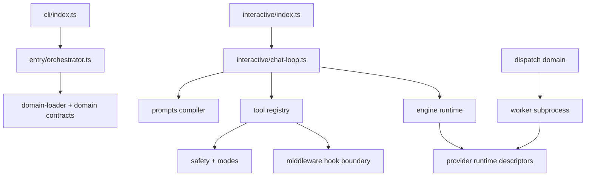

# Clio Coder Architecture and Boundaries

> [!TIP]
> **Interactive Spec Available:** An interactive dashboard is located at [docs/html/architecture_blueprint.html](html/architecture_blueprint.html) (Version: 0.2.2).

Clio Coder is an experimental, terminal-first coding harness for the CLIO ecosystem. Its architecture favors small, auditable subsystems over a single monolithic agent loop: CLI entry points, the interactive TUI, provider/runtime code, worker subprocesses, tools, and feature domains are kept separate so local-model support and scientific-software workflows can evolve without collapsing safety boundaries.

This page is source-code aligned for the current `v0.2.2` development line.

---

## Source layout

```text
src/
├── cli/             # clio subcommands, argument parsing, headless run modes
├── core/            # config/state paths, event bus, defaults, shared primitives
├── domains/         # feature domains loaded through manifests/contracts
├── engine/          # pi-ai/provider boundary and runtime adapters
├── entry/           # orchestrator bootstrap wiring
├── interactive/     # TUI panels, overlays, key routing, dashboard, slash commands
├── tools/           # built-in tool specs and registry admission boundary
├── worker/          # subprocess worker entry/runtime rehydration
└── utils/           # small support utilities
```

Important domain directories include:

| Domain | Primary source | Public surface |
| --- | --- | --- |
| agents | `src/domains/agents/**` | Built-in, user, and project agent recipes. |
| components | `src/domains/components/**` | Component snapshots and diffs. |
| config | `src/domains/config/**`, `src/core/config.ts` | `settings.yaml`, keybindings, hot reload. |
| context/resources | `src/domains/context/**`, `src/domains/resources/**` | `CLIO.md`, prompts, skills, extension roots. |
| dispatch | `src/domains/dispatch/**` | Fleet-agent jobs, receipts, worker spawning. |
| eval/evidence/memory | `src/domains/eval/**`, `src/domains/evidence/**`, `src/domains/memory/**` | Local evals, evidence corpora, approved memory. |
| providers | `src/domains/providers/**` | Target-first runtime registry, model probing, auth. |
| prompts | `src/domains/prompts/**` | Prompt fragments, prompt envelope, hashes. |
| safety/modes | `src/domains/safety/**`, `src/domains/modes/**` | Mode matrix, path policy, project policy, damage control. |
| session | `src/domains/session/**` | JSONL sessions, resume/fork/tree/compaction. |
| extensions/share | `src/domains/extensions/**`, `src/domains/share/**` | Extension packages and portable share archives. |

---

## Boundary invariants

`npm run check:boundaries` executes the boundaries test suite under `tests/boundaries/boundaries.test.ts`. Treat these checks as the executable specification.

### Rule 1: pi-ai value imports stay in `src/engine/**`

Only files under `src/engine/**` may value-import `@earendil-works/pi-*` packages. Outside `src/engine`, type-only imports are not generally open-ended; the current explicit allowlist is limited to provider runtime descriptor shapes from `@earendil-works/pi-ai`.

Why: provider SDKs and pi-ai runtime values should be swappable behind one engine boundary. Domains and the TUI should work against Clio contracts, not vendor/runtime implementations.

### Rule 2: workers do not value-import domains except runtime rehydration

`src/worker/**` may not value-import `src/domains/**` except the worker-safe provider runtime rehydration modules:

- `src/domains/providers/plugins.ts`
- `src/domains/providers/registry.ts`
- `src/domains/providers/runtimes/builtins.ts`

Type-only imports erase at compile time and are permitted. Workers receive a serializable `WorkerSpec` envelope, rehydrate only the target/runtime pieces they need, and avoid pulling interactive state or domain stores into the subprocess.

### Rule 3: domains do not import each other's `extension.ts`

A file under `src/domains/<x>/**` must not import `src/domains/<y>/extension.ts` for `y != x`. Cross-domain behavior flows through contracts exported from domain indexes, the domain loader, event buses, snapshots, or serialized manifests.

---

## Runtime flow



Core data paths:

1. CLI or TUI boot initializes config/data/cache directories through `src/core/init.ts`.
2. The domain loader starts domains according to each `manifest.ts` dependency list.
3. The chat loop resolves model/runtime state and visible tools for the current mode.
4. The prompt compiler builds a hashed prompt envelope and dynamic turn fragments.
5. Tool calls enter `src/tools/registry.ts`, which enforces visibility, safety, middleware hooks, protected artifacts, and result shaping before returning output.
6. Fleet dispatch writes run ledger entries and receipts; evidence/memory/eval domains consume those artifacts later.

---

## Event and audit model

Clio uses in-process event buses for status and audit surfaces, but safety is not delegated to events. The hard gate lives in code:

- `src/domains/modes/matrix.ts` controls which tools/actions are visible by mode.
- `src/domains/safety/policy-engine.ts` evaluates damage-control rules, project policy, Bash default-deny, and path policy.
- `src/tools/registry.ts` is the admission point for every tool invocation.
- `src/domains/dispatch/receipt-integrity.ts` and related dispatch files persist receipts used by evidence and cost surfaces.

---

## Verification commands

```bash
npm run check:boundaries
npm run typecheck
npm run test
npm run build
```

Run the focused boundary check before editing `src/engine/**`, `src/worker/**`, or cross-domain imports. Run the full test/build gate before release-facing documentation or behavior changes.
