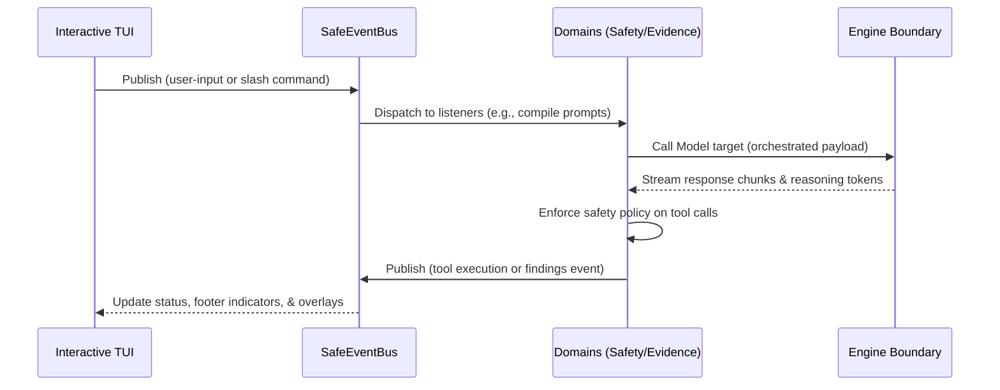

# Clio Coder Codebase Architecture & Boundaries

Clio Coder is architected to keep user interactive surfaces, provider integrations, worker subprocess sandboxes, and domain-level automation strictly decoupled. Decoupling ensures that as more targets, reasoning engines, and custom scientific validators are added, the codebase remains reliable and easy to audit.

---

## 🗺️ Codebase Directory Layout

The codebase is organized into five major subsystem layers:

```text
src/
├── cli/                 # CLI entrypoints, arg parsing, command wrappers
├── interactive/         # TUI chat panels, dispatch boards, overlays, keybindings
├── engine/              # Decoupled gateway to AI models & the pi SDK boundary
├── worker/              # Independent, worker-safe runtime rehydration entrypoint
└── domains/             # Modular feature domains (agents, safety, memory, evals)
    ├── agents/          # Built-in agent specs and runtime dispatch
    ├── safety/          # Path policy, damage-control rules, and auditing
    ├── providers/       # Unified model configuration and native runtimes
    └── ...              # Other discrete domain directories
```

---

## 🔒 The Three Compile-Time Boundary Invariants

Clio Coder enforces **three strict architectural boundaries** verified by compile-time AST analysis. These boundaries prevent direct coupling, isolate provider SDK dependencies, and protect subprocess workers:

```mermaid
graph TD
    subgraph Engine Boundary
        src/engine["src/engine/**"] -->|Imports value-symbols| piSDK["@earendil-works/pi-*"]
    end

    subgraph Domain Isolation
        src/interactive["src/interactive/**"] -.->|Type-only imports ONLY| piSDK
        src/domains["src/domains/**"] -.->|Type-only imports ONLY| piSDK
        src/cli["src/cli/**"] -.->|Type-only imports ONLY| piSDK
    end

    subgraph Worker Boundary
        src/worker["src/worker/**"] -->|No domains import except providers| src/domains/providers
    end

    subgraph Domain Independence
        domainX["src/domains/X/**"] -->|No import of extension.ts| domainY["src/domains/Y/**"]
        domainX -->|Communicates via| SafeEventBus["SafeEventBus"]
        domainY -->|Communicates via| SafeEventBus
    end
    
    style Engine Boundary fill:#147366,stroke:#00d4db,stroke-width:2px,color:#fff
    style Domain Isolation fill:#241131,stroke:#666,stroke-width:1px,color:#fff
    style Worker Boundary fill:#f39c12,stroke:#d35400,stroke-width:2px,color:#fff
    style Domain Independence fill:#2c3e50,stroke:#34495e,stroke-width:1px,color:#fff
```



### 1. The Engine Boundary
- **Rule:** Only `src/engine/**` is allowed to import value symbols from the `@earendil-works/pi-*` packages.
- **Why:** The pi SDK represents a vendored core engine interface. Restricting its value imports to the engine boundary guarantees that we can wrap, mock, or switch provider foundations (like Ollama, Harmony, LM Studio, or local CLI scripts) without changing any interactive TUI or domain logic.
- **Exceptions:** Other folders may import types only (`import type { ... }`), but no runtime functions, classes, or values can escape `src/engine/`.

### 2. Worker Subprocess Isolation
- **Rule:** `src/worker/**` is never allowed to import modules from `src/domains/**`, with the sole exception of the unified `src/domains/providers` configuration models.
- **Why:** Dispatched fleet agents run as isolated subprocess workers. They rehydrate their context from `stdin` via a serializable `WorkerSpec` envelope. Isolating the worker from domains prevents interactive state, memory stores, and TUI dependencies from leaking into the execution sandbox, keeping worker processes lightweight and secure.

### 3. Domain Independence
- **Rule:** Files in `src/domains/<x>/**` are strictly forbidden from importing the domain extension modules of another domain `src/domains/<y>/extension.ts` (where `y != x`).
- **Why:** Modular domains must not have tight cyclic dependencies. Cross-domain interactions must flow through declarative contracts, deterministic change manifests, snapshots, or the centralized in-process `SafeEventBus`.

---

## 🔄 Event-Driven Data Flow

Clio Coder avoids hard-coded domain linkages. Decoupled sub-systems broadcast and react to events via `SafeEventBus` and `SharedEventBus`.



### Decoupled Sub-Systems
1. **Interactive Chat Loop:** Submits prompts, listens to model completion streams, and schedules follow-up turns.
2. **Safety Policy Engine:** Intercepts outgoing tool calls, matches paths/patterns, blocks wildcards, and requests operator confirmation if high-risk.
3. **Evidence Corpus Builder:** Subscribes to session events and run ledger updates, gathering files and traces into a deterministic `evidenceId` folder.
4. **Memory Curator:** Proposes approved lessons, inserting them into dynamic prompt slots without direct coupling.

---

## 🛠️ Verification
Boundary constraints are actively tested at build time. To run the boundary validator:
```bash
npm run check:boundaries
```
If any value import leaks outside its designated folder, the script exits with a non-zero code and reports the specific line violation.
