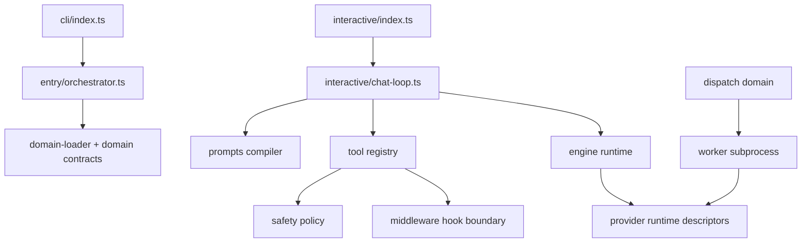

# Clio Coder Architecture and Boundaries

> [!TIP]
> **Interactive Spec Available:** An interactive dashboard is located at [docs/html/architecture_blueprint.html](html/architecture_blueprint.html) (Version: 0.3.2).

Clio Coder is an experimental, terminal-first coding harness for the CLIO ecosystem. CLIO stands for Context Layer for Input/Output; the project is named for the Greek muse of history and developed by the Gnosis Research Center at Illinois Tech. Its architecture favors small, auditable subsystems over a single monolithic agent loop: CLI entry points, the interactive TUI, provider/runtime code, worker subprocesses, tools, and feature domains are kept separate so local-model support and scientific-software workflows can evolve without collapsing safety boundaries.

This page is source-code aligned for the current `v0.3.2` development line.

---

## Source layout

```text
src/
├── cli/             # clio subcommands, argument parsing, headless run modes
├── core/            # config/state paths, event bus, defaults, shared primitives
├── domains/         # feature domains loaded through manifests/contracts
├── engine/          # pi-ai/provider boundary and runtime adapters
├── entry/           # orchestrator bootstrap wiring
├── interactive/     # TUI panels, overlays, key routing, dashboard, slash commands
├── tools/           # built-in tool specs and registry admission boundary
├── worker/          # subprocess worker entry/runtime rehydration
└── utils/           # small support utilities
```

Registered domain modules include:

| Domain | Primary source | Public surface |
| --- | --- | --- |
| agents | `src/domains/agents/**` | Built-in, user, and project agent recipes. |
| components | `src/domains/components/**` | Component snapshots, diffs, and classification. |
| config | `src/domains/config/**`, `src/core/config.ts` | `settings.yaml`, keybindings, hot reload. |
| context | `src/domains/context/**` | Layered `CLIO-CODER.md` and subtree `CLIO-CODER.override.md` guidance, codewiki indexer, repository context. |
| dispatch | `src/domains/dispatch/**` | Fleet-agent jobs, receipts, worker spawning, route policies. |
| eval | `src/domains/eval/**` | Local evaluation harness, suites, JUnit/SWE-bench reports. |
| evidence | `src/domains/evidence/**` | Forensic evidence bundles, failure attribution. |
| evolution | `src/domains/evolution/**` | Authority-tiered self-edit manifests and gates. |
| extensions | `src/domains/extensions/**` | Extension discovery, packaging, and lifecycle. |
| interop | `src/domains/interop/**` | The agent-kind registry, bounded detection of other coding agents, and consent to wire one as a delegation peer. |
| lifecycle | `src/domains/lifecycle/**` | Doctor diagnostics, upgrade mechanics, uninstallation. |
| memory | `src/domains/memory/**` | Approved long-term memory, proactive task intervention. |
| middleware | `src/domains/middleware/**` | Declarative and programmatic lifecycle hooks and budgets. |
| observability | `src/domains/observability/**` | SQLite trace store, metrics projections, live telemetry. |
| prompts | `src/domains/prompts/**` | Prompt fragments, system prompt envelope, template hashing. |
| providers | `src/domains/providers/**` | Target-first runtime registry, model probing, credentials. |
| resources | `src/domains/resources/**` | Skills loader, marketplace synchronization, prompts loader. |
| safety | `src/domains/safety/**` | 10-step policy engine, path policy, zero-access rails, audit. |
| scheduling | `src/domains/scheduling/**` | Budget ceilings, node cluster states, batch capacity checks. |
| session | `src/domains/session/**` | Append-only JSONL transcripts, tree navigation, compaction. |
| share | `src/domains/share/**` | Portable workspace and resource archive export/import. |

The `interop` domain owns one question: which other coding agents are on this
machine and in this project. `src/domains/interop/registry.ts` is pure data, one
entry per known agent carrying its binaries, the directories it owns, its skill
and prompt roots, its instruction filenames, and the ACP launch recipe when it
has one. Every other module that used to keep its own copy of that list now
derives it: the skills loader and the prompts loader take their compatibility
roots from the table, the adoption scanner takes its candidate files from it,
and the safety path policy takes the foreign directories it refuses to write
into from it.

The domain owns detection and consent, and nothing else. It never executes a
foreign agent's work command, never loads a skill, prompt, or rule itself, and
never reads under a foreign agent's `sessions`, `history`, `cache`, `projects`,
or `state` directory. Detection resolves binaries with `access(X_OK)` and no
shell, checks install directories, and runs a bounded `--version` only when the
caller asks and only for a binary that already resolved; a probe that cannot
answer reports `unknown` and never `absent`. The one durable configuration write
is an append to `delegation.agents`, and it happens only after an operator
decision.

---

## Session Routing vs. Persisted Settings

Clio maintains an explicit distinction between persisted user settings (`settings.yaml`) and session-local routing state (`src/core/session-routing.ts`).

1. **Decoupled Overlays**: Turn-level selections (such as active target, model override, thinking level, and scoped models cycled via Alt+J / Alt+K) apply dynamically through `applySessionRouting` without mutating `settings.yaml`.
2. **Lifecycle Flow**:
   - `seedSessionRouting`: Seeds runtime fields from configuration at startup.
   - `applyRoutingPatch`: Applies surgical routing mutations (such as changing active model or target in the TUI).
   - `diffRouting`: Detects when an active session's routing diverges from `settings.yaml`.
   - `routingChangeNotices`: Generates structured notifications when external edits modify `settings.yaml` during an active session, allowing graceful reconciliation.
   - `restoreRoutingFields`: Restores persisted defaults when resetting session overlays.

---

## Workspace Enumeration and Language Classification

Source: `src/core/workspace-files.ts`, `src/core/c-header-language.ts`.

1. **Filesystem Walker Invariants**:
   Fallback workspace file enumeration enforces strict safety caps to prevent runaway memory usage or hangs on massive trees:
   - `maxVisitedEntries`: 100,000 entries
   - `maxDepth`: 64 directory levels
   - `maxPathBytes`: 64 MiB total path storage
   - `maxDurationMs`: 5,000 ms timeout
2. **C/C++ Header Classification**:
   Header files (`.h`, `.hpp`, `.hxx`, `.hh`) are classified deterministically through a 3-tier inspection pipeline:
   - Tier 1: Sibling source matches (for example matching `.cpp` or `.c` with the same base name).
   - Tier 2: Distinctive `#include` directives (standard C++ headers vs standard C headers).
   - Tier 3: Language-exclusive tokens (`template<`, `namespace `, `class `, `nullptr`, `constexpr`).

## Boundary invariants

`npm run lint` executes the boundary checker (`tests/boundaries/check-boundaries.ts`, imported by `scripts/check-hygiene.ts`). Treat these checks as executable specifications.

The enforced import rules below are complemented by the maintained
[Pi SDK boundary table](pi-boundary.md), which records the semantic owner of
each overlapping helper and the Clio deltas that must survive an SDK upgrade.

These five enforced boundary rules constrain dependency **direction**, never import **form** (whether static vs dynamic, default vs named):

### Rule 1: `@earendil-works/*` imports stay in `src/engine/**`

Only files under `src/engine/**` may import `@earendil-works/*` packages. Since the 0.83.0 engine-boundary rework, no file outside `src/engine/**` may import `@earendil-works/*` at all, value or type-only. Domain modules import erased engine shapes (`EngineModel`, `Api`, `Model`) directly from `src/engine/types.ts`.

Why: provider SDKs and pi-ai engine values must remain swappable behind one engine boundary. Domains and presentation layers operate against Clio contracts rather than vendor or runtime implementations. OpenAI-compatible sampler fields and vLLM thinking budgets flow through Pi's `samplingParams` and `supportsThinkingTokenBudget` contracts; Clio's adapter retains only catalog selection and runtime-specific payload deltas. Tool head/tail truncation, byte formatting, and grep-line clipping likewise flow through pi-agent-core's `truncateHead`, `truncateTail`, `formatSize`, and `truncateLine`; Clio retains only its 16 KiB per-observation default and its exported line-count helper. Tool string enums come from pi-ai's `StringEnum` (`src/engine/ai.ts`), the model-facing text for replayed bash executions and branch or compaction summaries comes from pi-agent-core's `bashExecutionToText` and summary prefixes (`src/engine/messages.ts`), and Anthropic thinking payloads are assembled by pi-ai's `streamSimple` with no Clio rewrite.

### Rule 2: Workers do not value-import domains except runtime rehydration

Files under `src/worker/**` may not value-import `src/domains/**`, with the sole exception of worker-safe provider runtime rehydration modules:

- `src/domains/providers/plugins.ts`
- `src/domains/providers/registry.ts`
- `src/domains/providers/runtimes/builtins.ts`

Type-only imports erase at compile time and are permitted. Workers receive a serializable `WorkerSpec` envelope, rehydrate only necessary target/runtime descriptors, and avoid pulling interactive state or domain stores into worker subprocesses.

### Rule 3: Domains do not import each other's `extension.ts`

A file under `src/domains/<x>/**` must not import `src/domains/<y>/extension.ts` for `y != x`. Cross-domain behavior flows through public contracts exported from domain index files (`src/domains/<y>/index.ts`), the domain loader, event buses, or serialized manifests.

### Rule 4: Tool substrate is surface-agnostic (`src/tools/**` never imports `src/interactive/**`)

Files under `src/tools/**` may never import `src/interactive/**` (neither value nor type-only imports). The tool substrate is surface-agnostic across headless, interactive, ACP, and worker runs. Allowing tools to import TUI presentation modules would couple execution logic to presentation code.

### Rule 5: One-way entry point composition (`chat-loop.ts` never imports `src/entry/**`)

Turn modules and state machine files in the chat loop (`src/interactive/turn-*.ts`, `chat-loop.ts`) may never import `src/entry/**`. Composition flows in one direction only: the entry point composes the chat loop, never the reverse.

---

## Runtime flow


```mermaid
graph TD
    CLI[cli/index.ts] --> ORCH[entry/orchestrator.ts]
    TUI[interactive/index.ts] --> LOOP[interactive/chat-loop.ts]
    ORCH --> DOMAINS[domain-loader + domain contracts]
    LOOP --> PROMPTS[prompts compiler]
    LOOP --> TOOLS[tool registry]
    LOOP --> ENGINE[engine runtime]
    TOOLS --> SAFETY[safety policy]
    TOOLS --> MIDDLEWARE[middleware hook boundary]
    ENGINE --> PROVIDERS[provider runtime descriptors]
    DISPATCH[dispatch domain] --> WORKER[worker subprocess]
    WORKER --> PROVIDERS
```

Core data paths:

1. CLI or TUI boot initializes config, data, state, and cache directories through `src/core/init.ts`.
2. The domain loader starts domains according to each `manifest.ts` dependency list.
3. The chat loop resolves model/runtime state and visible tools for the selected target and request intent.
4. The prompt compiler builds a hashed prompt envelope and dynamic turn fragments.
5. Tool calls enter `src/tools/registry.ts`, which enforces visibility, safety, middleware hooks, protected artifacts, and result shaping before returning output.
6. Fleet dispatch writes run ledger entries and receipts; evidence/memory/eval domains consume those artifacts later.

---

## Event and audit model

Clio uses in-process event buses for status and audit surfaces, but safety is not delegated to events. The hard gate lives in code:

- Provider capability resolution decides whether tool schemas are sent at all; tool-capable sessions receive the full registry as one deterministic session tool surface.
- `src/domains/safety/policy-engine.ts` evaluates damage-control rules, project policy, Bash default-deny, and path policy. Write boundaries are detect-and-rollback mechanisms (such as change tracking and rollbacks), never OS-level sandboxing.
- `src/tools/registry.ts` is the admission point for every tool invocation.
- `src/domains/dispatch/receipt-integrity.ts` and related dispatch files persist receipts used by evidence and cost surfaces.

## Command spec

Interactive slash commands in Clio Coder are governed by a unified declarative command specification registry. This declarative system replaces hand-rolled parsing logic with structured specifications that define the names, flags, positionals, and subcommands for each entry. The central registry acts as the single source of truth for command matching, argument parsing, autocomplete suggestion generation, and usage help output. The parser processes user input strings using these declarative specifications to generate structured argument objects and canonical command representations. By deriving all command-related behavior from these specifications, the system ensures consistency across usage help messages and autocomplete overlays.

---

## Verification commands

```bash
npm run lint
npm run typecheck
npm run test
npm run build
```

Run the focused boundary check before editing `src/engine/**`, `src/worker/**`, or cross-domain imports. Run the full test/build gate before release-facing documentation or behavior changes.
