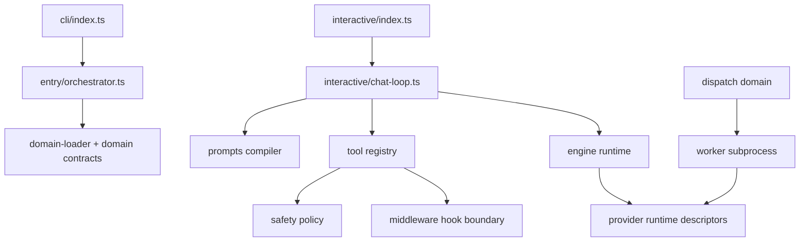

# Clio Coder Architecture and Boundaries

> [!TIP]
> **Interactive Spec Available:** An interactive dashboard is located at [docs/html/architecture_blueprint.html](html/architecture_blueprint.html) (Version: 0.3.5).

Clio Coder is an experimental, terminal-first coding harness for the CLIO ecosystem. CLIO stands for Context Layer for Input/Output; the project is named for the Greek muse of history and developed by the Gnosis Research Center at Illinois Tech. Its architecture favors small, auditable subsystems over a single monolithic agent loop: CLI entry points, the interactive TUI, provider/runtime code, worker subprocesses, tools, and feature domains are kept separate so local-model support and scientific-software workflows can evolve without collapsing safety boundaries.

This page is source-code aligned for the current `v0.3.5` development line.

---

## Source layout

```text
src/
├── cli/             # clio subcommands, argument parsing, headless run modes
├── core/            # config/state paths, event bus, defaults, shared primitives
├── domains/         # feature domains loaded through manifests/contracts
├── engine/          # pi-ai/provider boundary and runtime adapters
├── entry/           # orchestrator bootstrap wiring
├── interactive/     # TUI panels, overlays, key routing, dashboard, slash commands
├── tools/           # built-in tool specs and registry admission boundary
├── worker/          # subprocess worker entry/runtime rehydration
└── utils/           # small support utilities
```

Registered domain modules include:

| Domain | Primary source | Public surface |
| --- | --- | --- |
| agents | `src/domains/agents/**` | Built-in, user, and project agent recipes. |
| components | `src/domains/components/**` | Component snapshots, diffs, and classification. |
| config | `src/domains/config/**`, `src/core/config.ts` | `settings.yaml`, keybindings, hot reload. |
| context | `src/domains/context/**` | Layered `CLIO-CODER.md` and subtree `CLIO-CODER.override.md` guidance, codewiki indexer, repository context. |
| dispatch | `src/domains/dispatch/**` | Fleet-agent jobs, receipts, worker spawning, route policies. |
| eval | `src/domains/eval/**` | Local evaluation harness, suites, JUnit/SWE-bench reports. |
| evidence | `src/domains/evidence/**` | Forensic evidence bundles, failure attribution. |
| evolution | `src/domains/evolution/**` | Authority-tiered self-edit manifests and gates. |
| extensions | `src/domains/extensions/**` | Extension discovery, packaging, and lifecycle. |
| interop | `src/domains/interop/**` | The agent-kind registry, bounded detection of other coding agents, and consent to wire one as a delegation peer. |
| lifecycle | `src/domains/lifecycle/**` | Doctor diagnostics, upgrade mechanics, uninstallation. |
| memory | `src/domains/memory/**` | Approved long-term memory, proactive task intervention. |
| middleware | `src/domains/middleware/**` | Declarative and programmatic lifecycle hooks and budgets. |
| observability | `src/domains/observability/**` | SQLite trace store, metrics projections, live telemetry. |
| prompts | `src/domains/prompts/**` | Prompt fragments, system prompt envelope, template hashing. |
| providers | `src/domains/providers/**` | Target-first runtime registry, model probing, credentials. |
| resources | `src/domains/resources/**` | Skills loader, marketplace synchronization, prompts loader. |
| safety | `src/domains/safety/**` | 10-step policy engine, path policy, zero-access rails, audit. |
| scheduling | `src/domains/scheduling/**` | Budget ceilings, node cluster states, batch capacity checks. |
| session | `src/domains/session/**` | Append-only JSONL transcripts, tree navigation, compaction. |
| share | `src/domains/share/**` | Portable workspace and resource archive export/import. |

The `interop` domain owns one question: which other coding agents are on this
machine and in this project. `src/domains/interop/registry.ts` is pure data, one
entry per known agent carrying its binaries, the directories it owns, its skill
and prompt roots, its instruction filenames, and the ACP launch recipe when it
has one. Every other module that used to keep its own copy of that list now
derives it: the skills loader and the prompts loader take their compatibility
roots from the table, the adoption scanner takes its candidate files from it,
and the safety path policy takes the foreign directories it refuses to write
into from it.

The domain owns detection and consent, and nothing else. It never executes a
foreign agent's work command, never loads a skill, prompt, or rule itself, and
never reads under a foreign agent's `sessions`, `history`, `cache`, `projects`,
or `state` directory. Detection resolves binaries with `access(X_OK)` and no
shell, checks install directories, and runs a bounded `--version` only when the
caller asks and only for a binary that already resolved; a probe that cannot
answer reports `unknown` and never `absent`. The one durable configuration write
is an append to `delegation.agents`, and it happens only after an operator
decision.

---

## Session Routing vs. Persisted Settings

Clio maintains an explicit distinction between persisted user settings (`settings.yaml`) and session-local routing state (`src/core/session-routing.ts`).

1. **Decoupled Overlays**: Turn-level selections (such as active target, model override, thinking level, and scoped models cycled via Alt+J / Alt+K) apply dynamically through `applySessionRouting` without mutating `settings.yaml`.
2. **Lifecycle Flow**:
   - `seedSessionRouting`: Seeds runtime fields from configuration at startup.
   - `applyRoutingPatch`: Applies surgical routing mutations (such as changing active model or target in the TUI).
   - `diffRouting`: Detects when an active session's routing diverges from `settings.yaml`.
   - `routingChangeNotices`: Generates structured notifications when external edits modify `settings.yaml` during an active session, allowing graceful reconciliation.
   - `restoreRoutingFields`: Restores persisted defaults when resetting session overlays.

---

## Workspace Enumeration and Language Classification

Source: `src/core/workspace-files.ts`, `src/core/c-header-language.ts`.

1. **Filesystem Walker Invariants**:
   Fallback workspace file enumeration enforces strict safety caps to prevent runaway memory usage or hangs on massive trees:
   - `maxVisitedEntries`: 100,000 entries
   - `maxDepth`: 64 directory levels
   - `maxPathBytes`: 64 MiB total path storage
   - `maxDurationMs`: 5,000 ms timeout
2. **C/C++ Header Classification**:
   Header files (`.h`, `.hpp`, `.hxx`, `.hh`) are classified deterministically through a 3-tier inspection pipeline:
   - Tier 1: Sibling source matches (for example matching `.cpp` or `.c` with the same base name).
   - Tier 2: Distinctive `#include` directives (standard C++ headers vs standard C headers).
   - Tier 3: Language-exclusive tokens (`template<`, `namespace `, `class `, `nullptr`, `constexpr`).

## Codewiki ownership and worker boundary

Codewiki keeps its boot-time read surface separate from its build graph:

- `src/domains/context/codewiki/schema.ts`, `artifact.ts`, and `paths.ts` own the
  stable data shapes, normalized artifact compatibility, synchronous and
  asynchronous reads, serialization, and cheap path classification. Reading a
  cached artifact does not load tree-sitter.
- `indexer.ts` owns full, synchronized, and incremental candidate construction.
  Its tree-sitter adapter is a real dynamic import; grammars load only for the
  source paths an actual build needs.
- `build-worker.ts` is the sole runtime execution boundary for codewiki
  candidate walks, freshness fingerprinting, and parsing. Other context surfaces
  independently detect project metadata, but the interactive process does not
  run a codewiki scan or an uninterruptible parser call on its render/input loop.
- `coordinator.ts` owns production commits. One FIFO per workspace establishes
  generation order inside a process, and `withStateFileLock` extends that order
  across Clio processes. Each transaction rereads the artifact after acquiring
  the lease, publishes atomically, and updates freshness state before releasing
  ownership.

Session-start refresh, parallel tool demand, incremental mutation notices,
explicit index/refresh, context bootstrap, wiki grounding, and context reset all
enter this transaction boundary. A never-indexed workspace remains untouched by
background session startup. `code_nav` still waits for a fresh demand result;
reset queues behind already-admitted work and therefore cannot be undone by an
older completion. Context-domain shutdown drains both mutation admission and the
coordinator lane before returning. The direct builder and artifact writer remain
available to build scripts and test fixtures, but production workspace writes
must go through the coordinator.

## Lazy built-in tool boundary

The registry always owns one complete, immutable `ToolSpec` surface before a
model turn starts. `context`, `code_nav`, `verify`, `web_fetch`, `dispatch`,
`monitor`, and `steer` keep their
name, description, TypeBox schema, action class, execution mode, synchronous
argument hooks, source provenance, and policy metadata in lightweight surface
modules. `registerAllTools` registers those surfaces in the same order as every
other built-in; capability discovery, worker attestation, provider schema
serialization, safety classification, autonomy and permission admission, and
`before_tool` middleware therefore run without evaluating the implementation.
The worker composition root imports `core-bootstrap.ts` directly, so its real
built entry never evaluates the orchestrator-only dispatch, monitor, or steer
runners. The orchestrator appends those three tools in their historical order.

Dispatch is the one stateful lazy boundary. Its synchronous admission controller
owns the exact WeakMap/WeakSet identities for trusted plans, parsed requests,
capacity reservations, Scout plans, and prepared arguments. The dynamically
loaded runner receives that same controller state; it never reconstructs an
approved call. A deeply frozen, discriminated execution snapshot also pins the
normalized requests, mode, review/compete settings, detach flag, timeout, output
bound, and an `apply_winner` branch plus absolute repository destination before
middleware or an approval prompt can expose the prepared argument identity. The
winner destination is part of the rendered and hashed approval artifact.
Admission disposal is one registry-owned finally boundary, so a
middleware guard block, ordinary return, or thrown body releases a provisional
reservation exactly once.

Only the admitted `run` step crosses `src/tools/lazy-tool.ts`. One cached promise
owns the implementation import, including a deterministic failure, so concurrent
first calls cannot initialize competing implementations. The loaded spec must
match the advertised surface before its body can run. Ordinary body exceptions,
result shaping, `after_tool` middleware, abort signals, and telemetry continue
through the registry's existing path. This mechanism is built-in-only; it does
not turn extension manifests or provider plugins into an executable tool loader.
Source-built and installed-package coverage contracts locate implementations by
stable behavior provenance, prove them absent during a real provider capability
request, and prove only the invoked implementation present after first use.

## Boundary invariants

`npm run lint` executes the boundary checker (`tests/boundaries/check-boundaries.ts`, imported by `scripts/check-hygiene.ts`). Treat these checks as executable specifications.

The enforced import rules below are complemented by the maintained
[Pi SDK boundary table](pi-boundary.md), which records the semantic owner of
each overlapping helper and the Clio deltas that must survive an SDK upgrade.

These five enforced boundary rules constrain dependency **direction**, never import **form** (whether static vs dynamic, default vs named):

### Rule 1: `@earendil-works/*` imports stay in `src/engine/**`

Only files under `src/engine/**` may import `@earendil-works/*` packages. Since the 0.83.0 engine-boundary rework, no file outside `src/engine/**` may import `@earendil-works/*` at all, value or type-only. Domain modules import erased engine shapes (`EngineModel`, `Api`, `Model`) directly from `src/engine/types.ts`.

Why: provider SDKs and pi-ai engine values must remain swappable behind one engine boundary. Domains and presentation layers operate against Clio contracts rather than vendor or runtime implementations. `src/engine/api-registry.ts` composes Pi's public lazy API factories in their canonical order, retains provider-owned authentication/header dispatch, and lets Clio's local-runtime adapters override API families without importing the deprecated compatibility aggregate. The only `pi-ai/compat` edge is dynamic: before a configured out-of-tree runtime evaluates, Clio joins Pi's process-global registry and mirrors its overrides so external provider plugins retain the same registry identity and last-writer-wins order. No configured plugin means no compatibility aggregate. OpenAI-compatible sampler fields and vLLM thinking budgets flow through Pi's `samplingParams` and `supportsThinkingTokenBudget` contracts; Clio's adapter retains only catalog selection and runtime-specific payload deltas. Tool head/tail truncation, byte formatting, and grep-line clipping likewise flow through pi-agent-core's `truncateHead`, `truncateTail`, `formatSize`, and `truncateLine`; Clio retains only its 16 KiB per-observation default and its exported line-count helper. Tool string enums come from pi-ai's `StringEnum` (`src/engine/ai.ts`), the model-facing text for replayed bash executions and branch or compaction summaries comes from pi-agent-core's `bashExecutionToText` and summary prefixes (`src/engine/messages.ts`), and Anthropic thinking payloads are assembled by Pi's narrow lazy stream implementation with no Clio rewrite.

### Rule 2: Workers do not value-import domains except runtime rehydration

Files under `src/worker/**` may not value-import `src/domains/**`, with the sole exception of worker-safe provider runtime rehydration modules:

- `src/domains/providers/plugins.ts`
- `src/domains/providers/registry.ts`
- `src/domains/providers/runtimes/builtins.ts`

Type-only imports erase at compile time and are permitted. Workers receive a serializable `WorkerSpec` envelope, rehydrate only necessary target/runtime descriptors, and avoid pulling interactive state or domain stores into worker subprocesses.

### Rule 3: Domains do not import each other's `extension.ts`

A file under `src/domains/<x>/**` must not import `src/domains/<y>/extension.ts` for `y != x`. Cross-domain behavior flows through public contracts exported from domain index files (`src/domains/<y>/index.ts`), the domain loader, event buses, or serialized manifests.

### Rule 4: Tool substrate is surface-agnostic (`src/tools/**` never imports `src/interactive/**`)

Files under `src/tools/**` may never import `src/interactive/**` (neither value nor type-only imports). The tool substrate is surface-agnostic across headless, interactive, ACP, and worker runs. Allowing tools to import TUI presentation modules would couple execution logic to presentation code.

### Rule 5: One-way entry point composition (`chat-loop.ts` never imports `src/entry/**`)

Turn modules and state machine files in the chat loop (`src/interactive/turn-*.ts`, `chat-loop.ts`) may never import `src/entry/**`. Composition flows in one direction only: the entry point composes the chat loop, never the reverse.

---

## Runtime flow


```mermaid
graph TD
    CLI[cli/index.ts] --> ORCH[entry/orchestrator.ts]
    TUI[interactive/index.ts] --> LOOP[interactive/chat-loop.ts]
    ORCH --> DOMAINS[domain-loader + domain contracts]
    LOOP --> PROMPTS[prompts compiler]
    LOOP --> TOOLS[tool registry]
    LOOP --> ENGINE[engine runtime]
    TOOLS --> SAFETY[safety policy]
    TOOLS --> MIDDLEWARE[middleware hook boundary]
    ENGINE --> PROVIDERS[provider runtime descriptors]
    DISPATCH[dispatch domain] --> WORKER[worker subprocess]
    WORKER --> PROVIDERS
```

Core data paths:

1. CLI or TUI boot initializes config, data, state, and cache directories through `src/core/init.ts`.
2. The domain loader starts domains according to each `manifest.ts` dependency list.
3. The chat loop resolves model/runtime state and visible tools for the selected target and request intent.
4. The prompt compiler builds a hashed prompt envelope and dynamic turn fragments.
5. Tool calls enter `src/tools/registry.ts`, which enforces visibility, safety, middleware hooks, protected artifacts, and result shaping before returning output.
6. Fleet dispatch writes run ledger entries and receipts; evidence/memory/eval domains consume those artifacts later.

---

## Event and audit model

Clio uses in-process event buses for status and audit surfaces, but safety is not delegated to events. The hard gate lives in code:

- Provider capability resolution decides whether tool schemas are sent at all; tool-capable sessions receive the full registry as one deterministic session tool surface.
- `src/domains/safety/policy-engine.ts` evaluates damage-control rules, project policy, Bash default-deny, and path policy. Write boundaries are detect-and-rollback mechanisms (such as change tracking and rollbacks), never OS-level sandboxing.
- `src/tools/registry.ts` is the admission point for every tool invocation.
- `src/domains/dispatch/receipt-integrity.ts` and related dispatch files persist receipts used by evidence and cost surfaces.

## Interactive render transactions

The interactive shell owns one concrete pi-tui renderer. Clio's instrumented
subclasses bracket the renderer's protected `doRender()` seam, so one render
transaction receives one `frameId` even when regular-screen cursor/IME work
issues several terminal writes. Protocol, startup, and shutdown writes outside
a render retain `frameId: null`; they are never fabricated into frames.

The root component is timed in place so its identity and fullscreen layout
markers do not change. Public pi-tui seams provide component/layout, overlay,
normalization, and cursor-extraction phases. Viewport selection, diffing, ANSI
construction, and remaining cursor work are reported honestly as one combined
remainder because the engine does not expose narrower hooks. The stdout
boundary records enqueue duration, return value, backpressure, and drain.

Canonical text/thinking events are numbered at the beginning of the primary
projection, before any consumer. Panel admission/application and the first
committed frame's high water establish event causality without changing the
public event object or fan-out order. Input is numbered after terminal protocol
decoding and before the application controller mutates editor, overlay, scroll,
or submit state. The first frame whose input high water includes that id is the
input-to-stdout-commit endpoint.

Adaptive streaming remains inside that presentation boundary. One semantic
classifier drops only transparent raw text/thinking mirrors, sends derived
visible content through one generation/epoch FIFO, and treats every other
transcript mutation as an ordered drain boundary. Pacer slices mutate the
panel directly and are never re-emitted on the public bus, so session storage,
replay/export, tool-call formation, and cumulative tool-result behavior keep
their canonical synchronous inputs. Abort, retry, interrupt, submit, mode
change, and teardown drain the queue and can await the containing committed
frame. The stdout gate stops later frame construction after a false write and
coalesces to current model state until `drain`; it is not installed for the
default `off` path and therefore cannot become a second unbounded SSH buffer.

Interactive boot has one terminal owner across its two stages. The
`TerminalLease` creates one terminal/TUI/root host/editor and owns raw mode,
decoded input, resize, protocol initialization, signal routing, and teardown.
Stage 0 mounts a small static shell on that owner. Stage 1 hydrates services and
atomically replaces the root plus input/signal delegates while preserving the
editor object and buffer. Submissions accepted before attachment are immutable
FIFO records shown in the shell and admitted exactly once through the normal
slash/bash/chat pipeline after attachment. A generation guard rejects a late
hydration after shutdown; every failure path shares one idempotent close and
terminal restoration transaction. The built-graph contract bounds the Stage 0
closure and rejects provider, tool, codewiki, tree-sitter, and orchestrator
implementation markers. ACP, headless, ordinary non-TTY invocation, help, and
subcommands never construct a lease; the established explicit
`CLIO_CODER_INTERACTIVE=1` non-TTY override remains force-interactive.

Tracing is opt-in and content-free. Its bounded asynchronous writer never does
filesystem append I/O on the render stack, and shutdown awaits a bounded flush.
See [performance-methodology.md](performance-methodology.md) for vocabulary,
commands, PTY limitations, and baseline evidence.

## Command spec

Interactive slash commands in Clio Coder are governed by a unified declarative command specification registry. This declarative system replaces hand-rolled parsing logic with structured specifications that define the names, flags, positionals, and subcommands for each entry. The central registry acts as the single source of truth for command matching, argument parsing, autocomplete suggestion generation, and usage help output. The parser processes user input strings using these declarative specifications to generate structured argument objects and canonical command representations. By deriving all command-related behavior from these specifications, the system ensures consistency across usage help messages and autocomplete overlays.

---

## Verification commands

```bash
npm run lint
npm run typecheck
npm run test
npm run build
```

Run the focused boundary check before editing `src/engine/**`, `src/worker/**`, or cross-domain imports. Run the full test/build gate before release-facing documentation or behavior changes.
