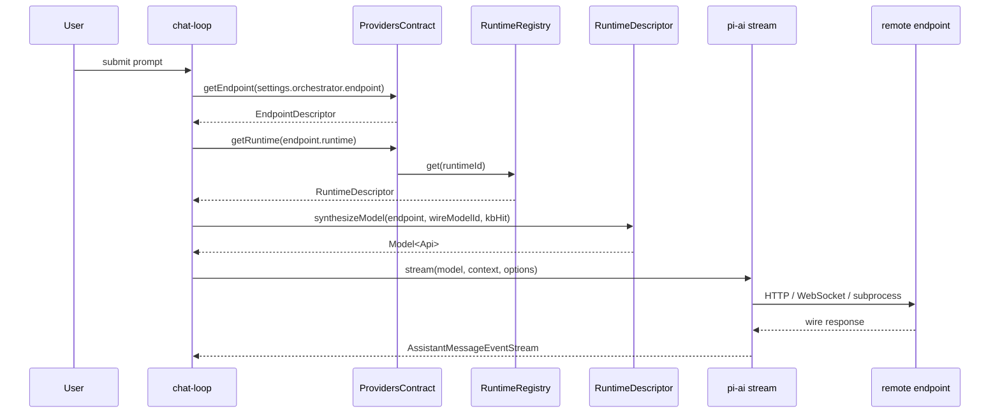
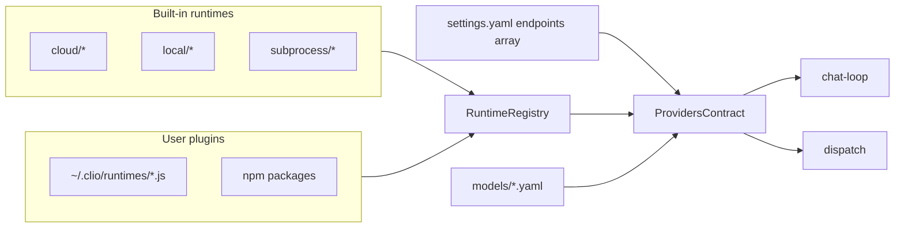

# Provider subsystem (v0.1)

## TL;DR

- Clio talks to every model backend through a single registry of `RuntimeDescriptor` objects. The 32 built-in runtimes register at domain start (`src/domains/providers/extension.ts:207-213`), and any `.js` file under `~/.clio/runtimes/` or npm package listed in `settings.runtimePlugins` joins via `loadPluginRuntimes` (`src/domains/providers/plugins.ts:31-59`).
- User configuration is a flat `endpoints: []` array in `settings.yaml`. Each entry pairs an `id` with a `runtime` descriptor id and optional `url`, `auth`, `defaultModel`, `capabilities`, `pricing`, and `wireModels`. The orchestrator chat and the worker default dispatch target both point at an endpoint id via `orchestrator.endpoint` and `workers.default.endpoint` (`src/domains/providers/types/endpoint-descriptor.ts:17-27`, `src/core/defaults.ts:49-61`).
- Generation flows through `RuntimeDescriptor.synthesizeModel(endpoint, wireModelId, kb)`, which returns a `Model<Api>` that pi-ai's `stream()` knows how to drive. Cloud runtimes hand off to pi-ai's built-in API families. Clio registers two clio-owned ApiProviders (`ollama-native`, `lmstudio-native`) via `registerApiProvider(..., "clio")` for wire formats pi-ai does not ship (`src/engine/apis/index.ts:11-16`, `src/interactive/chat-loop.ts:354-358`).
- Capability flags are merged once per endpoint status: descriptor defaults, then a YAML knowledge base keyed on `defaultModel`, then live probe output, then per-endpoint user overrides. `mergeCapabilities` walks the layers with later layers winning per-key (`src/domains/providers/capabilities.ts:3-22`).
- Dispatch admission checks `DispatchRequest.requiredCapabilities` against the merged flags before spending a worker slot. Subprocess runtimes bypass pi-ai entirely and are legal only as worker targets (`src/domains/dispatch/extension.ts:112-128`, `src/interactive/chat-loop.ts:341-344`).

## The four primitives

`RuntimeDescriptor` (`src/domains/providers/types/runtime-descriptor.ts:46-61`). A single provider-shaped object. Required fields are `id`, `displayName`, `kind` (`"http" | "subprocess"`), `apiFamily`, `auth`, `defaultCapabilities`, and `synthesizeModel`. Optional hooks are `credentialsEnvVar`, `probe`, `probeModels`, and the four direct inference methods `complete`, `infill`, `embed`, `rerank`. Descriptors are referentially identified by `id`; the registry rejects duplicate registrations (`src/domains/providers/registry.ts:19-24`).

`EndpointDescriptor` (`src/domains/providers/types/endpoint-descriptor.ts:17-27`). The user-facing config record stored in `settings.endpoints[]`. Fields: `id`, `runtime`, `url`, `auth` (`apiKeyEnvVar`, `apiKeyRef`, `oauthProfile`, `headers`), `defaultModel`, `wireModels`, `capabilities` (partial override), `gateway`, `pricing` (input, output, cacheRead, cacheWrite). The descriptor holds everything a runtime needs to talk to a concrete server; no other config file mirrors these fields.

`CapabilityFlags` (`src/domains/providers/types/capability-flags.ts:7-21`). A flat record of what an endpoint plus a model can do: `chat`, `tools`, optional `toolCallFormat`, `reasoning`, optional `thinkingFormat`, optional `structuredOutputs`, `vision`, `audio`, `embeddings`, `rerank`, `fim`, `contextWindow`, `maxTokens`. `EMPTY_CAPABILITIES` is the zero value, used when the runtime id does not resolve (`src/domains/providers/types/capability-flags.ts:23-34`). `availableThinkingLevels(caps)` derives the thinking overlay's level set from the flags (`src/domains/providers/types/capability-flags.ts:42-46`).

`RuntimeRegistry` (`src/domains/providers/registry.ts:7-14`). In-process map keyed by descriptor id. Supports `register`, `get`, `list`, `clear`, `loadFromDir(dir)`, and `loadFromPackage(name)`. The singleton returned by `getRuntimeRegistry()` is used by the providers domain, the credential store, and tests (`src/domains/providers/registry.ts:91-96`).

## Runtime descriptor catalog

The 32 built-ins aggregate in `src/domains/providers/runtimes/builtins.ts:49-82` and register into the shared registry at `registerBuiltinRuntimes` (`src/domains/providers/runtimes/builtins.ts:84-89`).

**Cloud (7)**, in `src/domains/providers/runtimes/cloud/*.ts`:

- `anthropic` (apiFamily `anthropic-messages`, auth `api-key`, `src/domains/providers/runtimes/cloud/anthropic.ts:24-61`) and `openai` (apiFamily `openai-responses`, `src/domains/providers/runtimes/cloud/openai.ts:23-60`) rely on pi-ai's built-in API families registered via `registerBuiltInApiProviders()` (`src/engine/ai.ts:38-42`).
- `google` (apiFamily `google-generative-ai`, `src/domains/providers/runtimes/cloud/google.ts:23-60`), `mistral` (apiFamily `mistral-conversations`, `src/domains/providers/runtimes/cloud/mistral.ts:23-60`), and `bedrock` (apiFamily `bedrock-converse-stream`, auth `aws-sdk`, `src/domains/providers/runtimes/cloud/bedrock.ts:24-60`) are also pi-ai built-ins.
- `groq` and `openrouter` are OpenAI-compat cloud providers; both emit apiFamily `openai-completions` and use pi-ai's generic OpenAI-compat path with a provider-specific `baseUrl` (`src/domains/providers/runtimes/cloud/groq.ts:23-60`, `src/domains/providers/runtimes/cloud/openrouter.ts:23-60`). None of the cloud descriptors implement a network `probe()`; they rely on credential presence alone.

**Local HTTP (22)**, in `src/domains/providers/runtimes/local/*.ts`, grouped by `apiFamily`:

- `openai-completions` (18): `llamacpp` (id `llamacpp`, file `llamacpp-openai.ts:33-75`), `ollama` (id `ollama`, file `ollama-openai.ts:32-80`), `lmstudio`, `vllm`, `sglang`, `tgi`, `aphrodite`, `tabbyapi`, `lemonade` (id `lemonade`, file `lemonade-openai.ts`), `litellm-gateway`, `openai-compat`, `koboldcpp`, `mlc`, `mistral-rs`, `localai`, plus three llama.cpp specializations that also carry `apiFamily: "openai-completions"` for type conformance but are invoked via descriptor methods rather than pi-ai streaming: `llamacpp-completion` (primary surface `complete()`/`infill()`, `src/domains/providers/runtimes/local/llamacpp-completion.ts:127-173`), `llamacpp-embed` (`embed()`), and `llamacpp-rerank` (`rerank()`). Probe helpers are shared in `src/domains/providers/runtimes/common/local-synth.ts:19-62` and `src/domains/providers/runtimes/common/probe-helpers.ts`.
- `anthropic-messages` (2): `llamacpp-anthropic` (`src/domains/providers/runtimes/local/llamacpp-anthropic.ts:33-82`) and `lemonade-anthropic`.
- `ollama-native` (1): `ollama-native` (`src/domains/providers/runtimes/local/ollama-native.ts:28-75`). Probes `/api/tags`, synthesizes a `Model<"ollama-native">`.
- `lmstudio-native` (1): `lmstudio-native` (`src/domains/providers/runtimes/local/lmstudio-native.ts:77-148`). The probe uses the SDK's `client.system.getLMStudioVersion()` over WebSocket.

**Subprocess (3)**, in `src/domains/providers/runtimes/subprocess/*.ts`. Each descriptor declares `kind: "subprocess"` and an `apiFamily` that pi-ai does not understand. Invocation conventions are verified against the installed CLIs:

- `claude-code-cli`: `claude --print --model <id> [--append-system-prompt <prompt>] <task>` (`src/engine/subprocess-runtime.ts:47-61`).
- `codex-cli`: `codex exec -m <id> -` with system prompt plus task piped on stdin (`src/engine/subprocess-runtime.ts:62-75`).
- `gemini-cli`: `gemini -p <task> -m <id>`, system prompt on stdin when non-empty (`src/engine/subprocess-runtime.ts:76-87`).

Each CLI descriptor probes the binary's `--version` output via `probeBinaryVersion` (`src/domains/providers/runtimes/subprocess/probe-binary.ts`). Availability reporting falls back to the OAuth session the CLI owns; Clio does not re-authenticate.

## The pi-ai hybrid split

pi-ai ships ten `Api` families: `anthropic-messages`, `openai-completions`, `openai-responses`, `openai-codex-responses`, `azure-openai-responses`, `google-generative-ai`, `google-gemini-cli`, `google-vertex`, `mistral-conversations`, and `bedrock-converse-stream`. Cloud descriptors and OpenAI-compat local descriptors synthesize a `Model<Api>` whose `api` field names one of those; `stream()` from pi-ai then routes through the registered ApiProvider (`src/engine/ai.ts:28`). Clio owns two additional API families that pi-ai does not ship: `ollama-native` wraps the `ollama` npm package into a streaming `ApiProvider` (`src/engine/apis/ollama-native.ts:258-262`), and `lmstudio-native` wraps `@lmstudio/sdk` over WebSocket (`src/engine/apis/lmstudio-native.ts`). Both are registered under the `"clio"` registration scope at provider-domain boot via `registerClioApiProviders()` (`src/engine/apis/index.ts:11-16`). Subprocess runtimes bypass pi-ai entirely; `src/engine/subprocess-runtime.ts:45-91` spawns the CLI directly and feeds stdout into a synthesized `AssistantMessage` (`src/engine/subprocess-runtime.ts:93-116`).

## On-disk state

- **`settings.yaml`** at `<configDir>/settings.yaml`. Shape is `DEFAULT_SETTINGS` in `src/core/defaults.ts:44-76`. Key blocks: `endpoints: EndpointDescriptor[]` (line 49), `orchestrator: { endpoint, model, thinkingLevel }` (lines 50-54), `workers.default: WorkerTarget` (lines 55-61), `scope: string[]` for Ctrl+P cycling (line 62), `budget` (lines 63-66), `compaction` (lines 72-75). First-install writes the commented template in `DEFAULT_SETTINGS_YAML` (`src/core/defaults.ts:91-184`).
- **`credentials.yaml`** at `<configDir>/credentials.yaml`, mode `0600`. Shape is `{ version: 1, entries: { <runtimeId>: { key, updatedAt } } }`. Atomic writes go through `atomicWriteSecret` which opens the tmp file at `0o600` explicitly before rename (`src/domains/providers/credentials.ts:28-38`, `src/domains/providers/credentials.ts:59-89`). Lookup is keyed by runtime descriptor id so the `EndpointDescriptor.auth.apiKeyRef` resolves through the same slot (`src/domains/providers/credentials.ts:101-139`).
- **`~/.clio/runtimes/`** (more precisely, `<configDir>/runtimes/`). Any `.js` file whose default export passes the `isRuntimeDescriptor` duck check joins the registry at `loadPluginRuntimes` time. Import failures and id conflicts are logged to stderr and never throw (`src/domains/providers/plugins.ts:37-58`, `src/domains/providers/registry.ts:114-127`).
- **`src/domains/providers/models/*.yaml`** ships the model-family knowledge base, nine YAMLs: `claude`, `deepseek`, `gemini`, `gpt-oss`, `gpt`, `llama3`, `llama4`, `mistral`, `qwen3`. Each file is a list of `KnowledgeBaseEntry` records with `family`, `matchPatterns`, `capabilities`, and optional `quirks`. `FileKnowledgeBase.lookup(modelId)` picks the longest matching pattern and marks the hit `family` vs `alias` (`src/domains/providers/types/knowledge-base.ts:26-75`).

## Capability merge

`mergeCapabilities(base, kb, probe, userOverride)` at `src/domains/providers/capabilities.ts:3-22`. The layers are applied left-to-right with `undefined` values skipped, so the last defined value wins per key. `base` is the runtime's `defaultCapabilities`. `kb` is the matched knowledge-base entry looked up from `endpoint.defaultModel`; families like `qwen3` and `claude` add `reasoning`, `thinkingFormat`, and raised `contextWindow`/`maxTokens`. `probe` is the descriptor's live `probeResult.discoveredCapabilities` (for example, llama.cpp's `/props` reports the actual context window and whether `/infill` is compiled in; see `probeLlamaCppProps` in `src/domains/providers/runtimes/common/probe-helpers.ts`). `userOverride` is `endpoint.capabilities` set by hand in `settings.yaml`. The merge runs once per `buildStatus` call in the providers domain (`src/domains/providers/extension.ts:75-88`), and consumers read the final flags off `EndpointStatus.capabilities`.

## End-to-end flow

On submit, `readTarget()` reads `orchestrator.endpoint`/`orchestrator.model` out of settings and resolves them to an `EndpointDescriptor` plus `RuntimeDescriptor` via the providers contract (`src/interactive/chat-loop.ts:328-352`). Subprocess runtimes are rejected for the orchestrator at this step. `synthesizeModel(target)` then asks the runtime to build the `Model<Api>` using the endpoint, the wire model id, and a knowledge-base hit looked up from the wire id (`src/interactive/chat-loop.ts:354-358`). The synthesized model is seeded into a pi-agent-core `Agent` (`src/interactive/chat-loop.ts:377-393`), whose `prompt()` call eventually invokes pi-ai's `stream()` and yields an `AssistantMessageEventStream` that chat-loop forwards to the TUI.

## Dispatch capability gate

`createDispatchBundle` in `src/domains/dispatch/extension.ts:151-250` wires the worker side of the subsystem. `resolveDispatchTarget` picks the endpoint and wire model from the request, the agent recipe, then `workers.default`, and cross-looks the endpoint's merged capabilities off `providers.list()` (`src/domains/dispatch/extension.ts:75-109`). `enforceCapabilityGate(endpointId, capabilities, required)` (`src/domains/dispatch/extension.ts:112-128`) then checks each name in `DispatchRequest.requiredCapabilities` against the merged flags. Missing-or-false/0/"" values throw before a worker slot is acquired, with a message of the form `dispatch: admission denied … capability '<name>' not supported by endpoint '<id>'`. A null `capabilities` map (unknown runtime id) also fails the gate.

## Extension points

Third-party contributors drop a `.js` file into `<configDir>/runtimes/` exporting a default `RuntimeDescriptor`. `RuntimeRegistry.loadFromDir` imports each file and duck-checks the export before calling `register` (`src/domains/providers/registry.ts:34-57`, `src/domains/providers/registry.ts:114-127`). An npm package listed in `settings.runtimePlugins` works the same way if it exports a `clioRuntimes: RuntimeDescriptor[]` array (`src/domains/providers/registry.ts:59-86`, `src/domains/providers/plugins.ts:47-56`). Any id collision between builtins and plugins is logged and the plugin is skipped; builtins register first (`src/domains/providers/extension.ts:210-213`).

## Where to extend for common changes

- **Add a new cloud SDK provider.** Add a file under `src/domains/providers/runtimes/cloud/` with a default-exported `RuntimeDescriptor`, then include it in `BUILTIN_RUNTIMES` in `src/domains/providers/runtimes/builtins.ts:49-82`. If the provider speaks a wire format pi-ai already ships, set the matching `apiFamily`. Otherwise, see the next bullet. One or two files.
- **Add a new local HTTP engine.** Add a file under `src/domains/providers/runtimes/local/` and register it in `builtins.ts`. If the engine speaks OpenAI-compat, set `apiFamily: "openai-completions"` and reuse `synthLocalModel` plus `withV1`/`withAsIs` from `src/domains/providers/runtimes/common/local-synth.ts`. If it speaks a novel wire format, add an `ApiProvider` under `src/engine/apis/` and wire it into `registerClioApiProviders()` in `src/engine/apis/index.ts:11-16`. One to three files.
- **Add a new CLI agent runtime.** Add a descriptor under `src/domains/providers/runtimes/subprocess/` with a `probe` hook that calls `probeBinaryVersion`, then extend the `planInvocation` switch in `src/engine/subprocess-runtime.ts:45-91` with the binary, args, stdin, and env handling. Two files.
- **Add a new capability dimension.** Extend `CapabilityFlags` in `src/domains/providers/types/capability-flags.ts:7-21` and update `EMPTY_CAPABILITIES` if the new key has a zero value. Populate `defaultCapabilities` on each descriptor that supports the feature, then update consumers that gate on it (chat-loop, `availableThinkingLevels`, TUI overlays, dispatch `enforceCapabilityGate`).
- **Override pricing for a specific endpoint.** Set `pricing: { input, output, cacheRead?, cacheWrite? }` on the endpoint in `settings.yaml`. `EndpointDescriptor` carries the field (`src/domains/providers/types/endpoint-descriptor.ts:10-15`) and the descriptor's `synthesizeModel` reads it into `Model.cost` so pi-ai's accounting picks it up.

## Known limitations

- Subprocess workers bundle CLI stdout as a single assistant message. Tool-call streaming via `claude --print --output-format stream-json` or `codex exec` is not parsed in v0.2 (`src/engine/subprocess-runtime.ts:1-8`, `src/engine/subprocess-runtime.ts:185-200`).
- The `lmstudio-native` runtime requires a WebSocket-reachable LM Studio server. The SDK normalizes `http://` to `ws://` and `https://` to `wss://` at connect time (`src/domains/providers/runtimes/local/lmstudio-native.ts:22-28`).
- `RuntimeDescriptor` exposes `embed` and `rerank` methods (`src/domains/providers/types/runtime-descriptor.ts:59-60`) and ships three llama.cpp descriptors that implement them (`llamacpp-embed`, `llamacpp-rerank`, and `complete`/`infill` on `llamacpp-completion`), but dispatch has no first-class embeddings or rerank path yet. Callers invoke the descriptor methods directly.
- Two interactive e2e tests (`/scoped-models` and `/thinking`) assert lifecycle only because pi-tui `SelectList` paints below the PTY harness viewport. The capability surface is exercised by integration tests instead.
