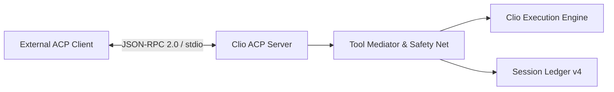

# Agent Client Protocol (ACP) Server

The [coding agent interoperability guide](../guide/interop.md) covers the operator workflow for external agents.

This document defines the architecture, transport protocols, tool mediation layers, permission handling, and error taxonomy for Clio Coder's Agent Client Protocol (ACP) server implementation in the current source tree.

Source implementations: `src/engine/acp/` and [acp.ts](../../src/cli/acp.ts).

---

## 1. Overview & Protocol Specification

Clio Coder provides a native ACP server via the `clio-coder acp` command. The server implements the open Agent Client Protocol specification (ACP v1, schema v1.23.0) over standard I/O JSON-RPC 2.0 transport ([transport.ts](../../src/engine/acp/transport.ts)).

The ACP server allows external IDEs, editors (such as Zed), and automated orchestration engines to drive Clio Coder sessions over a structured protocol.
The source tree includes the `apps/clio-coder-gui` application, which supervises
ACP children and exposes session operations through authenticated local REST and
SSE.



---

## 2. Server Command & Transport Wiring

The server is invoked via:

```bash
clio-coder acp [--cwd PATH] [--permission-timeout MS]
```

`clio-coder --acp [--cwd PATH] [--permission-timeout MS]` is an exact alias;
both spellings reach the same command dispatcher, option parser, stdout guard,
and server boot path.

- `--cwd PATH`: Workspace root the server boots in. The path is resolved and then canonicalized with `fs.realpath`, so a symlinked launch root, a trailing slash, and a `/.` suffix all name the same workspace. Clio changes into that canonical path before it reads settings, builds project context, or opens a session ledger, so a session opens at that root. A path that does not exist or that the process cannot enter exits 2 without starting the server. The canonical path is the server's workspace identity for its whole life: `session/new` must carry a `cwd` that canonicalizes to the same path, and nothing after boot ever changes the process directory.
- `--permission-timeout MS`: The server-side fail-safe ceiling for one mediated permission request, as a whole number from 1 through Node's maximum schedulable timer delay (`2147483647`) milliseconds. Values outside that range are refused before the protocol server starts. If the timer wins, the approval expires, the active turn is aborted, every parked call for that turn is settled only so execution can unwind, and `session/prompt` fails with `permission_expired`. Expiry is audited as `expired`, never as a human denial, and no denial result is fed into a continuing model loop. The flag overrides `integrations.externalAgents.defaults.permissionTimeoutMs` for this server only, which itself defaults to `DEFAULT_DELEGATION_PERMISSION_TIMEOUT_MS = 120000` ([defaults.ts](../../src/core/defaults.ts)). The graphical application treats the remaining ACP request window as a hard ceiling on its own approval budget, projects that duration onto its own clock, escalates immediately when the remaining window is shorter than its escalation delay, and cancels without publishing a card if the window has already elapsed. Other clients may enforce a shorter operator-facing policy by sending ordinary `session/cancel`.

A client that advertises `clientCapabilities.auth.terminal:true` receives a terminal authentication method with `args:["auth","login"]`. Appending those args to the configured ACP launch command opens Clio's interactive Quick Connect flow through `clio-coder acp auth login` (including any preceding `--cwd` flag). Other clients receive no terminal method. The `authenticate` handler rejects unknown or terminal method IDs with `-32602`; terminal authentication takes place in a separate process. The `logout` handler ends the current ACP connection's authenticated state and returns `{}`. Subsequent session creation, loading and prompting on that connection return `-32000` until the client reconnects. Clio advertises `agentCapabilities.auth.logout:{}`.

Transport frames are JSON-RPC 2.0 messages serialized over `stdin`/`stdout`. All logging and diagnostic output is strictly routed to `stderr` to preserve standard I/O framing integrity.

---

## 3. Supported ACP Methods

These are every method the server answers ([server.ts](../../src/engine/acp/server.ts)). Anything else returns `-32601`.

| Method | Direction | Description |
| :--- | :--- | :--- |
| `initialize` | Client → Server | Answers with supported protocol version `1`, agent capabilities, and server implementation info. Must be called first, exactly once. |
| `authenticate` | Client → Server | Rejects unknown method IDs with `-32602`. Terminal methods run in a separate process. |
| `logout` | Client → Server | Ends the current ACP connection's authenticated state and returns `{}`. |
| `session/new` | Client → Server | Opens the one session this process hosts and returns modes and session configuration options. |
| `session/load` | Client → Server | Restores a closed session and streams its complete active-branch history before returning. |
| `session/resume` | Client → Server | Restores a closed session and provider context without sending earlier messages to the client. |
| `session/list` | Client → Server | Lists workspace sessions as `SessionInfo` records, with a cwd filter and cursor paging. |
| `session/delete` | Client → Server | Permanently deletes a closed workspace session. Refuses hosted or unended sessions. |
| `session/set_mode` | Client → Server | Sets session autonomy to `default` or `yolo` while idle. |
| `session/set_config_option` | Client → Server | Sets session autonomy, model, or thinking level while idle and returns the full option list. |
| `session/prompt` | Client → Server | Submits a user prompt to the session execution loop. |
| `session/cancel` | Client → Server | Cancels the in-flight prompt, its running tools, and any outstanding permission request. Accepted as a request (returns `{}`) and as a notification (returns nothing). |
| `session/close` | Client → Server | Cancels any active prompt, waits for its writer to settle, and closes the durable session. |
| `_clio-coder/session/label` | Client → Server | Sets or clears a durable session display name. Legal before opening a session and during a prompt. |
| `_clio-coder/settings/get_safe` | Client → Server | Reads the closed credential-free settings projection. Legal before opening a session and during a prompt. |
| `_clio-coder/settings/patch_safe` | Client → Server | Atomically validates, persists, and applies a flat patch over the closed safe setting set. Refused during a prompt. |
| `_clio-coder/targets/list` | Client → Server | Lists bounded, credential-free target/model summaries from configuration and the in-memory cache without network traffic. |
| `_clio-coder/targets/probe` | Client → Server | Explicitly probes one configured target through the provider domain and returns only a closed health result. |
| `_clio-coder/session/steer` | Client → Server | Queues operator guidance on the running turn, on the steering queue (`next-slot`) or the follow-up queue (`end-of-turn`). Reports a refusal rather than a silent success when nothing is streaming. |
| `_clio-coder/session/queue` | Client → Server | Reads both queues in enqueue order. |
| `_clio-coder/session/queue_clear` | Client → Server | Drains both queues together and returns the texts, which become the client's to re-send. |
| `_clio-coder/session/interrupt` | Client → Server | Cancels the running turn, or reports why it cannot be. Cancel only: the outstanding `session/prompt` settles with `cancelled` and the next prompt is the client's to send. |
| `_clio-coder/dispatch/steer` | Client → Server | Queues guidance on, or aborts, one running worker by `runId`. Acceptance means queued on the worker's stdin, never delivered. |
| `_clio-coder/commands/list` | Client → Server | Returns the catalog of exposed operator commands with the grammar a palette builds its argument UI from. |
| `_clio-coder/commands/invoke` | Client → Server | Runs one exposed operator command headlessly and returns its notice level and output lines. |
| `session/request_permission` | Server → Client | Requests permission from the client for a gated tool operation. |
| `_clio-coder/event` | Server → Client | Sends a versioned extension event only to a client that opted into a recognized kind. The v1 allowlist is `safety.loopBlocked`, `dispatch.enqueued`, `dispatch.started`, `dispatch.progress`, `dispatch.completed`, `dispatch.failed`, `accountability.evidenceReady`, `compaction.end`, `context.warning`, `safety.toolBudgetExceeded`, and `provider.health`. Every kind is the engine's own `BusChannels` value, never a renamed alias, so a captured frame names its producer. |

`agentCapabilities.loadSession` is `true`, and `agentCapabilities.sessionCapabilities` advertises `close`, `list`, `delete`, and `resume` when the session store is wired. All non-standard methods are advertised only under `agentCapabilities._meta`; a strict generic ACP v1 client can use stable session discovery, modes, and configuration options without interpreting Clio metadata. Clio extension events still require an explicit opt-in.

---

## 4. Initial Safe Profile

This section states what the server guarantees on the wire. It is the source-side contract any strict client can hold Clio to.

### Error envelope

JSON-RPC layer codes follow the pinned ACP v1 schema: `-32700` parse, `-32600` invalid request, `-32601` method not found, `-32602` invalid params, `-32603` internal error, `-32002` missing resource, and `-32000` authentication required. Every error frame carries its machine-readable detail in exactly one place:

```json
{"code":-32603,"message":"<one line, ≤256 chars, no paths, no stack>",
 "data":{"_meta":{"clio-coder/error":{"version":1,"code":"<closed-set string>","reason":"<optional>","supported":[1]}}}}
```

`data` never carries a stack, an echoed frame, a filesystem path, provider text, or a secret. Neither does `message`. Every message on the wire is authored by this process: `turn_failed` is always the fixed string `the prompt turn failed`, `internal_error` is always the fixed string `internal error`, and `method_not_found` is always the fixed string `method not found`, whatever the underlying failure said and whatever the peer called. A provider or engine failure body legitimately quotes the request URL it used, the settings file it read a credential from, or the credential itself, and bounding that text to one line still ships the secret. The client branches on `data._meta`'s `code`; the original message, bounded to one line, goes to stderr prefixed with `[clio-coder:acp]`. The `code` values are a closed set:

| `data.code` | When |
| :--- | :--- |
| `not_initialized` | Any method other than `initialize` before a successful `initialize`. |
| `already_initialized` | A second `initialize` on the same connection. |
| `authentication_required` | `logout` ended this connection's authenticated state. Uses `-32000`. |
| `invalid_params` | A request is missing a required value, has an unknown key or closed-enum value, exceeds a byte/array bound, contains a C0/DEL control character in peer-controlled text, or otherwise violates its exact method shape. Uses `-32602`. `reason: "target-unknown"` refines selection of an unconfigured target. |
| `session_cwd_mismatch` | `session/new.cwd`, `session/load.cwd`, or `session/resume.cwd` is absent, not an absolute string, unresolvable, or canonicalizes to something other than the server's workspace. |
| `session_limit` | A second opener while a session is hosted. Closing the hosted session releases the slot. |
| `session_unknown` | A session id is not hosted when hosting is required, or cannot be found in canonical-workspace history for a list/load/label/delete operation. The server does not disclose whether the same id exists under another workspace. |
| `session_open` | Load or delete targets the hosted session, or a workspace record whose `endedAt` is still null. Clio has no cross-process lease, so an unclean crash is intentionally indistinguishable from another process still owning the record. |
| `prompt_active` | A second `session/prompt` while one is running, or a settings, mode, or configuration mutation during a prompt. |
| `prompt_not_admitted` | Clio refused to start the turn. `data.reason` carries the admission reason. |
| `permission_expired` | The server permission ceiling won. The prompt is aborted and fails with fixed message `permission approval expired`; internal audit status is `expired`, not `denied`. |
| `turn_failed` | The provider or engine failed after the turn was admitted. `message` is the fixed string `the prompt turn failed`; the provider's own text goes to stderr. |
| `parse_error` | A stdin line was not valid JSON. Uses `-32700` with `id: null`; the offending line is not echoed. |
| `invalid_request` | A frame was not JSON-RPC `2.0`, or carried an `id` and no `method`. Uses `-32600`; the rejected frame is not echoed. |
| `input_line_too_large` | One stdin line exceeded 1 MiB. Uses `-32600` with `id: null`; the line is discarded and the transport continues. |
| `invalid_request_id` | A request arrived with `id: null`. Uses `-32600`. |
| `method_not_found` | An unregistered or unavailable method. Uses `-32601`. `message` is the fixed string `method not found`; the peer-controlled method name is never echoed, however short it is. |
| `internal_error` | A handler failed in a way it did not classify. `message` is the fixed string `internal error`; the thrower's text goes to stderr and carries no stack. |

### One session per process

At most one `session/new`, `session/load`, or `session/resume` is hosted at a time. Another opener fails with `session_limit` until the hosted session closes. Closing releases the slot and resets the conversation so another session can open in the same process. The workspace remains the launch workspace for the lifetime of that process.

### Workspace pinning

The launch `--cwd` is canonicalized once at boot and is the server's workspace for its whole life. `session/new`, `session/load`, and `session/resume` require a `cwd` that is a non-blank absolute path, checked before any session is opened, and that canonicalizes to the server's workspace; anything else fails with `session_cwd_mismatch`. A relative `cwd` such as `.`, `./`, or `sub` is refused even when it would resolve to the workspace, since it resolves against whatever directory the process happens to be in and the client would believe it had pinned a path it never sent. The server never calls `chdir` after boot and never falls back to the launch root when the requested path is unusable. The mismatch message names no path.

Workspace authority remains the exact canonical launch directory, never the enclosing Git root. Workspace Git probes treat an ignored nested scratch directory as non-Git. An unignored monorepo subdirectory may truthfully inherit repository-level branch, upstream, and remote facts, but dirty status and recent commits are path-scoped to the exact workspace, and no parent path is returned.

### Session attribution and load replay

`session/new` captures the current effective orchestrator `target` and `model` in durable session metadata and returns them under `_meta["clio-coder/session"]`. These are the initial selections at bind time, not an eager health/admission promise. A later settings patch may change the next turn's route; the original metadata remains initial attribution and the runtime ledger records later model changes. The TUI `/new` path records the same two fields.

`session/new` returns `{sessionId,modes,configOptions,_meta}`. Session ids and target ids are 1–128 UTF-8 bytes; model ids are at most 256 bytes. `_meta["clio-coder/session"]` retains the bind-time target, model, autonomy, and creation time. `target` or `model` is null when that half was unselected at bind. A locally configured selected route that exceeds those wire bounds makes the opener fail `internal_error`; Clio never converts an active over-bound selection to null and then runs it anyway. `createdAt` is canonical ISO-8601 and autonomy is `default` or `yolo` for operator sessions; workers run at `default`, with a separate read-only dispatch restriction.

`session/load` accepts exactly `{sessionId,cwd,mcpServers:[]}`. Non-empty or malformed MCP configuration is `invalid_params`; this server advertises no MCP transport capability. The id must occur in the launch workspace's history and must be durably closed. An unhosted record with `endedAt:null` fails `session_open`: Clio cannot prove whether it belongs to a live process or an unclean crash, and does not guess.

Before writing any client history, load resolves the durable pinned leaf, reads and validates the rich entry stream, constructs the full provider replay for the active path, resumes the writer, and calls `ChatLoop.resetForSession(leaf,replayMessages)`. Only then does it emit standard `session/update` history. Client replay uses original user, assistant, thought, tool-call, and tool-result entries from the selected branch; it never disguises Clio-generated compaction summaries, system notes, bash sidecars, or skill context as operator prose. A stored tool call with no outcome receives one terminal failed update with content `unrecorded`. Historical tool ids use the same 128-byte alias/uniqueness rules as live calls, and replay never requests permission.

Every replay notification precedes the `session/load` response and carries `params._meta["clio-coder/replay"]={turn:n}`. Markers are 1-based over the complete replay; live updates omit the marker. The server streams every active-branch turn without a turn-count or aggregate byte cut. The load response contains `modes`, `configOptions`, and `_meta["clio-coder/session"].replayed={turns,truncated:false}`. `session/resume` performs the same provider restoration and returns modes and configuration options without sending history updates.

### Session list, label, delete, modes, and configuration options

`session/list` accepts `{cwd?,cursor?}` and returns `{sessions,nextCursor?}` newest first. Each `SessionInfo` has `sessionId`, absolute `cwd`, optional `title`, and `updatedAt`. A matching absolute cwd filters to the server's workspace. An opaque cursor advances through pages of at most 50 rows; a page also stays below the transport's 240 KiB response budget. The method is legal before an opener and during a prompt.

`_clio-coder/session/label` accepts `{sessionId,label}` where label is 0–256 UTF-8 bytes and C0/DEL-free. Empty clears. It writes the existing session-wide `sessionInfo.name` vocabulary, including for an off-current closed session, and list is the readback. A hosted session also emits `session_info_update`. It is legal before an opener and during a prompt.

`session/delete` accepts `{sessionId}` and permanently deletes only a canonical-workspace record whose `endedAt` is non-null. Hosted or unended records fail `session_open`; unknown and cross-workspace ids fail `session_unknown` without disclosing another workspace. It is legal before an opener and during an unrelated prompt.

`modes` offers `default` and `yolo`. `session/set_mode` changes the hosted session's autonomy, emits `current_mode_update` and `config_option_update`, and returns `{}`. The same autonomy control appears as a `mode` config option. A `model` option appears when a model is selected, and a `thought_level` option offers the thinking levels. `session/set_config_option` changes one option and returns the full list. Model and thinking changes use the session route without saving a default. All three controls refuse a change during a prompt. A global safe-settings autonomy patch changes the future-session default and does not silently mutate this bound snapshot.

When the command host is wired, the server sends `available_commands_update` for commands it can execute from an ACP prompt. Tool start updates include the tool's `name`. Clio retains per-turn token and cost details in `_meta["clio-coder/usage"]`, including cost provenance. She does not send `usage_update` because she cannot derive a reliable current-context token count from cumulative turn usage. The task board can contain blocked and dropped tasks, which ACP plan status cannot represent, so she does not send a `plan` update for that board.

### Safe settings and targets

`_clio-coder/settings/get_safe` accepts `{}` and returns exactly:

```json
{"settings":{"chat":{"target":null,"model":null,"thinkingLevel":"off"},"safety":{"autonomy":"default"}},
 "editable":["chat.target","chat.model","chat.thinkingLevel","safety.autonomy"]}
```

The values above are illustrative. Thinking is one of `off`, `minimal`, `low`, `medium`, `high`, `xhigh`, or `max`. No other settings leaf, URL, auth fact, credential reference, path, header, provider reason, or provider error crosses the wire. The method is legal before an opener and during a prompt.

`_clio-coder/settings/patch_safe` accepts `{patch}` where patch is a flat object keyed only by the four strings in `editable`. It validates the entire candidate before one locked settings mutation, persists routing as the future default, and updates this process's next-turn routing. The locked writer applies the effective-view delta to the user document and revalidates it with the workspace's project layers before writing, so a project-only target can be selected without copying its URL or descriptor into user settings; a higher-precedence project leaf that would silently undo the patch causes the write to fail with no partial document. Unknown keys or values are `invalid_params`; an unknown non-null target adds `reason:"target-unknown"`. Target/model identifiers use the 128/256-byte bounds and peer-controlled strings reject C0/DEL. A non-null model requires a non-null resulting target. A pre-existing selected route outside those bounds makes `get_safe` fail `internal_error` rather than falsely returning null. Patch is legal before an opener but fails `prompt_active` while a turn runs.

`_clio-coder/targets/list` accepts `{}` and returns `{targets:[{id,runtime,models,isOrchestrator}]}`. It reads only configured and cached state, never probes. At most 64 targets are returned. Target ids are at most 128 bytes, runtime ids 64, and the stable union of configured default/wire and discovered model ids is at most 64 models per target, each at most 256 bytes. The complete result is also capped to a 240 KiB stable prefix of whole target/model entries so it fits a strict 256 KiB JSON-RPC frame ceiling after the response envelope is added. If that byte budget drops a model or target, the result additionally carries `_meta["clio-coder/truncated"]:true`; the key is absent when the byte-budget result is complete. Unsafe stored identifiers are omitted rather than truncated into collisions. URL, auth state, credential provenance, raw runtime descriptors, health errors, and provider prose are never projected.

`_clio-coder/targets/probe` accepts exactly `{targetId}` for an already-configured target and performs the provider domain's existing bounded live probe. It returns `{targetId,healthy,latencyMs,reason}` where latency is a non-negative integer or null and reason is exactly `not-configured`, `unreachable`, `unsupported`, `probe-failed`, or null. Provider text is mapped, never copied. The call starts no Clio turn and spends no orchestrator model tokens. Both target methods are legal before an opener and during a prompt.

### Opt-in extension events

A client opts into the first extension event with `initialize.params.clientCapabilities._meta["clio-coder/events"]={version:1,kinds:["safety.loopBlocked"]}`. The kinds array has at most 16 strings, each at most 64 UTF-8 bytes and C0/DEL-free; a malformed opt-in is ignored. Unknown bounded versions and kinds are ignored. Without a recognized opt-in, no `_clio-coder/event` notification is sent.

The v1 notification is
`{version,workspaceInstanceId,sessionId,turnId,sequence,kind,terminal,payload}`.
`workspaceInstanceId` is one opaque process UUID advertised at initialize, and
`sequence` increases monotonically within it.

| Kind | Payload | `terminal` |
| --- | --- | --- |
| `safety.loopBlocked` | `{toolCallId:null,tool,repeatCount,blocksThisTurn,budget,disposition,interrupted,shape:null}`. Disposition is `block`, `lockout`, or `stop`. | `false` |
| `dispatch.enqueued`, `dispatch.started` | Bounded run and agent identity, optionally with `taskPreview`. | `false` |
| `dispatch.progress` | Bounded run and agent identity plus lifecycle counters. | `false` |
| `dispatch.completed`, `dispatch.failed` | Bounded run and agent identity plus terminal taxonomy. | `true` |
| `accountability.evidenceReady` | `{runId,evidenceId,firstPassSuccess,findingCount,tags}`. | `true` |
| `compaction.end` | `{trigger}`, the bounded identifier naming why the window was cut. | `false` |
| `context.warning` | Always the object `{warning}`, where `warning` is a control-character-stripped sentence bounded to 256 UTF-8 bytes, or `null`. The clearing edge is `{warning: null}`, never a null payload. | `false` |
| `safety.toolBudgetExceeded` | `{tool,callsThisTurn,softBudget,hardCeiling,interrupted}`. | `true` exactly when `interrupted` |
| `provider.health` | `{targetId,status,available,latencyMs}`, where status is exactly `healthy`, `degraded`, `unknown`, or `down`. | `false` |

An event whose identity or taxonomy cannot be represented safely is dropped
rather than forwarded under a repaired one.

<details>
<summary>What each kind deliberately leaves behind, and why two loop-block fields are null</summary>

`safety.loopBlocked` is emitted only during the hosted active prompt, and its
`interrupted` is true exactly for a `stop` disposition. `safety.toolBudgetExceeded`
has no disposition; its `interrupted` is the bus payload's own flag. The loop detector fires before the
blocked call executes, so no honest ACP tool-call id exists, and the bus has no
disclosure-safe normalized shape; both fields stay null rather than being
fabricated.

`taskPreview` on enqueued and started events is a control-character-stripped
prefix bounded to 160 UTF-8 bytes. The exact task and raw progress or failure
prose never cross this boundary.

`accountability.evidenceReady` follows the terminal event of a run whose evidence
bundle has landed, carrying the same summary the observability projection
attaches to the run, published once by the observability extension on the
`accountability.evidenceReady` bus channel. Tags are at most 32 bounded
identifiers of at most 64 bytes; the bundle's findings and overview prose never
cross. A run whose build failed sends nothing, so the absence of the event means
only that no bundle is ready.

`safety.toolBudgetExceeded` is emitted only during the hosted active prompt,
because the budget it names is per-turn.

`compaction.end` does not carry the producer's `at` timestamp, because a client
re-stamps on arrival.

`context.warning` is a transition-only channel, so `{warning: null}` is the
clearing edge and crosses as itself. Dropping it would leave a client's banner up
forever.

`provider.health` leaves `lastError` behind: it is provider prose that
legitimately quotes URLs and response bodies, the same way `dispatch.failed`'s
`outcomeDetail` does.

The last four kinds describe the session rather than the fleet, and close the
context-meter, footer-status, and retry-visibility parity rows a client would
otherwise have to infer from timing and tool titles.

</details>

### Prompt input

Prompt text is read only from `params.prompt`, the ACP v1 array of content blocks. Text blocks contribute their `text`; baseline `resource_link` blocks contribute a `Resource: <name> (<uri>)` reference. The parts are joined with a newline and trimmed. Image, audio, and embedded resource blocks require capabilities Clio does not advertise and do not contribute text. No other shape is accepted: `params.content`, `params.message`, and a bare string `params.prompt` all fail with `-32602 invalid_params`, the same as a prompt whose text is empty. A client's framing bug therefore fails here the same way it would against any other ACP agent, instead of appearing to work only against Clio.

### Bounds

Every frame the server writes is bounded ([types.ts](../../src/engine/acp/types.ts)). Every cap counts UTF-8 bytes, which is what the peer's read buffer spends, not UTF-16 code units:

- `agent_message_chunk` and `agent_thought_chunk` text is at most 16 KiB per chunk. A longer delta is split across consecutive chunks and nothing is dropped, so concatenating chunks in order reproduces the model's text exactly. No split falls inside a code point, so a surrogate pair never arrives as two replacement characters.
- Tool `content` text is truncated at 16 KiB with a trailing `…[truncated]`.
- Live tool titles are at most 512 UTF-8 bytes. The bound applies identically to `tool_call`, `tool_call_update`, and `session/request_permission`; replay titles retain their stricter 64-byte stored-data bound.
- Tool progress is off unless the client opts in, and bounded three ways when it is on: at most 64 non-terminal `tool_call_update` frames per `toolCallId` per turn, at least 250 ms between two frames for one id, and a snapshot byte-identical to the previous one for that id is never re-sent. Each frame's text is the tool's cumulative output, bounded to 16 KiB with the standard marker, so a client replaces the row's content rather than appending. A frame naming a `toolCallId` with no open call is dropped, never minted, and the terminal update still arrives exactly once, last.
- Every string inside `rawInput` and `rawOutput` is truncated at 4 KiB with the same marker, with one path-aware exception: `rawOutput.result.details.diff` is bounded at 28 KiB, `ACP_MAX_RAW_RECORD_BYTES` minus one generic string budget reserved for the rest of the record. At 4 KiB a multi-hunk refactor stopped mid-hunk; at the full record cap a large diff would have tripped the record cap and degraded the whole record to `{truncated:true}`, which is worse than the bug. A top-level `diff`, an array member, and every sibling string stay at 4 KiB. The walk stops at depth 8, replacing anything deeper with `"[depth]"`. The marker is reserved inside the cap, so a truncated value is at most the cap itself. If the bounded record still serializes past 32 KiB of UTF-8 it becomes `{"truncated":true,"bytes":<serialized UTF-8 length>}`, where the length is the record's serialization before any bounding, so the figure names the payload the engine produced rather than the shortened copy that was not sent. A record that does not serialize at all reports the bounded copy's length, or `0` when neither form serializes.
- Every `toolCallId` is at most 128 UTF-8 bytes. An engine id longer than that, a missing one, or one that collides with an alias this turn already minted is replaced by a per-turn `clio-coder-tool-<n>` alias, and the same alias is used for the call's `tool_call`, its `tool_call_update`, and its permission request, so one call never splits into two identities on the client. Identity runs one way: each engine tool-call id maps to exactly one emitted call. A turn that starts a second call under an engine id it already used mints a fresh alias for it rather than reusing the earlier wire id, so two calls never merge into one, and a `tool_execution_end` closes that id's most recently opened call first. An end that names an engine id is confined to that engine id's own calls: an id this turn never started binds to nothing, and the end is dropped and reported on the stderr tail rather than borrowing another call's wire id, which reported one tool's result under another tool's identity and closed a call that was still running. Every wire id receives exactly one terminal update. Once a `tool_call_update` with `completed` or `failed` has gone out for an id, the cancel/fail sweep included, that id never receives another, and a late or duplicate end for it is dropped and reported on the stderr tail instead of overwriting the result the client already rendered. An end arriving with no engine id binds to the most recently opened call still running, which is what makes a nested lifecycle close correctly: with an outer and an inner call open and the inner one already ended, the next unidentified end is the outer call's. With nothing still open it binds to the most recently emitted call of the turn, which drops it when that call is already terminal, and an end arriving before the turn has emitted any `tool_call` is dropped outright. Nothing on the end path mints a wire id, so a `tool_call_update` never announces an id the client never saw start.
- `locations` carries the absolute path for the built-in path-bearing tools (`read`, `write`, `edit`, `ls`, `grep`, `find`) when the arguments name one, resolved against the pinned workspace and deliberately not realpath'ed, since an `edit` or `write` target may not exist yet. Each emitted path is at most 4 KiB of UTF-8, with `…[truncated]` inside that budget when the resolved value is longer. The exact bounded snapshot is reused by `session/request_permission`. When there is no recognizable path the field is omitted entirely rather than sent as `null` or `[]`.
- A live prompt emits at most 128 `tool_call` starts. On the next start the server emits no 129th call, cancels the underlying Clio turn, suppresses subsequent chat events, terminally fails every already-rendered open call, and resolves `session/prompt` with standard stop reason `max_turn_requests`. This stop reason is emitted by the ACP bridge only for that presentation ceiling; Clio's separate configurable execution guard remains an engine policy rather than a wire-cardinality promise.
- A cancelled or failed turn synthesizes a `tool_call_update` with `status: "failed"` for every call that received a `tool_call` and no terminal update, before the prompt request settles.
- Steer text is at most 16 KiB and must be non-blank. `\n`, `\r`, and `\t` are content; every other C0 control is refused rather than stripped, because a steer the model saw rewritten would disagree with the copy the client's own UI is showing. An interrupt `reason` is at most 256 bytes and control-character-free. Each queue returns at most 64 entries, each bounded to 16 KiB with the standard marker. A `runId` for dispatch steering is at most 128 bytes.
- One `_clio-coder/commands/invoke` returns at most 200 lines of at most 1 KiB each, with a trailing `…output truncated at 200 lines` when capped. `argv` is at most 32 elements of at most 4 KiB; elements are joined with single spaces and never quoted, so a quote character, a control character, and whitespace in any element that is not the last are all refused rather than escaped. A rest positional is taken verbatim to end of line, and a client cannot tell from the catalog which of its arguments lands in a rest slot.

### Admission failure

A prompt Clio cannot start fails with `prompt_not_admitted` and zero preceding
`session/update` notifications. `data.reason` is one of a closed list:
`orchestrator-not-configured`, `target-unknown`, `target-not-configured`,
`target-not-found`, `runtime-not-registered`, `model-not-configured`,
`chat-unsupported`, `streaming-unsupported`, `authentication-required`, or the
catch-all `admission-failed`. A failure after admission fails with `turn_failed`
instead.

The server enforces that list. The engine's runtime-resolution diagnostics are a
larger and faster-moving vocabulary (`runtime-target-unsupported`,
`runtime-use-unsupported`, `required-capability-missing`, and others), and any
reason outside the list is reported as `admission-failed` rather than teaching
clients a code the profile never promised.

The two halves of an unconfigured orchestrator are distinguished: no
`chat.target` reports `orchestrator-not-configured`, and a configured target with
no `chat.model` reports `model-not-configured`, so a client is pointed at the
half of the settings that is actually missing. The message is a sanitized
one-line sentence and never contains the settings path, and
`authentication-required` carries no environment-variable name, credential, or
provider prose.

The server checks credential availability through the provider auth contract
before admitting a prompt. A background service does not inherit terminal-only
API keys: save the key with `clio-coder auth login <target>`, then close and
reopen the session.

Other readiness checks before the first prompt live in the CLI: `paths --json`
for home identity, `doctor --json` for installation sanity, and
`targets --json [--probe]` for target, auth, and health. `--probe` performs a
request to the configured endpoint, so the client decides when that is allowed.

### Permission requests

The outbound `session/request_permission` carries
`{sessionId, toolCall:{toolCallId, title, kind, status:"pending", rawInput, locations?}, options}`.
`toolCallId` is always the id of a `tool_call` the client already rendered and
has not yet seen finish. The tool's name is in `title`, never folded into
`rawInput`.

Options are `allow-once`, `reject-once`, and `reject-and-stop`, in that order.
Only the exact `optionId: "allow-once"` under `outcome: "selected"` grants; every
other client answer, including `outcome: "cancelled"`, is a client denial.
`reject-once` denies only the presented request and the turn continues with
`end_turn`. `reject-and-stop` additionally denies every other parked request from
the turn and aborts the prompt, which settles with `cancelled`.

<details>
<summary>How a request binds to a tool call, and what failing closed does</summary>

Binding is lookup-only. No bridge-local id exists and no id is minted here,
because asking about an id the client never received put an approval on a call
nobody could identify.

| Engine supplies | Binds to |
| --- | --- |
| An id matching one still-open call this turn actually emitted | That call. |
| An id matching several still-open calls, because the engine reused it | The most recently opened of them. |
| No id, with exactly one open call this turn | That call. |
| Anything else: an id nothing was emitted for, an id whose calls have all completed, zero open calls, or several open calls with no id to choose between them | Nothing. It fails closed. |

Failing closed means the client is never asked, no `session/request_permission`
frame is written, the parked call is cancelled, and the resolution is recorded as
denied with `decidedBy: "error"` and the reason
`permission request has no bindable tool call`.

`rawInput` and `locations` are the stored snapshot of the bound call's
`tool_call` update, replayed byte for byte and never recomputed, so a client can
diff the call it is showing against the call it is being asked to approve and
find nothing. The snapshot is taken when the `tool_call` is emitted and keyed by
wire id, because the registry's copy of a call is not always the engine's: a
tool's `prepareAdmissionArguments` may rewrite a relative path to an absolute one
or attach a prepared artifact before the safety net sees the call, so deriving
the ask from those arguments made the two frames disagree for reasons the client
could only read as a mismatch.

</details>

`params._meta["clio-coder/decision"]` carries the classification the server
already computed to pick the option labels:
`{version:1, tier, tierLabel, title, semanticToken, authorizationCopy, consequenceCopy, reversibilityCopy, requestedByCopy, actionClass, axis, origin, exposure, affectedScope, reversibility, target?}`.
Without it a client re-derives a tier and a consequence from a tool name, which
is a second and worse classifier.

`tier` is one of `conversation`, `workspace`, `outward`, `safety-net`, `system`,
or `worker`. `semanticToken` is `accent`, `action`, or `warning`. `affectedScope`
and `reversibility` are the machine-readable facts behind the copy, so a client
colours a badge without string-matching prose. `target` is a one-line allowlisted
render of the call's arguments and is omitted when nothing is derivable. Every
string is control-character-stripped and bounded to 512 UTF-8 bytes, and no
model-authored prose reaches this record.

At most one request is outstanding at a time and the queue is serial. Transport
loss denies every queued request and cancels the parked calls. A `session/cancel`
while a request is outstanding stops the server waiting on it, cancels the parked
tool, and settles the prompt with `stopReason: "cancelled"`; a late answer to the
abandoned request is ignored.

The server timeout is different from a client answer. When `--permission-timeout` wins, every permission still parked for the active turn is internally resolved as `expired`, the registry calls are cancelled only to unwind execution, the chat loop is aborted, any later ordinary tool/message events from that unwind are suppressed, and `session/prompt` fails with `permission_expired`. The client therefore never sees a fabricated human denial or model prose reacting to it. A literal `reject-once` remains an ordinary client denial and may be observed by the model as the tool result.

### Cancel, close, and shutdown

`session/cancel` is idempotent while a prompt is active and answers `{}` in its request form. `session/close` cancels an active prompt and waits for its writer to settle before closing the durable session. Closing an already-closed id returns `{}`. On stdin EOF or a transport error the pending outbound requests fail, the active prompt is cancelled, the permission bridge is unregistered, and the server waits for the in-flight prompt handler to settle (bounded at 5 s) before resolving, so no session write can land after the session domain stops. Stdout is JSON-RPC only; stderr is an unstructured diagnostic tail.

### `_meta` keys

The shipped `clio-coder acp` composition supplies the session, settings, provider, event-bus, and tool-registry dependencies, so it advertises the `true`/present values below and standard `loadSession:true`. The server constructor also supports narrow embedded/test compositions: in those, `loadSession` and the corresponding session/settings/target booleans reflect actual dependency availability, and the events/tools keys are omitted when their source is absent. A flag never claims a method is usable when that composition cannot serve it.

| Key | Where | Payload |
| :--- | :--- | :--- |
| `clio-coder/session` | `initialize` → `agentCapabilities._meta` | `{ close:true, label:true }`. Stable list, delete, resume, and close support is advertised through `sessionCapabilities`. |
| `clio-coder/settings` | `initialize` → `agentCapabilities._meta` | `{ get_safe:true, patch_safe:true }` |
| `clio-coder/targets` | `initialize` → `agentCapabilities._meta` | `{ list:true, probe:true }` |
| `clio-coder/agent` | `initialize` → `agentCapabilities._meta` | `{ version:1, meta:"clio-coder/agent" }`, advertising per-frame agent attribution. |
| `clio-coder/agent` | live and replayed `session/update.params._meta` | An array beginning with orchestrator attribution and including bounded delegated-agent attribution for a tool call when available. |
| `clio-coder/events` | `initialize` → `agentCapabilities._meta` | `{ version:1, notification:"_clio-coder/event", kinds:["safety.loopBlocked","dispatch.enqueued","dispatch.started","dispatch.progress","dispatch.completed","dispatch.failed","accountability.evidenceReady","compaction.end","context.warning","safety.toolBudgetExceeded","provider.health"], workspaceInstanceId }` |
| `clio-coder/steering` | `initialize` → `agentCapabilities._meta` | `{ version:1, main, dispatch, modes:["next-slot","end-of-turn"], interrupt:true, methods:{steer,queue,clear,interrupt,dispatch} }`. `main` and `dispatch` report which queues this build actually wired. |
| `clio-coder/commands` | `initialize` → `agentCapabilities._meta` | `{ version:1, list:"_clio-coder/commands/list", invoke:"_clio-coder/commands/invoke", count }`. Absent when the composition wired no command host, in which case both methods refuse. |
| `clio-coder/toolProgress` | `initialize` → `clientCapabilities._meta` | `{ version:1 }`. The client opt-in that turns the stream on. Anything else, a missing key, a different version, or a non-object, leaves it off. |
| `clio-coder/toolProgress` | `initialize` → `agentCapabilities._meta` | `{ version:1, minIntervalMs:250, maxFramesPerCall:64, maxContentBytes:16384 }`. Always announced, so a client that never receives a second frame can tell "the tool printed once" from "the floor suppressed it". |
| `clio-coder/decision` | `initialize` → `agentCapabilities._meta` | `{ version:1, meta:"clio-coder/decision", options:["allow-once","reject-once","reject-and-stop"] }`. Present only when a tool registry is wired. |
| `clio-coder/decision` | `session/request_permission` → `params._meta` | The classified decision facts for this ask; see **Permission requests**. |
| `clio-coder/session` | `session/new`, `session/load`, or `session/resume` result `_meta` | Bind-time `{sessionId,target,model,autonomy,createdAt,resumed,replayed?}` attribution. |
| `clio-coder/replay` | replayed `session/update.params._meta` | `{ turn }`; absent on live updates. |
| `clio-coder/truncated` | `_clio-coder/targets/list` result `_meta` | `true` only when that method's aggregate byte budget omitted a target/model entry; absent otherwise. |
| `clio-coder/tools` | `initialize` → `agentCapabilities._meta` | `"mediated"` |
| `clio-coder/usage` | `session/prompt` result `_meta` | `{ input, output, cacheRead, cacheWrite, reasoning, totalTokens, costUsd, costProvenance }` |
| `clio-coder/error` | any `error.data._meta` | `{ version, code, reason?, supported? }` |

---

## 5. Tool Presentation and Outbound Delegation Governance

The hosted server presents ordinary Clio tool-registry activity to its client.
Separately, when Clio delegates to an external ACP peer, it mediates that
peer's permission requests before they can affect the workspace.

### Canonical Tool Mapping

The hosted server maps Clio tool names to the closed ACP `ToolKind`
enumeration in [server.ts](../../src/engine/acp/server.ts):

| Clio Tool Name | ACP `ToolKind` | Primary Action Category |
| :--- | :--- | :--- |
| `read`, `ls`, `context` | `read` | Workspace inspection |
| `write`, `edit`, `artifact` | `edit` | Workspace mutation |
| `grep`, `find`, `code_nav` | `search` | Codebase exploration |
| `bash`, `verify` | `execute` | Shell and verification execution |
| `web_fetch` | `fetch` | Network retrieval |
| `monitor` | `read` | Dispatch status inspection |
| `git`, `dispatch`, `steer` | `other` | Specialized mapped tools |
| `credential_present`, `tasks`, `ledger`, `panes`, `ask_user`, dynamic / MCP tools | `other` | Canonical or dynamic tools without a dedicated ACP mapping fall back to `other` |

### Outbound Non-Stall Permission Mediation

[adapter.ts](../../src/engine/acp/adapter.ts) constructs `AcpToolMediator` when Clio acts as an
ACP client for an outbound delegation. Under `clio-coder-policy` governance:
1. Tool calls evaluate through the 10-step safety net policy engine.
2. The mediator uses default autonomy for every delegated peer. If the safety net or default autonomy yields an `ask` verdict, it resolves the ask as a **non-stall denial**. A read-only delegation also denies every non-read request and outside read.
3. This non-stall behavior prevents external non-interactive client connections from hanging indefinitely while preserving safety boundaries.

A delegation with `toolGovernance: agent-managed` remains an explicit operator opt-in. It cannot enforce `--read-only`, so admission refuses that combination before starting the peer.

This outbound path is distinct from the hosted server's
`installPermissionBridge`. The hosted server sends `session/request_permission`
to its connected client and resumes a parked registry call when the client
selects `allow-once`, subject to the timeout and binding rules above.

---

## 6. Security & Boundary Guarantees

The ACP boundary enforces strict isolation rules:

1. **Autonomy Snapshotting**: The autonomy level is snapshotted at `session/new`, `session/load`, or `session/resume`. A subsequent global configuration change does not alter the bound remote session's security policy; only an explicit idle `session/set_mode` or `session/set_config_option` change affects its next prompt.
2. **Metadata Namespacing**: Clio-specific extensions travel exclusively within namespaced metadata fields (`ACP_USAGE_META_KEY = "clio-coder/usage"`, `ACP_SESSION_META_KEY = "clio-coder/session"` in [types.ts](../../src/engine/acp/types.ts)). Strict clients (e.g. Zed Serde deserializers) never encounter unmapped top-level keys.
3. **No External Outcome Overrides**: External ACP processes cannot self-assert terminal outcome codes (e.g. `worker_final_output_missing` is enforced at Clio's trusted finalization seam).

---

## 7. Delegation Peers in the Transcript

The sections above describe Clio as an ACP server. In the other direction, Clio
is an ACP client: `/delegate <agent-id> <task>` and any dispatch to an agent id
configured under `integrations.externalAgents.entries` run the task on an external peer such as
`claude-code`, `codex`, or `opencode`. Clio provides pinned outbound ACP bridge
recipes for Claude Code and Codex and uses OpenCode's native ACP mode. The
Antigravity CLI and Pi integrations have no built-in ACP recipe; their managed
headless runtimes and Herdr pane handoffs are described in the
[interoperability guide](../guide/interop.md#delegate-work-to-an-installed-coding-agent).

A delegated peer is a worker like any other on screen. The adapter maps the
peer's `text_delta` and `message_end` notifications onto the same dispatch event
stream a local Clio worker publishes, so the peer's answer renders in the chat
transcript as the same attributed block, with the same fold behavior, the same
`--share` and `/share` path into the main agent's context, and the same replay
from a sealed receipt. There is no ACP-specific UI path.

The header is where the difference shows. A local Clio worker names the target
and model it ran on; a peer runs behind someone else's process and can honestly
name only the protocol it was reached through, so its header reads `◇ codex
(acp) · run 7hq2ab`. Its footer reports elapsed and, when the peer reports no
token usage, the count of mediated tool calls in place of a token count; a peer
that does report usage gets the same `tok` unit a local worker does.

### Typed intent on a delegated dispatch

A dispatch to a delegation agent accepts typed intent and renders the declared
scope into the plan approval artifact, so an operator sees what the peer was
told to work on before it starts. The declaration grants nothing on this
transport: the peer runs its own tool surface and Clio mediates no per-tool
call, so a resolved write boundary would be a claim nothing enforces and is
refused outright rather than accepted and left unenforced. Declare `read_roots`
and `relevant_paths` to bound what the peer is asked to look at. For an ACP edit,
use a Clio task worktree when Git isolation helps, then inspect the recorded
branch and diff. The worktree does not confine the peer's other filesystem
tools, and Clio's ACP permission policy covers only requests the peer reports.
The compatibility rules and reason codes are the same as for any other
producer; see
[dispatch-typed-intent.md](dispatch-typed-intent.md).

---

## 8. Error Taxonomy

The ACP subsystem defines four typed error classes ([errors.ts](../../src/engine/acp/errors.ts)):

```typescript
export class AcpError extends Error {
  readonly code: string;
  readonly data?: unknown;
}

export class AcpProtocolError extends AcpError {
  constructor(message: string, data?: unknown) {
    super("acp_protocol_error", message, data);
  }
}

export class AcpTimeoutError extends AcpError {
  constructor(message: string, data?: unknown) {
    super("acp_timeout", message, data);
  }
}

export class AcpProcessError extends AcpError {
  constructor(message: string, data?: unknown) {
    super("acp_process_error", message, data);
  }
}
```

---

## 9. Registry Submission

To list Clio Coder in the upstream Agent Client Protocol registry (such as the registry used by the Zed editor), repository submission assets are maintained under `assets/acp-registry/`:

- `assets/acp-registry/agent.json`: Agent registry manifest containing the agent identifier, display name, release version, description, repository URLs, and distribution specification launching `clio-coder acp`.
- `assets/acp-registry/icon.svg`: A 16x16 monochrome icon using `currentColor` stroke and fill derived from the Clio logo.

The submission procedure follows these steps:

1. Fork the upstream registry repository at `https://github.com/agentclientprotocol/registry`.
2. Create an entry directory matching the agent identifier: `mkdir clio-coder`.
3. Copy `assets/acp-registry/agent.json` and `assets/acp-registry/icon.svg` into that directory.
4. Verify that `agent.json` adheres to the registry schema and that `icon.svg` remains monochrome with viewBox `0 0 16 16`.
5. Submit a pull request to the upstream registry repository. Once merged, clients that consume the ACP registry discover and install Clio Coder automatically.

## Independent lifecycle coverage

Host replacement and direct ACP session isolation are separate checks. For the supported host API lifecycle, open a session and complete a turn, close, then use New and complete another turn. Close retires child A and initializes unbound child B; New binds B without a third launch. Record actual PIDs and host generations: both must change. A reused session ID alone cannot prove child replacement.

For direct ACP isolation, keep one stdio child alive through new, turn, close, new, and turn. Record the same live PID and distinct session IDs. Check that the second request and persisted ledger exclude first-session history and turn ancestry and that the actual tasks list has no board. Explicitly resuming the first session must restore its own history and task state without second-session text. Record bounded teardown and child exit.

The host contract uses a fixture subprocess; the direct ACP smoke uses built Clio with a loopback provider. Neither establishes browser interaction or live-provider behavior. The GUI has no close control, and the host API retires its child on close. Record host restart and direct same-child isolation independently, with the actions, process identities, evidence mode, and limits.

ACP delegation receipts preserve peer-reported token totals, including explicit zero usage, and supported cost provenance without double-counting event metering. A peer total is used when supplied; otherwise components determine the total. Unknown cost is not evidence of free execution.
