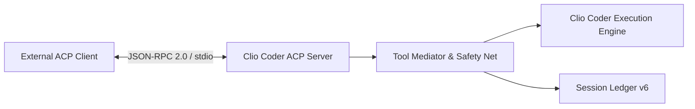

# Agent Client Protocol (ACP) Server

Clio Coder serves the Agent Client Protocol over stdio with `clio-coder acp` and acts as an ACP client when delegating to an external peer. This page defines the transport, capability negotiation, session and prompt lifecycle, extension methods, permission mediation, bounds, and error taxonomy of both directions. The [coding agent interoperability guide](../guide/interop.md) covers the operator workflow for external agents. The desktop GUI is an ACP client of this server, described in the [GUI guide](../guide/gui.md).

Source: `src/engine/acp/`, `src/cli/acp.ts`, `assets/acp-registry/`.

## Overview

The server speaks ACP v1 (schema v1.23.0) as newline-delimited JSON-RPC 2.0 over stdin and stdout (`src/engine/acp/transport.ts`). `initialize` always answers `protocolVersion: 1`; it does not reject a client that asks for another version. External IDEs, editors such as Zed, and orchestration engines drive Clio Coder sessions through it.


```mermaid
graph LR
    client[External ACP Client] <-->|JSON-RPC 2.0 / stdio| server[Clio Coder ACP Server]
    server --> mediator[Tool Mediator & Safety Net]
    mediator --> engine[Clio Coder Execution Engine]
    mediator --> session[Session Ledger v6]
```

## Server command and transport

```bash
clio-coder acp [--cwd PATH] [--permission-timeout MS]
clio-coder acp auth login
```

`clio-coder --acp [options]` is an exact alias: the global parser rewrites `--acp` into the `acp` command and passes every later argument to the same option parser, stdout guard, and boot path. Global boot flags go before it. `acp` honors `--api-key KEY`, `--no-context-files` (`-nc`), `--no-skills`, and `--skill PATH`. `--with-panes` and `--no-panes` are refused. An unknown option or an invalid value prints the usage text and exits 2. `--help` prints it and exits 0.

- `--cwd PATH`: pins the workspace. The path is resolved and canonicalized with `fs.realpath`, so a symlinked root, a trailing slash, and a `/.` suffix all name the same workspace. Clio Coder enters it before reading settings, building project context, or opening a session ledger. A path that does not exist or cannot be entered exits 2 without starting the server. Every session request must then name that root.
- `--permission-timeout MS`: the server-side ceiling for one mediated permission request, a whole number from 1 through `2147483647` milliseconds. Other values are refused before the protocol server starts. It overrides `integrations.externalAgents.defaults.permissionTimeoutMs` for this server only, which defaults to `DEFAULT_DELEGATION_PERMISSION_TIMEOUT_MS = 120000` (`src/core/defaults.ts`). The same ceiling bounds one interview round and one forwarded worker ask. If the timer wins on a main-agent request, the approval expires, the active turn is aborted, every parked call for that turn is settled only so execution can unwind, and `session/prompt` fails with `permission_expired`. Expiry is audited as `expired`, never as a human denial, and no denial result reaches a continuing model loop. A client may enforce a shorter policy by sending `session/cancel`.
- `acp auth login`: opens Clio Coder's interactive Quick Connect flow (`configure --quick`). It is the process a terminal authentication method launches; it does not serve the protocol.

With or without `--cwd`, the server opens the stdio transport and answers `initialize`, `authenticate`, and `logout` before it loads a workspace. The answer to `initialize` is what an [attended client](#attended-clients) advertises, so the boot that follows builds its tool surface from it. Without `--cwd`, the first `session/new`, `session/load`, or `session/resume` selects its absolute existing `cwd`. A first `session/list` with a `cwd` filter selects that directory, and one without a filter selects the launch directory. Any other workspace-dependent session or `_clio-coder/*` method called first also selects the launch directory. The selected root is canonicalized, entered, and held for the process lifetime. Requests that arrive during boot wait for project trust, settings, context, hooks, and tools to load. A later request naming another canonical root fails with `-32602` `session_cwd_mismatch`, and the message names the bound root.

Framing rules:

- One JSON object per line. A line over 1 MiB is discarded and answered with `-32600` `input_line_too_large` (`id: null`); the transport stays open.
- Stdout carries only JSON-RPC. The CLI redirects every other `process.stdout.write` to stderr for the life of the server. Diagnostics go to stderr prefixed `[clio-coder:acp]`.
- If a peer stops reading and the queued output exceeds 1 MiB, the transport closes.

## Initialize, capabilities, and authentication

`initialize` must be the first request and runs once. `agentInfo` is `{name: "clio-coder", title: "Clio Coder", version}`. The standard capability fields are:

| Field | Value |
| --- | --- |
| `loadSession` | `true` |
| `promptCapabilities` | `{audio: false, embeddedContext: true, image: true}` |
| `mcpCapabilities` | `{http: false, sse: false}` |
| `sessionCapabilities` | `{close: {}, list: {}, delete: {}, resume: {}}` |
| `auth` | `{logout: {}}` |

Every Clio Coder extension is namespaced under `agentCapabilities._meta`, so a strict generic ACP v1 client can use session discovery, modes, and configuration options without reading Clio Coder metadata. The shipped composition (`src/cli/acp.ts`) wires every dependency, so it advertises all of the keys below. A narrower embedded or test composition omits the key whose dependency is absent, and a flag never claims a method the composition cannot serve.

| Key | Payload | Present when |
| --- | --- | --- |
| `clio-coder/session` | `{close: true, label}` | always; `label` reflects the session store |
| `clio-coder/settings` | `{get_safe, patch_safe}` | always |
| `clio-coder/targets` | `{list, probe}` | always |
| `clio-coder/trust` | `{version: 1, meta, surfaces: ["settings", "hooks", "safety", "extensions", "plugins"], results: ["session/new", "session/load", "session/resume"]}` | always |
| `clio-coder/commands` | `{version: 1, list, invoke, promptTurns}` | a command host is wired |
| `clio-coder/steering` | `{version: 1, main, dispatch, modes: ["next-slot", "end-of-turn"], interrupt: true, methods: {steer, queue, clear, interrupt, dispatch}}` | always; `main` and `dispatch` report which queues are wired |
| `clio-coder/agent` | `{version: 1, meta: "clio-coder/agent"}` | always |
| `clio-coder/toolProgress` | `{version: 1, minIntervalMs: 250, maxFramesPerCall: 64, maxContentBytes: 16384}` | always |
| `clio-coder/decision` | `{version: 1, meta, options: ["allow-once", "reject-once", "reject-and-stop"]}` | a tool registry is wired |
| `clio-coder/tools` | `"mediated"` | a tool registry is wired |
| `clio-coder/events` | `{version: 1, notification: "_clio-coder/event", kinds, workspaceInstanceId}` | an event bus is wired |
| `clio-coder/board` | `{version: 1, method, supersede?, proposeMemory?}` | the task board is wired; the two action methods need board actions |
| `clio-coder/branches` | `{version: 1, tree, switchTurn, fork}` | session branching is wired |
| `clio-coder/handoff` | `{version: 1, prepare, commit, cancel}` | the handoff service is wired |
| `clio-coder/context` | `{version: 1, ledger}` | the context ledger is wired |
| `clio-coder/accounting` | `{version: 1, read}` | usage accounting is wired |
| `clio-coder/workspace` | `{version: 1, update: "session_info_update"}` | workspace facts are wired |
| `clio-coder/artifacts` | `{version: 1, list, read, categories, perCategory: 200}` | `/view` artifacts are wired |
| `clio-coder/fleet` | `{version: 1, preview, run, receiptFacts: true}` | fleet control is wired |
| `clio-coder/extensions` | `{version: 1, list, reload}` | extension control is wired |
| `clio-coder/library` | `{version: 1, reload}` | library reload is wired |
| `clio-coder/aside` | `{version: 1, ask, draft, cancel, draftCounts: {min: 1, max: 4, default: 3}}` | side rounds are wired |
| `clio-coder/interviews` | `{version: 1, request, cancel}` | echoed only when the client opted in |

The `kinds` list under `clio-coder/events` is the 12-kind allowlist in [Opt-in extension events](#opt-in-extension-events). Each `method`, `list`, `read`, and similar field holds the literal method name from the table in [Method surface](#method-surface). The exceptions are booleans: every field under `clio-coder/session`, `clio-coder/settings`, and `clio-coder/targets`, and `main` and `dispatch` under `clio-coder/steering`.

### Client opt-ins

A client opts into optional behavior under `initialize.params.clientCapabilities._meta`. A missing key, another `version`, or a malformed payload leaves the feature off. Nothing here changes what a strict client receives.

| Key | Payload | Effect |
| --- | --- | --- |
| `clio-coder/events` | `{version: 1, kinds: [...]}` | Enables `_clio-coder/event` notifications for the recognized kinds. At most 16 kinds, each at most 64 UTF-8 bytes and free of C0 and DEL control characters. A malformed request refuses the whole opt-in; unknown kinds are ignored. |
| `clio-coder/toolProgress` | `{version: 1}` | Enables non-terminal `tool_call_update` frames carrying a running tool's cumulative output. |
| `clio-coder/interviews` | `{version: 1, request: "_clio-coder/interview/request", cancel?: "_clio-coder/interview/cancel"}` | Attended client: enables `ask_user` and harness cards. See [Attended clients](#attended-clients). |
| `clio-coder/workerPermissions` | `{version: 1, withdraw: "_clio-coder/permission/withdraw"}` | Attended client: forwards dispatched workers' permission asks. |

### Authentication

`authMethods` is empty unless the client advertises `clientCapabilities.auth.terminal: true`. Then it holds one method, `{id: "clio-login", name: "Clio Coder Target Auth & Setup", type: "terminal", args: ["auth", "login"]}`. A client appends those args to the ACP launch command it already uses, including any `--cwd`, which opens `clio-coder acp auth login` in a terminal. Authentication happens in that separate process, so `authenticate` rejects every method id with `-32602`.

`logout` ends the connection's authenticated state and returns `{}`. Afterwards `session/new`, `session/load`, `session/resume`, `session/prompt`, and the other mutating methods fail with `-32000` `authentication_required` until the client reconnects.

Before it admits a prompt, the server checks that the selected target has usable credentials through the provider auth contract, without resolving or echoing a secret. A desktop service does not inherit a terminal's API keys: save one with `clio-coder auth login <target>`, then reopen the session on a fresh server process, because a running server does not reread the credential store. A missing credential fails the prompt with `-32000` `prompt_not_admitted` and reason `authentication-required`.

Clio does not call `fs/*` or `terminal/*` on a client. Tools run inside the Clio Coder process, so `clientCapabilities.fs` and `clientCapabilities.terminal` are ignored.

## Method surface

Anything not listed returns `-32601` `method_not_found`. Methods answer after `initialize`; before it they fail `not_initialized`.

| Method | Direction | Description |
| :--- | :--- | :--- |
| `initialize` | client to server | Capability exchange. Once per connection. |
| `authenticate` | client to server | Always `-32602`; terminal authentication runs in another process. |
| `logout` | client to server | Ends the authenticated state, returns `{}`. |
| `session/new` | client to server | Opens the one session this process hosts. Returns `sessionId`, `modes`, `configOptions`, `_meta`. |
| `session/load` | client to server | Restores a closed session and streams its active-branch history before returning. `mcpServers` is required (may be empty). |
| `session/resume` | client to server | Restores a closed session and provider context without sending history. |
| `session/list` | client to server | Lists workspace sessions newest first with cursor paging. |
| `session/delete` | client to server | Permanently deletes a closed workspace session. |
| `session/set_mode` | client to server | Sets autonomy to `default` or `yolo` while idle. |
| `session/set_config_option` | client to server | Sets autonomy, model, or thinking level while idle; returns the full option list. |
| `session/prompt` | client to server | Submits a user prompt. |
| `session/cancel` | client to server | Cancels the in-flight prompt, running tools, and any outstanding permission request. Accepted as a request (returns `{}`) and as a notification. |
| `session/close` | client to server | Cancels an active prompt, waits for its writer to settle, and closes the durable session. Idempotent. |
| `session/request_permission` | server to client | Asks the client to approve a gated tool call. |
| `session/update` | server to client | Notification stream. See [Streaming updates](#streaming-updates-and-stop-reasons). |
| `_clio-coder/session/label` | client to server | Sets or clears a durable session name. Legal before an opener and during a prompt. |
| `_clio-coder/settings/get_safe` | client to server | Reads the closed credential-free settings projection. |
| `_clio-coder/settings/patch_safe` | client to server | Atomically validates, persists, and applies a flat patch over four settings. Refused during a prompt. |
| `_clio-coder/targets/list` | client to server | Lists bounded, credential-free target and model summaries without network traffic. |
| `_clio-coder/targets/probe` | client to server | Probes one configured target and returns a closed health result. |
| `_clio-coder/session/steer` | client to server | Queues guidance on the running turn. |
| `_clio-coder/session/queue` | client to server | Reads both steering queues. |
| `_clio-coder/session/queue_clear` | client to server | Drains both queues and returns the texts. |
| `_clio-coder/session/interrupt` | client to server | Cancels the running turn, or reports why it cannot. |
| `_clio-coder/dispatch/steer` | client to server | Guides or aborts one running worker by `runId`. |
| `_clio-coder/commands/list` | client to server | Returns the operator command catalog with the grammar a palette builds from. |
| `_clio-coder/commands/invoke` | client to server | Runs one exposed command headlessly. |
| `_clio-coder/session/board` | client to server | Reads tasks, plan, decisions, and task-memory status. |
| `_clio-coder/decisions/supersede` | client to server | Marks a recorded decision superseded while idle. |
| `_clio-coder/memory/propose` | client to server | Proposes a memory candidate for review. |
| `_clio-coder/session/tree` | client to server | Reads the session tree as the `/tree` navigator shows it. |
| `_clio-coder/session/switch_turn` | client to server | Moves the append point to a turn and replays the branch. |
| `_clio-coder/session/fork` | client to server | Starts a new session from a turn and replays it. |
| `_clio-coder/session/handoff/prepare`, `commit`, `cancel` | client to server | The `/handoff` flow: render for review, seed a successor, or discard. |
| `_clio-coder/context/ledger` | client to server | Reads the `/context` window ledger. |
| `_clio-coder/usage/read` | client to server | Reads the `/usage` numbers: session cost and tokens plus cached quota reports. |
| `_clio-coder/aside/ask`, `draft`, `cancel` | client to server | The `/btw` and `/draft` rounds beside the session. |
| `_clio-coder/extensions/list`, `reload` | client to server | Lists the running session's extensions and reloads them. |
| `_clio-coder/library/reload` | client to server | Runs `/library reload`. |
| `_clio-coder/artifacts/list`, `read` | client to server | Lists and pages the `/view` artifacts. See [Artifacts](#artifacts). |
| `_clio-coder/fleet/preview`, `run` | client to server | Compiles a playbook; starts it only when the fresh plan hash equals the approved hash. |
| `_clio-coder/event` | server to client | Versioned extension events, only for kinds the client opted into. |
| `_clio-coder/interview/request` | server to client | An `ask_user` round for an attended client. |
| `_clio-coder/interview/cancel` | server to client | Notification retiring a round still waiting. |
| `_clio-coder/permission/withdraw` | server to client | Notification retiring a forwarded worker ask. |

Methods that take a session carry `sessionId`. Unknown keys, and values outside the documented shape, fail `-32602` `invalid_params`.

## Safe wire profile

This section states what the server guarantees on the wire. It is the contract any strict client can hold Clio Coder to.

### Error envelope

JSON-RPC layer codes follow the pinned ACP v1 schema: `-32700` parse, `-32600` invalid request, `-32601` method not found, `-32602` invalid params, `-32603` internal error, `-32002` missing resource, `-32000` authentication required, and `-32800` for an expired permission. Every error frame carries its machine-readable detail in one place:

```json
{"code":-32603,"message":"<one line, 256 characters at most, no paths, no stack>",
 "data":{"_meta":{"clio-coder/error":{"version":1,"code":"<closed-set string>","reason":"<optional>"}}}}
```

`data` never carries a stack, an echoed frame, a filesystem path, provider text, or a secret. Every message is authored by this process. `turn_failed`, `internal_error`, and `method_not_found` use the fixed strings `the prompt turn failed`, `internal error`, and `method not found`, whatever failed and whatever the peer called, because a provider or engine failure body can quote a request URL, a settings path, or the credential itself, and a bounded copy of a secret is still the secret. The one exception is `session_cwd_mismatch`, whose message names the bound root so a client can correct its request. A client branches on `code`; the original message, flattened to one line, goes to stderr. The `reason` field refines a code, and an optional `supported` list is reserved for version negotiation but no current error sets it.

| `data.code` | Code | When |
| :--- | :--- | :--- |
| `not_initialized` | -32600 | Any method before a successful `initialize`. |
| `already_initialized` | -32600 | A second `initialize` on the connection. |
| `authentication_required` | -32000 | `logout` ended the authenticated state. |
| `invalid_params` | -32602 | A missing required value, an unknown key, an out-of-set enum value, an exceeded bound, a C0 or DEL character in peer text, or any other shape violation. `reason` refines: `target-unknown` for an unconfigured target, and for `commands/invoke` one of `argv_too_long`, `argv_invalid`, `command_not_exposed`, `command_unavailable`, `subcommand_not_exposed`, `not_wired`, or `invalid_params` for a non-string `command`. |
| `session_cwd_mismatch` | -32602 | A session request names a canonical directory other than the bound root. |
| `session_limit` | -32602 | A second opener while a session is hosted. |
| `session_unknown` | -32002 | A session id is not hosted, or is not in this workspace's history. The server does not disclose whether it exists under another workspace. |
| `session_open` | -32602 | Load or delete targets the hosted session or a record whose `endedAt` is null. There is no cross-process lease, so an unclean crash is indistinguishable from another live process. |
| `session_not_bound` | -32002 | An artifact method names a session other than the bound one. |
| `prompt_active` | -32602 | A second `session/prompt`, or a settings, mode, configuration, or other state-changing request, during a prompt. `reason: "steer-instead"` marks a `commands/invoke` of a command that injects a user turn. |
| `prompt_not_admitted` | -32603, or -32000 for `authentication-required` | Clio refused to start the turn. `reason` is from [Admission failure](#admission-failure). |
| `permission_expired` | -32800 | The permission ceiling won. The message is the fixed string `permission approval expired`. |
| `turn_failed` | -32603 | The provider or engine failed after admission. |
| `turn_unknown` | -32602 | `switch_turn` or `fork` names a turn that is absent or not selectable. |
| `aside_active` | -32602 | A side question or draft is already running. |
| `artifact_unknown` | -32602 | An artifact id names no category, provider, or row. |
| `unknown_command`, `command_unavailable` | -32602 | A prompt line that looks like a command is neither an admitted command nor a loaded template. |
| `prompt_turn_required` | -32602 | `commands/invoke` named a command that must run as a conversation turn. |
| `parse_error` | -32700 | A stdin line was not valid JSON (`id: null`). |
| `invalid_request` | -32600 | A frame was not JSON-RPC `2.0`, or carried an `id` and no `method`. |
| `invalid_request_id` | -32600 | A request arrived with `id: null`. |
| `input_line_too_large` | -32600 | One stdin line exceeded 1 MiB (`id: null`). |
| `method_not_found` | -32601 | An unregistered or unavailable method. |
| `internal_error` | -32603 | A handler failed in a way it did not classify. |

### One session per process

At most one `session/new`, `session/load`, or `session/resume` is hosted at a time. Another opener fails `session_limit` until `session/close` releases the slot. Closing releases the slot, and the next `session/new` starts with a reset conversation, session history, turn ancestry, and task-board state, so a direct stdio client can open another session in the same process. Explicit resume restores the selected session's own history and task state. The first bound workspace stays fixed for the process.

### Workspace pinning

The three openers require a non-blank absolute `cwd` naming an existing directory. A relative path or an unusable directory fails `-32602`. The first valid request binds the process before any workspace graph loads unless `--cwd` already bound it. Clio Coder never changes directories after the graph loads.

Workspace authority is the exact canonical bound directory, never the enclosing Git root. Git probes treat an ignored nested scratch directory as non-Git. An unignored monorepo subdirectory may inherit repository-level branch, upstream, and remote facts, but dirty status and recent commits are scoped to the workspace path and no parent path is returned.

### Session attribution and load replay

`session/new` captures the effective orchestrator `target` and `model` in durable session metadata. They are the initial selections at bind time, not a health or admission promise. `session/new` returns `{sessionId, modes, configOptions, _meta}` and the other openers return the same without `sessionId`. `_meta["clio-coder/session"]` holds `{sessionId, target, model, autonomy, createdAt, resumed, replayed?}`. `target` or `model` is null when that half was unselected at bind. Session ids and target ids are 1 to 128 UTF-8 bytes, and model ids are at most 256 bytes. A configured route outside those bounds makes the opener fail `internal_error`; Clio never converts an over-bound selection to null and runs it anyway.

The openers also return `_meta["clio-coder/workspace"]` and `_meta["clio-coder/trust"]`, described in [Live telemetry](#live-telemetry-usage-plan-and-workspace) and [Trust notice](#trust-notice).

`mcpServers` accepts at most 32 stdio declarations: `name` up to 128 bytes, an absolute `command` up to 512 bytes, at most 64 `args` of 4096 bytes each, and at most 64 `env` entries `{name, value}` with values up to 4096 bytes. Clio starts each through the gateway's safe stdio MCP client and registers its tools as session-scoped capabilities named `mcp_acp_<slug>__<tool>`, where the slug is the declaration name lowercased, reduced to `a-z`, `0-9`, `_` and `-`, and cut to 24 characters. Calls route through the normal tool registry and autonomy policy as the `unknown` action class, which asks at `default` and runs at `yolo`. Declarations are never written to settings or the MCP catalog cache, and closing the session closes the clients. HTTP and SSE are unsupported, and a malformed or non-stdio declaration fails `invalid_params`. `additionalDirectories` may be empty; nonempty values are unsupported.

A loaded id must occur in the bound workspace's history and be durably closed. A record with `endedAt: null` fails `session_open`. Load resolves the pinned leaf, validates the entry stream, builds the provider replay for the active path, resumes the writer, and resets the chat loop before it emits any history. Client replay uses the original user, assistant, thought, tool-call, and tool-result entries of the selected branch. Compaction summaries replay as `agent_message_chunk` frames marked `_meta["clio-coder/notice"]` and never as operator prose. A stored tool call with no outcome receives one terminal `failed` update with content `unrecorded`. Replay never requests permission.

Every replay notification precedes the load response and carries `_meta["clio-coder/replay"] = {turn: n}`, 1-based over the replay; live updates omit the marker. Every active-branch turn streams with no turn-count or byte cut, and the response reports `_meta["clio-coder/session"].replayed = {turns, truncated: false}`. Dispatch runs recorded on the branch replay as terminal `_clio-coder/event` frames for clients that opted into those kinds, with the receipt facts described in [Receipt facts](#receipt-facts-on-terminal-dispatch-frames). `session/resume` performs the same provider restoration and sends no history.

### Session list, label, delete, modes, and configuration options

`session/list` accepts `{cwd?, cursor?}` and returns `{sessions, nextCursor?}` newest first. Each `SessionInfo` holds `sessionId`, the absolute `cwd`, an optional `title`, and `updatedAt`. A cwd that is not this workspace yields an empty list. Pages hold at most 50 rows and stay under a 240 KiB response budget; the cursor is opaque and bound to the process. Sessions with no model turn are omitted. A first list without a filter binds the launch directory. The method is legal before an opener and during a prompt.

`_clio-coder/session/label` accepts `{sessionId, label}` with a label of 0 to 256 UTF-8 bytes free of C0 and DEL characters; empty clears it. It writes the session-wide name that `session/list` reads back as `title`, and a hosted session also emits a `session_info_update` with the new `title`. `session/delete` accepts `{sessionId}` and removes only a record whose `endedAt` is set; hosted or unended records fail `session_open`, and unknown or cross-workspace ids fail `session_unknown`. Both are legal during an unrelated prompt.

`modes` offers `default` and `yolo`. `session/set_mode` takes `{sessionId, modeId}`, changes the hosted session's autonomy, emits `current_mode_update` and `config_option_update`, and returns `{}`. The same control is the `autonomy` config option (category `mode`). A `model` option (category `model`) appears when a model is selected, listing the target's configured and discovered models, and a `thinkingLevel` option (category `thought_level`) offers `off`, `minimal`, `low`, `medium`, `high`, `xhigh`, and `max`. `session/set_config_option` takes `{sessionId, configId, value, type?}` where `type`, if present, must be `select`, and returns the full list. Model and thinking changes apply to the session route without saving a default. All three controls fail `prompt_active` during a prompt. A global autonomy patch changes the default for future sessions and never mutates a bound session.

### Slash commands

The server sends `available_commands_update` when a session binds. The entries are the allowlisted operator commands (`src/engine/acp/commands.ts`): `mcp`, `doctor`, `share`, `archive`, `oracle`, `council`, `skill`, `context`, `tasks`, `memory`, and `export`, each only when its host dependency is wired. `context` admits the verbs `compact`, `recall`, `init`, `refresh`, `reset`, and `recover`; `tasks` admits `add`, `hand`, `done`, and `drop`; `memory` admits `seed`. `run` and `delegate` stream worker output through dispatch events and are reachable through `_clio-coder/commands/invoke` but are not advertised in this update. Every other slash command is refused by name, because an allowlist is the whole security posture for peer-chosen text.

A prompt that starts with `/name` for an advertised command, with no attached resources, runs that command instead of a model turn, and the result returns as an `agent_message_chunk`. Commands that inject a user turn (`share`, `oracle`, `skill`, `tasks`) are refused through `commands/invoke` while a prompt is active with `prompt_active` and reason `steer-instead`. `council` and `context recover` run as conversation turns and are refused through `commands/invoke` with `prompt_turn_required`. A command-shaped line that is neither an admitted command nor a loaded prompt template fails `unknown_command` or `command_unavailable` before it reaches the model, and `\/` sends the line as text. A loaded prompt template expands as in the terminal, and a display-only template answers without a turn.

`_clio-coder/commands/list` accepts `{}` and returns the catalog `{version: 1, commands: [...]}` plus the loaded template names under `prompts` (at most 256). Each descriptor carries `name`, `summary`, `usage`, `group`, a grammar `args` of flags, positionals, and subcommands, and the flags `requiresSubcommand`, `streams`, `injectsUserTurn`, and `promptTurn` where they apply. `commands/invoke` accepts `{sessionId, command, argv}` and returns `{level, lines}`. A result holds at most 200 lines of at most 1 KiB each, with a trailing `…output truncated at 200 lines`. `argv` holds at most 32 elements of at most 4 KiB. Elements are joined with single spaces and never quoted, so a quote character, a control character, or whitespace in any element except the last is refused. The last element is taken verbatim as the rest positional.

### Prompt input

Prompt content is read only from `params.prompt`, the ACP v1 array of content blocks.

- `text` blocks contribute their text. `resource_link` blocks contribute `Resource: <name> (<uri>)`. Parts are joined with a newline and trimmed.
- `resource` blocks (`embeddedContext`) must carry a `uri` and a `text` body. At most 8 per prompt, each at most 256 KiB. They are appended after host expansion as `<file name="...">` blocks and are never scanned for `@path` or `/name` syntax. A `blob` resource is refused with `invalid_params`, so a client never believes the model saw a file it did not.
- `image` blocks need `mimeType` and base64 `data`, at most 4 per prompt. The host decides from the bytes whether it accepts an image, and the client's `mimeType` is carried but not trusted.
- Audio and unknown block types contribute nothing.

A prompt with no text and no embedded resource fails `invalid_params`, so an image needs accompanying text. `params.content`, `params.message`, and a bare string `params.prompt` fail the same way, so a client's framing bug fails here as it would against any other ACP agent.

### Streaming updates and stop reasons

A live prompt streams `session/update` notifications of these kinds:

| `sessionUpdate` | Content |
| --- | --- |
| `agent_message_chunk`, `agent_thought_chunk` | Text, at most 16 KiB per chunk. A longer delta splits across consecutive chunks and nothing is dropped. No split falls inside a code point. |
| `tool_call`, `tool_call_update` | Tool lifecycle with `name`, `title`, `kind`, `status`, `rawInput`, `rawOutput`, `locations`, `content`. See [Bounds](#bounds). |
| `usage_update`, `plan` | Pushed telemetry. See [Live telemetry](#live-telemetry-usage-plan-and-workspace). |
| `session_info_update` | A new `title`, or the workspace snapshot. |
| `available_commands_update`, `current_mode_update`, `config_option_update` | Session controls. |

Transcript notices from the engine arrive as `agent_message_chunk` frames marked `_meta["clio-coder/notice"] = {level}`. Message, thought, notice, and tool-call updates carry `params._meta["clio-coder/agent"]`, an array that starts with orchestrator attribution and, on a tool-call frame, appends bounded attribution for each delegated agent that call started (at most 16). `user_message_chunk` appears only in branch replay (`session/load`, `switch_turn`, `fork`, and `handoff/commit`).

`session/prompt` settles with the standard ACP stop reasons:

| Outcome | Result |
| --- | --- |
| Normal end, or any provider reason without an ACP equivalent | `end_turn` |
| Client cancel, or abort | `cancelled` |
| Refusal | `refusal` |
| Output length | `max_tokens` |
| More than 128 tool starts in one prompt | `max_turn_requests` |
| Provider or engine failure | no stop reason; the request fails `turn_failed` |
| Permission ceiling won | no stop reason; the request fails `permission_expired` |

ACP has no error stop reason, so a failed turn fails the request instead. The response is `{stopReason, _meta: {"clio-coder/usage": {input, output, cacheRead, cacheWrite, reasoning, totalTokens, costUsd, costProvenance}}}`. `costProvenance` is `known`, `known_free`, `estimated`, or `unknown`, and an unknown price is never reported as zero cost.

A prompt Clio cannot start fails `prompt_not_admitted` with no preceding update. A cancelled or failed turn first synthesizes a `failed` `tool_call_update` for every call that received a `tool_call` and no terminal update, so a client that draws a spinner per call never keeps one running.

### Live telemetry: usage, plan, and workspace

Three frames are pushed on change and never on a timer (`src/engine/acp/live-telemetry.ts`). None counts toward whether a turn produced output, so a prompt Clio refused is still distinguishable from a model that said nothing.

**`usage_update`**: sent at most once per model response; responses that land in the same tick coalesce into one frame, and an identical frame is never resent. It holds `used` and `size` (context tokens used and the window, 0 when unknown), `cost: {amount, currency: "USD"}` when the session cost is known and its provenance is not `unknown`, and `_meta` with two keys. `clio-coder/context` is the projected context ledger. `clio-coder/usage` holds the running turn fields of the prompt response plus `session`, the same fields as session totals (the `/usage` ledger plus the running turn). The last in-turn frame equals the prompt response's usage, and a final frame precedes the response. A loaded session re-sends its current meter and plan.

**`plan`**: sent after a tool call settles or a turn settles, only when the task board differs from the last plan sent. ACP plan status has no blocked or dropped state, so a `blocked` task goes out as `pending`, a `cancelled` task is omitted, and every entry has `medium` priority because the board has none. Each entry's `_meta["clio-coder/plan"]` holds `{id, status, origin, reason}` with the real status. The plan's own `_meta["clio-coder/plan"]` holds `{version: 1, boardId, title, cancelled, truncated}`. At most 100 entries are sent, and text is cut at 1 KiB.

**Workspace**: `_meta["clio-coder/workspace"] = {version: 1, cwd, isGit, branch, dirty, ahead, behind, remoteUrl, projectType, capturedAt}` rides the session opener responses. After any tool whose kind is not `read`, `search`, or `fetch` settles, Clio re-probes the Git facts off the loop with at most one probe in flight. A change in those facts (ignoring `capturedAt`) triggers a `session_info_update` carrying the same key. `remoteUrl` has any userinfo removed, fields are null when unknown, and the prompt response waits at most 2 seconds for a probe in flight.

### Trust notice

Clio withholds authority from project files the operator never approved. The settings, hooks, safety, extension and plugin loaders drop an untrusted or changed `.clio-coder/` file quietly, so a client whose project-level model "does not work" needs the reason at session start. Each opener response carries `_meta["clio-coder/trust"] = {ignored: [...]}`. An entry is `{surface, file, verdict, fix}`: `surface` is `settings`, `hooks`, `safety`, `extensions`, or `plugins`; `file` is the project file, which for `extensions` and `plugins` is the install state `.clio-coder/extensions/state.json` or `.clio-coder/plugins/state.json`; `verdict` is `untrusted` or `changed`; `fix` is `clio-coder config trust <surface>`. An entry exists only for a file that is present, so a workspace with no install state reports nothing for that surface, and a surface that is approved or inherited from a Clio Coder task worktree's origin reports nothing. The list is empty when nothing was ignored. The report is advisory, and a capture failure never fails the opener. The `clio-coder/trust` capability names the five surfaces and the three methods that report them (`src/engine/acp/trust-notice.ts`).

### Safe settings and targets

`_clio-coder/settings/get_safe` accepts `{}` and returns exactly:

```json
{"settings":{"chat":{"target":null,"model":null,"thinkingLevel":"off"},"safety":{"autonomy":"default"}},
 "editable":["chat.target","chat.model","chat.thinkingLevel","safety.autonomy"]}
```

The values are illustrative. No other settings leaf, URL, auth fact, credential reference, path, header, or provider text crosses the wire. `_clio-coder/settings/patch_safe` accepts `{patch}`, a flat object keyed only by the four `editable` strings, and returns the committed projection in the shape above. It validates the whole candidate, then performs one locked settings mutation that persists routing as the future default and updates the process's next-turn routing. A routing patch (`chat.target`, `chat.model`, `chat.thinkingLevel`) also moves the bound session's route and emits a `config_option_update`. An autonomy patch changes only the default for future sessions. The locked writer applies the effective-view delta to the user document and revalidates it with the workspace's project layers, so a project-only target can be selected without copying its URL or descriptor into user settings. A higher-precedence project leaf that would undo the patch fails the write with no partial document. Unknown keys or values are `invalid_params`, and an unknown non-null target adds reason `target-unknown`. A non-null model requires a non-null resulting target. A selected route outside the 128-byte target and 256-byte model bounds makes `get_safe` fail `internal_error`. Both are legal before an opener; the patch fails `prompt_active` during a turn.

`_clio-coder/targets/list` accepts `{}` and returns `{targets: [{id, runtime, models, isOrchestrator}]}` from configuration and cached state, never a probe. At most 64 targets and 64 models per target are returned, with ids at most 128 bytes, runtime ids 64, and model ids 256. The result is capped to a 240 KiB stable prefix of whole entries, and a cut sets `_meta["clio-coder/truncated"]: true`. Unsafe stored identifiers are omitted rather than truncated into collisions. `_clio-coder/targets/probe` accepts exactly `{targetId}` for a configured target and returns `{targetId, healthy, latencyMs, reason}` with `reason` one of `not-configured`, `unreachable`, `unsupported`, `probe-failed`, or null. Provider text is mapped, never copied, and the call spends no model tokens.

### Artifacts

`_clio-coder/artifacts/list` and `_clio-coder/artifacts/read` serve the terminal's `/view` artifacts to a client (`src/engine/acp/artifacts.ts`). Both read the providers the overlay reads (`src/domains/session/view-artifacts.ts`), so a client lists the same rows with the same titles and reads the same lines. Titles and subtitles pass through the overlay's sanitizer (control sequences stripped, secrets redacted). Bodies travel as loaded. A protected artifact's load renders its protection record and never the file. The provider module loads on first use.

The `clio-coder/artifacts` capability is `{version: 1, list, read, categories, perCategory: 200}`. `categories` names the 12 categories a client may request: `accountability`, `evidence`, `receipt`, `dispatch`, `task-ledger`, `workspace`, `tool-output`, `protected-artifact`, `compaction`, `prompt-manifest`, `audit`, and `system-prompt`. The terminal's `transcript` category is excluded because the client already holds the conversation.

`list` accepts `{sessionId, categories?}` and returns `{artifacts, truncated}`, newest first, at most 200 rows per category, with `truncated: true` when any category was cut. A provider that fails is omitted from the list. Each row:

| Field | Meaning |
| --- | --- |
| `id` | `<category>/<provider id>`; provider ids are unique only within a category. |
| `category`, `title` | Title at most 512 bytes. |
| `subtitle` | Optional, at most 1024 bytes. |
| `at` | ISO time the artifact was produced, when known. |
| `sizeBytes` | When known. |
| `format` | `markdown`, `text`, or `json`; the format a read is expected to return. The read's own `format` is authoritative. |
| `protected` | `true` when a read returns the protection record and a refusal. |

`read` accepts `{sessionId, id, offset?, limit?, details?}`. `offset` and `limit` are non-negative integers and `limit` must be positive. `limit` defaults to 2000 lines and is capped at 50000. `details: true` reads the overlay's `i` view, and a request for a view the artifact lacks fails `invalid_params`. The result is a page:

```json
{"id":"receipt/run-7hq2ab","category":"receipt","title":"...","format":"markdown",
 "lines":["..."],"offset":0,"totalLines":214,"nextOffset":null,
 "clippedLines":1,"details":{"format":"json","lineCount":96},"refused":{"reason":"..."}}
```

`nextOffset` is null on the last page. A page holds at most 512 KiB of JSON-encoded lines; a later page takes a line whole, and only a single line larger than a page is cut, to 64 KiB with a trailing `…`, which `clippedLines` counts. Reassembly is exact only when `clippedLines` is absent. `details` summarizes the details view when one exists and was not requested. `refused` is present on a protected artifact. An unknown category, provider, or row fails `artifact_unknown`, and a session other than the bound one fails `session_not_bound`.

### Extension method projections

The remaining `_clio-coder/*` methods project terminal views as bounded read models. Text fields are control-character-stripped and cut at the stated byte limits.

| Method | Request | Result |
| --- | --- | --- |
| `_clio-coder/session/board` | `{sessionId}` | `{version: 1, operatorTasks, plan, decisions, memory, truncated}`. Lists hold at most 100 items and text at most 1 KiB. It reads only; operator tasks change through the `tasks` command. |
| `_clio-coder/decisions/supersede` | `{sessionId, interviewId, key, correction?}` | `{status, correctionTurn?}` or `{status: "refused", reason}`. Idle only. `correction` is at most 2048 bytes and non-blank. The correction turn is returned for the client to send as a prompt. |
| `_clio-coder/memory/propose` | `{sessionId, entryId, scope: "repo" or "global", acknowledgeGlobal?}` | `{status: "proposed" or "existing", recordId}`. Global scope without `acknowledgeGlobal: true` returns `{status: "needs_acknowledgement"}`. A proposal the memory domain rejects returns `{status: "refused", reason}`. A proposal is a candidate for review, never an approval. |
| `_clio-coder/session/tree` | `{sessionId}` | `{version: 1, sessionId, leafId, parentSessionId, parentTurnId, nodes, truncated}`. At most 400 nodes, active path kept whole. A node is `{id, parentId, kind, at, label, preview, active, selectable}` with previews at most 240 bytes. |
| `_clio-coder/session/switch_turn` | `{sessionId, turnId}` | `{sessionId, leafId, _meta}` after replaying the branch. Idle only. `turnId` must be selectable (not a compaction or branch row). |
| `_clio-coder/session/fork` | `{sessionId, turnId}` | `{sessionId, parentSessionId, parentTurnId, modes, configOptions, _meta}` for the new session, which replaces the hosted one. Idle only. |
| `_clio-coder/session/handoff/prepare` | `{sessionId, goal}` | `{status: "ready", handoffId, goal, fromSessionId, document}` or `{status: "refused", level, code, reason}`. `goal` is at most 2048 bytes. The document is at most 128 KiB. Nothing is written. |
| `_clio-coder/session/handoff/commit` | `{sessionId, handoffId, document}` | `{status: "committed", sessionId, fromSessionId, warnings, modes, configOptions, _meta}`, or a refusal with the same shape as `prepare`. The reviewed document replaces the draft, and `code: "stale"` marks a conversation that moved since `prepare`. |
| `_clio-coder/session/handoff/cancel` | `{sessionId, handoffId}` | `{cancelled}` |
| `_clio-coder/context/ledger` | `{sessionId}` | The `/context` view: window, used, reserve, free, groups (at most 32), compaction state, and prompt-cache facts. Unknown stays unknown, so a window of 0 and a null percentage travel as they are. |
| `_clio-coder/usage/read` | `{sessionId}` | `{version: 1, session, quota}`. `session` holds cost and per-provider, per-model token rows (at most 32). `quota` is `{status: "read", providers}` (at most 16) or `{status: "failed", reason}`; a quota failure never fails the session numbers. |
| `_clio-coder/aside/ask` | `{sessionId, question}` | `{status: "answered" or "aborted" or "refused" or "failed", text or reason}`. Question at most 8000 characters. Answers at most 64 KiB. |
| `_clio-coder/aside/draft` | `{sessionId, request, count?}` | `{status: "drafted", candidates, judgment?}` or `{status: "refused"}`. `count` is 1 to 4, default 3. Candidates are labeled `A` to `D`. |
| `_clio-coder/aside/cancel` | `{sessionId}` | `{cancelled}` |
| `_clio-coder/extensions/list` | `{sessionId}` | `{version: 1, extensions, truncated}`, at most 64, each with a `state` of `eligible`, `shadowed`, `disabled`, `incompatible`, or `invalid`. |
| `_clio-coder/extensions/reload` | `{sessionId}` | `{status: "committed", generation, ...}` or `{status: "rejected", reason, generation}`. Idle only. |
| `_clio-coder/library/reload` | `{sessionId}` | `{status: "refreshed", generation, previousGeneration, changed}` or `{status: "failed", error}`. Idle only. |
| `_clio-coder/fleet/preview` | `{sessionId, name, vars?}` | `{status: "ready", name, planHash, stepCount, waves, budget, truncated}` or `{status: "refused", diagnostics}`. At most 64 steps. `vars` holds at most 32 strings. |
| `_clio-coder/fleet/run` | `{sessionId, name, vars?, planHash}` | `{status: "started", fleetRootId, stepCount}`, `{status: "changed", planHash, reason}` when the fresh plan hash differs from `planHash` (nothing dispatched), or `{status: "failed", reason}`. Idle only. |

Asides are refused while a turn runs and are never a turn, a session entry, or a `session/update`. One aside runs at a time.

### Steering

`_clio-coder/session/steer` accepts `{sessionId, text, mode?}` with `mode` `next-slot` (the steering queue, the default) or `end-of-turn` (the follow-up queue). It returns `{accepted, queue, refusal?}`. A steer is refused, not accepted silently, when no prompt is active, when the prompt is cancelled, or when the run is not streaming. `interrupt` mode is not admitted because the terminal resubmits a stranded steer as a new prompt, and ACP binds a turn to its request. Steer text is at most 16 KiB and non-blank. `\n`, `\r`, and `\t` are content and every other C0 control is refused rather than stripped, so the model never sees text different from the client's copy.

`_clio-coder/session/queue` returns `{steer, followUp}`, each at most 64 entries of at most 16 KiB. `queue_clear` drains both queues together, as Alt+Q does in the terminal, and returns `{restored}`; those texts become the client's to resend. `_clio-coder/session/interrupt` accepts `{sessionId, reason?}` (at most 256 bytes) and returns `{cancelled, refusal?}`. It cancels only: the outstanding `session/prompt` settles `cancelled` and the next prompt is the client's. It honors the refusal the terminal gives for an attached dispatch or a parked permission ask, and `session/cancel` remains the unconditional stop.

`_clio-coder/dispatch/steer` accepts `{sessionId, runId, action: "guide" or "cancel", message?}` and returns `{accepted: true}` or `{accepted: false, reason}`. `reason` is one of `dispatch-unavailable`, `fleet-unavailable`, `run-not-active`, `cancel-failed`, `empty-message`, `steering-unsupported`, `no-input-channel`, `input-closed`, `run-terminating`, or `steer-failed`. `cancel` carries no message. Acceptance means the guidance is queued on the worker's stdin, never that it was delivered.

### Opt-in extension events

An opted-in client (see [Client opt-ins](#client-opt-ins)) receives `_clio-coder/event` notifications `{version, workspaceInstanceId, sessionId, turnId, sequence, kind, terminal, payload, _meta?}`. `workspaceInstanceId` is one opaque process UUID advertised at initialize, and `sequence` increases monotonically within it. Without a recognized opt-in no event is sent. Every `kind` is the engine's own bus channel name, never a renamed alias, so a captured frame names its producer. An event whose identity or taxonomy cannot be represented safely is dropped rather than forwarded under a repaired one.

| Kind | Payload | `terminal` |
| --- | --- | --- |
| `safety.loopBlocked` | `{toolCallId: null, tool, repeatCount, blocksThisTurn, budget, disposition, interrupted, shape: null}`. `disposition` is `block`, `lockout`, or `stop`. | `false` |
| `dispatch.enqueued`, `dispatch.started` | `{runId, agentId, taskPreview, node, origin, attempt}`. `taskPreview` is a control-stripped prefix of at most 160 bytes. | `false` |
| `dispatch.progress` | `{runId, agentId, progressCount, truncated}`. The frame after the 256th for a run carries `truncated: true`, and later ones are dropped. | `false` |
| `dispatch.completed` | `{runId, agentId, outcome, outcomeCode, outcomeDetail, durationMs, tokenCount}` with `_meta["clio-coder/receipt"]`. | `true` |
| `dispatch.failed` | `{runId, agentId, outcome, reason, outcomeCode, outcomeDetail, durationMs}` with `_meta["clio-coder/receipt"]`. | `true` |
| `accountability.evidenceReady` | `{runId, evidenceId, firstPassSuccess, findingCount, tags}`. At most 32 tags of 64 bytes. | `true` |
| `compaction.end` | `{trigger}` | `false` |
| `context.warning` | `{warning}`, a control-stripped sentence of at most 256 bytes, or `null` for the clearing edge. | `false` |
| `safety.toolBudgetExceeded` | `{tool, callsThisTurn, softBudget, hardCeiling, interrupted}` | `true` exactly when `interrupted` |
| `provider.health` | `{targetId, status, available, latencyMs}`. `status` is `healthy`, `degraded`, `unknown`, or `down`. | `false` |
| `dispatch.scopeNotice` | `{code, level, message}`. `code` is one of `write_root_dot_unconfined`, `write_roots_checks_withheld`, `typed_scope_replaced_inferred_paths`, `legacy_scope_inferred`, `legacy_scope_empty`. `level` is `warning`. `message` is at most 1024 bytes. | `false` |

`dispatch.*` ids are at most 128 bytes. The event forwarder tracks at most 512 live runs and evicts the oldest. The exact task and raw progress or failure prose never cross; `outcomeDetail` is the only free text and is at most 2048 bytes. `safety.loopBlocked` and `safety.toolBudgetExceeded` fire only during the hosted active prompt, since both name per-turn budgets. The loop detector fires before the blocked call executes, so no executed tool-call id exists and `toolCallId` and `shape` stay null rather than fabricated. `accountability.evidenceReady` follows the terminal event of a run whose evidence bundle landed; the bundle's findings and overview prose never cross. `compaction.end` omits the producer timestamp because a client re-stamps on arrival. `context.warning` is a transition channel, so `{warning: null}` crosses as itself; dropping it would leave a client's banner up forever. `provider.health` leaves `lastError` behind because provider prose quotes URLs and response bodies.

#### Receipt facts on terminal dispatch frames

A `dispatch.completed` or `dispatch.failed` frame carries `_meta["clio-coder/receipt"]`, the facts of the sealed receipt at `<state>/receipts/<runId>.json`, projected by the same readers the TUI worker footer uses (`src/domains/dispatch/receipt-facts.ts`). The dispatch domain seals the receipt before it publishes the terminal event, so a live read finds it. The shape is:

| Field | Value |
| --- | --- |
| `receiptId` | The run id. |
| `outcome` | The receipt outcome, or null. |
| `contract` | Result-contract conformance: `pass`, `fail`, `not-reached`, `unmeasured` (the run had no typed contract), or null when the receipt is silent. |
| `contractKind` | `debugger-report`, `verifier-report`, `research-report`, `world-knowledge-report`, `scout-report`, or null. |
| `trust` | The artifact-integrity word the footer prints (`seal retired` for a retired seal version), or null when the receipt could not be authenticated against its ledger row. |
| `validation` | The footer's validation clause, or null. |
| `tokens`, `elapsedMs` | The receipt's `tokenCount` and elapsed time, or null when the receipt lacks the field. A peer that reported no usage seals `tokenCount: 0`. |
| `placement` | `{mode: "current" or "worktree", branch?, changedPaths?}` for an external peer run, otherwise null. |
| `unavailable` | `true` when no receipt exists. On a live frame every other field is then null. |

A missing or corrupt receipt yields `unavailable: true` and never fails the frame. Whenever a branch replays to the client (`session/load`, `switch_turn`, `fork`, `handoff/commit`), the same frames replay for every dispatch run on the branch, with `_meta["clio-coder/replay"] = {run: true}` beside the receipt key. Replay falls back to the run's ledger row when no receipt was sealed. The frame then keeps the row's `outcome` and reports `unavailable: true` when the row carries its own explanation. A run the ledger shows as still open in another process has no terminal frame yet and is skipped. A replayed run whose outcome is `succeeded` replays as `dispatch.completed`, any other outcome as `dispatch.failed`.

### Bounds

Every frame the server writes is bounded (`src/engine/acp/types.ts`, `src/engine/acp/server.ts`). Every cap counts UTF-8 bytes, which is what the peer's read buffer spends.

- Tool `content` text is truncated at 16 KiB with a trailing `…[truncated]`. Live tool titles are at most 512 bytes in `tool_call`, `tool_call_update`, and `session/request_permission`. Replay titles keep a stricter 64-byte stored bound.
- Tool progress is off unless the client opts in. When on it is bounded three ways: at most 64 non-terminal `tool_call_update` frames per `toolCallId` per turn, at least 250 ms between two frames for one id, and a snapshot identical to the previous one is never resent. Each frame's text is the tool's cumulative output, bounded to 16 KiB, so the client replaces the row's content rather than appending. A frame naming a `toolCallId` with no open call is dropped, and the terminal update still arrives exactly once, last.
- Every string inside `rawInput` and `rawOutput` is truncated at 4 KiB with the same marker, with one path-aware exception: `rawOutput.result.details.diff` is bounded at 28 KiB (`ACP_MAX_RAW_RECORD_BYTES` minus one generic string budget). A top-level `diff`, an array member, and every sibling string stay at 4 KiB. The walk stops at depth 8 and replaces anything deeper with `"[depth]"`. If the bounded record still serializes past 32 KiB it becomes `{"truncated": true, "bytes": <length of the record before bounding>}`.
- Every `toolCallId` is at most 128 bytes. An engine id that is longer, missing, or already claimed this turn travels under a per-turn `clio-coder-tool-<n>` alias, and the same alias serves the call's `tool_call`, `tool_call_update`, and permission request. Identity runs one way: an engine id that starts a second call mints a fresh alias, and an end names only its own engine id's calls. An end for an id the turn never started is dropped and reported on stderr instead of borrowing another call's id. An end with no engine id binds to the most recently opened call still running, then to the most recently emitted call of the turn. Every wire id receives exactly one terminal update, and a duplicate or late end is dropped. Nothing on the end path mints an id, so an update never announces a call the client never saw start.
- `locations` carries the resolved absolute path for the path-bearing tools (`read`, `write`, `edit`, `ls`, `grep`, `find`) when the arguments name one, at most 4 KiB and deliberately not realpath'ed, since an `edit` or `write` target may not exist yet. The field is omitted rather than sent as `null` or `[]`. The permission request reuses the exact bounded snapshot.
- A live prompt emits at most 128 `tool_call` starts. The 129th start emits no call, cancels the turn, suppresses later chat events, fails every open call, and resolves `session/prompt` with `max_turn_requests`. Clio Coder's configurable execution guard is a separate engine policy.

### Admission failure

A prompt Clio cannot start fails `prompt_not_admitted` with zero preceding `session/update` notifications. `reason` is one of `orchestrator-not-configured`, `target-unknown`, `target-not-configured`, `target-not-found`, `runtime-not-registered`, `model-not-configured`, `chat-unsupported`, `streaming-unsupported`, `context-window-exceeded`, `authentication-required`, or the catch-all `admission-failed`. The engine's runtime-resolution diagnostics are a larger vocabulary, and any reason outside this list is reported as `admission-failed`. No `chat.target` reports `orchestrator-not-configured`, and a target with no `chat.model` reports `model-not-configured`. The message is a sanitized one-line sentence with no settings path, and `authentication-required` carries no environment variable name, credential, or provider text. A failure after admission fails `turn_failed`.

Readiness checks before the first prompt live in the CLI: `paths --json` for home identity, `doctor --json` for installation sanity, and `targets --json [--probe]` for target, auth, and health. `--probe` sends a request to the configured endpoint, so the client decides when that is allowed.

### Attended clients

A person is at the other end of an ACP connection only when the client says so at `initialize`. Two opt-ins under `clientCapabilities._meta` say it, each on its own. A client that advertises neither gets the unattended surface: no `ask_user` tool, no merge card, and a worker permission ask that is not forwarded. The deferred front answers `initialize` before the orchestrator boots, so the tool surface, the session prompt, and the dispatch domain are built from that answer.

| Opt-in | What it turns on |
| --- | --- |
| `clio-coder/interviews` | The `ask_user` tool, the interview guidance in the session prompt, and harness cards such as the task-worktree merge card. After accepting the opt-in, Clio echoes `{version: 1, request, cancel}` under `agentCapabilities._meta` only when the payload's `request` is exactly `_clio-coder/interview/request`. |
| `clio-coder/workerPermissions` | A dispatched worker's permission ask is sent as `session/request_permission`. Accepted only when `withdraw` is exactly `_clio-coder/permission/withdraw`. |

**Interviews.** A round is the server-to-client request `_clio-coder/interview/request` with `{sessionId, interviewId, questions}`. It carries one to four questions, each `{question, header?, options?, multi_select?}` with at most 16 options. Question text is cut to 8192 characters, a header to 128, an option label to 512, and a description to 2048, after control characters are stripped. The reply is `{answers: [{question, answer, options?, value?}], cancelled?}`. The server checks it against the questions offered: one answer per question in order, each `question` equal to the offered text, a non-empty `answer` of at most 16384 characters, no `cancelled` other than `false`, and any `options` limited to offered labels, one unless the question is `multi_select`, with an `answer` that joins the chosen labels and any typed `value` with `; `. A cancelled reply, a request the client refuses, a reply that fails these checks, a wait that outlives `--permission-timeout`, and a turn abort all read as the operator's cancel. A turn abort and a session close cancel a round still waiting, and each sends `_clio-coder/interview/cancel` with `{sessionId, interviewId}`.

**Worker permission asks.** A worker ask that needs a person (`escalation: true` on the bus: an ask under `fleet.permissions.mode: escalate`, an operator-authority rail, or an ask the main agent forwarded below `yolo`) goes out as `session/request_permission`. It is bound to the session that owns the active turn, and an ask from any other session is ignored. It binds to the open tool call that spawned the run, else the newest open tool call, and retries the binding every 200 ms until the ask's own window closes, because the model is often between calls when a worker asks. The window is the ask's `timeoutMs` capped by `--permission-timeout`, and it covers the wait for the client's answer. If no tool call opens in that window the ask stays with the worker's timeout fallback and nothing is denied in the operator's name. An answer that is not one of the three offered options, or that arrives after the window closed, is withdrawn rather than read as a denial. The ask shares the one outstanding-request queue with main-agent asks. `allow-once` approves the worker, the other two offered options deny it, and `reject-and-stop` also cancels the active turn.

The request's `_meta` carries `clio-coder/decision` with `origin: {kind: "worker", agentId, runId}` and `clio-coder/workerAsk` holding `{version: 1, requestId, requestedBy, agentId, approvalAuthority?, forwardedByMain, fallback, timeoutMs?}`. `approvalAuthority` is `operator` for a rail only a person clears and `main` for an ordinary ask. Only identifiers and enums appear, so no worker prose reaches it. When the worker settles the ask first (it timed out, its run ended, or its owner revoked it), or the server stops waiting, Clio sends the notification `_clio-coder/permission/withdraw` with `{sessionId, requestId}`, because the wire cannot cancel one request and a card left on screen would make the client refuse the next approval as a second pending one.

### Permission requests

The outbound `session/request_permission` carries `{sessionId, toolCall: {toolCallId, title, kind, status, rawInput, locations?}, options}`. `toolCallId` is always the id of a `tool_call` the client already rendered and has not seen finish. The tool name is in `title`, never folded into `rawInput`. `status` is `pending` for a main-agent ask and `in_progress` for a forwarded worker ask.

Options are `allow-once` (kind `allow_once`), `reject-once` (kind `reject_once`), and `reject-and-stop` (kind `reject_once`), in that order. Only the exact `optionId: "allow-once"` under `outcome: "selected"` grants. `reject-once` denies the presented request and the model sees the denial as the tool result. `reject-and-stop` denies every other parked request from the turn and aborts the prompt, which settles `cancelled`. `outcome: "cancelled"` from the client aborts the prompt the same way. Any other `optionId` is a denial, so a client cannot mint `allow-always`. At most one request is outstanding and the queue is serial. Transport loss denies every queued request and cancels the parked calls. `session/cancel` while a request is outstanding stops the server waiting on it, cancels the parked tool, and settles the prompt `cancelled`; a late answer is ignored.

`params._meta["clio-coder/decision"]` carries the classification the server already computed to pick option labels: `{version: 1, tier, tierLabel, title, semanticToken, authorizationCopy, consequenceCopy, reversibilityCopy, requestedByCopy, actionClass, axis, origin, exposure, affectedScope, reversibility, target?, consequenceLines?}`. Without it a client would re-derive a tier and a consequence from a tool name, which is a second and worse classifier. `tier` is `conversation`, `workspace`, `outward`, `safety-net`, `system`, or `worker`. `semanticToken` is `accent`, `action`, or `warning`. `target` is a one-line allowlisted render of the arguments. `consequenceLines` appears for a bash ask: at most nine host-written sentences, one per step of the command, the text the terminal card shows as its Effect row. Every string is control-stripped and at most 512 bytes, and no model-authored prose reaches this record.

A permission request for a plan-scale dispatch also carries `_meta["clio-coder/dispatchPlan"] = {version: 1, topology, taskCount, planScale, hash, costCeilingUsd?, deadlineMs?, tasks, truncated}`. The `hash` is the plan hash a plan-scale run seals. `tasks` holds at most 32 entries of `{agent, task, role?, position?, target?, model?, node?, nodeKind?, worktree?, apply?, stepId?, dependencies, wave?}`, with tasks cut at 1024 bytes, fields at 256, and at most 8 dependencies.

<details>
<summary>How a request binds to a tool call, and what failing closed does</summary>

Binding is lookup-only. No id is minted here, because asking about an id the client never received put an approval on a call nobody could identify.

| Engine supplies | Binds to |
| --- | --- |
| An id matching one still-open call this turn emitted | That call. |
| An id matching several still-open calls, because the engine reused it | The most recently opened of them. |
| No id, with exactly one open call this turn | That call. |
| Anything else: an id nothing was emitted for, an id whose calls all completed, zero open calls, or several open calls with no id to choose between them | Nothing. It fails closed. |

Failing closed means the client is never asked, no `session/request_permission` frame is written, the parked call is cancelled, and the resolution is recorded as denied with `decidedBy: "error"` and the reason `permission request has no bindable tool call`.

`rawInput` and `locations` are the stored snapshot of the bound call's `tool_call` update, replayed byte for byte and never recomputed, so a client can diff the call it shows against the call it is asked to approve and find nothing. The snapshot is taken when the `tool_call` is emitted and keyed by wire id, because a tool's `prepareAdmissionArguments` may rewrite a relative path or attach a prepared artifact before the safety net sees the call.

</details>

A server timeout differs from a client answer. When `--permission-timeout` wins, every permission still parked for the turn is internally resolved as `expired`, the registry calls are cancelled only to unwind execution, the chat loop is aborted, later tool and message events from that unwind are suppressed, and `session/prompt` fails `permission_expired`. The client never sees a fabricated human denial or model prose reacting to one. A literal `reject-once` stays an ordinary denial the model may observe.

### Cancel, close, and shutdown

`session/cancel` is idempotent while a prompt is active and answers `{}` in its request form. As a notification it is dropped silently when the connection is uninitialized or the session is unknown, because it has no reply channel. `session/close` cancels an active prompt and waits for its writer to settle before it closes the durable session; closing an already-closed id returns `{}`. On stdin EOF or a transport error the pending outbound requests fail, the active prompt is cancelled, the permission bridge is unregistered, and the server waits for the in-flight prompt handler to settle (at most 5 seconds) before it exits 0, so no session write lands after the session domain stops.

## Result and update metadata keys

Per-message `_meta` keys, beyond the capability keys above. The pushed telemetry frames (`usage_update`, `plan`, `session_info_update`) carry their `_meta` on the update object itself. Attribution, notice, and replay keys ride `session/update` `params._meta`.

| Key | Where | Payload |
| --- | --- | --- |
| `clio-coder/session` | opener, `switch_turn`, `fork`, and `handoff/commit` results | `{sessionId, target, model, autonomy, createdAt, resumed, replayed?}`; `replayFailed: true` on a fork whose replay failed. A `config_option_update` carries `{target}` only. |
| `clio-coder/workspace` | opener results, `session_info_update` update | Workspace facts. |
| `clio-coder/trust` | opener results | `{ignored}`. |
| `clio-coder/usage` | prompt result, `usage_update` update | Token and cost fields; the update adds `session` totals. |
| `clio-coder/context` | `usage_update` update | The projected context ledger. |
| `clio-coder/plan` | `plan` update and each entry | Real task status, board identity, and omitted counts. |
| `clio-coder/agent` | message, thought, notice, and tool-call `session/update` frames | Orchestrator attribution plus delegated agents. |
| `clio-coder/notice` | `agent_message_chunk` | `{level}` for a transcript notice or replayed compaction summary. |
| `clio-coder/replay` | replayed updates and events | `{turn}` on history, `{run: true}` on a replayed dispatch frame; absent on live frames. |
| `clio-coder/receipt` | `dispatch.completed` and `dispatch.failed` events | Receipt facts. |
| `clio-coder/decision`, `clio-coder/workerAsk`, `clio-coder/dispatchPlan` | `session/request_permission` | Classification, worker provenance, and plan view. |
| `clio-coder/truncated` | `targets/list` result | `true` only when the byte budget omitted an entry. |
| `clio-coder/error` | `error.data._meta` | `{version, code, reason?}`. |

## Tool presentation and outbound delegation governance

The hosted server presents ordinary Clio Coder tool-registry activity to its client. Separately, when Clio delegates to an external ACP peer, it mediates that peer's permission requests before they can affect the workspace.

### Canonical tool mapping

The hosted server maps Clio Coder tool names onto the closed ACP `ToolKind` enum (`src/engine/acp/server.ts`). The kind follows the capability a gateway call reaches.

| Clio Coder tool | ACP `ToolKind` |
| :--- | :--- |
| `read`, `ls`, `context`, `monitor` | `read` |
| `write`, `edit`, `artifact` | `edit` |
| `grep`, `find`, `code_nav` | `search` |
| `bash`, `verify` | `execute` |
| `web_fetch` | `fetch` |
| `git`, `dispatch`, `steer`, and every other tool (`web_read`, `tasks`, `ledger`, `panes`, `ask_user`, `run_script`, and `mcp_acp_*` tools) | `other` |

### Outbound non-stall permission mediation

`src/engine/acp/adapter.ts` constructs `AcpToolMediator` when Clio acts as an ACP client for an outbound delegation. Under `clio-coder-policy` governance:

1. Tool calls evaluate through the [safety policy engine](safety-model.md), using the shared admission evaluator that native and SDK workers use. Raw inputs are mapped to canonical tools by tool name, ACP `kind`, or the shape of `rawInput` (a command, a pattern, a path, a URL), so a peer that omits `kind` is still classified instead of blanket-denied.
2. The mediator uses default autonomy for every delegated peer. If the safety net or default autonomy yields an `ask` verdict, it resolves the ask as a non-stall denial, because a delegation has no operator to answer. A read-only delegation also denies every non-read request and every read outside the workspace.
3. The mediator denies any canonical tool outside an admitted tool scope when one is supplied. Dispatch supplies none for an ACP delegation, which has no recipe, so the safety net and the read-only rule are the live gates. A tool the mediator cannot classify is denied, and so is a call with malformed mutation targets, with the reason recorded in the receipt's tool log.

An approved call is answered with the peer's `allow_once` option only. Clio never selects `allow_always`, because it would turn one approval into a standing grant inside the peer. If the peer offers no `allow_once`, the approved call is answered with a reject option and the receipt records it as denied with that reason. A denied call is answered with `reject_once`, or another reject option when that is all the peer offers. With no usable option the answer is `cancelled`.

`toolGovernance` has three values: `clio-coder-policy` (the default), `deny-all`, and `agent-managed`. `agent-managed` hands the decision to the peer. It is an explicit operator opt-in, requires `trustedUnmediated: true` on the entry (honored only in user settings, never project settings), and cannot enforce `--read-only`, so admission refuses that combination before it starts the peer.

As a client, Clio advertises no client capability in `initialize` (`clientCapabilities: {}`) because it serves no `fs/*` or `terminal/*` method. The only request handler is `session/request_permission`, and the only notification handler is `session/update`. Clio sends a single text block per `session/prompt` and `mcpServers: []` on `session/new`. When a delegation names a model, Clio picks it from the peer's first `select` config option in category `model` and sets it with `session/set_config_option`. A thinking level uses the first option in category `thought_level`, or is folded into the model id as `model[level]` when the peer has no such option. A peer without the option cannot take a named model, and the delegation fails before the prompt. If the peer's response reports another current model, the delegation fails. The receipt's `delegation.selectedModelId` records the value Clio selected, or the option's current value when no model was named.

Limits and timing for an outbound run:

- `connectTimeoutMs` bounds `initialize`, `session/new`, and each config request, default 30000. `turnTimeoutMs` bounds the whole turn, default 0 (none). `stallTimeoutMs` hard-terminates a peer that emits no `session/update` for that long, default 300000, 0 or less disabled. All three are per-entry settings under `integrations.externalAgents`.
- An abort sends `session/cancel` and waits 1 second for the peer, then terminates the peer's process group: SIGTERM, then SIGKILL after 500 ms, then up to 2 seconds to observe exit. A peer that advertises `sessionCapabilities.close` gets `session/close` with a 1 second request timeout on a clean finish.
- The peer runs with a safe child environment. An `env` value of the form `{env:NAME}` resolves at launch from the named variable, and the secret never enters settings or the receipt.
- Run exit code is 0 only for stop reason `end_turn`. A `cancelled` stop reason, a missing stop reason, a failure the peer streamed as an error line, and any other stop reason end the run with exit 1.

This outbound path is distinct from the hosted server's permission bridge. The hosted server sends `session/request_permission` to its connected client and resumes a parked registry call when the client selects `allow-once`, subject to the timeout and binding rules above.

## Security and boundary guarantees

1. **Autonomy snapshotting.** Autonomy is snapshotted at `session/new`, `session/load`, or `session/resume`. A later global configuration change does not alter the bound remote session's security policy. Only an explicit idle `session/set_mode` or `session/set_config_option` changes its next prompt.
2. **Metadata namespacing.** Clio Coder extensions travel only in namespaced `_meta` fields (`clio-coder/...`), so strict clients such as Zed's serde deserializers never meet an unmapped top-level key.
3. **No external outcome overrides.** An external ACP process cannot self-assert a terminal outcome code. `worker_final_output_missing`, for one, is enforced at Clio Coder's trusted finalization seam.
4. **Closed projections.** Settings, targets, board, tree, ledger, usage, extensions, artifacts, and fleet views are projections with fixed shapes and byte limits. Paths, provider text, credentials, and prompts stay host-side.

## Delegation peers in the transcript

In the other direction Clio Coder is an ACP client. `/delegate <agent-id> <task>` and any dispatch to an agent id configured under `integrations.externalAgents.entries` run the task on an external peer such as `claude-code`, `codex`, or `opencode`. Clio Coder provides pinned outbound ACP bridge recipes for Claude Code (`@zed-industries/claude-code-acp`) and Codex (`@agentclientprotocol/codex-acp`) and uses OpenCode's native `opencode acp`. The Antigravity CLI and Pi integrations have no built-in ACP recipe. Their managed headless runtimes and Herdr pane handoffs are described in the [interoperability guide](../guide/interop.md#delegate-work-to-an-installed-coding-agent).

A delegated peer is a worker like any other on screen. The adapter maps the peer's `agent_message_chunk` and thought chunks onto the same dispatch event stream a local Clio Coder worker publishes, so the peer's answer renders as the same attributed block with the same fold behavior, the same `--share` and `/share` path into the main agent's context, and the same replay from a sealed receipt. A peer's `plan` update surfaces as a plan event. There is no ACP-specific UI path.

The header is where the difference shows. A local Clio Coder worker names the target and model it ran on. A peer runs behind someone else's process and identifies the protocol used to reach it, so its header carries `(acp)` in place of a route, for example `◇ codex (acp) · run 7hq2ab` for an operator-started run. Its header ends with the outcome and the elapsed time, and its metrics row lists `tokens processed` and `tool calls` from the receipt the same way a local worker's does.

ACP delegation receipts preserve peer-reported token totals, including explicit zero usage, and supported cost provenance without double-counting. A peer total is used when supplied; otherwise the four billed components (input, output, cache read, cache write) determine the total, and reasoning tokens are not added because a peer counts them inside output. Cost arrives as `costUsd` in Clio Coder metadata or `cost.total` on legacy usage, never both. Unknown cost is not evidence of free execution.

### Typed intent on a delegated dispatch

A dispatch to a delegation agent accepts typed intent and renders the declared scope into the plan approval artifact, so an operator sees what the peer was told to work on before it starts. The declaration grants nothing on this transport. The peer runs its own tool surface and Clio mediates no per-tool call, so a resolved write boundary would be a claim nothing enforces and is refused outright. Declare `read_roots` and `relevant_paths` to bound what the peer is asked to look at. For an ACP edit, use a Clio Coder task worktree when Git isolation helps, then inspect the recorded branch and diff. The worktree does not confine the peer's other filesystem tools, and Clio Coder's ACP permission policy covers only requests the peer reports. The compatibility rules and reason codes are the same as for any other producer; see [dispatch-typed-intent.md](dispatch-typed-intent.md).

## Client-side error taxonomy

The outbound ACP client raises three typed errors (`src/engine/acp/errors.ts`), all subclasses of `AcpError` with a `code` and optional `data`:

| Class | `code` | Raised when |
| --- | --- | --- |
| `AcpProtocolError` | `acp_protocol_error` | The peer answered a request with a JSON-RPC error. |
| `AcpTimeoutError` | `acp_timeout` | A request outlived its timeout, or a timeout was outside 1 to `2147483647` ms. |
| `AcpProcessError` | `acp_process_error` | The peer process exited, errored, or closed its pipes before replying. |

The server side uses `AcpRequestError`, which owns the JSON-RPC code, the host-authored message, and the `clio-coder/error` detail. Any other throw becomes `internal_error`.

## Registry submission

To list Clio Coder in the upstream Agent Client Protocol registry (the registry the Zed editor consumes), repository assets live under `assets/acp-registry/`:

- `assets/acp-registry/agent.json`: the registry manifest. It holds the agent id `clio-coder`, the display name, the release version, a description, the repository, website, license (`Apache-2.0`) with its `license_url`, and author. The `distribution.npx` entry runs the `@iowarp/clio-coder` package with `args: ["acp"]`, so a client without a global install can fetch and start it.
- `assets/acp-registry/icon.svg`: a 16x16 monochrome icon whose strokes use `currentColor`.

The submission procedure:

1. Fork `https://github.com/agentclientprotocol/registry`.
2. Create an entry directory named for the agent id: `mkdir clio-coder`.
3. Copy `assets/acp-registry/agent.json` and `assets/acp-registry/icon.svg` into it.
4. Check that `agent.json` matches the registry schema and that `icon.svg` stays monochrome with viewBox `0 0 16 16`.
5. Open a pull request. Once merged, clients that consume the registry can discover and install Clio Coder.
