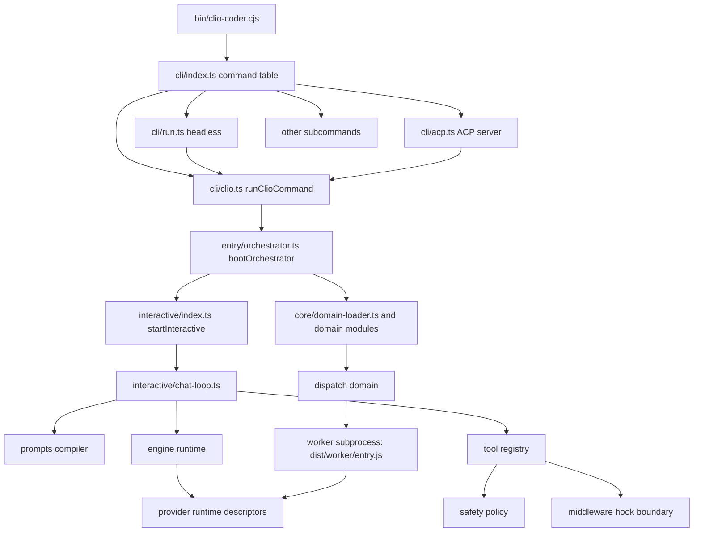

# Clio Coder Architecture and Boundaries

Clio Coder is a coding harness for terminal and browser sessions, with provider runtimes, mediated tools, and dispatched workers. CLI entry points, the interactive TUI, runtime adapters, worker subprocesses, and feature domains have separate ownership. These boundaries support local models and scientific-software workflows while keeping admission, safety, and persistence contracts explicit.

---

## Source layout

```text
src/
├── cli/             # clio-coder subcommands, argument parsing, headless run modes
├── core/            # config/state paths, event bus, defaults, domain loader, shared primitives
├── domains/         # 28 feature-domain directories, loaded through manifests or imported as libraries
├── engine/          # Pi (pi-ai, pi-agent-core, pi-tui) boundary, runtime adapters, ACP, worker runtime
├── entry/           # orchestrator bootstrap wiring (bootOrchestrator)
├── interactive/     # TUI panels, overlays, key routing, dashboard, slash commands
├── tools/           # built-in tool specs and registry admission boundary
├── utils/           # image and git support utilities
└── worker/          # worker subprocess entry and runtime rehydration
apps/
└── clio-coder-gui/  # separate workspace package: the graphical application
tests/
└── boundaries/      # check-boundaries.ts, the compile-time import rules
```

`pnpm-workspace.yaml` lists the root package and `apps/*`. The root build (`tsup.config.ts`) bundles the application's server and its two worker entries into `dist/gui/` and builds the browser client into `dist/gui/client`. `clio-coder gui` starts `dist/gui/server.js` ([gui.ts](../../src/cli/gui.ts)). [The graphical application boundary](#the-graphical-application-boundary) below describes how it reaches the root sources.

## Domains

`src/domains/` holds 28 directories. Not every one is a loaded `DomainModule`. The orchestrator loads config, extensions, plugins, interop, resources, share, context, providers, safety, prompts, agents, middleware, session, observability, scheduling, and dispatch, plus mux when the pane tier is active. Each of those has a `manifest.ts` naming its `dependsOn` list. The plugins domain publishes no contract; it stays loaded so teardown drops cached plugin snapshots. The `evolution` directory also has a `manifest.ts`, but it is the change-manifest schema for `clio-coder evolve`, not a domain manifest.

System One is not a loaded domain. The orchestrator builds it with `createSystemOne` and hands it to the interactive host ([system-one-host.ts](../../src/entry/system-one-host.ts)). The remaining directories, which are components, evidence, evolution, gateway, lifecycle, memory, quota, system-one, toolchain, turn-control, and user-tasks, are libraries or CLI-owned feature areas whose module functions callers import directly. Of those, gateway (`src/domains/gateway/mcp/`), quota, and user-tasks have no domain-level `index.ts`, so callers import their files.

| Domain | Primary source | Public surface |
| --- | --- | --- |
| agents | `src/domains/agents/**` | Built-in, plugin, user, and project agent recipes, fleet contracts, and result contracts. |
| components | `src/domains/components/**` | Component snapshots, diffs, and classification. |
| config | `src/domains/config/**`, [config.ts](../../src/core/config.ts) | `settings.yaml`, keybindings, effect-timing classification, hot reload. |
| context | `src/domains/context/**` | Layered `CLIO-CODER.md` and subtree `CLIO-CODER.override.md` guidance, codemap indexer, working set, bootstrap, repository context. |
| dispatch | `src/domains/dispatch/**` | Fleet-agent jobs, run ledger, receipts, route policy and history, worker spawning, admission. |
| evidence | `src/domains/evidence/**` | Forensic evidence bundles, failure attribution, trust projection. |
| evolution | `src/domains/evolution/**` | Authority-tiered self-edit change manifests and their validation. |
| extensions | `src/domains/extensions/**` | Extension discovery, packaging, and lifecycle. |
| gateway | `src/domains/gateway/mcp/**` | The local stdio MCP client, strict configuration loading, and explicit trust. |
| interop | `src/domains/interop/**` | The agent-kind registry, bounded detection of other coding agents, and consent to wire one as a delegation peer. |
| lifecycle | `src/domains/lifecycle/**` | Doctor diagnostics, upgrade mechanics, migrations, Claude Agent SDK install, uninstallation. |
| memory | `src/domains/memory/**` | Approved long-term memory, task bank, proactive task intervention. |
| middleware | `src/domains/middleware/**` | Declarative and programmatic lifecycle hooks and budgets. |
| mux | `src/domains/mux/**` | Optional interactive pane-host integration: Herdr guest mode, the Yazi file pane, and the cliamp music dock. |
| observability | `src/domains/observability/**` | Cost tracker, projection snapshot, SQLite trace mirror, evidence index, out-of-turn usage store. See [Observability](observability.md) and [Trace Store](trace-store.md). |
| plugins | `src/domains/plugins/**` | Plugin discovery, catalog, and lifecycle. |
| prompts | `src/domains/prompts/**` | Prompt fragments, system prompt compiler, template hashing. |
| providers | `src/domains/providers/**` | Target-first runtime registry, model probing, credentials, pricing resolution. |
| quota | `src/domains/quota/**` | Read-only subscription and credit readings from connected provider accounts, cached and normalized for the usage surfaces. |
| resources | `src/domains/resources/**` | Package library, skills loader, prompts loader. |
| safety | `src/domains/safety/**` | Ordered policy engine, path policy, zero-access rails, audit. |
| scheduling | `src/domains/scheduling/**` | Budget ceilings, node cluster states, local capacity, batch capacity checks. |
| session | `src/domains/session/**` | Append-only JSONL transcripts, tree navigation, compaction, handoff, `/view` artifact providers. |
| share | `src/domains/share/**` | Portable workspace and resource archive export/import. |
| system-one | `src/domains/system-one/**` | The decision layer: typed questions about one object, pluggable engines, fitted cuts, and the decision ledger. See [System One](system-one.md). |
| toolchain | `src/domains/toolchain/**` | Pinned external-tool discovery, installation, and resolution (`herdr`, `yazi`, `croc`, `cliamp`). |
| turn-control | `src/domains/turn-control/**` | Pure turn facts, workflow decisions, turn outcome reduction, and the orientation and direction blocks. |
| user-tasks | `src/domains/user-tasks/**` | Library and CLI-owned durable user task list plus board handoff state. |

The `interop` domain owns one question: which other coding agents are on this
machine and in this project. [registry.ts](../../src/domains/interop/registry.ts) is pure data, one
entry per known agent carrying its binaries, the directories it owns, its skill
and prompt roots, its instruction filenames, and the ACP launch recipe when it
has one. Consumers derive their agent-specific behavior from this table: the skills loader and the prompts loader take their compatibility
roots from the table, the adoption scanner takes its candidate files from it,
and the safety path policy takes the foreign directories it refuses to write
into from it.

The domain owns detection and consent, and nothing else. It never executes a
foreign agent's work command, never loads a skill, prompt, or rule itself, and
never reads under a foreign agent's `sessions`, `history`, `cache`, `projects`,
or `state` directory. Detection resolves binaries with `access(X_OK)` and no
shell, checks install directories, and runs a bounded `--version` only when the
caller asks and only for a binary that already resolved; a probe that cannot
answer reports `unknown` and never `absent`. The one durable configuration write
is an append to `integrations.externalAgents.entries`, and it happens only after an operator
decision.

---

## Domain loading order and bootOrchestrator

`bootOrchestrator` in [orchestrator.ts](../../src/entry/orchestrator.ts) is the one composition root for the interactive, headless, and ACP surfaces. It calls `loadDomains` from [domain-loader.ts](../../src/core/domain-loader.ts) with the module list below. The loader:

1. Sorts the modules topologically by `manifest.dependsOn`. A duplicate name, an unresolved dependency, or a cycle throws `DomainLoadError` before anything starts. Modules that do not depend on each other keep their list order.
2. For each module in order, awaits an optional `beforeEach` hook, calls `createExtension(context)`, runs `extension.start()`, and stores the returned contract under the domain name. Interactive boot uses `beforeEach` to yield to the event loop so the Stage 0 shell answers input between domains.
3. Hands each module a `DomainContext` whose `getContract(name)` returns only the query-only contract, never the extension. Extensions are process-local. Contracts are the cross-domain surface.
4. On a failed start, stops every domain already started and throws. It emits `domain.loaded` and `domain.failed` bus events as it goes.

| Order | Domain | `dependsOn` |
| ---: | --- | --- |
| 1 | config | none |
| 2 | extensions | config |
| 3 | plugins | config |
| 4 | interop | config |
| 5 | resources | config |
| 6 | share | config, extensions, resources |
| 7 | context | resources |
| 8 | providers | config |
| 9 | safety | config |
| 10 | agents | config |
| 11 | prompts | config, context, resources, agents |
| 12 | middleware | none |
| 13 | session | config |
| 14 | observability | providers, session |
| 15 | scheduling | config, observability |
| 16 | mux, only when the pane tier is active | none |
| 17 | dispatch | config, safety, agents, providers, middleware, prompts, scheduling |

Observability deliberately omits dispatch from its `dependsOn`, even though it listens to the dispatch bus channels, so that scheduling can sit between observability and dispatch without a cycle. The mux module is imported dynamically through [with-panes.ts](../../src/entry/with-panes.ts), and only when `resolvePanesEnablement` ([panes-activation.ts](../../src/entry/panes-activation.ts)) says the extension is active, so a plain boot loads no mux code.

Shutdown stops domains in reverse load order. Each `stop()` runs under a per-hook time budget, and a failure or timeout is logged with a `[clio-coder:domain-loader]` prefix and does not block the remaining domains.

Around the loader, `bootOrchestrator` does the work that must precede or follow the domains:

- Ensures the state directories and reports untrusted project settings and safety surfaces.
- Recovers state a hard-killed coordinator left behind, namely compete-group and task worktrees.
- Emits the `session.start` bus event, then composes the tool registry, System One host, safety wiring, and chat.
- Hands off to one surface. Interactive boot imports `startInteractive` from `src/interactive/index.ts`. A headless run calls `runHeadlessMainAgent` in [print.ts](../../src/cli/modes/print.ts). An ACP boot serves the protocol through `src/engine/acp/server.ts`.

---

## Cold-start work

Two pieces of start-up work are bounded. Receipt recovery reads only the receipts that can matter, so boot cost is independent of receipt history. The workspace probe is shared between the callers of a first prompt, so the tree is not probed again for each.

### Orphan receipt recovery

The dispatch domain's start opens the run ledger and calls `recoverOrphanReceipts` ([orphan-recovery.ts](../../src/domains/dispatch/orphan-recovery.ts)). It first closes non-terminal ledger rows whose worker process no longer exists on this host, sealing a row from its own verified receipt when one exists. It then scans `<stateDir>/receipts/` for sealed receipts whose ledger row a crash lost, rebuilds the row each one was sealed against, checks the integrity digest, and adopts the valid ones.

Receipts are never pruned, so parsing all of them on every boot would grow with history. The scan therefore skips two kinds of file before reading them. A receipt is written as `<runId>.json`, so a file named for a run the ledger already holds is skipped by name. A file whose modification time is more than one hour before the `startedAt` of the oldest retained ledger row is skipped as evicted by the ledger's retention cap, because a receipt is written after its run started. The hour is slack for a shared filesystem whose server stamps modification times with its own clock. An empty ledger has no horizon, so every unheld receipt is read and a wiped `runs.json` can be rebuilt from receipts. A file that cannot be stat'ed is read anyway.

Files that are read are judged one by one. Unparseable or digest-failing receipts are renamed `<name>.json.corrupt` and never deleted. A receipt that lacks the data to rebuild its row is left in place and counted as skipped. A non-interactive boot that recovered, sealed, quarantined or closed anything prints `[dispatch] ledger recovery: ...` to stderr. A file passed over by the name or age check is never read, so a corrupt receipt for a run the ledger holds, or one older than the horizon, is not quarantined and stays where it is.

### Workspace probe reuse

A workspace probe ([snapshot.ts](../../src/domains/session/workspace/snapshot.ts)) is seven `git` subprocesses and a project-type file walk. A first prompt asks for one from three places: the interactive host's boot probe that fills the welcome dashboard, the session prompt's source capture, and session bind, whose synchronous probe would block the event loop right before the first request. `probeWorkspace` and `probeWorkspaceAsync` take an optional `reuseWithinMs`, and `WORKSPACE_PROBE_REUSE_MS` is 5,000.

- A probe that landed for the same `cwd` within the window answers a caller that passes `reuseWithinMs`. The caller gets that snapshot with its original `capturedAt`.
- The async variant also joins a probe already in flight for the same `cwd`. The synchronous variant can reuse only a landed one.
- Session bind (`create` in [extension.ts](../../src/domains/session/extension.ts)) and the session prompt's source capture ([extension.ts](../../src/domains/prompts/extension.ts)) pass the 5,000 ms window.
- A caller that passes no `reuseWithinMs` always probes, as the `context` tool's `scope="workspace"` fallback does. Every probe that runs, including one for a caller that passes no `reuseWithinMs`, refreshes what later callers may reuse. A reused answer does not.

---

## The decision layer is System One

System One at `src/domains/system-one/` is the only decision layer. The providers domain owns no per-turn decisions. A site names one object, an engine answers a typed question set about it, and the site's policy reads the answers under cuts fitted for the build that answered. Every entry point returns `null` instead of throwing, and `null` means the caller behaves as if System One did not exist. The contract, sites, engines, calibration, and ledger are in [System One](system-one.md).

---

## Session Routing vs. Persisted Settings

Clio maintains an explicit distinction between persisted user settings (`settings.yaml`) and session-local routing state ([session-routing.ts](../../src/core/session-routing.ts)).

1. **Decoupled Overlays**: Turn-level selections (such as active target, model override, thinking level, and scoped models cycled via explicit model-cycle keys) apply dynamically through `applySessionRouting` without mutating `settings.yaml`.
2. **Lifecycle Flow**:
   - `seedSessionRouting`: Seeds runtime fields from configuration at startup.
   - `applyRoutingPatch`: Applies surgical routing mutations (such as changing active model or target in the TUI).
   - `diffRouting`: Computes the field-level routing diff between two settings blobs, so routing edits made through a whole-settings writer such as the `/settings` overlay are absorbed into session state without persisting unrelated edits as new defaults.
   - `routingChangeNotices`: Generates the advisory notices a running session emits when an external writer changes `settings.yaml` underneath it. The session keeps its routing and new sessions use the saved defaults.
   - `restoreRoutingFields`: Copies the session's routing fields onto a whole-settings blob before it is persisted, so a `/settings` edit to an unrelated key does not rewrite the saved routing defaults with the session's live routing.

---

## Workspace Enumeration and Language Classification

Source: [workspace-files.ts](../../src/core/workspace-files.ts), [c-header-language.ts](../../src/core/c-header-language.ts).

1. **Filesystem Walker Invariants**:
   Fallback workspace file enumeration enforces strict safety caps to prevent runaway memory usage or hangs on massive trees:
   - `maxVisitedEntries`: 100,000 entries
   - `maxDepth`: 64 directory levels
   - `maxPathBytes`: 64 MiB total path storage
   - `maxDurationMs`: 5,000 ms timeout
2. **C/C++ Header Classification**:
   Ambiguous `.h` headers are classified deterministically from content:
   - Only `.h` is ambiguous. `.hpp`, `.hh`, and `.hxx` are always C++. `classifyCHeaderLanguage` reads only the file content, so full builds and incremental updates agree.
   - Comments and string literals are blanked first.
   - C++ include forms win first: a C++-only standard header such as `<vector>`, or an include of a `.hpp`, `.hh`, `.hxx`, or `.cuh` file.
   - Then a class or struct body with a member function declaration.
   - Then C++-only syntax such as `namespace`, `template<`, `class`, `::`, access specifiers, C++ casts, `nullptr`, and `constexpr`.
   - A header matching none of them, including C inside an `extern "C"` wrapper, stays C.

## Codemap ownership and worker boundary

The codemap keeps its boot-time read surface separate from its build graph:

- [schema.ts](../../src/domains/context/codewiki/schema.ts), `artifact.ts`, and `paths.ts` own the
  stable data shapes, normalized artifact compatibility, synchronous and
  asynchronous reads, serialization, and cheap path classification. Reading a
  cached artifact does not load tree-sitter.
- `indexer.ts` owns full, synchronized, and incremental candidate construction.
  Its tree-sitter adapter is a real dynamic import; grammars load only for the
  source paths an actual build needs.
- `build-worker.ts` is the sole runtime execution boundary for codemap
  candidate walks, freshness fingerprinting, and parsing. Other context surfaces
  independently detect project metadata, but the interactive process does not
  run a codemap scan or an uninterruptible parser call on its render/input loop.
- `coordinator.ts` owns production commits. One FIFO per workspace establishes
  generation order inside a process, and `withStateFileLock` extends that order
  across Clio processes. Each transaction rereads the artifact after acquiring
  the lease, publishes atomically, and updates freshness state before releasing
  ownership.

Session-start refresh, parallel tool demand, incremental mutation notices,
explicit index/refresh, context bootstrap, wiki grounding, and context reset all
enter this transaction boundary. A never-indexed workspace remains untouched by
background session startup. `code_nav` still waits for a fresh demand result;
reset queues behind already-admitted work and therefore cannot be undone by an
older completion. Context-domain shutdown drains both mutation admission and the
coordinator lane before returning. The direct builder and artifact writer remain
available to build scripts and test fixtures, but production workspace writes
must go through the coordinator.

## Lazy built-in tool boundary

The registry always owns one complete, immutable `ToolSpec` surface before a
model turn starts. Fourteen tools register through `lazyTool` and keep their
name, description, TypeBox schema, action class, execution mode, synchronous
argument hooks, source provenance, and policy metadata in lightweight surface
modules. [core-bootstrap.ts](../../src/tools/core-bootstrap.ts) registers `context`, `code_nav`,
`verify`, `data`, `web_fetch`, `web_read`, `run_script`, `clio_docs`, and
`clio_library`. [bootstrap.ts](../../src/tools/bootstrap.ts) registers `ledger`, `monitor`,
`steer`, `panes`, and `music`. `registerAllTools` registers those surfaces in
the same order as every other built-in; capability discovery, worker
attestation, provider schema serialization, safety classification, autonomy and
permission admission, and `before_tool` middleware therefore run without
evaluating the implementation. The worker composition root imports
`core-bootstrap.ts` directly (through [worker-tools.ts](../../src/engine/worker-tools.ts)), so its real
built entry never evaluates the orchestrator-only dispatch, monitor, or steer
runners. The orchestrator-side registration adds `dispatch` after the core
tools, `ledger`, `monitor`, and `steer` when dispatch is composed, `panes` when
a pane host exists, and `music` when `integrations.music.agentControl` is on and
the music pane could play at startup (`integrations.music.enabled`, a live pane
host, and a resolved cliamp).

Dispatch is the one stateful lazy boundary. Its synchronous admission controller
owns the exact WeakMap/WeakSet identities for trusted plans, parsed requests,
capacity reservations, Scout plans, and prepared arguments. The dynamically
loaded runner receives that same controller state; it never reconstructs an
approved call. A deeply frozen, discriminated execution snapshot also pins the
normalized requests, mode, review/compete settings, detach flag, timeout, output
bound, and an `apply_winner` branch plus absolute repository destination before
middleware or an approval prompt can expose the prepared argument identity. The
winner destination is part of the rendered and hashed approval artifact.
Admission disposal is one registry-owned finally boundary, so a
middleware guard block, ordinary return, or thrown body releases a provisional
reservation exactly once.

For ordinary lazy tools, only the admitted `run` step crosses
[lazy-tool.ts](../../src/tools/lazy-tool.ts). One cached promise owns the implementation import,
including a deterministic failure, so concurrent first calls cannot initialize
competing implementations. The loaded spec must match the advertised surface
before its body can run. Ordinary body exceptions, result shaping, `after_tool`
middleware, abort signals, and telemetry continue through the registry's
existing path. This mechanism is built-in-only; it does not turn extension
manifests or provider plugins into an executable tool loader. Dispatch is
different: `registerAllTools` creates its lightweight admission surface eagerly,
and [dispatch.ts](../../src/tools/dispatch.ts) owns a separate cached dynamic import of
`dispatch-runner.ts` after admission succeeds. It does not pass through
`lazy-tool.ts`.

## Boundary invariants

`pnpm run lint` runs `biome check .` and then [check-hygiene.ts](../../scripts/check-hygiene.ts), which imports the boundary checker ([check-boundaries.ts](../../tests/boundaries/check-boundaries.ts)) and runs it against `src/` and against synthetic fixtures that pin each rule's wording. Treat these checks as executable specifications. The checker reads import and export specifiers, dynamic `import("...")` calls, and `/// <reference>` directives in every `.ts`, `.tsx`, and `.mts` file under `src/`. It does not scan `apps/`, `tests/`, or `scripts/`.

The enforced import rules below are complemented by the maintained
[Pi SDK boundary table](pi-boundary.md), which records the semantic owner of
each overlapping helper and the Clio deltas that must survive an SDK upgrade.

Seven rules apply. Rules 1, 3, 4, 5, and 7 hold for every import form, type-only and dynamic included. Rule 2 and rule 6 treat a type-only import differently from a value import, because a type-only import erases at compile time. A dynamic `import()` always counts as a value import.

### Rule 1: `@earendil-works/pi-*` imports stay in `src/engine/**`

Only files under `src/engine/**` may import `@earendil-works/pi-*` packages, including subpaths such as `@earendil-works/pi-ai/compat`. No file outside `src/engine/**` may import those packages at all, value or type-only. Domain modules import erased engine shapes (`EngineModel`, `Api`, `Model`) directly from [types.ts](../../src/engine/types.ts).

Why: provider SDKs and pi-ai engine values must remain swappable behind one engine boundary. Domains and presentation layers operate against Clio contracts rather than vendor or runtime implementations. [api-registry.ts](../../src/engine/api-registry.ts) dispatches by API through Pi's public lazy factories, supplies environment API keys, and lets Clio's local-runtime adapters override API families. Clio owns credential storage and the locked OAuth refresh lifecycle, delegating provider flows through [oauth.ts](../../src/engine/oauth.ts). The only `pi-ai/compat` edge is dynamic: when `integrations.runtimePlugins` is configured, Clio joins Pi's process-global registry before an out-of-tree runtime evaluates and mirrors its overrides so plugins retain registry identity and last-writer-wins order. No configured plugin means no compatibility aggregate. The per-helper ownership, including the tool truncation, prompt-argument, and replay helpers derived from Pi sources, is in [pi-boundary.md](pi-boundary.md).

### Rule 2: Workers do not value-import domains except runtime rehydration

Files under `src/worker/**` may not value-import `src/domains/**`, with the sole exception of worker-safe provider runtime rehydration modules:

- [plugins.ts](../../src/domains/providers/plugins.ts)
- [registry.ts](../../src/domains/providers/registry.ts)
- [builtins.ts](../../src/domains/providers/runtimes/builtins.ts)

Type-only imports erase at compile time and are permitted. Workers receive a serializable `WorkerSpec` envelope, rehydrate only necessary target/runtime descriptors, and avoid pulling interactive state or domain stores into worker subprocesses.

### Rule 3: Domains do not import each other's `extension.ts`

A file under `src/domains/<x>/**` must not import `src/domains/<y>/extension.ts` for `y != x`. Cross-domain behavior flows through the public contracts a domain exports from its `index.ts` barrel, the domain loader's `getContract`, event buses, or serialized manifests. This rule forbids only `extension.ts`. Other files inside a domain can be imported across domains by relative path, so the barrel is the convention for a domain's public surface and rule 3 and rule 7 are what the checker holds.

### Rule 4: Tool substrate is surface-agnostic (`src/tools/**` never imports `src/interactive/**`)

Files under `src/tools/**` may never import `src/interactive/**` (neither value nor type-only imports). The tool substrate is surface-agnostic across headless, interactive, ACP, and worker runs. Allowing tools to import TUI presentation modules would couple execution logic to presentation code.

### Rule 5: One-way entry point composition (`chat-loop.ts` never imports `src/entry/**`)

Turn modules and state machine files in the chat loop (`src/interactive/turn-*.ts`, `chat-loop.ts`) may never import `src/entry/**`. Composition flows in one direction only: the entry point composes the chat loop, never the reverse.

### Rule 6: Stage 0 remains behind declared seams

The instant shell's Stage 0 owner is `src/interactive/terminal-lease.ts`. Its static value-import closure is what a cold `clio-coder` start pays before it can draw anything. Value importers outside that computed closure and outside the `src/interactive/**` and `src/engine/**` trees may enter those two protected trees only through a module declared in `STAGE0_SEAMS` in `tests/boundaries/check-boundaries.ts`. Every `src/cli/**` import into the protected trees needs a declaration, type-only included. Each declaration carries a reason. A declared seam may not lead back into the Stage 0 closure unless the existing composition-root overlap is explicitly recorded in its `allowStage0OverlapFrom` list, and every such entry names `src/entry/orchestrator.ts`.

The rule exists because a second, disjoint reacher into a module in the closure makes esbuild split that module out of the chunk it shared with its neighbours. [instant-shell-import-graph.test.ts](../../tests/contracts/instant-shell-import-graph.test.ts) walks the built chunk that contains the Stage 0 owner and holds its static closure to 32 chunks, 1,400,000 total bytes, and 350,000 Clio source bytes. That test fails only after a full build, so the lint-time rule is the early warning.

### Rule 7: `turn-control` is pure

Files under `src/domains/turn-control/**` import no `src/interactive/**`, `src/engine/**`, `src/tools/**`, or `src/worker/**` module. They reach other domains only through that domain's `index.ts`. The rule holds for type-only imports too.

---

## The graphical application boundary

The graphical application is a separate workspace package, `@iowarp/clio-coder-gui`, under `apps/clio-coder-gui`. It has its own `package.json`, TypeScript configs, test suite, and lint step, and its server is a Hono process bound to `127.0.0.1` that requires a bearer token, random per launch unless the background app or `--token` supplies one. The guide to using it is [the GUI guide](../guide/gui.md).

The root checker in `tests/boundaries/check-boundaries.ts` does not scan it. Its own `apps/clio-coder-gui/tests/boundaries.test.ts` allows exactly three ways to reach root `src/`:

- `server/clio/http-shims.ts` re-exports a fixed allowlist for the HTTP process: the ACP stdio transport, errors, and wire types, the XDG directory helpers, `resolvePackageRoot`, process-identity probes, and `getVersionInfo`. The wire types must be type-only.
- `server/clio/adapters/*.ts` import an allowlist of root domain and core modules, such as the trace store, evidence index, settings layers, provider registry, and dispatch state types. Adapters are blocking readers, so only the worker entries (`server/worker/reads-main.ts` and `ops-main.ts`) may import them, which keeps their work off the HTTP event loop.
- `tests/harness` and `tests/fixtures` use a separate test-seam allowlist.

Any other import of `src/` from the application fails its boundary test. The same test pins the process chokepoint: only `server/process-policy.ts` may create child processes or `Worker` threads, and only it may call the ACP `createStdioTransport`. The application's one escape to the CLI is the closed command table in `server/cli-commands.ts`, which maps a fixed set of kinds to fixed `clio-coder` argv, with no generic command or extra arguments.

---

## Runtime flow



Core data paths:

1. `src/cli/index.ts` loads only argument parsing and boot tracing statically. Every subcommand is a dynamic import in its command table, so a bare start or `--version` pays for its own module graph. Interactive start, `run`, and `acp` all call `runClioCommand` in [clio.ts](../../src/cli/clio.ts), which settles the startup settings, detects or configures a chat route for an existing home, and opens the Stage 0 terminal lease for an interactive TTY.
2. `bootOrchestrator` initializes config, data, state, and cache directories through [init.ts](../../src/core/init.ts), then runs the domain loader described above. Each domain's `manifest.ts` dependency list sets its position. The dispatch domain's start recovers orphaned receipts, and session bind and the session prompt share workspace probes ([Cold-start work](#cold-start-work)).
3. The chat loop resolves model/runtime state and visible tools for the selected target and request intent.
4. The prompt compiler builds a hashed prompt envelope and dynamic turn fragments.
5. Tool calls enter [registry.ts](../../src/tools/registry.ts), which enforces visibility, safety, middleware hooks, protected artifacts, and result shaping before returning output.
6. Fleet dispatch writes run ledger entries and receipts, and spawns each worker as a subprocess. A local worker is `dist/worker/entry.js` ([entry.ts](../../src/worker/entry.ts)); SSH placement launches `clio-coder worker` on the remote install. The worker reads a `WorkerSpec` from stdin, rehydrates the runtime descriptor, runs the engine worker runtime ([worker-runtime.ts](../../src/engine/worker-runtime.ts)), and emits NDJSON events on stdout. Evidence and memory domains consume the receipts later.

---

## Event and audit model

Clio uses in-process event buses for status and audit surfaces, but safety is not delegated to events. The hard gate lives in code:

- Provider capability resolution decides whether tool schemas are sent at all. A tool-capable session gets the complete registry as one deterministic surface, with each tool placed `direct` (schema attached to every request) or behind the `gateway` tool (found and called on demand). Placement changes what the model sees and never what a call is allowed to do ([surface.ts](../../src/tools/surface.ts)).
- [policy-engine.ts](../../src/domains/safety/policy-engine.ts) evaluates damage-control rules, project policy, Bash default-deny, and path policy. Contract step write boundaries are detect-and-rollback mechanisms (change tracking and rollbacks) with no OS-level confinement. The policy engine blocks writes outside dispatch `write_roots`, and the worker OS sandbox (`safety.sandbox`) binds a sandboxed worker's `bash` and `verify` writes to those roots.
- [registry.ts](../../src/tools/registry.ts) is the admission point for every tool invocation.
- [receipt-integrity.ts](../../src/domains/dispatch/receipt-integrity.ts) and related dispatch files persist receipts used by evidence and cost surfaces.

## Interactive render transactions

The interactive shell owns one concrete pi-tui renderer. Clio's instrumented
subclasses bracket the renderer's protected `doRender()` seam, so one render
transaction receives one `frameId` even when regular-screen cursor/IME work
issues several terminal writes. Protocol, startup, and shutdown writes outside
a render retain `frameId: null`; they are never fabricated into frames.

The root component is timed in place so its identity and fullscreen layout
markers do not change. Public pi-tui seams provide component/layout, overlay,
normalization, and cursor-extraction phases. Viewport selection, diffing, ANSI
construction, and remaining cursor work are reported as one combined
remainder because the engine does not expose narrower hooks. The stdout
boundary records enqueue duration, return value, backpressure, and drain.

Canonical text/thinking events are numbered at the beginning of the primary
projection, before any consumer. Panel admission/application and the first
committed frame's high water establish event causality without changing the
public event object or fan-out order. Input is numbered after terminal protocol
decoding and before the application controller mutates editor, overlay, scroll,
or submit state. The first frame whose input high water includes that id is the
input-to-stdout-commit endpoint.

Adaptive streaming remains inside that presentation boundary. One semantic
classifier drops only transparent raw text/thinking mirrors, sends derived
visible content through one generation/epoch FIFO, and treats every other
transcript mutation as an ordered drain boundary. Pacer slices mutate the
panel directly and are never re-emitted on the public bus, so session storage,
replay/export, tool-call formation, and cumulative tool-result behavior keep
their canonical synchronous inputs. Abort, retry, interrupt, submit, mode
change, and teardown drain the queue and can await the containing committed
frame. The stdout gate ([stdout-backpressure.ts](../../src/interactive/stdout-backpressure.ts)) stops later frame construction after a false write and
coalesces to current model state until `drain`. It is installed only while stream pacing is active: `interface.smoothStreaming` is `on`, or it is `auto` and `processAutoPacingAllowed` finds a TTY outside SSH, tmux, screen, CI, and the reduced-motion and screen-reader markers with no earlier backpressure. With `off` the gate is never installed, so it cannot become a second unbounded SSH buffer.

Interactive boot has one terminal owner across its two stages. The
`TerminalLease` creates one terminal/TUI/root host/editor and owns raw mode,
decoded input, resize, protocol initialization, signal routing, and teardown.
Stage 0 mounts a small static shell on that owner. Stage 1 hydrates services and
atomically replaces the root plus input/signal delegates while preserving the
editor object and buffer. Submissions accepted before attachment are immutable
FIFO records shown in the shell and admitted exactly once through the normal
slash/bash/chat pipeline after attachment. A generation guard rejects a late
hydration after shutdown; every failure path shares one idempotent close and
terminal restoration transaction. The source boundary checker protects the
declared Stage 0 closure and seams. ACP, headless, ordinary non-TTY invocation, help, and
subcommands never construct a lease; the established explicit
`CLIO_CODER_INTERACTIVE=1` non-TTY override remains force-interactive.

The render trace is opt-in and content-free. `CLIO_CODER_RENDER_TRACE` names a JSONL file ([render-trace.ts](../../src/interactive/render-trace.ts), format version 2) written by a bounded asynchronous writer that never does filesystem append I/O on the render stack, and shutdown awaits a bounded flush. A small in-memory ring of recent input and frame records stays on without the file so a wedged pane can still say which half of the input pipeline stopped. See [Observability](observability.md#diagnostic-tracing-toggles) for the other diagnostic toggles and [TUI boot performance](tui-boot-performance.md) for the boot stages and how to benchmark them.

## Command spec

Interactive slash commands in Clio Coder are governed by a declarative command specification registry (`BUILTIN_SLASH_COMMANDS` in [slash-commands.ts](../../src/interactive/slash-commands.ts)). Each entry defines the name, flags, positionals, and subcommands of one command. The central registry is the single source of truth for command matching, argument parsing, autocomplete suggestion generation, and usage help output. The parser turns an input string into a structured argument object and a canonical command representation using these specifications. The headless refusal in `src/cli/run.ts` and the ACP command projection read the same registry, so every surface agrees on which tokens name a command.

---

## Verification commands

```bash
pnpm run lint
pnpm run typecheck
pnpm run test
pnpm run build
```

Run the focused boundary check before editing `src/engine/**`, `src/worker/**`, or cross-domain imports. Run the full test/build gate before release-facing documentation or behavior changes.
