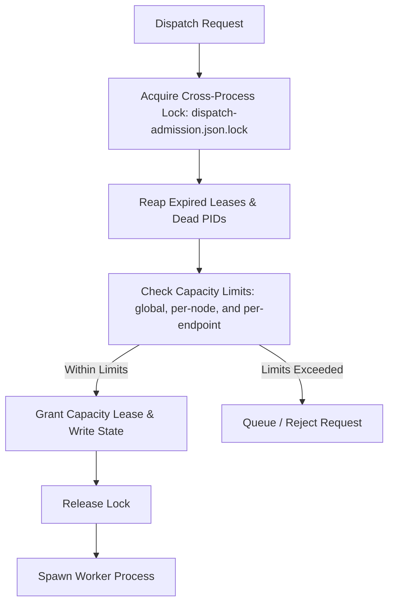

# Capacity Leases & Fleet Scheduling

The [fleet dispatch guide](../guide/fleet-dispatch.md) explains node setup and capacity controls.

This document specifies the multi-process capacity leasing protocols, node
scheduling models, cross-process transaction locks, and failure recovery
mechanics in the current source tree.

Source implementations: `src/domains/scheduling/`, [capacity-lease.ts](../../src/domains/dispatch/capacity-lease.ts), [admission.ts](../../src/domains/dispatch/admission.ts), [admission-queue.ts](../../src/domains/dispatch/admission-queue.ts), [reservation-store.ts](../../src/domains/dispatch/reservation-store.ts), and [endpoint-capacity.ts](../../src/domains/providers/endpoint-capacity.ts).

---

## 1. Capacity Model & Admission Invariants

Fleet dispatch manages compute resources across local and remote execution nodes as a unified capacity pool. Dispatched workers must acquire a durable capacity lease before they are spawned. Admission checks global, node, and inference-endpoint limits independently.



| Dimension | Identity | Limit resolution |
| :--- | :--- | :--- |
| Global | All dispatches using the state directory. | `fleet.concurrency: auto` resolves to `AUTO_MAX_WORKERS` (8); a numeric setting sets the exact limit. It is not host-sized, so a small orchestrator host never shrinks remote execution. |
| Node | The local node or one configured fleet node. | For the local node, `auto` takes the smallest of three bounds: the cap of 8, the usable CPUs (which respects affinity masks such as a Slurm cpuset), and the memory bound, which is available memory minus a 2 GiB reserve divided by a 1 GiB estimate per worker. A cgroup memory limit adds a fourth bound. Memory held by Clio's own running local workers is added back so the limit does not collapse as the fleet it admits starts. Host facts are sampled at most every 30 seconds. A numeric setting sets an exact limit. Configured remote nodes apply their own `maxWorkers` (default 2). |
| Inference endpoint | A normalized scheme, host, port, and base path. | A target's `maxConcurrentRequests` override wins, then a probe in this process, then a persisted probe from an earlier process, then one slot for other local-native targets. vLLM and SGLang remain unbounded, and a target whose runtime is not local-native has no endpoint limit unless it sets `maxConcurrentRequests`. When several targets share one endpoint, the strongest source wins and, among equals, the smaller limit. |

The conventional final `/v1` mount and a trailing slash normalize to the same endpoint. Host aliases are not collapsed because Clio cannot prove they reach the same server. For example, `http://localhost:8080/` and `http://127.0.0.1:8080/v1` remain distinct, while two target descriptors that use the same normalized URL share one endpoint limit.

llama.cpp discovery reads `total_slots` from cached probe results. A router can expose the selected worker's value from `/props?model=<id>` even when router `/props` has no slot count. The selected model's `/v1/models` argv supplies a `--parallel` fallback. LM Studio reads the loaded instance's `parallel` setting and defaults to one slot when its REST response supplies no concurrency fact. Ollama reports one because its native API exposes no slot count; use `maxConcurrentRequests` for a known daemon limit. The client's environment is not server configuration.

The endpoint set is resolved from the configured targets as well as the probed statuses, so it is the same set a second after boot as it is a minute later. An endpoint that resolves to no limit is not checked at all, and "not checked" is not a conservative answer. An endpoint still bound by the blind one-slot default has never been probed by any process, or its record expired. The dispatch domain probes each such endpoint once per process in the background, without the inference-based reasoning check, so a fresh home does not refuse two tasks on a four-slot server.

### Persisted Slot Discovery

A probe learns a fact about a server, not about the process that asked, so a discovered slot count is written to disk and read back as a prior by the next process.

- **Path**: `<stateDir>/endpoint-slots.json` (`src/domains/providers/endpoint-slots-store.ts:endpointSlotsPath()`)
- **Version**: `version: 1`, one record per canonical endpoint key, at most 64 records (the most recently observed are kept)
- **Transaction lock**: `<stateDir>/endpoint-slots.json.lock` (`withStateFileLock`)
- **Staleness bound**: 24 hours, overridable per process with `CLIO_CODER_ENDPOINT_SLOTS_TTL_MS`

```typescript
export interface DiscoveredEndpointSlots {
  endpointKey: string;   // Canonical inference endpoint identifier
  runtimeId: string;     // Runtime that observed the count
  slots: number;         // Discovered parallel slot count
  observedAt: string;    // ISO-8601 observation timestamp
}
```

Three things bound what a record may claim. A record older than the staleness bound, or stamped in the future, is ignored and pruned by the next write, so a server restarted with a smaller `--parallel` cannot keep over-admitting against yesterday's number. A fresh observation replaces the stored one even when it is lower. A record written by a different runtime for the same host and port is ignored, because a different inference server is a different scheduler. A probe in this process always wins over the record, and `maxConcurrentRequests` wins over both. A well-formed record that fails any of these checks falls back to the conservative default rather than to a guess.

### State Storage & Format

All capacity state is stored in a single durable JSON file:

- **Path**: `<stateDir>/dispatch-admission.json` (`src/domains/dispatch/capacity-lease.ts:capacityStatePath()`)
- **Version**: `version: 2` (`CapacityStateFile`)
- **Transaction Lock**: `<stateDir>/dispatch-admission.json.lock` (`withStateFileLockSync`). The lock records its owner's host, pid, and process birth token. A waiter steals it only from an owner that is provably gone on this host. A lock whose owner cannot be read is stolen after 30 seconds of file age. Acquisition fails after `FILE_LOCK_ACQUIRE_TIMEOUT_MS` (20 seconds), which is kept under the lease TTL so a process waiting on the lock cannot watch its own lease expire.

```typescript
export interface CapacityStateFile {
  version: 2;
  draining: CapacityDrain | null;
  leases: CapacityLease[];
  reservations: unknown[];  // interpreted only by reservation-store.ts
}
```

The store holds process-lifetime state, not history. An unreadable file or a file with another schema version makes admission fail closed with a message naming the path; removing the file resets local admission state. Writing more than `MAX_CAPACITY_LEASES` leases is refused as an admission failure instead of truncating.

---

## 2. Capacity Lease Schema & TTLs

Each in-flight worker holds one `CapacityLease` ([capacity-lease.ts](../../src/domains/dispatch/capacity-lease.ts)):

```typescript
export interface CapacityLease {
  leaseId: string;              // Unique lease identifier
  assignmentId: string;         // Owning dispatch assignment ID
  nodeId: string;               // Execution node identifier ("local" or remote ID)
  endpointKey?: string;         // Canonical inference endpoint identifier
  host?: string;                // Owner host; absent only on older records
  ownerPid: number;             // Process ID of the orchestrator/worker owner
  processBirthToken: string;    // OS-level token preventing PID reuse collisions
  acquiredAt: string;           // ISO-8601 acquisition timestamp
  expiresAt: string;            // ISO-8601 expiration timestamp
  heartbeatAt: string;          // ISO-8601 last heartbeat timestamp
  reservationOwnerId: string | null;
  reservationMemberId: string | null;
}
```

The orchestrator process's own model requests are registered in memory against the same endpoint key, so each consumes one endpoint slot before a worker is admitted. The registered requests are a chat turn, the memory step, the vision sidecar, and prewarm requests. This foreground count is not written to `dispatch-admission.json`; process exit releases it. Durable leases and held reservation members carry `endpointKey`, and held members count their peak per wave for the endpoint just as they do for a node.

Execution-plan waves also honor the endpoint bound. A plan with four available worker positions targeting one two-slot server packs at most two of them into a wave, or one when the orchestrator already holds the other slot. Reservation preflight refuses a plan whose peak cannot fit because the scheduler must reserve the whole plan atomically. The refusal names the endpoint, both slot counts, why one slot is already gone, and the moves that actually free capacity:

```text
dispatch: admission denied: endpoint '127.0.0.1:8080' capacity exceeded (2/1 slots): 1 foreground stream holds the slot; reduce the same-wave worker count, set this target's maxConcurrentRequests to the slot count the server was started with, collect in-flight runs, or point workers at a second server
```

The `2/1` example represents a generic llama.cpp server started with `--parallel 1` while the orchestrator is streaming from it.

A four-slot llama.cpp endpoint leaves three admission slots while one foreground
stream is active. This says nothing about four independent full context windows:
with unified KV, requests can share a single pool. Slot admission does not reserve
VRAM or prove that the aggregate prompts will fit or meet a latency target.

### Admission queue

A singular dispatch acquires its lease through the capacity admission controller in [admission.ts](../../src/domains/dispatch/admission.ts), which places the request in a bounded queue ([admission-queue.ts](../../src/domains/dispatch/admission-queue.ts)).

- **Capacity reached is transient.** Direct lease acquisition reports saturation at any dimension as `capacity reached`. The controller keeps the assignment queued and retries, backing off from 10 ms up to 500 ms while nothing is admitted and retrying at once when a lease is released. A request waits until capacity opens, it is canceled, or its explicit deadline passes. The queue has no timeout of its own.
- **Fail-fast errors.** Capacity marked `unavailable` (a limit below 1), drain mode, corrupt state, a full lease store, and every other error fail immediately.
- **Foreground endpoint block.** A request is refused at once, without queuing, when its endpoint is at its limit and one of the holders is a foreground stream. The orchestrator cannot release its slot until the tool call returns, so waiting would deadlock. The error reads `dispatch: admission denied: endpoint '<host:port>' cannot open a worker slot while 1 foreground stream holds the slot (1/1 slots)`, followed by the advice to point workers at a second endpoint or raise `maxConcurrentRequests`.
- **Ordering.** Higher priority first, then plan order within one plan, then first in first out. A plan slot belongs to an assignment, so a retry re-enters the queue with the slot it already holds. A plan never has more assignments admitted than its reserved peak.
- **Bounds.** The queue holds at most 256 requests; the 257th fails with `dispatch: admission queue full (256/256)`. A request whose deadline passed before it was queued reports that it never waited on capacity.
- **Timeout message.** A timed-out request names what it waited on: the endpoint with its holders (leases, held reservations, foreground streams), or the node and global slot counts in use.

### Reservations

A multi-worker plan (`parallel`, `detached`, `sequential`, `pipeline`, `review`, `compete`, or `council` topology) reserves its capacity before any worker starts. [reservation-store.ts](../../src/domains/dispatch/reservation-store.ts) keeps the reservation records inside `dispatch-admission.json`, under the same lock.

- A reservation holds the global, per-node, and per-endpoint peak of its widest wave. Its members are `held`, then `consumed` when a worker takes the slot as a lease, or `released`. Cost upper bounds are recorded as advisory accounting and never deny work.
- Preflight sums the active leases, the foreground streams, and every other active reservation's outstanding members against each limit. An endpoint breach produces the `capacity exceeded` denial above, and a council names its two-member floor.
- A retry rebinds its member to the node and endpoint it actually resolved, atomically under the lock, and fails closed with a named reason when the new route has no room.
- The store keeps at most 500 records. A reservation expires once `DEFAULT_RESERVATION_TTL_MS` (15 minutes) has passed and its owning process is gone. A live owner keeps a long-running plan past the TTL. Cleanup at dispatch startup reclaims reservations whose owner is gone without waiting for the TTL and preserves those of live sibling processes.
- A denied or unexecuted plan is rolled back. A plan that has consumed a member is released when the scheduler finishes.

### What `/council` Needs on a Single-GPU Setup

A council seats two to five members and runs the whole roster in one wave, so it needs at least two endpoint slots at once, plus a third if the orchestrator's own turn is streaming to the same server. It cannot answer a capacity denial by dispatching fewer members, which is why its denial says so instead of offering that move:

```text
dispatch: admission denied: endpoint 'one-slot-local:8080' capacity exceeded (2/1 slots): no active lease, held reservation, or foreground stream currently holds a slot; a council runs its whole roster in one wave and cannot go below 2 members, so set this target's maxConcurrentRequests to the slot count the server was started with, collect in-flight runs, or point workers at a second server
```

On a single-GPU box there are three ways to make `/council` work, in order of preference:

1. Start the server with enough slots and let discovery find them. `llama-server --parallel 4` is discovered as four slots and persisted, so every later process sees four without re-probing.
2. Set `maxConcurrentRequests` on the target when the server's real concurrency is higher than what it advertises. It overrides every discovered value.
3. Point some roster members at a second server. Members on different endpoints do not compete for the same slots.

A server genuinely started with one slot cannot run a council, and admitting one anyway would put two workers plus the orchestrator through a scheduler with room for one. The denial is the correct outcome; the fix is on the server or in the roster.

### Constants & Operational Bounds

| Constant | Value | Description | Source Reference |
| :--- | :--- | :--- | :--- |
| `MAX_CAPACITY_LEASES` | `1000` | Hard cap on simultaneous active capacity leases across all nodes. | [capacity-lease.ts](../../src/domains/dispatch/capacity-lease.ts) |
| `DEFAULT_CAPACITY_LEASE_TTL_MS` | `30000` ms (30s) | Renewal and fallback expiry horizon when exact process identity is unavailable. A matching live process birth token keeps its lease valid beyond this timestamp. | [capacity-lease.ts](../../src/domains/dispatch/capacity-lease.ts) |
| `DEFAULT_CAPACITY_DRAIN_TTL_MS` | `3600000` ms (1h) | Automatic expiration window for operator drain mode. | [capacity-lease.ts](../../src/domains/dispatch/capacity-lease.ts) |
| `NODE_DEATH_FAILURE_THRESHOLD` | `2` consecutive failures | Channel failure count before a remote node is classified offline. | [cluster.ts](../../src/domains/scheduling/cluster.ts) |
| Lease renewal interval | `10000` ms | How often the admission controller renews every lease it holds. | [admission.ts](../../src/domains/dispatch/admission.ts) |
| `FILE_LOCK_ACQUIRE_TIMEOUT_MS` | `20000` ms | Default budget to acquire the cross-process state lock. It must stay under the lease TTL. | [state-file-lock.ts](../../src/core/state-file-lock.ts) |
| Admission queue size | `256` requests | Pending requests the queue accepts before failing with `admission queue full`. | [admission.ts](../../src/domains/dispatch/admission.ts) |
| `DEFAULT_RESERVATION_TTL_MS` | `900000` ms (15 min) | Planning horizon of a reservation; only an owner that is gone lets it expire. | [reservation-store.ts](../../src/domains/dispatch/reservation-store.ts) |
| `AUTO_MAX_WORKERS` | `8` | Upper bound for `fleet.concurrency: auto`, and the global pool under `auto`. | [local-capacity.ts](../../src/domains/scheduling/local-capacity.ts) |
| `WORKER_MEMORY_ESTIMATE_BYTES` and `OS_MEMORY_RESERVE_BYTES` | 1 GiB and 2 GiB | Per-worker memory estimate and the reserve left for the OS, the orchestrator, and local inference servers. | [local-capacity.ts](../../src/domains/scheduling/local-capacity.ts) |
| `HOST_SAMPLE_INTERVAL_MS` | `30000` ms | Minimum spacing between host samples for `auto`. | [local-capacity.ts](../../src/domains/scheduling/local-capacity.ts) |
| `DEFAULT_ENDPOINT_SLOTS_TTL_MS` | `86400000` ms (24 h) | Staleness bound for a persisted slot count. Override with `CLIO_CODER_ENDPOINT_SLOTS_TTL_MS`. | [endpoint-slots-store.ts](../../src/domains/providers/endpoint-slots-store.ts) |

---

## 3. Heartbeats & Dead-Process Recovery

To prevent leaked leases when workers or orchestrators crash:

1. **Worker Heartbeat Protocol**: Active native workers emit control-channel heartbeats every 1,000 ms ([heartbeat.ts](../../src/worker/heartbeat.ts)) for run liveness and stall detection. The watchdog thresholds are in [worker-dispatch-mechanics.md](worker-dispatch-mechanics.md#3-heartbeats-and-the-watchdog).
2. **Capacity-Lease Renewal**: Independently of worker control frames, the process-local admission controller renews every held durable lease every 10,000 ms. A renewal updates `heartbeatAt` and extends `expiresAt` by `DEFAULT_CAPACITY_LEASE_TTL_MS`.
3. **PID Liveness & Birth Tokens**: The lease reconciler inspects `ownerPid` and validates `processBirthToken` against operating system process tables for records owned by this host. If the PID has terminated or been recycled by the OS, the lease is immediately reclaimed. A record naming another host is not adjudicated with the local process table. On a platform with no birth-token source the token is synthetic and proves nothing about PID reuse, so the lease then also needs a liveness signal and its expiry decides.
4. **Lazy Reaping**: Every admission attempt purges reclaimable leases and dead process records inside the cross-process transaction lock before calculating available capacity.

---

## 4. Cluster Drain & Emergency Control

The fleet can be drained for maintenance without terminating running jobs:

- **Drain Command**: `clio-coder fleet drain [--json]` sets `draining` in `dispatch-admission.json`. `clio-coder fleet status` reports whether admission is open or draining and until when.
- **Drain Invariant**: When draining is active, existing runs continue to completion, but all new dispatch admissions and new reservations are refused with a drain notice that names the requesting pid and time (`dispatch: admission denied: capacity is draining (requested by pid <pid> at <time>)`).
- **Auto-Expiry**: To prevent an unmanaged lockup if a draining operator disconnects, the drain state automatically expires after `DEFAULT_CAPACITY_DRAIN_TTL_MS` (1 hour). Repeating `fleet drain` renews the expiry.
- **Resume Command**: `clio-coder fleet resume [--json]` clears the drain state immediately.
- **Process shutdown**: A shutting-down Clio process uses its own process-local drain flag, which cancels its queued requests. It never sets the durable drain, because that would deny admission in every sibling process.

---

## 5. Fleet Node Registry

[cluster.ts](../../src/domains/scheduling/cluster.ts) holds the node list that placement reads. Node configuration comes from `fleet.nodes` and is read fresh on every call, so a settings edit applies to the next dispatch. The implicit `local` node comes first, then configured nodes in declaration order.

- **State**: A node is `online` or `offline`. Nodes start online. Dispatch eligibility additionally needs a passing doctor preflight, which is durable and checked at placement.
- **Death classification**: `NODE_DEATH_FAILURE_THRESHOLD` (2) consecutive channel failures classify a node offline. Placement then skips it and the dispatch domain reaps its in-flight runs for reroute. A later channel success restores it. Only SSH nodes accrue channel failures.
- **Staleness**: `lastSeenAt` records the last probe or worker heartbeat for display. An idle node is never taken offline for silence.
- **Usage**: `activeWorkers` per node is derived from durable leases, never from a process-local counter. `maxWorkers` is the sized local limit, with the input that bound it (`configured`, `cpu`, `memory`, `cgroup`, or `cap`), or the SSH node's declared `maxWorkers`.

---

## 6. Session Cost Ceiling

The scheduling domain also owns the session budget ([budget.ts](../../src/domains/scheduling/budget.ts), [extension.ts](../../src/domains/scheduling/extension.ts)). The ceiling is `safety.limits.sessionCostUsd` (default `5`) and follows settings changes. A paid request, chat or dispatch, is admitted only while priced spend plus the request's additional estimate stays below the ceiling. At or over the ceiling an interactive session emits one `BudgetAlert` and waits, polling every 250 ms, until the operator raises the ceiling. A headless caller is rejected with `budget_ceiling: session priced spend $<spent> reached the $<ceiling> ceiling; raise safety.limits.sessionCostUsd`, which ends `clio-coder run` with exit code `4`. Unpriced routes never enter the gate. A queued dispatch also emits a `BudgetAlert` when spend is at or over the ceiling, but the verdict alone does not deny a reservation.

The setting is a finite number of at least 0. Settings validation rejects a negative value, and `createBudgetState` throws `budget: ceiling must be >= 0 (got <val>)` if one reaches it. `0` means no session ceiling. `sessionCeilingReached(spendUsd, ceilingUsd)` in `budget.ts` is true only when the ceiling is above 0 and spend has reached it, and every reader that compares spend with the configured value goes through it: `admitPaidRequest` for chat and dispatch, the fallback preflight in the turn and dispatch paths, and the System One request admission. At 0, `checkCeiling` always returns `under`. No `BudgetAlert` is emitted, no interactive session waits, and a fleet preview reports no `budget ceiling crossed` diagnostic. `SchedulingContract.ceilingUsd()` still returns 0. A dispatch plan artifact carries that 0 as its `costCeilingUsd` and renders the advisory baseline as `no ceiling`, and a Scout continuation skips its check that the reserved cost stays under the approved ceiling. The fleet preview and the `clio-coder fleet run` preflight skip the check that a contract's `budgetUsd` fits the remaining session budget. A positive ceiling keeps every behavior described above, including exit code `4` and `budget_ceiling`.

The settings contract is in [safety-model.md](safety-model.md), and pricing provenance is in [configuration-and-targets.md](../guide/configuration-and-targets.md).

---

## 7. Fail-Closed Invariants

1. **Corrupted State File**: If `dispatch-admission.json` contains invalid JSON or schema violations, the admission engine fails closed, refusing new work until repaired. The error names the file path and says that removing it resets local admission state.
2. **Lock Timeouts**: If the cross-process lock cannot be acquired within the timeout window (20 seconds by default), dispatch fails closed rather than executing uncoordinated parallel operations.
3. **Unreadable reservation records**: A reservation record that fails validation is rejected, not skipped, because skipping it would under-count capacity and admit past the cap.
