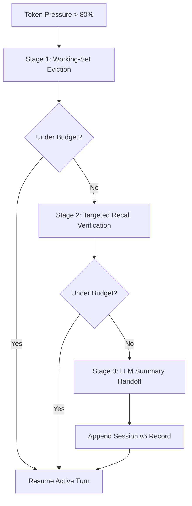

# Context Engine

`contextUsageSnapshot` in [context-accounting.ts](../../src/domains/session/context-accounting.ts) computes the active budget. The [context continuity guide](../guide/context-continuity.md) explains operator recovery.

Clio manages two complementary layers of context: the active working set compiled for the language model on every turn, and the persistent project knowledge used to navigate and ground repository work.

The core thesis of Clio's context architecture is that **context management must be deterministic, reversible, and source-grounded**. Rather than treating conversation history as an unbounded append-only log that periodically collapses into lossy prose summaries, Clio employs an active working-set model with deterministic token accounting, reversible observation eviction, prefix-stabilized prompt caching, and dual-layer repository indexing.

**Start with `/context`.** It shows the active model window, current token occupancy, project handbook guidance, and live prompt-cache reuse measurements.

---

## Action Map

| You want to… | Use | What to expect |
| --- | --- | --- |
| Inspect active token budget & pressure | `/context` or `context(scope="budget")` | Detailed token breakdown, reserve buffers, and cache measurements. |
| Reversibly prune past observations | `/context compact` or `self_compact()` | Working-set eviction first; LLM summary handoff only if still over budget. |
| Recover an interrupted compaction | `/context recover <handoffId> <reduce\|deliver>` | Branch-bound transaction recovery with preserved continuity identity. |
| Restore an evicted tool observation | `/context recall <recordId>` | Re-hydrates evicted tool results into active context. |
| Initialize or refresh structural index | `clio-coder context init` / `refresh` | Model-free indexing of symbols, files, and dependencies into `.clio-coder/codewiki.json`. |
| Generate architectural Markdown wiki | `clio-coder context wiki` | Dispatched worker generation of persistent documentation under `.clio-coder/wiki/`. |
| Inspect effective session settings | `context(scope="settings")` | Read-only view of active configuration, targets, and compaction thresholds. |

---

## Context Window Resolution

The effective context window ($W$) defines the strict boundary used by Clio for token budgeting and compaction scheduling. It may differ from a provider's advertised context ceiling, particularly when local model servers (e.g. Ollama, llama.cpp, LM Studio) are configured with constrained hardware slots.

Clio resolves the window via a strict four-tier hierarchy:

1. **Target Override**: Explicit `targets[].contextWindow` in `settings.yaml`.
2. **Model Catalog Declaration**: Static `contextWindow` declared in [src/domains/providers/catalog.ts](../../src/domains/providers/catalog.ts).
3. **Live Provider Probe**: Dynamically detected via `/models`, `/props`, or `/api/ps` during target initialization.
4. **Engine Default**: Safe fallback of 128,000 tokens.

<details>
<summary>Budget calculation: usable budget, reserved output, and safety headroom</summary>

The usable input budget available for conversation history and tools is computed as:

$$	ext{Usable Input Budget} = \min(W, 	ext{Target Cap}) - 	ext{Reserved Output} - 	ext{Safety Headroom}$$

- **Reserved Output**: Dedicated space guaranteed for the model's response. Defaults to the model's advertised maximum output tokens (e.g. 4,096 to 16,384 tokens), preventing output truncation mid-turn.
- **Safety Headroom**: Bounded buffer (default 1,024 tokens) guarding against prompt compilation variances, tokenizer discrepancies, and unexpected image framing tokens.
- **Enforcement Boundaries**: Input budgets are strictly checked at user prompt submission, tool continuation, and the final provider wire request.

</details>

---

## Token Accounting & Ledger Snapshots

Token accounting in Clio is continuous and verifiable. Rather than guessing token usage from rough character approximations, Clio reconciles pre-call estimates with authoritative provider return values.

- **Pre-Call Estimation**: Calculated using calibrated tokenizer ratios before sending requests, ensuring prompts do not exceed the provider's hard ceiling.
- **Post-Call Reconciliation**: When the provider returns actual usage (`usage.prompt_tokens`, `usage.completion_tokens`, and reasoning tokens), Clio reconciles the estimates against the exact reported numbers.
- **Session Ledger**: Persisted in append-only session format v5 ([src/domains/session/context-ledger.ts](../../src/domains/session/context-ledger.ts)). Each turn records an immutable `contextAccounting` record capturing raw input, output, cache-read, cache-write, and reasoning token totals.

<details>
<summary>How estimates, provider counts, and snapshots fit together</summary>

1. **Pre-turn check**: `admitTurn()` verifies that fixed system prompt components + current working set + reserved output fit within $W$.
2. **Streaming phase**: Streaming chunks update live token counters in the footer.
3. **Turn settlement**: Provider-reported usage records are written to the ledger. If the provider does not report token counts, Clio marks the count as `estimated: true` using calibrated local token calculations.
4. **Ledger integrity**: Snapshots survive session forks, replays, and exports without drifting.

</details>

---

## Single-Threshold Compaction

Automatic compaction triggers when session token occupancy exceeds `context.compaction.threshold` (default **80% of usable budget**). Compaction follows a deterministic three-stage pipeline designed to minimize information loss.



### 1. Working-Set Eviction (Reversible)
Working-set eviction is Clio's primary defense against context exhaustion. Rather than summarizing the conversation into prose, eviction targets bulky tool observations:
- Large tool outputs (`read`, `grep`, `bash`, `data`) from older turns are pruned and replaced with structured tombstone markers.
- **Tombstone Structure**: Contains the tool name, target path/query, execution duration, output digest, and a persistent `recallId`.
- **Protected Content**: Eviction never touches user prompts, assistant reasoning, file mutation diffs, or the most recent 2 turns of conversation.

### 2. Targeted Recall
Evicted observations remain accessible to both the operator and the language model:
- The agent can inspect an evicted output by invoking `/context recall <recordId>`.
- Recalled observations are restored into the active working set, triggering re-compaction of other older observations if budget pressure requires it.

### 3. LLM Summary Handoff (Last Resort)
When working-set eviction cannot reclaim sufficient space (e.g. extensive user prompts or hundreds of conversation turns), Clio executes an assistant-authored summary handoff:
- The model (or a dedicated compaction model specified via `context.compaction.model`) synthesizes a structured `note_to_self`.
- The summary captures critical operational state: task objectives, discovered constraints, modified files, active hypothesis, and immediate next steps.
- The summary is appended to the ledger as a `self_compact` record in session format v5.
- Earlier conversation turns are retired from active context but remain completely intact in session logs and `/view transcript`.

<details>
<summary>Compaction recovery and transaction guarantees</summary>

Compaction operations are transactional:
- Each handoff generates a unique `handoffId` bound to the branch.
- If a crash or timeout occurs during compaction, `/context recover <handoffId> <reduce|deliver>` allows explicit recovery without duplicate turn execution.
- Handoff attempts are bounded to prevent infinite compaction loops.

</details>

---

## Cache-Divergence Honesty & Prefix Caching

Clio is engineered to exploit prompt prefix caching on providers that support it (Anthropic prompt caching, OpenAI/Codex prefix reuse, Gemini context caching, and local llama.cpp KV-cache slots).

### Prompt Layering Hierarchy
To maximize cache hits, Clio structures the prompt from most static to most dynamic:

| Layer | Volatility | Position | Cache Reuse Guarantee |
| :--- | :--- | :--- | :--- |
| **System Identity & Engine Rules** | Static | Prefix (Top) | Reused across all turns in a session. |
| **Tool & Gateway Schemas** | Infrequent | Header | Remains warm until tools are toggled or armed. |
| **Project Handbook & Codewiki** | Low | Upper-Middle | Reused until project files or index change. |
| **Durable Memories & Lessons** | Medium | Lower-Middle | Evaluated and frozen at turn boundaries. |
| **Session Working Set & Turns** | High | Suffix (Tail) | Incremental append-only growth. |

### Cache Honesty Contract
- **No False Claims**: `/context` and turn receipts report only provider-attested cache reads (`cached <N> tokens`).
- **Divergence Notices**: When prompt compilation drifts (e.g., when a skill is armed or dynamic tools are added), Clio displays `cold: prompt recompiled` in turn receipts, honestly communicating why cache reuse dropped.

---

## Configuration Settings

Settings configured under `context.*` in `settings.yaml`:

| Setting | Default | Purpose |
| :--- | :--- | :--- |
| `context.autoCompaction` | `true` | Enable automated multi-tier compaction when budget threshold is crossed. |
| `context.compaction.threshold` | `0.80` | Context occupancy ratio ($[0.5, 0.95]$) triggering compaction. |
| `context.compaction.model` | `null` | Optional dedicated route/model used exclusively for summary handoffs. |
| `context.toolResultMaxBytes` | `65536` | Maximum bytes retained per tool call before scratch offload. |
| `context.workingSet.enabled` | `true` | Enable reversible working-set observation eviction. |
| `context.workingSet.policy` | `"structural-v1"` | Eviction strategy (`structural-v1` for dependency/class-aware, `age-horizon` for temporal). |

---

## Project Handbooks & Preload Hierarchy

Project-level context is authored in Markdown and discovered hierarchically:

- **Root Handbook (`CLIO-CODER.md`)**: The rules an agent would get wrong after reading the code: invariants, conventions that differ from defaults, change recipes, and non-obvious verification. Repository tours and standard commands do not belong in it.
- **Directory Overrides (`CLIO-CODER.override.md`)**: Scoped instructions for specific subtrees, overriding root rules for contained files.
- **Preload Budgeting**: Project context up to 24,000 UTF-16 units and 220 rendered lines (`FULL_PROJECT_CONTEXT_MAX_CHARS`, `FULL_PROJECT_CONTEXT_MAX_LINES` in `src/domains/prompts/preload.ts`) is embedded directly into the prompt prefix. That fits a handbook written to the 200-line guideline. Oversized handbooks are truncated with explicit omitted line markers, directing the agent to read the full file with `read` if needed.
- **Worker routing**: `src/domains/context/handbook-units.ts` compiles each H2 section into rule units. A unit's audience comes from its section title: `Hard invariants` reach every worker, a title naming git or release reaches `git-master`, docs titles reach `documenter`, test and verification titles reach testers and verifiers, and a title containing "Operating" stays with the main session. Its path scope comes from the backticked repository paths it cites, taken to their literal directory with at least two segments. A bounded worker receives the invariants, the rules whose scope matches its dispatch paths, and its role's unscoped rules, within 6,000 UTF-16 units, plus a line naming the sections it did not get. A section can override both with `<!-- clio: audience=verify paths=vendor/** -->` on the line after its heading. A handbook with no H2 rule sections keeps the verbatim 1,500-unit prefix.

---

## Codewiki & Architecture Index

Clio maintains two distinct repository knowledge layers:

```
Repository Source Code
       │
       ├─► [context init / refresh] ──► .clio-coder/codewiki.json (Model-Free Structural Index)
       │                                     │
       │                                     ▼
       │                                Fast code_nav Symbol Resolution
       │
       └─► [context wiki] ──────────► .clio-coder/wiki/**/*.md (Agent-Authored Architecture Wiki)
                                             │
                                             ▼
                                        Deep Architectural Navigation
```

| Dimension | Structural Codewiki | Markdown Architecture Wiki |
| :--- | :--- | :--- |
| **Artifact** | `.clio-coder/codewiki.json` (schema v5) | `.clio-coder/wiki/**/*.md` + `meta.json` |
| **Generation** | `clio-coder context init` (model-free) | `clio-coder context wiki` (worker dispatches) |
| **Inference Cost** | 0 tokens (pure AST and lexical parsing) | Planning turn + 1 worker dispatch per page |
| **Prompt Representation**| `<codewiki>` tag enabling `code_nav` | `<wiki>` summary index with page pointers |
| **Update Triggers** | File save, git checkout, `context refresh` | Explicit operator command |

<details>
<summary>Structural index schema v5 and symbol resolution</summary>

`.clio-coder/codewiki.json` records:
- **Files**: Path, language, line count, role (source, test, config, doc), and content hash.
- **Symbols**: Top-level exported functions, classes, interfaces, and types with exact line ranges.
- **Dependencies**: Explicit import specifiers and internal module references.
- **Fast Navigation**: Powers the `code_nav` tool, allowing the agent to locate symbols and callers without running full repository text searches.

</details>

---

## Source Implementation Map

| Subsystem | Source Location | Key Contracts & Exports |
| :--- | :--- | :--- |
| Token Accounting & Budgets | [context-accounting.ts](../../src/domains/session/context-accounting.ts) | `contextUsageSnapshot`, `reconcileSnapshot` |
| Context Ledger | [context-ledger.ts](../../src/domains/session/context-ledger.ts) | `ContextLedger`, `buildContextLedger` |
| Compaction summary | [compact.ts](../../src/domains/session/compaction/compact.ts) | `compact`, `captureSkillContext` |
| Codewiki artifact | [artifact.ts](../../src/domains/context/codewiki/artifact.ts) | `writeCodewiki`, `readCodewiki` |
| Docs & Guidance Engine | [docs-engine.ts](../../src/tools/context/docs-engine.ts) | `listDocsCorpus`, `searchDocs` |
