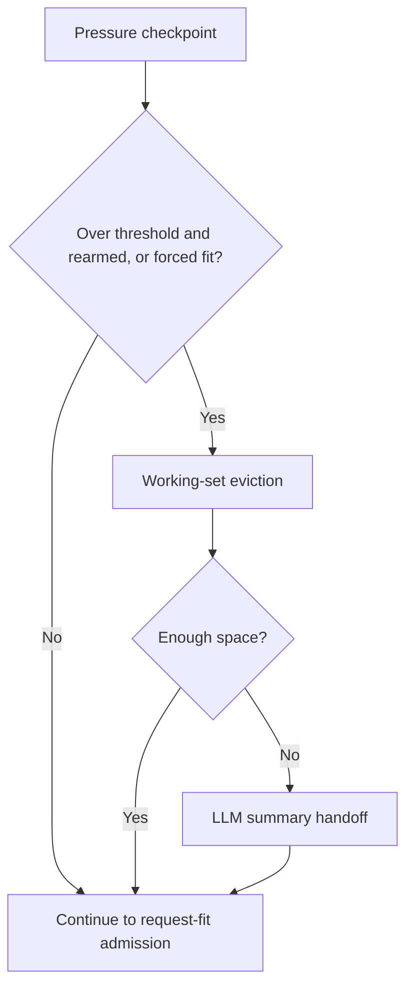

# Context Engine

`contextUsageSnapshot` in [context-accounting.ts](../../src/domains/session/context-accounting.ts) computes the active budget. The [context continuity guide](../guide/context-continuity.md) explains operator recovery.

Clio manages two complementary layers of context: the active working set compiled for the language model on every turn, and the persistent project knowledge used to navigate and ground repository work.

The core thesis of Clio's context architecture is that **context management must be deterministic, reversible, and source-grounded**. Rather than treating conversation history as an unbounded append-only log that periodically collapses into lossy prose summaries, Clio employs an active working-set model with deterministic token accounting, reversible observation eviction, prefix-stabilized prompt caching, and dual-layer repository indexing.

**Start with `/context`.** It shows the active model window, current token occupancy, project handbook guidance, and live prompt-cache reuse measurements.

---

## Action Map

| You want to… | Use | What to expect |
| --- | --- | --- |
| Inspect active token budget & pressure | `/context` or `context(scope="budget")` | Detailed token breakdown, reserve buffers, and cache measurements. |
| Reversibly prune past observations | `/context compact` or `self_compact()` | Working-set eviction first; LLM summary handoff only if still over budget. |
| Recover an interrupted compaction | `/context recover <handoffId> <reduce\|deliver>` | Branch-bound transaction recovery with preserved continuity identity. |
| Inspect an evicted tool observation | `/context recall <ref>` | Shows the original body in the transcript; model recall uses the context tool. |
| Initialize or refresh structural index | `clio-coder context index` / `refresh` | Model-free indexing of symbols, files, and dependencies into `.clio-coder/codemap.json`; `context init` also generates a handbook. |
| Generate architectural Markdown wiki | `clio-coder context wiki` | Dispatched worker generation of persistent documentation under `.clio-coder/wiki/`. |
| Inspect effective session settings | `context(scope="settings")` | Read-only view of active configuration, targets, and compaction thresholds. |

---

## Context Window Resolution

The effective context window ($W$) defines the strict boundary used by Clio for token budgeting and compaction scheduling. It may differ from a provider's advertised context ceiling, particularly when local model servers (e.g. Ollama, llama.cpp, LM Studio) are configured with constrained hardware slots.

Clio resolves the window via a strict four-tier hierarchy:

1. **Target Override**: Explicit `targets[].contextWindow` in `settings.yaml`.
2. **Model Catalog Declaration**: Static `contextWindow` declared in [src/domains/providers/catalog.ts](../../src/domains/providers/catalog.ts).
3. **Live Provider Probe**: Dynamically detected via `/models`, `/props`, or `/api/ps` during target initialization.
4. **Engine Default**: Safe fallback of 128,000 tokens.

<details>
<summary>Budget calculation: usable budget, reserved output, and safety headroom</summary>

The usable input budget available for conversation history and tools is computed as:

$$	ext{Usable Input Budget} = \min(W, 	ext{Target Cap}) - 	ext{Reserved Output} - 	ext{Safety Headroom}$$

- **Reserved Output**: Dedicated space guaranteed for the model's response. Defaults to the model's advertised maximum output tokens (e.g. 4,096 to 16,384 tokens), preventing output truncation mid-turn.
- **Safety Headroom**: Bounded buffer (default 1,024 tokens) guarding against prompt compilation variances, tokenizer discrepancies, and unexpected image framing tokens.
- **Enforcement Boundaries**: Input budgets are strictly checked at user prompt submission, tool continuation, and the final provider wire request.

</details>

---

## Token Accounting & Ledger Snapshots

Token accounting in Clio is continuous and verifiable. Rather than guessing token usage from rough character approximations, Clio reconciles pre-call estimates with authoritative provider return values.

- **Pre-Call Estimation**: Calculated using calibrated tokenizer ratios before sending requests, ensuring prompts do not exceed the provider's hard ceiling.
- **Post-Call Reconciliation**: When the provider returns actual usage (`usage.prompt_tokens`, `usage.completion_tokens`, and reasoning tokens), Clio reconciles the estimates against the exact reported numbers.
- **Session Ledger**: Persisted in append-only session format v6 ([src/domains/session/context-ledger.ts](../../src/domains/session/context-ledger.ts)). Each turn records an immutable `contextAccounting` record capturing raw input, output, cache-read, cache-write, and reasoning token totals.

<details>
<summary>How estimates, provider counts, and snapshots fit together</summary>

1. **Pre-turn check**: `admitTurn()` verifies that fixed system prompt components + current working set + reserved output fit within $W$.
2. **Streaming phase**: Streaming chunks update live token counters in the footer.
3. **Turn settlement**: Provider-reported usage records are written to the ledger. If the provider does not report token counts, Clio marks the count as `estimated: true` using calibrated local token calculations.
4. **Ledger integrity**: Snapshots survive session forks, replays, and exports without drifting.

</details>

---

## Single-Threshold Compaction

Automatic reduction is checked before operator submission and at settled tool-batch boundaries before each continuation request. Live pressure includes the full prompt and uses `context.compaction.threshold` (default 0.8 of the context window). Working-set eviction runs first; summary handoff follows when more reduction is needed.


```mermaid
flowchart TD
    A["Pressure checkpoint"] --> B{"Over threshold and rearmed, or forced fit?"}
    B -- No --> C["Continue to request-fit admission"]
    B -- Yes --> D["Working-set eviction"]
    D --> E{"Enough space?"}
    E -- Yes --> C
    E -- No --> F["LLM summary handoff"]
    F --> C
```

### 1. Working-Set Eviction (Reversible)

`structural-v2` replaces selected tool-result bodies with stable markers and removes eligible closed-step thinking. Operator messages, recent assistant steps, unresolved failures, active mutations and profile pins stay protected. Markers name the ref, reason, tool, path, size, recall call and optional preview or offload pointer. The ledger keeps the original bytes.

The rearm band (`context.workingSet.rearmFraction`, default 0.1) postpones another automatic eviction or summary until the projection has grown by that fraction of the window since the last event. Summaries reset the baseline; overflow fit recovery bypasses it. Selection and rearm arithmetic use projected visible-ledger tokens, while admission continues to account for the full prompt.

### 2. Exact Recall

Recall is available on demand, not a compaction stage. The model uses `context(scope="recall", ref="r12")` or a canonical file path to fetch an evicted read. An unchanged reread also records recall provenance when its body hash matches an evicted read. Returned bodies arrive at the tail and are persisted again; original markers stay stable. `/context recall <ref>` displays the historical body in the operator transcript without adding it to model input.

Profiles add numeric-output or edited-component pins to structural policies. See [Working Set](context-working-set.md) for the rung order, protection horizon, recall rules, replay reports and format-6 compatibility.

### 3. LLM Summary Handoff (Last Resort)
When working-set eviction cannot reclaim sufficient space, Clio summarizes the
older conversation using the current model or the dedicated route configured
under `context.compaction.model`. The summary captures objectives, constraints,
modified files, hypotheses, and next steps. It persists as a `compactionSummary`
ledger entry. Earlier turns leave active model context and remain in the session
ledger and `/view transcript`.

Separately, the assistant can request reduction with `self_compact` and an exact
`note_to_self`. Clio preserves that note as assistant-authored recall and records
the handoff's prepare, reduction, and delivery phases. See
[context continuity and recovery](../guide/context-continuity.md) for its limits
and recovery commands.

<details>
<summary>Assistant-directed handoff recovery</summary>

Assistant-directed handoffs have a unique `handoffId` bound to the branch and
durable phase records. After interruption,
`/context recover <handoffId> <reduce|deliver>` checks those records before
resuming reduction or delivery.
Reduction attempts and the automatic recovery window are bounded.

</details>

---

## Prefix caching and cache observations

Clio arranges stable prompt sections before turn-specific inputs to support provider prefix caching, including Anthropic prompt caching, OpenAI/Codex prefix reuse, Gemini context caching, and local llama.cpp KV-cache slots.

### Prompt Layering Hierarchy
Prompt sections have different update boundaries:

| Layer | Volatility | Position | Update boundary |
| :--- | :--- | :--- | :--- |
| **System identity and engine rules** | Low | Prefix | Recompiled when effective settings or prompt inputs change. |
| **Tool and gateway schemas** | Infrequent | Header | Changes with the admitted tool surface. |
| **Project handbook and bounded orientation** | Low | Upper-middle | Captured for the session and workspace; context-source invalidation or configuration hot reload recaptures it. The full codemap is retrieved separately. |
| **Durable memories and lessons** | Medium | Lower-middle | Selected and frozen at turn boundaries. |
| **Session working set and turns** | High | Suffix | Changes with new turns, eviction, recall, and compaction. |

### Reading cache telemetry

`/context` and turn receipts display provider-reported cache reads and available
backend timing. Recorded cold-prefix causes include dispatch, residency changes,
background memory, compaction, working-set eviction, prompt recompilation, tool
surface changes, and thinking-setting changes. These observations distinguish
prompt changes from server cache behavior. Provider policy and slot residency
determine whether a stable prefix is reused.

---

## Configuration Settings

Settings configured under `context.*` in `settings.yaml`:

| Setting | Default | Purpose |
| :--- | :--- | :--- |
| `context.autoCompaction` | `true` | Enable automated multi-tier compaction when budget threshold is crossed. |
| `context.compaction.threshold` | `0.80` | Context occupancy ratio ($[0.5, 0.95]$) triggering compaction. |
| `context.compaction.model` | `null` | Optional dedicated route/model used exclusively for summary handoffs. |
| `context.toolResultMaxBytes` | `65536` | Maximum bytes retained per tool call before scratch offload. |
| `context.workingSet.enabled` | `true` | Enable reversible working-set observation eviction. |
| `context.workingSet.policy` | `"structural-v2"` | Composed structural policy; `structural-v1` preserves the previous composition and `age-horizon` the temporal selection. |

---

## Project Handbooks & Preload Hierarchy

Project-level context is authored in Markdown and discovered hierarchically, from the enclosing repository root (the nearest directory holding a `.git` directory or file) down to the working directory. Outside any repository the walk starts at the filesystem root. `loadProjectClioMd` in `src/domains/context/clio-md.ts` owns the walk.

- **Root Handbook (`CLIO-CODER.md`)**: The rules an agent would get wrong after reading the code: invariants, conventions that differ from defaults, change recipes, and non-obvious verification. Repository tours and standard commands do not belong in it. `context init` writes its verification section itself, never from the model: the package scripts that gate a change, the commands CI runs to judge one (setup steps such as `uv sync` are left out), the declared Python, Cargo, Go or CMake runner (through `uv run` when `uv.lock` exists), and a line telling the agent to run a command through `bash` when `verify` cannot. The bootstrap prompt also asks the model which test directories CI runs and for one rule on where a regression test must live. Before the model runs, `collectEnforcementInventory` in `src/domains/context/enforcement-inventory.ts` gathers what the repository enforces, without a model: the commands CI runs, the package scripts they reach, and each custom check file with its check functions and the heads of its coded failure messages (`rule6: ...`). Each head keeps 360 characters so the remedy a long message states survives. The prompt asks for one rule per check an ordinary change can fail and one per coded failure. Hard invariants render before conventions within `HANDBOOK_TARGETS` in `src/domains/context/clio-md.ts` (10 invariants of 400 characters, 8 conventions of 280, 8 sections of 4000), and an overlong rule ends after its last whole sentence that fits, or at a word boundary with an ellipsis.
- **Directory Overrides (`CLIO-CODER.override.md`)**: Scoped instructions for specific subtrees, overriding root rules for contained files.
- **Preload Budgeting**: Project context up to 24,000 UTF-16 units and 220 rendered lines (`FULL_PROJECT_CONTEXT_MAX_CHARS`, `FULL_PROJECT_CONTEXT_MAX_LINES` in `src/domains/prompts/preload.ts`) is embedded directly into the prompt prefix. That fits a handbook written to the 200-line guideline. Oversized handbooks are truncated with explicit omitted line markers, directing the agent to read the full file with `read` if needed.
- **Worker routing**: `src/domains/context/handbook-units.ts` compiles each H2 section into rule units. A unit's audience comes from its section title: `Hard invariants` reach every worker, a title naming git or release reaches `git-master`, docs titles reach `documenter`, test and verification titles reach testers and verifiers, and a title containing "Operating" stays with the main session. Its path scope comes from the backticked repository paths it cites, taken to their literal directory with at least two segments. A bounded worker receives the invariants, the rules whose scope matches its dispatch paths, and its role's unscoped rules, within 6,000 UTF-16 units, plus a line naming the sections it did not get. A section can override both with `<!-- clio: audience=verify paths=vendor/** -->` on the line after its heading. A handbook with no H2 rule sections keeps the verbatim 1,500-unit prefix. A worker dispatched with `worktree: true` reads the handbook in its task worktree; when that checkout has none, because the repository keeps `CLIO-CODER.md` out of git, it receives the source checkout's handbook for the same relative directory.

---

## Codemap and architecture wiki

Clio maintains two distinct repository knowledge layers:

```
Repository Source Code
       │
       ├─► [context index / refresh] ──► .clio-coder/codemap.json (Model-Free Structural Index)
       │                                     │
       │                                     ▼
       │                                Fast code_nav Symbol Resolution
       │
       └─► [context wiki] ──────────► .clio-coder/wiki/**/*.md (Agent-Authored Architecture Wiki)
                                             │
                                             ▼
                                        Deep Architectural Navigation
```

| Dimension | Structural Codemap | Markdown Architecture Wiki |
| :--- | :--- | :--- |
| **Artifact** | `.clio-coder/codemap.json` (schema v5) | `.clio-coder/wiki/**/*.md` + `meta.json` |
| **Generation** | `clio-coder context index` (model-free); `context init` can also generate guidance | `clio-coder context wiki` (worker dispatches) |
| **Inference Cost** | 0 tokens (pure AST and lexical parsing) | Planning turn + 1 worker dispatch per page |
| **Prompt Representation** | Snapshot availability and bounded orientation, with `code_nav` retrieval pointers | Bounded checkpoint-coverage hint; pages are retrieved with `code_nav mode=wiki` |
| **Update Triggers** | Session-start reconciliation, notified tool edits, demand navigation, and explicit index/refresh commands | Explicit operator command |

<details>
<summary>Structural index schema v5 and symbol resolution</summary>

`.clio-coder/codemap.json` records:
- **Files**: Path, language, line count, role (entry, test, module, config), and content hash.
- **Symbols**: Extracted functions, classes, interfaces, and types with source line positions.
- **Dependencies**: Explicit import specifiers and internal module references.
- **Fast Navigation**: Powers the `code_nav` tool, allowing the agent to locate symbols and callers without running full repository text searches.

</details>

---

## Source Implementation Map

| Subsystem | Source Location | Key Contracts & Exports |
| :--- | :--- | :--- |
| Token Accounting & Budgets | [context-accounting.ts](../../src/domains/session/context-accounting.ts) | `contextUsageSnapshot`, `reconcileSnapshot` |
| Context Ledger | [context-ledger.ts](../../src/domains/session/context-ledger.ts) | `ContextLedger`, `buildContextLedger` |
| Compaction summary | [compact.ts](../../src/domains/session/compaction/compact.ts) | `compact`, `captureSkillContext` |
| Codemap artifact | [artifact.ts](../../src/domains/context/codewiki/artifact.ts) | `writeCodewiki`, `readCodewiki` |
| Docs & Guidance Engine | [docs-engine.ts](../../src/tools/context/docs-engine.ts) | `listDocsCorpus`, `searchDocs` |

For artifact ownership, compatibility, bounded orientation, current operator-task evidence and worker consumption, see [Project context](project-context.md).
