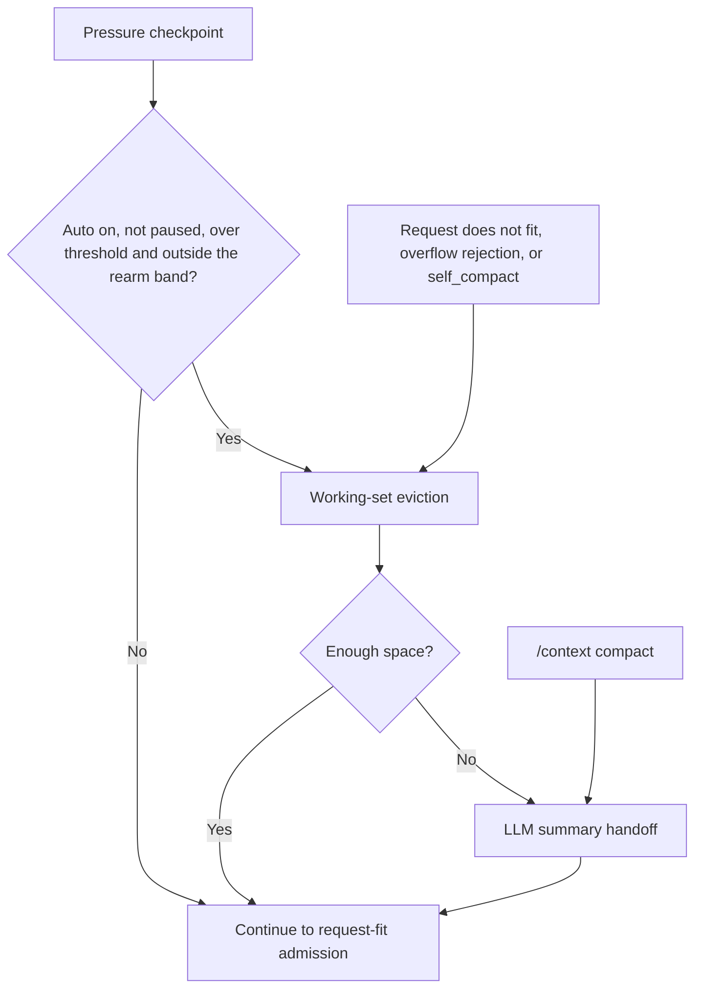

# Context Engine

`contextUsageSnapshot` in [context-accounting.ts](../../src/domains/session/context-accounting.ts) computes the active budget. The [context continuity guide](../guide/context-continuity.md) explains operator recovery.

Clio manages two complementary layers of context: the active working set compiled for the language model on every turn, and the persistent project knowledge used to navigate and ground repository work.

The core thesis of Clio's context architecture is that **context management must be deterministic, reversible, and source-grounded**. Rather than treating conversation history as an unbounded append-only log that periodically collapses into lossy prose summaries, Clio employs an active working-set model with deterministic token accounting, reversible observation eviction, prefix-stabilized prompt caching, and dual-layer repository indexing.

**Start with `/context`.** It shows the active model window, current token occupancy, project handbook guidance, and live prompt-cache reuse measurements.

---

## Action Map

| You want to… | Use | What to expect |
| --- | --- | --- |
| Inspect active token budget & pressure | `/context` or `context(scope="budget")` | Detailed token breakdown, reserve buffers, pressure phase, and cache measurements. |
| Summarize older history now | `/context compact [instructions]` or `/compact [instructions]` | An LLM summary handoff. It skips working-set eviction. Instructions bind the summarizer. |
| Let the assistant hand off to herself | `self_compact` | An exact assistant-authored note, then eviction down to fit and a summary only if still over budget. An unknown window summarizes directly. |
| Prune past observations reversibly | Automatic at `context.compaction.threshold` | No operator command evicts. Eviction is a projection and is undone per result by recall. |
| Recover an interrupted compaction | `/context recover <handoffId> <reduce\|deliver>` | Branch-bound transaction recovery with preserved continuity identity. |
| Inspect an evicted tool observation | `/context recall <ref>` | Shows the original body in the transcript; model recall uses the context tool. |
| Initialize or refresh structural index | `clio-coder context index` / `refresh` (`/context refresh` in a session) | Model-free indexing of symbols, files, and dependencies into `.clio-coder/codemap.json`. `context init` (`/context init`) also generates a handbook. |
| Visualize the codebase | `clio-coder context map` | Native interactive HTML from current repository evidence. |
| Generate architectural Markdown wiki | `clio-coder context wiki` | Dispatched worker generation of persistent documentation under `.clio-coder/wiki/`. |
| Clear accumulated project context | `clio-coder context reset` (`/context reset`) | Removes `codemap.json`, `codewiki.json`, `state.json`, `.clio-coder/handoffs/` and `.clio-coder/proposals/`; keeps handbooks, agents, skills and the wiki. |
| Compare working-set policies on saved ledgers | `clio-coder context replay`, `clio-coder context working-set --session <id\|path>` | Read-only replay and fold inspection, see [Working Set](context-working-set.md). |
| Inspect effective session settings | `context(scope="settings")` | Read-only view of active configuration, routes with their sources, targets, and compaction thresholds. |

The `context` tool accepts the scopes `workspace`, `settings`, `skills`, `recall` and `budget`.

---

## Context Window Resolution

The effective context window ($W$) is the boundary Clio uses for token budgeting and compaction scheduling. It can be smaller than a provider's advertised ceiling, particularly when a local server (Ollama, llama.cpp, LM Studio) loads a model with a constrained context. `resolveContextWindowDetails` in [runtime-resolution.ts](../../src/domains/providers/runtime-resolution.ts) picks it and records the answering layer as `contextWindowSource`, one of `catalog`, `probe`, `loaded`, `target-override`, `model-hint`, `descriptor-default`, or `unknown`.

Resolution takes the first applicable layer, most authoritative first:

1. **Requested window**: a runtime that asks for a window on every request (Ollama `num_ctx`) uses it, still capped by a smaller `targets[].capabilities.contextWindow` override or probed window.
2. **Loaded window**: the context a backend reports having the model open at, unless the target override is smaller. A larger override never enlarges it.
3. **Target override**: `targets[].capabilities.contextWindow` in `settings.yaml`, capped by a smaller probed window.
4. **Live probe**: the window the target reported through its model listing or props endpoints, capped for cold-start runtimes by the runtime's cold cap. A hosted route whose runtime reports windows keeps its last reported window through a failed or windowless re-probe, so a network blip does not turn it `unknown` and switch threshold compaction off. A local server can restart at another window, so it still goes unknown.
5. **Cloud catalog estimate**: a cloud route whose runtime has no serving-window endpoint plans against the model maximum, most live first: a maximum the server reported, a live model hint, the model profile's `modelMaxContext`, then Pi's catalog row. The source is `catalog`, an estimate and never a server report. A route with a window endpoint, and every local route, skips this layer.
6. **Unknown**: otherwise the window is `unknown` and the effective window is 0. Threshold compaction stays off until a limit is known, and a server overflow triggers one compact-and-retry.

`clio-coder run --max-context-tokens` lowers the result for one run, or supplies it when the window is unknown, and marks the source `target-override`. An unknown window produces a `context-window-unverified` diagnostic. No minimum-size warning is emitted, and `descriptor-default` survives only in older snapshots. Run `clio-coder targets --probe` to read the real value.

<details>
<summary>Budget calculation: request fit, output reserve, and compaction reserve</summary>

A request is admitted only when its estimated input plus its output reservation fits the window ($\text{input} + \text{output} \le W$), which `requestFits` in [request-fit.ts](../../src/domains/context/budget/request-fit.ts) decides. Unknown input, output or window values never admit.

- **Output reservation**: `resolveTurnOutputReserve` in `src/session-control/output-reserve.ts` resolves it from the configured output budget, the model's advertised cap, and the remaining-context clamp the transports apply on the wire.
- **Compaction reserve**: the `reserve` category in `/context` is `window × (1 − threshold)`, clamped to the space still free. It is headroom held back so automatic compaction fires before a request is refused, and it is unrelated to the output reservation.
- **Enforcement points**: the fit check runs at operator submission and at tool-batch continuation. Pressure thresholds are a separate preference layered on top.
- **Pressure phases**: `evaluatePressure` in [pressure.ts](../../src/domains/context/budget/pressure.ts) labels each budget publication `normal`, `notice`, `prepare`, `reduce` or `recover`, and `/context` prints the label beside the headroom (`Headroom: <tokens> · <phase>`). With the default threshold of 0.8 the phases begin at 0.65 (`notice`), 0.72 (`prepare`) and 0.8 (`reduce`) of the window, scaled proportionally when `context.compaction.threshold` differs. `recover` means input plus output reservation exceeds the window. The phases are advisory labels; the actions come from the threshold and request-fit checks. Keep `context.workingSet.target` below `context.compaction.threshold`: when it is not, the labels fall back to the defaults (0.8 and 0.6) and the live view records the rejected policy, while compaction and eviction keep reading the configured values.

</details>

---

## Token Accounting & Ledger Snapshots

Clio estimates prompt size locally, then reconciles the estimate with provider-reported usage when it arrives.

- **Pre-call estimate**: characters divided by four, with 4,800 characters per image, 16 tokens of framing per message, and JSON length for tool arguments and schemas. `estimatedTokens` on a snapshot keeps this figure.
- **Post-call reconciliation**: `reconcileSnapshot` in [context-accounting.ts](../../src/domains/session/context-accounting.ts) folds the provider's prompt token count (cached tokens included) into the snapshot, sets `reconciledTokens`, and records `divergenceRatio = reconciledTokens / estimatedTokens`. A ratio above 1 means the estimator under-counted.
- **Snapshot categories**: `system`, `tools`, `toolResults`, `agents`, `skills`, `memory`, `project`, `messages`, plus `reserve`, `free` and `streaming`.
- **Snapshot sources**: each snapshot labels its total and per-category splits `estimated`, `exact`, `reconciled`, or `streaming`.
- **Snapshot storage**: `appendContextSnapshot` appends one JSON line per snapshot to `context-snapshots.jsonl` in the session directory, beside `current.jsonl`, on a best-effort basis, so accounting telemetry never aborts a turn. The persisted line keeps ids, window resolution, category counts, source labels, hashes and message ranges. It drops the system prompt, conversation, tool schemas and pending input, which stay in memory for the live overlay. A torn trailing line is skipped on read. See [Session Lifecycle](session-lifecycle.md) for the directory layout.

<details>
<summary>How estimates, provider counts, and snapshots fit together</summary>

1. **Capture**: before a request, `captureContextSnapshot` decomposes the prompt into system, tools, tool results, agents, skills, memory, project and message categories, and computes the reserve and free space.
2. **Streaming phase**: streaming chunks update live token counters in the footer.
3. **Settlement**: when the provider reports usage, `reconcileSnapshot` replaces the estimate as the total. Without provider counts the total stays `estimated`. Provider totals do not measure categories, so the compiled-prefix estimates stay fixed and the residual lands in `messages`.
4. **Ledger view**: `buildContextLedger` in [context-ledger.ts](../../src/domains/session/context-ledger.ts) groups the categories for `/context` and reports whether the total is provider-anchored.

</details>

### Tool output accounting

Tool results count against the window as messages. A second, byte-based budget bounds how much observation output one turn can add. The per-turn observation pool in [observation.ts](../../src/tools/observation.ts) is shared by the read-only observation tools such as `read`, `grep`, `find`, `code_nav` and `context`. It is separate from the per-result cap `context.toolResultMaxBytes`.

| Setting | Default | Meaning |
| --- | --- | --- |
| `safety.limits.observationBytesPerTurn` | `196608` (192 KiB) | Observation bytes one turn may spend across all observation tools. |
| `context.toolResultMaxBytes` | `65536` | Largest one tool result kept in context before the rest is offloaded. Minimum 4096. |

While `safety.limits.observationBytesPerTurn` keeps its default and the effective window is known, the pool follows the window at 1.5 bytes per window token (`floor(window × 1.5)`), never below 192 KiB and never above 1 MiB. A 128K window keeps 192 KiB, a 256K window gets 384 KiB, and windows above about 699,000 tokens reach the 1 MiB ceiling. An unknown window keeps 192 KiB. A configured value other than the default is the operator's own choice and applies exactly, including below 192 KiB, with a floor of 1,024 bytes. Both keys take effect on the next turn. What a call sees when the pool runs short, and each tool's own cap, are described in [Tool usage](../guide/tool-usage.md).

---

## Single-Threshold Compaction

Automatic reduction is checked before operator submission and at settled tool-batch boundaries before each continuation request. Live pressure includes the full prompt and uses `context.compaction.threshold` (default 0.8 of the context window). Working-set eviction runs first; summary handoff follows when more reduction is needed.


```mermaid
flowchart TD
    A["Pressure checkpoint"] --> B{"Auto on, not paused, over threshold and outside the rearm band?"}
    B -- No --> C["Continue to request-fit admission"]
    B -- Yes --> D["Working-set eviction"]
    X["Request does not fit, overflow rejection, or self_compact"] --> D
    D --> E{"Enough space?"}
    E -- Yes --> C
    E -- No --> F["LLM summary handoff"]
    M["/context compact"] --> F
    F --> C
```

Three paths reach a reduction. The threshold path needs `context.compaction.auto: true`, a known window, no failure pause, and projected tokens outside the rearm band. The forced fit path runs when estimated input plus output reservation exceeds the window, before a submit or a continuation, and it ignores `auto`, the pause and the band. Server overflow recovery and `self_compact` use the same forced fit path. With an unknown window these skip eviction and summarize directly. `/context compact` is always a direct summary. See [Context continuity](../guide/context-continuity.md#automatic-compaction-and-its-failure-pause) for the pause after 3 consecutive automatic failures.

### 1. Working-Set Eviction (Reversible)

`structural-v2` replaces selected tool-result bodies with stable markers and removes eligible closed-step thinking. Operator messages, recent assistant steps, refused calls, unresolved failures, active mutations and profile pins stay protected. A failed command is not a refusal: a rerun or a later success evicts it. Markers name the ref, reason, tool, path, size, recall call and optional preview or offload pointer. The ledger keeps the original bytes. Eviction runs only under pressure. A per-round trigger is not used, because it saved 4.3% of message bytes and raised reprocessed cached bytes by 59% (see [Working Set](context-working-set.md#why-eviction-waits-for-pressure)).

The rearm band (`context.workingSet.rearmFraction`, default 0.1) postpones another automatic eviction or summary until the projection has grown by that fraction of the window since the last event. Summaries reset the baseline; overflow fit recovery bypasses it. Selection and rearm arithmetic use projected visible-ledger tokens, while admission continues to account for the full prompt.

### 2. Exact Recall

Recall is available on demand, not a compaction stage. The model uses `context(scope="recall", ref="r12")` or a canonical file path to fetch an evicted read. An unchanged reread also records recall provenance when its body hash matches an evicted read. Returned bodies arrive at the tail and are persisted again; original markers stay stable. `/context recall <ref>` displays the historical body in the operator transcript without adding it to model input.

Profiles add numeric-output or edited-component pins to structural policies. See [Working Set](context-working-set.md) for the rung order, protection horizon, recall rules, replay reports and format-6 compatibility.

### 3. LLM Summary Handoff (Last Resort)

When working-set eviction cannot reclaim sufficient space, or an operator runs `/context compact`, Clio summarizes the older conversation using the current model or the dedicated route configured under `context.compaction.model`. The summary captures objectives, constraints, modified files, decisions, and next steps. It persists as a `compactionSummary` ledger entry carrying the trigger (`auto`, `force` or `overflow`), the figures before and after, and the first kept turn. Earlier turns leave active model context and remain in the session ledger and `/view transcript`.

The summarizer is configured by `context.compaction.model` (a unique `target/model` reference, blank for the chat route) and `context.compaction.systemPrompt` (a file replacing the built-in instructions). It runs with thinking off, its output is capped at 8,192 tokens, and a checkpoint that would not shrink the context is discarded while its usage stays recorded. `/compact` instructions, operator notes, the failure pause, the notices and the route-source line that survives a summary are specified in [Context continuity and recovery](../guide/context-continuity.md).

Separately, the assistant can request reduction with `self_compact` and an exact `note_to_self`. Clio preserves that note as assistant-authored recall and records the handoff's prepare, reduction, and delivery phases. See [context continuity and recovery](../guide/context-continuity.md) for its limits and recovery commands.

<details>
<summary>Assistant-directed handoff recovery</summary>

Assistant-directed handoffs have a unique `handoffId` bound to the branch and durable phase records. After interruption, `/context recover <handoffId> <reduce|deliver>` checks those records before resuming reduction or delivery. Reduction attempts and the automatic recovery window are bounded.

</details>

---

## Prefix caching and cache observations

Clio arranges stable prompt sections before turn-specific inputs so providers that cache a prefix can reuse it: Anthropic cache retention, Codex prompt-cache keys, and llama.cpp slot reuse (`cache_prompt`). Provider policy and slot residency decide whether a stable prefix is actually reused.

### Prompt Layering Hierarchy
Prompt sections have different update boundaries:

| Layer | Volatility | Position | Update boundary |
| :--- | :--- | :--- | :--- |
| **System identity, operating contract and safety** | Low | Prefix | Recompiled when effective settings or prompt inputs change. |
| **Tool and gateway schemas** | Infrequent | Request tool list | Changes with the admitted tool surface. |
| **Project handbook and bounded orientation** | Low | After the tool contract | Captured for the session and workspace; context-source invalidation or configuration hot reload recaptures it. The full codemap is retrieved separately. |
| **Durable memories and lessons, then the Runtime block** | Medium | After the project handbook | Memory is selected and frozen at turn boundaries. The Runtime block carries the route-source line and is recompiled with the prompt. |
| **Session working set and turns** | High | Suffix | Changes with new turns, eviction, recall, and compaction. |

Section order and fragments are specified in [Prompt compilation](prompt-compilation.md).

### Reading cache telemetry

`/context` and turn receipts display provider-reported cache reads and available backend timing. Recorded cold-prefix causes are `dispatch`, `residency`, `background_memory`, `compaction`, `working_set_evict`, `prompt_recompiled`, `tool_surface_change` and `thinking_change`. The overlay prints them as `last cache-affecting events: …`. These observations distinguish prompt changes from server cache behavior.

---

## Configuration Settings

Settings configured under `context.*` in `settings.yaml`. All of them take effect on the next turn.

| Setting | Default | Purpose |
| :--- | :--- | :--- |
| `context.compaction.auto` | `true` | Enable automatic reduction when the threshold is crossed. Forced fit reductions ignore it. |
| `context.compaction.threshold` | `0.8` | Context occupancy ratio from 0 to 1 that triggers compaction. 0 never triggers. |
| `context.compaction.model` | unset | Optional `target/model` reference used for summary handoffs. Blank uses the chat model. |
| `context.compaction.systemPrompt` | unset | Optional path to a UTF-8 file of at most 64 KiB that replaces the summarizer's built-in system prompt. Relative paths resolve against the session workspace. |
| `context.toolResultMaxBytes` | `65536` | Maximum bytes of one tool result kept in context before it is offloaded to scratch. Minimum 4096. |
| `context.workingSet.enabled` | `true` | Enable reversible working-set observation eviction. |
| `context.workingSet.policy` | `"structural-v2"` | Composed structural policy; `structural-v1` is the same composition without `offloaded_body` and the recalled-twice pin, and `age-horizon` is the temporal selection. |

The remaining `context.workingSet.*` keys (`profile`, `target`, `protectLastTurns`, `protectLastSteps`, `minEvictableTokens`, `rearmFraction`) are specified in [Working Set](context-working-set.md#settings). `context.memory.*` is specified in [Proactive memory](../guide/proactive-memory.md) and the [Configuration reference](../guide/configuration-reference.md). `safety.limits.observationBytesPerTurn` is covered under [Tool output accounting](#tool-output-accounting).

---

## Project Handbooks & Preload Hierarchy

Project-level context is authored in Markdown and discovered hierarchically, from the enclosing repository root (the nearest directory holding a `.git` directory or file) down to the working directory. Outside any repository the walk starts at the filesystem root. `loadProjectClioMd` in `src/domains/context/clio-md.ts` owns the walk.

- **Root Handbook (`CLIO-CODER.md`)**: The rules an agent would get wrong after reading the code: invariants, conventions that differ from defaults, change recipes, and non-obvious verification. Repository tours and standard commands do not belong in it. `context init` writes its verification section itself, never from the model: the package scripts that gate a change, the commands CI runs to judge one (setup steps such as `uv sync` are left out), the declared Python, Cargo, Go or CMake runner (through `uv run` when `uv.lock` exists), and a line telling the agent to run a command through `bash` when `verify` cannot. The bootstrap prompt also asks the model which test directories CI runs and for one rule on where a regression test must live. Before the model runs, `collectEnforcementInventory` in `src/domains/context/enforcement-inventory.ts` gathers what the repository enforces, without a model: the commands CI runs, the package scripts they reach, and each custom check file with its check functions and the heads of its coded failure messages (`rule6: ...`). Each head keeps 360 characters so the remedy a long message states survives. The prompt asks for one rule per check an ordinary change can fail and one per coded failure. Hard invariants render before conventions within `HANDBOOK_TARGETS` in `src/domains/context/clio-md.ts` (10 invariants of 800 characters, 8 conventions of 600, 8 sections of 4000, and a 200-line, 24,000-character handbook budget), and an overlong rule ends after its last whole sentence that fits, or at a word boundary with an ellipsis.
- **Directory Overrides (`CLIO-CODER.override.md`)**: In a directory holding both files, the override is the one loaded. An override also discards every handbook collected from the directories above it, so its subtree starts a new chain; handbooks below it add layers again. Sibling directories are unaffected. An empty or unreadable selected file is recorded as a load error and not silently replaced by its base file, and `context reset` never deletes overrides.
- **Authored Markdown**: The text is preserved byte for byte. A structured projection (project name, conventions, invariants, sections) is derived when headings allow it, and its absence never rejects the file. Where several handbooks apply, the nearest project name wins and identities, conventions, invariants and sections concatenate ancestor-first.
- **Generation (`context init`)**: An existing `CLIO-CODER.md` is preserved. `--propose` writes an ignored draft under `.clio-coder/proposals/`, `--apply` updates the handbook using the existing one as source, `--rewrite` replaces it with a fresh draft that ignores it, and `--heuristic` skips the model for an offline deterministic draft. `--depth quick|standard|deep` bounds exploration at 8, 16 or 32 tool calls and 2, 4 or 8 minutes. `--adopt` refreshes only the managed "Imported agent context" section, built from other coding agents' instruction files. `clio-coder context` reports `CLIO-CODER.md` as `ok`, `stale`, `malformed` or `none`.
- **Preload Budgeting**: Project context up to 24,000 UTF-16 units and 220 rendered lines (`FULL_PROJECT_CONTEXT_MAX_CHARS`, `FULL_PROJECT_CONTEXT_MAX_LINES` in `src/domains/prompts/preload.ts`) is embedded directly into the prompt prefix. That fits a handbook written to the 200-line guideline. Oversized handbooks are truncated with explicit omitted line markers, directing the agent to read the full file with `read` if needed. An interactive session announces the result once as `project instructions: <label>`, where the label is `all <n> lines loaded` or a partial-coverage line with the included characters, lines and handbook files. It stays silent when no handbook is found. It announces again if the handbook later stops fitting. Headless runs print no such line.
- **Path-scoped rules and operator profile**: `.clio-coder/rules/**/*.md` files with `paths:` frontmatter enter the prompt only while a matching file is in working context, and `profile.yaml` supplies a capped operator-preference section. Both render as dynamic fragments, see [Prompt envelope and tools](prompt-envelope-and-tools.md).
- **Worker routing**: `src/domains/context/handbook-units.ts` compiles each H2 section into rule units. A unit's audience comes from its section title: `Hard invariants` reach every worker, a title naming git or release reaches `git-master`, docs titles reach `documenter`, test and verification titles reach testers and verifiers, and a title containing "Operating" stays with the main session. Its path scope comes from the backticked repository paths it cites, taken to their literal directory with at least two segments. A bounded worker receives the invariants, the rules whose scope matches its dispatch paths, and its role's unscoped rules, within 6,000 UTF-16 units, plus a line naming the sections it did not get. A section can override both with `<!-- clio: audience=verify paths=vendor/** -->` on the line after its heading. A handbook with no H2 rule sections keeps the verbatim 1,500-unit prefix. A worker dispatched with `worktree: true` reads the handbook in its task worktree; when that checkout has none, because the repository keeps `CLIO-CODER.md` out of git, it receives the source checkout's handbook for the same relative directory.

---

## Codemap and architecture wiki

Clio maintains two distinct repository knowledge layers:

```
Repository Source Code
       │
       ├─► [context index / refresh] ──► .clio-coder/codemap.json (Model-Free Structural Index)
       │                                     │
       │                                     ├─► Fast code_nav Symbol Resolution
       │                                     └─► [context map] ──► .clio-coder/artifacts/maps/<repo>.architecture.json
       │
       └─► [context wiki] ──────────► .clio-coder/wiki/**/*.md (Agent-Authored Architecture Wiki)
                                             │
                                             ▼
                                        Deep Architectural Navigation
```

| Dimension | Structural Codemap | Markdown Architecture Wiki |
| :--- | :--- | :--- |
| **Artifact** | `.clio-coder/codemap.json` (schema v5) | `.clio-coder/wiki/**/*.md` + `meta.json` |
| **Generation** | `clio-coder context index` (model-free); `context init` can also generate guidance | `clio-coder context wiki` (worker dispatches) |
| **Inference Cost** | 0 tokens (pure AST and lexical parsing) | Planning turn + 1 worker dispatch per page |
| **Prompt Representation** | Snapshot availability and bounded orientation, with `code_nav` retrieval pointers | Bounded checkpoint-coverage hint; pages are retrieved with `code_nav mode=wiki` |
| **Update Triggers** | Session-start reconciliation, notified tool edits, demand navigation, and explicit index/refresh commands | Explicit operator command |

<details>
<summary>Structural index schema v5 and symbol resolution</summary>

`.clio-coder/codemap.json` records:
- **Files**: Path, language, line count, role (entry, test, module, config), and content hash.
- **Symbols**: Extracted functions, classes, interfaces, and types with source line positions.
- **Dependencies**: Explicit import specifiers and internal module references.
- **Fast Navigation**: Powers the `code_nav` tool (modes `symbol`, `path`, `entries`, `outline`, `deps`, `dependents`, `wiki` and `project`), allowing the agent to locate symbols and callers without running full repository text searches.

`clio-coder context map [--out <path>] [--json]` builds or reconciles the index with current files and writes a standalone HTML codebase map without a model call or renderer installation. The overview shows up to eight areas with inferred responsibility headings. Expand an area to inspect symbols, local source lines, directional imports, and external import names. Static imports are observed evidence, not runtime calls. All local locations describe the working tree at generation time. Remote links pin a Git revision only when clean status, indexed hashes, Git blobs, workspace root and a GitHub origin agree. The default artifact is `.clio-coder/artifacts/maps/<repo>.html`; `--out` honors an explicit HTML destination and `--json` prints a receipt including bytes and SHA-256. Output destinations must use `.html` or `.htm`. Use `/skill map-codebase` for Clio to explain and refine the map using code navigation and source reading.

`code_nav` results also take part in the working set. A path-keyed call is evicted once the file changes, and an identical rerun supersedes the earlier one, see [Working Set](context-working-set.md).

</details>

---

## Source Implementation Map

| Subsystem | Source Location | Key Contracts & Exports |
| :--- | :--- | :--- |
| Token Accounting & Budgets | [context-accounting.ts](../../src/domains/session/context-accounting.ts) | `contextUsageSnapshot`, `reconcileSnapshot` |
| Live budget view & pressure | `src/domains/context/budget/` | `requestFits`, `evaluatePressure`, live budget producer |
| Context Ledger | [context-ledger.ts](../../src/domains/session/context-ledger.ts) | `ContextLedger`, `buildContextLedger` |
| Compaction summary | [compact.ts](../../src/domains/session/compaction/compact.ts) | `compact`, `captureSkillContext` |
| Compaction scheduling | [turn-context.ts](../../src/session-control/turn-context.ts) | `runAutoCompact`, automatic failure pause |
| Working set | `src/domains/context/working-set/` | `foldWorkingSet`, `projectWorkingSet`, `planEviction` |
| Route sources | [route-provenance.ts](../../src/core/route-provenance.ts) | `resolveRouteProvenance`, `formatRouteSources` |
| Observation pool | [observation.ts](../../src/tools/observation.ts) | per-turn pool sizing |
| Project handbooks | [clio-md.ts](../../src/domains/context/clio-md.ts) | `loadProjectClioMd`, `HANDBOOK_TARGETS` |
| Codemap artifact | [artifact.ts](../../src/domains/context/codewiki/artifact.ts) | `writeCodewiki`, `readCodewiki` |
| Context CLI | `src/cli/context.ts` | `context`, `init`, `refresh`, `wiki`, `reset`, `index`, `map`, `replay`, `working-set` |
| Docs & Guidance Engine | [docs-engine.ts](../../src/tools/context/docs-engine.ts) | `listDocsCorpus`, `searchDocs` |

For artifact ownership, compatibility, bounded orientation, current operator-task evidence and worker consumption, see [Project context](project-context.md).
