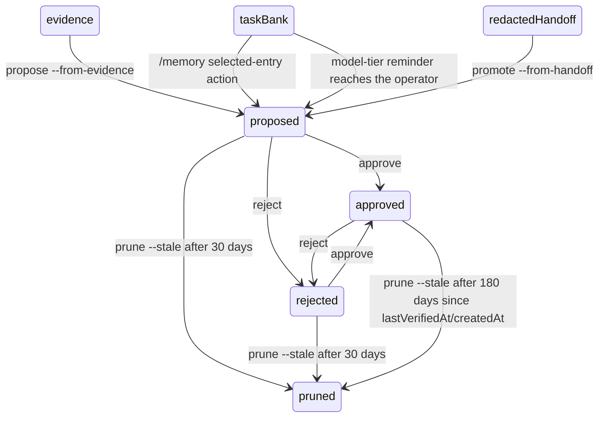

# Evidence Corpus and Long-Term Memory

The [proactive memory guide](../guide/proactive-memory.md) explains when memory is offered and restored.

Clio Coder treats run claims and agent lessons as structured artifacts to support reproducibility and scientific provenance. Evidence corpora are deterministic directories built from run ledgers, receipts, sessions, and audits. Forensic evidence auto-builds on dispatch run completion: when a run finalizes, the observability domain compiles the evidence bundle under `<dataDir>/evidence/run-<id>/` and updates a compact sidecar index row in `<stateDir>/evidence-index.json`. Long-term memory records are local and evidence-linked, and a record reaches the prompt only after explicit approval. Proactive task memory is a separate tier that runs by default on session task banks, and its model-tier reminders only propose unapproved records. Use the TUI [`/view`](observability.md) command for interactive inspection of receipts, dispatch output, durable tool output, compaction summaries, and session accountability before building or citing evidence.

Source of truth: `src/domains/evidence/`, `src/domains/memory/`, `src/domains/evolution/`, [evidence.ts](../../src/cli/evidence.ts), [memory.ts](../../src/cli/memory.ts), and [evolve.ts](../../src/cli/evolve.ts).

---

## Evidence CLI

```bash
clio-coder evidence build --run <runId>
clio-coder evidence build --session <sessionId>
clio-coder evidence inspect <evidenceId> [--json]
clio-coder evidence list
clio-coder evidence inventory --json
```

| Command | Behavior |
| --- | --- |
| `build --run <id>` or `build --session <id>` | Writes one bundle and prints `wrote <evidenceId> <directory>`. Exactly one of the two flags is required. Exit 1 when a `receipt-integrity` finding is present (the bundle is still written); a `receipt-retired` finding prints a note and exits 0. |
| `inspect <evidenceId>` | Prints the evidence ID, source, generation time, run, receipt and tool-call totals, tags, finding count, one `trust <runId>:` summary and axis line per run, a `provenance <runId>:` block per run whose seal verified, and the file list. |
| `inspect <evidenceId> --json` | Prints a bounded record of at most 16 runs: each run's verdict tier and canonical axis states, with no task text, paths or finding prose. A bundle without `trust-status.json` reports `canonical: false`. |
| `list` | Prints `N evidence artifacts`, then one row per bundle: ID, source, run count and tags. Incomplete directories are skipped. |
| `inventory --json` | Prints the newest 12 bundles as a fixed projection (tags, totals, redaction count, the worst run verdict, up to 8 run IDs) with no task text and no working directories. It accepts no other argument. |

`inspect` and `inventory` are the two fixed reads the [graphical application](../guide/gui.md) invokes. Exit codes are 0 on success, 1 for a runtime failure, and 2 for a usage error or an invalid ID (usage text goes to stderr). `clio-coder evidence inspect <id>` requires a valid evidence artifact ID. If the requested artifact does not exist on disk, it exits with code 1 and prints the error and remedy on separate lines:

```text
error: evidence artifact not found: <id>
  run `clio-coder evidence list` to see local bundles
```

Evidence IDs are deterministic:

| Source | ID shape |
| --- | --- |
| Run | `run-<runId>` |
| Session | `session-<sessionId>` |

Rebuilding the same evidence ID rewrites the same directory under `<dataDir>/evidence/`. Nothing prunes evidence bundles. They accumulate until you remove them by hand, run `clio-coder reset --data` (which also removes memory and vendored tools), or uninstall.

### Automatic build and the evidence index

On `dispatch.completed` and `dispatch.failed`, `src/domains/observability/extension.ts` builds the run's bundle in the background. A failure before admission has no run ledger and builds nothing. A failure is logged as `[clio-coder:evidence] auto-build failed for run <id>` and never fails the run. Each build merges one row, keyed by run ID, into `<stateDir>/evidence-index.json`, a ring of at most 1,000 rows (`src/domains/observability/evidence-index.ts`). A row holds `runId`, `evidenceId`, `tags`, `firstPassSuccess`, `findingCount`, `succeeded`, `completionEvidenceWarning`, `ungroundedClaims` and `generatedAt`. `firstPassSuccess` is true only when the run succeeded on lineage attempt 0 and the bundle carries no `no-validation` tag. The accountability read model and `clio-coder usage report` read the index instead of rebuilding bundles.

### Redaction at the bundle boundary

Secret-shaped values are replaced with `[redacted:<kind>]` across the envelopes, receipts, tool-event previews and the rendered transcript when a bundle is built. `overview.json` records the replacement count as `redactionCount`. Raw session files under `<stateDir>/sessions/` are not touched.

### Secret-shaped value patterns

[redact.ts](../../src/domains/evidence/redact.ts) holds the ordered pattern list for secret-shaped values matched on content. The bundle builder, the trace mirror, memory promotion and handoff, tool-result summaries, the `consult` tool and the System One state scrubber all call it. A match becomes `[redacted:<kind>]` and is counted in the caller's tally. Display-time redaction of tool-call arguments, as the transcript renderer and the workers dashboard apply, is a separate rule set in [redaction.ts](../../src/domains/safety/redaction.ts).

| Kind | Matches |
| --- | --- |
| `pem` | A `-----BEGIN ... PRIVATE KEY-----` block through its `END` line, or to the end of the text when the block is unterminated. |
| `aws-access-key` | `AKIA` followed by 16 uppercase letters or digits. |
| `github-token` | `ghp_`, `gho_`, `ghu_`, `ghs_` or `ghr_` followed by 20 or more alphanumerics, and `github_pat_` followed by 20 or more word characters. |
| `sk-key` | `sk-`, an optional hyphen-terminated segment of 2 to 20 characters, then 16 or more of `[A-Za-z0-9_-]`. |
| `slack-token` | `xoxb-`, `xoxp-`, `xoxa-`, `xoxr-` or `xoxs-` followed by 8 or more characters. |
| `google-api-key` | `AIza` followed by 30 or more characters. |
| `jwt` | Three dot-separated base64url segments, the first starting `eyJ`. |
| `assignment` | A secret-flavored key and its value, described below. Only the value is replaced; the key and separator stay. |

The `assignment` pattern reads `key=value`, `key: value` and `"key": "value"` shapes. The key is any name containing `api_key`, `api-key`, `apikey`, `secret`, `token`, `passwd`, `password` or `credential`, case-insensitive. The value is a run of 8 or more characters that are not whitespace, quotes, backticks or any of `; , & | < >`. A value that opens a call is code, not a credential, and is left alone: an identifier of letters, digits, underscores and dots, then `(`, then whitespace, a quote, `{`, `[`, `)` or the end of the text. `BASE_TOKENS = frozenset({` and `token = getToken()` therefore stay readable. A call with a real argument still reads as a value, so `password=Summer2024(!)` becomes `password=[redacted:assignment]`.

`redactSecretsDeep` walks plain objects and arrays and redacts string values with the same patterns. It does not see property names. The trace mirror serializes payloads through `secretRedactingReplacer`, which redacts each string leaf before escaping and also treats a string under a secret-flavored property name as an assignment value; see [Bounds and redaction](trace-store.md#bounds-and-redaction).

---

## Evidence directory layout

Run and session evidence files:

```text
<dataDir>/evidence/<evidenceId>/
├── overview.json
├── transcript.md
├── tool-events.jsonl
├── receipt.json
├── gate-decisions.json
├── trust-status.json
├── findings.json
└── findings.md
```

Readers open the named core files above. Bundles built by older releases may hold extra trace or audit copies; those files are not required to read a bundle.

### Core files

| File | Purpose |
| --- | --- |
| `overview.json` | Stable summary (`version: 1`): source, runs, sessions, statuses, tasks, models, totals, tags, redaction count, resolved decisions and file list. |
| `transcript.md` | Human-readable run or session transcript. A skill activation names its owning plugin (`owner=<id>@<version> digest=<digest>`) when a plugin supplied the skill. |
| `tool-events.jsonl` | Tool summaries from session entries, audit rows, or receipts. |
| `receipt.json` | Receipt bundle (`{ version: 1, receipts: [...] }`); only receipts that pass integrity verification contribute verified fields. |
| `gate-decisions.json` | Integrity-verified review verdicts, compete winner selections, and winner confirmations discovered from linked receipt ids. |
| `trust-status.json` | Canonical per-run five-axis trust projections derived from authenticated receipts, gate decisions, and grounded validation artifacts. A bundle without it reads as `projection: historical_format`. |
| `findings.json` / `findings.md` | Structured findings plus a readable report that begins with each linked run's canonical tier, fixed-order summary, and five axes. |

### Run attribution under concurrency

Session ledger entries are attributed to a run by the run id the producer stamped on the entry at write time. Rows built from those entries carry that provenance in a `runLink` field (`{ kind, confidence, candidateRunIds? }`) in `tool-events.jsonl`; a write-time stamp is `kind: "entry-run-id"`, `confidence: "exact"`. Entries written without run context fall back to timestamp windowing, labeled `kind: "timestamp-window"`, `confidence: "best-effort"`, and printed as `link=timestamp-window` in the transcript. Concurrent dispatch runs share one clock and their windows overlap, so an entry inside more than one window has no owner the bundle can name. Such an entry is reported in the bundle of every run it may belong to, with `runId: null`, `kind: "ambiguous-timestamp-window"`, and a `candidateRunIds` list, plus a `best-effort-link` finding counting them. An entry inside no window carries `kind: "no-run-window"`. It is never dropped and never claimed as exact.

When a run was chained (pipeline), composed with a persona override, or escalated for a permission, `transcript.md` surfaces the receipt's provenance field sets, and `clio-coder evidence inspect` prints them as a `provenance <runId>:` block. The block is printed only for a run whose seal the projection verified; a run whose seal was rejected or retired gets no block. The field paths, types, and stability labels are documented in the [receipt provenance schema](observability.md#receipt-fields-for-dispatch-provenance).

### Task and decision provenance

Session evidence retains the two operator-facing bookkeeping ledgers instead of flattening them into prose. A `taskLedger` projection names the stable board id, goal counts, active runs, required evidence, and bounded task rows with status, origin, `userTaskId`, reason, and evidence. This keeps an operator task traceable from the project inbox correlation through agent pickup and completion. A `decisionLedger` projection names the active-path anchor, interview identity and status, timing, round count, summary, and every settled or superseded decision. Operator revisions are explicit through `revisedAt`, `revisionSource=operator`, and the recorded correction text. Both kinds remain session facts in the readable transcript; evidence does not reinterpret them as validation results. Authenticated receipt `decisionRefs` link runs to recorded arguments on the session's active path, with resolved records in `overview.json` and resolved or missing-reference findings in both readable evidence documents. Wiki page writers receive up to twelve active decisions matching their source paths or symbols and cite those refs in the body and optional `decisions` frontmatter instead of inferring rationale.

### Sealed receipt facts

`src/domains/dispatch/receipt-facts.ts` reads a sealed receipt back, authenticates it against its ledger row, and projects the compact terminal facts that the TUI worker block, the exit summary and ACP terminal fleet frames report; the receipt contract is in [observability.md](observability.md).

---

## Evidence Tag Taxonomy and Failure Causes

Clio Coder classifies every run and session record using a closed set of 29 canonical tags (`EVIDENCE_TAGS` in `src/domains/evidence/types.ts`). These tags distinguish general execution characteristics, such as lineage linkages, from actual failure causes.

### Complete Taxonomy

| Tag | Category | Trigger / Meaning |
| --- | --- | --- |
| `audit-linked` | Provenance | Audit logs successfully linked to this run or session. |
| `audit-missing` | Provenance | No matching audit logs were found. |
| `best-effort-link` | Provenance | Inspection commands or logs linked via heuristics. |
| `timeout` | Failure | Execution exceeded the maximum duration limit. |
| `context-overflow` | Constraint | Model context limit was exceeded. |
| `provider-transient` | Transient | Temporary API or model gateway connection error. |
| `missing-dependency`| Failure | Python, Node, or system package dependency was missing. |
| `wrong-runtime` | Configuration | Execution failed due to incorrect compiler or runtime environment. |
| `proxy-validation` | Validation | Weak validation (e.g. only file-presence check rather than execution). |
| `no-validation` | Validation | Succeeded turn or run did not execute any verification commands. |
| `destructive-cleanup`| Precaution | Clean-up rules triggered to prevent workspace pollution or damage. |
| `blocked-tool` | Failure | The safety net blocked a tool call requested by the model. |
| `escalation` | Precaution | A worker permission escalation timed out or was denied; see the receipt provenance schema below. |
| `receipt-integrity` | Security | Forensic verification detected receipt modification or checksum mismatch. |
| `receipt-retired` | Provenance | The receipt was sealed under an integrity version this build no longer verifies. It is not migrated and not read as evidence; the row names both versions. An info row, never the security warning a modified receipt gets. |
| `protected-artifact`| Precaution | Mutating a path protected by project or system safety policies. |
| `tool-loop` | Constraint | The model repeatedly called the same tool with identical arguments. |
| `test-failure` | Failure | A verification command containing test/lint keywords exited non-zero. |
| `build-failure` | Failure | A verification command containing build keywords exited non-zero. |
| `cwd-missing` | Configuration | The directory target specified for execution did not exist. |
| `session-linked` | Provenance | The run is linked back to its originating parent session. |
| `session-missing` | Provenance | No parent session could be resolved for this run. |
| `auth-failure` | Failure | Missing or invalid credentials/API keys. |
| `external-bypass` | Security | An external runner bypassed standard safety gates. |
| `external-approximation` | Historical | Older evidence bundles may contain this finding. Current builds do not emit it. |
| `independent-review` | Validation | The canonical independent-review axis: a failed, correlated, or inconclusive review is a warning; a successful run with no review at all is an info row saying its result rests on its own receipt. |
| `context-provenance` | Provenance | The canonical context-provenance axis read `invalid`: the receipt's briefing or project-context record contradicts itself. |
| `completion-evidence` | Validation | The canonical completion-evidence axis: a mutation that finished without validation evidence at the completion boundary is a warning; an explicit limitation is an info row. |
| `unknown` | Undefined | Unclassified execution failure. |

---

### Failure-Cause Tag Subset

A subset of the taxonomy represents actual failure causes (governed by the `FAILURE_CAUSE_TAG_ORDER` array). These are the only tags included in the receipt summaries and TUI observability histograms:

1. **`timeout`**: Triggered if the run outcome is `"timed_out"` or `"stalled"`, or if the error/failure text contains `"timed out"` or `"timeout"`.
2. **`auth-failure`**: Triggered if failure text contains keywords like `"auth"`, `"api key"`, `"credential"`, or `"unauthorized"`.
3. **`missing-dependency`**: Triggered if failure logs contain `"module not found"`, `"missing package"`, or `"missing dependency"`.
4. **`build-failure`**: Triggered in receipt summaries when a non-zero receipt exit is paired with build tool names in `toolStats` (e.g. `build`, `compile`, `make`, `cmake`, `cargo`, `gradle`, `ninja`, `tsc`). Forensic evidence may also classify it from termination diagnostics in `outcomeDetail` or the recorded failure message. The task text is never causal evidence.
5. **`test-failure`**: Triggered in receipt summaries when a non-zero receipt exit is paired with test or lint tool names in `toolStats` (e.g. `pytest`, `ctest`, `jest`, `vitest`, `test`, `lint`, `typecheck`). Forensic evidence may also classify it from termination diagnostics in `outcomeDetail` or the recorded failure message. Validation words in the task text are never causal evidence.
6. **`blocked-tool`**: Triggered if tool execution statistics show a blocked count greater than `0`.

---

## Receipt findingsSummary

Each run receipt (persisted under `<stateDir>/receipts/<runId>.json`) carries an optional `findingsSummary` block. This block provides a cheap, integrity-covered summary of the run's findings:

```json
"findingsSummary": {
  "tags": ["test-failure"],
  "firstPassSuccess": false,
  "findingCount": 1
}
```

### Computation and Lifecycle
- **Circular Dependency Prevention**: To prevent circular dependencies, `findingsSummary` is calculated **cheaply in-memory** at receipt-record time using the draft envelope and tool statistics (in [receipt-findings.ts](../../src/domains/dispatch/receipt-findings.ts)). It never reads from disk or calls `buildEvidence`.
- **First-Pass Success**: Calculated as `true` only if the terminal outcome was `"succeeded"`, the lineage attempt was `0` (no dispatch retries), the tool stats confirm at least one successful validation tool was executed, and no failure-cause tags were detected. The evidence index computes its own `firstPassSuccess` from the full bundle, and that value is the authority for accountability rates.
- **Cryptographic Coverage**: Current receipts use strict v20 and authenticate every current receipt field, including dispatch intent path provenance, resolved path scope, briefing and steering provenance, routing intent and decision, route quality, worker identity, execution role, result-contract conformance, council provenance, and fleet gate provenance, against the reconstructed ledger. Only v20 is authenticated as current evidence. Lower versions are reported as retired and are neither migrated nor read as evidence.

| Version | Verification policy | Compatibility policy |
|---|---|---|
| v20 | Current canonical projection; every current receipt and reconstructible ledger field is authenticated | Accepted |
| v1 through v19 | Historical sealed shape unsupported by this build | Reported as retired; not migrated and not read as evidence |
| Malformed, unversioned, or future version | No current reader | Invalid; archive incompatible state rather than expecting migration |

Receipt integrity and evidence verification answer different questions. The
former proves that a receipt matches its ledger envelope; the latter records
whether applicable validation evidence was observed. Briefing provenance is
also distinct from bounded project-context provenance: both can be absent or
present independently, and neither hash is evidence for the other.

### Canonical trust status

[trust-status.ts](../../src/domains/evidence/trust-status.ts) defines the version 1 canonical trust
status. It is a five-axis algebra, not an overall trust verdict, confidence
percentage, or pass/fail score. Consumers project only the axes needed for a
decision and preserve every other axis unchanged.

| Axis | Closed states | Question answered |
|---|---|---|
| Artifact integrity | `verified`, `failed`, `absent`, `unknown`, `not_applicable` | Did the integrity verifier authenticate the referenced artifact? |
| Validation grounding | `validated`, `failed`, `ungrounded`, `absent`, `unknown`, `not_applicable` | What correctness-bearing validation was observed and grounded? |
| Independent review | `passed`, `failed`, `inconclusive`, `not_independent`, `absent`, `unknown`, `not_applicable` | What outcome did an authenticated independent reviewer or judge record? |
| Context provenance | `recorded`, `invalid`, `absent`, `unknown`, `not_applicable` | Is the origin of briefing, project context, or linked evidence recorded consistently? |
| Completion evidence | `evidenced`, `incomplete`, `limited`, `absent`, `unknown`, `not_applicable` | What did the finish contract observe at the completion boundary? |

`absent` means no fact was recorded and carries a reason but no invented
attribution. `unknown` means a named source exists but cannot establish the
answer. `not_applicable` means a named authority determined that the axis does
not apply. Every non-absent state names both its source and its authority.
Sources may retain up to 16 typed artifact references. References contain an
artifact kind, identifier, and optional SHA-256 digest; they never embed the
artifact body. Normalization sorts the references and rejects duplicates,
unbounded lists, unknown fields within an axis, invalid identifiers, and
sources that are not permitted to speak for an axis. Unknown top-level axes
from older evidence files are ignored.

The composition rules prohibit cross-axis promotion:

- Verified artifact integrity never promotes validation grounding.
- Recorded context provenance never promotes validation or correctness.
- A passing review never establishes authorship or context origin.
- A completion self-report never promotes validation grounding. The linked
  `completion_contract` audit row is the run's own report of what it did, so it
  reaches completion evidence and no other axis. Validation grounding is filled
  only by independently observed executions the session ledger recorded.

#### Validation grounding precedence

For an authenticated receipt, `adaptRunReceiptValidationStatus` reads the first rule that applies:

1. No receipt: `absent` with `artifact_missing`.
2. Host verification `rejected`: `failed` by `host-verification`. When every failing host check also failed on the task base, the change did not cause the failure, so the state is `unknown` by `host-verification-baseline-failed` and the human clause reads `check also failed on task base; change validation unknown`.
3. Host verification `verified`: `validated` by `host-verification`. Host verification `not_implicated` (a batch member the failure was charged away from): `unknown` by `host-verification`.
4. Receipt quality carries a failed typed validation or a failing result contract: `failed` by `receipt-quality`.
5. Command grounding: the receipt's `validationGrounding.basis` is `no-command-executed` and it claims more than it grounded, or lists ungrounded claims: `ungrounded` by `command-grounding`. A report that names the typed `verify` tool is grounded by the successful `verify` tool result the run recorded, not by a shell command.
6. A passed typed validation or a passing result contract: `validated` by `receipt-quality`.
7. The receipt's `verification` block: `verified` is `validated` by the recorded basis, `unverified` is `absent` with `not_observed`, and `unknown` or `not_applicable` carry through.
8. Otherwise `unknown` through the compatibility source.

The current adapters apply the following persisted-format compatibility rules.
They do not mutate receipt, gate-decision, evidence-bundle, or session formats.

| Existing persisted fact | Canonical mapping |
|---|---|
| Missing receipt | Every receipt-owned axis is `absent` with `artifact_missing`. |
| Current receipt present but integrity not checked | Artifact integrity is `unknown`; the receipt's own digest never authenticates itself. The other receipt-owned axes are `absent` with `not_observed` until authentication succeeds. |
| Historical receipt missing its integrity block | Receipt-owned axes are `unknown` through the compatibility source, even if a caller presents a contradictory positive verification result. |
| Integrity verification succeeds or fails | Artifact integrity is `verified` or `failed`. A failure leaves the receipt-owned validation grounding and context provenance `absent`; no untrusted receipt claim contributes a positive state. Validation the session ledger observed on its own (a validation command that ran and exited 0) still grounds the run, so a tampered run can read `artifactIntegrity: failed` beside `validationGrounding: validated`. The two axes name different artifacts and different authorities, and the bundle's `receipt-integrity` finding is what flags the pairing. |
| Receipt sealed under a retired integrity version | Artifact integrity is `unknown` through the compatibility source `run_receipt:<runId>:integrity-v<N>-retired`, which is where the human clause reads the version back from (`seal v19 retired (this build verifies v20)`); `failed` and "seal broken" are reserved for a seal this build checked and rejected. The receipt-owned axes are `absent` with `historical_format`, and the verdict is `unknown` rather than `compromised`. The receipt is not migrated and not read as evidence: the bundle records a `receipt-retired` info finding, `evidence build` prints it as a note and exits 0, and `/view verify` reports `not checked` with both versions. |
| Receipt `verification.state: verified` | Validation grounding is `validated` unless a stronger typed failure or ungrounded claim is present. |
| Receipt `verification.state: unverified` | Validation grounding is `absent` with `not_observed`; lack of a validation tool is not a failed validation. |
| Receipt verification `unknown` or `not_applicable` | Validation grounding preserves `unknown` or `not_applicable`. A missing historical verification field maps to `unknown`. |
| Typed receipt validation or result-contract quality | A passing correctness-bearing fact maps to `validated`; a failing fact maps to `failed`; an ungrounded passing claim maps to `ungrounded`. |
| Valid bounded project context, valid none-tier workspace-root record, or valid briefing hash | Context provenance is `recorded`. A `none`-tier run still receives the workspace-root message, so a none-tier block naming exactly `workspace-root` with a well-formed count and hash is `recorded`. Explicit project-context tier `none` with no content and no briefing is `not_applicable`; a missing historical field is `unknown`; a contradictory block (a handbook section under a none policy, a hash with no section, a malformed count) is `invalid`. |
| Gate decision | An authenticated independent pass or fail maps to `passed` or `failed`; for a compete `winner` outcome the winning subject maps to `passed` and every other subject to `failed`. Correlated review maps to `not_independent`. A decision with no decider or correlation record is `inconclusive`. Unauthenticated artifacts map to `unknown`; operator confirmation or yolo authority alone is `not_applicable` to independent review. |
| Older receipt with `autonomyEnforcement` | Its integrity seal still verifies when the historical field was covered by the digest. Readers ignore the field and project five trust axes. |
| Finish-contract assessment | The assessment is an audit row linked to the run and counted in `totals.auditRows`. It does not override the receipt-derived `completionEvidence` axis on the evidence surface alone. |
| Malformed audit row identifier | A blank or whitespace-only optional identifier remains linked as audit input and never aborts the bundle. It cannot affect the receipt-derived trust projection. |
| Bundle without `trust-status.json` | Inspection reports `projection: historical_format` with no canonical run projections. It never reconstructs positive states from older summary tags. |

Receipt inspection, worker output, monitor details, and evidence rebuilding all
use the same authenticated receipt projection boundary. Evidence rebuilding
then composes independently authenticated gate decisions without changing
receipt-owned axes. Findings such as
`no-validation`, `proxy-validation`, `external-bypass`,
`independent-review`, `context-provenance`, and `completion-evidence`
are selected from authenticated receipt facts and canonical states. `findings.md`
prints the tier, summary, and every axis before those diagnostic records, while
their detailed domain artifacts remain in the receipt, gate, audit, and trace
files.

The canonical aggregate is an additive projection for downstream work. Evidence
bundles remain version 1 and gate decisions remain version 2. Receipt integrity
is independently versioned and currently uses v20; that version adds dispatch
intent path provenance and resolved path scope while retaining SHA-256 sealing.

### Trust projection

[trust-projection.ts](../../src/domains/evidence/trust-projection.ts) is the one place the canonical
status is turned into words. Every operator surface prints from it, so the
same canonical input renders the same verdict on the dispatch run line, in a
monitor block, under `clio-coder evidence inspect`, in `findings.md`, on the
Fleet Runs board, in the `/view` receipt header, and on the ACP wire.

The compact human body has five fixed clauses in a fixed order and answers the
four operator questions without receipt internals. `evidence inspect` prints it
after `trust <runId>:`, `findings.md` prints it after `summary:`, and the
dispatch tool quotes it as `trust="..."`:

```text
sealed; grounded by host-verification; not independently reviewed; context recorded; completion evidenced
```

Receipt-facing headers (the `/view` receipt header and `clio-coder fleet view`)
add the verdict tier under one versioned label:

```text
trust v1: grounded; sealed; grounded by host-verification; not independently reviewed; context recorded; completion evidenced
```

| Clause | Axis | Question it answers |
|---|---|---|
| `sealed` / `seal broken` / `seal unchecked` / `no receipt` | Artifact integrity | Can the record be trusted to be what was written? |
| `grounded by <claimant>` / `validation failed by <claimant>` / `inferred: validation claimed, none observed` / `no validation observed` / `validation unknown (<system>)` / `validation not applicable` | Validation grounding | Who claims the result, and what was observed? |
| `independently reviewed: pass` / `independently reviewed: fail` / `independent review inconclusive` / `review not independent` / `not independently reviewed` | Independent review | What did a second, uncorrelated authority check? |
| `context recorded` / `context record invalid` / `context not recorded` | Context provenance | Is what the worker was given recorded consistently? |
| `completion evidenced` / `completion unevidenced` / `completion limited` / `completion not applicable` | Completion evidence | What did the finish contract observe? |

`inferred` is the word for an `ungrounded` claim. A failure that comes from
receipt quality reads `recorded validation failed` and no claimant. Every
`unknown` and `absent` state prints as such, so what remains unknown is
part of the line, never an omission.

The drill-down line prints every axis by its canonical state id and is the
same on every text surface:

```text
trust_status=v1 artifactIntegrity:verified validationGrounding:validated independentReview:absent contextProvenance:recorded completionEvidence:evidenced
```

The machine projection (`TrustSummaryProjection`, `trust` on the `dispatch`
tool's `details.runs[]` entries and on the `monitor` receipt details) is
bounded and versioned (`TRUST_SUMMARY_VERSION = 1`): the verdict tier, the five
axis states, the claimant, the axes still unknown, the compact text, and up to 8
`<kind>:<id>` references into the detailed artifacts. It is flat by design so a
depth-capped wire such as ACP `rawOutput` carries it whole where the nested
canonical status's artifact references fall off the depth cap.

The verdict tier styles a surface and never scores a run. `reviewed` is the
only tier styled as independently verified; a sealed receipt with observed
validation is `grounded`, a sealed receipt with nothing observed is
`unverified`, a broken seal, failed or inferred validation,
failed or correlated review, or contradictory context record is
`compromised`, and an unchecked or missing seal is `unknown`. Human receipt summaries name the failed axis instead of printing `compromised`; the machine verdict tier is unchanged. The Fleet Runs board
never carries a verdict on the terminal bus event: the event is published the
moment the receipt is sealed, before anything has read it back and
authenticated it against the ledger row, so the board reads the receipt file
back and projects that authenticated status, and shows `trust: receipt not
read back` until it can.

### Mutation-report grounding

A `mutation-report` result lists `mutatedPaths` and `validations`. The validator measures the report against what the run's own tool calls did (`ObservedRunEffects`, recorded by `src/domains/safety/run-effects.ts`) instead of believing it:

- A reported path the run wrote through a successful tool call is accepted.
- A reported path whose only write attempt was refused or errored fails conformance, and route quality is sealed `unmeasured`.
- A reported path the run never wrote but that exists on disk is accepted as unverified: route quality cannot reach `pass` and stays `unmeasured`.
- A reported path the run never wrote and that does not exist fails conformance, with route quality `unmeasured`.
- A reported failing validation, or an observed failing command with no later pass, seals `fail`.
- `pass` requires at least one reported validation, every path observed, and at least one validation command the run executed to a clean exit.

The source is `validateMutation` in `src/domains/agents/result-contract.ts`.

---

## Change manifests and `clio-coder evolve`

A change manifest is a typed JSON record of one proposed harness change, linked to the evidence that justifies it (`src/domains/evolution/`). The command is also reachable as `clio-coder dev evolve`.

```bash
clio-coder evolve manifest init
clio-coder evolve manifest validate <path>
clio-coder evolve manifest summarize <path>
```

`init` prints a template (`version: 1`, `iterationId: exploratory-1`, one change) to stdout and exits 0. `validate` and `summarize` load the JSON, resolve every non-empty `evidenceRef` against the local evidence store, and exit 1 on an invalid manifest, an unreadable file or invalid JSON. `summarize` prints the iteration, base SHA, change count, authority levels, components, files changed, predicted regressions and validation-step count. A usage error exits 2. When the evidence store cannot be read, every non-empty ref fails as not found.

| Field | Rule |
| --- | --- |
| `version` | Must equal `1` (`CHANGE_MANIFEST_VERSION`). |
| `iterationId`, `baseGitSha`, `createdAt` | Non-empty strings. |
| `changes[].id`, `rootCause`, `targetedFix`, `rollbackPlan` | Non-empty strings. |
| `changes[].componentIds`, `filesChanged` | String arrays; at least one of the two must be non-empty. |
| `changes[].authorityLevel` | One of `prompt`, `tool-description`, `tool-implementation`, `middleware`, `memory`, `runtime`, `safety`, `schema`, `cli`. |
| `changes[].predictedRegressions` | Must hold an entry when the authority level is high: `tool-implementation`, `middleware`, `runtime`, `safety`, `schema` or `cli`. |
| `changes[].evidenceRefs` | Empty only for the iteration `exploratory-1`. Each ref must be a `run-<id>` or `session-<id>` bundle ID that exists in `<dataDir>/evidence/`. |
| `changes[].predictedFixes`, `validationPlan` | String arrays. |
| `changes[].expectedBudgetImpact` | Optional; `risk` is `lower`, `same` or `higher`, with optional finite `tokenDelta` and `wallTimeDeltaMs`. |

Nothing enforces a manifest at edit time. The self-edit gate that would require a validated manifest before Clio Coder edits its own high-authority paths is designed but not built; `src/domains/evolution/SELF_EDIT_GATE.md` records why it is deferred.

---

## Memory CLI

```bash
clio-coder memory list
clio-coder memory propose --from-evidence <evidenceId> [scope options]
clio-coder memory promote --from-handoff <path> [--entry <id>...] --scope <scope> [scope options]
clio-coder memory approve <memoryId>
clio-coder memory reject <memoryId>
clio-coder memory prune --stale
```

Memory records live in:

```text
<dataDir>/memory/records.json
```

The store is a JSON object `{ "version": 1, "records": [...] }` (`MEMORY_VERSION`), capped at `500` records and sorted by scope, key, creation time, and id for stable writes. A write that would pass the cap fails with `memory store limit reached (500); run clio-coder memory prune --stale`. A store file that fails validation makes every memory command and the prompt reader fail with `memory store invalid`, listing each issue path.

| Command | Behavior |
| --- | --- |
| `list` | Prints the record count, then per record: ID, status (`proposed`, `approved`, `rejected`), scope, confidence, evidence refs, key and lesson. |
| `propose` | Builds one unapproved record from an evidence bundle and prints it with a `review:` hint. A repeated proposal for the same evidence and scope returns the existing record. |
| `promote` | Builds unapproved records from a version 2 handoff snapshot. |
| `approve <id>` | Sets `approved`, stamps `lastVerifiedAt` with the current time and clears `rejectedAt`. Approving an approved record refreshes `lastVerifiedAt`. |
| `reject <id>` | Clears `approved` and stamps `rejectedAt`. |
| `prune --stale` | Deletes stale records and prints the count; see [Retention and pruning](#retention-and-pruning). |

Usage errors exit 2 with the usage text on stderr; every other failure exits 1.

### Memory record schema

| Field | Meaning |
| --- | --- |
| `id` | `mem-` followed by 16 lowercase hex characters, derived from the source so a retried proposal finds the existing record. |
| `scope` | One of `global`, `repo`, `language`, `runtime`, `agent`, `task-family`, `hpc-domain`. |
| `key` | A stable key such as `evidence:<evidenceId>` or `promotion:<sourceKind>:<sessionId>:<entryId>`. |
| `lesson`, `appliesWhen`, `avoidWhen` | The lesson text and the conditions around it. Evidence proposals truncate the lesson to 240 characters. |
| `evidenceRefs` | At least one reference. Required for prompt injection. |
| `confidence` | A number from 0 to 1. Evidence proposals score 0.45 to 0.70; promotions start at 0.6. |
| `createdAt`, `lastVerifiedAt`, `rejectedAt`, `approved`, `regressions` | Lifecycle fields. An approved record must not carry `rejectedAt`. A non-empty `regressions` list suppresses injection. |
| `repository`, `runtime`, `agent` | Structured applicability identities, required for the matching scope and invalid for any other. |
| `provenance` | Source kind (`evidence`, `task-bank-entry` or `handoff-snapshot`), source session and entry, and the redaction facts. |

Only `global`, `repo`, `runtime` and `agent` records can be created by the CLI, the `/memory` overlay or the automatic proposal. The other three scopes validate, but no selection path reads them, so they are never injected.

---

## Memory record lifecycle



Records must cite at least one evidence ID to be considered for prompt injection. Rejected records remain in the store until stale pruning so the same bad lesson is not immediately re-proposed from the same evidence.

### Retention and pruning

`memory prune --stale` is the only deletion path. A record is stale when the time since `lastVerifiedAt` (or `createdAt` when it was never verified) exceeds 30 days for an unapproved record, proposed or rejected, or 180 days for an approved record. A record whose reference timestamp does not parse is stale. Re-approving a record restarts its clock. Nothing prunes automatically and nothing decays a record's confidence; prompt priority is the reference timestamp, newest first.

Task-bank promotion is a reviewed export from transient execution memory. The
`/memory` overlay offers repo and global proposal actions only on selected
knowledge and procedural rows. Status remains private and cannot enter the
promotion service. The first global action arms a warning, and the second
action acknowledges the broader applicability. A successful action writes an
unapproved record and names the separate `memory approve` command required to
make it injectable.

A model-tier reminder that reaches the operator also proposes the entries it cited, automatically, as repository-scoped unapproved records. Those cite `session:<sessionId>`; a record promoted from the overlay or a handoff cites `session-<sessionId>`, the ID shape of the session evidence bundle. See [Where what the tier writes ends up](../guide/proactive-memory.md#where-what-the-tier-writes-ends-up). The model tier runs on the active chat route unless `context.memory.target` and `context.memory.model` name a dedicated route, so these reminders and proposals need no extra configuration. `context.memory.enabled: false` stops them.

The CLI consumes a version 2 `clio-coder-task-memory` handoff snapshot of at most
1,000,000 bytes. Omitting `--entry` proposes every knowledge and procedural
entry; repeating `--entry` selects exact entry IDs. Version 2 snapshots carry
source session, evidence, runtime, agent, timestamps, and export-redaction facts.
Version 1 snapshots (and the older `clio-task-memory` fence language written by
earlier builds) remain seedable but cannot be promoted because they do not carry
source session or evidence provenance.

Every promotion redacts secret-shaped values before `records.json` is written.
The durable provenance block records the source kind, session, selected entry,
entry class and timestamps, plus the replacement count and source field paths.
Promotion never approves its own output.

### Explicit scope selection

Reviewed scope options are closed to four choices:

| Scope | Required selection | Validation |
| --- | --- | --- |
| `repo` | `--repository <canonical-absolute-path>` | The path must exist and already equal its canonical absolute identity. Symlink aliases and paths containing unresolved segments are rejected. |
| `global` | `--acknowledge-global` | The acknowledgement is separate from `--scope global`. |
| `runtime` | `--runtime <id>` | The ID must be valid and must occur in the source provenance. |
| `agent` | `--agent <id>` | The ID must be valid and must occur in the source provenance. |

The same options may be added to `memory propose --from-evidence`. With no
scope option, evidence proposals infer a scope: `repo` when exactly one recorded
working directory canonicalizes to a usable repository, otherwise `runtime` when
the evidence names a runtime, otherwise `agent`, otherwise `global`. An
explicit repository may differ from the repository that produced the
evidence, which supports a reviewed lesson about repository A learned while
working in repository B. Runtime and agent overrides may only select an exact
identity already recorded by the evidence. Global scope always requires its
own acknowledgement. No inference path widens an explicit choice.

---

## Prompt injection rules

Approved memory reaches the main system prompt as a `# Memory` section that sits after the project-context section and before the runtime block (`SESSION_PROMPT_SECTION_ORDER` in `src/domains/prompts/compiler.ts`). The interactive session builds it through `createMemoryPromptReader` in `src/domains/memory/prompt-cache.ts`; `clio-coder run --agent` builds it once with `buildMemoryPromptSection()` and hands it to the worker as the `dispatch-memory` message.

Defaults:

| Constraint | Default |
| --- | --- |
| Base scopes | `global`, `repo` (`MEMORY_PROMPT_DEFAULT_SCOPES`) |
| Token budget | `400` estimated tokens |
| Max records | `5` |
| Required status | `approved: true` |
| Required provenance | At least one `evidenceRefs[]` entry |
| Suppression | Records with active `regressions[]` entries are skipped |
| Order | `lastVerifiedAt`, or `createdAt` when never verified, newest first, then ID |

Rendered memory lines always cite record ID, scope, lesson, and evidence IDs, and may add `Applies when:` and `Avoid when:` lines. The prompt tells the model not to extrapolate beyond cited findings. A record that would push the section past the token budget or the item limit is skipped.

Interactive main-agent sessions additionally admit `runtime` records for the exact
active runtime. `clio-coder run --agent` admits `runtime` records for the exact resolved
runtime, only when the initial and every fallback route resolve to the same runtime,
and `agent` records for the selected agent. Runtime and agent records use structured identity
fields; `appliesWhen` text cannot grant either applicability. Missing,
malformed, or different active identities exclude those records.

The interactive reader rereads the store at each prepared operator turn, so an approval made in another terminal is visible at the next turn, and keeps the selection frozen for the continuations of that turn. A change of session or branch, data root, repository, or active target, runtime and model also forces a fresh read. A store that cannot be read, is larger than 16 MiB, or holds more than 500 records yields no memory section and revokes the cached one. The [System One](../guide/system-one.md) `relevance` site can reorder eligible records when more are eligible than the section admits; the ranking only reorders, never admits a record, and the first ranking a session applies stays pinned until the approved records or the session's authority change.

### Repository-scoped identity

Repository memory is selected by an exact canonical absolute-path identity. The interactive orchestrator and `clio-coder run --agent` compute that identity from the active working directory; symlink aliases collapse to the same key. A repository move, a different Git worktree path, a subdirectory launch, a malformed identity, or a missing identity does not inherit another repository's memory. Global records are unaffected.

Every `scope: "repo"` record must carry:

```json
"repository": { "kind": "canonical-path", "key": "/canonical/absolute/repository/path" }
```

The structured `repository` field is the only applicability mechanism: store validation rejects repo records without it, and `appliesWhen` tokens never grant repository applicability. There is intentionally no automatic path rewrite for moved repositories or worktrees: a filesystem move produces a different identity and the record simply stops applying until it is re-scoped with new evidence.

Runtime and agent records follow the same fail-closed shape:

```json
{ "runtime": { "kind": "runtime", "key": "openai" } }
```

```json
{ "agent": { "kind": "agent", "key": "coder" } }
```

Only the field matching the record scope is present.

---

## Operator notes in compaction summaries

Operator notes are not a memory store. They are a block at the end of a compaction summary that keeps the operator's explicit requests verbatim, because a summarizing model can drop them. The text given to `/compact <text>` also binds the summarizer through an `<operator-instructions>` block that overrides the default summary scope; the note is the copy that survives when the summarizer ignores it. A summary ends with `<operator-notes encoding="xml">` holding one bullet per note, with `&`, `<` and `>` escaped. A note comes from three places: the instructions given to `/compact <text>`, recorded as `/compact: <text>`; any sentence in the compacted span that starts with `remember`, `please remember`, `keep in mind` or `don't forget`; and the notes block of an earlier summary in the same session. Each note is clipped to 400 characters and the newest 30 are kept. The block is stored inside the `compactionSummary` entry of the session ledger under `<stateDir>/sessions/`, so it persists with the session, comes back with `/resume`, and is read back on the next compaction, where the summarizer's own copy of the block is replaced by the extracted one (`src/domains/session/compaction/compact.ts`). The compaction contract is in [Context continuity and recovery](../guide/context-continuity.md).

---

## Recommended workflow

1. Build evidence from the run or session that taught the lesson.
2. Inspect the evidence and findings.
3. Propose memory from the evidence, or promote selected public task memory from `/memory` or a redacted handoff.
4. Review the proposed lesson, source provenance, redaction facts, and exact scope.
5. Approve only if it is durable and useful under that scope.
6. Reject incorrect or overbroad records.
7. Prune stale records periodically.

Memory is meant to reduce repeated mistakes, not to become an unreviewed second instruction system.

## Convention retention and decisions

Capture conventions as source-grounded knowledge or procedural memory. Propose
an existing bank entry through `/memory` with `p`, or promote a selected record
from a version-2 handoff export. Promotion creates an unapproved proposal;
operator approval admits it to scoped, bounded selection.

Proposal and approval are separate operations. Approval persists the record;
scoped selection and delivery occur at a prepared turn boundary. Delivery
provenance identifies which record reached the session. Memory selection follows
the configured scope and budget.

A no-edit task includes handbooks and other repository files. Review memory
proposals within that scope and obtain authorization for any required writes.

Decision references and commit trailers record attribution. Agents receive the
active decision semantics as guidance for implementation and review. A changed
agent-owned decision requires an explicit same-key revision; operator decisions
remain operator-owned.
