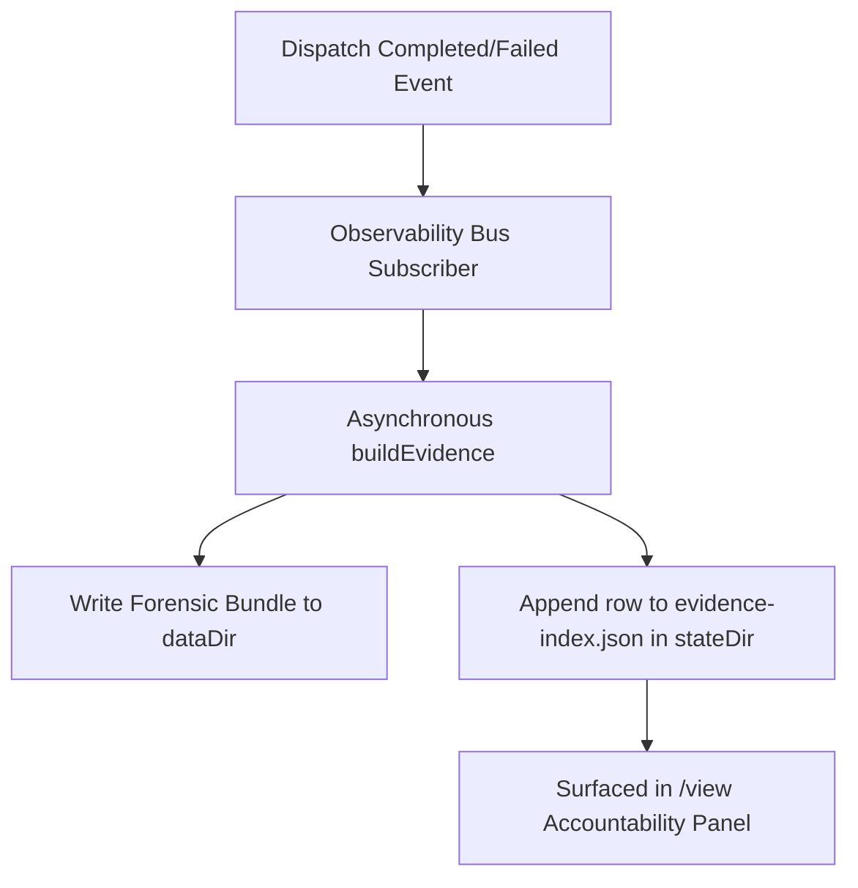

# Observability

Clio records what a session and its workers did in a small set of local, durable files, and exposes them through the `/view` artifact viewer, the `clio-coder` inspection commands, ACP, and the graphical application. Every store below is a local file. No settings key named for telemetry exists. The one outbound read in this area is the subscription quota request each connected provider answers ([Subscription Quota](#subscription-quota)).

| Store | Path | Written by | Read by |
| --- | --- | --- | --- |
| Run ledger | `<stateDir>/runs.json` | dispatch | `/view`, `clio-coder fleet status` and `fleet view` |
| Receipts | `<stateDir>/receipts/<runId>.json` | dispatch, at the terminal event | `/view verify`, `clio-coder fleet verify`, evidence builds, ACP receipt facts |
| Run event journal | `<stateDir>/runs/<runId>/events.ndjson` | dispatch, as events arrive | `clio-coder fleet view`, the workers dashboard. The line kinds and the 2 MiB per-run cap are in [worker-dispatch-mechanics.md](worker-dispatch-mechanics.md). |
| Trace mirror | `<stateDir>/trace.sqlite` | observability domain | `clio-coder trace`, the graphical application. See [Trace Store](trace-store.md). |
| Evidence bundles | `<dataDir>/evidence/<evidenceId>/` | observability domain on terminal dispatch events, `clio-coder evidence build` | `/view`, `clio-coder evidence` |
| Evidence index | `<stateDir>/evidence-index.json` | observability domain | `/view` accountability, `clio-coder usage report` |
| Out-of-turn usage | `<stateDir>/usage/out-of-turn.jsonl` | chat loop | `clio-coder usage report` |
| Session ledgers | `<stateDir>/sessions/<cwdHash>/<sessionId>/current.jsonl` | session domain | `/usage`, `/view`, `usage report`, `doctor` |
| Prompt manifests | `<stateDir>/sessions/<cwdHash>/<sessionId>/prompt-manifest.jsonl` | session domain, at each prompt compile | `/view` |
| Safety audit rows | `<stateDir>/audit/YYYY-MM-DD.jsonl` | safety domain | `/view`, `usage report` |
| Route history | `<stateDir>/route-history.json` | dispatch route observer | route policy and readiness |
| Code-step records | `<stateDir>/code-steps/<rootId>/<runId>.json` | dispatch | `clio-coder trace code-steps` |

---

## The /view artifact viewer

`/view` is the interactive artifact viewer for a Clio session. It keeps the live transcript compact while preserving a full inspection path for durable artifacts, task ledgers, and successful workspace outputs.

```text
/view
/view <id-or-filter>
/view verify <runId>
```

`/view` opens a full-screen split viewer. The left pane groups artifacts by category, newest first within a category, and supports type-to-filter. The right pane renders the selected artifact with pager controls. Below 84 columns of body width the viewer shows one pane at a time. The artifact providers live in [view-artifacts.ts](../../src/domains/session/view-artifacts.ts) in the session domain, and the viewer in [view-overlay.ts](../../src/interactive/view/view-overlay.ts) only renders them. ACP clients read the same providers through `_clio-coder/artifacts/list` and `_clio-coder/artifacts/read`; see [ACP](acp.md). The graphical application's session Artifacts drill-in is one such client ([the GUI guide](../guide/gui.md)).

| Pane | Keys |
| --- | --- |
| List | `Up` and `Down` select. `Left` and `Right` jump to the previous or next non-empty category, wrapping at the ends and honoring the active filter. Typing filters. `Ctrl+U` clears the filter. `Enter`, `Tab`, or `Shift+Tab` moves to the content pane. `Esc` closes the viewer. |
| Content | `Up` and `Down` (or `k` and `j`) scroll by line. `PgUp` and `PgDn` scroll by page, `Ctrl+U` and `Ctrl+D` by half page, `g` and `G` jump to the top and bottom. `n` and `p` move to the next and previous artifact. `Left` and `Right` jump category. `i` toggles the details and provenance view. `v` verifies the selected receipt. `o` shows the absolute backing path through the notice channel, or a warning notice when the artifact has no backing path. `Tab`, `Shift+Tab`, or `Esc` returns to the list. |

The filter splits on whitespace and requires every token to match, case-insensitively, against the artifact id, `category:id`, category, title, description, run id, session id, correlation id, tool name, backing path, and search text. A `<category>:<value>` filter, such as `receipt:abc1234`, restricts the list to that category and selects the artifact whose id matches the value exactly when one does. A bare `transcript`, `task-ledger`, `workspace`, `protected-artifact`, `compaction`, `prompt-manifest`, `system-prompt`, or `audit` selects that whole category. `/view <id-or-filter>` opens the viewer with that filter applied.

`/view verify <runId>` runs [receipt verification](#receipt-integrity-verification) without opening the viewer and posts the verdict as a notice. A retired seal posts a warning that names the versions. A tampered or unreadable receipt posts an error.

## Trace retention and state usage

The SQLite trace mirror at `<state-dir>/trace.sqlite` is disposable and bounded. By default Clio retains terminal runs for 30 days and limits the allocated database to 128 MiB, whichever limit is reached first, and `clio-coder trace prune` applies the policy on demand. The policy, its two environment variables, and the pruning algorithm are in [Trace Store](trace-store.md#retention-and-pruning).

`clio-coder doctor` includes a `state storage` row with the recursive byte total for the state directory and the largest top-level contributor. For example:

```text
OK   state storage          96.4 MiB (101,082,624 bytes); largest contributor trace.sqlite at 89.9 MiB (94,248,960 bytes)
```

---

## The Evidence Spine End-to-End

Clio Coder operates on a single, unified accountability spine that connects in-loop execution diagnostics with durable forensic evidence. The spine operates at two distinct layers:

1. **Live Layer (In-Loop Assessment)**: During a session, the safety domain executes a cheap in-memory scan at every `turn_end` hook over the entries since the last user message, capped at 80 entries (`DEFAULT_RECENT_ENTRY_LIMIT` in [finish-contract.ts](../../src/domains/safety/finish-contract.ts)). It detects validation commands, dispatch receipts, protected artifacts, and requested inspections to check if completion claims are backed by evidence. The live kinds are mapped to the canonical evidence taxonomy.
2. **Forensic Layer (Post-Completion Aggregator)**: When a run completes, the observability domain aggregates the session ledger, receipts, transcripts, and audit logs into a rich forensic bundle.



### Auto-Build on Dispatch Completion

The observability extension subscribes to the `dispatch.completed` and `dispatch.failed` channels via the `SafeEventBus` (in [extension.ts](../../src/domains/observability/extension.ts)). When a run terminates, the domain initiates the forensic builder without blocking the event bus or TUI rendering. A failed payload builds a bundle only when it carries a lineage, which means the run reached the ledger. A pre-admission failure has an announced run id but no ledger entry and builds nothing.

The builder runs `buildEvidence({ dataDir, stateDir, runId })` to read the state files and compile a detailed bundle under `<dataDir>/evidence/run-<runId>/`. If a headless run is executing, the observability stop hook (`stop()`) flushes all in-flight build promises before the process exits, after it has flushed the trace mirror, ensuring no data is lost. A build failure is swallowed and logged to stderr with a `[clio-coder:evidence]` prefix so compiler or file-lock issues cannot crash the main run, and the projection records an evidence notice that the Dispatch Board shows. When the bundle and its index row land, the domain emits `accountability.evidenceReady` on the bus, which ACP forwards to clients.

### The Sidecar Index

After building the forensic bundle, the domain appends a metadata row to the sidecar index file located at `<stateDir>/evidence-index.json`. The file is kept as a JSON array acting as a bounded ring (capped at 1000 rows, `MAX_EVIDENCE_INDEX_ROWS`). A row for an existing `runId` replaces the old one and moves to the tail. Reads are tolerant: a missing or malformed file reads as empty and malformed rows are dropped.

To prevent concurrent Clio processes from corrupting the index, writes are queued within the process and serialize across processes using the shared state-file locking mechanism.

An `EvidenceIndexRow` has the following schema. `succeeded`, `completionEvidenceWarning`, and `ungroundedClaims` are absent on historical rows.

```json
{
  "runId": "4f89d2a9c12",
  "evidenceId": "run-4f89d2a9c12",
  "tags": ["test-failure", "session-linked"],
  "firstPassSuccess": false,
  "findingCount": 2,
  "succeeded": false,
  "completionEvidenceWarning": false,
  "ungroundedClaims": 0,
  "generatedAt": "2026-06-25T14:30:00.000Z"
}
```

---

## Cost and Pricing

Every cost figure Clio shows is an amount plus a provenance. The amount is token counts times per-million-token rates. The provenance says where the rates came from, and it is one of `known`, `known_free`, `estimated`, or `unknown` (`CostProvenance` in [cost-provenance.ts](../../src/domains/providers/types/cost-provenance.ts)). A missing provenance reads as `unknown`, never as free.

### Declaring and resolving a price

Pricing is declared per target in `targets[].pricing` ([config.ts](../../src/core/config.ts)): either the string `free`, or a map with `input` and `output` (both required) and optional `cacheRead` and `cacheWrite`, in USD per million tokens, each at least 0. There is no per-model price. The key and its validation belong to [configuration-and-targets.md](../guide/configuration-and-targets.md).

`resolveEffectivePricing` in [catalog.ts](../../src/domains/providers/catalog.ts) resolves rates and provenance together, in this order:

1. A declared rate map gives `known`, or `known_free` when every declared rate is 0. An omitted `cacheRead` or `cacheWrite` counts as 0.
2. `pricing: free` gives `known_free`.
3. A runtime whose tier is `local-native` (`llamacpp` and its variants, `lmstudio`, `ollama`, `vllm`, `sglang`, `lemonade`) gives `known_free`.
4. A Pi catalog entry for the runtime's catalog provider and wire model gives `estimated`, with the catalog rates.
5. Otherwise the result is `unknown` with no rates.

Protocol-tier runtimes (`litellm`, `openai-compat`, `anthropic-compat`, `systemone`) can front paid models, so they stay `unknown` until a target declares pricing. Model synthesis follows the same fallback chain, so a chat turn's recorded cost and its provenance describe the same rates.

### Where cost is recorded

| Surface | What it records |
| --- | --- |
| Session ledger | `usage.cost.total` on each assistant call, computed by the adapter from the model's rates. Model synthesis ([catalog.ts](../../src/domains/providers/catalog.ts), [local-synth.ts](../../src/domains/providers/runtimes/common/local-synth.ts)) sets those rates from the declared pricing. Catalog-backed runtimes otherwise use the Pi catalog entry, and every other route uses zero. An `unknown` call therefore contributes 0, and the ledger carries no provenance. |
| Dispatch receipt | `costUsd` and `costProvenance`, sealed under the integrity digest. A subprocess runtime that reports its own cost (`externalTelemetry.cost` is `provider-reported`) is sealed `known`. Otherwise the provenance is the target's, and an `unknown` target whose run still produced a positive cost is sealed `estimated`. |
| Trace mirror | `total_cost_usd` on runs and phases, `NULL` when the provenance is `unknown`. See [Trace Store](trace-store.md). |
| Session cost tracker | The running `CostEntry` list behind `/usage` and the footer, each entry with its provenance and an optional label for spend beside the session. Worker costs enter it when a terminal dispatch payload carries a target, model, and token count. |

The cost aggregate renders by one rule (`formatCostAggregate` in [cost.ts](../../src/domains/observability/cost.ts)). Before any priced call there is no cost field, and fixed-width cells say `not measured`. All `known_free` calls render `$0.00 local`. Any `unknown` call renders the known amount with `+?` when it is above zero, and no field otherwise. Otherwise any `estimated` call renders `~$X est`, and `$X` when everything is `known`. A cost is never printed before the first call, because nothing has been measured.

The session cost ceiling `safety.limits.sessionCostUsd` (default 5) checks the tracker's known sum. It admits only requests priced `known` or `estimated`, so `known_free` and `unknown` routes never enter the gate, and an unpriced route is not a dollar limit ([budget.ts](../../src/domains/scheduling/budget.ts)). A value of `0` means no ceiling: the tracker still records spend and the check admits every request. The pricing contract and the ceiling's effect on routes are in [configuration-and-targets.md](../guide/configuration-and-targets.md).

---

## Provider-Reported Model Id

The model that answered a call is a fact the provider reports. It is not inferred from the route Clio dispatched on. Every model call carries a `responseModelIdObservation` ([response-model-id.ts](../../src/core/response-model-id.ts)) in one of four states.

| State | Meaning |
| --- | --- |
| `reported` | The provider's response named a model. `reportedModelId` holds the trimmed id. |
| `not-reported` | Clio saw the provider's response object and it carried no model id. |
| `not-observed` | Clio captured no response object for the call. It never means the requested model served the call. |
| `legacy-difference-only` | A persisted call from before observations were recorded. Only a differing `responseModel`, when one was stored, is known. |

Capture is per API family. The OpenAI-compatible completions path reads the id from the streamed chunks ([openai-completions.ts](../../src/engine/apis/openai-completions.ts)). The Responses family (`openai-codex-responses` for Codex, `openai-responses` for OpenAI Responses, and `azure-openai-responses` for Azure Responses) reports it as `response.model` on the lifecycle events `response.created` and `response.completed`. `observeResponsesModelId` ([responses-model-id.ts](../../src/engine/apis/responses-model-id.ts)) wraps the engine stream for those three APIs, reads that field through the provider stream-event hook, and sets `responseModelIdObservation` on the terminal message. It is `reported` when a response object carried a model string, `not-reported` when response objects arrived without one, and `not-observed` when none arrived, such as a stream that failed before the first lifecycle event. The wrapper changes no content. A stream that throws still yields an error message carrying the observation. Any other API family records `not-observed`.

The observation is stored in two places.

- **Session ledger.** Each assistant message payload carries `responseModelIdObservation`, so a resumed session folds the same states into `/usage` and `clio-coder usage report`.
- **Dispatch receipt.** `upstreamResponses[]` holds one entry per worker assistant message, sealed under the integrity digest ([Receipt Fields for Dispatch Provenance](#receipt-fields-for-dispatch-provenance)).

Usage accounting attributes a call to the reported model when the state is `reported`, to `unknown` when it is `not-reported`, and otherwise to the differing response model or the requested model. A Codex session therefore groups its tokens under the id the provider reported. The `/usage` model block prints the per-state call counts on its `response model id observation` row. `clio-coder fleet view <runId>` prints the requested model next to the reported model for each call once the receipt authenticates ([fleet-dispatch.md](../guide/fleet-dispatch.md)).

---

## Cross-Session Usage Facts

Everything in this section describes what Clio recorded. Subscription quota is a separate source with separate meaning, described in [Subscription Quota](#subscription-quota). The `/usage` overlay shows both and keeps them in separate views, because a session's recorded tokens cannot be converted into a percentage of a provider's plan. See [commands-and-modes.md](../guide/commands-and-modes.md) for the overlay.

```text
clio-coder usage report [--repo <path>] [--days <n>] [--json]
```

`clio-coder usage report` is experimental and read-only ([usage.ts](../../src/cli/usage.ts)). It folds the local archive into one window of facts, 30 days by default, and prints suggestions without writing anything. `--repo` restricts sessions, ledger runs, and out-of-turn rows to one repository. `--days` takes a positive integer. It reads at most the newest 1000 receipts and says so on stderr when it truncates. A command other than `report`, an unknown flag, or a missing command exits 2, and `--help` exits 0.

Its token and cost facts come from two inputs: the per-session ledgers, folded through the session domain's `ledgerUsageCalls`, and the out-of-turn usage store described below. The cost figure is the sum of the amounts recorded on each call. It carries no provenance, so a call priced `unknown` adds 0, and it is an adapter price estimate, not billing evidence. The text line reads `provider-reported cost in window`, or `known reported/estimated cost in window` when failed compaction streams are in the window. Both the text report and `--json` carry the same fields.

| Field | Where it appears | Meaning |
| --- | --- | --- |
| `apiCalls` | `tokens in window: <total> over <n> model calls` and the `tokens` JSON fact | Model calls folded in the window, out-of-turn rounds included. |
| `input`, `output`, `cacheRead`, `cacheWrite`, `reasoningTokens`, `totalTokens` | the same line and fact | Token breakdown recorded on those calls. |
| `costUsd` | the cost line and the `tokens` fact | Summed recorded call cost, as described above. |
| `turns` | `turns in window` and the `tokens` fact | Folded calls that were turns, so labelled calls are subtracted exactly as `/usage` subtracts them. |
| `sideQuestions` | `side questions in window` and the `tokens` fact | `/btw` rounds in the window. |
| `handoffs` | `handoffs in window` and the `tokens` fact | `/handoff` extraction rounds in the window. |
| `prewarms` | `pre-warms in window` and the `tokens` fact | Prompt pre-warm rounds in the window. |
| `backgroundMemorySteps` | `background memory steps in window` and the `tokens` fact | Proactive-memory model steps in the window. |
| `failedCompactionCalls` | `failed-compaction streams` and the `tokens` fact | Summary streams that produced no checkpoint. |
| `systemOneCalls` | `System One calls in window` and the `tokens` fact | System One engine calls in the window. |

The fields after `costUsd` appear only when at least one labelled call falls in the window, and each individual line is printed only when its own count is above zero. An archive with no labelled call in it renders without them, so their presence is itself the signal that money was spent beside a session. Every labelled kind is subtracted from `turns` the same way, so a session's turn count never includes a round the operator did not take. The token and cost lines are omitted, and the report says the store is missing, when neither the session store nor any out-of-turn row exists.

A turn the operator cancels before the provider reported usage persists an estimated block flagged `estimated: true`, with input from the prompt-side token count, output from the streamed characters, and a cost of 0 ([chat-loop-messages.ts](../../src/interactive/chat-loop-messages.ts)). `ledgerUsageCalls` skips estimated blocks, so `/usage` reseeding and `usage report` fold only provider-reported usage. The footer's throughput snapshot carries `estimated: true` when any output in its rate derives from characters.

The report also prints a prompt-cache block, one row per session that recorded any cache telemetry:

```text
  prompt cache by session (from backend timings and persisted verdicts)
  session       uncached prefill  hot/partial/cold/small/unknown
  3vpu6z19ee7t  130353            4/3/2/0/0
```

`uncached prefill` is the sum of the backend's own newly evaluated prompt tokens across every persisted call in that session, and reads `n/a` rather than `0` when the server reported no cache figure to subtract. The five counts are the per-call verdicts. Both facts are also in `--json` under a `session-cache` fact per session.

`--json` emits one JSON object per line, each carrying `schema: "experimental"`, `windowDays`, `from`, and `to`, and either `kind: "fact"` with a `fact` name or `kind: "opportunity"`. The fact names are `sessions`, `dispatch-runs`, `session-store-missing`, `receipt-store-missing`, `unverified-successes`, `harness-actions`, `duplicate-dispatches`, `ungrounded-claims`, `audit-tool-calls`, `permission-approval`, `tokens`, `model-usage`, `session-cache`, `top-tool`, `bash-shape`, `skill-activated`, `skill-never-activated`, `recipe-used`, `failure-tag`, and `memory`. The opportunity kinds are `workflow-capture`, `recipe`, and `memory`. Diagnostics stay on stderr.

`clio-coder doctor` reports the same cache evidence for the latest session only, as one row, so a cache problem is visible without opening the TUI or a report:

```text
OK cache telemetry  last session 3vpu6z19ee7t: hot 4 · partial 3 · cold 2 · small 0 · unknown 0; top expected reason dispatch (3)
```

The row reads `top expected reason none` when the session recorded verdicts but no expected-cold reason, and displays `no prompt-cache telemetry recorded` as a warning when the latest session has no observations. "Latest" selects the most recent `current.jsonl` by its newest entry timestamp, falling back to the file's mtime, so the other diagnostic JSONL files in a session directory cannot be mistaken for the conversation.

### The Out-of-Turn Usage Store

A `/btw` side question and a `/handoff` extraction round are real provider calls that append nothing to the session JSONL, by design: a fleet run briefs its workers from the transcript, and a question the operator asked to orient themselves must not become context those workers inherit. The spend still has to be recorded somewhere durable, so it goes to `<stateDir>/usage/out-of-turn.jsonl`, one JSON line per priced call, written by the chat loop at the same moment it reports the call to `/usage`.

The file is append-only NDJSON kept as a bounded ring (capped at 1000 rows). The first append in a process, and every 64th after it, checks the row count and rewrites the newest 1000 rows atomically under the shared state-file lock when the file has grown past the cap. Reads are tolerant: a malformed line is reported as a diagnostic on stderr and skipped.

A row has the following schema:

```json
{
  "label": "side-question",
  "repoIdentity": "9f2c1b4ea77d0c31",
  "timestamp": "2026-06-25T14:30:00.000Z",
  "target": "dynamo",
  "attributedModelId": "qwen3.8-27b-dynamo",
  "usage": {
    "input": 120,
    "output": 8,
    "cacheRead": 4,
    "cacheWrite": 0,
    "reasoning": 2,
    "totalTokens": 132,
    "costUsd": 0.0004
  }
}
```

`repoIdentity` is the same cwd hash the session ledger is filed under, which is what lets `usage report --repo <path>` select these rows with the hash it already computes for the ledgers.

`label` is one of `side-question`, `handoff`, `prewarm`, `background-memory`, `failed-compaction`, or `system-one`. Prompt pre-warm and proactive-memory calls are recorded here because neither appends an assistant call to the session JSONL. System One engine calls are recorded here for the same reason. Failed-compaction records preserve calls from an attempt that produced no checkpoint. A row holds only what `clio-coder usage report` reads. Rows from earlier builds may also carry `sessionId`, `timing { durationMs }`, a `promptCache` block and `usage.costProvenance`; the reader ignores them, and the file is never rewritten to drop them.

Failed compaction attempts record one `failed-compaction` row per invoked summary stream when no checkpoint is produced. `callOutcome` distinguishes a completed first stream (`success`) from an `error` or `aborted` stream; a completed call can belong to an unsuccessful split-compaction attempt. The rows capture the originating repository and selected target/model before asynchronous work can switch context. Successful compactions keep usage solely on their checkpoint, and their live accounting uses the same selected route. Unset model controls retain the active chat route.

Prewarm rows also carry `callOutcome`. A failed or aborted prewarm reads back as that outcome with its unobserved usage fields `null`, never as a completed call that cost nothing. Prewarm rows written before the field existed read as they always did.

Failed-compaction rows preserve missing usage fields as `null`. Positive partial-response facts survive an error that resets missing fields to zero. Ambiguous failed zeros remain unknown, reasoning is separate from ordinary output/total tokens, and an absent total is not inferred. The live `/usage` entry labels a positive adapter price `estimated` and zero or missing pricing `unknown`, not a free-call claim; the durable row carries the amount without that label. Existing numeric rows and historical checkpoints remain readable without rewriting them.

`clio-coder usage report` includes these calls in its known subtotals, labels the failed-attempt count, and exposes `failedCompaction.knownUsage`, `erroredKnownUsage`, and per-field `unobservedUsageCalls` in the token and model JSON facts. A field with missing coverage and no known positive amount is `null`, including cost-only or wholly unobserved failures. Text output identifies incomplete subtotals. The live `/usage` view records positive known contributions under a failed-compaction label; its numeric token counters remain known subtotals. These figures do not certify provider billing or complete spending. The session cost ceiling checks the numeric known sum, so unreported cost does not become an enforced complete-cost bound.

Live `/usage` reseeding reads the session ledger rather than this store. A later usage report can therefore include retained failed-compaction amounts that view omits. These consumer projections remain separate; retained known amounts must not be presented as complete cross-surface billing.

A failed or empty summary produces no checkpoint. Required failed-compaction usage appends are flushed and a write failure remains an explicit operation error; no model call is repeated to repair accounting. If checkpoint append throws, Clio checks that checkpoint's exact identity in the original ledger before choosing the sidecar: an already written checkpoint is not counted again, and proven absence permits the sidecar. An unreadable or malformed ledger that leaves persistence ambiguous fails visibly without a speculative duplicate write. This is the existing bounded usage store, not a new recovery store; its 1000-row retention and unknown telemetry limits still apply.

---

## Subscription Quota

`src/domains/quota/` reads what each connected provider account reports about its own rate-limit windows and credits. The figures are account-wide and shared across your sessions and devices. Nothing in that domain enters the cost ledger, the evidence spine, or the trace store. The `/usage` overlay and the footer present it; [commands-and-modes.md](../guide/commands-and-modes.md) describes those views.

- **Providers.** Adapters exist for Anthropic Max, Claude Code, Codex, and Antigravity ([registry.ts](../../src/domains/quota/registry.ts)). Registry order is display order. The Anthropic Max adapter reads Clio's own stored login. The Claude Code, Codex, and Antigravity adapters read those CLIs' own credential files and never write them. A configured `local-native` target adds a local-inference line.
- **Network.** An adapter reads its account's stored credential without writing or refreshing it, and asks that provider's usage endpoint. This is the only observability read that leaves the machine.
- **Snapshot.** A `UsageSnapshot` carries a status (`ok`, `no_credentials`, `expired`, `error`, `loading`), windows with `usedPct` and `resetsAt`, optional credits and plan, and a `stale` flag.
- **Refresh.** Reads are lazy. There is no background timer. A surface asks, and the service serves a cached snapshot or spends one read per provider, concurrently, so a slow provider does not hold up the others. The in-memory cache holds a good snapshot for five minutes (`DEFAULT_QUOTA_CACHE_TTL_MS`). A failed read falls back to the last good snapshot marked `stale`. A provider with no credentials contributes no row.
- **Account isolation.** Adapters select connected accounts from the resolved Clio home and the sibling CLI homes. When the Clio home is relocated, the Claude Code, Codex, and Antigravity adapters are included only if `CLAUDE_CONFIG_DIR`, `CODEX_HOME`, or `ANTIGRAVITY_HOME` is set, so a relocated test home never reads the operator's real accounts.

---

## Artifact Categories and Path Layouts

Clio resolves directories under platform-specific XDG defaults (on Linux, these default to `~/.config/clio-coder/`, `~/.local/share/clio-coder/`, and `~/.local/state/clio-coder/`). `/view` lists thirteen categories in this order.

| Category | Description | Backing Path |
| --- | --- | --- |
| **Transcript details** | The live transcript's acts rendered unbounded and redacted: provider and terminal errors, thinking blocks, and tool executions with every argument. Held by the running session only. | None |
| **Accountability** | First-pass-success rate, unverified successes, ungrounded claims, and failure-cause histogram over the runs this session can see: its own runs plus runs recorded in the same project. Runs from other projects are excluded. | `<stateDir>/evidence-index.json` |
| **Evidence bundles** | Deterministic run or session overviews, findings, totals, and linked files. | `<dataDir>/evidence/<evidenceId>/` |
| **Receipts** | Durable run receipts verified by SHA-256 integrity digests. | `<stateDir>/receipts/<runId>.json` |
| **Dispatch outputs** | Logs and ledger records detailing worker execution. | `<stateDir>/runs.json` and `<stateDir>/receipts/<runId>.json` |
| **Task ledgers** | Per-turn task-board goals, active runs, required validation evidence, and operator-task provenance when present. | `<stateDir>/sessions/<cwdHash>/<sessionId>/current.jsonl` |
| **Workspace outputs** | Latest successful `artifact`, `write`, or `edit` result for each normalized path on the active session branch. Missing files remain visible as durable recorded facts. | Recorded path beneath the session metadata `cwd` |
| **Tool outputs** | Offloaded large outputs or execution logs. | `<stateDir>/scratch/<sessionId>/<sha256 of the captured text>.txt` |
| **Protected artifacts** | Validation-protected artifact metadata and its absolute artifact path when available. | Session ledger record plus the protected workspace path |
| **Compaction summaries** | Summaries of compacted history sessions. | `<stateDir>/sessions/<cwdHash>/<sessionId>/current.jsonl` |
| **Prompt manifests** | One validated record per prompt compile: `systemPromptHash`, previous hash, token estimate, thinking dial at compile time, per-section token estimates, and per-fragment content hashes. Identifies the exact compiled prompt and supports hash diffs without storing prompt text. Malformed records appear as an explicit read-error artifact. | `<stateDir>/sessions/<cwdHash>/<sessionId>/prompt-manifest.jsonl` |
| **Safety audit rows** | The newest 200 safety and permission decisions of the current session, with malformed ledger lines surfaced separately. | `<stateDir>/audit/<date>.jsonl` |
| **System prompt** | The complete compiled system prompt of the current session once a turn has compiled it, with its hash, sections, and source fragments. Before the first compile the entry says so. | None |

Workspace output containment is checked again when the operator loads an item, not only when `/view` builds its list. The loader re-resolves the recorded workspace root and target through symlinks on every load, verifies canonical path-segment containment, and reads the canonical target. A target or ancestor symlink swapped outside the workspace is refused. A missing target keeps the recorded timestamp and reports `file no longer on disk`; it does not disappear from the artifact history.

---

## The Accountability Panel

The **Accountability** category reads the sidecar index directly to present a live summary without loading heavy forensic logs. It folds only the rows whose runs the viewer lists, so runs from other projects do not count.

### First-Pass Success Rate
A run is marked as a first-pass success when:
- The terminal dispatch outcome succeeded.
- The run had zero dispatch retries (attempt 0).
- The built bundle contains validation evidence, meaning the `no-validation` tag is absent.

The panel displays this rate as:
`first-pass success: <first-pass runs>/<indexed runs> (<pct>%)`

### Unverified Successes and Ungrounded Claims
Two counters sit beside the rate in `/view` and `clio-coder usage`. An unverified success is a run whose terminal outcome succeeded while its bundle carries the `no-validation` or `proxy-validation` tag or a warning-level `completion-evidence` finding. Ungrounded claims are the sum, over integrity-verified receipts, of validation claims with no matching command (`validationGrounding.claimed` minus `grounded`). Both fold only the fields an index row holds: a historical row without `succeeded`, `completionEvidenceWarning`, or `ungroundedClaims` contributes zero.

The panel displays them as:
`unverified successes: <count>` and `ungrounded claims: <count>`

### Failure-Cause Histogram
The panel lists up to eight failure causes sorted by frequency (descending), then by tag name (ascending). The histogram filters out provenance and quality tags (such as `audit-linked`, `session-linked`, and `no-validation`) and displays only real failure causes (`FAILURE_CAUSE_TAG_ORDER` in [types.ts](../../src/domains/evidence/types.ts)):
- `timeout`
- `auth-failure`
- `missing-dependency`
- `build-failure`
- `test-failure`
- `blocked-tool`

With no causes the panel prints `none` under `## Top failure causes`.

---

## Receipt Integrity Verification

Pressing `v` on a selected receipt or running `/view verify <runId>` performs cryptographic integrity checks:

1. **Read Receipt**: Reads the receipt JSON from `<stateDir>/receipts/<runId>.json`.
2. **Resolve Ledger**: Looks up the run envelope inside `<stateDir>/runs.json` and compares the shared fields. The first field that differs fails the check as `ledger mismatch: <field>`.
3. **Verify Integrity**: Recomputes the SHA-256 digest over the strict v20 receipt and reconstructible ledger fields (`RUN_RECEIPT_INTEGRITY_VERSION` in [receipt-integrity.ts](../../src/domains/dispatch/receipt-integrity.ts)). The digest covers every current field, including dispatch intent path provenance, resolved path scope, steering, routing intent and decision, route quality, worker identity, execution role, result-contract conformance, council provenance, and fleet gate provenance. Receipts below v20 are reported as retired and are never read as evidence or migrated. Malformed, tampered, unversioned, or future-version receipts fail verification; there is no historical receipt reader.
4. **Report Result**: The viewer reports `ok` or the verification failure reason. It does not rename or delete the receipt. Startup orphan recovery may quarantine corrupt orphan receipt files as `<name>.json.corrupt`, but `/view verify` is read-only. Recovery does not read a receipt whose run the ledger already holds or whose file is older than the ledger's horizon, so it never quarantines one of those ([Cold-start work](architecture.md#cold-start-work)).

`clio-coder fleet verify <runId> --json` re-authenticates a receipt from the command line with the same check and reports a closed set of failure reasons ([fleet-verify.ts](../../src/cli/fleet-verify.ts)).

---

## Receipt Fields for Dispatch Provenance

A receipt carries optional provenance and context blocks that answer "what happened" for a chained (pipeline), composed (persona override), escalated, briefed, steered, council, or external run. Those optional blocks remain absent when unused. Current receipts carry strict integrity v20 and an explicit `outcomeCode: null` when no classified deterministic failure occurred. Automation consumers must treat the optional blocks below as absent by default and `outcomeCode` as nullable. Lower receipt versions are retired, while malformed, unversioned, and future versions are invalid.

Receipt integrity verification and evidence verification are independent.
`receipt_integrity=verified/v20/sha256` means Clio called the receipt verifier
against the ledger envelope; merely finding an embedded digest is not enough.
`evidence_verification=<verified|unverified|not_applicable|unknown>/<basis>`
describes validation evidence inside that verified receipt. Likewise,
`briefing` authenticates parent-supplied dispatch data, while
`project_context` authenticates the separately rendered bounded project
message. Model-facing dispatch and collect output name all four concepts
separately and never substitute one hash for another.

The evidence bundle renders these sets in `transcript.md` (human sentences), `clio-coder evidence inspect` prints them as a `provenance <runId>:` block, and the `dispatch` tool appends a compact suffix to each run line plus additive keys on `details.runs[]`, including `trust`, the bounded canonical trust projection described in [evidence-and-memory.md](evidence-and-memory.md). A timed-out or denied escalation also raises an `escalation` finding in the bundle.

The base provenance sets, steering, routing, quality, worker identity, result-conformance, and council provenance use the strict v20 receipt shape. Version 20 also seals provenance for declared dispatch-intent paths. The reader accepts optional legacy fields such as `pathScope`, `fleetGate`, `attestation`, `ledgerContribution`, `staticShellHash`, `identity.hpc`, and `reproducibility.git`; their integrity remains checked when present, while current writers omit them. Receipt fields are labeled `experimental`. See [artifact-versions.md](artifact-versions.md) for persistent compatibility contracts.

| Field path | Type | When present | Meaning | Status |
| --- | --- | --- | --- | --- |
| `pipeline.fromRunId` | `string \| null` | Pipeline step after the first | Run whose final output was threaded in as input data; `null` when the upstream run id is unknown | experimental |
| `pipeline.position` | `number` | Pipeline step after the first | 1-based index of this step in the chain | experimental |
| `pipeline.inputBytes` | `number` | Pipeline step after the first | UTF-8 byte length of the threaded upstream text before the 12000-char cap | experimental |
| `pipeline.inputTruncated` | `boolean` | Pipeline step after the first | `true` when the 12000-char cap clipped the threaded input | experimental |
| `briefing.bytes` | `number` | A bounded parent briefing was sent | UTF-8 byte count of the exact canonical briefing content | experimental |
| `briefing.contentHash` | `string` | A bounded parent briefing was sent | SHA-256 of exact canonical briefing content; prose is not copied into the receipt | experimental |
| `projectContext.tier` | `"none" \| "bounded"` | Current receipts | Effective project-context policy | experimental |
| `projectContext.chars` | `number` | A project-context message was sent | Character count of the rendered project-context message | experimental |
| `projectContext.contentHash` | `string` | A project-context message was sent | SHA-256 of the rendered project-context message | experimental |
| `projectContext.sections` | `string[]` | A project-context message was sent | Which messages were sent: `workspace-root` (both tiers), `clio-md` and `verification-expectations` (bounded only) | experimental |
| `steering[].sequence` | `number` | A steer was successfully written | Stable 1-based order within the run | experimental |
| `steering[].bytes` | `number` | A steer was successfully written | UTF-8 bytes of the exact canonical trimmed steer | experimental |
| `steering[].contentHash` | `string` | A steer was successfully written | SHA-256 of the canonical steer; prose is not persisted | experimental |
| `steering[].sentAt` | `string` | A steer was successfully written | Write timestamp | experimental |
| `steering[].acknowledged` | `boolean` | A steer was successfully written | Whether a worker acknowledgement was actually observed | experimental |
| `steering[].acknowledgedAt` | `string` | Acknowledgement was observed | Acknowledgement timestamp | experimental |
| `outcomeCode` | stable string union or `null` | Every v20 terminal receipt | Non-null for `information_flow_blocked`, `vram_capacity_fit_failure`, `worker_tool_call_cap_exhausted`, `worker_context_exhausted`, `loop_guard_tools_disabled_exhausted`, `result_contract_exhausted`, `worker_final_output_missing`, `host_verification_rejected`, `worker_no_work`, `worker_mutation_blocked`, `merge_withheld`, or `worker_removed_tests`; otherwise `null`. Each non-null code denotes terminal deterministic failure and is incompatible with `outcome: "succeeded"`. Dispatch retry policy consumes this code only, never diagnostic prose. | experimental |
| `costUsd`, `costProvenance` | `number`, `"known" \| "known_free" \| "estimated" \| "unknown"` | Every receipt | The run's cost and where its rates came from. See [Cost and Pricing](#cost-and-pricing). | experimental |
| `upstreamResponses[]` | `{ requestedModelId, responseModelIdObservation, differingResponseModelId, providerResponseId, gatewayRouting? }[]` | A worker stream ended at least one assistant message that carried usage | One entry per such message, in stream order. `responseModelIdObservation` is the provider-reported model state ([Provider-Reported Model Id](#provider-reported-model-id)). `differingResponseModelId` is a `responseModel` the message carried, and `gatewayRouting` is the LiteLLM routing observation when the call used that gateway. The route in `routeDecision` is configuration, not this field | experimental |
| `personaOverride.promptHash` | `string` | Ad-hoc specialist whose persona replaced the recipe body | Hash of the composed static prompt; equals `staticCompositionHash` for the run | experimental |
| `safety.decisions.escalationRequested` | `number` | Run saw at least one permission escalation | Parked permission asks handed to the operator | experimental |
| `safety.decisions.escalationApproved` | `number` | Run saw at least one permission escalation | Escalations the operator approved | experimental |
| `safety.decisions.escalationDenied` | `number` | Run saw at least one permission escalation | Escalations the operator denied | experimental |
| `safety.decisions.escalationTimedOut` | `number` | Run saw at least one permission escalation | Escalations resolved by the timeout fallback (no operator decision) | experimental |
| `safety.grants[]` | `{ requestId, attempt, tool, actionClass, authority, issuer?, forwardedByMain?, decision, execution, reason? }[]` | Run opened at least one live grant request | One entry per request routed to the main agent's grant broker, oldest first. `decision` is `approved`, `denied`, `expired`, or `canceled`, and `execution` is `not_executed`, `executed`, or `unknown` | experimental |
| `safety.permit` | `{ version, digest, capabilityClass, git, asks, approvalAuthority, executeAutonomy?, trustedUnmediated? }` | Native, SDK, and subprocess worker receipts | The immutable permit the worker ran under. `asks` is `deny`, `fail`, or `main`. `trustedUnmediated` records the operator's opt-in for an unmediated runtime. Main-agent and ACP receipts omit it | experimental |
| `safety.sandbox` | `{ mode, backend, available, reason?, writableRoots, gitWritablePaths, network }` | Native HTTP worker receipts | The effective OS sandbox for the worker's own commands (`safety.sandbox`) | experimental |
| `safety.flowRestrictions` | `FlowRestrictionSet` | When Clio recorded an information-flow label for the run | Information-flow restrictions at the end of the run: the inherited set plus what the worker read | experimental |
| `safety.toolTelemetry.coverage` | `"complete" \| "partial" \| "unavailable"` | Current dispatch receipts | Whether Clio can account for the runtime's complete tool start/finish stream | experimental |
| `safety.toolTelemetry.ingestionErrors` | `number` | Current dispatch receipts | Malformed or lost frames, event-fold/source errors, and drain timeouts that make otherwise mediated telemetry incomplete | experimental |
| `safety.toolTelemetry.unfinished` | `{ tool, count }[]` | Current dispatch receipts | Tool starts that had no matching finish when the receipt sealed | experimental |
| `safety.toolTelemetry.workspaceMutationPossible` | `boolean` | Current dispatch receipts | Whether incomplete or unavailable telemetry could conceal a shared-workspace mutation; retry admission fails closed when true | experimental |
| `safety.readOnly` | `true` | Read-only worker runs | The run had no write authority, because the request asked for a read-only run or the recipe's capability class is read-only. Absent on runs that could write, so their receipts keep their shape and digest | experimental |
| `autonomy` | `"default" \| "yolo"` | Current receipts | The level used for this run. Workers record `default`, including read-only runs; the headless main agent records the session level. | experimental |
| `validationGrounding.claimed` | `number` | Validation grounding evaluated | Count of validations claimed by worker | experimental |
| `validationGrounding.grounded` | `number` | Validation grounding evaluated | Count of claimed validations matched against executed commands | experimental |
| `validationGrounding.ungrounded` | `string[]` | Validation grounding evaluated | Claim names with no matching execution, stably ordered and bounded | experimental |
| `validationGrounding.basis` | `"no-command-executed" \| "unmatched-command"` | Validation grounding evaluated | Why the unmatched claims are unmatched. Only `no-command-executed` takes a quality label away | experimental |
| `capabilityMismatch.agentId` | `string` | A read-only recipe was admitted for a task that needs a write | Dispatched agent ID | experimental |
| `capabilityMismatch.capabilityClass` | `string` | Same | Admitted agent capability class | experimental |
| `capabilityMismatch.taskType` | `string` | Same | Classified task shape | experimental |
| `capabilityMismatch.suggestedAgentId` | `string \| null` | Same | Installed recipe that can do this work, or null when none is installed | experimental |

A refused pairing of a read-only recipe with a write task never becomes a run, so `capabilityMismatch` appears only on a run that was admitted with the mismatch flagged.

Only Clio-owned native/SSH worker wrappers and the Claude SDK path may transport worker-authored outcome events. ACP and black-box subprocess output cannot self-assert an outcome code; Clio may still assign `worker_final_output_missing` at its trusted finalization seam.

The escalation counters appear together and only when `escalationRequested` is present (at least one escalation occurred), so a deny-all or non-escalating run keeps its `safety.decisions` block unchanged.

---

## Sealed Receipt Facts

[receipt-facts.ts](../../src/domains/dispatch/receipt-facts.ts) turns a sealed receipt into the compact facts a surface reports for a finished run. The dispatch domain writes the receipt before it publishes the terminal event, so a surface that wants a footer finds the file. The TUI worker block (live and replayed) and ACP terminal fleet frames both draw from this one reader, which is how every surface prints the same numbers from the same bytes. The `/view` artifact providers and the receipt reader live in the session and dispatch domains, and `src/interactive/` only renders them.

`RunReceiptFacts` carries, each only when known: `outcome`, `outcomeCode`, `exitCode`, `failureMessage`, `mergeDetail`, `tokenCount`, `durationMs` (from `startedAt` and `endedAt`), `toolCalls`, per-tool `toolCounts`, `changedPaths`, `placement`, the result-contract conformance (`pass`, `fail`, `not-reached`, or `unmeasured` for an untyped run) and its `contractKind`, and the answer `text`. An external runtime reports no tokens of its own, so the fact is omitted rather than shown as zero.

`trust` is a canonical trust status computed by reading the receipt back against its ledger row in `runs.json`. It is present only when both could be read, so a surface that shows it shows an authenticated verdict and never the sealing process's own claim.

Failure is data, not an exception. A missing or corrupt receipt returns `null`, and surfaces show `receipt unavailable`. The replay reader, used when a resumed transcript renders a run, falls back to the run's ledger row. It distinguishes a run still going in another process (`stillRunning`), a run the ledger closed early before it could seal a receipt (`abandonedDetail`, the row's own explanation), and a run whose evidence is gone.

ACP terminal fleet frames and session replay carry the projection in `_meta["clio-coder/receipt"]` (`receiptWireFacts`): `receiptId`, `outcome`, `contract`, `contractKind`, `trust` (the word the TUI footer prints, or `seal retired`), `validation` (the quality clause), `tokens`, `elapsedMs`, `placement`, and `unavailable: true` when no receipt could be read. See [ACP](acp.md) for the frame contract.

---

## Provider HTTP Status on Worker Stderr

A native worker records the HTTP status of every provider response at the fetch boundary, because Pi's SDK adapters report a status only for 2xx answers. When the worker's run ends on a provider error and the last status was 400 or above, it writes one line to stderr before its usual error line:

```text
[worker] provider answered http <status>
```

The prefix is `WORKER_PROVIDER_HTTP_STATUS_MARKER` in [spec-contract.ts](../../src/worker/spec-contract.ts), written by [worker-runtime.ts](../../src/engine/worker-runtime.ts). Dispatch reads the last such line from the worker's stderr tail in `classifyFailure` ([failure-classification.ts](../../src/domains/dispatch/failure-classification.ts)) to stop resending a request the server rejected. A 4xx status other than 401, 403, 408, and 429 classifies the failure as `deterministic-task`, which is not retried. A 401 or 403 stays a target authentication failure that fails over to another target, and a 429 stays a rate-limit failure that retries another target after one second. A 408 is left to the diagnostic text. It classifies as `target-transient` when the stderr or provider message matches the transient patterns and as `worker-runtime` otherwise, and both classes retry. A status of 5xx never makes the class deterministic. Only the native worker runtime writes the marker. It is absent on a successful run and on a run that ended for any non-provider reason, and ACP delegations and the Claude SDK runtime never write it, so `classifyFailure` reads their diagnostic text patterns instead. The failure taxonomy and retry policy are in [worker-dispatch-mechanics.md](worker-dispatch-mechanics.md).

---

## Route History and the Settled Label

The route observer records one observation per terminal receipt in `<stateDir>/route-history.json` (`ROUTE_HISTORY_VERSION` 3, newest 4096 records, [route-history.ts](../../src/domains/dispatch/route-history.ts)). Every record carries a `settled` label from `routeSettledLabel`: `success` when the run succeeded, else the receipt's `outcomeCode`, else `permission_required` when the outcome detail names it, else `failure`, or the outcome itself when it is not `failed`, such as `timed_out`. The observer backfills the label on older records when it reconciles ([route-observer.ts](../../src/domains/dispatch/route-observer.ts)).

The label is evidence for people and tools that read the file. No routing or posture code reads `settled`. Adaptive routing uses each record's `qualityLabel` and `reliability`, and routing on `settled` needs a recorded decision first. A route history file of any other version is renamed aside as `route-history.json.v<version>.<stamp>.retired` and the store starts empty. The routing contract is in [worker-dispatch-mechanics.md](worker-dispatch-mechanics.md) and the durable format in [artifact-versions.md](artifact-versions.md).

---

## Exit Summary

A clean interactive exit prints a branded session summary according to `interface.exitSummary` (`full`, `brief`, or `off`, default `full`), formatted from the snapshot that [exit-summary-collector.ts](../../src/interactive/exit-summary-collector.ts) keeps during the session; see [commands-and-modes.md](../guide/commands-and-modes.md).

---

## CLI Inspection Surfaces

| Command | Reads | Notes |
| --- | --- | --- |
| `clio-coder trace runs\|phases\|tail\|procs\|sql\|prune` | the trace mirror | Flags, exit codes, and the schema are in [Trace Store](trace-store.md). |
| `clio-coder trace inspect --json` | the trace mirror | Fixed bounded snapshot with no request text, for hosts that must not steer the read. |
| `clio-coder trace code-steps <rootId>` | `<stateDir>/code-steps/` | Deterministic fleet code-step records. |
| `clio-coder usage report` | ledgers, receipts, out-of-turn rows, audit rows, evidence index, memory | [Cross-Session Usage Facts](#cross-session-usage-facts). |
| `clio-coder evidence build\|inspect\|list\|inventory` | evidence bundles and the run ledger | `build` takes `--run <runId>` or `--session <sessionId>`, `inspect` takes an evidence id and `--json`, and `inventory` requires `--json`. The bundle contract is in [evidence-and-memory.md](evidence-and-memory.md). |
| `clio-coder fleet status\|inspect\|view\|verify` | the run ledger, event journal, and receipts | `inspect --json` is a bounded recent-run projection, `view <runId>` follows one run from a second terminal and, once the receipt authenticates, shows the requested and provider-reported model, the cost with its provenance and the settled label, and `verify <runId> --json` re-authenticates a receipt. See [fleet-dispatch.md](../guide/fleet-dispatch.md). |
| `clio-coder doctor` | state directory, latest session | The `state storage` and `cache telemetry` rows. |

---

## Diagnostic Tracing Toggles

No settings key controls whether Clio records observability data. The trace mirror, receipts, ledgers, and audit rows are always written. The mirror is skipped only in the short-lived internal generators for wiki and bootstrap output, and its retention is bounded by two environment variables ([Trace Store](trace-store.md#retention-and-pruning)). The settings that shape what is recorded are `targets[].pricing` (cost), `safety.limits.sessionCostUsd` (spend ceiling), and `interface.exitSummary` (the exit report).

Debug traces are opt-in environment variables, documented with their values in [environment-variables.md](../guide/environment-variables.md):

| Variable | Output |
| --- | --- |
| `CLIO_CODER_RENDER_TRACE=<path>` | Versioned JSONL timing for the interactive render pipeline, with no conversation text ([render-trace.ts](../../src/interactive/render-trace.ts)). Endpoint definitions are in [architecture.md](architecture.md#interactive-render-transactions). |
| `CLIO_CODER_BUS_TRACE=1` | Shutdown, session-end, and domain lifecycle bus events on stderr, prefixed `[clio-coder:bus]` ([bus-trace.ts](../../src/core/bus-trace.ts)). |
| `CLIO_CODER_TRACE_BOOT=1` | Boot phase markers with elapsed time since process start, prefixed `[clio-coder:boot]` ([boot-trace.ts](../../src/core/boot-trace.ts)). |
| `CLIO_CODER_MEMORY_TRACE=<path>` | Raw proactive-memory step envelopes. This file is content-bearing, so read it before sharing it ([task-memory-trace.ts](../../src/domains/memory/task-memory-trace.ts)). |

Proactive-memory step telemetry is a separate content-free ledger, `<stateDir>/memory/steps.jsonl`, described in [proactive-memory.md](../guide/proactive-memory.md).
