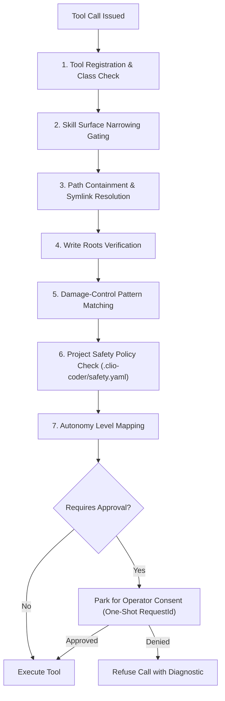

# Clio Coder Safety Model

`createSafetyPolicyEngine` in [policy-engine.ts](../../src/domains/safety/policy-engine.ts) evaluates tool admission. The [tool usage guide](../guide/tool-usage.md) shows the operator surface.

This document specifies the security, admission control, and execution safety architecture of Clio Coder across [src/domains/safety/](../../src/domains/safety/index.ts) and [src/tools/](../../src/tools/registry.ts).

The core thesis of Clio's safety model is that **agent safety must be code-enforced, not prompt-dependent**. Language models cannot reliably self-govern through system instructions alone. Clio interposes deterministic code gates between the language model's intent and actual system execution, enforcing containment, privilege minimization, path canonicalization, and explicit operator consent.

---

## 1. Process Isolation Boundary

Clio's safety architecture provides admission control and execution gating; **it is not an operating-system kernel sandbox**.

Child processes, tool executions, and external agent bridges run with the permissions of the host user executing Clio. While Clio strictly inspects, rewrites, and gates actions before execution, environment variable filtering is an allowlist/denylist mechanism and cannot guarantee total isolation from arbitrary local host state. Operators must review privileged operations before granting standing approvals.

---

## 2. The Dual-Axis Security Model

Clio evaluates every proposed action along two orthogonal axes: **Autonomy** and the **Safety Net**.

```
                           Safety Net (Damage Control & Policy)
                               ▲
                               │  [Hard Blocked: rm -rf /, disk wipes]
                               │
                               │  [Confirm Required: matched damage-control ask rules]
                               │
                               │  [Admitted Non-Destructive]
                               ┼────────────────────────────────────────► Autonomy Axis
                       default (supervised)                yolo
```

### 2.1 The Autonomy Axis (Delegation Dial)
Autonomy governs when the agent may act automatically versus when it must request operator confirmation:

| Autonomy Level | Read Workspace | Mutate Files | Shell Commands | Network Calls |
| :--- | :--- | :--- | :--- | :--- |
| `default` | Allowed | Allowed (in write roots) | Unrecognized commands ask* | Outward calls ask |
| `yolo` | Allowed | Allowed (in write roots) | Allowed unless blocked by damage control | Allowed unless blocked by damage control |

*Test Runner Recognition*: Standard test suites (`npm test`, `pytest`, `cargo test`, `go test`) run without confirmation in `default`.

Internal inspection workers may use a separate `read-only` posture; it is not an operator mode.

### 2.2 The Safety Net (Invariant Policy)
The safety net operates independently of the autonomy dial:
- **Hard Blocks**: Actions that are permanently forbidden regardless of autonomy level (e.g., recursive deletion of root or home, writing to block devices, fork bombs).
- **Confirmation Rails**: Ordinary confirmation asks are skipped in `yolo`. A damage-control rule can still require approval at either operator mode.

### 2.3 Advisory Presentation vs Authoritative Code
- **Consequence Tiers** (`low`, `medium`, `high`, `critical`) are purely advisory visual signals rendered in the TUI to inform human judgment.
- **Authority**: Access control decisions are evaluated strictly by code in [src/domains/safety/policy-engine.ts](../../src/domains/safety/policy-engine.ts); the model's self-assessed risk score never grants execution authority.

---

## 3. Policy Engine Evaluation Pipeline

Every tool invocation—whether from the primary orchestrator or a background worker—passes through a deterministic 10-step evaluation sequence before execution:



<details>
<summary>The 10-step evaluation sequence in detail</summary>

1. **Tool Registration**: Verifies the tool is registered in the active tool plane.
2. **Skill Narrowing**: Gated against active `allowed-tools` if a skill is armed.
3. **Protected Paths**: Confirms target paths do not touch `.git/`, `.clio-coder/`, or system directories.
4. **Symlink Traversal**: Resolves every intermediate symlink to prevent directory breakout.
5. **Write Roots**: Verifies file mutation targets fall inside declared repository write boundaries.
6. **Damage Control**: Scans command strings against `damage-control-rules.yaml`.
7. **Project Policy**: Evaluates local rules in `.clio-coder/safety.yaml`.
8. **Autonomy Mapping**: Evaluates the action class against the session's active autonomy level.
9. **One-Shot Approval**: If confirmation is required, mints an isolated `requestId`.
10. **Execution & Receipt Sealing**: Executes the action and appends the outcome to the audit log.

</details>

---

## 4. Path Canonicalization & Symlink Invariants

Path traversal vulnerabilities are a primary attack vector for autonomous agents. Clio enforces strict kernel-aligned path resolution:

- **Component-by-Component Resolution**: Every intermediate directory component is checked for symlink traversal before resolving subsequent segments.
- **Kernel-Aligned `..` Traversal**: Traversing `..` after a symlink resolves relative to the *target* directory where the symlink points, exactly as the Linux/POSIX kernel resolves it, preventing sandbox escape via crafted link chains.
- **Write Root Boundaries**: Mutations are strictly confined to declared `write_roots`. Writes attempting to navigate outside the project checkout fail closed immediately.

---

## 5. Semantic Shell Admission & Damage Control

Shell commands executed via `bash` undergo structural parsing and pattern scanning before process spawning:

### 5.1 Damage Control Rules (`damage-control-rules.yaml`)
- **Permanently Blocked**:
  - Root/home deletion (`rm -rf /`, `rm -rf ~`, `rm -rf $HOME`).
  - Raw filesystem or partition operations (`dd`, `mkfs`, `fdisk`).
  - Remote payload execution (`curl ... | sh`, `wget ... | bash`).
  - Dangerous permission mutations (`chmod -R 777 /`).
- **Confirmation Required**:
  - Network commands (`curl`, `wget`, `ssh`, `rsync`).
  - Git destructive operations (`git push --force`, `git reset --hard`).
  - System daemon modification (`systemctl`, `service`).

### 5.2 Shell AST & Argument Inspection
Clio parses bash command syntax to detect evasion tactics:
- **Redirection Gating**: Inspects write redirection targets (`> /etc/hosts`, `>> ~/.bashrc`).
- **Chained Navigation**: When commands chain directories (`cd /tmp && rm *`), Clio resolves paths relative to the intermediate working directory.
- **Variable Expansion**: Commands attempting unexpanded environment writes prompt for verification.

---

## 6. Worker Isolation & Subagent Permissions

When tasks are delegated to background workers:

- **Autonomy Floor**: Subagents inherit the parent's autonomy level or lower; a worker can never elevate autonomy beyond the orchestrator's grant.
- **Write-Scope Confinement**: Workers are restricted to the task's declared `write_roots`.
- **Git Worktree Isolation**: Concurrent workers execute inside dedicated git worktrees (`.clio-coder/worktrees/<runId>/` on branch `clio/task/<runId>`). This prevents race conditions and corrupted working trees.
- **Checkout Writer Leases**: Single-writer tokens ensure only one worker at a time can merge or write to the primary repository checkout.

---

## 7. Rigor Gates & Deterministic Finish Contracts

Safety in Clio extends beyond preventing destructive actions to ensuring **computational correctness and honesty**:

- **Finish Contract Assessor**: High-stakes tasks require explicit verification contracts (`tasks[].intent.verification`).
- **Host-Run Checks**: Verification checks (`npm test`, typecheck, lint) are executed by the orchestrator host environment, not self-reported by the model.
- **Evidence Bundles**: Results are sealed into cryptographic evidence bundles recording exit codes, duration, and output hashes before a task is marked `verified`.

---

## 8. Source Implementation Map

| Security Component | Source Location | Key Contracts |
| :--- | :--- | :--- |
| Policy engine and gating | [policy-engine.ts](../../src/domains/safety/policy-engine.ts) | `createSafetyPolicyEngine` |
| Damage control rules | [damage-control.ts](../../src/domains/safety/damage-control.ts) | `match` |
| Read scope checks | [read-scope.ts](../../src/domains/safety/read-scope.ts) | `readScopeEscape`, `readScopeSpellings` |
| Audit records | [audit.ts](../../src/domains/safety/audit.ts) | `buildAuditRecord`, `openAuditWriter` |
| Finish contract and rigor | [finish-contract.ts](../../src/domains/safety/finish-contract.ts) | `assessFinishContract` |
