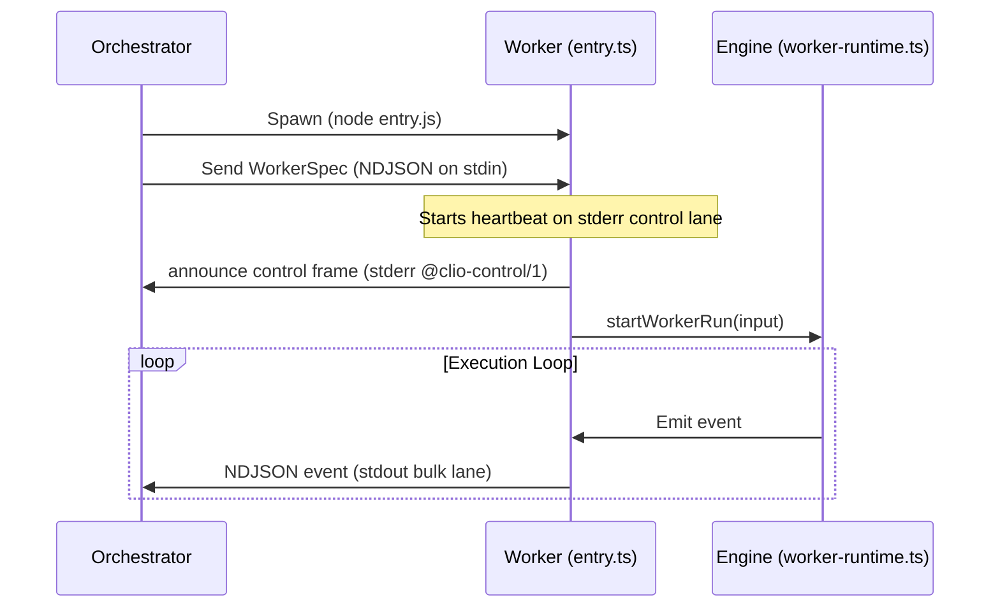
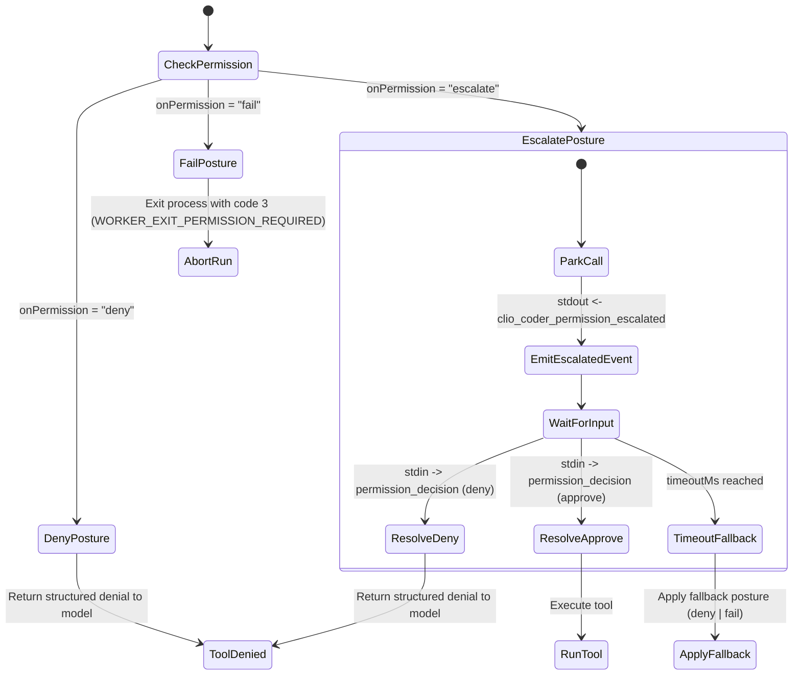

# Worker Dispatch Mechanics

The [fleet dispatch guide](../guide/fleet-dispatch.md) explains how operators start and monitor these workers.

This document describes the design and lifecycle of Clio Coder dispatched workers, focusing on the spawning sequence, execution isolation, the standard input/output NDJSON communication loop, and permission escalation routing.

Source of truth:
- Subprocess entry: [src/worker/entry.ts](../../src/worker/entry.ts)
- Wire protocol, lane bounds, and frame parsers: [src/worker/protocol.ts](../../src/worker/protocol.ts)
- Input demultiplexing: [src/worker/stdin-demux.ts](../../src/worker/stdin-demux.ts)
- Heartbeat loop: [src/worker/heartbeat.ts](../../src/worker/heartbeat.ts)
- Spec contracts and exit codes: [src/worker/spec-contract.ts](../../src/worker/spec-contract.ts)
- Orchestrator-side spawn, attestation admission, and the bounded queue: [src/domains/dispatch/worker-spawn.ts](../../src/domains/dispatch/worker-spawn.ts), [src/domains/dispatch/worker-protocol.ts](../../src/domains/dispatch/worker-protocol.ts)
- Dispatch orchestrator: [src/domains/dispatch/index.ts](../../src/domains/dispatch/index.ts)
- Run event journal writer, reader and bus bridge: [src/domains/dispatch/run-event-journal.ts](../../src/domains/dispatch/run-event-journal.ts), [src/domains/dispatch/run-event-journal-bridge.ts](../../src/domains/dispatch/run-event-journal-bridge.ts)
- Engine worker runtime: [src/engine/worker-runtime.ts](../../src/engine/worker-runtime.ts)

---

## 1. Spawning Sequence & Environment Isolation

When the orchestrator dispatches a task to a fleet agent (such as via the `dispatch` tool or `clio-coder run --agent`), it spins up a child process running the compiled worker entry.

1. **Child Process Creation:**
   The parent process spawns a Node.js subprocess pointing to `dist/worker/entry.js`.
2. **Environment and Process Group:**
   The child inherits the orchestrator's environment plus `AI_AGENT=clio-coder`, which marks the process as agent-driven for developer tools. The entry also sets `CLIO_CODER_WORKER_RUN=1` for itself and every command its tools spawn, so a skill install can record that a worker performed it. It is spawned detached with piped `stdin`, `stdout`, and `stderr`, and leads its own process group so abort escalation reaches the descendants a runtime spawned. Workers are non-interactive: they never mount TUI elements.
3. **Spec Injection & Attestation Handshake:**
   The orchestrator serializes a `WorkerSpec` JSON document and writes it as the very first line of `stdin` to the child worker. The worker accepts only `specVersion` equal to `WORKER_SPEC_VERSION` (currently `8`); any other version is a fatal spec rejection and the process exits `2`. Before reaching a model, every worker announces its attestation on the structured stderr control lane (`@clio-control/1 ` prefix): protocol version (`WORKER_PROTOCOL_VERSION = 1`), spec version, process ID, process group ID (or null), host, settings fingerprint, worker-computed spec digest (`specDigest`), runtime ID, target ID, endpoint identity hash (`endpointIdentityHash`), wire model ID, effective tool signature, and bounded node resource facts (labels, CPU count, total memory, free memory, GPU count, VRAM, and resident models). The orchestrator compares each field against the approved plan and terminates a drifting peer with `SIGKILL` to its process group instead of running it. Bulk NDJSON on `stdout` is accepted only once that attestation verifies. Stdout and stderr are separate pipes with no ordering guarantee, so bulk frames that arrive first are held. If no announce arrives within 2 seconds of the first held frame, its process group is killed. A peer that times out or exits without announcing is treated as unattested and its held frames are discarded.



---

## 2. Standard Input/Output NDJSON Protocol

Dispatched workers are non-interactive. Coordination between the orchestrator and the worker occurs across two dedicated communication lanes plus standard input:

### 2.1 Worker Output Lanes

Clio Coder divides worker output into two isolated streams to protect control signals from bulk data starvation:

1. **Bulk Lane (`stdout`)**:
   Streams turn execution events as single-line NDJSON objects, capped by `WORKER_BULK_FRAME_MAX_BYTES` (4 MiB). To prevent quadratic payload explosion during streaming, `projectWorkerEventForStdout` ([event-projection.ts](../../src/worker/event-projection.ts)) slims `message_update` events by stripping cumulative message snapshots before emission. The lane carries two families of frames. The agent loop's own events pass through unchanged: `agent_start`, `turn_start`, `message_start`, `message_update`, `message_end`, `tool_execution_start`, `tool_execution_update`, `tool_execution_end`, `turn_end`, and `agent_end`. The Clio Coder events below ride beside them ([worker-events.ts](../../src/engine/worker-events.ts)):

   | Event | Payload |
   | --- | --- |
   | `clio_coder_tool_start`, `clio_coder_tool_finish` | The Clio Coder telemetry for one call. A start carries the tool, the call id, and a wall-clock anchor. A finish carries the tool, the call id, `durationMs`, the `outcome`, the safety `decision` (`allowed`, `blocked`, `permission_requested`), and the action class, rule, and reason behind a block. Receipts fold them into tool stats and safety decisions. |
   | `clio_coder_permission_escalated` | A parked call under the `escalate` posture: `requestId`, `tool`, `summary`, a sanitized `target` preview, optional `consequence` lines, the asking `axis`, the safety `decision` (`actionClass`, `reasons`, `reasonCode`, `ruleId`, `policySource`), `timeoutMs`, and for main-routed asks `authority` and `argDigest`. |
   | `clio_coder_permission_resolved` | How a permission-requiring call resolved: `tool`, `actionClass`, `mode` (`deny`, `fail`, `escalate`), `reason`, and optional `source` (`operator`, `timeout`, `policy`, `remembered`, `main`, `binding`), `requestId`, `decision` (`approved` or `denied`), and `authority`. |
   | `clio_coder_permission_grant_execution` | Whether a call a live grant released ran: `requestId`, `tool`, `phase` (`start`, `end`, `not_executed`), and `outcome` or `detail`. A worker that dies between `start` and `end` leaves the outcome unknown. |
   | `clio_coder_steer_received` | Acceptance of a steer line: `chars` and the parent-assigned `sequence`. |
   | `clio_coder_run_outcome` | A machine-readable terminal classification: `outcomeCode` and an optional bounded `detail`. |
   | `clio_coder_flow_restrictions` | The run's information-flow restriction set after a read added to it. The parent absorbs it before any output is shown. |
   | `clio_coder_helper_result` | The internal helper's terminal object, emitted only after the host validates it. |

   The orchestrator adds one frame of its own, `spawn_error`, when the process cannot start.

   The orchestrator reads the bulk lane through a bounded queue of 4096 frames ([worker-protocol.ts](../../src/domains/dispatch/worker-protocol.ts)). At the bound it drops the oldest display-only frame, such as a `message_update`. It never drops a receipt-bearing frame: `message_end`, the tool frames (`tool_execution_start`, `tool_execution_end`, `clio_coder_tool_start`, `clio_coder_tool_finish`), `clio_coder_run_outcome`, `clio_coder_helper_result`, `clio_coder_flow_restrictions`, the permission escalation, resolution, and grant execution frames, `clio_coder_steer_received`, and `spawn_error`. The set is `RECEIPT_BEARING_BULK_TYPES` in [protocol.ts](../../src/worker/protocol.ts). When the queue holds only evidence, it accepts one more receipt-bearing frame past the bound and refuses the new display frame instead. A bulk line over `WORKER_BULK_FRAME_MAX_BYTES` is discarded before parsing and counted as malformed.

2. **Control Lane (`stderr`)**:
   Emits out-of-band control frames prefixed by `@clio-control/1 `, capped at `WORKER_CONTROL_FRAME_MAX_BYTES` (16 KiB). Because control frames travel over `stderr`, they bypass backpressured bulk stdout streams and reach orchestrator watchdogs immediately. Control frame kinds include:
   * **Announce:** `{"kind": "announce", "attestation": ...}` sent immediately upon startup.
   * **Heartbeat:** `{"kind": "heartbeat"}` emitted every 1000 milliseconds. The frame carries no timestamp; the orchestrator stamps arrival on its own clock.
   * **Cancel acknowledgment:** `{"kind": "cancel_ack", "at": <ms>}` confirms the worker saw a cancel request.
   * **Ledger post:** `{"kind": "ledger_post", "body": ...}` carries a `claim`, `finding`, `review`, or `message` entry for the shared agent ledger. The orchestrator drops a post that arrives before the announce is accepted.
   * **Model loaded:** `{"kind": "model_loaded", "load": ...}` reports a model load the worker observed. Only target and model ids cross the lane; the orchestrator resolves the endpoint itself and releases the load when the worker exits.
   * **Grant request:** `{"kind": "grant_request", "request": ...}` carries the effect descriptor of a worker ask routed to the main agent under `fleet.permissions.mode: main`. It stays off the bulk lane because that lane is journaled and displayed. A descriptor too large for the frame crosses as its digest alone, and the host then refuses a main grant.

   Every parsed control frame, whatever its kind, counts as worker liveness. Stderr lines without the `@clio-control/1 ` prefix are free-form diagnostics. The orchestrator keeps the last 4096 bytes of them as `stderrTail`, which receipts and failure classification read.

   Steer receipt is not a control frame. It is the bulk-lane `clio_coder_steer_received` event.

### 2.2 Worker Input (`stdin`)
The worker entry mounts a custom stdin demultiplexer (`createWorkerStdinDemux`) that parses lines arriving after the initial `WorkerSpec`. Each line is capped at `WORKER_STDIN_FRAME_MAX_BYTES` (1 MiB), checked before parsing. The orchestrator side caps what it has queued toward a worker at `WORKER_STDIN_QUEUE_MAX_BYTES` (4 MiB). A write past either bound, or to a worker that has exited, fails as a typed channel failure, which classification routes to the node (`node-channel`). The demultiplexer processes three types of JSON messages:
1. **Steering Commands:**
   `{"type": "steer", "text": "guidance message", "sequence": 1}`
   The parent assigns `sequence`, a positive integer; a steer without one, or with blank text, is dropped. It instructs a live-input HTTP or SDK worker to alter course. Its runtime emits
   the receipt-bearing `clio_coder_steer_received` event, echoing the sequence, only after accepting the
   message for the next turn boundary. Single-shot subprocess runtimes install
   no steering handler, drop unexpected guidance without claiming receipt, and
   are not offered steering by the dispatch contract or TUI.
2. **Permission Decisions:**
   `{"type": "permission_decision", "requestId": "req-xxx", "decision": "approve"|"deny"}`
   Resolves a parked tool call that was escalated to the operator or, under `fleet.permissions.mode: main`, to the main agent. A grant-bound decision also carries a `binding` (attempt token, attempt number, argument digest, issuer). A decision whose binding is missing, malformed, or names another attempt or different arguments denies the parked call.
3. **Ledger Deltas:**
   `{"type": "ledger_delta", "entries": [...]}`
   Pushes newly admitted agent ledger entries into the worker's local mirror, so a ledger read answers without a round trip. The orchestrator replays the board on subscription, and early batches are buffered in order.

Any line that is not valid JSON matching these schemas is counted as dropped and does not crash the worker. At exit the worker reports the count on stderr. If stdin closes after the spec arrives, the dispatcher is gone (orchestrator exit, SSH channel drop): the worker emits `cancel_ack`, aborts the run, and force-exits with code `1` after a 5-second grace.

---

## 3. Heartbeats and the Watchdog

Even when a model is processing a long thinking phase or generating a heavy output, the worker must prove it is alive to prevent the parent orchestrator's watchdog from reclaiming it.

* **Emission:** The heartbeat loop (`startWorkerHeartbeat` in [heartbeat.ts](../../src/worker/heartbeat.ts)) writes a heartbeat control frame (`{"kind": "heartbeat"}`) to the `stderr` control lane every 1000 milliseconds.
* **Stream Isolation:** Because heartbeats ride the control lane rather than `stdout`, a large bulk output or queued tool result cannot starve or delay the watchdog check.
* **Non-Blocking Timer:** The heartbeat timer interval is explicitly `.unref()`'d, ensuring the Node.js runtime is not kept alive past the natural lifetime of the worker run.
* **Termination:** Once `startWorkerRun` resolves, the timer is cleared before returning the worker's exit code.
* **Initial beat:** The first beat fires immediately at startup, so a short run still registers once before it exits.

The orchestrator side is a reconciler that ticks every 1000 ms and runs independently of admission gates, so a budget breach cannot stop it from reaping a dead worker. Liveness is the arrival time of the latest frame of any kind on either lane, read from the orchestrator's monotonic clock. Worker timestamps are never compared. `DEFAULT_HEARTBEAT_SPEC` in [heartbeat.ts](../../src/domains/dispatch/heartbeat.ts) classifies the age of the last frame:

| Age of last frame | Status | Action |
| --- | --- | --- |
| 5 s or less | `alive` | None. |
| Over 5 s, up to 15 s | `stale` | One operator-visible warning per transition. |
| Over 15 s | `dead` | The reconciler kills the worker: `SIGTERM` to its process group, then `SIGKILL` after a 500 ms grace. The run finalizes with outcome `stalled`, which is retryable and classifies as `node-channel`. |

ACP delegations send no periodic heartbeat. They are bounded by an event-inactivity stall window instead, `stallTimeoutMs` on an `integrations.externalAgents.entries[]` entry, defaulting to 300000 ms. A parked escalation does not stall a worker, because the heartbeat timer runs independently of the parked call and the orchestrator keeps the ledger row fresh while it waits for an operator.

---

## 4. Permission Escalation and Parking

When a tool requires explicit confirmation (for example running an unrecognized bash command in `default` mode), the worker evaluates `onPermission`. The spec carries `deny`, `fail`, or `escalate`. The setting `fleet.permissions.mode` (default `deny`) selects the posture, and `main` travels as `escalate` with a permit that routes asks to the main agent.



1. **Deny:** Immediately returns a structured denial to the model, allowing the run to continue without making the call. The denial text is specified in [Worker denial format](#worker-denial-format). The third refused execute call in one run ends it with exit code `3`, as specified in [Worker refusal limit](#worker-refusal-limit).
2. **Fail:** Terminate the run at the first refusal, exiting the worker subprocess with exit code `3` (`WORKER_EXIT_PERMISSION_REQUIRED`).
3. **Escalate (Parking Loop):**
   - The worker parks the tool execution thread.
   - It generates a unique `requestId` and emits a `clio_coder_permission_escalated` event to `stdout`.
   - The parent process intercepts this event, displays the approval prompt in the interactive TUI, and waits for the operator.
   - If the operator selects approve or deny, the parent writes `{"type":"permission_decision", "requestId":"...", "decision":"..."}` to the worker's `stdin`.
   - The demuxer resolves the parked promise, resuming tool execution.
   - **Timeout Safety:** If no decision arrives within `escalation.timeoutMs` (default `120000` ms), the worker resumes and applies the `escalation.fallback` posture (default `deny`). If running headlessly (no operator attached) or on runtimes that cannot support park loops, the posture collapses to the fallback immediately.

### 4.1 Denied-escalation memory

To prevent a worker process from repeatedly re-prompting the operator for a call that was already denied, [worker-runtime.ts](../../src/engine/worker-runtime.ts) keeps an in-memory map of denied escalations (`workerPermissionCacheKey`). A key combines the exact call (`tool` name and arguments) with the permission conditions (asking axis, action class, and safety-net policy provenance). When a worker re-issues an identical call under the same conditions after a denial from the operator, the main agent, or the timeout fallback, the denial is returned immediately with a reason naming the earlier request, and no escalation event is emitted. Approvals are never remembered. Each approval executes at most one call, and an identical later call needs its own decision. Any change in arguments or policy rails requires a new card.

Refusals under the `escalate` posture do not count toward the [refusal limit](#worker-refusal-limit). Only the `deny` posture does.

---

## 5. Assignment-aware retry and failover

A worker process produces one immutable **attempt**. Dispatch groups attempts
under a logical **assignment** whose id is the first attempt's
`lineage.rootRunId`. Attached and batch `finalPromise` handles resolve to the
terminal attempt receipt, not to an earlier failure that happened to trigger a
retry. Receipt bytes and integrity versions remain unchanged; assignment state
is maintained separately in `assignments.json` with the attempt ids, terminal
run id, and status.

Detached `monitor collect` resolves the assignment's terminal run and returns
its complete `attemptRunIds` history. `status`, `wait`, `steer`, permission
resolution, and cancellation also accept the assignment id and address the
current attempt. Cancellation prevents queued or future attempts. Pipelines
therefore receive terminal fallback output as their next-stage input.

The assignment also owns the event stream. `dispatch()` returns a single
stream carrying every attempt's frames in order, separated by a synthetic
`attempt_start` frame (`attempt`, `runId`, `previousRunId`, `reason`). The
stream ends when the assignment settles, not when one attempt's worker exits,
so a consumer that drains it has seen exactly the run the terminal receipt
describes. A canceled assignment ends its stream immediately.

Retry timing is governed by `fleet.retry.maxRetries`, exponential backoff, and
the minimum delay a failure class carries. Target cooldowns gate *new*
dispatches to a known-bad target and are not applied to retries of an in-flight
assignment, whose retry budget already bounds it. A retry refused at admission
settles the assignment failed and records the denial reason in the assignment's
`outcomeDetail`. The classes, delays, and per-mode route changes are specified in
[Failure classification and retries](#51-failure-classification-and-retries).

Retry also requires evidence that reusing the same checkout is safe. Each
receipt seals `safety.toolTelemetry`: coverage is `complete`, `partial`, or
`unavailable`, with ingestion errors and unmatched tool starts preserved.
Dispatch suppresses automatic retry after an executed state-changing call,
after an unfinished state-changing call, or when an opaque mutation-capable
runtime cannot prove that the failed attempt left the workspace unchanged.
External CLI peers run with their default writable permission mode unless the
dispatch carries `readOnly: true`. Codex, Claude Code, Antigravity, and Pi then
use their read-only tool modes; OpenCode refuses read-only admission. Read-only
runs on the `claude-code` runtime keep retries because the peer cannot mutate
the workspace. The `codex-cli`, `pi-cli`, `opencode-cli`, and `antigravity`
runtimes declare a one-shot external agent loop and never retry automatically,
even when read-only. Every other subprocess run and every ACP delegation run
fails closed on retry, because Clio Coder cannot prove the failed attempt left the
workspace unchanged and no isolated retry workspaces exist.

Failover modes are:

- `none`: exact pins remain fail-closed; retries can only repeat the same tuple.
- `approved`: candidates must be exact members of the operator-approved
  agent/target/model/node envelope.
- `automatic`: typed failures may replace only implicated route parts. Node
  channel failure excludes the node; target rate limiting excludes the target.

A request with an explicit `target` or `node` pin defaults to `none`. An
unpinned request defaults to `automatic`. The model-facing `routing.failover`
field accepts only `none` and `approved`; `automatic` is internal retry policy.
Operator cancellation, policy rejection, permission refusal, and deterministic
task failures do not retry. The first three are neutral to target/node
infrastructure breakers.

### 5.1 Failure classification and retries

`classifyFailure` in [failure-classification.ts](../../src/domains/dispatch/failure-classification.ts) maps a finished attempt to one of 14 failure classes. `decideRetry` then turns the class into a retry decision: whether to retry, which route parts to exclude, and a minimum delay. The classifier tests evidence in the order of the table below, and the first match wins.

| Order | Class | Evidence | Retry | Route parts excluded | Minimum delay |
| --- | --- | --- | --- | --- | --- |
| 1 | `operator-cancel` | Operator abort or outcome `canceled`. | No | None | None |
| 2 | `policy` | Admission, budget, scope or cooldown rejection, or outcome `denied_by_policy`. | No | None | None |
| 3 | `permission` | Permission failure or worker exit code `3`. | No | None | None |
| 4 | `deterministic-task` | A typed outcome code that retrying unchanged cannot heal: `vram_capacity_fit_failure`, `worker_tool_call_cap_exhausted`, `worker_context_exhausted`, `loop_guard_tools_disabled_exhausted`, `result_contract_exhausted`, `worker_final_output_missing`, `host_verification_rejected`, `worker_no_work`, `worker_mutation_blocked`, `merge_withheld`, `worker_removed_tests`, `information_flow_blocked`. Order 8 also assigns this class from diagnostic text. | No | None | None |
| 5 | `model-quality` | The coordinator's quality or verification gate rejected an otherwise successful completion. | Yes | `agent`, `model`; the decision also carries typed authority to change agent | None |
| 6 | `node-channel` | A typed control-channel failure, a reconciler stall kill, outcome `stalled` or `spawn_failed`, or process exit code `255` (SSH). | Yes | `node` | None |
| 7 | `provider-refusal` | Outcome `failed` and the provider's content filter answered. The endpoint is healthy. | Yes | None | None |
| 8 | `deterministic-task` | Diagnostic text (see below): a rejected response schema, a rejected WorkerSpec, an ACP model admission or HTTP 400 or 404 prompt verdict, a context overflow, or a provider 4xx. | No | None | None |
| 9 | `target-auth` | Diagnostic matches `401`, `403`, `unauthorized`, `forbidden`, `invalid api key`, or `authentication`. | Yes | `target` | None |
| 10 | `target-rate-limit` | Diagnostic matches `429`, `rate limit`, or `too many requests`. | Yes | `target` | 1 second |
| 11 | `node-resource` | Diagnostic matches `vram`, `gpu`, `cuda`, `oom`, or `out of memory`. | Yes | `node` | None |
| 12 | `capacity` | Diagnostic matches `capacity`, `overloaded`, or `queue full`. | Yes | `node` | None |
| 13 | `target-transient` | Run timeout or outcome `timed_out`, or diagnostic matches `timeout`, `timed out`, `temporar`, `unavailable`, `500`, `502`, `503`, `504`, `internal server error`, `econnrefused`, `econnreset`, `fetch failed`, or `connection error`. | Yes | `target` | None |
| 14 | `worker-runtime` | Outcome `failed` that no earlier test matched. | Yes | `runtime` | None |
| 15 | `internal` | No more specific termination evidence. | Yes | None | None |

The diagnostic text is the lower-cased join of the worker's `stderrTail` (last 4096 bytes) and the worker's last provider error message. An ACP delegation passes the provider message in place of stderr, and so does a structured-handoff run, which writes nothing to stderr.

#### Provider 4xx is not retried

When the native worker's stderr carries the [provider HTTP status marker](#provider-http-status-marker), a status from 400 through 499 classifies as `deterministic-task` and is never retried, because resending the identical request earns the identical answer. Four statuses are exempt. `401` and `403` retry as `target-auth`, excluding the target. `429` retries as `target-rate-limit`, excluding the target, after at least 1 second. `408` has no class of its own. It falls through to `target-transient` when the error text names a timeout, and otherwise to `worker-runtime`, and both retry. A 5xx status is never excluded. `500`, `502`, `503`, and `504` match `target-transient`, and any other 5xx retries as `worker-runtime`. The status comes only from the native worker runtime. ACP delegations and the Claude SDK runtime rely on the text patterns above, with the explicit ACP verdict patterns `acp peer reported http 400|404` and `session/prompt|session/set_model failed: 400|404` ending as `deterministic-task`.

#### Retry decision and delay

- Only outcomes `failed`, `timed_out`, `stalled`, and `spawn_failed` are eligible. `succeeded`, `canceled`, and `denied_by_policy` never retry.
- `attempt` is the zero-based attempt number. A class that retries stops retrying once `attempt >= maxRetries`, and `maxRetries <= 0` disables retry. `maxRetries` is `fleet.retry.maxRetries` (default `2`, so at most three attempts), or one less than `maxAttempts` when an operator-approved route sets it.
- The delay before attempt `n` is the larger of the exponential backoff `500 ms * 2^(n-1)`, capped at 60 seconds, and the class minimum delay.
- `affectsTargetBreaker` classes (`target-auth`, `target-rate-limit`, `target-transient`, `worker-runtime`) count as failures against the route cooldown, keyed by target, runtime, and wire model. `fleet.retry.routeCooldownMs` (default `15000`) sets the base cooldown and `fleet.retry.breakerThreshold` (default `1`) the consecutive failures that open it. A failed half-open probe doubles the cooldown, capped at 300 seconds. Of the node classes, only `node-channel` counts toward an SSH node's channel health; `node-resource` and `capacity` exclude the node from the retry only. The remaining classes are neutral.
- Automatic retry is suppressed, and the assignment settles with the reason in its outcome detail, when the failed attempt executed or left unfinished a state-changing call, when a granted call may have run with an unknown outcome, when tool telemetry cannot rule out a workspace mutation, when the runtime is a one-shot external agent loop, or when the dispatch domain is shutting down.

#### What "another target" means under each failover mode

| Failover mode | Effect of the excluded route parts |
| --- | --- |
| `none` | The decision's exclusions are cleared. The retry repeats the exact first-attempt agent, target, model, and node after backoff. A context-overflow retry is refused. |
| `automatic` | `node`: the failed node is recorded as a reroute hop and placement picks again. `target`: another configured target is chosen that differs from the failed target, passes the required capabilities, and is not cooling down. If none is eligible, the target is left unpinned and placement picks again, which may select the failed route. `model`: the model pin is dropped. `runtime`: the worker runtime pin is dropped. `agent` exclusion changes nothing. |
| `approved` | The next candidate must be an exact member of the approved `agent`/`target`/`model`/`node` envelope that differs from the current route in at least one excluded part and keeps the same agent. Only a `model-quality` decision under an active route approval may change the agent. A runtime-only exclusion repeats the current route. With no eligible member the retry is denied and the assignment settles failed with `retry attempt N rejected`. |

A provider context overflow is `deterministic-task`, but it earns one reversible escape. Unless the mode is `none`, the retry budget is spent, or the failed attempt was already an overflow retry, dispatch retries once on a route whose context window is strictly larger than the failed route's, inside the approved envelope for `approved`. The retry reason is `context-overflow: <old window> -> <new window> on <target>/<model>`.

#### Attempt and run-id rules

- Every attempt is a new worker process with its own run id, receipt, and ledger row. The assignment id is the first attempt's `lineage.rootRunId`.
- A retry's lineage is `{parentRunId: previous run id, rootRunId: unchanged, attempt: previous + 1, depth: unchanged}`. A caller-supplied run id hint applies only to the first attempt and is dropped for retries.
- A retry starts with no grants, runs with request origin `internal`, and inherits no wider permit than the failed attempt's. It re-passes admission, so a policy or budget denial ends the chain. Every attempt after the first has execution role `recovery`, so a retry never trains ordinary builder statistics in route history.
- Consumers see one stream per assignment. A synthetic `attempt_start` frame (`attempt`, `runId`, `previousRunId`, `reason`) separates attempts, and `finalPromise` resolves to the terminal attempt's receipt.

### 5.2 Canonical Receipt Integrity Serialization

Receipts carry the current integrity version (`RUN_RECEIPT_INTEGRITY_VERSION = 20`). Verification computes a cryptographic SHA-256 digest over a strictly sorted, canonical JSON representation (`serializeCanonical` in [receipt-integrity.ts](../../src/domains/dispatch/receipt-integrity.ts)). A pre-v20 receipt is retired and cannot be read as current evidence; a malformed or digest-mismatched v20 receipt is invalid.

- **Object Key Sorting**: Keys are sorted lexicographically before serialization (`Object.keys(obj).sort()`).
- **Strict Primitive Handling**: `undefined` object properties are omitted; non-finite numbers (`NaN`, `Infinity`) or `bigint` throw an explicit serialization error.
- **Coverage**: Includes every current receipt field and reconstructible ledger field, including route intent/decision/quality, execution role, worker identity, result-contract conformance, node/reroute/gate/plan/council provenance, briefing, steering, task worktree application, and `outcomeCode`.

Startup orphan recovery ([orphan-recovery.ts](../../src/domains/dispatch/orphan-recovery.ts)) rebuilds the ledger row a sealed receipt was verified against and adopts it when the digest matches. The adopted row also carries the receipt's council provenance and `costProvenance`. Neither is in the ledger digest, so they cannot change verification, and without them an adopted run left its council and was priced with unknown provenance. The scan skips receipts the ledger already holds and receipts older than the ledger's horizon; see [Cold-start work](architecture.md#cold-start-work).

Integrity is only the artifact-integrity axis of the canonical trust status.
The other axes are validation grounding, independent review, context
provenance and completion evidence. Sealing proves that
the receipt matches its covered ledger facts; it does not verify correctness,
establish context authorship, turn a correlated review into an independent
one, or prove completion. Every non-absent canonical fact retains a named
source and authority plus bounded references to detailed artifacts. The full
state vocabulary and compatibility map are documented in
[`evidence-and-memory.md`](evidence-and-memory.md#canonical-trust-status).

### 5.3 Helper Acceptance and Capture Ceilings

Structured helper results ([result-contract.ts](../../src/domains/agents/result-contract.ts)) enforce an aligned acceptance and capture ceiling of 32 KiB (`STRUCTURED_HELPER_RESULT_MAX_BYTES = 32_768`). A worker rejects outputs exceeding 32 KiB during validation, guaranteeing that a worker cannot accept a helper result that exceeds the orchestrator's durable receipt capture allowance.

## 6. Worker Exit Codes

The child process exits with specific status codes to signal run outcomes to the orchestrator:
* **`0`**: The worker process completed without a runtime error; dispatch still requires a nonempty receipt-sealed final answer before classifying the run as successful (outcome code `worker_final_output_missing` otherwise).
* **`1`**: The run ended on a provider error (the [provider HTTP status marker](#provider-http-status-marker) precedes the error line), an agent exception, a run bound (`worker_tool_call_cap_exhausted`, `result_contract_exhausted`, and the other typed bounds), or a helper run that never delivered its structured result. A closed control channel also force-exits `1` after the 5-second grace.
* **`2`**: Worker initialization failed: the spec was rejected (invalid, wrong `specVersion`, or stdin closed before the spec arrived), the target runtime is not registered, or the rehydrated runtime does not match the spec.
* **`3` (`WORKER_EXIT_PERMISSION_REQUIRED`)**: The run aborted because a tool required permission and `onPermission` was set to `fail` (or timed out to a `fail` fallback), or because the deny posture refused three execute calls in one run. The orchestrator resolves it to outcome `failed` with detail `permission_required`.
* **`255`**: The exit code `ssh` itself returns for a failed connection or channel on a remote node. Classification treats it as `node-channel`.
* **No exit code**: A worker that never reached a live session resolves as outcome `spawn_failed`.

## Worker refusal limit

In the `deny` posture, a refused execute call does not end the run. The refusal returns to the worker model as a tool result, so the model can take another route. The third refused execute call in one run ends it. The worker emits the final `clio_coder_permission_resolved` event, writes the reason to stderr, aborts, and exits `3`. The orchestrator resolves outcome `failed` with detail `permission_required; <reason>`, and the reason names every refused command:

```text
permission refusal limit reached: the worker ended after 3 refused commands with no approval route: 1) bash `echo $(date)` refused by rule bash-command-substitution; 2) bash `echo $(whoami)` refused by rule bash-command-substitution; 3) bash `echo $(hostname)` refused by rule bash-command-substitution
```

The limit is `WORKER_REFUSAL_LIMIT = 3` in [worker-refusals.ts](../../src/engine/worker-refusals.ts). The counting rules live in [worker-runtime.ts](../../src/engine/worker-runtime.ts).

| Situation | Behavior |
| --- | --- |
| `deny` posture, execute-class refusal | Returned to the model. Counts toward the limit. The third ends the run with exit `3`. |
| `deny` posture, other action class | Returned to the model with a denial that names the tool and action class but not the command. Never counts and never ends the run. |
| `fail` posture (`onPermission: "fail"`) | The first refusal ends the run with exit `3`. The reason reads `permission required for <tool> (<class>); fleet.permissions.mode=fail ends this run`. |
| `escalate` or `main` posture with a responder | Denials by the operator, the main agent, or the timeout fallback are returned to the model and never count. A timeout whose fallback is `fail` ends the run at once. |
| `escalate` or `main` posture with no responder (headless run, ACP, fleet CLI) | The posture collapses to its configured fallback immediately. Fallback `deny` behaves as the `deny` row, and fallback `fail` as the `fail` row. |
| Claude SDK worker runtime (`claude-sdk`) | Ends at its first execute refusal under any posture, with exit `3` (`endsPermissionRun` in [sdk-runtime.ts](../../src/engine/claude/sdk-runtime.ts)). The three-refusal allowance applies to the native worker runtime only. This behavior has not been exercised against a live Claude subscription. |

Exit `3` is the `permission` failure class, which never retries. The main agent's `dispatch` tool also blocks an identical dispatch for the rest of the user turn after an attested `permission_required` failure, with the reason `dispatch duplicate blocked: this exact dispatch already failed with permission_required in this user turn`. The remedy is to change the authorized scope or route, because changing the command cannot create an approval route that does not exist.

## Worker denial format

A worker denial names what was refused instead of the policy outcome alone. `formatWorkerRefusal` in [worker-refusals.ts](../../src/engine/worker-refusals.ts) renders it as the tool, the command, and the rule:

```text
<tool> `<command>` refused by rule <rule>
```

For example, ``bash `echo $(date)` refused by rule bash-command-substitution``.

- **Tool**: the canonical tool name of the refused call.
- **Command**: the command the policy evaluated. For `bash` and `verify` that is the command string or the resolved argv. Other execute tools fall back to the call's allowlisted target preview. The text is trimmed and secrets are redacted with `redactSecretString`. A command longer than 200 characters keeps its first 200 characters followed by `…`. An empty command reads `(no command)`.
- **Rule**: the first present of the confirmation rule id (for an ask decision), the policy `ruleId`, the policy `reasonCode`, and the literal `autonomy`.

Only execute-class refusals carry the command and rule. The `permission_resolved` reason and the tool result the model reads lead with them, because the model-facing rejection text caps each line at 300 characters and would otherwise cut them off:

```text
permission denied by policy: <tool> `<command>` refused by rule <rule>; dispatched workers run non-interactively (fleet.permissions.mode=deny); <tool> requires execute confirmation. <up to three policy reasons>
```

The policy reasons name the remedy when one exists, such as running one command per bash call or using the typed git tool, so the model does not retry respelled variants. When the run ends at the refusal limit, the receipt's `outcomeDetail` and `failureMessage` carry the limit reason shown in [Worker refusal limit](#worker-refusal-limit) instead.

## Provider HTTP status marker

The native HTTP worker runtime remembers the HTTP status of the last provider response. It reads the status at the fetch boundary that every provider adapter shares, because Pi's SDK adapters report a response hook only for 2xx answers. When the run ends on a provider error and that last status is 400 or higher, the worker writes one plain stderr line before the error text:

```text
[worker] provider answered http 400
```

The prefix is `WORKER_PROVIDER_HTTP_STATUS_MARKER` in [spec-contract.ts](../../src/worker/spec-contract.ts). The line is not a control frame and carries no `@clio-control/1 ` prefix. The orchestrator finds the last occurrence in the worker's stderr tail and parses the three-digit status that follows. Dispatch reads it only in `classifyFailure`, where it separates a request the server rejected from a transient failure; see [Provider 4xx is not retried](#provider-4xx-is-not-retried). The ACP, Claude SDK, and external CLI runtimes do not write it.

## Run event journal

Live dispatch events exist only in the orchestrator's memory. A second process can follow a run in flight only through a file, so every dispatched run leaves an append-only transcript at `<stateDir>/runs/<runId>/events.ndjson`, one JSON object per line, newest last. `clio-coder fleet view`, `fleet view --follow` and the workers dashboard in the workers dock read it. None of them shares memory with the orchestrator, so they work from a second terminal or over SSH.

### Writer ownership

[run-event-journal-bridge.ts](../../src/domains/dispatch/run-event-journal-bridge.ts) subscribes to the dispatch bus channels `DispatchProgress`, `DispatchCompleted` and `DispatchFailed`. The dispatch domain publishes `DispatchProgress` for every consumer-visible event of every run, so the journal covers attached, detached, batched and retry runs whether or not a caller iterates the run handle. The bridge attaches only when a composition root passes `journalRunEvents: true` to the dispatch domain. The orchestrator entry (`src/entry/orchestrator.ts`, which serves interactive, headless and ACP sessions), `clio-coder run` and `clio-coder fleet run` do. In the same process the model-facing dispatch tool builds its event registry with `journal: null`, so exactly one writer owns each file. `fleet.history.journal` (default `true`) turns the journal off for runs dispatched afterwards. A run dispatched with the journal off still has its ledger row and receipt.

### Line format

Every line carries `seq` (per run, starting at 1), `at` (ISO timestamp) and `kind`. The format has no version field. Readers skip a line that does not parse or has an unknown `kind`, and ignore fields they do not know, so a viewer from another build keeps working.

| `kind` | Fields | Notes |
| --- | --- | --- |
| `open` | `runId`, `agentId` | Written once per run on its first journaled event or its seal. A run reopened after a resume appends another `open` line. |
| `event` | `type`, optional `detail`, optional facts | One feed entry. The only kind that can be dropped. |
| `journal_truncated` | `reason`, `droppedFromSeq` | Written once, the moment dropping begins. `reason` is `per-run size cap`. |
| `receipt` | `outcome`, `exitCode`, optional `digest`, `receiptPath`, `attemptRunId` | Written at the seal. The bridge supplies `outcome` and `exitCode`. |
| `terminal` | `outcome`, optional `detail` | Always the last write. Later events for the run are discarded. |

An `event` line may carry these structured facts beside `detail`, each already redacted and bounded where it was produced: `tool`, `callId` (pairs a tool start with its finish), `verb` (the descriptor verb in the present tense, such as `reading`), `outcome` (`ok`, `error` or `blocked`), `durationMs`, `reason` and `tokens`. The bridge keeps at most 240 bytes of a call object or reason. Arguments, results and reasoning content never appear.

| `type` | Contents |
| --- | --- |
| `text` | Worker prose, coalesced as described below. |
| `thinking` | A reasoning block opened. One line per block, never its content. |
| `clio_coder_tool_start` | `tool`, `callId`, `verb`, and the descriptor object as `detail`. |
| `clio_coder_tool_finish` | The start fields plus `outcome` and `durationMs`, and `reason` when the outcome is not `ok`. |
| `message_end` | `tokens`, the input, output, cache read and cache write tokens of one assistant model call with measured usage. `detail` carries the message text only when no prose streamed for that message, as with an ACP peer. A message with neither adds no line. |
| `clio_coder_permission_escalated` | `tool` and `detail` (the target or summary). |
| `clio_coder_permission_resolved` | `tool`, `outcome` (`ok` when approved, `blocked` otherwise), `detail` (the decision) and `reason`. |
| `clio_coder_run_outcome` | `detail` is the outcome code and `reason` the outcome detail. |
| `clio_coder_steer_received` | `detail` is `<n> chars`. |
| Any other type | The `type` and `detail` the display tail projects, such as `route_warning` with its message. |

### Write path

Each line is written with one synchronous `appendFileSync` as the event happens. The writer does not batch lines and runs no timer, so a call's start line is on disk before the call finishes and a finished process holds no handle. Prose arrives as streaming deltas. The bridge buffers them per run and writes one `text` line per 250 ms window (`TEXT_COALESCE_MS`), or earlier once 4,096 bytes are buffered. A buffer is written when the next delta lands past the window, when any other journaled event for the run arrives, and before the run seals.

The bridge does not write `heartbeat`, `message_start`, `message_update`, `text_delta`, `thinking_delta`, `turn_start`, `turn_end` or `tool_execution_start`, `tool_execution_update` and `tool_execution_end`. The tool start and finish lines replace the `tool_execution_*` events, because those carry the call's literal arguments, which never belong on disk. Heartbeats alone never create a journal directory. The seal does, so a run that emitted nothing else still ends with `open`, `receipt` and `terminal` lines.

Bounds follow the worker bulk lane. A journal is capped at 2 MiB per run (`RUN_EVENT_JOURNAL_CAP_BYTES`). Past the cap `event` lines are dropped behind one `journal_truncated` line, while `open`, `receipt`, `terminal` and the marker are always written, so a capped journal still says what the run was and how it ended. A write failure (ENOSPC, EPERM) turns the journal off for the process after one stderr line that starts `[clio-coder:journal]`, and dispatch is unaffected. The journal directory is removed when the run leaves the ledger ring.

### Readers

`readRunEventJournal` reads at most the last 256 KiB (`RUN_EVENT_JOURNAL_READ_TAIL_BYTES`) and discards a leading partial line. It reports `truncated` when the head was skipped, the writer dropped lines, or the caller's line limit cut the result. `fleet view` keeps the newest 400 transcript lines. The workers dashboard folds each journal incrementally: it remembers the byte offset it consumed, reads at most 512 KiB per 250 ms poll, restarts a fold when a file shrinks, and keeps 600 stream rows with at most 8,000 characters per prose row.

### Why the dashboard depends on it

The ledger gives a card its identity, route, budget and lifecycle, and the sealed receipt gives a finished card its verdict. A running card's live tool-call count, current call, last call and prose, and every row of a takeover's stream, come from the journal alone. Its live token total comes from the journal and falls back to the ledger's count. With `fleet.history.journal` off a card still lists, its live tool count stays at 0, and the takeover says no event journal exists for the run. See [Workers dock and dashboard](../guide/fleet-dispatch.md#workers-dock-and-dashboard) for the operator view.

## Route history settled labels

Every route history record carries a `settled` label from `routeSettledLabel` in [route-history.ts](../../src/domains/dispatch/route-history.ts). The label states how the run settled in the receipt's own words, whether or not independent evidence ever grades it. The route observer ([route-observer.ts](../../src/domains/dispatch/route-observer.ts)) writes it when a run settles and backfills it later.

The store is `<stateDir>/route-history.json`: `{ version: 3, records: [...] }`, at most 4096 records, one record per terminal receipt digest. A record has this shape:

| Field | Meaning |
| --- | --- |
| `version` | `3`. A file of another version is renamed aside and the store starts empty. |
| `receiptDigest`, `assignmentId` | The terminal receipt's integrity digest and the assignment it settled. |
| `route`, `executionRole` | The concrete route identity (agent, spec fingerprint, target, model, runtime, node, tool signature, prompt composition hash, endpoint identity hash, settings fingerprint) and the role. |
| `qualityLabel` | `pass`, `fail`, or `unmeasured`. Reserved for independent evidence. |
| `reliability` | `success`, `failure`, or `neutral`. Cancellation, policy denial, and permission refusal are neutral. |
| `settled` | The label below. The field is optional so that an unlabeled record still validates. It must match `^[a-z][a-z_-]*$`. |
| `firstPass`, `completedCostUsd`, `completedPhaseTiming`, `cacheRead` | Observation facts. Cost and timing are kept only for completed, non-failed work. |
| `sourceDigests`, `settledAt` | The evidence digests behind the quality label, and the receipt's end time. |

`settled` takes one of these values:

| Label | Meaning |
| --- | --- |
| `success` | The receipt's outcome is `succeeded`. |
| A typed outcome code, such as `worker_tool_call_cap_exhausted`, `result_contract_exhausted`, `worker_no_work`, or `merge_withheld` | The receipt carries that `outcomeCode`. The twelve codes are listed in the `deterministic-task` row of [Failure classification and retries](#51-failure-classification-and-retries). |
| `permission_required` | A failed receipt with no outcome code whose outcome detail begins `permission_required`. |
| `failure` | A failed receipt with neither an outcome code nor a permission detail. |
| `timed_out`, `stalled`, `canceled`, `denied_by_policy`, `spawn_failed` | Any other outcome keeps its own name. |

A record that lacks a label is backfilled when route readiness is evaluated. The observer takes the label from the matching receipt in the durable receipt sources and never overwrites an existing label. A record whose receipt is no longer among those sources stays unlabeled. The observer also writes the label on each outcome line of `<stateDir>/route-decisions/observations.jsonl`.

Adaptive routing does not read `settled`. Route policy and readiness read `qualityLabel`, `reliability`, `firstPass`, completed cost, and completed timing. Do not route on `settled` without a decision recorded first. The operator-facing view of route history is described in [fleet-dispatch.md](../guide/fleet-dispatch.md).

## Worker prompt compilation

Workers compile their system prompt as the third tier, after the attended and headless main-agent tiers, through `compileWorker` in [compiler.ts](../../src/domains/prompts/compiler.ts). The tiers and the shared fragment table are specified in [prompt-compilation.md](prompt-compilation.md). A worker prompt is built from these fragments, in this order:

1. `identity.clio-coder-worker`
2. `operating.contract` and `operating.worker`, rendered as one operating contract section
3. `operating.steering`, only when live steering is available
4. `safety.default`, rendered with the worker's permit
5. `dispatch.read-only`, only for a read-only dispatch
6. The persona, which is the recipe body or a caller `persona` override, followed by the block for any bound skills

The compiler also places a tool-contract block after the steering section, appends the rule fragments scoped to the run, and ends with the turn-scope guidance. Per-run context never enters the stable prompt. It travels as dynamic prompt messages, listed in [built-in-agents.md](../guide/built-in-agents.md#worker-context-injection), so the stable prompt stays fixed for a recipe and tool surface, apart from the path-scoped rule fragments.

`liveSteering === false` drops `operating.steering`. The dispatch extension passes it when its host reports `workerSteering: false`, which means no steer channel reaches the worker. `src/cli/fleet.ts` always sets it. `src/cli/run.ts` sets it unless `--steer-channel` was given. `src/entry/orchestrator.ts` sets it for a headless session. The same flag drops the steering fragment from a headless main prompt when that run has no steer channel.

The install rule in `operating/contract.md` applies to every tier, workers included. A check that cannot run because its declared dependencies were never installed is setup, so install and rerun. A failure confined to files the change does not touch is reported instead of repaired, and no install is run for it. The unattended finishing rule is not part of the worker tier. See [Reporting workers and the finishing rule](#reporting-workers-and-the-finishing-rule).

## Reporting workers and the finishing rule

A reporting worker is a native worker whose recipe sets `synthesis: true` and whose admitted tools include no delivery tool. Delivery tools are `write` and `edit`, plus `code_nav` for a recipe with `product: orientation`. When a reporting worker reaches its lifetime tool-call cap, the runtime locks tool use and gives the model one text-only synthesis round. The sealed synthesis is the product, and the run is not failed with `worker_tool_call_cap_exhausted`. A worker with a delivery tool, or a recipe with `synthesis: false`, keeps the exhausted outcome. A model that keeps emitting tool calls after the lock ends with `loop_guard_tools_disabled_exhausted`.

The unattended finishing rule is separate. It tells a run to restate the task as clauses, map each clause to evidence in the diff or a check it ran, and name any clause without evidence as not done. It allows a new reproduction test only for a clause no existing test covers, only when the task and project instructions allow tests, and expects the test to follow neighboring tests and fail on untouched code first. It lives in the `operating.contract-headless` fragment, which only a headless main agent renders, and in the persona of the `coder` recipe ([coder.md](../../src/domains/agents/builtins/coder.md)). No other worker persona carries it, and attended sessions do not. See [built-in-agents.md](../guide/built-in-agents.md#unattended-finishing-rule).

Verify entry resolution for Python projects and the changed-test runners a fleet check step recognizes are specified in [tool-usage.md](../guide/tool-usage.md).

## Antigravity conversation identity

Antigravity resumes a conversation only when a caller explicitly supplies its conversation ID through the worker runtime. The dispatch tool exposes no resume argument. A nonempty ID must be at most 4096 UTF-8 bytes and contain no Unicode control characters; it is passed as a literal `--conversation` argument. Clio Coder requires the first init conversation ID to match the requested ID and fails the run if agy starts a different conversation. An absent or empty ID starts fresh. Antigravity runs are never retried automatically.
