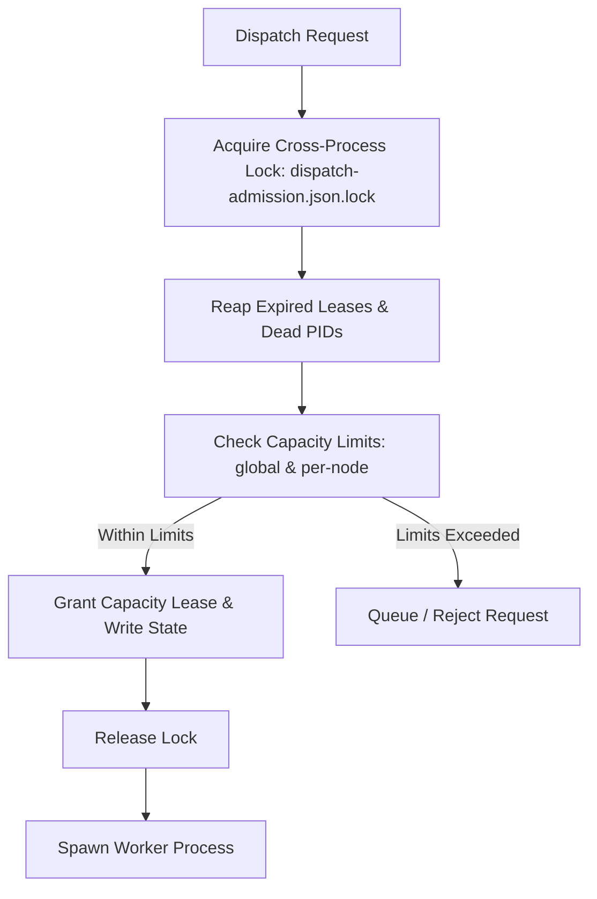

# Capacity Leases & Fleet Scheduling

This document specifies the multi-process capacity leasing protocols, node scheduling models, cross-process transaction locks, and failure recovery mechanics implemented in Clio Coder `v0.3.2`.

Source implementations: `src/domains/scheduling/` and `src/domains/dispatch/capacity-lease.ts`.

---

## 1. Capacity Model & Admission Invariants

Fleet dispatch manages compute resources across local and remote execution nodes as a unified capacity pool. Dispatched workers must acquire a durable capacity lease before they are spawned.



### State Storage & Format

All capacity state is stored in a single durable JSON file:

- **Path**: `<stateDir>/dispatch-admission.json` (`src/domains/dispatch/capacity-lease.ts:capacityStatePath()`)
- **Version**: `version: 2` (`CapacityStateFile`)
- **Transaction Lock**: `<stateDir>/dispatch-admission.json.lock` (`withStateFileLockSync`)

```typescript
export interface CapacityStateFile {
  version: 2;
  draining: CapacityDrain | null;
  leases: CapacityLease[];
  reservations: unknown[];
}
```

---

## 2. Capacity Lease Schema & TTLs

Each in-flight worker holds one `CapacityLease` (`src/domains/dispatch/capacity-lease.ts:18-29`):

```typescript
export interface CapacityLease {
  leaseId: string;              // Unique lease identifier
  assignmentId: string;         // Owning dispatch assignment ID
  nodeId: string;               // Execution node identifier ("local" or remote ID)
  ownerPid: number;             // Process ID of the orchestrator/worker owner
  processBirthToken: string;    // OS-level token preventing PID reuse collisions
  acquiredAt: string;           // ISO-8601 acquisition timestamp
  expiresAt: string;            // ISO-8601 expiration timestamp
  heartbeatAt: string;          // ISO-8601 last heartbeat timestamp
  reservationOwnerId: string | null;
  reservationMemberId: string | null;
}
```

### Constants & Operational Bounds

| Constant | Value | Description | Source Reference |
| :--- | :--- | :--- | :--- |
| `MAX_CAPACITY_LEASES` | `1000` | Hard cap on simultaneous active capacity leases across all nodes. | `src/domains/dispatch/capacity-lease.ts:8` |
| `DEFAULT_CAPACITY_LEASE_TTL_MS` | `30000` ms (30s) | Inactivity expiration window for leases without a refreshed heartbeat. | `src/domains/dispatch/capacity-lease.ts:9` |
| `DEFAULT_CAPACITY_DRAIN_TTL_MS` | `3600000` ms (1h) | Automatic expiration window for operator drain mode. | `src/domains/dispatch/capacity-lease.ts:16` |
| `NODE_DEATH_FAILURE_THRESHOLD` | `2` consecutive failures | Channel failure count before a remote node is classified offline. | `src/domains/scheduling/cluster.ts:64` |

---

## 3. Heartbeats & Dead-Process Recovery

To prevent leaked leases when workers or orchestrators crash:

1. **Heartbeat Protocol**: Active workers emit heartbeats over their control channel every 1,000 ms (`src/worker/heartbeat.ts`). The orchestrator updates `heartbeatAt` and extends `expiresAt` by `DEFAULT_CAPACITY_LEASE_TTL_MS`.
2. **PID Liveness & Birth Tokens**: The lease reconciler inspects `ownerPid` and validates `processBirthToken` against operating system process tables. If the PID has terminated or been recycled by the OS, the lease is immediately reclaimed.
3. **Lazy Reaping**: Every admission attempt purges expired leases and dead process records inside the cross-process transaction lock before calculating available capacity.

---

## 4. Cluster Drain & Emergency Control

The fleet can be drained for maintenance without terminating running jobs:

- **Drain Command**: `clio-coder fleet drain` sets `draining` in `dispatch-admission.json`.
- **Drain Invariant**: When draining is active, existing runs continue to completion, but all new dispatch admissions are refused with a drain notice.
- **Auto-Expiry**: To prevent an unmanaged lockup if a draining operator disconnects, the drain state automatically expires after `DEFAULT_CAPACITY_DRAIN_TTL_MS` (1 hour).
- **Resume Command**: `clio-coder fleet resume` clears the drain state immediately.

---

## 5. Fail-Closed Invariants

1. **Corrupted State File**: If `dispatch-admission.json` contains invalid JSON or schema violations, the admission engine fails closed, refusing new work until repaired.
2. **Lock Timeouts**: If the cross-process lock cannot be acquired within the timeout window, dispatch fails closed rather than executing uncoordinated parallel operations.
