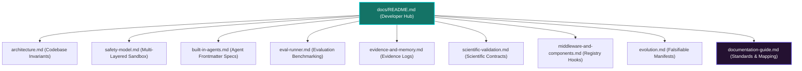

# Documentation Standards and Codebase Alignment

This document outlines the design principles, structural conventions, and direct codebase mappings of the **Clio Coder Developer Documentation Suite**. 

Clio Coder is built for high-performance and scientific engineering teams where correctness, safety boundaries, and reproducible traces are critical. To maintain the high quality of developer documentation as the platform evolves toward `v0.2.0` and beyond, all contributors (both human operators and AI coding agents) must adhere to these standards.

---

## 🗺️ Documentation to Codebase Mapping Matrix

To ensure documentation remains accurate and actionable, the table below maps each public documentation guide directly to the subsystem layers and directories in `src/`:

| Documentation Guide | Primary Subsystem Directory | Key Source Code References | Core Concept Enforced |
| :--- | :--- | :--- | :--- |
| **[README.md](README.md)** | `src/cli/`, `src/interactive/` | [src/cli/index.ts](file:///home/akougkas/iowarp/clio-coder/src/cli/index.ts) [src/interactive/TuiLoop.ts](file:///home/akougkas/iowarp/clio-coder/src/interactive/TuiLoop.ts) | Entrypoints, CLI commands, slash commands, TUI interactive panels, keyboard hotkeys. |
| **[architecture.md](architecture.md)** | `src/engine/`, `src/worker/` | [src/engine/PiBoundary.ts](file:///home/akougkas/iowarp/clio-coder/src/engine/PiBoundary.ts) [src/worker/WorkerEntry.ts](file:///home/akougkas/iowarp/clio-coder/src/worker/WorkerEntry.ts) | AST boundary checks, worker rehydration, event-driven decoupled event loops. |
| **[safety-model.md](safety-model.md)** | `src/domains/safety/` | [src/domains/safety/PolicyEngine.ts](file:///home/akougkas/iowarp/clio-coder/src/domains/safety/PolicyEngine.ts) [src/tools/ValidateFrontend.ts](file:///home/akougkas/iowarp/clio-coder/src/tools/ValidateFrontend.ts) | Sandbox levels (L3/L4/L5), path/tool policies, validation of frontend HTML/JS/CSS. |
| **[built-in-agents.md](built-in-agents.md)** | `src/domains/agents/` | [src/domains/agents/AgentRegistry.ts](file:///home/akougkas/iowarp/clio-coder/src/domains/agents/AgentRegistry.ts) [.agents/](file:///home/akougkas/iowarp/clio-coder/.agents/) | Fleet directory, frontmatter YAML specifications, agent capability maps. |
| **[eval-runner.md](eval-runner.md)** | `src/domains/eval/` | [src/domains/eval/EvalRunner.ts](file:///home/akougkas/iowarp/clio-coder/src/domains/eval/EvalRunner.ts) [src/domains/eval/Compare.ts](file:///home/akougkas/iowarp/clio-coder/src/domains/eval/Compare.ts) | YAML benchmark suites, taskId+repeatIndex matching, error taxonomies. |
| **[evidence-and-memory.md](evidence-and-memory.md)** | `src/domains/evidence/`, `src/domains/memory/` | [src/domains/evidence/Builder.ts](file:///home/akougkas/iowarp/clio-coder/src/domains/evidence/Builder.ts) [src/domains/memory/Curator.ts](file:///home/akougkas/iowarp/clio-coder/src/domains/memory/Curator.ts) | evidenceId logs, long-term memory lifecycle, token budget retrieval gates. |
| **[scientific-validation.md](scientific-validation.md)** | `src/domains/scheduling/` | [src/domains/scheduling/ScientificContract.ts](file:///home/akougkas/iowarp/clio-coder/src/domains/scheduling/ScientificContract.ts) [src/domains/scheduling/SlurmRunner.ts](file:///home/akougkas/iowarp/clio-coder/src/domains/scheduling/SlurmRunner.ts) | Scientific contracts, floating point ULP validation, Slurm/MPI schedules. |
| **[middleware-and-components.md](middleware-and-components.md)** | `src/domains/middleware/`, `src/domains/components/` | [src/domains/components/Scanner.ts](file:///home/akougkas/iowarp/clio-coder/src/domains/components/Scanner.ts) [src/domains/middleware/Pipeline.ts](file:///home/akougkas/iowarp/clio-coder/src/domains/middleware/Pipeline.ts) | Component scans, snapshot reloads, pure in-process declarative middleware hooks. |
| **[evolution.md](evolution.md)** | `src/domains/evolution/` | [src/domains/evolution/ChangeManifest.ts](file:///home/akougkas/iowarp/clio-coder/src/domains/evolution/ChangeManifest.ts) [src/domains/evolution/Evolve.ts](file:///home/akougkas/iowarp/clio-coder/src/domains/evolution/Evolve.ts) | ChangeManifest validation, regression risk mapping, progress tracking. |

---

## 🎨 Architectural Hierarchy of Documentation

The document suite is structured in a **flat directory hierarchy** to maximize ease of discovery and avoid nested RFC specs:

---

## 📋 Markdown Structural & Style Conventions

All files in the `docs/` directory must be optimized for readability and adhere to the following stylistic tokens:

### 1. The HSL Alert System
Use standard GitHub alert cards rather than unformatted notes. Keep their use focused on high-priority contexts:
> [!NOTE]
> Used for architecture insights, background context, and minor implementation tips.

> [!TIP]
> Used for optimizing code, streamlining dev setups, or best practices.

> [!WARNING]
> Used to highlight compilation invariants, type check requirements, or things that might break tests.

> [!CAUTION]
> Used to highlight major safety violations, sandbox leaks, or directory-deletion rules.

### 2. Tabular Data Representation
Never present large option sets or commands as raw paragraph text. Always use Markdown tables with clean structural alignment:
- Standard column styling: `| Column 1 | Column 2 |`
- Separators: `| :--- | :--- |` (left-aligned) or `| :---: | :---: |` (center-aligned).

### 3. Falsifiable Schema and JSON Definitions
Whenever describing configuration files (`.clio/safety.yaml`, `ChangeManifest.json`, or YAML evaluation tasks):
- Provide a full, copy-pasteable minimal example with comments.
- Explicitly define the mandatory fields, types, and defaults.

### 4. Interactive Mermaid Diagrams
To visualize logic, routing, event flows, and sandbox lifecycles:
- Use Mermaid diagram blocks (`mermaid` code identifier).
- Standardize on layout flow direction (`graph TD` or `sequenceDiagram`).
- Maintain visual harmony with styling tokens (e.g., custom node coloring).

---

## 🚀 How to Write and Modify Documentation

Whenever adding a feature, fixing a bug, or contributing to the codebase, follow these synchronization guidelines:

1. **Check the Matrix First**: Identify which documentation guide corresponds to the file you are modifying (refer to the [🗺️ Mapping Matrix](#🗺️-documentation-to-codebase-mapping-matrix) above).
2. **Synchronize Documentation in the Same PR**: Never let source code modifications drift from their associated documentation. Update code comments and documentation files in tandem.
3. **Validate Hyperlinks**: Ensure all internal Markdown links use relative flat paths (e.g., `[architecture.md](architecture.md)`) and all codebase file links use absolute paths to help developer editors locate them (e.g., `[Scanner.ts](file:///home/akougkas/iowarp/clio-coder/src/domains/components/Scanner.ts)`).
4. **Gitignore Internal planning documents**: Internal milestones, roadmaps, and scratchnotes belong in the `.superpowers/` internal directory which must always remain gitignored. The public `docs/` root is reserved exclusively for structured, developer-facing guidance.
