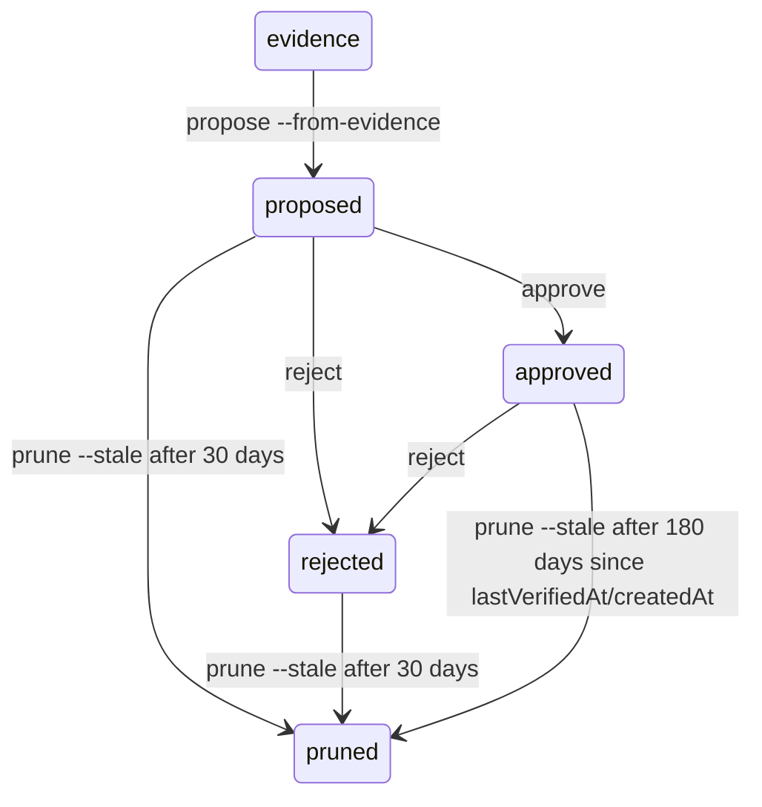

# Evidence Corpus and Long-Term Memory

> [!TIP]
> **Interactive Spec Available:** An interactive memory lifecycle dashboard and simulator is located at [docs/html/memory_blueprint.html](html/memory_blueprint.html) (Version: 0.2.3). Use it to design, validate, and simulate memory proposals, approval loops, pruning rules, and token budgets.

Clio Coder treats run claims and agent lessons as artifacts that should be inspectable. Evidence corpora are deterministic directories built from run ledgers, receipts, sessions, audits, and eval artifacts. Long-term memory records are local, evidence-linked, and only injected after explicit approval. Use [`/view`](observability.md) for interactive inspection of receipts, dispatch output, durable tool output, and compaction summaries before building or citing evidence.

Source of truth: `src/domains/evidence/**`, `src/domains/memory/**`, `src/cli/evidence.ts`, and `src/cli/memory.ts`.

---

## Evidence CLI

```bash
clio evidence build --run <runId>
clio evidence build --session <sessionId>
clio evidence build --eval <evalId>
clio evidence inspect <evidenceId>
clio evidence list
```

Evidence IDs are deterministic:

| Source | ID shape |
| --- | --- |
| Run | `run-<runId>` |
| Session | `session-<sessionId>` |
| Eval | `eval-<evalId>` |

Rebuilding the same evidence ID rewrites the same directory under `<dataDir>/evidence/`.

---

## Evidence directory layout

Run/session evidence files:

```text
<dataDir>/evidence/<evidenceId>/
├── overview.json
├── transcript.md
├── trace.raw.jsonl
├── trace.cleaned.jsonl
├── tool-events.jsonl
├── audit-linked.jsonl
├── receipt.json
├── protected-artifacts.json
├── findings.json
└── findings.md
```

Eval evidence adds `eval-result.json` and uses empty receipt/protected-artifact placeholders when no linked receipts exist.

### Core files

| File | Purpose |
| --- | --- |
| `overview.json` | Stable summary: source, runs, sessions, statuses, tasks, models, totals, tags, and file list. |
| `transcript.md` | Human-readable run/session/eval transcript. |
| `trace.raw.jsonl` | Raw run ledger/receipt/eval rows. |
| `trace.cleaned.jsonl` | Compact normalized rows plus findings. |
| `tool-events.jsonl` | Tool summaries from session entries, audit rows, receipts, or eval commands. |
| `audit-linked.jsonl` | Audit rows linked to run/session context when available. |
| `receipt.json` | Receipt bundle (`{ version: 1, receipts: [...] }`). |
| `protected-artifacts.json` | Protected artifact state/events. |
| `findings.json` / `findings.md` | Structured and readable findings. |

---

## Evidence tags

The closed tag set includes:

```text
audit-linked | audit-missing | best-effort-link | timeout | context-overflow |
provider-transient | missing-dependency | wrong-runtime | proxy-validation |
no-validation | destructive-cleanup | blocked-tool | protected-artifact |
tool-loop | test-failure | build-failure | cwd-missing | session-linked |
session-missing | auth-failure | unknown
```

Findings are `info` or `warn`; the builder does not call a model to summarize evidence.

---

## Memory CLI

```bash
clio memory list
clio memory propose --from-evidence <evidenceId>
clio memory approve <memoryId>
clio memory reject <memoryId>
clio memory prune --stale
```

Memory records live in:

```text
<dataDir>/memory/records.json
```

The store is capped at `500` records and is sorted by scope, key, creation time, and id for stable writes.

---

## Memory record lifecycle



Records must cite at least one evidence ID to be considered for prompt injection. Rejected records remain in the store until stale pruning so the same bad lesson is not immediately re-proposed from the same evidence.

---

## Prompt injection rules

The chat loop loads memory synchronously from the bounded local store and calls `buildMemoryPromptSection()`.

Defaults:

| Constraint | Default |
| --- | --- |
| Scopes | `global`, `repo` |
| Token budget | `400` estimated tokens |
| Max records | `5` |
| Required status | `approved: true` |
| Required provenance | At least one `evidenceRefs[]` entry |
| Suppression | Records with active `regressions[]` entries are skipped |

Rendered memory lines always cite record ID, scope, lesson, and evidence IDs. The prompt tells the model not to extrapolate beyond cited findings.

---

## Recommended workflow

1. Build evidence from the run/session/eval that taught the lesson.
2. Inspect the evidence and findings.
3. Propose memory from the evidence.
4. Review the proposed lesson for correctness and scope.
5. Approve only if it is durable and useful.
6. Reject incorrect or overbroad records.
7. Prune stale records periodically.

Memory is meant to reduce repeated mistakes, not to become an unreviewed second instruction system.
