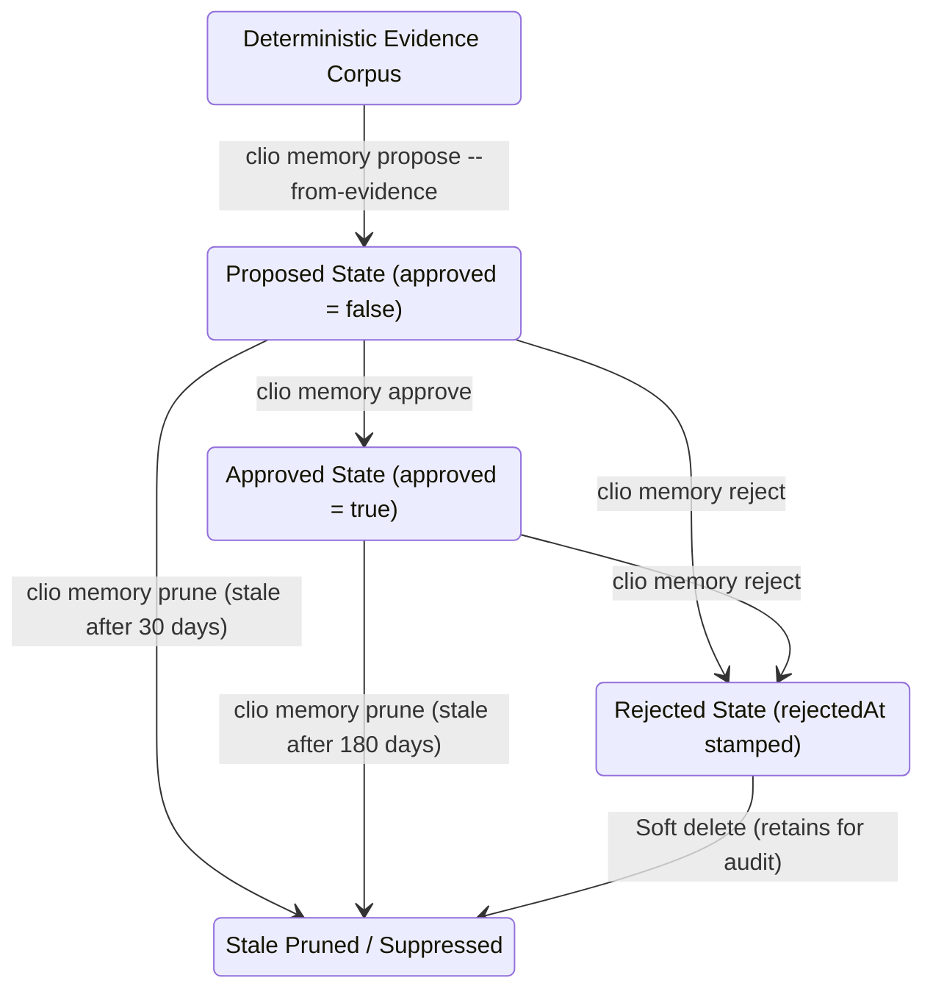

# Clio Coder Evidence Corpus & Long-Term Memory

Clio Coder treats AI agent lessons as verifiable assets. Lessons must be backed by **deterministic evidence** and are gated by **explicit human review** before being saved to long-term memory. This ensures that agent memory contains only operator-approved facts, preventing hallucinations or outdated instructions from leaking into active prompt windows.

---

## 📂 The Deterministic Evidence Corpus

Every execution run, session compile, or evaluation run gathers its output files, receipts, and audit rows into a single, sandboxed evidence directory identified by a unique **`evidenceId`**.

### Evidence Corpus Layout:
```text
<dataDir>/evidence/<evidenceId>/
├── overview.json           # stable overview of models, run status, and totals
├── transcript.md          # clean Markdown transcript of the entire session
├── trace.raw.jsonl        # raw sequence of internal execution events
├── trace.cleaned.jsonl    # cleaned traces (omitting extremely large outputs)
├── tool-events.jsonl      # isolated sequence of tool calls and exit codes
├── audit-linked.jsonl     # safety audit rows mapped to their exact run IDs
├── receipt.json           # deep copy of the original signed run receipt
├── findings.json          # structured warnings and integrity failures
└── findings.md            # human-readable report of warnings/failures
```

### Deterministic Invariants:
1. **Model-free extraction:** The evidence builder does not query any AI model to summarize logs. It parses files, aggregates counters, and extracts warnings in-process. Two builds from the same raw logs produce identical byte-for-byte evidence files.
2. **Stable ID mapping:** The `evidenceId` is derived from the source type and its unique ID. Rebuilding a corpus overwrites the previous folder instead of creating duplicates.
3. **Closed failure tags:** Run details are evaluated against a closed list of failure classifications (e.g., `timeout`, `context-overflow`, `wrong-runtime`, `destructive-cleanup`, `blocked-tool`, `auth-failure`, `protected-artifact`).

---

## 🧠 The Long-Term Memory Domain

Long-term memories are repository-wide lessons captured from successful or failed runs. Approved memories are injected dynamically into prompt templates.

### Data Layout:
Memory records reside in a single JSON document:
```text
<dataDir>/memory/records.json
```
The file is capped at `MEMORY_STORE_MAX_RECORDS = 500`. Records are sorted on write by `(scope, key, createdAt, id)` to keep the file format stable and git-merge friendly.

---

## 🔄 Memory Record Lifecycle

The lifecycle of a memory record relies entirely on operator intervention:



### 1. Proposal (`proposed` status)
Developers propose a memory record from a completed evidence run:
```bash
clio memory propose --from-evidence <evidenceId>
```
The builder analyzes the evidence findings and drafts a candidate record with `approved: false`. This step is idempotent; repeated calls update the existing proposal rather than creating duplicates.
> [!IMPORTANT]
> **Evidence Link Constraint:** A memory record must cite at least one valid `evidenceId` in its `evidenceRefs[]` list. Records without linked evidence references are filtered out and are never injected into prompts.

### 2. Operator Approval (`approved` status)
An operator inspects the proposed record via `clio memory list` and promotes it to active:
```bash
clio memory approve <memoryId>
```
This flips `approved` to `true`, stamps `lastVerifiedAt`, and clears any previous rejection markers.

### 3. Rejection (`rejected` status)
If a record is incorrect, the operator blocks it:
```bash
clio memory reject <memoryId>
```
This sets `approved` to `false` and stamps `rejectedAt`. Rejections are kept in-store to prevent the system from re-proposing the same bad lesson from the same evidence ID.

### 4. Dynamic Prompt Retrieval Constraints
During a run, approved memories are queried and injected into the dynamic `memory.dynamic` prompt slot under strict resource constraints:
- **Default Scopes:** The query retrieves records scoped to `["global", "repo"]`. Other scopes (e.g., `hpc-domain`, `runtime`, `language`) are opted into per call site.
- **Hard Token Budget:** The total memory injection section is capped at **400 tokens**.
- **Hard Count Cap:** A maximum of **5 memory records** can be injected in one turn.
- **Suppression:** If a memory has any active entries in its `regressions[]` list, retrieval suppresses it.

### 5. Staleness Pruning
To prevent memory bloat, old records are pruned via `clio memory prune --stale`:
- **Unapproved records:** Stale and pruned 30 days after `createdAt`.
- **Approved records:** Stale and pruned 180 days after their `lastVerifiedAt` timestamp (meaning they must be verified or refreshed twice a year).
