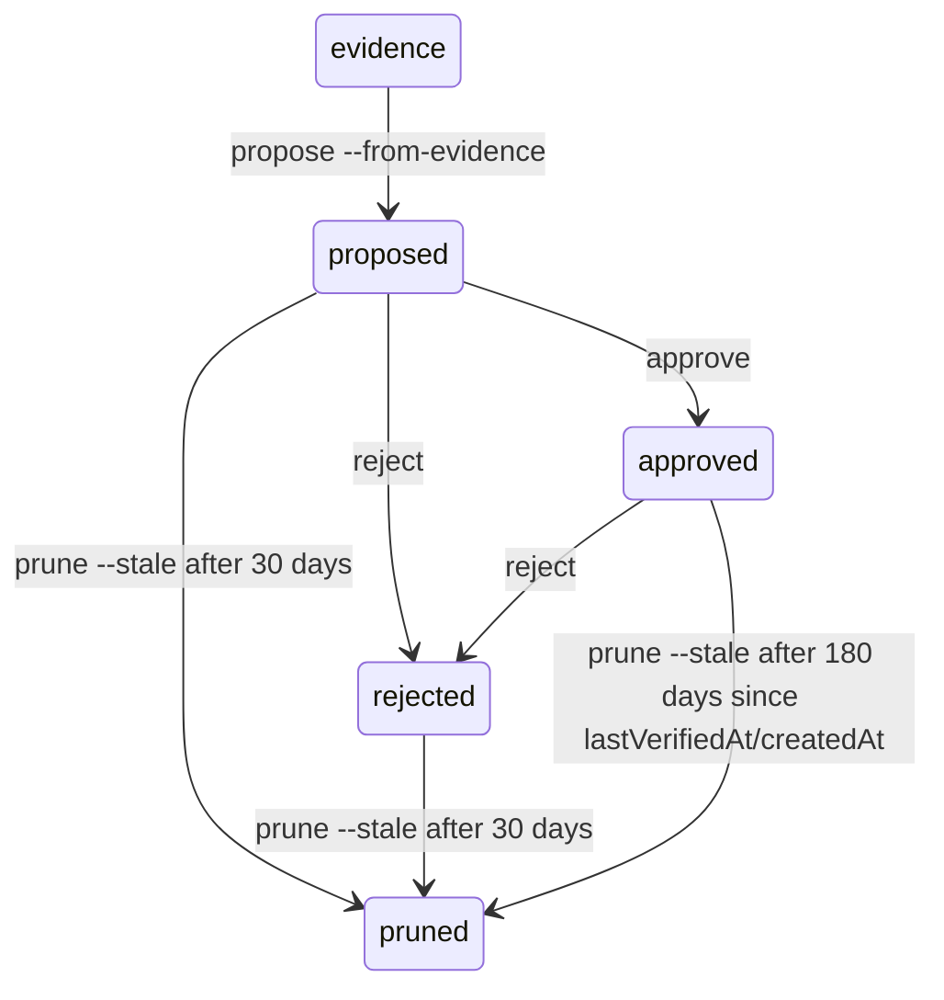

# Evidence Corpus and Long-Term Memory

> [!TIP]
> **Interactive Spec Available:** An interactive memory lifecycle dashboard and simulator is located at [docs/html/memory_blueprint.html](html/memory_blueprint.html) (Version: 0.3.1). Use it to design, validate, and simulate memory proposals, approval loops, pruning rules, and token budgets.

Clio Coder treats run claims and agent lessons as structured artifacts to support reproducibility and scientific provenance. In evaluations such as [SWE-bench](https://www.swebench.com), capturing granular execution evidence is essential for validating agent claims. Evidence corpora are deterministic directories built from run ledgers, receipts, sessions, audits, and eval artifacts. In v0.3.1, forensic evidence auto-builds on dispatch run completion: when a run finalizes, the observability domain automatically compiles the evidence bundle under `<dataDir>/evidence/run-<id>/` and updates a compact sidecar index row in `<stateDir>/evidence-index.json`. Long-term memory records are local, evidence-linked, and only injected after explicit approval. Use the TUI [`/view`](observability.md) command for interactive inspection of receipts, dispatch output, durable tool output, compaction summaries, and session accountability before building or citing evidence.

Source of truth: `src/domains/evidence/**`, `src/domains/memory/**`, `src/cli/evidence.ts`, and `src/cli/memory.ts`.

---

## Evidence CLI

```bash
clio-coder evidence build --run <runId>
clio-coder evidence build --session <sessionId>
clio-coder evidence build --eval <evalId>
clio-coder evidence inspect <evidenceId>
clio-coder evidence list
```

`clio-coder evidence inspect <id>` requires a valid evidence artifact ID. If the requested artifact does not exist on disk, it outputs `error: evidence artifact not found: <id> (see clio-coder evidence list)` and exits with code 1.

Evidence IDs are deterministic:

| Source | ID shape |
| --- | --- |
| Run | `run-<runId>` |
| Session | `session-<sessionId>` |
| Eval | `eval-<evalId>` |

Rebuilding the same evidence ID rewrites the same directory under `<dataDir>/evidence/`.


---

## Evidence directory layout

Run/session evidence files:

```text
<dataDir>/evidence/<evidenceId>/
├── overview.json
├── transcript.md
├── trace.raw.jsonl
├── trace.cleaned.jsonl
├── tool-events.jsonl
├── audit-linked.jsonl
├── receipt.json
├── gate-decisions.json
├── protected-artifacts.json
├── findings.json
└── findings.md
```

Eval evidence adds `eval-result.json` and uses empty receipt/protected-artifact placeholders when no linked receipts exist.

### Core files

| File | Purpose |
| --- | --- |
| `overview.json` | Stable summary: source, runs, sessions, statuses, tasks, models, totals, tags, and file list. |
| `transcript.md` | Human-readable run/session/eval transcript. |
| `trace.raw.jsonl` | Raw run ledger/receipt/eval rows. |
| `trace.cleaned.jsonl` | Compact normalized rows plus findings. |
| `tool-events.jsonl` | Tool summaries from session entries, audit rows, receipts, or eval commands. |
| `audit-linked.jsonl` | Audit rows linked to run/session context when available. |
| `receipt.json` | Receipt bundle (`{ version: 1, receipts: [...] }`); only receipts that pass integrity verification contribute verified fields. |
| `gate-decisions.json` | Integrity-verified review verdicts, compete winner selections, and winner confirmations discovered from linked receipt ids. |
| `protected-artifacts.json` | Protected artifact state/events. |
| `findings.json` / `findings.md` | Structured and readable findings. |

### Run attribution under concurrency

Session ledger entries are attributed to a run by the run id the producer stamped on the entry at write time. Rows built from those entries carry that provenance in a `runLink` field (`{ kind, confidence, candidateRunIds? }`) in `tool-events.jsonl` and `protected-artifacts.json`; a write-time stamp is `kind: "entry-run-id"`, `confidence: "exact"`. Entries written without run context fall back to timestamp windowing, labeled `kind: "timestamp-window"`, `confidence: "best-effort"`, and printed as `link=timestamp-window` in the transcript. Concurrent dispatch runs share one clock and their windows overlap, so an entry inside more than one window has no owner the bundle can name. Such an entry is reported in the bundle of every run it may belong to, with `runId: null`, `kind: "ambiguous-timestamp-window"`, and a `candidateRunIds` list, plus a `best-effort-link` finding counting them. It is never dropped and never claimed as exact.

When a run was chained (pipeline), composed with a persona override, or escalated for a permission, `transcript.md` and `trace.cleaned.jsonl` surface the receipt's provenance field sets, and `clio-coder evidence inspect` prints them as a `provenance <runId>:` block. The field paths, types, and stability labels are documented in the [receipt provenance schema](./observability.md#receipt-fields-for-dispatch-provenance).

---

## Evidence Tag Taxonomy and Failure Causes

Clio Coder classifies every run, session, and eval record using a closed set of 25 canonical tags. These tags distinguish general execution characteristics (such as lineage linkages) from actual failure causes.

### Complete Taxonomy

| Tag | Category | Trigger / Meaning |
| --- | --- | --- |
| `audit-linked` | Provenance | Audit logs successfully linked to this run or session. |
| `audit-missing` | Provenance | No matching audit logs were found. |
| `best-effort-link` | Provenance | Inspection commands or logs linked via heuristics. |
| `timeout` | Failure | Execution exceeded the maximum duration limit. |
| `context-overflow` | Constraint | Model context limit was exceeded. |
| `provider-transient` | Transient | Temporary API or model gateway connection error. |
| `missing-dependency`| Failure | Python, Node, or system package dependency was missing. |
| `wrong-runtime` | Configuration | Execution failed due to incorrect compiler or runtime environment. |
| `proxy-validation` | Validation | Weak validation (e.g. only file-presence check rather than execution). |
| `no-validation` | Validation | Succeeded turn or run did not execute any verification commands. |
| `destructive-cleanup`| Precaution | Clean-up rules triggered to prevent workspace pollution or damage. |
| `blocked-tool` | Failure | The safety net blocked a tool call requested by the model. |
| `escalation` | Precaution | A worker permission escalation timed out or was denied; see the receipt provenance schema below. |
| `receipt-integrity` | Security | Forensic verification detected receipt modification or checksum mismatch. |
| `protected-artifact`| Precaution | Mutating a path protected by project or system safety policies. |
| `tool-loop` | Constraint | The model repeatedly called the same tool with identical arguments. |
| `test-failure` | Failure | A verification command containing test/lint keywords exited non-zero. |
| `build-failure` | Failure | A verification command containing build keywords exited non-zero. |
| `cwd-missing` | Configuration | The directory target specified for execution did not exist. |
| `session-linked` | Provenance | The run is linked back to its originating parent session. |
| `session-missing` | Provenance | No parent session could be resolved for this run. |
| `auth-failure` | Failure | Missing or invalid credentials/API keys. |
| `external-bypass` | Security | An external runner bypassed standard safety gates. |
| `external-approximation`| Validation | An external runner approximated results rather than fully executing. |
| `unknown` | Undefined | Unclassified execution failure. |

---

### Failure-Cause Tag Subset

A subset of the taxonomy represents actual failure causes (governed by the `FAILURE_CAUSE_TAG_ORDER` array). These are the only tags included in the receipt summaries and TUI observability histograms:

1. **`timeout`**: Triggered if the run outcome is `"timed_out"` or `"stalled"`, or if the error/failure text contains `"timed out"` or `"timeout"`.
2. **`auth-failure`**: Triggered if failure text contains keywords like `"auth"`, `"api key"`, `"credential"`, or `"unauthorized"`.
3. **`missing-dependency`**: Triggered if failure logs contain `"module not found"`, `"missing package"`, or `"missing dependency"`.
4. **`build-failure`**: Triggered in receipt summaries when a non-zero receipt exit is paired with build tool names in `toolStats` (e.g. `build`, `compile`, `make`, `cmake`, `cargo`, `gradle`, `ninja`, `tsc`). Forensic evidence can also classify a non-zero run from build language in the recorded task text.
5. **`test-failure`**: Triggered in receipt summaries when a non-zero receipt exit is paired with test or lint tool names in `toolStats` (e.g. `pytest`, `ctest`, `jest`, `vitest`, `test`, `lint`, `typecheck`). Forensic evidence can also classify a non-zero run from validation language in the recorded task text.
6. **`blocked-tool`**: Triggered if tool execution statistics show a blocked count greater than `0`.

---

## Receipt findingsSummary

Each run receipt (persisted under `<stateDir>/receipts/<runId>.json`) carries an optional `findingsSummary` block. This block provides a cheap, integrity-covered summary of the run's findings:

```json
"findingsSummary": {
  "tags": ["test-failure"],
  "firstPassSuccess": false,
  "findingCount": 1
}
```

### Computation and Lifecycle
- **Circular Dependency Prevention**: To prevent circular dependencies, `findingsSummary` is calculated **cheaply in-memory** at receipt-record time using the draft envelope and tool statistics (in `src/domains/dispatch/receipt-findings.ts`). It never reads from disk or calls `buildEvidence`.
- **First-Pass Success**: Calculated as `true` only if the terminal outcome was `"succeeded"`, the lineage attempt was `0` (no dispatch retries), the tool stats confirm at least one successful validation tool was executed, and no failure-cause tags were detected.
- **Cryptographic Coverage**: Current receipts use strict v15 and authenticate every current receipt field, including briefing and steering provenance, routing intent and decision, route quality, worker identity, execution role, and result-contract conformance, against the reconstructed ledger. Every version other than v15 is rejected; there is no historical receipt reader.

| Version | Verification policy | Compatibility policy |
|---|---|---|
| v15 | Current canonical projection; every current receipt and reconstructible ledger field is authenticated | Accepted |
| Any other version | No reader | Rejected; remove or archive the incompatible state rather than expecting migration |

Receipt integrity and evidence verification answer different questions. The
former proves that a receipt matches its ledger envelope; the latter records
whether applicable validation evidence was observed. Briefing provenance is
also distinct from bounded project-context provenance: both can be absent or
present independently, and neither hash is evidence for the other.

### Mutation-Report Grounding

Mutation-report receipts are grounded directly against observed tool events recorded in the run ledger:
- When a worker run concludes, claimed modified files are validated against the actual write set observed from `edit` and `write` tool invocations.
- If a target file was untouched during the run but already existed on disk, the result contract seals route quality as `unmeasured` rather than `fail`.
- If a write attempt was refused or denied, mutation validation marks the outcome as `unmeasured`.
- If an unattempted mutation target does not exist on disk, postcondition validation fails.

---


## Memory CLI

```bash
clio-coder memory list
clio-coder memory propose --from-evidence <evidenceId>
clio-coder memory approve <memoryId>
clio-coder memory reject <memoryId>
clio-coder memory prune --stale
```

Memory records live in:

```text
<dataDir>/memory/records.json
```

The store is capped at `500` records and is sorted by scope, key, creation time, and id for stable writes.

---

## Memory record lifecycle


```mermaid
stateDiagram-v2
    evidence --> proposed: propose --from-evidence
    proposed --> approved: approve <id>
    proposed --> rejected: reject <id>
    approved --> rejected: reject <id>
    proposed --> pruned: prune --stale after 30 days
    rejected --> pruned: prune --stale after 30 days
    approved --> pruned: prune --stale after 180 days since lastVerifiedAt/createdAt
```

Records must cite at least one evidence ID to be considered for prompt injection. Rejected records remain in the store until stale pruning so the same bad lesson is not immediately re-proposed from the same evidence.

---

## Prompt injection rules

The chat loop loads memory synchronously from the bounded local store and calls `buildMemoryPromptSection()`.

Defaults:

| Constraint | Default |
| --- | --- |
| Scopes | `global`, `repo` |
| Token budget | `400` estimated tokens |
| Max records | `5` |
| Required status | `approved: true` |
| Required provenance | At least one `evidenceRefs[]` entry |
| Suppression | Records with active `regressions[]` entries are skipped |

Rendered memory lines always cite record ID, scope, lesson, and evidence IDs. The prompt tells the model not to extrapolate beyond cited findings.

### Repository-scoped identity

Repository memory is selected by an exact canonical absolute-path identity. The interactive orchestrator and `clio-coder run --agent` compute that identity from the active working directory; symlink aliases collapse to the same key. A repository move, a different Git worktree path, a subdirectory launch, a malformed identity, or a missing identity does not inherit another repository's memory. Global records are unaffected.

Every `scope: "repo"` record must carry:

```json
"repository": { "kind": "canonical-path", "key": "/canonical/absolute/repository/path" }
```

The structured `repository` field is the only applicability mechanism: store validation rejects repo records without it, and `appliesWhen` tokens never grant repository applicability. There is intentionally no automatic path rewrite for moved repositories or worktrees: a filesystem move produces a different identity and the record simply stops applying until it is re-scoped with new evidence.

---

## Recommended workflow

1. Build evidence from the run/session/eval that taught the lesson.
2. Inspect the evidence and findings.
3. Propose memory from the evidence.
4. Review the proposed lesson for correctness and scope.
5. Approve only if it is durable and useful.
6. Reject incorrect or overbroad records.
7. Prune stale records periodically.

Memory is meant to reduce repeated mistakes, not to become an unreviewed second instruction system.
