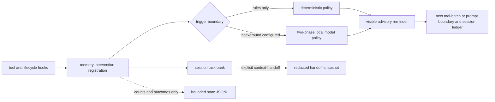

# Proactive task memory

The [evidence and memory contract](../architecture/evidence-and-memory.md) explains durable memory records and their provenance.

After a durable context reduction, restoration uses a commit-scoped offer: stale content jobs and buffered reminders lose authority, known usage remains attributed, and restoration is consumed only after an admitted installation. See [Context continuity and recovery](context-continuity.md) for the lifecycle and its limits.

Clio's proactive task memory records requirements, environment facts, failed
attempts, and diagnoses in bounded session banks. Rules and an optional model
step select visible reminders at tool or turn boundaries. The design follows
Wu et al., *Remember When It Matters: Proactive Memory Agent for Long-Horizon
Agents* (2026), adapted to Clio's middleware and model routing.

The rules-only tier is enabled by default and makes no model calls. An LLM memory
tier is opt-in through the independent `context.memory.target` and
`context.memory.model` route. The action agent's system prompt and tool surface
do not change, and disabling `context.memory.enabled` removes observation, bank
writes, model resolution, reminders, handoff offers, and handoff seeding.

## Inspect or configure memory

| You want to… | Use |
| --- | --- |
| Inspect the bank and recent memory steps | `/memory` |
| Select a background model or change memory controls | `/settings` → **Context & Memory** |
| Review recorded cost | `/usage` or `clio-coder usage report` |
| Look up the default values and routing example | [Operator setup](#operator-setup) |
| Understand what survives a handoff | [Handoff continuity](#handoff-continuity) |

## Architecture



The task bank is in `src/domains/memory/` and belongs to one live session. It is
separate from both durable approved lessons and the regenerable repository
context engine.

- **Private status** is the memory policy's short progress model. Inspect it
  with `/memory`. It stays out of ordinary reminders, the memory model's bank
  input, and handoffs. After compaction, Clio can include it in the restored
  state sent to the action agent.
- **Knowledge** contains stable task facts such as requirements, paths,
  environment facts, and constraints.
- **Procedural memory** contains attempts and outcomes such as failed commands,
  ruled-out hypotheses, diagnoses, and fixes that worked.

Knowledge and procedural entries have stable short IDs. A visible reminder is
one `Memory:` advisory block and records the cited entry IDs' injection counts.

The existing middleware path delivers that block at the first boundary that can
carry it, which is either a native tool-batch boundary inside the running turn or
the next accepted prompt, and persists its attribution in the session ledger.
There is no hidden `transformContext` injection.

## Paper mapping and Clio constraints

| Paper mechanism | Clio implementation |
| --- | --- |
| Separate memory agent | One stateful middleware registration beside the unmodified action agent |
| Status, knowledge, and procedural bank | Bounded in-memory `TaskMemoryBank`; status stays out of every reminder except the post-compaction restore |
| Phase 1 bank maintenance | Strict `update_status`, `save_knowledge`, `save_procedural`, and `delete` operations |
| Phase 2 intervene or stay silent | One advisory `inject_reminder` effect or explicit silence |
| Fixed memory cadence | Deterministic decay signals plus a coarse interval floor |
| Learned intervention calibration | Structural authority gate: spontaneous reminders must cite a bank entry; deterministic triggers may be uncited |

<details>
<summary>The two-line envelope grammar and what the parser tolerates</summary>

Model output uses a strict two-line grammar parsed by [task-memory-policy.ts](../../src/domains/memory/task-memory-policy.ts):

```text
<operations>[{"op":"update_status","content":"Tracking the current requirement."}]</operations>
<no_intervention/>
```

When a visible reminder cites an existing bank entry, the second line uses:
```text
<operations>[]</operations>
<context_for_action>Restored requirement [tm-k-1]</context_for_action>
```

Knowledge and procedural saves use `{"op":"save_knowledge","content":"..."}` or
`{"op":"save_procedural","content":"..."}`; an `id` is only valid when updating
an existing entry.

The parser locates the envelope within a response instead of requiring an
exact byte-for-byte match. A markdown fence, a `<think>` block, a leading "Here is my
step:", a closing pleasantry, and a pretty-printed multi-line operations array
are all accepted. Two shapes are read conservatively rather than generously:

- A response with no phase-two line at all is silence, since silence is the
  prompt's documented default. Its phase-one writes still apply. An envelope
  truncated mid-reasoning yields nothing at all.
- Tag shapes are stripped from the reminder before it is emitted, so the memory
  model cannot close the `<system-reminder>` block it rides inside. Ordinary
  comparisons and arrows survive.

Operations are validated structurally as a batch. A malformed entry or more
than eight operations rejects the whole list without changing the bank.
For a valid list, two recoverable cases are handled per operation:

- A `save_knowledge` or `save_procedural` ID that names no entry of that class
  creates a new entry; a `delete` of an unknown ID is dropped.
- An unrecognized `op` is dropped while recognized operations remain eligible.
  A list with no recognized operations records `malformed`.

Phase 1 writes remain valid when Phase 2 is gated or yields to a deterministic
reminder; an over-budget reminder is recorded as `gated` and suppressed rather
than discarding the writes that came with it. A timeout, provider failure,
malformed response, or telemetry failure is silent and never blocks a tool.

</details>

### Intervention defaults and cadence
- `context.memory.enabled` (default `true`): Enables observation, task bank writes, and reminder injection.
- `context.memory.cadenceToolCalls` (default `10`): Minimum completed-tool interval between background interventions.
- `context.memory.trajectorySteps` (default `8`): Completed tool-trajectory window analyzed during background evaluation.
- `context.memory.maxOutputTokens` (default `2000`): Bounds the rendered memory-bank context and the ordinary policy-model completion. An always-on-thinking model receives additional reasoning headroom, at least `4,000` tokens when its model cap permits, so it can still reach the strict envelope.
- `context.memory.timeoutMs` (default `60000`): Wall-clock limit for one background memory-policy step, including its one permitted chat fallback attempt. The step is detached, so this deadline never delays a turn, but it does hold a request slot on a real inference endpoint that your own turns and dispatched workers queue against. Raise it only after inspecting the timeout and hit-rate evidence for the selected route.

## Trigger semantics

Memory does not call a model after every tool. Signals accumulate and coalesce at
a turn-end boundary; at most one prompted step is started for that boundary, and
it runs detached from it.

| Trigger | Behavior |
| --- | --- |
| Interval | After `context.memory.cadenceToolCalls` completed tools since the last prompted step; default 10. This is the nondeterministic/citation-gated path. |
| Tool-error streak | Two consecutive error outcomes. A successful tool resets the streak. Memory stays silent for a turn whose operator message asks for a repeat (`again`, `twice`, `retry`, `re-run`, `once more` and similar), because the repeat is the task, so that turn gets neither this trigger nor the repeated-failure annotation. |
| Loop signal | Reuses the orchestrator loop guard's verdict; it does not infer a second competing loop detector. |
| Repeated failure | The rules tier records failed operation fingerprints and annotates the failing tool result once the same failure appears twice in the bounded trajectory. |
| Post-compaction | The first turn start after compaction restores status and knowledge once, without a model call, because compaction is precisely where execution facts leave the active window. |

### Two delivery channels

A turn boundary is the wrong place to warn about a failure that happened forty
tool calls earlier in the same turn, because the reminder cannot reach the model
until the operator submits again. Memory therefore has two channels, and each
repeated failure uses exactly one of them:

- **Mid-turn annotation.** The second identical failure appends one cited
  `Memory:` advisory to that tool's own result, through the existing
  `annotate_tool_result` effect the loop guard already uses. The advisory uses
  the canonical result-disposition digest when one is available. Older hook
  producers fall back to the first tool-error line that names a problem. Every
  digest is redacted and byte-capped before it reaches the task bank. The model
  reads the advisory on its very next round. This is spent once per operation
  fingerprint per turn and re-earned in a later turn, because the same command
  failing again after an operator turn is news again.
- **Next-turn and tool-batch reminders.** Post-compaction reactivation and background-model
  reminders ride the `inject_reminder` buffer into the visible `<system-reminder>` block
  and persist in the session ledger. During active multi-tool execution loops, deferred
  reminders from completed background evaluations can also drain at native tool-batch
  boundaries (`prepareToolContinuation`), injecting actionable guidance between tool
  iterations without waiting for the operator to submit a new prompt. Reminders for
  aborted turns are dropped.

A boundary that already spoke through the annotation stays silent at turn end and
records one telemetry row, not two.

## Background steps never hold a turn open

`evaluateAsync` starts a detached model step and returns immediately. When the
step resolves, its reminder joins the deferred-reminder buffer and drains at the
next boundary that can carry it: a native tool-batch boundary if the session is
still executing tools, otherwise the next accepted prompt.

Two consequences follow:

- At most one background step is alive per session. A boundary that arrives while
  a step is still running is dropped rather than queued, so a model slower than
  the turns that trigger it can never build a backlog. The drop is recorded as
  its own telemetry row, because a cadence starved by a slow route and one that
  simply never triggered are otherwise identical in the step log. Its triggers
  stay pending, so the next free boundary still runs for them.
- A reminder can arrive one turn later than the trajectory that earned it. The
  rules tier is unaffected and stays synchronous, so deterministic protection
  keeps its original timing.

`/memory` shows whether a step is in flight, and the footer's memory row shows
`working` while one is running.

A prompted reminder over a trajectory that contains a failed tool call needs evidence
of a repeat: one operation fingerprint seen at least twice with an error among them, not
counting a `read` of a guessed path that does not exist. Without that, and without
restoring an unchanged bank fact, the step is recorded as `gated` with reason
`no_repeated_failure` and stays invisible.

The error-streak, loop, repeated-failure, and post-compaction paths are
deterministic. A prompted reminder from one of those paths may be uncited. An
interval-only prompted reminder must cite at least one current knowledge or
procedural ID or it is recorded as `gated` and remains invisible.

### Outcome semantics

The `/memory` overlay displays `last <decision>`, the combined outcome of the most
recent actual memory boundary. A **memory boundary** evaluates newly completed
tools or an explicit deterministic trigger, such as an interval, error streak, or
loop signal. Model-backed evaluation can run at a settled native tool-batch
boundary as well as at turn end.

A no-tool middleware continuation is another turn-end with no new tools since the
previous boundary, so it is not a new memory boundary and does not replace the
prior outcome. `last` therefore remains `injected` across such continuations until
a later tool-bearing or explicitly triggered step produces a new outcome, such as
a healthy tool leading to `silent`.

## Cost and defaults

The rules tier is enabled by `context.memory.enabled` and makes no model calls.
The LLM tier is opt-in through `context.memory.target` and
`context.memory.model`; an unset background role does not resolve a client.
Its default timeout is `context.memory.timeoutMs: 60000`.

Each model step contributes a cost entry under `background-memory`, shown as
`memory steps` in `/usage`, and a durable token-usage and cost row in
`<stateDir>/usage/out-of-turn.jsonl`. `clio-coder usage report` includes those rows
after the process exits. `/memory` summarizes `steps.jsonl`: steps, tokens, model
time, and the proportion of steps that produced reminders.

A step shares the resolved endpoint's request capacity. When known occupancy
exhausts that capacity, the step is skipped with reason `endpoint_busy`. A shared
gateway URL alone does not imply one request slot or one physical server.

### Dedicated routing, chat fallback and endpoint capacity

Clio prefers the explicitly configured memory target and model, uses the active
chat route when that one is known unavailable, and skips the step entirely when
the endpoint has no request capacity left.

<details>
<summary>Exactly which failures permit a chat attempt, and how capacity is counted</summary>

If the dedicated route is
known unavailable (missing target/runtime, down target, absent model in a known
catalog, or a model reported unloaded/loading), Clio selects the active chat
route for that step. A runtime client error on the dedicated route permits one
chat attempt within the original remaining deadline. It does not retry after a
timeout, cancellation, session/branch switch, malformed envelope, or a model's
explicit silence. The fallback never falls back again. Both routes unavailable
produce a visible `client_error` outcome. An unset memory role remains rules-only;
chat fallback does not enable model-based memory by default.

A runtime notice names the selected chat fallback and its reason. Routing stays
session-local and does not edit saved settings. Each attempted call records its
own known usage under its actual target/model and emits its own telemetry outcome;
failed dedicated usage is retained alongside fallback usage. The final policy
result describes the final attempt, without merging different provider identities.
A generation change discards late content while preserving the original usage owner.

Capacity follows the same existing evidence as dispatch: explicit target
`maxConcurrentRequests`, current discovery, a valid discovery prior, then the
conservative one-slot default for a local-native runtime. Known occupancy includes
this process's foreground requests, active dispatch leases and held reservation
waves. A two-slot endpoint with one foreground request can admit memory; a full
one-slot endpoint skips it. Known dedicated saturation does not itself initiate
chat fallback. Larger declared capacities work without a new constant.

LiteLLM is a gateway protocol, so Clio does not invent a local one-slot limit for
its URL. Distinct model routes can share that gateway URL (for example, separate
chat and memory target profiles pointing to the same LiteLLM proxy); the gateway
owns their physical routing and backend residency. An explicit or observed
endpoint-wide bound still applies when present. Clio's process-local foreground
holds and observed dispatch state are not a global scheduler for every client
using the gateway. Slot holds are released on success, failure and abort.

The existing `background_memory` expected-cold stamp remains keyed by endpoint
URL. It records a possible shared-endpoint cache disturbance, including after a
failed request, rather than proving that a different model behind the gateway
actually evicted the chat prefix.

</details>

## Choosing a background model

Memory reads a trajectory and writes a bounded envelope. A small model can reduce
latency and resource use. Clio requests thinking off for the memory route; memory
settings version 2 has no configurable thinking-level key.

The off request depends on runtime and model metadata: llama.cpp reads
`chat_template_kwargs.enable_thinking`, and LM Studio reads `reasoning_effort`,
with the off value selected by model family. A gateway needs a recognized,
unanimous upstream runtime declaration to establish the request dialect.

Servers may still return reasoning. The catalog marks always-on reasoning models
as `forced`, including `qwopus3.5-9b-v3`. The parser discards reasoning blocks and
keeps the envelope; the output budget allows room for a reasoning preamble.

No memory model is selected by default. The role uses the same target machinery
as chat and workers, so its model can be local, remote, or shared with chat when
request capacity permits. Local co-residency requires the models, KV caches, and
parallel slots to fit available memory.

## Operator setup

The shipped defaults are:

```yaml
context:
  memory:
    enabled: true
    target: null
    model: null
    cadenceToolCalls: 10
    trajectorySteps: 8
    maxOutputTokens: 2000
    timeoutMs: 60000
```

With `context.memory.target` and `context.memory.model` unset, Clio stays in the
zero-cost rules tier.

`/memory` shows the current tier, last decision, approved durable lessons, the
live bank, and a bounded history of the last twenty memory steps with their
trigger, decision, write count, cited-entry count, tier, and latency. That
history is the only place a capture, a gate, or a timeout becomes visible, since
those outcomes produce no transcript entry by design and only an actual injection
reaches the transcript. It carries counts and outcomes only, never bank or
trajectory text.

`/settings` exposes controls for every key above, with shorter operator-facing
row labels. The saved background-memory target is the Memory target row in
Settings → Context & Memory, independent of the chat target and the fleet default. A
running session owns its routing snapshot; the saved selection becomes the
default for new sessions.

An example gateway topology keeps the three backend routes distinct:

<details>
<summary>A worked three-route gateway topology and its role selection</summary>

| Role | Target | Runtime and endpoint | Model | Capacity |
| --- | --- | --- | --- | --- |
| Chat and memory fallback | `chat-target` | LiteLLM at `http://192.168.1.20:4000` | `chat-profile/qwen3.8-27b` | Gateway-owned unless an explicit or observed endpoint bound is available |
| Preferred background memory | `memory-dedicated` | Same LiteLLM gateway | `memory-profile/ornith-1.5-35b-a3b` | Same capacity evidence rules |
| Alternative memory candidate | `memory-fallback` | Same LiteLLM gateway | `memory-profile/ornith1.5-35b-moe` | Same capacity evidence rules |

The corresponding role selection in `settings.yaml` is:

```yaml
chat:
  target: chat-target
  model: chat-profile/qwen3.8-27b
context:
  memory:
    target: memory-dedicated
    model: memory-profile/ornith-1.5-35b-a3b
```

These are example configured target/model IDs, not built-in routes. Compare a
slow dedicated model with an alternative using actual step latency, valid bank
writes and known usage; the active chat route remains the fallback. Do not create
aliases or change endpoint URLs just to bypass capacity accounting.

</details>

The deadline is a bound on what an optional call may hold that server for, not a
figure sized to capture the tail. The shipped `60000` is a bounded compromise,
and a step that exceeds it records `timeout` with
its work discarded. A route whose steps mostly record `timeout` is a
misconfigured deadline before it is a slow model, so read the ledger before
raising it: `/memory` shows the hit rate the raise would be buying.

The target ID is not hard-coded. Any configured orchestrator-eligible local
target and wire model can fill the background role. Before enabling it, use the
real target surfaces to verify the route:

```bash
clio-coder targets --probe
clio-coder models --target memory-dedicated
clio-coder models --target chat-target
clio-coder
```

Then inspect `/settings targets`, `/settings`, and `/memory`. Local co-residency still
matters: the background model, action model, their KV caches, and parallel slots
must fit the target's available memory. Increase `context.memory.timeoutMs` for
a deliberately slow local route; lowering `context.memory.maxOutputTokens`
bounds the visible reminder and ordinary completion budget but does not change
the background model's strict output grammar.

For an immediate kill switch, set `context.memory.enabled` to `false` in
`/settings`. Removing the background target instead returns to rules-only
operation while leaving deterministic protection active.

## Where what the tier writes ends up

A bank entry lives and dies with its session. When a reminder actually reaches
the operator, the entries it cited are also proposed into the durable store at
`<dataDir>/memory/records.json`, unapproved, scoped to the repository the session
is working in, with provenance naming the session and the source entry. That is
the one automatic writer of that file; everything else about it is unchanged.

`/memory` and `clio-coder memory list` show the proposal, and
`clio-coder memory approve <id>` is still a separate operator action, so nothing
the background plane produced reaches a system prompt without review. A step with
no session, or one running outside a canonical repository, proposes nothing:
global scope broadens applicability to every future session and is not a claim a
background step may make on the operator's behalf.

Rules-tier reminders are not proposed. Their entries are this middleware's own
one-line records of a repeated tool failure, and filing each one as a durable
lesson would fill the review queue with rows nobody asked for. They remain
promotable by hand from `/memory`.

## Trajectory input and model writes

A trajectory step keeps two fields with different purposes. The operation
fingerprint identifies repeated calls using the tool name and arguments. The
result digest contains diagnostic text from the canonical result-disposition
projection with source provenance. Secret redaction and a 240-byte cap apply
before it reaches the task bank or background request.

A metadata-only disposition contributes outcome facts without a captured body.
Results without a canonical disposition use a redacted deterministic fallback.
The model's bounded operation envelope can update task status, save knowledge,
or save procedural entries; validation controls which writes are admitted.
Post-compaction restoration includes task status as well as selected knowledge
and procedural entries.

## Handoff continuity

The bank normally dies with the session. When `context-handoff` is explicitly
requested, Clio supplies the skill a redacted `clio-task-memory` fenced snapshot
containing knowledge and procedural entries only. Ordinary turns receive no
snapshot. The handoff artifact remains under ignored `.clio-coder/handoffs/`; private
status and secret-shaped values do not cross the export boundary.

After `/resume`, Clio checks only the newest handoff and offers `/memory seed` if
it contains a valid snapshot. Seeding is explicit and deduplicated. It resets
injection attribution for the new session, and the master kill switch disables
both the offer and writes. `/new`, `/fork`, `/resume`, and ACP session changes
clear the prior heap bank before the new session can observe it.

## Telemetry

Each completed memory-policy attempt appends one content-free record to:

```text
<stateDir>/memory/steps.jsonl
```

Use `clio-coder paths --json` to resolve the state directory (the `"state"` property). The log rotates after 1 MiB and
keeps one previous generation as `steps.jsonl.1`.

<details>
<summary>Every field in a steps.jsonl record and what each outcome means</summary>

Every exact-schema record has:

- timestamp and schema version;
- one to three coalesced trigger reasons;
- `rules` or `llm` tier;
- per-class added, updated, and deleted entry counts;
- `silent`, `injected`, `gated`, `timeout`, `malformed`, or `dropped` decision;
- count of cited entries, input/output/total memory-model tokens, and latency.

The same steps are also billed. See "Cost and defaults" for the
`/usage` row, the durable out-of-turn usage row, and the lifetime figures `/memory`
folds out of this file.

`dropped` is the one outcome that ran no step. It has two causes, separated by
the row's reason: `step_in_flight` means the boundary triggered while an earlier
step still held the single in-flight slot, and `endpoint_busy` means the step
found the known endpoint request capacity exhausted. Both cost
no tokens and no latency, both leave their triggers pending for the next free
boundary, and neither replaces the operator-visible last decision. Counting
`dropped` rows against `llm` rows over a session is how a starved cadence becomes
visible.

A step that exceeds the deadline records `timeout`, never `silent`: reason
`deadline` when the policy's own race fired first, and `timed_out` when the
transport aborted at its deadline. Both are distinct from `client_error`, which
is a route that refused rather than a route that was slow.

The log contains no task, trajectory, bank, error, or reminder text. File creation,
rotation, serialization, and injected sinks are all best effort; a read-only
state directory or full disk cannot alter intervention behavior.

Note that routine no-tool continuation checks do not emit telemetry rows, as they
are not considered new memory boundaries. Only actual tool-bearing or explicitly
triggered memory steps produce rows.

</details>

## Session scope

Proactive memory intervention runs in the main session. Dispatched workers use
their own loop detectors and tool-call limits; they do not register this memory
policy or receive the parent's memory bank implicitly.
