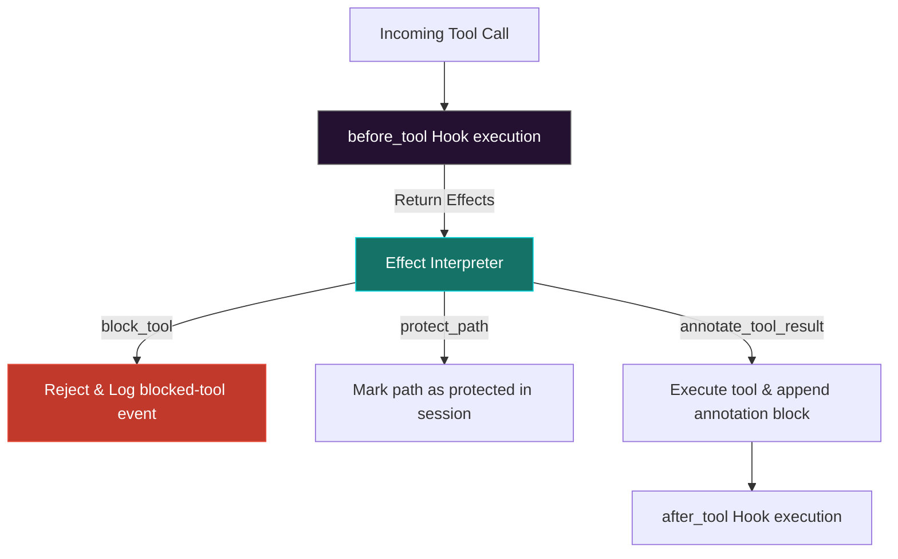

# Clio Coder Middleware & Component Registry

Clio Coder incorporates a deterministic **Component Registry** to track everything that can alter model behavior or safety enforcement. It couples this with a declarative **Middleware Domain** that intercepts tool executions and model calls at runtime, executing pure policy checks.

---

## 🧩 The Deterministic Component Scanner

The components domain scans the active repository to produce a stable, JSON-serializable `ComponentSnapshot`. This scanner does not execute any code; it reads raw file bytes, computes `sha256` content hashes, and maps files to metadata based on deterministic rules.

### The 13 Shipped Component Kinds:
- **`prompt-fragment`:** Markdown snippets loaded dynamically into agent prompts.
- **`context-file`:** Checked-in guide files (e.g., `CLIO.md`, `README.md`).
- **`tool-implementation` / `tool-helper`:** TS source code implementing agent tools.
- **`agent-recipe`:** Markdown definitions of fleet agents (frontmatter specs).
- **`runtime-descriptor`:** Native model target configuration specifications.
- **`safety-rule-pack`:** Declarative safety packs (e.g., `damage-control-rules.yaml`).
- **`config-schema` / `session-schema` / `receipt-schema`:** Internal structural schemas.
- **`middleware`:** Declarative middleware rule specifications.
- **`memory`:** Operator-approved long-term memory records.
- **`eval-suite` / `doc-spec`:** Research test suites and public specs.

---

## 🎖️ Authority Levels & Reload Classes

Every component scanned is assigned a static **Authority Level** and **Reload Class** that determine how it impacts the runtime:

### Component Authority Levels:
1. **`advisory`:** Can guide agent prompts or context, but does not block executions (e.g., `prompt-fragment`, `agent-recipe`).
2. **`descriptive`:** Provides auditability and timing details (e.g., `eval-suite`, `doc-spec`).
3. **`enforcing`:** Directly blocks, redirects, or alters tool execution (e.g., `tool-implementation`, `middleware`, `safety-rule-pack`).
4. **`runtime-critical`:** Governs provider configuration or low-level serializations (e.g., `runtime-descriptor`, `config-schema`).

### Component Reload Classes:
- **`hot`:** Reloads instantly in the active interactive session (e.g., `prompt-fragment`, `context-file`, `tool-implementation`).
- **`next-dispatch`:** Reloads on the next sub-agent worker execution (e.g., `agent-recipe`).
- **`restart-required`:** Requires rebooting the main `clio` binary to re-initialize schemas and rules (e.g., `middleware`, `safety-rule-pack`, `config-schema`).
- **`static`:** Fixed documentation or specifications (e.g., `doc-spec`).

---

## 🔍 Tracking Component Diffs

Operators track repository drift and manifest updates using the CLI components surface:
- **List all components:** `clio components` prints a human-readable table of all tracked assets.
- **Save a Snapshot:** `clio components snapshot --out snap.json` serializes the active codebase tree.
- **Compare Snapshots:** `clio components diff --from a.json --to b.json` matching assets by ID and reporting added (`+`), removed (`-`), or modified (`~`) items, listing the specific fields that changed.

---

## 🔄 Declarative Middleware Hooks

The middleware domain acts as a pure runtime gateway. Hook rules contain **no executable user JavaScript**; they are structured data records serialized into fleet workers via the `WorkerSpec`.

### The 11 Middleware Hooks:
Clio Coder models 11 lifecycle hooks:
- **Model Hooks:** `before_model`, `after_model` (gates prompt contents and model outputs).
- **Tool Hooks:** `before_tool`, `after_tool` (intercepts tool inputs and annotates results).
- **Session Hooks:** `before_finish`, `after_finish`, `on_retry`, `on_compaction`.
- **Worker Hooks:** `on_blocked_tool`, `on_dispatch_start`, `on_dispatch_end`.

### Core Handled Effects:
1. **`block_tool`:** Fails the execution before the tool runs, returning a safety block.
2. **`annotate_tool_result`:** Appends a deterministic warning or instruction block to the tool's stdout before handing it back to the agent.
3. **`protect_path`:** Registers in-memory artifact protection boundaries, preventing downstream cleanup scripts from deleting validated results.
