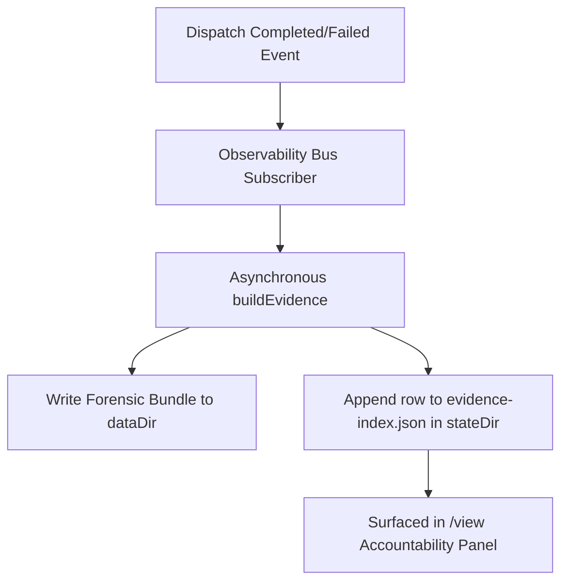

# Observability Viewer

> [!TIP]
> **Interactive Spec Available:** An interactive dashboard is located at [docs/html/observability_blueprint.html](html/observability_blueprint.html) (Version: 0.4.0).

`/view` is the interactive artifact viewer for a Clio session. It keeps the live transcript compact while preserving a full inspection path for durable artifacts, task ledgers, and successful workspace outputs.

```text
/view
/view <id-or-filter>
/view verify <runId>
```

`/view` opens a full-screen split viewer. The left pane groups artifacts by category and supports type-to-filter. The right pane renders the selected artifact with pager controls. `Tab` or `Shift+Tab` switches between the artifact list and details. `Left` and `Right` jump to the previous or next non-empty category from either pane; `Up` and `Down` select artifacts in the list or scroll details in the content pane. Category jumps honor the active filter and wrap at the ends. `v` verifies a selected receipt. `o` shows the absolute backing path through the notice channel when the selected artifact has one; pathless artifacts produce a warning notice instead. In the list pane, `Esc` clears a non-empty filter before a second `Esc` closes the viewer.

## Trace retention and state usage

The SQLite trace mirror at `<state-dir>/trace.sqlite` is rebuildable and bounded. By default Clio retains terminal runs for 30 days and limits the allocated database to 128 MiB (134,217,728 bytes), whichever limit is reached first. The policy runs after each dispatch or interactive turn becomes terminal. It deletes a run as one unit across `runs`, `phases`, `events`, `envelopes`, `gate_results`, `agent_sessions`, and `processes`. A `queued` or `running` run is never a candidate, even when its start time is older than the age cutoff or its rows put the store over the byte limit.

Two environment variables configure the automatic policy:

| Variable | Default | Valid values |
| --- | ---: | --- |
| `CLIO_CODER_TRACE_RETENTION_DAYS` | `30` | An integer of at least 1. |
| `CLIO_CODER_TRACE_MAX_BYTES` | `134217728` | An integer of at least 1,048,576. |

An operator can apply the current policy immediately or supply one-command overrides:

```bash
clio-coder trace prune
clio-coder trace prune --max-age-days 14 --max-bytes 67108864
clio-coder trace prune --json
```

The command reports terminal runs removed, total rows removed across the seven run-owned tables, physical bytes reclaimed from `trace.sqlite` and its WAL sidecars, whether `VACUUM` ran, and how many live runs were protected. Age pruning uses a terminal run's `ended_at`. Size pruning removes the oldest terminal runs until the live database pages fit or no terminal candidate remains.

Deleting SQLite rows creates reusable pages but does not normally reduce the file. Clio runs `VACUUM` when at least 20 percent of allocated pages are reclaimable, or whenever reclaiming deleted pages is necessary to enforce the 128 MiB bound. It then truncates the WAL. Smaller deletions remain available for SQLite to reuse and avoid rewriting the whole database on every completed run.

`clio-coder doctor` includes a `state storage` row with the recursive byte total for the state directory and the largest top-level contributor. For example:

```text
OK   state storage          96.4 MiB (101,082,624 bytes); largest contributor trace.sqlite at 89.9 MiB (94,248,960 bytes)
```

---

## The Evidence Spine End-to-End

Clio Coder operates on a single, unified accountability spine that connects in-loop execution diagnostics with durable forensic evidence. The spine operates at two distinct layers:

1. **Live Layer (In-Loop Assessment)**: During a session, the safety domain executes a cheap in-memory scan over the last 80 entries on every `turn_end` hook. It detects validation commands, dispatch receipts, protected artifacts, and requested inspections to check if completion claims are backed by evidence. The live kinds are mapped to the canonical evidence taxonomy.
2. **Forensic Layer (Post-Completion Aggregator)**: When a run completes, the observability domain aggregates the session ledger, receipts, transcripts, and audit logs into a rich forensic bundle.



### Auto-Build on Dispatch Completion

The observability extension subscribes to the `dispatch.completed` and `dispatch.failed` channels via the `SafeEventBus` (in `src/domains/observability/extension.ts`). When a run terminates, the domain initiates the forensic builder without blocking the event bus or TUI rendering.

The builder runs `buildEvidence({ dataDir, stateDir, runId })` to read the state files and compile a detailed bundle under `<dataDir>/evidence/run-<runId>/`. If a headless run is executing, the observability stop hook (`stop()`) flushes all in-flight build promises before the process exits, ensuring no data is lost. Any build failures are swallowed and logged to stderr to prevent compiler or file-lock issues from crashing the main run.

### The Sidecar Index

After building the forensic bundle, the domain appends a metadata row to the sidecar index file located at `<stateDir>/evidence-index.json`. The file is kept as a JSON array acting as a bounded ring (capped at 1000 rows). 

To prevent concurrent Clio processes from corrupting the index, writes are queued within the process and serialize across processes using the shared state-file locking mechanism.

An `EvidenceIndexRow` has the following schema:
```json
{
  "runId": "4f89d2a9c12",
  "evidenceId": "run-4f89d2a9c12",
  "tags": ["test-failure", "session-linked"],
  "firstPassSuccess": false,
  "findingCount": 2,
  "generatedAt": "2026-06-25T14:30:00.000Z"
}
```

---

## Cross-Session Usage Facts

`clio-coder usage report` folds the local archive into one window of facts. Its token and cost facts come from two inputs: the per-session ledgers, folded through the session domain's `ledgerUsageCalls`, and the out-of-turn usage store described below. Both the text report and `--json` carry the same fields.

| Field | Where it appears | Meaning |
| --- | --- | --- |
| `apiCalls` | `tokens in window: <total> over <n> model calls` and the `tokens` JSON fact | Provider calls folded in the window, out-of-turn rounds included. |
| `input`, `output`, `cacheRead`, `cacheWrite`, `reasoningTokens`, `totalTokens` | the same line and fact | Provider-reported token breakdown for those calls. |
| `costUsd` | `provider-reported cost in window` and the `tokens` fact | Provider-reported cost. Never estimated. |
| `turns` | `turns in window` and the `tokens` fact | Folded calls that were turns, so labelled calls are subtracted exactly as `/cost` subtracts them. |
| `sideQuestions` | `side questions in window` and the `tokens` fact | `/btw` rounds in the window. |
| `handoffs` | `handoffs in window` and the `tokens` fact | `/handoff` extraction rounds in the window. |
| `prewarms` | `pre-warms in window` and the `tokens` fact | Prompt pre-warm rounds in the window. |
| `backgroundMemorySteps` | `background memory steps in window` and the `tokens` fact | Proactive-memory model steps in the window. |

The last five fields appear only when at least one labelled call falls in the window, and each individual line is printed only when its own count is above zero. An archive with no labelled call in it renders exactly as it did before those fields existed, so their presence is itself the signal that money was spent beside a session. All four labelled kinds are subtracted from `turns` the same way, so a session's turn count never includes a round the operator did not take.

The report also prints a prompt-cache block, one row per session that recorded any cache telemetry:

```text
  prompt cache by session (from backend timings and persisted verdicts)
  session       uncached prefill  hot/partial/cold/small
  3vpu6z19ee7t  130353            4/3/2/0
```

`uncached prefill` is the sum of the backend's own newly evaluated prompt tokens across every persisted call in that session, and reads `n/a` rather than `0` when the server reported no cache figure to subtract. The four counts are the per-call verdicts. Both facts are also in `--json` under a `session-cache` fact per session.

`clio-coder doctor` reports the same evidence for the latest session only, as one row, so a cache problem is visible without opening the TUI or a report:

```text
OK cache telemetry  last session 3vpu6z19ee7t: hot 4 · partial 3 · cold 2 · small 0; top expected reason dispatch (3)
```

The row reads `top expected reason none` when the session recorded verdicts but no expected-cold reason, and it degrades to a warning saying `no prompt-cache telemetry recorded` when the latest session has none at all, which is the honest answer for a target whose backend reports nothing rather than a claim of a perfect cache. "Latest" selects the most recent `current.jsonl` by its newest entry timestamp, falling back to the file's mtime, so the other diagnostic JSONL files in a session directory cannot be mistaken for the conversation.

### The Out-of-Turn Usage Store

A `/btw` side question and a `/handoff` extraction round are real provider calls that append nothing to the session JSONL, by design: a fleet run briefs its workers from the transcript, and a question the operator asked to orient themselves must not become context those workers inherit. The spend still has to be recorded somewhere durable, so it goes to `<stateDir>/usage/out-of-turn.jsonl`, one JSON line per priced call, written by the chat loop at the same moment it reports the call to `/cost`.

The file is append-only NDJSON kept as a bounded ring (capped at 1000 rows, rewritten atomically under the shared state-file lock when it grows past the cap). Reads are tolerant: a malformed line is reported as a diagnostic on stderr and skipped.

A row has the following schema:
```json
{
  "label": "side-question",
  "sessionId": "01JQ2K7V8W",
  "repoIdentity": "9f2c1b4ea77d0c31",
  "timestamp": "2026-06-25T14:30:00.000Z",
  "target": "dynamo",
  "attributedModelId": "Nemo-3.5",
  "usage": {
    "input": 120,
    "output": 8,
    "cacheRead": 4,
    "cacheWrite": 0,
    "reasoning": 2,
    "totalTokens": 132,
    "costUsd": 0.0004,
    "costProvenance": "known"
  }
}
```

`repoIdentity` is the same cwd hash the session ledger is filed under, which is what lets `usage report --repo <path>` select these rows with the hash it already computes for the ledgers.

`label` is one of `side-question`, `handoff`, `prewarm`, or `background-memory`. The last two joined for the same reason as the first two: a prompt pre-warm and a proactive-memory step are provider calls the operator did not ask for and would otherwise never see, and neither appends anything to the session JSONL. A row may also carry `timing { durationMs }` and a `promptCache` block built from the backend's own prefill facts when the server reported them; a backend that reports no timings simply omits the block, as LM Studio's OpenAI-compatible port does.

---

## Artifact Categories and Path Layouts

Clio resolves directories under platform-specific XDG defaults (on Linux, these default to `~/.config/clio-coder/`, `~/.local/share/clio-coder/`, and `~/.local/state/clio-coder/`).

| Category | Description | Backing Path |
| --- | --- | --- |
| **Accountability** | Rolling first-pass-success rate and failure-cause histogram. | `<stateDir>/evidence-index.json` |
| **Evidence bundles** | Deterministic run or session overviews, findings, totals, and linked files. | `<dataDir>/evidence/<evidenceId>/` |
| **Receipts** | Durable run receipts verified by SHA-256 integrity digests. | `<stateDir>/receipts/<runId>.json` |
| **Dispatch outputs** | Logs and ledger records detailing worker execution. | `<stateDir>/runs.json` and `<stateDir>/receipts/<runId>.json` |
| **Task ledgers** | Per-turn task-board goals, active runs, required validation evidence, and operator-task provenance when present. | `<stateDir>/sessions/<cwdHash>/<sessionId>/current.jsonl` |
| **Workspace outputs** | Latest successful `artifact`, `write`, or `edit` result for each normalized path on the active session branch. Missing files remain visible as durable recorded facts. | Recorded path beneath the session metadata `cwd` |
| **Tool outputs** | Offloaded large outputs or execution logs. | `<stateDir>/scratch/<sessionId>/<sha256 of the captured text>.txt` |
| **Protected artifacts** | Validation-protected artifact metadata and its absolute artifact path when available. | Session ledger record plus the protected workspace path |
| **Compaction** | Summaries of compacted history sessions. | `<stateDir>/sessions/<cwdHash>/<sessionId>/current.jsonl` |
| **Prompt manifests** | One validated record per prompt compile: `systemPromptHash`, previous hash, token estimate, thinking dial at compile time, per-section token estimates, and per-fragment content hashes. Identifies the exact compiled prompt and supports hash diffs without storing prompt text. Malformed records appear as an explicit read-error artifact. | `<stateDir>/sessions/<cwdHash>/<sessionId>/prompt-manifest.jsonl` |
| **Safety audit rows** | Current-session safety and permission decisions, with malformed ledger lines surfaced separately. | `<stateDir>/audit/<date>.jsonl` |

Workspace output containment is checked again when the operator loads an item, not only when `/view` builds its list. The loader re-resolves the recorded workspace root and target through symlinks on every load, verifies canonical path-segment containment, and reads the canonical target. A target or ancestor symlink swapped outside the workspace is refused. A missing target keeps the recorded timestamp and reports `file no longer on disk`; it does not disappear from the artifact history.

---

## The Accountability Panel

The first category in the TUI split viewer is **Accountability**. It reads the sidecar index directly to present a live summary without loading heavy forensic logs.

### First-Pass Success Rate
A run is marked as a first-pass success when:
- The terminal dispatch outcome succeeded.
- The run had zero dispatch retries (attempt 0).
- The built bundle contains validation evidence, meaning the `no-validation` tag is absent.

The TUI displays this rate as:
`first-pass success: <succeeded-attempts>/<total-attempts> (<pct>%)`

### Failure-Cause Histogram
The TUI lists the top failure causes sorted by frequency (descending), then by tag name (ascending). The histogram filters out provenance and quality tags (such as `audit-linked`, `session-linked`, and `no-validation`) and displays only real failure causes:
- `timeout`
- `auth-failure`
- `missing-dependency`
- `build-failure`
- `test-failure`
- `blocked-tool`

---

## Receipt Integrity Verification

Pressing `v` on a selected receipt or running `/view verify <runId>` performs cryptographic integrity checks:

1. **Read Receipt**: Reads the receipt JSON from `<stateDir>/receipts/<runId>.json`.
2. **Resolve Ledger**: Looks up the run envelope inside `<stateDir>/runs.json`.
3. **Verify Integrity**: Recomputes the SHA-256 digest over the strict v19 receipt and reconstructible ledger fields. The digest covers every current field, including steering, routing intent and decision, route quality, worker identity, execution role, result-contract conformance, council provenance, and fleet gate provenance. Every version other than 19 fails verification; there is no historical receipt reader.
4. **Report Result**: The viewer reports `ok` or the verification failure reason. It does not rename or delete the receipt. Startup orphan recovery may quarantine corrupt orphan receipt files as `<name>.json.corrupt`, but `/view verify` is read-only.

---

## Receipt Fields for Dispatch Provenance

A receipt carries optional provenance and context blocks that answer "what happened" for a chained (pipeline), composed (persona override), escalated, briefed, steered, council, or external run. Those optional blocks remain absent when unused. Current receipts carry strict integrity v19 and an explicit `outcomeCode: null` when no classified deterministic failure occurred. Automation consumers must treat the optional blocks below as absent by default and `outcomeCode` as nullable; older receipt versions are invalid.

Receipt integrity verification and evidence verification are independent.
`receipt_integrity=verified/v19/sha256` means Clio called the receipt verifier
against the ledger envelope; merely finding an embedded digest is not enough.
`evidence_verification=<verified|unverified|not_applicable|unknown>/<basis>`
describes validation evidence inside that verified receipt. Likewise,
`briefing` authenticates parent-supplied dispatch data, while
`project_context` authenticates the separately rendered bounded project
message. Model-facing dispatch and collect output name all four concepts
separately and never substitute one hash for another.

The evidence bundle renders these sets in `transcript.md` (human sentences) and `trace.cleaned.jsonl` (structured run rows), `clio-coder evidence inspect` prints them as a `provenance <runId>:` block, and the `dispatch` tool appends a compact suffix to each run line plus additive keys on `details.runs[]`, including `trust`, the bounded canonical trust projection described in [evidence-and-memory.md](evidence-and-memory.md#trust-projection). A timed-out or denied escalation also raises an `escalation` finding in the bundle.

The base provenance sets, steering, routing, quality, worker identity, result-conformance, council provenance, and fleet gate provenance use the strict v19 shape frozen for the release. These fields are labeled `experimental` until the schema is promoted post-1.0. For the complete version registry and migration contract across all artifacts, see [artifact-versions.md](artifact-versions.md).

| Field path | Type | When present | Meaning | Status |
| --- | --- | --- | --- | --- |
| `pipeline.fromRunId` | `string \| null` | Pipeline step after the first | Run whose final output was threaded in as input data; `null` when the upstream run id is unknown | experimental |
| `pipeline.position` | `number` | Pipeline step after the first | 1-based index of this step in the chain | experimental |
| `pipeline.inputBytes` | `number` | Pipeline step after the first | UTF-8 byte length of the threaded upstream text before the 12000-char cap | experimental |
| `pipeline.inputTruncated` | `boolean` | Pipeline step after the first | `true` when the 12000-char cap clipped the threaded input | experimental |
| `briefing.bytes` | `number` | A bounded parent briefing was sent | UTF-8 byte count of the exact canonical briefing content | experimental |
| `briefing.contentHash` | `string` | A bounded parent briefing was sent | SHA-256 of exact canonical briefing content; prose is not copied into the receipt | experimental |
| `projectContext.tier` | `"none" \| "bounded"` | Current receipts | Effective project-context policy | experimental |
| `projectContext.chars` | `number` | Bounded project context | Character count of the rendered project-context message | experimental |
| `projectContext.contentHash` | `string` | Nonempty bounded project context | SHA-256 of the rendered project-context message | experimental |
| `steering[].sequence` | `number` | A steer was successfully written | Stable 1-based order within the run | experimental |
| `steering[].bytes` | `number` | A steer was successfully written | UTF-8 bytes of the exact canonical trimmed steer | experimental |
| `steering[].contentHash` | `string` | A steer was successfully written | SHA-256 of the canonical steer; prose is not persisted | experimental |
| `steering[].sentAt` | `string` | A steer was successfully written | Write timestamp | experimental |
| `steering[].acknowledged` | `boolean` | A steer was successfully written | Whether a worker acknowledgement was actually observed | experimental |
| `steering[].acknowledgedAt` | `string` | Acknowledgement was observed | Acknowledgement timestamp | experimental |
| `outcomeCode` | six-value stable string union or `null` | Every v19 terminal receipt | Non-null for `vram_capacity_fit_failure`, `worker_tool_call_cap_exhausted`, `loop_guard_tools_disabled_exhausted`, `result_contract_exhausted`, `worker_final_output_missing`, or `host_verification_rejected`; otherwise `null`. Each non-null code denotes terminal deterministic failure and is incompatible with `outcome: "succeeded"`. Dispatch retry policy consumes this code only, never diagnostic prose. | experimental |
| `personaOverride.promptHash` | `string` | Ad-hoc specialist whose persona replaced the recipe body | Hash of the composed static prompt; equals `staticCompositionHash` for the run | experimental |
| `safety.decisions.escalationRequested` | `number` | Run saw at least one permission escalation | Parked permission asks handed to the operator | experimental |
| `safety.decisions.escalationApproved` | `number` | Run saw at least one permission escalation | Escalations the operator approved | experimental |
| `safety.decisions.escalationDenied` | `number` | Run saw at least one permission escalation | Escalations the operator denied | experimental |
| `safety.decisions.escalationTimedOut` | `number` | Run saw at least one permission escalation | Escalations resolved by the timeout fallback (no operator decision) | experimental |
| `safety.toolTelemetry.coverage` | `"complete" \| "partial" \| "unavailable"` | Current dispatch receipts | Whether Clio can account for the runtime's complete tool start/finish stream | experimental |
| `safety.toolTelemetry.ingestionErrors` | `number` | Current dispatch receipts | Malformed or lost frames, event-fold/source errors, and drain timeouts that make otherwise mediated telemetry incomplete | experimental |
| `safety.toolTelemetry.unfinished` | `{ tool, count }[]` | Current dispatch receipts | Tool starts that had no matching finish when the receipt sealed | experimental |
| `safety.toolTelemetry.workspaceMutationPossible` | `boolean` | Current dispatch receipts | Whether incomplete or unavailable telemetry could conceal a shared-workspace mutation; retry admission fails closed when true | experimental |
| `autonomyEnforcement.grade` | `string` | Always in v0.4.0 | The autonomy grade level enforced for the run | experimental |
| `autonomyEnforcement.autonomy` | `string` | Always in v0.4.0 | The effective autonomy level name (e.g. auto-edit, suggest, read-only, full-auto) | experimental |
| `autonomyEnforcement.externalMode` | `string` | When running external worker | The execution mode of the external worker runtime | experimental |
| `autonomyEnforcement.dangerousBypass` | `boolean` | When running external worker | Whether a safety bypass was explicitly activated | experimental |
| `validationGrounding.claimed` | `number` | Validation grounding evaluated | Count of validations claimed by worker | experimental |
| `validationGrounding.grounded` | `number` | Validation grounding evaluated | Count of claimed validations matched against executed commands | experimental |
| `validationGrounding.ungrounded` | `string[]` | Validation grounding evaluated | Claim names with no matching execution, stably ordered and bounded | experimental |
| `validationGrounding.basis` | `"no-command-executed" \| "unmatched-command"` | Validation grounding evaluated | Why the unmatched claims are unmatched. Only `no-command-executed` takes a quality label away | experimental |
| `capabilityMismatch.verdict` | `"refuse" \| "flag"` | Capability assessment evaluated | Mismatch verdict for agent capability class versus task shape | experimental |
| `capabilityMismatch.agentId` | `string` | Capability assessment evaluated | Dispatched agent ID | experimental |
| `capabilityMismatch.capabilityClass` | `string` | Capability assessment evaluated | Admitted agent capability class | experimental |
| `capabilityMismatch.taskType` | `string` | Capability assessment evaluated | Classified task shape | experimental |
| `capabilityMismatch.suggestedAgentId` | `string \| null` | Capability assessment evaluated | Installed recipe that can do this work, or null when none is installed | experimental |
| `capabilityMismatch.detail` | `string` | Capability assessment evaluated | Human-readable explanation of the mismatch | experimental |

Only Clio-owned native/SSH worker wrappers and the Claude SDK path may transport worker-authored outcome events. ACP and black-box subprocess output cannot self-assert an outcome code; Clio may still assign `worker_final_output_missing` at its trusted finalization seam.

The escalation counters appear together and only when `escalationRequested` is present (at least one escalation occurred), so a deny-all or non-escalating run keeps its `safety.decisions` block unchanged.

---

## Worked Example: End-to-End Spine Flow

Here is a step-by-step trace of how a run passes through the spine.

### 1. Dispatch Completion
A dispatched task to execute tests finishes. The dispatch domain persists the run envelope and the receipt, then emits the completion event:
```json
{
  "runId": "abc1234",
  "status": "completed",
  "exitCode": 0,
  "lineage": { "attempt": 0 }
}
```

### 2. Forensic Build
The observability domain catches the event and triggers `buildAndIndexEvidence`. It generates the overview under `<dataDir>/evidence/run-abc1234/overview.json`:
```json
{
  "version": 1,
  "evidenceId": "run-abc1234",
  "source": { "kind": "run", "runId": "abc1234" },
  "tags": ["session-linked"],
  "totals": {
    "toolCalls": 5,
    "toolErrors": 0
  }
}
```

### 3. Sidecar Append
Observability maps the result into an index row and writes it to `<stateDir>/evidence-index.json`. Because there was a successful validation tool call, `firstPassSuccess` is `true`:
```json
{
  "runId": "abc1234",
  "evidenceId": "run-abc1234",
  "tags": ["session-linked"],
  "firstPassSuccess": true,
  "findingCount": 0,
  "generatedAt": "2026-06-25T14:31:00.000Z"
}
```

### 4. Surfacing in /view
When the operator opens the TUI split viewer `/view`, the Accountability panel reads the index and displays:
```text
# Accountability

first-pass success: 1/1 (100%)

## Top failure causes

none
```
