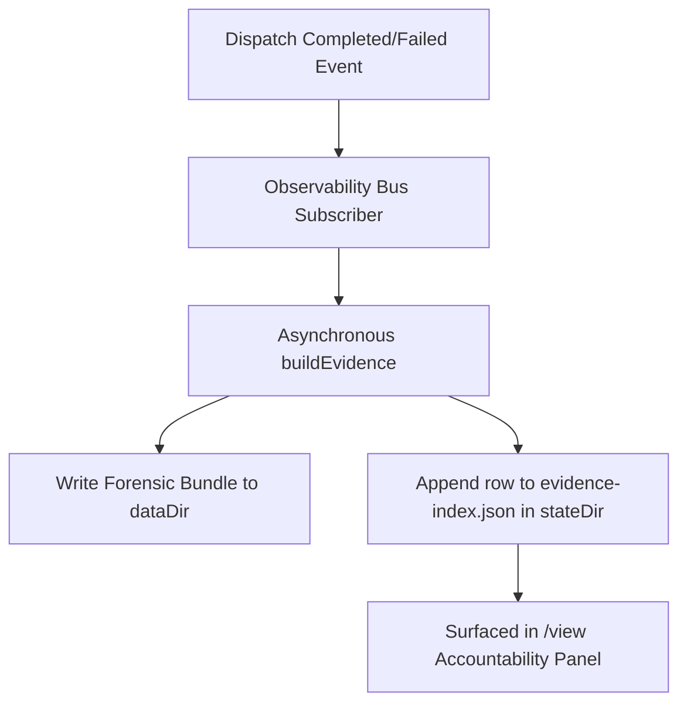

# Observability Viewer

> [!TIP]
> **Interactive Spec Available:** An interactive dashboard is located at [docs/html/observability_blueprint.html](html/observability_blueprint.html) (Version: 0.2.8).

`/view` is the interactive artifact viewer for a Clio session. It keeps the live transcript compact while preserving a full inspection path for durable artifacts.

```text
/view
/view <id-or-filter>
/view verify <runId>
```

`/view` opens a full-screen split viewer. The left pane groups artifacts by category and supports type-to-filter. The right pane renders the selected artifact with pager controls. `Tab` switches panes. `v` verifies a selected receipt. `o` shows the absolute backing path through the notice channel when the selected artifact has one; pathless artifacts produce a warning notice instead.

---

## The Evidence Spine End-to-End

Clio Coder operates on a single, unified accountability spine that connects in-loop execution diagnostics with durable forensic evidence. The spine operates at two distinct layers:

1. **Live Layer (In-Loop Assessment)**: During a session, the safety domain executes a cheap in-memory scan over the last 80 entries on every `turn_end` hook. It detects validation commands, dispatch receipts, protected artifacts, and requested inspections to check if completion claims are backed by evidence. The live kinds are mapped to the canonical evidence taxonomy.
2. **Forensic Layer (Post-Completion Aggregator)**: When a run completes, the observability domain aggregates the session ledger, receipts, transcripts, and audit logs into a rich forensic bundle.



### Auto-Build on Dispatch Completion

The observability extension subscribes to the `dispatch.completed` and `dispatch.failed` channels via the `SafeEventBus` (in `src/domains/observability/extension.ts`). When a run terminates, the domain initiates the forensic builder without blocking the event bus or TUI rendering.

The builder runs `buildEvidence({ dataDir, stateDir, runId })` to read the state files and compile a detailed bundle under `<dataDir>/evidence/run-<runId>/`. If a headless run is executing, the observability stop hook (`stop()`) flushes all in-flight build promises before the process exits, ensuring no data is lost. Any build failures are swallowed and logged to stderr to prevent compiler or file-lock issues from crashing the main run.

### The Sidecar Index

After building the forensic bundle, the domain appends a metadata row to the sidecar index file located at `<stateDir>/evidence-index.json`. The file is kept as a JSON array acting as a bounded ring (capped at 1000 rows). 

To prevent concurrent Clio processes from corrupting the index, writes are queued within the process and serialize across processes using the shared state-file locking mechanism.

An `EvidenceIndexRow` has the following schema:
```json
{
  "runId": "4f89d2a9c12",
  "evidenceId": "run-4f89d2a9c12",
  "tags": ["test-failure", "session-linked"],
  "firstPassSuccess": false,
  "findingCount": 2,
  "generatedAt": "2026-06-25T14:30:00.000Z"
}
```

---

## Artifact Categories and Path Layouts

Clio resolves directories under platform-specific XDG defaults (on Linux, these default to `~/.config/clio/`, `~/.local/share/clio/`, and `~/.local/state/clio/`).

| Category | Description | Backing Path |
| --- | --- | --- |
| **Accountability** | Rolling first-pass-success rate and failure-cause histogram. | `<stateDir>/evidence-index.json` |
| **Receipts** | Durable run receipts verified by integrity signatures. | `<stateDir>/receipts/<runId>.json` |
| **Dispatch outputs** | Logs and ledger records detailing worker execution. | `<stateDir>/runs.json` and `<stateDir>/receipts/<runId>.json` |
| **Tool outputs** | Offloaded large outputs or execution logs. | `<stateDir>/scratch/<sessionId>/<toolCallId>.txt` |
| **Compaction** | Summaries of compacted history sessions. | `<stateDir>/sessions/<cwdHash>/<sessionId>/current.jsonl` |
| **Prompt manifest** | One record per prompt compile: `systemPromptHash`, previous hash, token estimate, thinking dial at compile time, per-section token estimates, and per-fragment content hashes. States exactly what prompt the model received and diffs across sessions without recompiling; the prompt text itself is never stored. | `<stateDir>/sessions/<cwdHash>/<sessionId>/prompt-manifest.jsonl` |

---

## The Accountability Panel

The first category in the TUI split viewer is **Accountability**. It reads the sidecar index directly to present a live summary without loading heavy forensic logs.

### First-Pass Success Rate
A run is marked as a first-pass success when:
- The terminal dispatch outcome succeeded.
- The run had zero dispatch retries (attempt 0).
- The built bundle contains validation evidence, meaning the `no-validation` tag is absent.

The TUI displays this rate as:
`first-pass success: <succeeded-attempts>/<total-attempts> (<pct>%)`

### Failure-Cause Histogram
The TUI lists the top failure causes sorted by frequency (descending), then by tag name (ascending). The histogram filters out provenance and quality tags (such as `audit-linked`, `session-linked`, and `no-validation`) and displays only real failure causes:
- `timeout`
- `auth-failure`
- `missing-dependency`
- `build-failure`
- `test-failure`
- `blocked-tool`

---

## Receipt Integrity Verification

Pressing `v` on a selected receipt or running `/view verify <runId>` performs cryptographic signature checks:

1. **Read Receipt**: Reads the receipt JSON from `<stateDir>/receipts/<runId>.json`.
2. **Resolve Ledger**: Looks up the run envelope inside `<stateDir>/runs.json`.
3. **Verify Integrity**: Recomputes the SHA256 digest over every `RunReceiptDraft` field and the reconstructible ledger fields. A receipt declaring any integrity version other than the current one fails verification.
4. **Report Result**: The viewer reports `ok` or the verification failure reason. It does not rename or delete the receipt. Startup orphan recovery may quarantine corrupt orphan receipt files as `<name>.json.corrupt`, but `/view verify` is read-only.

---

## Receipt Fields for Dispatch Provenance

A receipt carries optional provenance and context field sets that answer "what happened" for a chained (pipeline), composed (persona override), escalated, or external run. Each set is folded onto the receipt only when the run actually exercised the feature, so a run that used none of them produces a receipt byte-identical to a pre-0.2.8 receipt. Automation consumers must treat every field below as optional and absent by default.

The evidence bundle renders these sets in `transcript.md` (human sentences) and `trace.cleaned.jsonl` (structured run rows), `clio evidence inspect` prints them as a `provenance <runId>:` block, and the `dispatch` tool appends a compact suffix to each run line plus additive keys on `details.runs[]`. A timed-out or denied escalation also raises an `escalation` finding in the bundle.

All sets are new in v0.2.8 and are labeled `experimental`: their shapes are frozen for the release, but the labels stay experimental until the schema is promoted post-1.0.

| Field path | Type | When present | Meaning | Status |
| --- | --- | --- | --- | --- |
| `pipeline.fromRunId` | `string \| null` | Pipeline step after the first | Run whose final output was threaded in as input data; `null` when the upstream run id is unknown | experimental |
| `pipeline.position` | `number` | Pipeline step after the first | 1-based index of this step in the chain | experimental |
| `pipeline.inputBytes` | `number` | Pipeline step after the first | UTF-8 byte length of the threaded upstream text before the 12000-char cap | experimental |
| `pipeline.inputTruncated` | `boolean` | Pipeline step after the first | `true` when the 12000-char cap clipped the threaded input | experimental |
| `personaOverride.promptHash` | `string` | Ad-hoc specialist whose persona replaced the recipe body | Hash of the composed static prompt; equals `staticCompositionHash` for the run | experimental |
| `safety.decisions.escalationRequested` | `number` | Run saw at least one permission escalation | Parked permission asks handed to the operator | experimental |
| `safety.decisions.escalationApproved` | `number` | Run saw at least one permission escalation | Escalations the operator approved | experimental |
| `safety.decisions.escalationDenied` | `number` | Run saw at least one permission escalation | Escalations the operator denied | experimental |
| `safety.decisions.escalationTimedOut` | `number` | Run saw at least one permission escalation | Escalations resolved by the timeout fallback (no operator decision) | experimental |
| `autonomyEnforcement.grade` | `string` | Always in v0.2.8 | The autonomy grade level enforced for the run | experimental |
| `autonomyEnforcement.autonomy` | `number` | Always in v0.2.8 | The exact numeric autonomy dial value | experimental |
| `autonomyEnforcement.externalMode` | `string` | When running external worker | The execution mode of the external worker runtime | experimental |
| `autonomyEnforcement.dangerousBypass` | `boolean` | When running external worker | Whether a safety bypass was explicitly activated | experimental |
| `projectContext.clioMdHash` | `string` | Always in v0.2.8 | SHA-256 hash of active `CLIO.md` when the run started | experimental |
| `projectContext.gitSha` | `string` | Always in v0.2.8 | Active git commit hash when the run started | experimental |

The escalation counters appear together and only when `escalationRequested` is present (at least one escalation occurred), so a deny-all or non-escalating run keeps its `safety.decisions` block unchanged.

---

## Worked Example: End-to-End Spine Flow

Here is a step-by-step trace of how a run passes through the spine.

### 1. Dispatch Completion
A dispatched task to execute tests finishes. The dispatch domain persists the run envelope and the receipt, then emits the completion event:
```json
{
  "runId": "abc1234",
  "status": "completed",
  "exitCode": 0,
  "lineage": { "attempt": 0 }
}
```

### 2. Forensic Build
The observability domain catches the event and triggers `buildAndIndexEvidence`. It generates the overview under `<dataDir>/evidence/run-abc1234/overview.json`:
```json
{
  "version": 1,
  "evidenceId": "run-abc1234",
  "source": { "kind": "run", "runId": "abc1234" },
  "tags": ["session-linked"],
  "totals": {
    "toolCalls": 5,
    "toolErrors": 0
  }
}
```

### 3. Sidecar Append
Observability maps the result into an index row and writes it to `<stateDir>/evidence-index.json`. Because there was a successful validation tool call, `firstPassSuccess` is `true`:
```json
{
  "runId": "abc1234",
  "evidenceId": "run-abc1234",
  "tags": ["session-linked"],
  "firstPassSuccess": true,
  "findingCount": 0,
  "generatedAt": "2026-06-25T14:31:00.000Z"
}
```

### 4. Surfacing in /view
When the operator opens the TUI split viewer `/view`, the Accountability panel reads the index and displays:
```text
# Accountability

first-pass success: 1/1 (100%)

## Top failure causes

none
```
