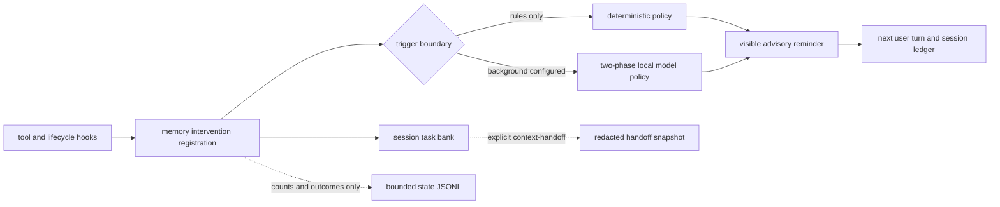

# Proactive task memory

> **Interactive Spec Available:** An interactive memory lifecycle dashboard and simulator is located at [docs/html/memory_blueprint.html](html/memory_blueprint.html) (Version: 0.3.0).

Clio's proactive task memory protects long-running work from behavioral state
decay: a requirement, environment fact, failed attempt, or diagnosis can still
exist in the transcript while no longer influencing the next action. The design
follows Wu et al., *Remember When It Matters: Proactive Memory Agent for
Long-Horizon Agents* (2026), adapted to Clio's visible middleware and local-model
routing.

The rules-only tier is enabled by default and makes no model calls. An LLM memory
tier is opt-in through the independent `background` route. The action agent's
system prompt and tool surface do not change, and disabling
`memory.intervention.enabled` removes observation, bank writes, model resolution,
reminders, handoff offers, and handoff seeding.

## Architecture



The task bank is in `src/domains/memory/` and belongs to one live session. It is
separate from both durable approved lessons and the regenerable repository
context engine.

- **Private status** is the memory policy's short progress model. It can be
  inspected with `/memory`, but is never rendered to either model, injected into
  the action turn, or exported to a handoff.
- **Knowledge** contains stable task facts such as requirements, paths,
  environment facts, and constraints.
- **Procedural memory** contains attempts and outcomes such as failed commands,
  ruled-out hypotheses, diagnoses, and fixes that worked.

Knowledge and procedural entries have stable short IDs. A visible reminder is
one `Memory:` advisory block and records the cited entry IDs' injection counts.
The existing middleware path places that block in the next submitted user turn
and persists its attribution in the session ledger; there is no hidden
`transformContext` injection.

## Paper mapping and Clio constraints

| Paper mechanism | Clio implementation |
| --- | --- |
| Separate memory agent | One stateful middleware registration beside the unmodified action agent |
| Status, knowledge, and procedural bank | Bounded in-memory `TaskMemoryBank`; status remains private |
| Phase 1 bank maintenance | Strict `update_status`, `save_knowledge`, `save_procedural`, and `delete` operations |
| Phase 2 intervene or stay silent | One advisory `inject_reminder` effect or explicit silence |
| Fixed memory cadence | Deterministic decay signals plus a coarse interval floor |
| Learned intervention calibration | Structural authority gate: spontaneous reminders must cite a bank entry; deterministic triggers may be uncited |
| Passive and always-on ablations | A/B harness compares baseline, rules, and LLM tiers and flags always-noisy ties as regressions |

Model output uses a strict two-line grammar parsed by `src/domains/memory/task-memory-policy.ts`:

```text
<operations>[{"op":"update_status","content":"Tracking the current requirement."}]</operations>
<no_intervention/>
```

When a visible reminder cites an existing bank entry, the second line uses:
```text
<operations>[]</operations>
<context_for_action>Restored requirement [tm-k-1]</context_for_action>
```

Knowledge and procedural saves use `{"op":"save_knowledge","content":"..."}` or
`{"op":"save_procedural","content":"..."}`; an `id` is only valid when updating
an existing entry.

The parser locates that envelope rather than matching the response byte for byte,
because a small local model routinely delivers a correct decision inside
imperfect packaging. A markdown fence, a `<think>` block, a leading "Here is my
step:", a closing pleasantry, and a pretty-printed multi-line operations array
are all accepted. Two shapes are read conservatively rather than generously:

- A response with no phase-two line at all is silence, since silence is the
  prompt's documented default. Its phase-one writes still apply. An envelope
  truncated mid-reasoning yields nothing at all.
- Tag shapes are stripped from the reminder before it is emitted, so the memory
  model cannot close the `<system-reminder>` block it rides inside. Ordinary
  comparisons and arrows survive.

Operations are validated atomically, so a malformed operation list changes
nothing. Phase 1 writes remain valid when Phase 2 is gated or yields to a
deterministic reminder; an over-budget reminder is recorded as `gated` and
suppressed rather than discarding the writes that came with it. A timeout,
provider failure, malformed response, or telemetry failure is silent and never
blocks a tool.

### Intervention Defaults & Cadence Knobs
- `memory.intervention.enabled` (default `true`): Enables observation, task bank writes, and reminder injection.
- `memory.intervention.everyNTools` (default `10`): Minimum completed-tool interval between background interventions.
- `memory.intervention.windowSteps` (default `8`): Completed tool-trajectory window analyzed during background evaluation.
- `memory.intervention.maxTokens` (default `400`): Bounds the rendered memory-bank and reminder context budget; the policy model output cap is a separate fixed `1,200`-token contract in `task-memory-policy.ts`.
- `memory.intervention.timeoutMs` (default `20000`): Wall-clock limit for a background memory-policy request.

## Trigger semantics

Memory does not call a model after every tool. Signals accumulate and coalesce at
an awaited turn-end boundary; at most one prompted step runs for that boundary.

| Trigger | Behavior |
| --- | --- |
| Interval | After `memory.intervention.everyNTools` completed tools since the last prompted step; default 10. This is the nondeterministic/citation-gated path. |
| Tool-error streak | Two consecutive error outcomes. A successful tool resets the streak. |
| Loop signal | Reuses the orchestrator loop guard's verdict; it does not infer a second competing loop detector. |
| Repeated failure | The rules tier records failed tool fingerprints and annotates the failing tool result once the same failure appears twice in the bounded trajectory. |
| Post-compaction | The first turn start after compaction reactivates knowledge once, without a model call, because compaction is precisely where execution facts leave the active window. |

### Two delivery channels

A turn boundary is the wrong place to warn about a failure that happened forty
tool calls earlier in the same turn, because the reminder cannot reach the model
until the operator submits again. Memory therefore has two channels, and each
repeated failure uses exactly one of them:

- **Mid-turn annotation.** The second identical failure appends one cited
  `Memory:` advisory to that tool's own result, through the existing
  `annotate_tool_result` effect the loop guard already uses. The model reads it
  on its very next round. This is spent once per fingerprint per turn and
  re-earned in a later turn, because the same command failing again after an
  operator turn is news again.
- **Next-turn reminder.** Post-compaction reactivation and any background-model
  reminder ride the `inject_reminder` buffer into the next submitted turn, inside
  the visible `<system-reminder>` block, and persist in the session ledger.

A boundary that already spoke through the annotation stays silent at turn end and
records one telemetry row, not two.

## Background steps never hold a turn open

The pi agent does not become idle until every `agent_end` listener settles, so a
memory step awaited at that boundary would add its full latency to the visible
end of every triggered turn. Measured on the reference route below, one step
takes 37-46 seconds, which is both intolerable as a pause and longer than the
policy timeout that would then discard the work.

The prompted step is therefore detached. `evaluateAsync` starts it and returns
immediately; the turn ends on schedule. When the step resolves, its reminder is
delivered through the deferred-reminder path into the next submitted turn, which
is exactly where an awaited turn_end reminder would have been buffered anyway.
Two consequences follow, both deliberate:

- At most one background step is alive per session. A boundary that arrives while
  a step is still running is dropped rather than queued, so a model slower than
  the turns that trigger it can never build a backlog.
- A reminder can arrive one turn later than the trajectory that earned it. The
  rules tier is unaffected and stays synchronous, so deterministic protection
  keeps its original timing.

`/memory` shows whether a step is in flight, and the footer's memory row shows
`working` while one is running.

The error-streak, loop, repeated-failure, and post-compaction paths are
deterministic. A prompted reminder from one of those paths may be uncited. An
interval-only prompted reminder must cite at least one current knowledge or
procedural ID or it is recorded as `gated` and remains invisible.

### Outcome semantics

The `/memory` overlay displays `last <decision>` where `<decision>` is the
combined outcome of the most recent actual memory boundary. A **memory boundary**
is a turn-end evaluation that includes newly completed tools or an explicit
deterministic trigger (interval, error-streak, loop signal). A no-tool
middleware continuation—another turn-end with no new tools since the previous
boundary—is not a new memory boundary and does not replace the prior outcome.
Thus `last` remains `injected` across such continuations until a later
tool-bearing or explicitly triggered memory step produces a new outcome (e.g.,
a healthy tool leading to `silent`).

## Operator setup

The shipped defaults are:

```yaml
background:
  target: null
  model: null
  thinkingLevel: off

memory:
  intervention:
    enabled: true
    everyNTools: 10
    windowSteps: 8
    maxTokens: 400
    timeoutMs: 20000
```

With `background.target` and `background.model` unset, Clio stays in the
zero-cost rules tier. `/memory` shows the current tier, last decision, approved
durable lessons, the live bank, and a bounded history of the last twenty memory
steps with their trigger, decision, write count, cited-entry count, tier, and
latency. That history is the only place a capture, a gate, or a timeout becomes
visible, since those outcomes produce no transcript entry by design; only an
actual injection reaches the transcript. It carries counts and outcomes only,
never bank or trajectory text. `/settings` exposes every key above. In
`/targets`, select an eligible local target and press `b` to make it the saved
background-memory default; this is independent of `u` for chat and `f` for the
fleet default. A running session owns its routing snapshot, while the saved
selection becomes the default for new sessions.

The reference live configuration is an LM Studio server on the `zbook` node with
the wire model `qwopus3.5-9b-v3`:

```yaml
background:
  target: zbook
  model: qwopus3.5-9b-v3
  thinkingLevel: off
```

A small model is the intended shape for this role. On that route one memory step
measures 37-46 seconds end to end and returns the exact two-line envelope, so
capability is not the constraint; latency is, and the detached step above is what
makes the tier usable anyway. Raise `timeoutMs` above the observed step time or
every step records `timeout` and writes nothing.

The target ID is not hard-coded. Any configured orchestrator-eligible local
target and wire model can fill the background role. Before enabling it, use the
real target surfaces to verify the route:

```bash
clio targets --probe
clio models --target zbook
clio
```

Then inspect `/targets`, `/settings`, and `/memory`. Local co-residency still
matters: the background model, action model, their KV caches, and parallel slots
must fit the target's available memory. Increase `timeoutMs` for a deliberately
slow local route; lowering `maxTokens` bounds the visible reminder but does not
change the background model's strict output grammar.

For an immediate kill switch, set `memory.intervention.enabled` to `false` in
`/settings`. Removing the background target instead returns to rules-only
operation while leaving deterministic protection active.

## Handoff continuity

The bank normally dies with the session. When `context-handoff` is explicitly
requested, Clio supplies the skill a redacted `clio-task-memory` fenced snapshot
containing knowledge and procedural entries only. Ordinary turns receive no
snapshot. The handoff artifact remains under ignored `.clio/handoffs/`; private
status and secret-shaped values do not cross the export boundary.

After `/resume`, Clio checks only the newest handoff and offers `/memory seed` if
it contains a valid snapshot. Seeding is explicit and deduplicated. It resets
injection attribution for the new session, and the master kill switch disables
both the offer and writes. `/new`, `/fork`, `/resume`, and ACP session changes
clear the prior heap bank before the new session can observe it.

## Telemetry

Each completed memory step appends one content-free record to:

```text
<stateDir>/memory/steps.jsonl
```

Use `clio paths --json` to resolve `stateDir`. The log rotates after 1 MiB and
keeps one previous generation as `steps.jsonl.1`. Every exact-schema record has:

- timestamp and schema version;
- one to three coalesced trigger reasons;
- `rules` or `llm` tier;
- per-class added, updated, and deleted entry counts;
- `silent`, `injected`, `gated`, `timeout`, or `malformed` decision;
- count of cited entries, input/output/total memory-model tokens, and latency.

It contains no task, trajectory, bank, error, or reminder text. File creation,
rotation, serialization, and injected sinks are all best effort; a read-only
state directory or full disk cannot alter intervention behavior.

Note that routine no-tool continuation checks do not emit telemetry rows, as they
are not considered new memory boundaries. Only actual tool-bearing or explicitly
triggered memory steps produce rows.

## Evaluation and promotion bar

`src/domains/eval/proactive-memory.ts` exports a fixed three-task, matched A/B
harness. It executes `baseline`, `rules`, and `llm` variants in stable order and
accepts any `{ id, model }` target. A runner adapter owns isolated task execution
and returns action tokens/latency plus the exact telemetry rows emitted for that
trial. The report provides:

- pass rate;
- injected and cited reminder counts;
- reminders per task and citation rate;
- total and baseline-relative added tokens and latency;
- an `alwaysNoisyRegression` verdict.

The deterministic end-to-end harness contract can be run directly:

```bash
npm run test:file -- tests/contracts/proactive-memory-eval.test.ts
```

For a live local comparison, an adapter should route only the `llm` variant
through the request's target/model (the reference is `zbook` /
`qwopus3.5-9b-v3`), keep baseline memory telemetry empty, and run all
nine trials in equivalent isolated workspaces. Do not promote the LLM tier from
one anecdotal task. The evidence bar is a pass-rate gain from a small number of
specific, usually cited reminders at acceptable added token and latency cost.
Injecting at least once per task while merely tying or losing to baseline is
always a regression, even when every reminder is cited.

## Worker growth path

Worker-side intervention is intentionally not implemented in this sprint. The
bank, policy client, telemetry, and registration interfaces carry no interactive
chat-loop types, so they can be instantiated per worker later without moving the
policy into the action agent.

The existing transport already exposes the required seams:

1. `src/domains/dispatch/worker-spawn.ts` receives worker NDJSON events and its
   `SpawnedWorker.send` path can write bounded control messages while the worker
   is alive.
2. Worker steering already drains between tool batches, which is the safe point
   for a visible memory advisory; it must not interrupt a tool in flight.
3. Workers already maintain per-worker loop detectors and tool-call caps. A
   future registration should consume those verdicts instead of re-deriving
   them.
4. Each dispatched run needs its own bank, cadence, spend guard, telemetry
   attribution, and teardown. Parent session memory must not leak into sibling
   workers implicitly.

The future sequence is therefore worker events → worker-local registration → one
bounded steering advisory between batches. It must preserve the current receipt,
safety, timeout, and permission semantics, and it should ship only after a
Terminal-Bench-style long-run evaluation shows a selective benefit.
