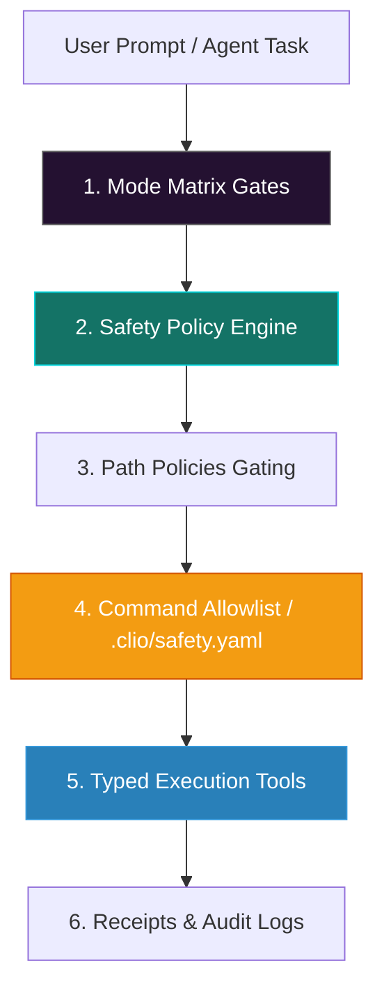
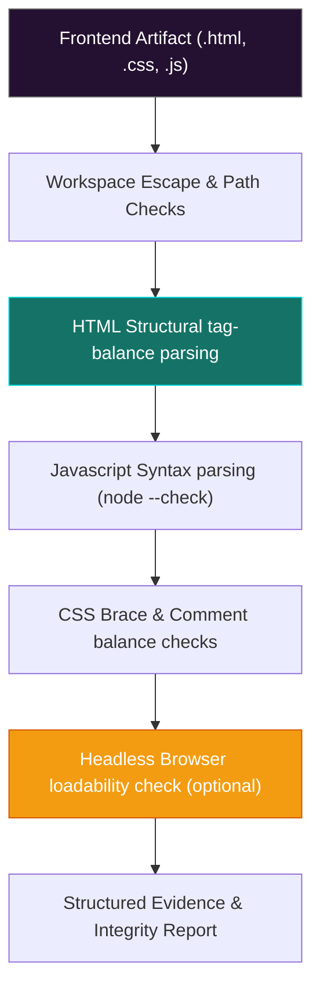

# Clio Coder Multi-Layered Safety Model

In Clio Coder, **safety is code-enforced, not prompt-enforced**. While general coding agents rely on model prompts to avoid destructive behaviors, Clio Coder intercepts tool calls at the codebase level, validating arguments, matching path policies, and filtering shells through strict, deterministic validation pipelines.

---

## 🛡️ The Multi-Layered Enforcement Architecture

Clio Coder applies six layers of defensive enforcement around all agent activities:



### 1. Mode Matrix Gates
The safety posture is tied to three operational modes that restrict tool classes:
- **`advise` mode:** Purely read-only exploration and planning. dispatches are restricted to read-only environments. Writing or executing tools are completely invisible and failed closed.
- **`default` mode:** Active repository editing. Commands must pass default-deny checks, and dangerous modifications are blocked or parked.
- **`super` mode:** One-shot elevated authorization. The operator grants a specific tool or command one-time privilege. Base hard-blocks still apply.

### 2. Safety Policy Engine
Monitors outgoing parameters. It matches inputs against the parsed base rule-pack:
- **L3 Sandboxing (Damage-Control rules):** Prevents destructive commands like `rm -rf /`, `git push --force`, `dd` device writes, fork bombs, and piping raw curl downloads to shell. These are hard-blocked across **all modes** (including `super`).
- **L4 Command Filtering:** Default-mode Bash behaves as default-deny. Shell operators (e.g., `;`, `&&`, `|`, `>`) are rejected inside commands unless explicitly authorized.

---

## ⚙️ Project Command Policy (`.clio/safety.yaml`)

To run repository-specific build or script pipelines, developers declare reviewed commands inside `.clio/safety.yaml` (schema v1). Any script not matching this exact layout is rejected under default-deny.

### Example `.clio/safety.yaml` configuration:
```yaml
version: 1
zeroAccessPaths:
  - secrets/
  - .env
readOnlyPaths:
  - vendor/
noDeletePaths:
  - src/generated/
commands:
  - id: local-test
    command: npm test
    cwd: .
    timeoutMs: 120000
    maxOutputBytes: 600000
    actionClass: execute
    shellOperators: deny
    requireConfirmation: false
    rationale: Standard local test command.
    owner: maintainers
    comment: Keep exact and reviewed.
```

### Strict Policy Invariants:
1. **No directory escaping:** The `cwd` must be relative to the policy root and cannot escape it using parent folder paths (`..`). Absolute paths are rejected.
2. **Invalid fails closed:** Any unknown keys, wrong types, duplicate command IDs, or unsupported action classes render the entire policy file invalid, completely blocking command execution.
3. **No self-modification:** The policy is snapshotted when Clio starts. Dispatched agents cannot edit `.clio/safety.yaml` to dynamically grant themselves permissions during a run.
4. **Path-policy constraints:**
   - `zeroAccessPaths`: Blocks read, write, and delete.
   - `readOnlyPaths`: Blocks write and delete.
   - `noDeletePaths`: Blocks delete.

---

## 🛠️ L5 Enforcement: Typed Execution Tools

The production direction for Clio is **L5 safety**: replacing arbitrary Bash commands entirely with specialized, typed, and bounded tool interfaces.

Clio ships with built-in typed validation tools:
- `git_status`, `git_diff`, `git_log`
- `run_tests`, `run_lint`, `run_build`
- `package_script` (gated execution of package JSON routines)
- `validate_frontend` (dedicated frontend static checker)

---

## 🔍 In-Depth: The `validate_frontend` Tool

To validate modified web UI and frontend components safely, Clio uses the dedicated `validate_frontend` tool. It validates HTML, CSS, and JS artifacts without granting terminal shell access:



### Validator Sub-checks:
1. **HTML Validation:** Parses layout elements, checking tag balancing and traversing local script/stylesheet links.
2. **CSS Validation:** Validates brace structural matching, comment closures, and string bounds.
3. **JavaScript Validation:** Extracts inline and external JavaScript, executing in-process AST checks or `node --check` for module forms.
4. **Headless Browser Loading:** Optionally boots a local headless browser instance (`browser=auto|required|off`) to verify that the generated interface loads without script crashes.
5. **Path Sandboxing:** Bounded to the workspace. Malformed paths, external references, or `..` directory escapes fail instantly with structured evidence logged in the tool receipt.
