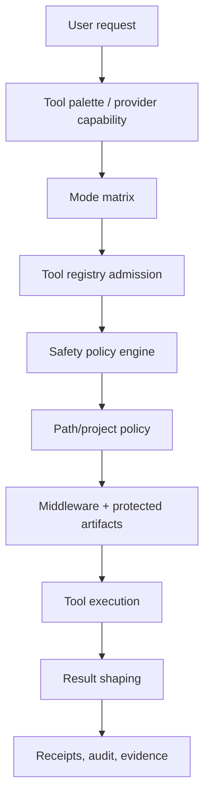

# Clio Coder Safety Model

Clio Coder's safety posture is code-enforced, not prompt-only. Prompt text tells the model how to behave, but execution is gated by the mode matrix, tool registry, safety policy engine, project policy, protected-artifact checks, and receipts.

Source of truth: `src/domains/modes/matrix.ts`, `src/domains/safety/**`, `src/tools/registry.ts`, `src/tools/bootstrap.ts`, and `damage-control-rules.yaml`.

---

## Enforcement path



Key principle: a tool hidden by mode or target capability is not shown to the model; a tool that is shown still must pass registry and safety admission before it can run.

---

## Modes and visible tools

| Mode | Tool/action posture |
| --- | --- |
| `advise` | Read/search/web/git inspection, `write_plan`, `write_review`, `dispatch`, and `read_skill`. Dispatch scope is readonly. |
| `default` | Read/write/edit/search/web/git inspection, typed validation tools, `bash`, `dispatch`, and skills. Allowed actions are read, write, execute, dispatch. |
| `super` | Same visible tool set as default, plus `system_modify` action-class admission. Git-destructive actions remain hard-blocked unless a damage-control rule explicitly asks and is confirmed. |

Representative built-in tools:

| Group | Tools |
| --- | --- |
| File/search | `read`, `write`, `edit`, `grep`, `find`, `glob`, `ls` |
| Web/context/codewiki | `web_fetch`, `workspace_context`, `find_symbol`, `entry_points`, `where_is` |
| Git/safe exec | `git_status`, `git_diff`, `git_log`, `run_tests`, `run_lint`, `run_build`, `package_script` |
| Frontend | `validate_frontend` |
| Advice artifacts | `write_plan`, `write_review` |
| Skills/fleet | `read_skill`, `create_skill`, `dispatch` |
| Escape hatch | `bash` |

Target capability, dispatch tool profiles, and recipe constraints can further narrow the tools available to a run. That narrowing is convenience and budget control; safety still lives in code gates.

---

## Damage-control rules

`damage-control-rules.yaml` is compiled into rule packs. Base rules apply broadly. Some rules can require confirmation; hard-block rules remain blocked across modes.

Examples of patterns the rules target include destructive filesystem operations, dangerous device writes, fork bombs, pipe-to-shell installers, and destructive git operations.

Safety policy metadata records active rule IDs and hashes so receipts/evidence can explain which rule pack was active.

---

## Default-deny Bash

In `default` mode, arbitrary Bash is denied. A Bash call can run when it matches one of these paths:

1. a valid `.clio/safety.yaml` command entry;
2. a narrow built-in allowlist such as `pwd`, simple `ls`, `git status`, bounded `git diff/log`, common test/lint/build commands, `pytest`, `cargo test`, `go test`, or `make test`;
3. super-mode elevation.

Default mode denies shell operators such as `&&`, `||`, `;`, pipes, redirects, command substitution, and newlines unless an exact project-policy entry opts in.

Bash `cwd` is resolved under the workspace root. Escaping the workspace is blocked unless a reviewed project policy permits the exact command/cwd combination.

---

## Project safety policy

Clio searches upward from the current working directory for `.clio/safety.yaml`. The file is parsed once into a loaded policy. Invalid policy files fail closed for execution tools.

Minimal schema v1:

```yaml
version: 1
zeroAccessPaths:
  - secrets/
  - .env
readOnlyPaths:
  - vendor/
noDeletePaths:
  - out/validated/
commands:
  - id: local-test
    command: npm test
    cwd: .
    timeoutMs: 120000
    maxOutputBytes: 600000
    actionClass: execute
    shellOperators: deny
    env:
      mode: none
      allow: []
    requireConfirmation: false
    rationale: Standard local test command.
    owner: maintainers
    comment: Keep exact and reviewed.
```

Accepted root keys:

```text
version | commands | tasks | disableDefaultPathPolicy | zeroAccessPaths | readOnlyPaths | noDeletePaths
```

`tasks` is an alias for command policy entries. Unknown keys, wrong types, duplicate command IDs, absolute `cwd`, `..`-escaping `cwd`, and invalid path-policy entries make the policy invalid.

Path-policy behavior:

| Key | Effect |
| --- | --- |
| `zeroAccessPaths` | Blocks read, write, and delete. |
| `readOnlyPaths` | Allows read, blocks write/delete. |
| `noDeletePaths` | Blocks delete. |
| `disableDefaultPathPolicy` | Uses only project path policy rather than merging default damage-control paths. |

Command entry notes:

| Field | Meaning |
| --- | --- |
| `shellOperators` | `deny` by default; `allow` only for exact reviewed commands. |
| `env` | `mode: none` by default; `mode: allowlist` permits named environment variables. |
| `requireConfirmation` | Parks the call for super confirmation instead of immediate allow. |

---

## Typed validation tools

Prefer typed tools over Bash:

- `git_status`, `git_diff`, `git_log` use fixed command vectors.
- `run_tests`, `run_lint`, `run_build`, and `package_script` use bounded execution helpers.
- `validate_frontend` validates frontend artifacts without granting arbitrary shell access.

`validate_frontend` accepts `.html`, `.htm`, `.css`, `.js`, `.mjs`, and `.cjs` under the workspace root. It checks HTML tag balance, local script/style references, JavaScript syntax, CSS brace/comment/string balance, and optionally loads HTML with an available headless Chromium/Chrome/Edge executable (`browser: auto|required|off`).

---

## Dispatch and external runtimes

Fleet dispatch is admitted only when the requested worker scope is a subset of the orchestrator scope and requested actions fit the worker scope.

Worker-only subprocess runtimes (`codex-cli`, `opencode-cli`) are delegated sandboxes. Clio maps them conservatively by default and requires explicit opt-in (`CLIO_ALLOW_EXTERNAL_FULL_ACCESS=1`) before mapping super-style requests to external full-access/bypass modes. Receipts record subprocess runtime limitations.

---

## Receipts and evidence

Safety decisions feed receipts, audit rows, and evidence artifacts. When reporting a problem, include redacted receipts or evidence IDs when possible so maintainers can see:

- mode and requested action class;
- policy source and rule IDs;
- project policy hash/path;
- blocked/asked/allowed decision counts;
- tool statistics and failure messages.
