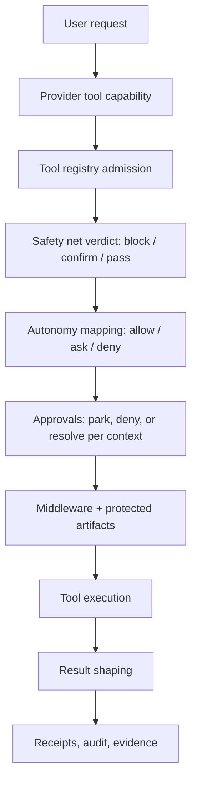

# Clio Coder Safety Model

> [!TIP]
> **Interactive Spec Available:** An interactive dashboard is located at [docs/html/safety_blueprint.html](html/safety_blueprint.html) (Version: 0.2.3).

Clio Coder's safety posture is code-enforced, not prompt-only. Prompt text tells the model how to behave, but execution is gated by target capabilities, the tool registry, safety policy engine, project policy, protected-artifact checks, and receipts.

Source of truth: `src/domains/safety/**`, `src/tools/registry.ts`, `src/tools/bootstrap.ts`, and `damage-control-rules.yaml`.

---

## Two axes: autonomy and the safety net

The `autonomy` setting (`read-only` | `suggest` | `auto-edit` | `full-auto`) is an enforced dial. It controls exactly one thing: which action classes run immediately, which park for operator approval, and which are auto-denied. The safety net (damage-control rules, path policy, protected artifacts, loop guard, dispatch scope admission) is independent of the dial and identical at every level. When a `[safety-net]` notice appears at full-auto, that is the always-on net working as designed, not a contradiction of the level.

### Autonomy levels

| Action class | `read-only` | `suggest` | `auto-edit` (default) | `full-auto` |
|---|---|---|---|---|
| `read` | allow | allow | allow | allow |
| `write` | deny | ask | allow | allow |
| `execute`: builtin no-prompt set + project commands | deny | ask | allow | allow |
| `execute`: any other bash | deny | ask | ask | allow |
| `dispatch` | deny | ask | allow | allow |
| `system_modify` | deny | ask | ask | ask |
| `git_destructive` | net block | net block | net block | net block |
| `unknown` | deny | ask | ask | ask |

- **`read-only`**: Clio inspects and answers. Mutating calls are auto-denied with a rejection telling the model to propose the change instead; approvals are never invoked. Denials render as `[autonomy]` notices.
- **`suggest`**: every non-read action parks for one-shot approval. The operator drives.
- **`auto-edit`**: workspace edits and recognized commands run; unrecognized bash asks instead of blocking.
- **`full-auto`**: bash runs without prompting; the net is the protection, not the prompt. `system_modify` still asks because it reaches outside the workspace; `unknown` still asks because the net cannot reason about calls it cannot classify.

The level is persisted as `autonomy` in `settings.yaml`, hot-reloads, and is edited in the `/settings` Autonomy & Safety section.

---

## Enforcement path

Every tool call, orchestrator or worker, evaluates in this order:

1. **Safety net** (policy engine + middleware guards): `block` is final at every level; `ask` is a confirm rail (damage-control `ask` rules, project `requireConfirmation`) that parks at every level; `pass` hands off to step 2.
2. **Autonomy mapping**: the action class plus the level produce allow, ask, or deny per the matrix above.
3. **Approvals**: whatever asked in step 1 or 2 parks interactively, denies deterministically headless, resolves per `workers.onPermission` in workers, and non-stall denies in delegations.



Net `confirm` is never auto-allowed by autonomy, including full-auto. Net `block` is never downgraded by anything. A tool hidden by target capability or explicit suppression is not shown to the model; a tool that is shown still must pass this path before it can run.

---

## Operating Posture and Visible Tools

Clio operates under a single operating posture with a standard, unified visible toolset. This posture provides the model with read, write, edit, and execution capabilities.

Representative built-in tools:

| Group | Tools |
| --- | --- |
| File/search | `read`, `write`, `edit`, `grep`, `find`, `glob`, `ls` |
| Web/context/codewiki | `web_fetch`, `workspace_context`, `code_nav` |
| Git/safe exec | `git`, `run_task` |
| Frontend | `validate_frontend` |
| Advice artifacts | `write_plan`, `write_review` |
| Skills/fleet | `read_skill`, `create_skill`, `dispatch` |
| Escape hatch | `bash` |

Target capability, dispatch tool profiles, and recipe constraints can further narrow the tools available to a run. That narrowing is convenience and budget control; safety still lives in code gates.

---

## Damage-control rules

`damage-control-rules.yaml` is compiled into rule packs. Base rules apply broadly. Rules with `ask: true` park for one-shot confirmation (for example `git stash drop` and remote-branch deletion); hard-block rules and classifier-pattern `git_destructive` hits are always blocked. Both behaviors apply at every autonomy level.

Examples of patterns the rules target include destructive filesystem operations, dangerous device writes, fork bombs, pipe-to-shell installers, and destructive git operations.

Safety policy metadata records active rule IDs and hashes so receipts/evidence can explain which rule pack was active.

---

## Bash recognition

The policy engine tags every bash command as recognized or unrecognized; the autonomy mapping decides what happens next:

1. **Recognized**: a valid `.clio/safety.yaml` command entry, or the narrow built-in no-prompt set such as `pwd`, simple `ls`, `git status`, bounded `git diff/log`, common test/lint/build commands, `pytest`, `cargo test`, `go test`, or `make test`. Recognized commands run without prompting at `auto-edit` and `full-auto`.
2. **Unrecognized**: anything else. Unrecognized bash asks for one-shot approval at `auto-edit` and runs at `full-auto`; at `suggest` it asks like every mutation, and at `read-only` it is denied.

Shell operators split two ways. Sequencing and redirection (`&&`, `||`, `;`, pipes, redirects, newlines) make a command unrecognized: it asks at `auto-edit` and runs at `full-auto`. Command substitution (`$(...)`, backticks) is a net confirm rail at every level, full-auto included, because the net cannot scan what it executes until runtime. The rule pack scans the full command string before either check, so a destructive verb behind an operator is caught regardless of level. Project policy entries reject both operator kinds unless the entry sets `shellOperators: allow`.

Bash `cwd` is resolved under the workspace root. Escaping the workspace is blocked unless a reviewed project policy permits the exact command/cwd combination.

---

## Project safety policy

Clio searches upward from the current working directory for `.clio/safety.yaml`. The file is parsed once into a loaded policy. Invalid policy files fail closed for execution tools.

Minimal schema v1:

```yaml
version: 1
zeroAccessPaths:
  - secrets/
  - .env
readOnlyPaths:
  - vendor/
noDeletePaths:
  - out/validated/
commands:
  - id: local-test
    command: npm test
    cwd: .
    timeoutMs: 120000
    maxOutputBytes: 600000
    actionClass: execute
    shellOperators: deny
    env:
      mode: none
      allow: []
    requireConfirmation: false
    rationale: Standard local test command.
    owner: maintainers
    comment: Keep exact and reviewed.
```

Accepted root keys:

```text
version | commands | tasks | disableDefaultPathPolicy | zeroAccessPaths | readOnlyPaths | noDeletePaths
```

`tasks` is an alias for command policy entries. Unknown keys, wrong types, duplicate command IDs, absolute `cwd`, `..`-escaping `cwd`, and invalid path-policy entries make the policy invalid.

Path-policy behavior:

| Key | Effect |
| --- | --- |
| `zeroAccessPaths` | Blocks read, write, and delete. |
| `readOnlyPaths` | Allows read, blocks write/delete. |
| `noDeletePaths` | Blocks delete. |
| `disableDefaultPathPolicy` | Uses only project path policy rather than merging default damage-control paths. |

Command entry notes:

| Field | Meaning |
| --- | --- |
| `shellOperators` | `deny` by default; `allow` only for exact reviewed commands. |
| `env` | `mode: none` by default; `mode: allowlist` permits named environment variables. |
| `requireConfirmation` | Parks the call for super confirmation instead of immediate allow. |

---

## Typed validation tools

Prefer typed tools over Bash:

- `git` (op=status/diff/log) uses fixed command vectors.
- `run_task` uses bounded execution helpers with an allowlisted script set.
- `validate_frontend` validates frontend artifacts without granting arbitrary shell access.

`validate_frontend` accepts `.html`, `.htm`, `.css`, `.js`, `.mjs`, and `.cjs` under the workspace root. It checks HTML tag balance, local script/style references, JavaScript syntax, CSS brace/comment/string balance, and optionally loads HTML with an available headless Chromium/Chrome/Edge executable (`browser: auto|required|off`).

The `edit` tool also carries conservative matching rules. It preserves
unchanged bytes, handles common quote, dash, whitespace, and indentation drift
for matching only, and rejects ambiguous or no-op edits rather than applying a
guess.

---

## Dispatch runtimes

Fleet dispatch is admitted only when the requested worker scope is a subset of the orchestrator scope and requested actions fit the worker scope.

Dispatch workers can run the same HTTP/native/pi-ai-backed runtimes as the orchestrator, driven through pi-agent-core. Clio observes and governs those tool calls directly, so every worker run is subject to the same safety mapping and receipt accounting as an interactive turn.

Two worker-only Claude Code subscription runtimes are also available:

- `claude-sdk` uses `@anthropic-ai/claude-agent-sdk`. Claude Code still executes its own built-in tools, but every SDK `canUseTool` request is mapped into Clio's safety net and autonomy matrix before the SDK receives `allow` or `deny`. Clio `ask` outcomes resolve through the worker non-stall policy (`workers.onPermission=deny|fail`) because a dispatched worker has no interactive operator.
- `claude-code` runs the installed `claude` binary with `claude -p --output-format stream-json`. The current CLI help does not expose a structured permission callback equivalent to the SDK `canUseTool` hook, so this path is constrained through Claude Code permission modes. Dangerous bypass posture is only passed when the worker autonomy is `full-auto` and `CLIO_ALLOW_EXTERNAL_FULL_ACCESS=1`; otherwise the subprocess runner uses non-bypass modes.

Both Claude Code runtimes rely on the user's existing `claude` login and store no credential in Clio.

---

## Approvals

An `ask` can come from either axis: a safety-net confirm rail (damage-control `ask` rule, project `requireConfirmation`) or the autonomy mapping. The permission overlay names the asking axis on its `Asked by:` line, and the transcript carries an `[approval]` notice for every parked call. How an ask resolves depends on the context:

### Interactive TUI Behavior

In interactive mode, a permission request opens a queued overlay prompt immediately in the TUI.
- **Queued Overlays:** If multiple tools or worker dispatches require permission during a single turn, the TUI queues the requests. Closing one overlay automatically pops the next permission overlay in the queue.
- **Operator Options:** The operator can grant permission once, which resumes only the parked tool call without changing the overall operating posture. Cancelling or denying the prompt cancels the parked tool call cleanly.

### Deterministic Headless Behavior

When executing tasks in headless mode through `clio run`, there is no terminal operator to prompt.
- **Deterministic Denials:** Any action that requires permission resolves as a deterministic tool denial. The model receives the rejection and may adapt within the same run.
- **Rejection Message:** The engine assigns a standard rejection reason to the denied action: `"clio run cannot confirm permission requests; rerun interactively to approve this action."`
- **Run Exit:** The process exit code reflects the overall run outcome, not the permission denial by itself. A run can still exit 0 if the model completes successfully after receiving the rejected tool result.
- **Receipts and Audit:** Headless permission denials increment `permissionRequested` receipt/audit counts, so scripts can detect that approval would have been needed without treating every denial as a failed process.

### Workers and delegations

- **Workers** inherit the session's autonomy level, capped by dispatch scope admission. A worker ask resolves per `workers.onPermission`: `deny` continues the run with a rejection; `fail` ends it.
- **Delegations (ACP)** under `clio-policy` governance evaluate through the same net and autonomy mapping; an ask resolves as a non-stall deny so the external agent never hangs waiting for an operator.

---

## Receipts and evidence

Safety decisions feed receipts, audit rows, and evidence artifacts. Audit rows flush asynchronously from concurrent producers and are not time-ordered within a `.jsonl` file; consumers must sort rows by `ts` before reasoning about sequence (the evidence builder already does). The interactive [`/view`](observability.md) surface can inspect and verify receipt artifacts without mutating them. When reporting a problem, include redacted receipts or evidence IDs when possible so maintainers can see:

- mode and requested action class;
- policy source and rule IDs;
- project policy hash/path;
- blocked/asked/allowed decision counts;
- tool statistics and failure messages.
