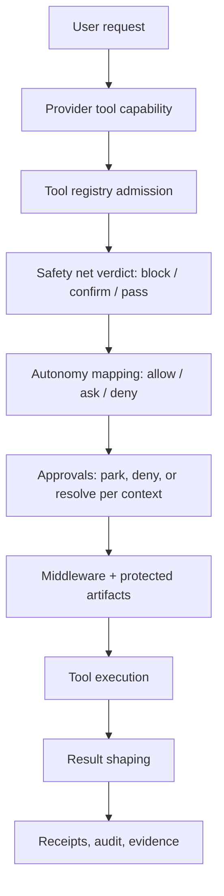

# Clio Coder Safety Model

> [!TIP]
> **Interactive Spec Available:** An interactive dashboard is located at [docs/html/safety_blueprint.html](html/safety_blueprint.html) (Version: 0.3.3).

Clio Coder's safety posture is code-enforced, not prompt-only. As the orchestrator coding agent in the [IOWarp](https://iowarp.ai) ecosystem developed by the [Gnosis Research Center](https://grc.iit.edu) at Illinois Tech under NSF Award [#2411318](https://www.nsf.gov/awardsearch/showAward?AWD_ID=2411318), Clio gates execution by target capabilities, the tool registry, the safety policy engine, project policies, protected-artifact checks, and audit receipts.

Source of truth: `src/domains/safety/**`, `src/tools/registry.ts`, `src/tools/bootstrap.ts`, `src/tools/policy.ts`, `src/entry/orchestrator.ts`, `src/domains/dispatch/write-boundary.ts`, `src/interactive/view/artifacts.ts`, and `damage-control-rules.yaml`.

---

## Two axes: autonomy and the safety net

The `autonomy` setting (`read-only` | `suggest` | `auto-edit` | `full-auto`) is an enforced dial. It controls exactly one thing: which action classes run immediately, which park for operator approval, and which are auto-denied. The safety net (damage-control rules, path policy, protected artifacts, loop guard, dispatch scope admission) is independent of the dial and identical at every level. When a `[safety-net]` notice appears at full-auto, that is the always-on net working as designed, not a contradiction of the level.

In Clio Coder v0.3.3, effective autonomy resolution is strictly centralized in `src/entry/orchestrator.ts` through `resolveEffectiveAutonomy` and `resolveBaselineAutonomy`. Every admission surface (tool registry admission, dispatch plan provenance, and ACP session snapshots) delegates to this pair of functions so that fallback paths cannot diverge across execution contexts. `resolveBaselineAutonomy` evaluates dispatch settings overrides, headless CLI options, and configuration settings before applying the default `auto-edit` level. `resolveEffectiveAutonomy` combines any active ACP session autonomy level with the baseline resolution.

### Autonomy levels

| Action class | `read-only` | `suggest` | `auto-edit` (default) | `full-auto` |
|---|---|---|---|---|
| `read` | allow | allow | allow | allow |
| `write` | deny | ask | allow | allow |
| `execute`: builtin no-prompt set + project commands | deny | ask | allow | allow |
| `execute`: any other bash | deny | ask | ask | allow |
| `dispatch` | deny | ask | allow | allow |
| `system_modify` | deny | ask | ask | ask |
| `git_destructive` | net block | net block | net block | net block |
| `unknown` | deny | ask | ask | ask |
| `read`: a gate declaring `exposure: outward` | allow | ask | ask | allow |

- **`read-only`**: Clio inspects and answers. Mutating calls are auto-denied with a rejection telling the model to propose the change instead; approvals are never invoked. Denials render as `[autonomy]` notices.
- **`suggest`**: every non-read action parks for one-shot approval. The operator drives.
- **`auto-edit`**: workspace edits and recognized commands run; unrecognized bash asks instead of blocking.
- **`full-auto`**: bash runs without prompting; the net is the protection, not the prompt. `system_modify` still asks because it reaches outside the workspace; `unknown` still asks because the net cannot reason about calls it cannot classify.

The exposure tier is the one row keyed by the call rather than by its action class. A call may declare `exposure: outward` when answering it publishes or sends something the operator cannot quietly take back: filing an issue or a PR, posting a comment, pushing a branch, cutting a release. Today `ask_user` is the only tool that declares one, so a skill marks its own confirmation step outward and `auto-edit` parks that gate for the operator instead of answering it. Acting on the workspace without asking is not the same permission as publishing without asking. `suggest` parks it too, because the dial is ordered and a stricter level must never gate a surface less than the looser one below it. `full-auto` answers outward gates like everything else, `read-only` still answers them because the outward effect being confirmed is denied there anyway, and the tier only ever adds an ask: it never widens a row the action class already denied. The tier is declared, never inferred, because only the caller knows whether the step it is confirming leaves the machine; a value the schema does not recognize reads as `outward` and the call is then rejected, so a misspelled tier costs one prompt rather than silently downgrading the gate.

The `system_modify` confirm is level-invariant, so it is enforced and attributed as a safety-net confirm rail: the overlay, notices, and audit ledger name the net (reason code `system-modify-confirm`, policy source `builtin-classifier`), not the autonomy level. The matrix row above is unchanged in outcome at every level; only `read-only` converts the ask to a denial. `unknown` remains in the autonomy mapping because the registry substitutes a registered tool's base action class after the net evaluates.

The level is persisted as `autonomy` in `settings.yaml`, hot-reloads, and is edited in the `/settings` Autonomy & Safety section.

---

## Enforcement path

Every tool call, orchestrator or worker, evaluates in this order:

1. **Safety net** (policy engine + middleware guards): `block` is final at every level; `ask` is a confirm rail (damage-control `ask` rules, project `requireConfirmation`, `system_modify`) that parks at every level; `pass` hands off to step 2. Blocks precede asks: a damage-control `ask` rule never bypasses a hard block, so confirming an ask-rule command that targets a zero-access path still blocks. The built-in path protection (which includes zero-access blocklists for critical files like `.git/config` and `credentials.yaml`, resolved with symlink canonicalization to prevent bypasses) is evaluated even when `.clio-coder/safety.yaml` is malformed, invalid, or attempts to override it. A malformed project policy cannot disable built-in default path protection, so credential protection never fails open.
2. **Autonomy mapping**: the action class plus the level produce allow, ask, or deny per the matrix above.
3. **Approvals**: whatever asked in step 1 or 2 parks interactively, denies deterministically headless, resolves per `workers.onPermission` in workers, and non-stall denies in delegations.


```mermaid
graph TD
    user[User request] --> surface[Provider tool capability]
    surface --> registry[Tool registry admission]
    registry --> net[Safety net verdict: block / confirm / pass]
    net --> autonomy[Autonomy mapping: allow / ask / deny]
    autonomy --> approvals[Approvals: park, deny, or resolve per context]
    approvals --> middleware[Middleware + protected artifacts]
    middleware --> run[Tool execution]
    run --> shape[Result shaping]
    shape --> receipt[Receipts, audit, evidence]
```

Net `confirm` is never auto-allowed by autonomy, including full-auto. Net `block` is never downgraded by anything. A tool hidden by target capability or explicit suppression is not shown to the model; a tool that is shown still must pass this path before it can run.

### Worker permission escalation

Dispatched workers run non-interactively, so step 3 resolves per `workers.onPermission`: `deny` turns the parked call into a structured denial, `fail` ends the run, and `escalate` hands the ask up to the interactive operator. Under `escalate` the worker parks the call, emits a `clio_permission_escalated` event, and waits; dispatch republishes the ask on the bus tagged with the run id; the operator resolves it in the same permission overlay used for the main agent; and the decision returns down the worker's stdin. Resolution is human-only by construction: no model-facing tool can approve a worker permission, and the dispatch `resolveWorkerPermission` method is reachable only from the interactive layer. This preserves the receipt's honesty, since a model approving its own fleet's asks would collapse the audit trail.

Escalation can never hang a run. Every escalated ask resolves by an operator decision or by the `workers.escalation` timeout fallback (`{ timeoutMs, fallback }`, defaults 120000 ms and `deny`); a headless session has no subscriber, so the timeout fallback always governs there. The worker keeps emitting heartbeats while parked, so the reconciler does not reap it, and every escalation and its resolution source (operator or timeout) is recorded on the receipt.

---

## Operating Posture and Visible Tools

Clio operates under a single operating posture with a standard, unified visible toolset. The 20 built-in tools are organized in seven planes; each plane is one policy unit for action class, size posture, and concurrency, asserted at bootstrap by `src/tools/policy.ts` so the classifier and the registered specs can never drift apart silently.

| Plane | Tools | Action class |
| --- | --- | --- |
| OBSERVE | `read`, `grep`, `find`, `ls`, `code_nav`, `context`, `credential_present` | `read` |
| MUTATE | `write`, `edit` | `write` |
| EXECUTE | `bash`, `verify` | `execute` |
| EXECUTE | `git` | `read` |
| ORCHESTRATE | `dispatch`, `steer` | `dispatch` |
| ORCHESTRATE | `monitor`, `tasks` | `read` |
| RETRIEVE | `web_fetch` | `read` |
| INTERACT | `ask_user` | `read` |
| ARTIFACT | `artifact` | `write` |

`git` is read-only inspection on the safe-exec spine, so it carries the read class despite living in the EXECUTE plane. `monitor` does not mutate a run or the workspace. The model-facing `tasks` tool is an intentional bookkeeping exception to the everyday meaning of "read": board mutations append full `taskLedger` snapshots to Clio's session ledger, and any action may reconcile the project-local `.clio-coder/user-tasks.json` inbox while `pick` and linked `done` update its durable correlation. Those Clio-owned ledger and inbox mutations intentionally remain audited with `actionClass: "read"`, so task planning and pickup stay available at every autonomy level without an approval card. This classification grants no source-workspace, command-execution, or run-mutation authority; those operations still require their own tools and action classes. `gateway` is a design-reserved name only (see `src/core/tool-names.ts`), not a registered tool.

Target capability, dispatch tool profiles, and recipe constraints can further narrow the tools available to a run. That narrowing is convenience and budget control; safety still lives in code gates.

### Workspace artifact reads

The `/view` workspace category treats a recorded successful write as a durable fact, not as permanent read authority over that pathname. Immediately before every file load, the viewer resolves both the recorded workspace root and selected target through the live filesystem, checks canonical path-segment containment, and reads the canonical target. It does not cache the canonical workspace root between provider construction and load. A file or ancestor directory swapped to a symlink outside the current workspace is refused without reading the outside target. An `ENOENT` from re-resolution or loading keeps the durable `file no longer on disk (recorded at ...)` result instead of dropping the artifact row.

---

## Skill tool surface narrowing

A `SKILL.md` may declare `allowed-tools` and `disallowed-tools`. The declaration is enforced at tool admission, between the safety net and the autonomy mapping, on every surface that activates skills (interactive turns, headless `clio-coder run` turns, and dispatched workers whose recipes declare skills).

- **Window.** Narrowing arms when `context` (scope="skills") successfully loads the skill and lasts for the lifetime of the pending-skill policy: to the end of the current turn for the main agent, and to the end of the run for a worker. A later turn is unrestricted until a skill is requested and loaded again.
- **Merge.** Denials win: a tool named in any loaded skill's `disallowed-tools` is blocked. Allow-narrowing applies only while every loaded skill declares `allowed-tools`; the merged surface is the union of those lists. A loaded skill that declares no `allowed-tools` keeps the full surface for its own workflow, which lifts the allow-narrowing (never the denials) for that window.
- **Exemptions.** `context` (the remaining requested skills of the turn must still load) and `ask_user` (the escape hatch the block message points at) are always admitted.
- **Direction.** Narrowing only blocks. It never grants a tool the safety net, damage-control rules, or autonomy mapping would refuse, and an out-of-surface call blocks terminally instead of parking for confirmation.
- **Block message.** The rejection names the tool, the active skill(s), and the merged surface, and states the remediation: work within the declared surface, or use `ask_user` (when available) to hand the step to the operator. The audit row carries reason code `skill_surface`.

---

## Damage-control rules

`damage-control-rules.yaml` is compiled into rule packs. Base rules apply broadly. Rules with `ask: true` park for one-shot confirmation (for example `git stash drop` and remote-branch deletion); hard-block rules and classifier-pattern `git_destructive` hits are always blocked. Both behaviors apply at every autonomy level.

Examples of patterns the rules target include destructive filesystem operations, dangerous device writes, fork bombs, pipe-to-shell installers, and destructive git operations.

Safety policy metadata records active rule IDs and hashes so receipts/evidence can explain which rule pack was active.

---

## Bash recognition

The policy engine tags every bash command as recognized or unrecognized; the autonomy mapping decides what happens next:

1. **Recognized**: a valid `.clio-coder/safety.yaml` command entry, or the narrow built-in no-prompt set such as `pwd`, simple `ls`, `git status`, bounded `git diff/log`, common test/lint/build commands, `pytest`, `cargo test`, `go test`, or `make test`. In addition, compound `&&` chains where every segment is a recognized safe command (up to `CHAIN_MAX_SEGMENTS = 6`) are recognized. Commands wrapped inside `sh -c` are expanded up to depth 3 (`INNER_SHELL_MAX_DEPTH = 3`) and evaluated segment by segment. Recognized commands run without prompting at `auto-edit` and `full-auto`.
2. **Unrecognized**: anything else. Unrecognized bash asks for one-shot approval at `auto-edit` and runs at `full-auto`; at `suggest` it asks like every mutation, and at `read-only` it is denied.

Shell operators split two ways. Unrecognized sequencing and redirection (`||`, `;`, pipes, redirects, newlines, or `&&` chains with unapproved commands or more than 6 segments) make a command unrecognized: it asks at `auto-edit` and runs at `full-auto`. Command substitution (`$(...)`, backticks) is a net confirm rail at every level, full-auto included, because the net cannot scan what it executes until runtime. The rule pack scans the full command string before either check, so a destructive verb behind an operator is caught regardless of level. Project policy entries reject operator kinds unless the entry sets `shellOperators: allow`.

Bash `cwd` is resolved under the workspace root. Escaping the workspace is blocked unless a reviewed project policy permits the exact command/cwd combination.

---

## Policy Engine Evaluation Order

Source: `src/domains/safety/policy-engine.ts`.

Every tool call entering the safety engine passes through a strict 10-step evaluation sequence. Safety-net blocks are final; autonomy mapping applies only after the safety net passes:

1. **Damage-Control Scan**: Evaluates compiled rule packs (`damage-control-rules.yaml`) against command strings, paths, and tool arguments.
2. **Write-Root Containment**: Verifies that mutations remain within configured write boundaries (`evaluateWriteRoots`).
3. **Hard Blocks**: Enforces unconditional blocks against destructive actions (such as `git_destructive` operations and zero-access credentials).
4. **Invalid Project Policy Fail-Closed**: If `.clio-coder/safety.yaml` contains parsing or schema errors, execution tools fail closed.
5. **Path Policy Enforcement**: Evaluates `zeroAccessPaths`, `readOnlyPaths`, `noWritePaths`, and `noDeletePaths`.
6. **Bash Zero-Access Protocol**: Rejects shell commands attempting to read, exfiltrate, or redirect from protected credential files. A safe presence-check exception (`grep -sq "^NAME=" <file>`) is permitted for environment probing without exposing secrets.
7. **Ask Rails**: Evaluates rules requiring confirmation (such as project `requireConfirmation` or unanalyzable command substitutions `$(...)`).
8. **System Modify Checks**: Assesses operating-system level modification commands targeting system roots (`/etc`, `/usr`, `/var`, `/bin`, `/sbin`, `/run`), exempting temporary write paths (`/var/tmp`, `/var/folders`).
9. **Bash Allowlist Recognition**: Checks whether the command matches the known safe command allowlist or compound `&&` chain.
10. **Default Allow**: If no prior rule intervened, the action proceeds to autonomy-level evaluation.

---

## Project safety policy

Clio searches upward from the current working directory for `.clio-coder/safety.yaml`. The file is parsed once into a loaded policy. Invalid policy files fail closed for execution tools.

Minimal schema v1:

```yaml
version: 1
zeroAccessPaths:
  - secrets/
  - .env
readOnlyPaths:
  - vendor/
noWritePaths:
  - third_party/generated/
noDeletePaths:
  - out/validated/
commands:
  - id: local-test
    command: npm test
    cwd: .
    timeoutMs: 120000
    maxOutputBytes: 600000
    actionClass: execute
    shellOperators: deny
    env:
      mode: none
      allow: []
    requireConfirmation: false
    rationale: Standard local test command.
    owner: maintainers
    comment: Keep exact and reviewed.
```

Accepted root keys:

```text
version | commands | tasks | disableDefaultPathPolicy | zeroAccessPaths | readOnlyPaths | noWritePaths | noDeletePaths
```

`tasks` is an alias for command policy entries. Unknown keys, wrong types, duplicate command IDs, absolute `cwd`, `..`-escaping `cwd`, and invalid path-policy entries make the policy invalid.

Path-policy behavior:

| Key | Effect |
| --- | --- |
| `zeroAccessPaths` | Blocks read, write, and delete. |
| `readOnlyPaths` | Allows read, blocks write/delete. |
| `noWritePaths` | Allows read, blocks write/delete. Separate from `readOnlyPaths` so the default policy can name directories Clio reads as a matter of course and must never author. |
| `noDeletePaths` | Blocks delete. |
| `disableDefaultPathPolicy` | Uses only project path policy rather than merging default damage-control paths. Note: This cannot disable built-in zero-access protection for critical system paths like `.git/config` and `credentials.yaml`. |

The default damage-control policy populates `noWritePaths` from the interop
agent registry: `~/.claude/`, `.claude/`, `~/.codex/`, `.codex/`, `~/.config/opencode/`,
`.opencode/`, `~/.gemini/`, `.gemini/`, `~/.copilot/`, `~/.cursor/`, `.cursor/`,
`~/.antigravitycli/`, `.antigravitycli/`, `~/.agents/`, and `.agents/`. Clio never writes
into another coding agent's directory. It reads those roots for skills, prompts, and
rule prose and has no reason to author them. A `write` or `edit` targeting any of
these paths is refused at every posture including `auto-edit` and `full-auto`, with reason
code `path-policy:noWritePaths`. Reads remain allowed. `.clio-coder/` is Clio's own directory
and is untouched. `.github/` is deliberately not blocked.

Command entry notes:

| Field | Meaning |
| --- | --- |
| `shellOperators` | `deny` by default; `allow` only for exact reviewed commands. |
| `env` | `mode: none` by default; `mode: allowlist` permits named environment variables. |
| `requireConfirmation` | Parks the call for super confirmation instead of immediate allow. |

---

## Typed validation tools

Prefer typed tools over Bash:

- `git` (op=status/diff/log) uses fixed command vectors.
- `verify(check="<script>")` runs a declared package.json verification script (the `test*/lint*/build*/typecheck*/check*/format*/ci*` family) through bounded execution helpers with no shell; `verify()` with no arguments lists the declared checks.
- `verify(check="frontend", path=...)` validates frontend artifacts without granting arbitrary shell access.

The frontend check accepts `.html`, `.htm`, `.css`, `.js`, `.mjs`, and `.cjs` under the workspace root. It checks HTML tag balance, local script/style references, JavaScript syntax, CSS brace/comment/string balance, and optionally loads HTML with an available headless Chromium/Chrome/Edge executable (`browser: auto|required|off`).

The `edit` tool also carries conservative matching rules. It preserves
unchanged bytes, handles common quote, dash, whitespace, and indentation drift
for matching only, and rejects ambiguous or no-op edits rather than applying a
guess.

### Write boundaries: detect-and-rollback

Post-run enforcement of declared write boundaries is strictly detect-and-rollback, never sandboxing. Nothing prevents a write during step execution: no container, no seccomp filter, no read-only mount, and no filesystem interception of the worker's tools. A step executes with whatever permissions its environment provides.

After step execution, the orchestrator compares the working checkout against the git snapshot recorded before the step (`src/domains/dispatch/write-boundary.ts`). It identifies modifications outside declared write boundaries, rolls back unauthorized file changes, and fails the step with a typed failure reason (`WriteBoundaryViolation`). Operators requiring steps to be physically incapable of writing outside designated paths must employ OS-level isolation, which Clio Coder deliberately does not claim to provide.

---

## Dispatch runtimes

Fleet dispatch is admitted only when the requested worker scope is a subset of the orchestrator scope and requested actions fit the worker scope.

Dispatch workers can run the same HTTP or native runtimes as the orchestrator. Clio observes and governs those tool calls directly, so every worker run is subject to the same safety mapping and receipt accounting as an interactive turn.

Three integration paths exist for driving Claude Code, ranging from fully enforced to advisory gating:

- **`claude-sdk` (Enforced Safety):** Drives [@anthropic-ai/claude-agent-sdk](https://www.npmjs.com/package/@anthropic-ai/claude-agent-sdk) directly. This is the **strong safety path** because Clio enforces tool gating before execution. Clio registers a `PreToolUse` hook (which fires for all tool uses, including auto-allowed reads) and wraps `canUseTool` for permission paths. Every tool request is mapped into a Clio tool/action class, evaluated by the safety net, and passed through the active autonomy matrix. Because a dispatched worker is noninteractive, any `ask` decision is resolved as a non-stall denial (`workers.onPermission=deny` returns denial; `workers.onPermission=fail` terminates the run with a permission-required code).
- **`claude-code` (Subprocess Gating):** Drives `claude -p` as a subprocess. Because the CLI lacks a direct callback hook, Clio cannot evaluate each tool invocation. Instead, Clio maps the active autonomy level to the binary's command-line parameters (such as `--permission-mode` and tool allowlists). Unrecognized tools are gated by the subprocess runtime itself. Dispatch at autonomy `suggest` is refused outright (the same applies to `antigravity-code`): a subprocess cannot park a tool call for approval, so `suggest` has no honest mapping and the runner fails closed before launching the external CLI. A dangerous bypass (`--allow-dangerously-skip-permissions`) is only sent when autonomy is `full-auto` and `CLIO_CODER_ALLOW_EXTERNAL_FULL_ACCESS=1`, and it is never silent: the run's receipt records it (see the enforcement grades below) and evidence raises an external-bypass finding.
- **Claude Code over ACP (Advisory Gating):** Drives Zed's `@zed-industries/claude-code-acp` (or `@agentclientprotocol/claude-agent-acp`) bridge as an [Agent Client Protocol (ACP)](https://agentclientprotocol.com) delegation agent. Clio's ACP mediator intercepts tool calls and filters them against the safety net, but gating is ultimately **advisory** as Claude governs its own runtime execution. For strict, code-enforced per-tool safety, `claude-sdk` is preferred over ACP.

All Claude Code runtimes rely on the user's existing CLI authentication and store no credentials in Clio.

### Autonomy enforcement grades

How faithfully a runtime can honor the autonomy model is a recorded fact, not an assumption. Worker receipts carry an optional `autonomyEnforcement` block sealed into the integrity digest:

- **`mediated`**: per-call evaluation through Clio's net and autonomy mapping (native workers, `claude-sdk`).
- **`approximated`**: the posture is mapped to external harness flags with no per-call mediation (`claude-code`, `antigravity-code` subprocesses).
- **`bypassed`**: a dangerous external mode ran under `CLIO_CODER_ALLOW_EXTERNAL_FULL_ACCESS=1`, where even net blocks do not exist.

Evidence raises a warn-level external-bypass finding for bypassed runs and an info-level approximation note otherwise, and the provenance projection surfaces the block in `transcript.md`, `trace.cleaned.jsonl`, and compact dispatch output. The product statement is: safety-net blocks are final on mediated runtimes; on approximated runtimes Clio maps your autonomy level to the closest external posture and records that it did; bypassed runs are explicitly marked in receipts and evidence.

---

## Approvals

An `ask` can come from either axis: a safety-net confirm rail (damage-control `ask` rule, project `requireConfirmation`, `system_modify`) or the autonomy mapping. The permission overlay names the asking axis on its `Asked by:` line, and the transcript carries an `[approval]` notice for every parked call.

Every approvable ask has one canonical identity: a `requestId` minted at the approvals plane. The `PermissionRequested` and `PermissionResolved` bus payloads and the audit permission rows all carry it, along with `origin` (who asked), `axis` (which rail or level), and `decidedBy` (who or what answered), so a request joins its resolution on one key across the bus, the ledger, and receipts, and every request resolves exactly once. Worker escalations forward their full decision provenance (reasons, reason code, rule id, policy source), so the overlay names the real asking rail for a worker exactly as it does for the main agent.

How an ask resolves depends on the context:

### Interactive TUI Behavior

In interactive mode, a permission request opens a queued overlay prompt immediately in the TUI.
- **Queued Overlays:** If multiple tools or worker dispatches require permission during a single turn, the TUI queues the requests. Closing one overlay automatically pops the next permission overlay in the queue.
- **Operator Options:** The operator can grant permission once, which resumes only the parked tool call without changing the overall operating posture; the one-shot grant is scoped to the presented request's `requestId`. Denying rejects only the presented request and advances the queue; the next parked call re-presents. Cancel-all is reserved for shutdown, an aborted turn, headless runs, and transport failure, where no operator can answer.

### Deterministic Headless Behavior

When executing tasks in headless mode through `clio-coder run`, there is no terminal operator to prompt.
- **Deterministic Denials:** Any action that requires permission resolves as a deterministic tool denial. The model receives the rejection and may adapt within the same run.
- **Rejection Message:** The engine assigns a standard rejection reason to the denied action: `"clio-coder run cannot confirm permission requests; rerun interactively to approve this action."`
- **Run Exit:** The process exit code reflects the overall run outcome, not the permission denial by itself. A run can still exit 0 if the model completes successfully after receiving the rejected tool result.
- **Receipts and Audit:** Headless permission denials increment `permissionRequested` receipt/audit counts, so scripts can detect that approval would have been needed without treating every denial as a failed process.

### Workers and delegations

- **Workers** inherit the session's autonomy level, capped by dispatch scope admission. A worker ask resolves per `workers.onPermission`: `deny` continues the run with a rejection; `fail` ends it; `escalate` forwards it to the interactive operator (see the escalation section above). All three values are editable in the `/settings` center.
- **Delegations (ACP)** under `clio-policy` governance evaluate through the same net and autonomy mapping; an ask resolves as a non-stall deny so the external agent never hangs waiting for an operator.
- **ACP server sessions** (a remote client driving Clio) snapshot the autonomy level at `session/new`, so a mid-session settings change on the host cannot alter an in-flight remote session's admission decisions.

---

## Rigor Gate and Finish Contract

In addition to tool-level safety gates, Clio Coder enforces a completion boundary via the finish-contract assessor. This gate is governed by a single `rigor` setting (either `normal` or `high`), which is completely orthogonal to the autonomy permission levels.

### Autonomy versus Rigor

It is critical to distinguish these two control axes:
- **Autonomy (Permission)**: Determines what files, directories, tools, or shell commands the agent is permitted to touch, and whether it must ask the operator for permission before executing them.
- **Rigor (Evidence Bar)**: Determines the verification standard required to accept a task as "done". Autonomy gates what the agent *can do*; rigor gates what the agent must *verify* before it is allowed to finish.

| Setting | Axis | Governed By | Handled In |
| --- | --- | --- | --- |
| **Autonomy** | Authority | `autonomy` settings dial, `CLIO_CODER_ALLOW_EXTERNAL_FULL_ACCESS` | `src/tools/registry.ts`, `src/domains/safety/` |
| **Rigor** | Validation | `CLIO_CODER_RIGOR` override, workspace validation contracts | `src/domains/safety/rigor.ts`, `src/domains/safety/finish-contract-registration.ts` |

---

### Rigor Resolution

The effective rigor level for a session or dispatch run is resolved at boot time using the following prioritization:

1. **Explicit Override**: Checked via the `CLIO_CODER_RIGOR` environment variable. It is trimmed and parsed case-insensitively. A value of `"high"` or `"normal"` overrides any other setting.
2. **Repository-Derived Default**: If no override is present, Clio checks the workspace root for the presence of any of the following validation contract files:
   - `.clio-coder/validation.yaml`
   - `.clio-coder/validation.yml`
   - `validation.yaml`
   - `validation.yml`
   - `VALIDATION.md`
   
   If any of these files are present, the default rigor level is raised to `high`. Otherwise, the default is `normal`.

---

### The Finish Gate and Re-Prompt Behavior

On every settled `turn_end`, the finish-contract assessor scans entries since the last user message, capped at 80 entries. The trigger is action-scoped: the gate engages only when that window contains successful workspace mutation evidence and no validation evidence or explicit limitation. The model does not have to type a phrase such as `done` or `fixed`; the settled turn after mutation is the completion signal.

The assessor decision order is:

1. If the window has no successful mutating receipt or settled mutating `!` bash execution, the contract passes with `no_mutation`.
2. If the window has validation evidence, the contract passes with `validation_evidence`. Evidence includes successful validation commands, `verify` checks (declared verification scripts and the frontend check), passed dispatch receipts, and protected-artifact validation records.
3. If the assistant explicitly states what could not be verified and why, the contract passes with `explicit_limitation`.
4. Otherwise, the contract engages with `unvalidated_mutation`.

- **Normal Rigor**: Clio issues a soft advisory warning (`FINISH_CONTRACT_ADVISORY_MESSAGE`) injected as a reminder for the next turn, but permits the turn to settle.
- **High Rigor**: Clio withholds completion. The assessor emits `request_continuation` and a warning `inject_reminder` carrying `HIGH_RIGOR_REVALIDATION_MESSAGE`, instructing the model to run a verification-family command (e.g. `npm test`, `npm run build`) or explicitly declare a limitation before ending.

#### Exemptions and Safety Precautions
- **No-Mutation Turns**: Read-only status, alignment, and inspection turns are exempt because there is no successful workspace mutation in the recent window.
- **Limitation Claims**: If the model explicitly states what could not be verified and why, the assessor accepts the statement as an explicit limitation and allows the turn to settle cleanly.
- **Dynamic Injection**: All gate directives are injected dynamically through middleware effects. This ensures that the static system prompt prefix remains byte-stable, preserving prompt caches.
- **Prior Hard-Block Preservation**: If a prior middleware hook has already emitted a hard block (e.g. tool-prose violation), the high-rigor continuation is suppressed so that critical error guidance is not overwritten.


---

## Receipts and evidence

Safety decisions feed receipts, audit rows, and evidence artifacts.

- **Audit Ledger Durability (`src/domains/safety/audit.ts`)**: Audit entries are appended to `<stateDir>/audit/audit-<date>.jsonl` synchronously, backed by a debounced 5-second `fsyncSync` flush to guarantee on-disk durability without stalling interactive turns. Write errors are logged to stderr without throwing, ensuring auditing never crashes the main execution loop.
- **Timestamp Ordering**: Audit rows flush asynchronously from concurrent producers and are not strictly time-ordered within a raw `.jsonl` file; consumers must sort rows by `ts` before reasoning about sequence (the evidence builder does this automatically).
- **Inspection**: The interactive [`/view`](observability.md) surface can inspect and verify receipt artifacts without mutating them. When reporting a problem, include redacted receipts or evidence IDs when possible so maintainers can see:

- mode and requested action class;
- policy source and rule IDs;
- project policy hash/path;
- blocked/asked/allowed decision counts;
- permission request and resolution rows, joinable on `requestId`;
- the worker `autonomyEnforcement` grade where present;
- tool statistics and failure messages.
