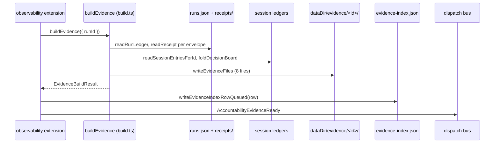

# Domains evidence

The evidence domain builds **forensic evidence bundles** from a run or a session and
serves fixed, machine-readable reads of those bundles. A bundle aggregates the
dispatch run ledger, sealed run receipts, linked session ledger entries, audit
rows, gate decisions, and per-run canonical trust status into one directory under
`<dataDir>/evidence/<evidenceId>/`. The bundle is the export boundary for run data:
secret-shaped values are redacted at build time, and only the bundle's own
`overview.json` records how much was filtered.

The domain has three consumers:

- the `clio-coder evidence` CLI (`src/cli/evidence.ts`), for operators;
- the `evidence` tool (`src/tools/evidence.ts`), which exposes ownership-scoped
  bundle reads to the model;
- the observability domain (`src/domains/observability/extension.ts`), which
  auto-builds a bundle whenever a dispatch run terminates and folds a compact
  sidecar row into `<stateDir>/evidence-index.json`.

## Ownership

| File | Owns |
| --- | --- |
| `src/domains/evidence/index.ts` | Barrel: re-exports the builder, store accessors, trust-status model, trust projection, provenance helpers, and all public types. |
| `src/domains/evidence/build.ts` | `buildEvidence` (the aggregator), `BuildEvidenceOptions`, `authenticatedRunWorktree`, `hasSessionRunEvidence`. |
| `src/domains/evidence/store.ts` | `EVIDENCE_FILES` (the fixed bundle layout), `evidenceDirectory`, `inspectEvidence`, `loadEvidenceTrustStatus`, `loadEvidenceRunProvenance`, `loadEvidenceGateDecisions`, `listEvidenceOverviews`, `EvidenceNotFoundError`, `findingsFile`. |
| `src/domains/evidence/trust-status.ts` | The canonical five-axis model: `TRUST_STATUS_AXES`, `TRUST_STATUS_STATES`, `normalizeTrustStatus`, `composeTrustStatus`, `adaptReceiptIntegrityStatus`, `adaptRunReceiptValidationStatus`, `adaptRunReceiptContextStatus`, `adaptGateDecisionReviewStatus`, `adaptGroundedEvidenceValidationStatus`, `inspectRunReceiptTrustStatus`, `verifyReceiptIntegrityOutcome`, retired-seal diagnostics. |
| `src/domains/evidence/trust-projection.ts` | The operator projection: `trustVerdict`, `formatTrustSummary`, `formatTrustAxes`, `summarizeTrustStatus`, `TRUST_STATE_WORDS`. |
| `src/domains/evidence/provenance.ts` | `extractRunProvenance`, `admitRunProvenance`, `hasRunProvenance`, `runProvenanceFromUnknown`, `provenanceTranscriptLines`, `provenanceCompactSuffix`, `PERSONA_HASH_PREFIX_CHARS`. |
| `src/domains/evidence/inventory.ts` | `evidenceInventorySnapshot` (the fixed read a GUI host can invoke blind), `EvidenceInventoryArtifact`, bounds constants. |
| `src/domains/evidence/detail.ts` | `evidenceDetailSnapshot` (one bundle's runs with verdict and per-axis states). |
| `src/domains/evidence/types.ts` | `EVIDENCE_VERSION`, `EVIDENCE_TAGS` (the 29-tag taxonomy), `FAILURE_CAUSE_TAG_ORDER`, `EvidenceOverview`, `EvidenceFinding`, `EvidenceBuildResult`, and all bundle file shapes. |
| `src/domains/evidence/run-trust.ts` | `buildEvidenceTrustStatusFile`, the single pure boundary that composes every evidence-linked trust axis for the bundle. |
| `src/domains/evidence/redact.ts` | `createRedactionTally`, `redactSecretsText`, `redactSecretsDeep`, `SECRET_PATTERNS`. |
| `src/domains/evidence/failure-attribution.ts` | `attributeEvidenceFailure`, which maps termination facts onto the failure-cause tag subset. |
| `src/domains/evidence/findings-markdown.ts` | `renderEvidenceFindingsMarkdown`, the human rendering inside `findings.md`. |
| `src/domains/evidence/finish-contract-map.ts` | `FINISH_CONTRACT_EVIDENCE_TAGS`, the pure mapping from the live finish-contract kinds onto forensic tags. |
| `src/domains/evidence/ordering.ts` | `compareCodepoints`, the codepoint ordering used for deterministic bundle contents. |

## Building a bundle: `buildEvidence`

`buildEvidence(options)` in `src/domains/evidence/build.ts` accepts
`BuildEvidenceOptions` with `dataDir`, `stateDir`, and exactly one of `runId` or
`sessionId` (both or neither is an error). It returns `EvidenceBuildResult` with
the `evidenceId`, the bundle directory, the `EvidenceOverview`, the findings, the
`EvidenceTrustStatusFile`, and `ungroundedClaims` (the total, across
integrity-verified receipts only, of validation claims without matching
executions).

The build pipeline:

1. **Ledger selection.** `readRunLedger` reads `<stateDir>/runs.json` and
   `selectRunEnvelopes` parses only the selected rows, strictly validating each
   with `parseRunEnvelope` (status must be one of
   `queued|running|completed|failed|interrupted|stale|dead`; `runtimeKind` one of
   `http|sdk|subprocess|acp-delegation`). Envelopes are sorted by start time, then id.
2. **Receipt authentication.** `readReceipt` reads each
   `envelope.receiptPath ?? <stateDir>/receipts/<id>.json`, then verifies
   integrity through `inspectRunReceiptTrustStatus(receipt, envelope).integrity`.
   Three outcomes: missing file, invalid receipt, and integrity failure. A seal
   sealed under a retired integrity version is set aside unread (the error text
   names both versions) and is *not* an integrity failure; see
   `verifyReceiptIntegrityOutcome` and `retiredReceiptIntegrityReason` in
   `src/domains/evidence/trust-status.ts`.
3. **Session linking.** `linkSessionEntries` reads the session ledgers for every
   session the selected runs named, folds the decision board on the active path
   (`foldDecisionBoard(filterEntriesToActivePath(...))`), and attributes every
   entry to a run via `linkSessionEntry`:
   - `entry-run-id` (exact): only `protectedArtifact` entries carry a
     write-time run id (`writeTimeRunId`);
   - `timestamp-window` (best-effort): the entry timestamp falls in exactly one
     run window;
   - `ambiguous-timestamp-window` (best-effort, `runId` null): the timestamp falls
     in more than one window, so the entry lists candidates instead of picking an
     owner;
   - `no-run-window`: no window covers it.

   Windows come from `attributionWindows`, which includes **sibling runs from the
   same sessions** read leniently off the raw ledger, so a run-scoped bundle
   cannot claim an entry a concurrent sibling produced. `linkCoversRun` includes
   an ambiguous entry in every candidate run's bundle.
4. **Audit linking.** `linkAuditRows` links audit rows by direct `runId` (exact),
   direct `sessionId` (exact), or best-effort `timestamp-tool` when a `tool_call`
   row's timestamp and tool name match exactly one run window's receipt tool
   stats.
5. **Tool events.** `toolEvents` prefers session-derived events, then audit rows,
   then receipt aggregates; only the first non-empty source is exported.
6. **Validation evidence.** `validationEvidenceByRun` collects the executed
   validation artifacts per run: successful validation bash executions
   (`detectValidationCommand(...).kind === "validation"`), successful
   protected-artifact entries carrying a validation command, and
   `tool_call`/`tool_result` pairs where the call recognized a validation command
   (`bash` with a command, or `verify` with a check name) and the result was not
   an error. A multi-run bundle credits an ambiguous entry to nobody
   (`validationRunIdFor` returns null unless the bundle covers exactly one run).
7. **Trust composition.** `buildEvidenceTrustStatusFile` (`src/domains/evidence/run-trust.ts`)
   composes, per run, the receipt-derived status from
   `inspectRunReceiptTrustStatus`, optionally upgrades `validationGrounding` when
   grounded evidence exists (`adaptGroundedEvidenceValidationStatus`), and applies
   the latest integrity-verified gate decision for the run as
   `independentReview` (`adaptGateDecisionReviewStatus`).
8. **Findings.** `buildFindings` derives per-run and bundle-level
   `EvidenceFinding` rows from the trust axes, receipts, and links; see the
   finding rules below. `resolveReceiptDecisions` adds decision-provenance
   findings for each `receipt.decisionRefs` entry against the session decision
   board.
9. **Redaction.** `createRedactionTally` starts a cold-path tally; findings,
   envelopes, receipts, tool-event previews, trust status, and decisions are
   redacted with `redactSecretsDeep`, and the transcript with
   `redactSecretsText` (`src/domains/evidence/redact.ts` matches PEM blocks,
   AWS/GitHub/Slack/Google keys, `sk-` keys, JWTs, and secret-named assignments).
   `overview.redactionCount` records the total. Raw session files are never
   touched; only the bundle is scrubbed.
10. **Writing.** `writeEvidenceFiles` writes exactly the eight files in
    `EVIDENCE_FILES` (`src/domains/evidence/store.ts`): `overview.json`,
    `transcript.md`, `tool-events.jsonl`, `receipt.json`, `gate-decisions.json`,
    `trust-status.json`, `findings.json`, `findings.md`.

### Finding rules

`buildFindings` in `src/domains/evidence/build.ts` emits, per run: a
`receipt-retired` info row for a retired seal, `receipt-integrity` warn for a
failed seal, `no-validation` warn for a successful run whose
`validationGrounding` is absent/unknown, `proxy-validation` warn for an
`ungrounded` grounding, `cwd-missing`, `blocked-tool`, `escalation` (unresolved
permission escalations from the receipt's `safety.decisions`), `external-bypass`
for `delegation.toolGovernance === "agent-managed"`, `timeout` for stale/dead
runs, and a failure-cause tag from `attributeEvidenceFailure`
(`src/domains/evidence/failure-attribution.ts`) for non-zero exits
(`context-overflow`, `tool-loop`, `timeout`, `auth-failure`, `provider-transient`,
`missing-dependency`, `wrong-runtime`, `test-failure`, `build-failure`,
`unknown`). Bundle-level rows include `session-linked`/`session-missing`,
`audit-linked`/`audit-missing`, `best-effort-link`, `protected-artifact`, and the
`context-provenance`/`independent-review`/`completion-evidence` rows read off the
canonical axes by `axisFindings`.

## Canonical trust model

`src/domains/evidence/trust-status.ts` defines the five-axis canonical status.
`TRUST_STATUS_AXES` is `artifactIntegrity`, `validationGrounding`,
`independentReview`, `contextProvenance`, `completionEvidence`. Each axis is
either:

- an **absent** state with a reason (`not_recorded`, `not_observed`,
  `artifact_missing`, `historical_format`), or
- an **attributed** state carrying a closed `TRUST_STATUS_STATES` vocabulary plus
  `source` (where the fact came from), `authority` (who is entitled to make the
  observation), and `artifacts` (bounded to 16 references per axis, deduplicated
  and deterministically ordered by `normalizeTrustStatus`).

Two constraints are enforced at normalization:

- `AXIS_SOURCES` restricts which source kind may establish each axis, and
  `SOURCE_AUTHORITIES` restricts which authority kind each source kind may carry.
- A `compatibility` source (a historical-format placeholder) cannot establish
  anything but `unknown` or `not_applicable`.

`composeTrustStatus` merges projections axis by axis: a later projection replaces
the same axis, and one axis's state never fills or promotes another.
`CanonicalTrustStatus` has no confidence score or overall verdict; the
presentation tier comes from `trustVerdict` in
`src/domains/evidence/trust-projection.ts`.

### Verdict tiers

`trustVerdict(status)` reads the axes in fixed priority order:

1. `compromised` when the seal failed, validation failed or was inferred
   (`ungrounded`), review failed or was not independent, or context provenance is
   invalid;
2. `unknown` when the seal is not verified;
3. `reviewed` when independent review passed;
4. `grounded` when validation was validated;
5. `unverified` otherwise.

`formatTrustSummary` renders the compact human line in the fixed clause order
integrity, validation (with its claimant), independent review, context,
completion; `formatTrustSummaryLine` prefixes it with the verdict;
`formatTrustAxes` emits the machine form `trust_status=v1 artifactIntegrity:...`;
`summarizeTrustStatus` builds the bounded machine projection (verdict, axes,
claimant, unanswered axes, and up to 8 artifact references). A retired seal never
reads as broken: `integrityClause` prints `seal v<N> retired (this build verifies
v<M>)`, and `retiredIntegrityVersionOf` recovers `<N>` from the compatibility
source id of the `artifactIntegrity` axis.

## Provenance admission

`src/domains/evidence/provenance.ts` reads the sealed receipt's
`pipeline`, `personaOverride`, and `safety.decisions` escalation counters into a
`RunProvenanceView`. `admitRunProvenance(view, status)` admits the view only
when no canonical status is supplied *or* the status's `artifactIntegrity` is
`verified`; a rejected or retired seal admits nothing. `provenanceTranscriptLines`
and `provenanceCompactSuffix` render each admitted field, so a broken seal's
receipt prints no autonomy values. `runProvenanceFromUnknown` is the defensive
reader used when the bundle's `receipt.json` is read back (it validates each
field instead of throwing).

## Store layout and reads

The bundle directory layout is fixed by `EVIDENCE_FILES` in
`src/domains/evidence/store.ts`. `evidenceDirectory(dataDir, evidenceId)` asserts
the id is safe (`assertSafeId`) and joins `<dataDir>/evidence/<id>`. Reads:

- `inspectEvidence(dataDir, evidenceId)` loads `overview.json`, `findings.json`,
  and the trust status; a missing bundle throws `EvidenceNotFoundError`, while a
  bundle that exists but lacks `findings.json` throws a different error.
- `loadEvidenceTrustStatus` returns a canonical projection, or the explicit
  `historical_format` shape when the file is missing (bundles built before the
  projection existed still read).
- `loadEvidenceRunProvenance` reads `receipt.json` and returns only runs whose
  receipt carries at least one provenance field; a missing file yields an empty
  list.
- `loadEvidenceGateDecisions` returns only gate decisions that pass
  `verifyGateDecisionArtifact`.
- `listEvidenceOverviews` lists bundle overviews and silently skips unreadable
  directories so listing stays scriptable.

The four files `trace.raw.jsonl`, `trace.cleaned.jsonl`, `audit-linked.jsonl`,
and `protected-artifacts.json` were written by builds before 0.5.6 and no reader
opened; current builds write exactly `EVIDENCE_FILES`, and old bundles still read
because every reader opens files by name.

## Upstream callers and downstream dependencies

**Observability auto-build.** `src/domains/observability/extension.ts`
subscribes to `DispatchCompleted` and `DispatchFailed` on the dispatch bus. A
terminal payload with a run id starts `buildAndIndexEvidence` without blocking the
bus, and the extension's `stop()` flushes the in-flight promises so a headless
one-shot run still lands its bundle. `DispatchFailed` builds only when
`dispatchHasEvidenceLedger(payload)` (the payload carries a lineage), because
pre-admission failures never create a run ledger. After the build, a sidecar row
goes to `<stateDir>/evidence-index.json` through
`writeEvidenceIndexRowQueued` (`src/domains/observability/evidence-index.ts`),
and the extension emits `BusChannels.AccountabilityEvidenceReady`. The row's
`firstPassSuccess` is true only when the run succeeded, had lineage attempt 0,
and the bundle carries no `no-validation` tag.

**CLI.** `src/cli/evidence.ts` implements `build --run <id> | --session <id>`,
`inspect <evidenceId> [--json]`, `list`, and `inventory --json`. The `build`
command exits 1 when findings contain `receipt-integrity` rows and prints retired
seals as notes. `inventory` requires `--json`; a bare invocation is a usage error
because the GUI host relies on the JSON shape.

**Evidence tool.** `src/tools/evidence.ts` exposes modes `list`, `inspect`,
`run`, and `session` to the model. Ownership is enforced with
`dispatchOwnership(dispatchOwnerOf({}, options?.sessionId)).seesBundle(overview)`,
so a bundle is visible only to its session or to a session in the project its
runs executed in. `list` delegates to `evidenceInventorySnapshot` with a
shrinking page size until the 16 KiB cap (`EVIDENCE_TOOL_MAX_BYTES`) fits;
`run` tries `inspectEvidence` first and falls back to `buildEvidence` on
`EvidenceNotFoundError`; `session` refuses foreign session ids with an
`evidence_foreign` error and never leaks task text or cwds in its summary.

**Downstream reads inside dispatch.** `src/domains/dispatch/receipt-findings.ts`
is deliberately *not* `buildEvidence`: it is a cheap pure classifier over
in-memory receipt draft fields, imported at record time to keep the v3 integrity
digest JSON-clean. It consumes `EvidenceTag` and `FAILURE_CAUSE_TAG_ORDER` from
this domain to emit the receipt's conservative findings summary and
`firstPassSuccess`.

## Inventory and detail projections

`evidenceInventorySnapshot(now, dataDir, include?, page?)` in
`src/domains/evidence/inventory.ts` is the fixed read a GUI host can invoke
blind: it accepts no identifier or path, sorts by newest `generatedAt`, applies
the caller's `include` filter before the newest-first window is taken, and caps
the window at `EVIDENCE_INVENTORY_MAX_ARTIFACTS` (12) with cursors. Identity
strings (run ids, agent ids, statuses) are sanitized with
`sanitizeCallTargetText`, truncated to `IDENTITY_WIDTH` (128), and bounded at
`EVIDENCE_INVENTORY_MAX_IDS` (8). A bundle covering several runs takes the
**worst** verdict (`VERDICT_SEVERITY` order: compromised, unverified, unknown,
grounded, reviewed), and an unreadable trust file costs only that artifact its
verdict. `evidenceDetailSnapshot` in `src/domains/evidence/detail.ts` projects one
bundle's runs to verdict plus all five axis states, capped at
`EVIDENCE_DETAIL_MAX_RUNS` (16).

## Focused tests

`tests/contracts/evidence-tool.test.ts` drives the tool end to end against a
scratch environment and demonstrates:

- inventory paging with cursors and the `EVIDENCE_INVENTORY_MAX_ARTIFACTS` window
  (`lists an empty inventory and bounds the newest fixture bundles`);
- ownership scoping: a foreign project's bundle is absent from `list` and `inspect`
  returns `evidence_foreign` (`keeps another session's bundle from another project out of list and inspect`);
- `inspect` output equal to the build result, including all axis keys and verdicts
  (`inspects the fixture using the CLI trust projection and canonical findings`);
- tampered receipt facts withheld: `totals.receipts` 0, `ungroundedClaims` 0,
  verdict `compromised`, `receipt-integrity` finding present
  (`withholds tampered receipt facts and ungrounded counts`);
- retired seals counted as neither claims nor receipts (`does not count claims from retired receipts`);
- worktree fields exposed only while the receipt still verifies, and withheld as
  `{status:"withheld", reason:"receipt-integrity"}` after a forged field
  (`exposes worktree fields only while the run receipt still verifies`);
- gate decisions filtered to integrity-verified artifacts only
  (`returns only integrity-verified gate decisions`);
- session-mode redaction: the summary contains no secret string, `redactionCount > 0`,
  and omits `tasks`/`cwds`, while foreign sessions get `evidence_foreign` and absent
  sessions get `artifact_absent` (`returns a bounded redacted summary only to the owning session`);
- UTF-8-safe truncation that keeps the envelope valid JSON at 16 KiB
  (`bounds UTF-8 output while keeping the truncation envelope valid JSON`).

`tests/contracts/evidence-bundle-files.test.ts` proves the layout contract:

- a fresh build writes exactly the `EVIDENCE_FILES` names and none of the four
  retired files (`writes exactly the files the overview lists and none of the retired ones`);
- a bundle an earlier build wrote with the retired files still reads through
  `inspectEvidence`, `loadEvidenceTrustStatus`, `loadEvidenceRunProvenance`, and
  `listEvidenceOverviews` (`still reads a bundle an earlier build wrote with the retired files`).

Both run under the `pnpm test` contracts gate; the narrowest non-destructive
check is `pnpm run test:file -- tests/contracts/evidence-tool.test.ts tests/contracts/evidence-bundle-files.test.ts`.

## Extension seams

- **New evidence tag**: add it to `EVIDENCE_TAGS` in `src/domains/evidence/types.ts`; add it to `FAILURE_CAUSE_TAG_ORDER` only when it is a canonical failure cause; add the emitting rule to `buildFindings` in `src/domains/evidence/build.ts` (or `classifyTags` in `src/domains/dispatch/receipt-findings.ts` for the cheap receipt-time classifier).
- **New trust axis state**: extend `TRUST_STATUS_STATES` in `src/domains/evidence/trust-status.ts` and, when a new source kind participates, its rows in `AXIS_SOURCES` and `SOURCE_AUTHORITIES`.
- **New redaction shape**: add a `SECRET_PATTERNS` entry in `src/domains/evidence/redact.ts`; `overview.redactionCount` self-describes the bundle afterward.
- **New provenance field**: widen `ProvenanceReceipt` (`Pick<RunReceipt, ...>`) and `RunProvenanceView` in `src/domains/evidence/provenance.ts`, plus the validators in `runProvenanceFromUnknown`; `admitRunProvenance` gates it on verified integrity automatically.
- **New inventory field**: extend `EvidenceInventoryArtifact` in `src/domains/evidence/inventory.ts`; the GUI contract tests (`apps/clio-coder-gui/tests/evidence-http.test.ts`) will then see it.
- **New bundle file**: change `EVIDENCE_FILES` and update both contract tests above; a new file without a reader violates the bundle's own doc contract.

See [Domains dispatch](../domains/dispatch.md) for the receipt and gate-decision
shapes this domain verifies, [Domains session](../domains/session.md) for the
session ledger entries it links, [Domains safety](../domains/safety.md) for
protected-artifact entries, [Domains observability](../domains/observability.md)
for the sidecar index consumer, [Cli](../cli.md) for the `evidence` command, and
[Contract tests](../tests/contracts.md) for the gate these contract tests run
under.

## Things to watch when editing

- **Do not remove the raw-row spread in `parseRunEnvelope` and `parseRunReceipt`**
  (`src/domains/evidence/build.ts`). Integrity verification recomputes digests
  over ledger fields the parsers do not model (outcome, lineage, identity, token
  splits); a lossy re-parse makes every clean receipt recompute to a different
  digest and fail.
- **Retired seals are not failures.** `readReceipt`, `adaptReceiptIntegrityStatus`,
  and `verifyReceiptIntegrityOutcome` each treat a retired integrity version as
  "set aside unread". New code that verifies a receipt must go through
  `verifyReceiptIntegrityOutcome`, and its text must never call the receipt
  invalid, broken, or corrupt.
- **Self-reports cannot ground validation.** `SELF_REPORTED_ARTIFACT_KINDS`
  (`finish_contract_evidence`, `run_receipt`) are filtered by
  `adaptGroundedEvidenceValidationStatus`; a bundle can only upgrade
  `validationGrounding` from independently observed session artifacts.
- **The tool-event source preference is silent.** `toolEvents` returns session
  events if any exist; audit rows and receipt aggregates are dropped entirely,
  not merged.
- **The `evidence inventory` CLI shape is load-bearing.** It requires `--json`,
  and `evidenceInventorySnapshot` accepts no identifier, path, or limit from the
  caller beyond `include` and pagination; keep it blind-safe.
- **Redaction is cold-path only.** `redactSecretsText`/`redactSecretsDeep` run at
  bundle build time, never during live turns; raw session files must stay
  untouched.
- **Worst verdict wins.** The inventory's `VERDICT_SEVERITY` fold takes the worst
  verdict across a bundle's runs; averaging or preferring the newest run is the
  one summary the code deliberately avoids.
- **Compatibility sources are placeholders.** `normalizeAttributedStatus` rejects
  any `compatibility`-sourced state other than `unknown` or `not_applicable`; a
  historical-format bundle cannot establish positive axes.
- **`exactOptionalPropertyTypes` is on.** Bundle export code spreads optional
  fields with conditional objects (see `evidenceRunLink`, `transcriptRunLink`,
  and the overview `redactionCount` write); `field: undefined` fails typecheck.
