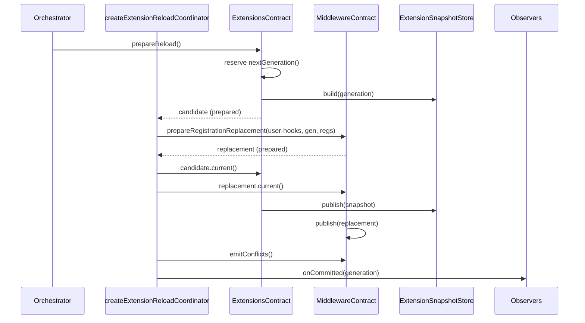

# Domains extensions

The extensions domain is the harness contract for executable packages that contribute two things to Clio: command tools that run in a sandboxed operator runtime, and hook declarations that register into the middleware tier. A package is not executable merely by being installed. Every package passes through a strict manifest, a semver compatibility gate, a whole-tree integrity digest, and a loadability decision before any of its bytes can execute. The snapshot system then stamps a frozen generation so that extension resources and middleware hook registrations always move as a pair.

This domain is loaded by the orchestrator as a standard `DomainModule`. The manifest declares a dependency on the config domain (`src/domains/extensions/manifest.ts`), and `createExtensionsBundle` in `src/domains/extensions/extension.ts` binds an empty snapshot store at `start()` so that no reader can observe extension resources paired with hooks from another generation until the composition root publishes the boot generation.

## The manifest contract

A package root must contain one of three manifest filenames, checked in this order by `findExtensionManifestPath` in `src/domains/extensions/discovery.ts`:

```ts
const MANIFEST_NAMES = ["clio-coder-extension.yaml", "clio-coder-extension.yml", "clio-coder-extension.json"] as const;
```

`parseExtensionManifest` enforces a closed key set. The allowed manifest keys are `id`, `name`, `version`, `description`, `compatibility`, `capabilities`, and `runtime`. Two additional sets are explicitly refused:

- `MANIFEST_KEYS` rejects unknown keys as `unknown manifest key '<key>'`.
- `PLUGIN_OWNED_KEYS` — `resources`, `skills`, `prompts`, `agents`, `fleets` — produces the error `harness extensions cannot declare '<key>'; domain resources belong in a plugin: clio-coder library install <path>`.

This is the boundary the contract test asserts: a manifest that carries `resources:` is invalid, and the refusal message names the plugin installer rather than reading as a typo. The test `"refuses a domain resource declaration and names the plugin installer"` in `tests/contracts/extension-resources.test.ts` iterates over all five plugin-owned keys and checks the exact message.

The required fields are `id`, `version`, and `description`. The `id` is validated by `validateId` against the regex `/^[a-z0-9][a-z0-9._-]*[a-z0-9]$/` and a length cap of 80. The `name` falls back to `id` when absent.

## Command tools and runtime declarations

Two separate declaration surfaces carry executable capability, and they are parsed by different modules:

- **`capabilities.tools`** — model-facing command tools, parsed by `parseExtensionCapabilities` in `src/domains/extensions/command-schema.ts`.
- **`runtime`** — an operator-only runtime process, parsed by `parseExtensionRuntime` in `src/domains/extensions/runtime-schema.ts`.

`parseExtensionCapabilities` accepts only `tools` (1 to 32 entries). Each tool is an `ExtensionCommandTool`:

```ts
export interface ExtensionCommandTool {
	name: string;
	description: string;
	runtime: "node" | "python3";
	entrypoint: string;
	inputSchema: Record<string, unknown>;
	timeoutMs?: number;
	maxOutputBytes?: number;
}
```

The tool is named for the model registry as `extension_${id}__${name}` (the `extensionToolName` helper). The qualified name must fit in 64 characters and use only provider-safe characters. The extension id itself cannot contain a double underscore, because that delimiter is structural.

`inputSchema` is validated by `validateSchema`, which accepts only a bounded JSON-schema keyword set (`SCHEMA_KEYS`), a finite type set (`TYPES`), and at most 12 nesting levels. Object schemas must declare `properties` and `additionalProperties: false`, and property names may not be `__proto__`, `constructor`, or `prototype`. The root must be of type `object`.

The `runtime` declaration is an `ExtensionRuntimeDeclaration`:

```ts
export interface ExtensionRuntimeDeclaration {
	api: 1;
	entrypoint: string;
	commands: Array<{ name: string; description: string; timeoutMs: number }>;
	events: Array<"session_open" | "turn_end">;
	ui: Array<"status" | "panel">;
}
```

`parseExtensionRuntime` requires `api === 1`, a `.mjs` entrypoint of at most 240 characters, command names matching `/^[a-z][a-z0-9_]*$/` (unique, at most 32), and per-command timeouts of 100–300000 ms. The `events` and `ui` arrays are constrained to closed choice sets and cannot contain duplicates.

The contract test `"runtime manifest validates declarations and contained entrypoints without running startup code"` in `tests/extended/operator-extensions.test.ts` confirms that `api: 2`, an unknown field, a `.ts` entrypoint, a zero timeout, an undeclared event, and an undeclared ui capability all produce `undefined` manifests. It also confirms that discovery never executes package code: a manifest whose entrypoint throws is still reported as valid by `loadManifestFromRoot`.

## Compatibility check

The `compatibility.clio` field is a semver range evaluated against the running Clio version. `evaluateClioCompatibility` in `src/domains/extensions/compatibility.ts` returns `{ rangeValid, satisfied, runningVersion }`.

The parser is deliberately bounded and fail-closed because manifests are untrusted input. `satisfiesSemVerRange` accepts ordinary npm range vocabulary — comparator sets, `||`, exact and partial versions, wildcards, hyphen ranges, caret ranges, tilde ranges — but rejects tags and malformed or overlong expressions (over 256 characters) instead of treating them as compatible. The test `"accepts a strict compatible manifest with no capabilities"` asserts `evaluateClioCompatibility(">=0.4.0 <0.5.0", "0.4.1")` returns `satisfied: true`.

At manifest-parse time, an unsatisfied range produces the error `extension <id> requires Clio '<range>', but running Clio version is '<running>'`. At load time, `evaluateClioCompatibility` is consulted again and sets the `compatible` flag on the `InstalledExtension` record.

## Integrity verification

Every package is digested by `extensionContentDigestWithCapture` in `src/domains/extensions/integrity.ts`. The digest binds, in stable relative-path order: file names, node kinds (directory, link, file), symlink targets, empty directories, and file bytes. A `digestFrame` writes a header of the form `kind\0relativePath\0byteLength\0` followed by the payload and a NUL terminator, so the framing is unambiguous even when one path is a prefix of another.

The function is hardened against TOCTOU races:

- **Hard links are refused** (`nlink !== 1`), so a file cannot be swapped for a shared inode without changing the digest.
- **Symbolic links must resolve within the package root** (`contained` check); a link that escapes the root throws `symbolic link escapes the extension root`.
- **Files are opened with `O_NOFOLLOW`** and re-`fstat`ed after open and after read to detect mutation between inspection and hashing (`extension file changed while being opened/hashed`).
- **Directories are re-stat'd** after the listing to detect entry-set changes mid-walk (`assertStableDirectory`).
- **The root itself must not be a symlink** (`extension root must be a directory, not a symbolic link`).

The contract tests in `tests/contracts/extension-resources.test.ts` exercise these: `"rejects hard-linked files from content identity and deactivates the package"`, `"rejects a symbolic link swapped outside the package while being hashed"` (injecting a `readlinkSync` override that repoints the link mid-digest), `"frames file names, payloads, and symbolic-link targets without ambiguity"` (two trees with swapped prefix/suffix split points produce different digests), and `"keeps a package whose tree escapes its root visible but inactive"`.

## Install state and the loadability decision

`src/domains/extensions/state.ts` owns the on-disk install state and the admission decision. The state file lives at `<base>/state.json` per scope, where the base directory is:

- user scope: `<config-dir>/extensions`
- project scope: `<cwd>/.clio-coder/extensions`

The `ExtensionState` schema is version 1 and records `disabled` ids plus an `installed` map keyed by id holding `installedAt`, optional `source`, and optional `contentDigest`. `readState` is fail-closed: corrupt or absent state returns a default state with a diagnostic, and a corrupt state marks every package in that scope as invalid.

`installedFromRoot` performs the admission decision for each package directory:

1. It loads the manifest and computes the observed content digest via `extensionContentDigestWithCapture`, capturing the manifest bytes and `hooks.yaml`.
2. `contentVerified` is true only when the observed digest equals the `expectedDigest` recorded in install state.
3. `provenance` is constructed only when the content is verified, the expected digest is present, and the manifest bytes were captured. The `manifestDigest` is the SHA-256 of the captured manifest bytes.
4. `valid` requires a present manifest, a valid candidate, and `contentVerified`.
5. `compatible` is the compatibility evaluation result.
6. `loadable` is `valid && compatible && enabled && effective`.

The `listInstalledExtensionRecords` function resolves scope precedence: project scope (rank 2) wins over user scope (rank 1) for the same id. The winner is marked `effective: true`; losers that are otherwise valid are marked `overriddenBy` with the winner's scope. Invalid and incompatible packages remain visible (not filtered) so the load refusal and its diagnostic cannot disappear along with the suppressed capabilities.

The test `"detects post-install content drift and prevents activation"` in `tests/contracts/extension-resources.test.ts` writes `hooks.yaml` after install, then asserts `drifted.valid === false`, `drifted.loadable === false`, `drifted.provenance === undefined`, and a `content drift detected` diagnostic. The test `"distinguishes absent install state from corrupt install state and fails closed"` confirms both absent and corrupt state keep packages unloadable.

## The snapshot system

The snapshot is the unit of generation isolation. `buildExtensionSnapshot` in `src/domains/extensions/snapshot.ts` builds an `ExtensionSnapshot` for a given cwd and generation number:

- It lists installed records and, for each loadable package, captures the command tool names and the digest of the captured `hooks.yaml` bytes.
- It computes a **content digest** over a canonical-JSON projection of the packages (id, scope, loadable, provenance, commandTools, hooksDigest), excluding generation, timestamp, and diagnostic text.
- It deep-freezes the entire snapshot, so every consumer receives an immutable projection.
- Diagnostics are bounded: 20 per package, 200 globally, 512 characters per message (`EXTENSION_SNAPSHOT_DIAGNOSTIC_*_CAP`).

`diffExtensionSnapshots` compares two snapshots by fingerprinting packages per id (scope, loadable, provenance, capabilities) and reporting `added`, `removed`, `modified`, and `changed`. `changed` is true when the content digests differ, even if no package list changed.

The `createExtensionsBundle` function in `src/domains/extensions/extension.ts` owns a single in-flight candidate and the snapshot store. The `prepareReload` contract:

1. Rejects reentrant prepares (`reason: "reentrant"`).
2. Reserves the next generation **before** building, so a discarded or failed candidate burns its number and generations stay monotonic.
3. Builds the snapshot; a build failure returns `rejected` with `reason: "build-failed"`.
4. Returns a prepared candidate whose `current()` returns true only while it is the in-flight candidate **and** the committed snapshot is still the previous one.
5. `publish()` performs a single assignment; it never validates, refuses, throws, or calls out.

The contract test `"reserves generations monotonically and publishes by plain assignment"` in `tests/extended/extension-snapshot.test.ts` asserts that a discarded reservation burns a generation: after publishing generation 1, calling `nextGeneration()` twice returns 2 then 3, and the second reservation is burned.

## Reload coordination and paired publication

The extensions bundle and the middleware bundle are independent, and neither knows the other exists. `src/entry/extension-reload.ts` is the composition-root coordinator that is the only writer of both for the "user-hooks" owner. It sequences a reload so no observer can see resources from one generation paired with hooks from another:

1. Canonicalize the workspace once.
2. Prepare the extension candidate; require its snapshot cwd to match the session workspace.
3. Build user-hook registrations from the candidate's captured `hooks.yaml` declarations plus project files.
4. Prepare the middleware replacement.
5. Confirm both prepared states are still current, then publish both with two assignment-only calls in adjacent statements.
6. Only then emit conflicts, the reload event, and issue lines.

Neither publish primitive can refuse or throw, so a partial publication is impossible by construction. The test `"publishes extension and middleware adjacently before diagnostic, event, or report re-entry"` in `tests/extended/extension-reload-coordinator.test.ts` wraps both publish primitives to log entry and asserts the log sequence is `ext-publish:1`, `mw-publish:1`, with all observer callbacks strictly after.

`extensionSnapshotFor` in `src/domains/extensions/snapshot-access.ts` is the reader path: it returns the committed snapshot when a store is bound for the current cwd, otherwise an ephemeral generation-0 build. This is the path the CLI, `config inspect`, and any process that never booted the bundle take.

## Operator runtime and API injection

The operator runtime is the process boundary. `OperatorExtensionRuntime` in `src/domains/extensions/operator-runtime.ts` owns operator processes only — it is never used by native workers or model tool bootstrap. Each process is an `ExtensionRuntimeProcess` in `src/domains/extensions/runtime-process.ts`.

**Private copy.** The `ExtensionRuntimeProcess` constructor copies the installed package into a temporary directory (`mkdtempSync`), re-verifies the copy's digest against `extension.provenance.contentDigest`, re-parses the manifest from the captured bytes, and confirms the runtime declaration matches the verified manifest. If the digests differ, it throws `runtime copy does not match installed package digest`. The copy is cleaned up on exit and disposal.

**Fork.** The child is forked with `runtime-child.mjs` as the entrypoint, using a safe environment (`buildSafeToolEnv`), detached on POSIX, JSON serialization, and `stdio: ["ignore", "pipe", "pipe", "ipc"]`. The child stdout/stderr are consumed only for diagnostic byte accounting (64 KiB cap), never forwarded to a terminal.

**IPC protocol.** The protocol is `protocol: 1` with messages `init`, `activate`, `command`, `observe`, `result`, `error`, `fatal`, `cancel`, `dispose`. The host validates every message's protocol and instance fields. A `ready` message must carry exactly the declared commands and events (sorted and compared). A `result` without its exact outstanding request id is ignored. The state machine is `staging → starting → ready → failed/disposed`.

**API injection.** The child's `runtime-child.mjs` imports the extension entrypoint and calls the default export with a frozen `ExtensionApi`:

```ts
export interface ExtensionApi {
	readonly apiVersion: 1;
	handle(name, handler): void;
	on(event, handler): void;
	onDispose(handler): void;
}
```

Registration is gated: handlers can only be registered for declared commands and events, cannot be duplicated, and cannot be registered late. The factory receives a frozen snapshot and a frozen context per request. The test `"real runtime stages before activation, filters env, keeps instance state and disposes private copy"` in `tests/extended/operator-extensions.test.ts` confirms that a secret env var is `null` inside the child and the private copy is removed on dispose.

**Invocation fencing.** `invoke` requires an idle session before the request (`isIdle()` check), captures the context identity, and after the request re-verifies that the context identity, the process identity, and the process state are all unchanged. If the session changed, the process was replaced, or the process is no longer ready, the result is rejected with `extension result belongs to a revoked runtime or session`. The test `"session switch during request fences old output and rebuilds context"` confirms this: a session switch during an in-flight request rejects the result with `disposed|revoked` and a reload rebuilds the context with the new session id.

**Process limits.** `RUNTIME_LIMITS` in `src/domains/extensions/runtime-schema.ts` caps concurrent operator processes at 4. Excess eligible packages get the failure `operator runtime limit is 4; disable another runtime and reload`.

## Command tool execution path (model-facing)

Separate from the operator runtime, model-facing command tools are registered by `registerHarnessExtensionTools` in `src/tools/harness-extensions.ts`. This path freezes installed tool schemas at registry construction: it re-verifies the package digest, parses the manifest from the captured bytes, and registers each tool as a `ToolSpec` with `baseActionClass: "execute"` and `placement: "gateway"`. The tool is never imported or executed at registration; lifecycle mutations (disable, replace, remove) revoke calls immediately by re-checking the install state at invocation time.

The test `"discovers declarative tools without executing package code"` in `tests/contracts/harness-extensions.test.ts` confirms discovery writes no `DISCOVERY_EXECUTED` marker. The test `"refuses disabled, replaced, removed, and drifted installed commands"` confirms that disabling, mutating, force-reinstalling, and removing the extension each produce an error from the registered tool.

## Control flow through an actual caller

The operator-facing command path is the `/ext:<id>:<command>` slash command. `parseSlashCommand` in `src/session-control/slash-commands.ts` classifies it as an unknown command because `ext:` is not a reserved token. The dispatch branch then checks `isExtensionCommandToken(command.token)` (regex `/^ext:[^\s/]+$/u` in `src/domains/extensions/operator-commands.ts`), reads the operator runtime's command rows filtered by prompt names, and requires `row.available` to be true. It slices the trailing text after the token as `args`, and serializes the work through `ctx.runLocalOperation` so the next admitted slash command observes the committed state. Inside that local operation it calls `runtime.invoke(command.token, args, promptNames)`, which forwards to `OperatorExtensionRuntime.invoke`.

The test `"operator dispatch joins local admission and preserves unavailable drafts"` in `tests/extended/operator-extensions.test.ts` demonstrates this: the dispatch returns `"accepted"` immediately, the invocation is deferred until the local-operation queue runs, and a disabled extension makes `dispatchSlashCommand` return `"rejected"` without starting a new operation.

The boot path composes the same reload coordinator. The orchestrator constructs `createExtensionReloadCoordinator` in `src/entry/orchestrator.ts`, passes the extensions and middleware contracts, and calls `extensionReload.applyBoot()` after the domain bundle starts. The coordinator samples the cwd once, prepares the extension candidate, builds user-hook registrations, prepares the middleware replacement, confirms both are current, then publishes both adjacently.



A change of the kind this area invites is made in these places:

- **New manifest key**: add to `MANIFEST_KEYS` in `src/domains/extensions/discovery.ts`, then parse and validate in `parseExtensionManifest`. Add a rejection case in `tests/contracts/extension-resources.test.ts`.
- **New command tool field**: add to `TOOL_KEYS` in `src/domains/extensions/command-schema.ts`, then validate in `parseExtensionCapabilities`. Update `createCommandTool` in `src/tools/harness-extensions.ts` to consume it.
- **New runtime event**: add to the `events` choice set in `parseExtensionRuntime` in `src/domains/extensions/runtime-schema.ts`, and to the `ExtensionEvent` type in `src/domains/extensions/public-api.ts`.
- **New IPC message kind**: add a field set in the `fields` map in `ExtensionRuntimeProcess.receive` in `src/domains/extensions/runtime-process.ts`, and handle it in `runtime-child.mjs`.
- **New hook source type**: captured in `buildExtensionSnapshot` in `src/domains/extensions/snapshot.ts` and adapted in `capturedHookSourcesFor` in `src/entry/extension-hook-sources.ts`.
- **New scope**: add to `ExtensionScope` in `src/domains/extensions/types.ts`, the `scopeRank` function in `src/domains/extensions/state.ts`, and the `extensionBaseDir` path logic.

## Things to watch when editing

- **The manifest key set is closed.** Adding a key to `MANIFEST_KEYS` without adding a corresponding rejection in `rejectManifestKeys` will silently accept manifests that should fail. The `PLUGIN_OWNED_KEYS` guidance string is load-bearing for the contract test.
- **The digest framing is unambiguous by construction.** Do not remove the `\0` terminators or the byte-length header in `digestFrame`; they exist to prevent prefix-collision ambiguity between file names and payloads. The test `"frames file names, payloads, and symbolic-link targets without ambiguity"` guards this.
- **The snapshot digest excludes generation and diagnostics.** If you add a field to the canonical-JSON projection in `buildExtensionSnapshot`, it will change the content digest and cause every reload to report `changed: true` even when nothing semantically changed.
- **The reload coordinator publishes two independent references adjacently.** Inserting any `await` or callback between `candidate.publish()` and `replacement.publish()` in `src/entry/extension-reload.ts` breaks the paired-publication invariant. The test `"publishes extension and middleware adjacently before diagnostic, event, or report re-entry"` asserts adjacency.
- **The operator runtime never forwards child stdout/stderr.** The `diagnostic` callback in `ExtensionRuntimeProcess` accumulates bytes up to 64 KiB and then fails the process. Do not add a `pipe` to a terminal; it would leak unsanitized extension output.
- **The IPC protocol validates every message field.** The `fields` map in `ExtensionRuntimeProcess.receive` is the allowlist. Adding a new message kind without updating this map will cause the process to fail with `invalid runtime protocol fields`.
- **The snapshot store is bound per process, not per cwd.** `bindExtensionSnapshotStore` sets a module-level singleton. The test teardown in `tests/extended/extension-snapshot.test.ts` calls `bindExtensionSnapshotStore(null)` in `afterEach`. Forgetting this will leak state between tests.
