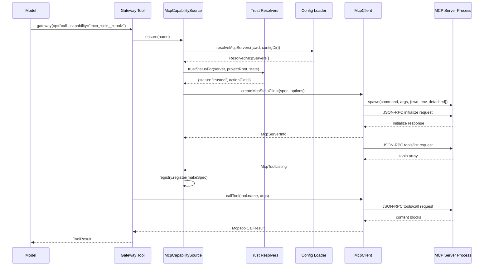

# Domains gateway

The MCP (Model Context Protocol) gateway exposes local stdio MCP servers to the model as
gateway capabilities. It comprises four cooperating modules inside `src/domains/gateway/mcp/`
and one orchestrating tool surface in `src/tools/gateway/`. The public surface is exported
through `src/domains/gateway/mcp/index.ts`, which re-exports the protocol framer, the
one-process client, strict configuration loading, trust resolution, and the metadata cache.

## What this area does

The gateway provides three operations to the model through the `gateway` tool
(`src/tools/gateway/index.ts`): `find` lists declared capabilities from recorded catalogs
without launching any server, `describe` returns one capability's metadata, and `call`
launches the owning server when trusted and executes the tool under the same admission as a
direct call. The MCP subsystem is the gateway's mechanism for reaching secondary capabilities
that run in external processes.

The trust model separates user-scope declarations (in the operator's
`<config>/mcp.yaml`, trusted by authorship) from project-scope declarations (in
`.clio-coder/mcp.yaml`, which require an explicit trust record before anything in them is
launched). A repository clone must not launch anything; the trust record binds the project
root, the server id, and the declaration digest.

## Key source files and symbols

| File | Role | Key symbols |
|---|---|---|
| `src/domains/gateway/mcp/protocol.ts` | JSON-RPC 2.0 framing | `createLineFramer`, `classifyJsonRpcMessage`, `encodeJsonRpcMessage`, `McpError`, `MCP_PROTOCOL_VERSION` |
| `src/domains/gateway/mcp/client.ts` | One-process stdio client | `createMcpStdioClient`, `McpClient`, `McpServerSpec`, `McpClientOptions` |
| `src/domains/gateway/mcp/config.ts` | Strict config loading | `loadMcpServerConfig`, `parseMcpConfigText`, `mcpServerDigest`, `MCP_CONFIG_CAPS` |
| `src/domains/gateway/mcp/trust.ts` | Trust records | `resolveMcpServers`, `trustMcpServer`, `untrustMcpServer`, `readMcpTrustState`, `canonicalProjectRoot` |
| `src/domains/gateway/mcp/metadata-cache.ts` | Tool catalog cache | `readMcpServerCatalog`, `writeMcpServerCatalog`, `McpCatalogIdentity` |
| `src/tools/gateway/mcp-capabilities.ts` | Gateway capability source | `createMcpCapabilitySource`, `McpCapabilitySource` |
| `src/tools/gateway/index.ts` | Gateway tool | `createGatewayTool`, `GATEWAY_OPS` |

## JSON-RPC 2.0 framing

The transport carries one JSON message per line: UTF-8 text, newline-terminated, with no
embedded newline. The framer (`createLineFramer` in `protocol.ts`) accepts byte chunks and
yields typed messages or one typed protocol error. Invalid UTF-8 is a protocol error rather
than a U+FFFD substitution, because a tool result that reached the model with silently
replaced bytes would misreport what the server said.

The framer enforces `DEFAULT_MAX_LINE_BYTES` (4 MiB) on inbound lines. A line longer than the
cap is refused as soon as its bytes exceed it, before any newline arrives, so an unterminated
flood cannot grow the buffer without bound. Blank lines are skipped; a trailing carriage
return is tolerated.

Outbound messages are encoded by `encodeJsonRpcMessage`, which serializes the message as a
newline-terminated line. `JSON.stringify` escapes every newline inside strings, so the line
delimiter is never ambiguous.

The protocol version is `MCP_PROTOCOL_VERSION = "2025-06-18"`. The `McpError` class carries a
`code` from the union `"timeout" | "closed" | "protocol" | "server" | "spawn" | "aborted" |
"overload"` and an optional `data` field. The `"overload"` code names an outbound line the
client refused to queue: on its own because it exceeds the cap, or fatally because the server
stopped reading its stdin.

## The one-process client

`createMcpStdioClient` in `client.ts` creates a client that owns exactly one child process.
The client never restarts a dead server; a server that dies stays dead until the gateway
decides to create a new client. The client lifecycle is:

1. **idle** → **starting**: `initialize()` calls `spawnChild()`, sends the `initialize`
   request with the protocol version, capabilities, and client info, and waits for the
   response with `DEFAULT_INITIALIZE_TIMEOUT_MS` (15 s).
2. **starting** → **ready**: the `initialize` response is parsed by `parseServerInfo`, the
   `notifications/initialized` notification is sent, and the client transitions to ready.
3. **ready**: the client serves `listTools()` and `callTool()` requests.
4. **closed** / **failed**: `close()` resolves with the teardown outcome; `fail()` records
   the first fatal error and rejects all pending requests.

The client enforces bounds in both directions:

- **Inbound**: the framer caps lines at `DEFAULT_MAX_LINE_BYTES` (4 MiB).
- **Outbound**: `DEFAULT_MAX_OUTBOUND_BYTES` (4 MiB) bounds the bytes queued for a server
  that stopped reading its stdin. Crossing it is a fatal `overload` that closes the client.
  `MIN_OUTBOUND_BYTES` (4 KiB) is the smallest cap a caller may configure.

Tool listing is paginated with `MCP_TOOL_LIST_CAP` (500 tools) and `MCP_TOOL_LIST_PAGE_CAP`
(100 pages). A server that offers more tools than the cap admits is reported as truncated.

The client enforces workspace containment: `containedCwd()` resolves the server's cwd
lexically and after every symbolic link, and refuses a cwd that escapes the workspace root
by path or by symlink. The check runs once at creation for early feedback and again at
spawn, which is the boundary that matters.

Environment variables are built by `buildSafeToolEnv` from `src/core/safe-exec.ts`, which
merges the declared server env over the process env while filtering out unsafe entries.

## Process-group teardown

Teardown covers the server's whole process group, not only the child it spawned. The client
tracks the group through a `GroupPhase` state machine: `unspawned` → `live` → `cleaning` →
`released`. The leader's pid doubles as the group id because the child is spawned detached.

Cleanup starts the moment the leader is seen to exit, not when `close()` happens to be
called. At that instant the group is still ours or is already empty, so an arbitrarily late
`close()` never gets to signal a number that has had time to change hands. The teardown
sequence is:

1. SIGTERM to the group.
2. Wait `killGraceMs` (default 3 s) for the group to disappear.
3. SIGKILL to whatever remains.
4. Wait `teardownBoundMs` (default 2 s) for the group to disappear.
5. Release the group id.

If the group survives SIGKILL for the confirm window, the outcome reports
`{ complete: false, reason: "group-survived-sigkill", pgid, boundMs }` and the pipe ends are
destroyed so the survivor cannot pin this process's event loop. The outcome is flagged
rather than thrown: a caller's shutdown loop cannot do anything about a survivor except
report it.

## Trust model

The trust file lives at `<config>/mcp-trust.json` (constant `MCP_TRUST_FILENAME`). It is read
through a bounded read (`MCP_TRUST_CAPS.fileBytes` = 1 MiB, `MCP_TRUST_CAPS.records` = 256).
A missing file is an empty state; an oversized, over-populated, or corrupt one is empty with
a diagnostic, and nothing here ever rewrites it.

A trust record binds three values: `projectRoot` (the canonical realpath of the project
directory), `id` (the server id), and `digest` (the SHA-256 of the canonical declaration).
The digest is computed by `mcpServerDigest` in `config.ts` from every field that changes
what runs: id, command, args, cwd, env, and timeoutMs. Change any of them and the record is
stale until the operator re-trusts it.

`resolveMcpServers` loads both config scopes and attaches a `trust` status to each declared
server:

- **user-scope**: always `{ status: "trusted", actionClass: server.actionClass }`. User
  declarations are trusted by authorship.
- **project-scope**: `{ status: "untrusted", actionClass: "unknown", reason: ... }` when no
  record exists; `{ status: "stale", actionClass: "unknown", reason: ... }` when the digest
  does not match; `{ status: "trusted", actionClass: record.actionClass }` when it does.

The action class (`read`, `execute`, or `unknown`) determines how the safety net admits the
server's tools. The test in `tests/contracts/mcp-config-trust.test.ts` verifies that
`actionClass` is only allowed in user config: a project-scope declaration with
`actionClass` produces the diagnostic "only allowed in user config; use the project trust
record".

## Configuration loading

`loadMcpServerConfig` reads two optional YAML files:

- **User**: `<config>/mcp.yaml` (constant `MCP_USER_CONFIG_FILENAME`).
- **Project**: `.clio-coder/mcp.yaml` (constant `MCP_PROJECT_CONFIG_RELATIVE_PATH`).

The loader is strict: unknown fields, shell strings, escaping paths, and oversized files are
diagnostics that contribute no server. The caps in `MCP_CONFIG_CAPS` bound every field:

| Cap | Value |
|---|---|
| fileBytes | 256 KiB |
| servers | 32 |
| idChars | 32 |
| commandBytes | 512 |
| args | 64 |
| argBytes | 4096 |
| envEntries | 64 |
| envValueBytes | 4096 |
| cwdBytes | 512 |
| timeoutMs | 900_000 |

Command validation rejects shell executables (bash, sh, zsh, etc.), shell command strings
(space-separated arguments), NUL bytes, and relative paths. Args must be an array of
strings. Env keys must match `/^[A-Z_][A-Z0-9_]*$/`.

Project-scope `cwd` is repository-relative and must stay inside the repository, symlinks
included. User-scope `cwd` is absolute or relative to the config directory; an absolute
directory is its own containment root.

When a user and a project declaration share an id, the user declaration wins and the project
declaration is dropped with a diagnostic. A malformed file contributes nothing (fail closed).

## Metadata cache

The metadata cache (`metadata-cache.ts`) persists tool catalogs for declared local MCP
servers. A server's tool list is machine state, not operator policy: it costs a process
launch and a handshake to learn, and it is the same answer every session until the
declaration or the server changes.

The cache identity (`McpCatalogIdentity`) binds `projectRoot`, `scope`, `declarationPath`,
`serverId`, `digest`, and `cwd`. The file name is a SHA-256 of the first four fields; the
digest and cwd are verified from the file body, so a changed declaration replaces its own
catalog rather than stranding the old one on disk forever.

The cache TTL is `MCP_METADATA_CACHE_TTL_MS` (24 hours). A catalog is a snapshot and nothing
more: it confers no authority. Trust is resolved from the trust file on every session, never
read back from the cache, and a call still validates against the live listing.

`readMcpServerCatalog` returns a catalog or null. Malformed, oversized, version-mismatched,
identity-mismatched, future-dated, and expired files are all the same answer: a miss. There
is no degraded hit, because every caller of a degraded hit would have to decide separately
whether to trust it.

`writeMcpServerCatalog` replaces one server's catalog atomically. It returns false rather
than throwing: a cache that cannot be written must never fail the live tool listing that
produced it. A tool the decoder would reject on the way back in is dropped rather than
written, so a round trip is never the thing that invalidates a file.

## Data and control flow

The gateway tool (`src/tools/gateway/index.ts`) is composed by `registerAllTools` in
`src/tools/bootstrap.ts`. The composition path is:

1. `registerAllTools` receives `deps.mcpCapabilities` (a `McpCapabilitySource` or `false`).
2. If absent, `createMcpCapabilitySource({ cwd, registry })` is called.
3. The source is passed to `registerCoreTools`, which creates the gateway tool via
   `createGatewayTool({ registry, mcp })`.

When the model calls `gateway(op="find")`:

1. `runFind` in `src/tools/gateway/index.ts` calls `deps.mcp.catalog()`.
2. `catalog()` in `mcp-capabilities.ts` calls `resolveStates()`, which calls
   `resolveMcpServers({ cwd, configDir })` to load both config scopes and attach trust
   status.
3. For each trusted server, `entriesFor` reads the recorded catalog via
   `readMcpServerCatalog(catalogIdentity(declaration))`.
4. The result is merged with registry entries (built-in and extension tools) and returned.

When the model calls `gateway(op="call", capability="mcp_<id>__<tool>")`:

1. `resolveCapability` checks the registry; if absent, it calls `deps.mcp.ensure(name)`.
2. `ensure` calls `ownerOf(name)` to find the owning `ServerState`, checks trust, and calls
   `discover(state)`.
3. `discover` calls `connect(state)`, which calls `clientFactory(spec, options)` to create
   the `McpClient`, calls `client.initialize()`, then `client.listTools()`, and registers
   each tool in the registry as `mcp_<id>__<tool>`.
4. The tool spec's `run` method calls `client.callTool(tool.name, args, { timeoutMs })`.
5. The result is returned through the registry's `invoke` path, which applies the safety
   net, autonomy mapping, parking for approval, and result shaping.

The `execute` trust class projects the launch vector to a bash command so the policy engine
applies the shell rules to it, as an extension command does. `read` runs everywhere and
`unknown` asks everywhere.

## Extension seams

To add a new MCP server:

1. Add a declaration to `<config>/mcp.yaml` (user scope, trusted by authorship) or
   `.clio-coder/mcp.yaml` (project scope, requires explicit trust).
2. For project scope, run `clio-coder mcp trust <id> --action-class <class>` to record the
   trust decision. The CLI is in `src/cli/mcp.ts`.
3. The gateway picks up the new server on the next `find` or `call`.

To change the trust model (e.g., add a new action class):

- Add the class to `MCP_TRUST_ACTION_CLASSES` in `trust.ts`.
- Update `McpTrustActionClass` and `McpTrustStatus`.
- Update `describeTool` and `authorityNote` in `mcp-capabilities.ts` to describe the new
  class's behavior.
- The `execute` class's `safetyCall` projection in `makeSpec` is the seam for adding
  similar projections for other classes.

To change the metadata cache behavior:

- Adjust `MCP_METADATA_CACHE_TTL_MS` or `MCP_METADATA_CACHE_CAPS` in `metadata-cache.ts`.
- The cache identity fields in `McpCatalogIdentity` are the seam for adding new binding
  dimensions (e.g., a git branch or a specific file set).

## Focused tests

### `tests/contracts/gateway-mcp.test.ts`

Tests the full gateway flow: untrusted or stale project servers are listed with the exact
trust remedy and never launched; a trusted one is launched lazily on the first find,
describe, or call that needs it, lists as `mcp_<id>__<tool>`, calls, and is closed when the
session ends. The trust record's action class is the capability's action class.

Key cases:

- **Structured-only MCP results**: a server returning `{ content: [], structuredContent:
  data }` preserves the data through the gateway to the model.
- **Bounded results**: a 62 KB search result is truncated to `MCP_RESULT_CONTEXT_BYTES`
  (16 KiB) in model context and offloaded to a file for the full text.
- **Malformed results**: a result with `isError: "true"` (a string, not a boolean) produces
  an unsuccessful gateway call.
- **Raw-wire numeric literals**: numeric tokens that do not round-trip through JS `Number`
  are preserved as `{$literal: source}` tags.

### `tests/contracts/mcp-config-trust.test.ts`

Tests strict config loading and trust resolution. Key cases:

- **User effect class**: a user-scope declaration with `actionClass: read` is trusted by
  authorship. A project-scope declaration with `actionClass` is rejected with "only allowed
  in user config".
- **Stable digest**: `parseMcpConfigText` derives a stable digest that matches
  `mcpServerDigest` on the same fields.
- **Trust binding**: a trust record binds to the digest; changing the declaration invalidates
  the record.

### `tests/contracts/mcp-stdio-client.test.ts`

Tests the protocol framer and the one-process client. Key cases:

- **Protocol framing**: `createLineFramer` correctly splits byte streams into newline-
  delimited JSON-RPC messages.
- **Spawn and initialize**: `createMcpStdioClient` spawns the fixture server and completes
  the `initialize` handshake.
- **Tool listing and call**: `listTools` and `callTool` work against the fixture.
- **Process-group teardown**: a descendant that ignores SIGTERM is signalled and waited for
  during teardown; the outcome reports `{ complete: false, reason: "group-survived-sigkill"
  }` when the group outlives SIGKILL.

### `tests/contracts/mcp-catalog-source.test.ts`

Tests the metadata cache integration with the gateway. Key cases:

- **Catalog-only discovery**: a trusted server that has neither been launched this session
  nor left a valid catalog is reported as missing, not launched.
- **Cached metadata**: a recorded catalog provides tool names and schemas without launching
  the server.
- **Scoped refresh**: a scoped refresh launches exactly one server and publishes its
  catalog.

## Things to watch when editing

- **The client never restarts a dead server.** A server that exits stays dead until the
  gateway creates a new client. The `state()` method reports the status; the gateway's
  `connect` method checks `state.failure` before attempting to connect. Do not add
  auto-restart logic to `client.ts`.
- **The outbound cap is a fatal failure.** Crossing `maxOutboundBytes` fails the client with
  `overload` and calls `close()`. This is deliberate: a server that stopped reading its
  stdin is broken, and retrying would only delay the diagnosis. Do not soften this to a
  warning.
- **The trust digest binds the declaration, not the trust record.** Changing any field that
  affects what runs (command, args, cwd, env, timeout) invalidates the trust record. The
  `actionClass` in the trust record is the only field that does not affect the digest; it is
  a policy annotation, not a launch parameter.
- **The metadata cache is a snapshot, not an authority.** A catalog read off disk says
  nothing about whether a process is running. The `McpCatalogProvenance` type (`"live" |
  "cached" | "missing"`) is deliberately separate from `status` in `McpServerListing`. Do
  not conflate the two.
- **The gateway find does not launch servers.** An ordinary `find` answers from recorded
  catalogs. Only an explicit scoped refresh (`gateway(op="find", server="<id>",
  refresh=true)`) connects, and only to the server it names. A restricted surface already
  suppresses broad MCP discovery. Do not add a launch to `catalog()` or `metadata()`.
- **Server ids may contain `__`.** The composed tool name `mcp_<id>__<tool>` uses a
  longest-prefix rule to resolve ownership. With declarations `a` and `a__b`, the prefix
  test claims `a__b`'s capabilities for `a`. The `ownerOf` function in `mcp-capabilities.ts`
  implements this rule; do not replace it with a simple `startsWith` test.
- **The config loader rejects shell executables.** The `SHELL_EXECUTABLES` set in
  `config.ts` includes bash, sh, zsh, fish, and others. A command that invokes a shell is a
  diagnostic, never a guess. This is intentional: the MCP protocol does not use shell
  execution, and a shell would bypass the env and cwd containment.
- **The protocol version is `"2025-06-18"`.** This is the MCP protocol version the client
  sends in the `initialize` request. If the server negotiates a different version, the client
  accepts it (the version string is stored in `McpServerInfo.protocolVersion` but not
  compared against the client's constant). Do not change the constant without coordinating
  with server implementations.
