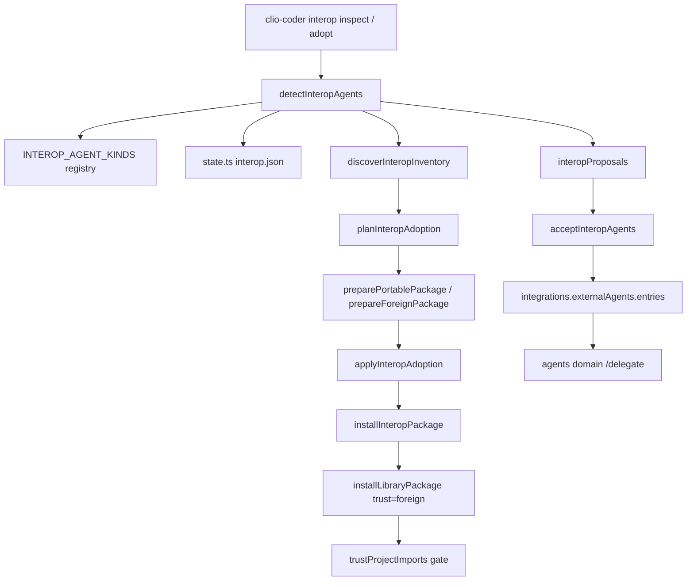

# Domains interop

The interop domain is Clio's peer-adoption surface. It answers three questions about
external coding agents that live on the same machine: which ones are installed
(`detect.ts`), what safe content they own that Clio can take a data-only copy of
(`inventory.ts`, `projection.ts`, `adopt.ts`, `import.ts`, `foreign.ts`), and how an
operator consents to wiring one of them as an ACP delegation peer
(`consent.ts`, `peer-modes.ts`). It owns no model calls and never starts a foreign
session; everything it reports is a fact about disk state plus the operator's recorded
decisions.

The domain is composed through `src/domains/interop/index.ts`, which exports the
`InteropDomainModule` built from `InteropManifest` (name `interop`, `dependsOn:
["config"]`) and `createInteropBundle` in `src/domains/interop/extension.ts`. The
bundle exposes the `InteropContract` (`detect`, `lastReport`, `proposals`,
`configured`, `accept`, `decline`), read by the interactive overlay in
`src/interactive/overlays/interop.ts` and by the CLI in `src/cli/configure-interop.ts`
and `src/cli/interop.ts`.

## The registry is the single source of truth

`INTEROP_AGENT_KINDS` in `src/domains/interop/registry.ts` is a pure-data table of the
nine known peers in preference order: `claude-code`, `codex`, `opencode`, `gemini`,
`copilot`, `cursor`, `antigravity`, `pi`, and the `agents` convention (`.agents`
skills shared across hosts). Each entry carries the executables to resolve
(`binaryNames`), the home and project directories the agent owns, its skill and
prompt roots, project-relative instruction files, and three launch facts: an ACP
recipe (`acp`), a headless runtime id (`headlessRuntimeId`), and the resources-domain
labels used when counting discovered skills (`skillSource`, `adoptionProvider`).

The registry order is load-bearing: `interopSourceRank` breaks skill-source ties by
this index, so a symlinked skill resolves to the same winner on every machine.
`foreignAgentDirs()` derives the write-protected list from the same table, including
`legacyUserDirs` and `legacyProjectDirs` entries such as `~/.antigravitycli/` and
`.antigravitycli/`.

A second table, `INVENTORIES`, attaches per-agent discovery layout to five kinds
(`claude-code`, `codex`, `antigravity`, `copilot`, `opencode`): the user root,
project roots, resource roots with expected extensions (for example `opencode` adds
`agent/`, `command/`, and executable `plugins/`/`tools/` roots), declaration files for
hooks and MCP servers (`settings.json` `hooks` key, `.mcp.json` `mcpServers`), plugin
directories and manifest file names, an optional installed-registry file, and an
evidence-only `listCommand`. The two tables are joined by a map spread at the bottom
of the registry, so `INTEROP_AGENT_KINDS` entries carry `inventory` only when
extended.

## Detection flow

`detectInteropAgents` (`src/domains/interop/detect.ts`) probes every registered kind
and returns an `InteropReport` (`version: 1`, `detectedAt`, per-agent facts). For each
kind it:

1. Resolves the binary with `resolveOnPath`, which walks `$PATH` with `accessSync` and
   never spawns a shell. Unreadable directories flip the result to `unknown` rather
   than guessing `absent`.
2. Checks the agent's home directory for an install root (`installDirOf`), honoring
   the per-agent `homeEnv` override (e.g. `CLAUDE_CONFIG_DIR`, `CODEX_HOME`,
   `ANTIGRAVITY_HOME`).
3. Verifies the ACP adapter with `adapterPresence`: an `npx -y pkg@version` recipe is
   only `present` when the exact pinned version exists in the local
   `node_modules`; a different global executable or a version mismatch reports
   `unknown`. `npx` is never run during detection.
4. Optionally runs a bounded `--version` probe (`probeVersion: true`) for a binary that
   already resolved. The probe runs in a `mkdtempSync` scratch directory that becomes
   `HOME`/`USERPROFILE`, with every XDG and per-agent env variable redirected into it,
   a 2000 ms timeout, and a 4 KiB output cap, so host and project profiles stay
   read-only.
5. Optionally discovers the inventory (`inventory: true`) via
   `discoverInteropInventory`, which overwrites `skillCount` and `projectArtifacts`
   with real counts.

A record is `detected()` when the binary is present, the install directory exists, or
skill/project artifacts were counted. The proposal fingerprint
(`interopFingerprint`) hashes kind id, binary path, version, and the exact ACP recipe,
deliberately excluding skill and artifact counts so that adding a foreign skill does
not re-propose an already-declined agent. Prior decisions from the recorded report
(`state.ts`) are merged into each new record.

Downstream, `src/domains/interop/state.ts` persists the report as
`interop.json` under Clio's state directory (`clioStateDir()`). `readInteropReport`
parses it defensively: an unreadable or wrong-version file degrades to `null`, which
the domain treats as "propose nothing" rather than acting on a half-read decision
record.

## Resource discovery and projection

`discoverInteropInventory` (`src/domains/interop/inventory.ts`) walks the declared
roots only — never sessions, history, or executable modules. It applies hard bounds:
4096 files, 2 MiB per file (`inventoryText`), and 12 directory levels; symbolic links
are listed as `unknown` and never followed. It records skills (any `SKILL.md`),
agents and prompts by frontmatter or TOML name, hooks and MCP server declarations by
name only (the comment notes configuration values can carry credentials, so only keys
are stored), and plugins, including marketplace evidence for `claude-code`
(`plugins/installed_plugins.json`), `codex` (`plugins/cache` with
`cacheMarketplace`), and `copilot` (local `directory` marketplaces resolved through
`.claude-plugin/marketplace.json`).

Projection turns host text into Clio recipe bytes through three helpers in
`src/domains/interop/projection.ts`:

- `projectSkill` parses the skill directory's `SKILL.md` frontmatter, drops every key
  in `HOST_SKILL_KEYS` (host execution policy: `allowed-tools`, `hooks`, `mcpServers`,
  `model`, `context`, etc.), injects `clio-coder: { audit: "unknown" }`, and relocates
  the files under `skills/<id>/`. It reports omitted frontmatter keys and companion
  files that retained text references (`requiredOmissions`).
- `projectAgent` accepts Markdown or TOML agent definitions and rewrites them into a
  read-only Clio recipe: `capabilityClass: "read-only"`, required tool `read` with
  optional `grep`/`find`/`ls`, a 24-toolCall budget, and tags `["interop"]`. Every
  frontmatter key other than name, description, and (when binding) skills is reported
  as omitted; host tools, permissions, model and sandbox settings never survive.
- `projectPrompt` keeps only `description` and the argument hint
  (`PROMPT_KEYS`), rewriting the command as a Clio prompt recipe.

`safeName` normalizes identifiers to lowercase alphanumerics with hyphens, capped at
45 characters. `tree` bounds the source walk (16 MiB, 2048 files, depth 12, no
symlinks) and, in `dataOnly` mode, drops executables and `FORBIDDEN_PARTS` (hooks,
output-styles, scripts, tools, node_modules, .git, vendor manifest directories) into
an `omitted` list instead of failing. `digest` hashes the projected file map;
`reviewFingerprint` hashes the whole source tree including paths, modes, hidden
manifests, and omitted files, so a policy change cannot slip past review by keeping
the projected text equal.

## Adoption: inventory item to portable package

`planInteropAdoption` (`src/domains/interop/adopt.ts`) takes a host id and an
`InteropInventory` and produces an `InteropAdoptionPlan` whose entries are either
`install` or `skip` with a reason. The flow per inventory item:

1. Executable kinds (`hook`, `mcp`, `executable`) and unsupported kinds are skipped
   with the reason that they are executable configuration or presentation data.
2. The item is projected through `prepared`, which for plugins calls
   `detectForeignPlugin` (`src/domains/interop/foreign.ts`) and then either
   `preparePortablePackage` or `prepareForeignPackage`, and for loose skills/agents/
   prompts calls `projectSkill`/`projectAgent`/`projectPrompt` and wraps the result in
   a synthetic `plugin.json`.
3. `unmetRequirements` verifies every declared requirement is already installed in the
   target scope and, for foreign packages, that a vendor dependency's satisfied
   package actually came from an import of the same vendor format (a same-named
   native package does not satisfy a vendor dependency).
4. Duplicate detection compares skill content digests (`normalizedSkillHash`), prompt
   bodies, package id/version, and full resource content digests against installed
   plugins and Clio's own skill and prompt roots; collisions are skipped, never
   replaced.
5. The projected `plugin.json` gains an `ai.iowarp.clio.interop` extension block
   recording host, source path, scope, format, and `untrusted: true`.

`preparePortablePackage` refuses to silently change the meaning of a portable package:
it throws when a retained recipe references an omitted companion file, when a
package's declared kind has no projectable public component, or when recipe content
fails library validation. `prepareForeignPackage` normalizes Claude Code and Codex
plugin formats through `projectForeignPlugin`, which reads vendor manifests
(`.claude-plugin/plugin.json`, `.codex-plugin/plugin.json`), maps vendor dependencies
to `plugin:<name>` requirements, and lists every host feature it will never activate
(`unsupported`): hooks, MCP servers, LSP, apps, monitors, output styles, scripts,
tools, and host settings. `detectForeignPlugin` gives the root `plugin.json` absolute
precedence; two hidden vendor manifests are ambiguous and require an explicit format.

`applyInteropAdoption(plan, approved)` enforces the review boundary: it refuses when
`approved` is false; it re-runs `prepared` on the source and throws when the current
digest differs from the reviewed one ("Source or plan changed after review"); it
re-checks requirements; it stages the reviewed bytes into a `mkdtempSync` directory;
and it publishes through `installInteropPackage` (`src/domains/interop/install.ts`),
which is a thin seam over `installLibraryPackage` in the plugins domain with
`trust: "foreign"` and an `interopOrigin` recording host, source, format, and
marketplace. The staging directory is removed in a `finally` block.

## Library import: explicit foreign package seam

`src/domains/interop/import.ts` provides a second entry point for packages the
operator points at explicitly (`clio-coder library import`):
`planLibraryImport` fetches a local path or GitHub source, computes the full-tree
`reviewFingerprint`, projects the package through the same portable/foreign routes,
and returns a `LibraryImportPlan` that retains the fetched bytes and a `cleanup`
callback. `applyLibraryImport` refuses drift by re-fingerprinting the source and
re-projecting it, then publishes with `trust: "foreign"` and reports publication,
native validation, and trust admission as three separate facts. The admission fact
names the gate setting
`integrations.projectResources.trustProjectImports`, whose default is `false`
(`src/core/defaults.ts`); `libraryImportPlanSummary` strips the reviewed bytes and
cleanup callback so plans stay JSON-safe.

## ACP delegation and the consent model

Wiring a detected peer as a delegation agent is a consent flow, not a side effect of
detection. `interopProposals` (`src/domains/interop/consent.ts`) filters a report down
to agents that (a) have an ACP recipe in the registry, (b) are `present`, (c) are not
already in `settings.integrations.externalAgents.entries`, and (d) have no standing
decision whose `decidedFingerprint` still matches the record's fingerprint. A declined
agent whose binary or version moved therefore comes back as a fresh proposal.

`acceptInteropAgents(ids, report)` builds each proposal's delegation entry with
`delegationEntryForKind`, which takes the registry's ACP recipe and applies the
operator's global timeouts plus `toolGovernance: "clio-coder-policy"`. The entry is
appended to `integrations.externalAgents.entries` under the shared settings lock
(re-read on each update, so two concurrent acceptors cannot drop each other's entry),
and the decision is recorded with `acceptInteropAgents`'s state-file lock in
`updateRecords`, which merges the caller's report with stored records before writing
so an earlier decision in the same review is never erased by a stale report copy.
`declineInteropAgents` records the same fields with `decision: "declined"` and wires
nothing.

The consent semantics the overlay and CLI show the operator:

- `INHERITED_PROJECT_CONTEXT = "none"`: a wired peer inherits no project context; the
  key is omitted from the written entry precisely so it tracks that default. The peer
  receives task text only, never the project projection.
- `toolGovernance: "clio-coder-policy"`: Clio mediates permission requests the ACP
  peer reports; the peer's own tool surface is not fully observable.
- `needsNetworkInstall` on a proposal flags that the pinned adapter is not locally
  verified, so `npx` may fetch it on first delegation.

Downstream, the agents domain consumes the same entries:
`src/domains/agents/extension.ts` synthesizes an `AgentSpec` for each
`integrations.externalAgents.entries` item (source `custom`, description naming the
command) and lists them alongside discovered recipes, so `/delegate <id> <task>`
reaches the peer. `assertAgentIdNamespace` rejects discovered recipes whose ids clash
with wired peer ids.

## Peer mode projection

`peerModeCapabilities` (`src/domains/interop/peer-modes.ts`) turns one detected record
into launch choices without starting anything. It emits up to three modes, each with a
status (`ready`/`experimental`/`unavailable`), a reason, a setup action, and the Clio
command that would reach it:

- **acp**: unavailable until the binary is present, an ACP delegation entry exists, and
  `record.adapter === "present"`; then experimental, because launch is configured but
  authentication and permission behavior need a live task probe.
- **headless**: unavailable until the binary is present and at least one configured
  target uses the kind's `headlessRuntimeId`; target ids are explicit, never inferred
  from a runtime id alone.
- **pane**: an interactive handoff through a Herdr pane host; `ready` only when the
  binary is present and the pane host is observably available (`paneAvailable` is
  `null` for static inspectors, which reports `experimental`).

`isInteropHeadlessRuntime` is the registry's membership test for worker runtimes.

## Trust boundary for project-adopted resources

Adoption and import never grant trust. Installed records carry `trust: "foreign"`
(origin kind `interop` or `import`), and the resources domain marks foreign skills and
prompts `trusted: false` until the operator enables
`integrations.projectResources.trustProjectImports`. The contract tests in
`tests/extended/interop-boundary.test.ts` demonstrate both halves of the boundary:
the safety policy engine blocks `Write` to `.claude/settings.json` with reason
`path-policy:noWritePaths` under every posture while allowing `Read` of
`.claude/skills/x/SKILL.md`, and loose compatibility prompts discovered from foreign
roots stay discovery-only (`expandPromptTemplateInput` refuses them with a refusal
naming the template). Once the trust setting flips, imported package content is
admitted; loose compatibility roots that were never explicitly imported remain
inactive, as the prompt loader's refusal text states.

## Extension seams

- **New peer**: add an entry to `INTEROP_AGENT_KINDS` in `src/domains/interop/registry.ts`
  (binary names, directories, ACP recipe, runtime id). Detection, consent, and
  `foreignAgentDirs` pick it up automatically.
- **New discovery layout**: add an `INVENTORIES` entry; only kinds with one gain
  `discoverInteropInventory` support (`inventory` becomes `unknown` with a diagnostic
  otherwise). The CLI's `adopt` subcommand already restricts hosts to kinds with an
  inventory (`claude-code`, `codex`, `antigravity`, `copilot`, `opencode`).
- **New foreign format**: extend `FOREIGN_MANIFESTS` and `projectForeignPlugin` in
  `src/domains/interop/foreign.ts`; the adoption and import routes share both, so one
  change covers both entry points.
- **Host keys that must never cross the boundary**: extend `HOST_SKILL_KEYS` and
  `FORBIDDEN_PARTS` in `src/domains/interop/projection.ts`.
- **Wiring surface**: the overlay reads only the `InteropContract`; new interactive
  views go through `src/domains/interop/index.ts` exports, never internal modules.

## Focused tests

`tests/extended/interop-adoption.test.ts` is the adoption contract suite. Representative
cases: `detectInteropAgents({ inventory: true, probeVersion: true })` against a fake
`claude` binary that writes marker files proves the version probe touches neither the
foreign home nor the project; a fake `codex-acp` at version `1.12.0` reports the
adapter `unknown` while `1.10.0` reports `present`, pinning the adapter check to the
exact registry version; adoption of a `.claude/agents/review.md` with `tools:
Bash,Write` and `hooks: dangerous` yields an installed recipe containing `read-only`
and none of the dangerous text; a Claude marketplace plugin records origin
`{ kind: "interop", host: "claude-code", marketplace: "test-market" }` and leaves the
source bytes untouched; a portable bundle whose prompt text references omitted
`actions/*.json` companions is refused with "references omitted companions"; and a
requirement that is disabled at approval time blocks the install ("re-check after
approval").

`tests/extended/interop-boundary.test.ts` pins the consent and write-boundary
contracts: accepting `codex` and declining `opencode` in one review persist
independently and leave the proposal list empty; the safety engine blocks writes to
`.claude/` at postures `undefined` and `"confirmed"` while allowing reads;
`foreignAgentDirs()` covers legacy Antigravity roots; and foreign compatibility
prompts are discovery-only.

`tests/contracts/external-cli-connectors.test.ts` exercises `peerModeCapabilities`
for `codex` and the external CLI runtimes that headless delegation targets.

## Things to watch when editing

- Registry order is load-bearing for skill-source tie-breaking; do not reorder
  `INTEROP_AGENT_KINDS` without checking `interopSourceRank` consumers.
- `INTEROP_AGENT_KINDS` entries without an `INVENTORIES` layout are intentional
  (e.g. `pi`, `agents`); do not "complete" them, or `discoverInteropInventory` will
  start walking roots the registry never declared.
- The detection fingerprint excludes `skillCount`/`projectArtifacts` on purpose;
  adding them there will make declined agents re-propose every time a foreign skill
  appears.
- `reviewFingerprint` and `digest` guard the plan/apply boundary; any change that
  alters projection output must keep the apply-time re-projection byte-identical, or
  `applyInteropAdoption` will report "Source or plan changed after review".
- `HOST_SKILL_KEYS`, `PROMPT_KEYS`, and `FORBIDDEN_PARTS` are the allow/deny lists for
  host execution policy; a new host key that reaches a recipe frontmatter survives to
  install and is silently trusted.
- `unmetRequirements` is consulted twice (plan and apply); vendor-provenance checks
  require the installed package's origin to be an `import`/`interop` record of the
  same format — a hand-installed native package with the right id will not satisfy a
  vendor dependency.
- The interop state file is versioned (`version: 1`) and parses defensively; new
  record fields need a corresponding parser in `parseAgent` (`state.ts`), otherwise
  they vanish on read.
- Tests in `tests/extended/` run only under `pnpm run test:full`, never in CI; a
  regression that belongs in CI belongs in `tests/contracts/` instead.
