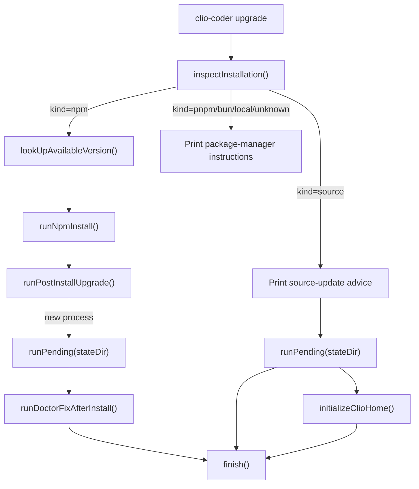

# Domains lifecycle

The lifecycle domain owns the verbs that act on the install itself rather than on a session or a dispatch:
diagnose the install, upgrade it and migrate its versioned state, detect how it was installed, and tell
the operator when the running version is out of date. The public surface is re-exported from
`src/domains/lifecycle/index.ts`, which exposes the doctor core and formatters, the migration runner,
the state-metadata readers, the upgrade-notice text generator, and the version info.

## Doctor: diagnosing an install

`runDoctor` in `src/domains/lifecycle/doctor.ts` is the synchronous core. It returns an array of
`DoctorFinding` rows, one per named check, where each row carries an `ok` flag, a stable `name`, a
human-readable `detail`, and an optional `level` (`"ok" | "info" | "warn" | "error"`). The command-line
entry point is `runDoctorCommand` in `src/cli/doctor.ts`, registered under the name `"doctor"` in the
`COMMAND_HANDLERS` map of `src/cli/index.ts`.

The synchronous core checks, in order:

- The Clio version, Node version, and platform, from `getVersionInfo()`.
- The engine runtime, by asserting `piAgentCore`, `piAi`, and `piTui` are all present.
- The four XDG roots (config, data, state, cache) via `directoryFinding`, which distinguishes a missing
  path (`ENOENT`), a path that is a file/symlink/FIFO/socket/device node, and a directory that is not
  readable/writable/traversable. The remedy differs by failure: `--fix` creates a missing root but
  cannot move a file aside or widen a mode, so each row names the command that fits the failure.
- `settings.yaml`, validated directly through the loader's own `validateSettingsFile`, so a parse error
  here matches the exact key paths and remedy the loader will refuse to start on.
- `credentials.yaml`, in one stable row covering missing, wrong mode, correct mode (`0o600`), and read
  error. `--fix` chmods this file to `0o600`.
- State metadata, read through `readStateInfoResult` and compared against the running version. A record
  whose version differs from the running one is reported stale with a pointer to `doctor --fix`.

Before the per-root checks, `runDoctor` short-circuits on an untouched home. `isUninitializedHome`
returns true only when none of the four roots exist and no `install.json` exists. On that home, with no
`--fix`, `runDoctor` returns a single `"installation"` row (level `"warn"`) saying to run `clio-coder`
or `clio-coder configure`, and stops. This is the documented behavior that `doctor` as a first command
after `npm install` does not read as damage and exits 0.

`runDoctor` with `--fix` calls `initializeClioHome()` (from `src/core/init.ts`) to create the directory
tree and write `settings.yaml` and `credentials.yaml` if absent. A repair that throws is recorded in a
`"repair"` row and the run continues, so the command that explains the damage never prints nothing.

The network-bound and fleet sweeps are separate async functions that the CLI invokes on top of the core.
They are not part of `runDoctor` itself:

- `runDoctorRuntimeChecks` walks `settings.targets` for `openai-compat` and `anthropic-compat` URLs and
  fingerprints any that respond as a known native server (LM Studio, Ollama), emitting a WARN row that
  advises converting the target to the native runtime.
- `runDoctorModelChecks` checks every model pointer `settings.yaml` aims at a target with no static
  catalog against what the target advertises; it uses the live list when the target answers and falls
  back to the `wireModels` list `configure` recorded. It reports server settings that defeat
  prefix-cache reuse as their own WARN rows.
- `runDoctorInteropChecks` reports one row per detected external coding agent and an aggregate row for
  foreign skill roots; it reports and never proposes, and never writes.
- `runDoctorFleetChecks` probes every configured fleet node over SSH and persists the verdicts to the
  durable preflight store that dispatch placement consults. A failing node is a WARN, never fatal.
  Plain doctor observes; `--fix` is the run that may record, because recording is what admits a node.

`collectDoctorFindings` in `src/cli/doctor.ts` composes the core with all the sweeps plus the CLI-local
findings (`stateStorageFinding`, `toolchainFindings`, `hpcToolchainFindings`, `slurmMcpFindings`,
`panesFindings`, `namingHistoryFindings`, `validationContractFinding`, `taskWorktreeFindings`, and the
`--deep` checks). `formatDoctorReport` renders each finding as a four-character badge (`OK`, `INFO`,
`WARN`, or `!! `) padded, then the name padded to 22, then the detail folded onto one line by
`foldDetail`.

## Upgrade: the path that migrates state

`runUpgradeCommand` in `src/cli/upgrade.ts` is the upgrade verb, registered as `"upgrade"` in
`src/cli/index.ts`. It detects the install method, consults the registry (for non-source installs),
replaces the package (for npm installs), and applies pending state migrations.

The sequence for an npm global install:

1. `inspectInstallation()` classifies the install (see below).
2. `lookUpAvailableVersion` fetches the channel version from the registry. A source checkout never
   queries the registry; a `--post-install` run reports the lookup as "not checked".
3. `runNpmInstall` spawns `npm install -g --prefix <prefix> @iowarp/clio-coder@<channel>` via
   `npmInstallArgs`, which pins the prefix so the upgrade lands in the install's own prefix, not npm's
   current default. The child's stdout is drained, because `npm install -g` writes well past a 64 KB
   pipe buffer and a child whose stdout nobody reads blocks.
4. `runPostInstallUpgrade` re-launches the installed entry with `upgrade --post-install --channel=<c>`,
   so the new binary runs the post-install checks, not the old process.
5. In the `--post-install` run, `runPending` applies migrations and `runDoctorFixAfterInstall` runs
   `doctor --fix` with the installed entry.

For a source checkout, the upgrade never touches the registry or runs `npm install`. It prints
`SOURCE_UPGRADE_LEAD` advice (fetch tags, check out a release, `pnpm run install:local`), applies
migrations with `runPending`, then calls `initializeClioHome()` directly to refresh `install.json`, and
finishes with `finish()` which may relaunch via `runRestart`.

The `--dry-run` path reports the detected facts (method, current version, available version, state dir),
previews each pending migration by id, and returns 0 without changing anything. It distinguishes three
registry states: "not checked" (source checkout or post-install checks), "unknown (the registry could
not be reached)" (a lookup that was made and came back empty), and a concrete version. An "already
current" verdict is only claimed when a lookup was made and compared a version, or when no lookup was
owed.

## Migration runner: versioned state-shape changes

`runPending` in `src/domains/lifecycle/migrations/index.ts` applies every registered migration the state
tree has not recorded yet. A migration is an object with a stable `id` of the form
`YYYY-MM-DD-<slug>` and an async `up(stateDir)`. The registry is a static, ordered list compiled into
the bundle, so the runtime never scans the filesystem for migration files.

Applied migration ids are persisted to `<stateDir>/migrations.json`. `runPending` reads the manifest,
skips every id already present, and for each remaining migration invokes `up()`, adds the id, and
rewrites the manifest after each `up()` rather than once at the end. That rewrite-after-each is the
at-most-once guarantee: a throw from a later migration cannot discard the record of the earlier ones
that already succeeded, so they are not re-run against a tree they have already changed. Even when
nothing is pending, `runPending` rewrites the manifest, so a home whose file was missing or unparseable
gains a well-formed one. `listMigrations` returns the registry and `readMigrationManifest` returns the
`{ applied: string[] }` for a state directory.

The two registered migrations, in order, are:

- `2026-09-01-settings-v2` (`src/domains/lifecycle/migrations/2026-09-01-settings-v2.ts`). This is the
  complete settings v1 → v2 rewrite. It moves 62 v1 keys to their v2 locations
  (`orchestrator.target` → `chat.target`, `workers.default` → `fleet.default`, etc.), drops retired keys,
  sets `version: 2`, and validates the result against the strict schema. It holds the settings
  single-writer lock (`withSettingsLock`) around its read-rewrite-write and lands the write through
  `safeResourceWrite` with a `.v1.bak` backup. It throws `SettingsV2CollisionError` when a v1 source and
  its v2 destination both exist, leaving the original untouched. It is idempotent: a re-run over a
  `version: 2` file returns without rewriting.
- `2026-09-01-retire-panes-knobs` (`src/domains/lifecycle/migrations/2026-09-01-retire-panes-knobs.ts`).
  It strips the retired `panes.agents` and `panes.keepFailed` keys, which the v2 schema refuses by name.
  It is a no-op on a file that never named those keys and never rewrites a file it cannot parse.

The registry order is deliberately not the id order. `settings-v2` owns the complete v1 rewrite,
including the already-retired pane keys, and must run before any later migration reaches the strict v2
reader. `retire-panes-knobs` remains registered for homes that recorded the v2 migration independently and
for manifest continuity. The manifest replays by id membership rather than by position, so a home that
already applied one is unaffected by where the other sits.

The module header documents three requirements for future migrations: a migration that writes
`settings.yaml` must hold the settings single-writer lock around its read-rewrite-write and land the
write through the atomic rename writer; migrations are authored against the shapes the code has on the
day they are needed, never against stale pre-release shapes; and a repair migration runs before any
migration that reads through `readSettings`, because that reader throws on the very document the repair
exists to fix.

## Install-method detection

`inspectInstallation` in `src/domains/lifecycle/install-method.ts` classifies an install without running
a package manager or consulting the network. It returns an `Installation` with `kind`, `root`, `entry`,
and `prefix`. The kinds are `"source" | "npm" | "pnpm" | "bun" | "local" | "unknown"`.

The detection order is:

1. Resolve the entry path (default `process.argv[1]`) to a real path. A missing launcher still leaves
   the package root available for recovery advice.
2. If the root's `package.json` name is not `@iowarp/clio-coder`, return `unknown`.
3. `sourceCheckoutRoot` checks whether the entry ends in `dist/cli/index.js`, is not inside a
   `node_modules` directory, and the root has either a `.git` directory or `src/cli/index.ts`. If so,
   return `source`.
4. A path ending in `lib/node_modules/@iowarp/clio-coder` is `npm`, with the prefix being everything
   before that suffix.
5. A path containing `pnpm/global/<number>` is `pnpm`.
6. A path containing `install/global/node_modules` is `bun`.
7. A path containing `node_modules` is `local`.
8. Otherwise `unknown`.

This is the prevention the domain exists to provide: a source-checkout install is never classified as
`npm`, so `clio-coder upgrade` never offers the npm-global reinstall path to a source checkout. The
published package may not exist, and `npm install -g` would escape the install's roots and touch the
global npm prefix.

`npmInstallArgs` returns `["install", "-g", "--prefix", prefix, "@iowarp/clio-coder@<channel>"]` and
throws for any non-npm kind, because automatic upgrade requires an identified npm global installation.
`installationCommand` produces the update or uninstall command as a string for the install method:
`npm` with its prefix for npm, `pnpm add/remove -g` for pnpm, `bun add/remove -g` for bun, and for a
source checkout it prints the git fetch and checkout advice.

## Update checking and upgrade notice

`createUpdateCheck` in `src/domains/lifecycle/update-check.ts` returns an object with `probe` and
`claim`. Construction does no I/O; the interactive owner starts probes after its first committed frame.
The cache path is `<cacheDir>/update-<fingerprint>.json`, where the fingerprint is the first 16 hex
characters of the SHA-256 of the install root. The intervals are `UPDATE_CHECK_INTERVAL_MS` (24 h) and
`UPDATE_NOTICE_INTERVAL_MS` (7 days).

`probe` reads the installed files afresh from disk. It compares the on-disk version to the running
version captured before hydration and flags a "replaced" notice when they differ or the entry's mtime is
newer than process start. Development trees, local/npx copies, and unknown layouts never generate
registry traffic. A "available" notice is only produced when the cached registry version is newer than
the running version and the install kind is npm, pnpm, or bun. Registry lookups are cached for 24 h and
share one request across simultaneous sessions through `withStateFileLock`.

`claim` stamps `notifiedKey` and `notifiedAt` in the cache under the same file lock, and refuses to
claim when the session is not idle, when an available-notice was already claimed within the check
interval, or when the same notice key was claimed within the notice interval. The interactive consumer
is `startUpdateMonitor` in `src/interactive/update-monitor.ts`, which ticks every second, probes on a
60 s cadence, and displays the notice text for 30 s while idle.

The version-semantics helpers are in `src/domains/lifecycle/release-version.ts`:

- `parseReleaseVersion` accepts strict SemVer and rejects leading zeros, `v` prefixes, and metadata that
  could become a shell argument.
- `compareReleaseVersions` orders core versions numerically and prereleases by the SemVer rules,
  returning `null` when either side fails to parse.
- `fetchReleaseVersion` fetches a channel from the npm registry with a 2.5 s timeout and returns the
  version string or `null`.

`describeUpgradeNotice` in `src/domains/lifecycle/upgrade-notice.ts` renders the one line the first
interactive launch after an upgrade says. It reads `KEYBOARD_FACING_CHANGES`, a frozen map from version
to a keyboard-facing change summary. When the target version has an entry, the line names the change
and points to the CHANGELOG; otherwise it gives the generic "What changed is in CHANGELOG.md" line.
`takeUpgradeNotice` in `src/domains/lifecycle/state.ts` returns the version transition the operator has
not been told about yet, or `null`. `initializeClioHome` refreshes `install.json` silently on every
boot, so by the time anything can speak the record already says the current version; `upgradedFrom`
remembers where it came from. Claiming the notice stamps `noticedVersion`, so it is shown once per
version and never again. A record without `upgradedFrom`, or one already noticed, yields `null` and
writes nothing. The consumer is `entry/orchestrator.ts`, which calls `takeUpgradeNotice()` only when
interactive and pushes `describeUpgradeNotice(upgrade)` into `initialNotices`.

## State metadata

`src/domains/lifecycle/state.ts` reads and writes `<stateDir>/install.json`. `readStateInfoResult`
distinguishes a genuinely absent file (`ENOENT`, returns `info: null, problem: null`) from a present but
unreadable one (returns `problem` with the read error), because the two have different remedies.
`readStateInfo` returns only the `info`. `ensureClioState` calls `initializeClioHome()` and then reads,
throwing if the record was not written. `takeUpgradeNotice` is described above.

`StateInfo` carries `version`, `installedAt` (absent when the record was rebuilt over a state root whose
install time was gone), `upgradedAt`, `repairedAt` (when the record itself was rebuilt, never the same
claim as an install), `upgradedFrom`, `noticedVersion`, `platform`, and `nodeVersion`.

## Lifecycle flow

## Extension seams

- **Adding a migration.** Author `YYYY-MM-DD-<slug>.ts` with a default export matching the `Migration`
  contract, then register it in `REGISTRY` in `src/domains/lifecycle/migrations/index.ts`. The order
  matters: a settings-repair migration must precede any migration that reads through `readSettings`.
  The migration header in `2026-09-01-settings-v2.ts` documents the lock and atomic-write requirements.
- **Adding a doctor row.** Add the finding to the relevant `runDoctor*` function. Synchronous rows go
  in `runDoctor` in `src/domains/lifecycle/doctor.ts`; network-bound rows go in the async sweeps
  (`runDoctorRuntimeChecks`, `runDoctorModelChecks`, `runDoctorInteropChecks`,
  `runDoctorFleetChecks`), which are composed in `collectDoctorFindings` in `src/cli/doctor.ts`.
  CLI-local findings are composed there too.
- **Adding an install kind.** Extend the `kind` union in `Installation` and add a branch in
  `inspectInstallation`, `npmInstallArgs` (if it needs automatic upgrade), and `installationCommand`.
- **Adding a keyboard-facing change note.** Add an entry to `KEYBOARD_FACING_CHANGES` in
  `src/domains/lifecycle/upgrade-notice.ts`. The footer classifies a plain string by its text, and
  `"changed"` is what makes it a sticky, dismissable notice rather than one that fades in twelve
  seconds.

## Focused tests

- `tests/contracts/upgrade-command.test.ts` demonstrates the install-method detection and the upgrade
  flow. It builds an npm-layout fixture with a custom prefix, asserts `inspectInstallation` returns
  `kind: "npm"` and the correct prefix, asserts `npmInstallArgs` returns the exact prefix-pinned args,
  asserts `installationCommand` quotes the prefix, and asserts `npmInstallArgs` throws for a pnpm kind.
  It verifies the upgrade runs `npm install -g --prefix <prefix>` then `upgrade --post-install`, and
  that `--restart` relaunches with argv the real startup parser accepts. It also checks pnpm global vs
  project-local layout classification and that an older dist-tag never downgrades the installed package.
- `tests/contracts/update-check.test.ts` demonstrates the update check. It asserts construction does no
  I/O, that `probe` returns an available notice, that a busy session does not consume a reminder, that
  simultaneous sessions share one registry request and one reminder, that a replaced install is
  detected without consulting the registry, and that development/local/unknown installs never check the
  registry. It also verifies the monitor waits for idle, hides during work, expires, and can be
  dismissed.
- `tests/extended/settings-migration.test.ts` demonstrates the migration ordering and the settings v2
  migration. It asserts the registry order is `[settings-v2, retire-panes-knobs]`, that a v1 document
  migrates atomically with a `.v1.bak` backup and is idempotent, that a v1/v2 collision is refused
  without replacing the file, and that a v2 file is untouched on re-run.
- `tests/extended/upgrade-lifecycle.test.ts` demonstrates the upgrade lifecycle. It asserts the upgrade
  reports detected facts before doing anything, exits 0 when current with no pending migrations, does
  not claim to be current when the registry was asked and could not answer, previews every pending
  migration by id in dry run, applies pending migrations and reports the count, and reports a failed
  migration with the recovery command.
- `tests/extended/package-manager-upgrade.test.ts` demonstrates the post-install path. It asserts a
  `--post-install --dry-run` previews local migrations without a registry lookup or package
  replacement.

## Things to watch when editing

- **Manifest rewrite after each `up()`.** Do not move the `writeManifest` call in `runPending` to after
  the loop. The per-migration rewrite is what preserves the at-most-once guarantee when a later
  migration throws.
- **Registry order is not id order.** The `REGISTRY` array order encodes the settings-repair-before-read
  constraint. Do not sort the registry by id; the manifest replays by id membership and a home that
  already applied one is unaffected by where the other sits, but the order matters for a home that has
  applied neither.
- **Settings migrations must hold the lock and write atomically.** A migration that writes
  `settings.yaml` must hold `withSettingsLock` around its read-rewrite-write and land the write through
  `safeResourceWrite`, so it never races `updateSettings` and readers never see a partial file.
- **Install-method classification must stay network-free.** `inspectInstallation` inspects layout only.
  Adding a registry lookup here would break the offline upgrade path and the update-check test that
  asserts no registry traffic for non-npm kinds.
- **The upgrade notice is claimed exactly once per version.** `takeUpgradeNotice` stamps
  `noticedVersion` and only returns a transition when `upgradedFrom` is present and differs from the
  current version. If you change the stamp or the return condition, the notice will either never show
  or repeat on every boot.
- **Doctor must stay read-only without `--fix`.** The per-root checks in `runDoctor` create nothing;
  `initializeClioHome` is called only when `options.fix` is true. Adding a side effect to the
  synchronous core breaks the "diagnose without creating files" contract and the exit-0 behavior on an
  untouched home.
- **Drain the npm child's stdout.** `runChild` in `src/cli/upgrade.ts` drains stdout and stderr because
  `npm install -g` writes well past a 64 KB pipe buffer and a child whose stdout nobody reads blocks
  forever. Removing the drain reintroduces the silent hang.
- **The upgrade notice word "changed" is load-bearing.** The footer classifies a plain string by its
  text, and `"changed"` is what makes the upgrade notice sticky and dismissable rather than a transient
  message. Renaming the phrase in `describeUpgradeNotice` or in `KEYBOARD_FACING_CHANGES` values can
  change how the footer renders the notice.

<!-- clio-coder:wiki unresolved sources: lib/node_modules/@iowarp/clio-coder -->
