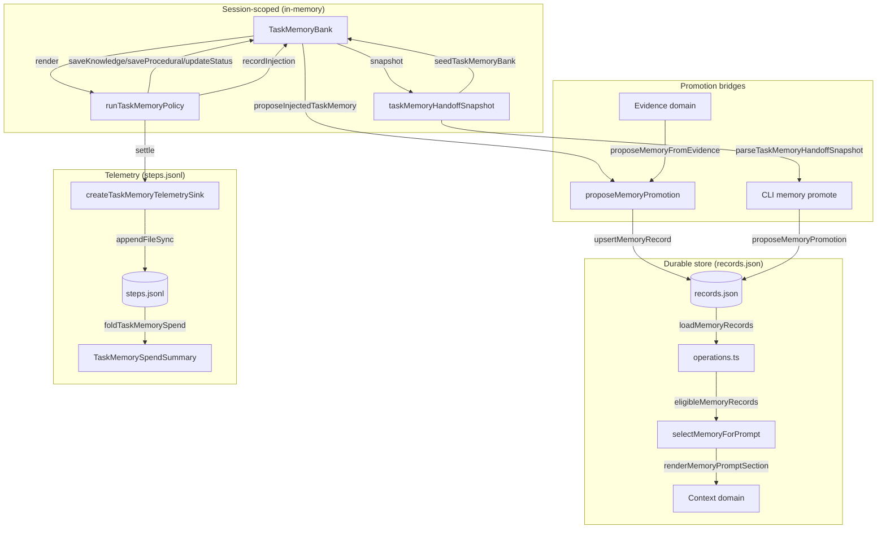

# Domains memory

## What this area does

The memory domain manages two distinct stores with a promotion bridge between them. The **task memory bank** (`TaskMemoryBank` in `src/domains/memory/task-bank.ts`) is per-session, in-memory execution memory that the background intervention middleware reads and writes on every step. It holds three classes: a private `status` entry tracking the policy's progress model, `knowledge` entries for facts, and `procedural` entries for procedures and failure lessons. The bank is capped (20 knowledge, 30 procedural by default) and evicts oldest entries when a cap is exceeded.

The **durable memory store** (`src/domains/memory/store.ts`, `src/domains/memory/operations.ts`) persists approved, evidence-linked memory records to `<dataDir>/memory/records.json`. These records carry scopes (`global`, `repo`, `runtime`, `agent`, and others), applicability conditions, confidence scores, and provenance. Retrieval filters by approval status, scope, and active identity before token-budget and item-count selection.

The **promotion bridge** (`src/domains/memory/promotion.ts`, `src/domains/memory/proposal.ts`, `src/domains/memory/task-bank-promotion.ts`) converts task-bank entries or evidence findings into durable records that require human approval before they enter any prompt.

## Ownership

| File | Key symbols | Role |
|------|-------------|------|
| `src/domains/memory/index.ts` | re-exports all public API | Domain entry point |
| `src/domains/memory/task-bank.ts` | `TaskMemoryBank`, `TaskMemoryEntry`, `TaskMemorySnapshot` | Session-scoped in-memory bank |
| `src/domains/memory/task-memory-policy.ts` | `runTaskMemoryPolicy`, `TaskMemoryModelClient`, `TaskMemoryPolicyDecision` | Background intervention engine |
| `src/domains/memory/store.ts` | `loadMemoryRecords`, `writeMemoryRecords`, `upsertMemoryRecord`, `readMemoryStoreSnapshot` | Durable store I/O |
| `src/domains/memory/operations.ts` | `approveMemoryRecord`, `rejectMemoryRecord`, `eligibleMemoryRecords`, `canonicalMemoryRepositoryIdentity` | Record lifecycle and eligibility |
| `src/domains/memory/promotion.ts` | `proposeMemoryPromotion`, `memoryRecordFromPromotion`, `validateMemoryScopeSelection` | Task-bank-to-store bridge |
| `src/domains/memory/proposal.ts` | `proposeMemoryFromEvidence`, `memoryRecordFromEvidence` | Evidence-to-store bridge |
| `src/domains/memory/task-memory-handoff.ts` | `taskMemoryHandoffSnapshot`, `seedTaskMemoryBank`, `parseTaskMemoryHandoffSnapshot` | Cross-session handoff |
| `src/domains/memory/validate.ts` | `validateMemoryRecord`, `validateMemoryStore` | Schema validation |
| `src/domains/memory/types.ts` | `MemoryRecord`, `MemoryScope`, `MemoryRetrievalOptions` | Core types |
| `src/domains/memory/prompt-section.ts` | `selectMemoryForPrompt`, `renderMemoryPromptSection`, `buildMemoryPromptSection` | Prompt injection selection |
| `src/domains/memory/relevance.ts` | `rankMemoryByRelevance`, `rankMemoryByPrecomputedScore` | Relevance ranking |
| `src/domains/memory/task-memory-telemetry.ts` | `createTaskMemoryTelemetrySink`, `taskMemoryBankDelta` | Step telemetry |
| `src/domains/memory/task-bank-promotion.ts` | `proposeInjectedTaskMemory` | Auto-promotion on injection |
| `src/domains/memory/task-memory-spend.ts` | `foldTaskMemorySpend`, `readTaskMemorySpendSummary` | Lifetime cost aggregation |
| `src/domains/memory/task-memory-status.ts` | `TaskMemoryOperatorStatus`, `describeTaskMemoryActivity` | Operator-facing projections |

## Control flow: background intervention

The primary runtime flow is the background memory intervention, driven by `runTaskMemoryPolicy` in `src/domains/memory/task-memory-policy.ts`.

1. **Trigger**: The middleware calls `runTaskMemoryPolicy(bank, client, input)` where `input.task` is the current task description, `input.trajectory` is the recent tool-call history, and `input.deterministicTrigger` indicates whether the step is mandatory (e.g., post-compaction) or opportunistic.

2. **Prompt construction**: `buildMemoryInterventionUserPrompt` (from `src/domains/prompts/memory-intervention.ts`) receives the task (truncated to 2000 chars), the bank's rendered content via `bank.render(input.maxTokens)`, and the trajectory as JSON (truncated to 4000 chars by `renderTrajectory`).

3. **Model call**: The `TaskMemoryModelClient.complete()` method is called with a system prompt, user prompt, token budget, and abort signal. The call races against a timeout (default 60s, pinned by `TASK_MEMORY_POLICY_DEFAULT_TIMEOUT_MS`) and an external cancellation signal.

4. **Response parsing**: `readPolicyStep` parses the model's XML-like envelope. It locates `<operations>...</operations>` by tracking JSON bracket depth (not tag position), parses the operation array, and reads the optional `<context_for_action>` reminder. Structural violations reject the batch; unrecognized `op` verbs are dropped individually.

5. **Operation application**: `resolveOperations` reconciles the model's operation list against the bank's current state, repairing invented entry IDs. `applyOperations` then calls `bank.updateStatus`, `bank.saveKnowledge`, `bank.saveProcedural`, or `bank.deleteEntry` for each resolved operation.

6. **Reminder gating**: If a reminder was produced, it is checked for over-budget length, duplication, citation validity (spontaneous reminders must cite bank entries), resolved-failure detection, and workspace path existence. Passing reminders are recorded via `bank.recordInjection(citedIds)`.

7. **Telemetry**: The result is settled through `settle()`, which reports to `input.onEnvelope` (when tracing is enabled) and returns a `TaskMemoryPolicyResult` with decision, reason, token counts, and the usage row.

## Control flow: memory retrieval for prompts

When the context domain builds a prompt, it calls `buildMemoryPromptSection` or `selectMemoryForPrompt` from `src/domains/memory/prompt-section.ts`:

1. `eligibleMemoryRecords` (in `src/domains/memory/operations.ts`) filters records by: `approved === true`, non-empty `evidenceRefs`, no `regressions`, scope membership, and identity match (repository, runtime, agent). Repository matching requires `record.repository.key === activeRepository.key` where both are canonical absolute paths.

2. Relevance ranking (optional): `rankMemoryByRelevance` scores candidates by task-term overlap (weight 1), path overlap (weight 8), and symbol overlap (weight 4). One zero-score legacy-priority record gets a fallback slot at position 1. `rankMemoryByPrecomputedScore` applies an external async-resolved ranking on top.

3. Budget enforcement: `ceilChars(section.length)` is compared against `tokenBudget` (default 400). Selection stops when the next record would exceed the budget or the item limit (default 5).

## Boundaries and lifecycle ordering

**Session isolation**: The task bank is cleared when the session changes. The middleware's `getSettings` callback checks `sessionId !== bankSessionId` and calls `bank.clear()`, which resets status, knowledge, procedural, and the ID counter. Late-arriving model completions from the old session are blocked by `isCurrent()` checks in `runTaskMemoryPolicy`, which return `scope_changed` without applying any operations.

**Status privacy**: `TaskMemoryBank.render()` never includes the `status` entry, because a mid-turn reminder must not expose the policy's private progress model. The only exception is `renderRestoredState()`, which is called after compaction destroyed the agent's working state and hands status back with priority.

**Approval gate**: Durable records start with `approved: false`. `eligibleMemoryRecords` filters on `record.approved`, so unapproved records never enter any prompt. Approval is a separate operator action via `approveMemoryRecord`.

**Repository identity**: `canonicalMemoryRepositoryIdentity` resolves symlinks and returns `null` for missing or non-canonical paths. A repo-scoped record without a `repository` field never enters any repository prompt. A repo-scoped record with a mismatched repository key is excluded.

**Content redaction**: Both handoff rendering (`renderTaskMemoryHandoffSnapshot`) and promotion (`memoryRecordFromPromotion`) call `redactSecretsText` from `src/domains/evidence/redact.ts`. Existing `[redacted:*]` markers are preserved by masking them with private-use Unicode tokens before redaction, then restoring them afterward.

## Extension seams

**New memory scopes**: Add the scope to `MEMORY_SCOPES` in `src/domains/memory/types.ts`, add its rank to `scopeRank` in `src/domains/memory/store.ts`, and handle it in `scopeApplicability` and `applyScopeIdentity` in `src/domains/memory/promotion.ts`. The prompt-section defaults (`MEMORY_PROMPT_DEFAULT_SCOPES`) control which scopes are eligible for chat-loop injection.

**New operation verbs**: The policy's `readOperations` function in `src/domains/memory/task-memory-policy.ts` recognizes `update_status`, `save_knowledge`, `save_procedural`, and `delete`. Adding a new verb requires adding a case there, a matching method on `TaskMemoryBank`, and a corresponding branch in `applyOperations`.

**New relevance signals**: `rankMemoryByRelevance` in `src/domains/memory/relevance.ts` scores by term, path, and symbol overlap. New signals require adding a weight to `MEMORY_RELEVANCE_WEIGHTS` and a matching feature extraction in the candidate mapping.

**New trigger types**: `TaskMemoryTelemetryTrigger` in `src/domains/memory/task-memory-telemetry.ts` lists the valid trigger reasons. Adding one requires updating the `TRIGGERS` set and the telemetry record parser.

## Focused tests

**`tests/extended/memory-scope.test.ts`** demonstrates:
- Repository-scoped records are excluded when `activeRepository` is `null` or a different repository, while global records always pass.
- Promotion from a task-bank entry produces an unapproved record with `approved: false`, redacted content (`[redacted:assignment]` replaces the secret), and provenance linking back to the source session and entry.
- Handoff snapshots exclude private status entries, redact secrets, use the `clio-coder-task-memory` fence language (with legacy `clio-task-memory` also parseable), and seed into a target bank with deduplication (second seed reports `seeded: 0, skipped: 2`).

**`tests/extended/memory-session-isolation.test.ts`** demonstrates:
- A memory completion from session A that arrives after the session has switched to B does not populate session B's bank, does not deliver a reminder, and does not propose memory under session B's identity.
- Session transitions (new, resume, roundtrip, fork, branch) abort the in-flight model call, clear the bank, and prevent late-arriving completions from writing.
- `isCurrent()` returning `false` blocks bank writes even when the model call completed successfully.
- Operator cancellation via `AbortSignal` revokes a pending step without erasing already-completed knowledge.
- Provider usage arriving after the policy deadline is recorded exactly once through `onStepUsage`.

## Data flow diagram

## Things to watch when editing

- **`TASK_MEMORY_POLICY_DEFAULT_TIMEOUT_MS` must equal the settings default in `src/core/defaults.ts`**. A contract test pins the pair. Changing one without the other means any path that misses the settings object silently gets a different timeout.

- **`readPolicyStep` uses bracket-depth counting, not tag matching**, to find the end of the operations array. A session working on the memory tier can write the envelope's own grammar into operation content, which breaks `indexOf`/`lastIndexOf` tag searches. Do not replace the depth counter with a simpler search.

- **`renderTrajectory` drops whole steps to fit the budget** rather than truncating individual fields, except when a single step exceeds the limit. The alternative (string slicing) corrupted JSON mid-token.

- **The task bank's `#evictOldest` sorts by `lastTouchedAt` then `createdAt` then ID**. `render()` sorts by `lastTouchedAt` descending (newest first) and filters by `kinds`. These are different orderings for different purposes.

- **`validateMemoryRecord` enforces scope-identity coupling**: repo scope requires a repository identity, runtime scope requires a runtime identity, agent scope requires an agent identity. A mismatch produces a validation error.

- **`canonicalMemoryRepositoryIdentity` returns `null` for missing paths**. A repo-scoped record whose repository no longer exists is excluded from retrieval, which is intentional fail-closed behavior.

- **The handoff snapshot parser (`parseTaskMemoryHandoffSnapshot`) rejects version 2 entries that lack timestamps**. Legacy version 1 entries are accepted without them. The CLI's `memory promote` command requires version 2 snapshots and throws on version 1.

- **`foldTaskMemorySpend` counts `endpoint_busy` skips separately from llm steps**. The `hitRate` denominator is `llmSteps`, not total steps, so a machine with a permanently busy endpoint shows 0% hit rate rather than a division-by-zero or inflated rate.

- **`taskMemoryTelemetryRecord` uses `nonNegativeInteger` (coercing invalid values to 0) while `parseTaskMemoryTelemetryRecord` uses `isNonNegativeInteger` (rejecting invalid values)**. The writer is lenient because telemetry is observational; the parser is strict because it validates external data.

- **The `exactOptionalPropertyTypes` convention applies throughout**: optional fields are passed with `...(x !== undefined ? { x } : {})`, never `x: undefined`. This is visible in `validate.ts` where optional fields are conditionally spread.
