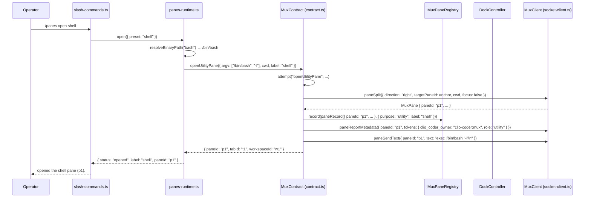

# Domains mux

The mux domain is the pane multiplexing layer that Clio uses to talk to a **herdr** terminal
pane-host server over a Unix domain socket. It owns three concerns: a newline-delimited-JSON
socket client that is the only module in the tree that reads herdr wire shapes, a dock
controller that manages the geometry of Clio's own docked panes (the workers-view and the
files pane), and a Yazi file-manager integration that opens and tracks a Yazi instance in a
herdr pane. The domain enforces a strict **ownership rule**: every mutating method in the
contract checks the pane registry before touching a pane, so Clio never closes, renames,
focuses, reports state on, or sends input to a pane it did not create.

## Ownership and entry points

The domain entry point is `createMuxDomainModule` in
`src/domains/mux/index.ts`, which returns a `DomainModule` whose `createExtension` calls
`createMuxBundle` in `src/domains/mux/extension.ts`. The extension runs the detection ladder
once at boot, builds a `MuxClient` from the socket that answers a `ping`, and hands both to
`createMuxRuntime` in `src/domains/mux/contract.ts`. The runtime exposes a `MuxContract`
(the cross-domain surface) plus `start`/`stop` lifecycle handles that the domain extension
drives.

The runtime is composed only when `src/entry/panes-activation.ts` resolves the activation
ladder to an active rung. The orchestrator dynamically imports `src/entry/with-panes.ts`
(which statically re-exports `createMuxDomainModule` and the interactive glue) only then; a
plain `clio-coder` boot never loads any mux code. A built-graph contract test
(`tests/contracts/instant-shell-import-graph.test.ts`) pins that the default boot chunk
carries no mux domain code.

### Pane registry: the ownership gate

`createPaneRegistry` in `src/domains/mux/pane-registry.ts` holds an insertion-ordered `Map`
of `MuxPaneRecord` entries keyed by pane id. Every mutating path in `contract.ts` asks the
registry first:

- `closePane` calls `registry.owns(paneId)` and returns `false` if the registry does not
  hold the pane.
- `focusPane`, `zoomPane`, and `closePane` all check `registry.owns` before touching the
  wire.
- `reportSelf` writes to Clio's own hosting pane without a registry check because that pane
  is Clio's own, not one it created for the user.

The registry is fed by `openUtilityPane` (which calls `registry.record` after a successful
split), by `adoptPane` (which records a pane carried over from a previous session), and by
`forget`/`reconcile` on `pane.closed`/`pane.exited` events and after a reconnect. The
`pane.moved` event is handled specially: herdr rewrites the pane id on a move, so the
contract's `onEvent` handler forgets the old id and re-records the new one, preserving
ownership across the user's reorganization.

### Detection ladder

`detectMux` in `src/domains/mux/detect.ts` implements the three-rung capability ladder:

1. **`off`**: `HERDR_ENV` is not set or the user chose `off`. No file descriptor is opened.
2. **`embedded`**: refused as `none` with `refused: true` because embedded pane hosting is
   not implemented. The detection carries the reason "embedded pane hosting is not
   implemented; use auto or guest".
3. **`guest`**: requires `HERDR_ENV=1`, a connectable socket, and a `ping` answered inside
   one second. Socket candidates are resolved in the order `HERDR_SOCKET_PATH`, then
   `$XDG_CONFIG_HOME/herdr/sessions/$HERDR_SESSION/herdr.sock`, then
   `$XDG_CONFIG_HOME/herdr/herdr.sock`.

The `MuxDetection` result carries `self` (Clio's own pane location from
`HERDR_WORKSPACE_ID`/`HERDR_TAB_ID`/`HERDR_PANE_ID`) and the live `MuxClient` from the
ping, so the caller inherits a warm socket rather than reconnecting.

## The herdr socket client

`createMuxClient` in `src/domains/mux/socket-client.ts` is the only module that reads herdr
wire shapes. It exposes a `MuxClient` interface covering discovery (`ping`, `snapshot`,
`paneCurrent`, `paneList`), pane control (`paneSplit`, `paneClose`, `paneRename`,
`paneLayout`, `paneFocus`, `paneZoom`, `paneSendText`, `paneReportAgent`,
`paneReportMetadata`), layouts (`layoutExport`, `layoutSetSplitRatio`), worktrees
(`worktreeList`, `worktreeCreate`, `worktreeOpen`, `worktreeRemove`), and notifications
(`notificationShow`).

The client uses two connection kinds:

1. **One connection per request.** herdr's `handle_connection` reads exactly one request
   line, writes the response, and closes. Each call gets a monotonic id and checks the
   echoed id. A call with no response inside its budget rejects with
   `MuxRequestTimeout`. Connect failures back off with a capped exponential delay
   (`DEFAULT_BACKOFF`: 250ms initial, 5000ms max, factor 2).

2. **One dedicated connection per `events.subscribe` stream.** herdr acknowledges once and
   then pushes event lines forever. After a subscription reconnect the client refetches
   `session.snapshot` and hands it to the resync handler.

All wire shapes are mapped into the Clio types from `types.ts` by reader functions
(`readPane`, `readTab`, `readSnapshot`, `readTabGeometry`, `readLayoutTree`, etc.) that
throw `MuxError("protocol", …)` on missing required fields. Unknown fields are ignored,
which is herdr's stated forward-compatibility rule.

### Protocol floors

`protocol.ts` defines `MUX_METHOD_MIN_PROTOCOL`: a record mapping gated wire methods to
the minimum herdr protocol version that supports them. Notification, pane-control, layout,
and worktree methods require protocol 17; worktree methods require protocol 10.
`muxSupportsMethod` returns `false` for a `null` server (detection never completed a
handshake), which is the `none` rung. The contract checks floors before calling gated
methods: `focusPane` requires `pane.focus`, `notify` requires `notification.show`,
`worktreeCreate` requires `worktree.create`, etc. Below the floor the method degrades to
the documented fallback (e.g. `null` for `worktreeCreate`, `false` for `worktreeRemove`).

### Error classification

`types.ts` defines `MuxErrorKind` and `muxErrorKind` to classify server error codes into
Clio failure kinds. The mapping handles `agent_blocked`, `agent_prompt_stalled`,
`feature_disabled`, `invalid_params` (including `invalid_request`), and `not_found`, with
suffix and prefix fallbacks. Anything unmatched stays `unknown`, carrying the server's raw
code through untouched.

## The dock controller

`createDockController` in `src/domains/mux/dock-controller.ts` owns the geometry and
lifecycle of Clio's two managed dock slots: `workers` (to the right of the anchor) and
`files` (below it). The controller owns geometry only; ownership stays in the pane
registry and error swallowing stays in the contract's `attempt` wrapper.

### Dock specifications

`DOCK_SPECS` is a fixed record:

| Slot | Direction | Default share | Min cells |
|------|-----------|---------------|-----------|
| `workers` | `right` | 0.34 | 48 |
| `files` | `down` | 0.3 | 12 |

`DOCK_MAX_SHARE` is 0.5: a dock may never take more than half the axis, whatever the share
asks. `SHARE_EPSILON` is 0.02: observed-vs-applied share differences below this are
rounding, not a user drag.

### Reconciliation logic

Three rules run through the reconciliation:

1. **A user action is a decision.** A resize observed via `layout.updated` that does not
   match what Clio last applied becomes the new target. A closed dock stays closed. A
   moved dock is followed to its new id.

2. **Clio's own corrections must not read as user actions.** Every applied share is
   remembered (`lastAppliedShare`) and an observation matching it (or the target) within
   `SHARE_EPSILON` is a no-op.

3. **Opening never steals focus.** `pane.split` is always called with `focus: false`.
   Focus and zoom live on the contract and only ever run on explicit request.

### Open flow

`open` first checks if the slot already has a pane (idempotence). If not, it reads the
anchor's rect from `paneLayout`, calls `planDockOpen` to decide whether the dock fits and
with what split ratio, and then calls `paneSplit` with `targetPaneId` set to the anchor.
After the split, one converge pass re-reads the layout and applies a corrected ratio if
the dock landed below its cell floor. Refusal happens in `planDockOpen` before any split
reaches the wire, so a too-small terminal never flashes a sliver pane.

### Event handling

The contract's `onEvent` handler feeds the dock controller:

- `layout.updated`: `docks.noteLayoutUpdated(geometry)` updates target shares.
- `pane.moved`: `docks.notePaneMoved(previousPaneId, paneId, tabId)` follows the dock to
  its new id.
- `pane.closed`/`pane.exited`: `docks.notePaneGone(paneId)` removes the dock state.

## The Yazi integration

The Yazi file manager runs in a herdr pane as a "companion" (persistent, follows Clio's
cwd) or a "chooser" (one-shot selection). The integration lives in
`src/domains/mux/yazi/`:

- **`session.ts`**: `createYaziSession` opens a Yazi process in a mux pane. It resolves
  the `yazi` and `ya` binaries through the toolchain ladder, generates a managed profile
  if requested, creates transport files (`.stream`, `.chooser`, `.cwd`) under
  `<cache>/yazi/sessions/`, and calls `mux.openUtilityPane` with the Yazi argv. In
  companion mode it starts a `YaziEventStream` that polls the stream file for `cd` and
  `clio-coder-pick` DDS events. In chooser mode it polls the chooser file for paths.
  Transport files are removed on close and swept if stale (older than 24 hours).

- **`profile.ts`**: `ensureYaziProfile` materializes a deterministic Yazi profile
  (yazi.toml, keymap.toml, theme.toml, init.lua, and a vendored `git.yazi` plugin) under
  `<cache>/yazi/profile/`. The profile is stamped with yazi version, Clio version, ya path,
  and SHA-256 hashes of the asset tree and theme. Regeneration happens only when the stamp
  changes. A scratch HOME is used to validate the profile with `yazi --debug` before
  promoting it.

- **`event-stream.ts`**: `createYaziEventStream` is a poll-tail reader for a bounded DDS
  stdout file. It parses `cd` events (which carry the new cwd and the Yazi instance id)
  and `clio-coder-pick` events (which carry a list of paths). The stream stops on
  `pane-gone`, `file-missing`, or `size-cap` (default 1 MiB).

- **`theme.ts`**: `renderYaziTheme` and `renderHerdrThemeBlock` generate TOML theme
  blocks from Clio's color tokens.

The `createYaziSession` function uses `dock: { slot: "files" }` when calling
`mux.openUtilityPane`, which routes through the dock controller. Below the layout tier
(protocol < 17) the dock degrades to a plain split.

## Control flow: opening a utility pane

The end-to-end flow for `/panes open shell`:



Key points in the flow:

- **Preset probing before split**: `panes-runtime.ts` probes the binary through the
  toolchain ladder before calling `openUtilityPane`. A missing binary returns a
  `missing-binary` result without ever splitting a pane.

- **Shell-quoting**: `contract.ts` shell-quotes each argv element with POSIX single-quoting
  (`'…'` with `'` escaped as `'\''`) and sends the command via `paneSendText` as
  `exec <argv>\n`. The `exec` replaces the shell so the pane exits with the program and
  emits `pane.exited` for reconciliation.

- **Owner token**: every Clio-created pane carries `clio_coder_owner: clio-coder:mux` and
  `role: <purpose>` metadata tokens, so `adoptPane` can find surviving panes after a
  restart and `clio-coder doctor` can find orphans.

- **Best-effort contract**: the `attempt` wrapper catches all errors and returns the
  fallback value. A mux failure never fails a dispatch.

## Ownership boundaries and lifecycle

### The ownership rule in code

Every mutating method in `contract.ts` begins with an ownership check:

```typescript
// closePane
if (!registry.owns(paneId)) return false;

// focusPane
if (!registry.owns(paneId)) return false;

// zoomPane
if (!registry.owns(paneId)) return false;
```

The only documented exception is `reportSelf`, which writes to Clio's own hosting pane
(`detection.self.paneId`) without a registry check. This is the pane Clio runs in, not
one Clio created for the user.

### Lifecycle ordering

1. **Detection** (`detectMux`) runs once at boot, before any panes module loads.
2. **Runtime creation** (`createMuxRuntime`) builds the registry, dock controller (if
   protocol ≥ 17 and an anchor pane exists), and the contract object.
3. **Subscription** (`runtime.start`) subscribes to `pane.closed`, `pane.exited`, and—if
   docks are active—`pane.moved` and `layout.updated`. The `onResync` handler reconciles
   the registry against a fresh snapshot after any reconnect.
4. **Shutdown** (`runtime.stop`) closes the subscription, clears handlers, closes all dock
   panes, and closes the client. Docks close with the session; unmanaged utility panes
   stay open (policy #272).

### Degrade and retry

The `attempt` wrapper tracks health: a transport or timeout error sets `healthy = false`
and a cooldown (`DEGRADE_COOLDOWN_MS` = 5000ms) before probing again. The `usable()`
predicate checks `stopped`, `client !== null`, `detection.mode !== "none"`, and the
health/cooldown state. Below the cooldown, all methods return their fallback without
touching the socket.

## Extension seams

### Adding a new preset

Presets are defined in `PANES_PRESETS` in `src/domains/mux/operations.ts`. To add one:

1. Append an entry to `PANES_PRESETS` with `id`, `binary`, `summary`, and `installHint`.
2. The `PanesPresetId` type and `PANES_PRESET_IDS` derive automatically.
3. `panes-runtime.ts` `presetArgv` needs a branch for the new preset (for `shell` it
   returns `[binaryPath, "-l"]`; for `logs` it returns `[binaryPath, "-n", "200", "-F",
   journalPath]`; the new preset returns its argv).
4. `panes-tool-surface.ts` automatically picks up the new id in the `preset` enum.

### Adding a new wire method floor

To gate a new herdr method on a protocol floor:

1. Add the method name to `MuxGatedMethod` in `src/domains/mux/protocol.ts`.
2. Add the floor to `MUX_METHOD_MIN_PROTOCOL`.
3. Check `muxSupportsMethod(detection.server, "<method>")` in the contract before calling.

### Adding a new dock slot

To add a third dock slot:

1. Add an entry to `DOCK_SPECS` in `dock-controller.ts` with `slot`, `direction`,
   `defaultShare`, and `minCells`.
2. The `DockSlot` type and `bySlot` map derive from the record key.
3. `contract.ts` `openUtilityPane` routes `request.dock.slot` to `docks.open`.

### Yazi profile customization

The Yazi profile is regenerated only when the stamp changes. To customize the profile:

1. Modify the assets in `src/domains/mux/yazi/assets/` (yazi.toml, init.lua, plugins/).
2. The `assetSha256` in the stamp changes, triggering regeneration on next open.
3. `theme.toml` and `keymap.toml` are rendered from Clio's tokens at generation time.

## Focused tests

### `tests/contracts/panes-tool.test.ts`

This test drives the `panes` tool through the session registry over a fake mux that
records every request. It demonstrates:

- **One pane per preset**: a second `/panes open shell` focuses the existing pane instead
  of splitting again. The test asserts `f.calls` equals
  `["open:shell:/bin/bash -l:/workspace", "focus:p1", "close:p1"]`.
- **Refusal of argv**: `{ action: "open", preset: "shell", argv: ["rm", "-rf", "/"] }`
  returns an error before the fake mux sees it. `f.calls` remains empty.
- **Missing binary**: with `bash: null`, the open returns a `missing-binary` error with
  the install hint, and `f.calls` remains empty.
- **Watch pane**: attaching a `PanesWatchController` and calling `show` with a matching
  agent id routes through the controller, returning `watching` with the run id.

### `tests/extended/panes-watch.test.ts`

This test drives the watch pane through the **real socket client** (a live `createMuxClient`
talking to a `node:net` server) and the real mux runtime. It demonstrates:

- **Structured error preservation**: when the fake herdr server returns a structured
  error (`{ code: "layout_capacity", message: "tab limit reached: 8 panes" }`), the watch
  result preserves the kind, code, method, and message. The test verifies five error
  shapes: structured, empty, code-only, literal unknown message, and literal unknown code
  and message.
- **Refusal isolation**: a structured refusal (e.g. `feature_disabled`) is kept separate
  from a later independent successful watch. The test asserts `f.calls` is empty after
  the refusal, proving no wire request was sent.

### `tests/extended/panes-files.test.ts`

This test drives the files pane surface through the real Yazi session and bridge. It
demonstrates:

- **Preset aliasing**: `resolvePanesPresetId("yazi")` returns `"files"` (the alias from
  0.4.0/0.4.1).
- **Dock geometry**: opening the files pane with `dock: { slot: "files", share: 0.3 }`
  routes through the dock controller. The test verifies the dock's `targetShare` is
  clamped and the `paneSplit` call carries the correct ratio.
- **Transport file lifecycle**: `sweepStaleTransportFiles` removes `.stream`, `.chooser`,
  and `.cwd` files older than 24 hours.

### `tests/contracts/legacy-naming-retired.test.ts`

This test verifies the ownership token:

- A new pane carries only `clio_coder_owner: clio-coder:mux` (the canonical token),
  never `clio_owner: clio:mux` (the released token).
- `adoptPane` still finds and adopts a pane carrying the released `clio_owner` token, so
  a pane an older 0.4 session left open is found and cleaned up.

### `tests/extended/pane-remedies.test.ts`

This test verifies detection remedies:

- **Embedded refusal**: `detectMux({ enabled: "embedded", env: {} })` returns
  `mode: "none"`, `refused: true`, and the reason "embedded pane hosting is not
  implemented; use auto or guest".
- **Files pane disabled**: with `interface.panes.files.enabled: false`,
  `panes.open({ preset: "yazi" })` returns a refusal naming the canonical key.
- **Slash command inactive**: running `/panes` without the panes extension prints the
  notice "panes are inactive: this session started without them. Restart with
  `clio-coder --with-panes`".

## Things to watch when editing

1. **The ownership check is the first line of every mutating method.** If you add a new
   mutating method to `MuxContract`, the first thing it must do is
   `if (!registry.owns(paneId)) return false;` (or equivalent). The test
   `tests/contracts/legacy-naming-retired.test.ts` pins that the released token is never
   written, only read.

2. **`pane.split` always uses `focus: false`.** The dock controller and the contract's
   `openUtilityPane` both pass `focus: false`. If you change this, the dock will steal
   focus from the operator's shell on every open, violating rule 3 of the reconciliation
   logic.

3. **The `attempt` wrapper is the only error-swallowing layer.** Every method in
   `contract.ts` routes through `attempt`. If you add a new method that talks to the
   socket, wrap it in `attempt` with the appropriate fallback. The `degrade` function
   inside `attempt` sets `healthy = false` and a cooldown on transport/timeout errors.

4. **Protocol floors are checked against `detection.server`, not the wire response.** The
   `muxSupportsMethod` function takes the server info from the handshake, not the current
   response. If a server updates its protocol mid-session, the floor check will not see
   it until the next detection.

5. **The Yazi profile is validated with `yazi --debug` before promotion.** `ensureYaziProfile`
   spawns `yazi --debug` in a scratch HOME and checks the output for config error markers.
   If you change the profile assets, test with the actual Yazi binary, not just the TOML
   parser. The test `tests/contracts/doctor-yazi-repair.test.ts` pins that a generation
   failure is retained until a profile successfully regenerates.

6. **`exactOptionalPropertyTypes` is on.** When building optional request objects (e.g.
   `MuxSplitRequest`, `MuxOpenUtilityPaneRequest`), use the spread pattern
   `...(x !== undefined ? { x } : {})` rather than `x: undefined`. This is enforced by
   the TypeScript compiler and the boundary checker.

7. **The dock controller never caches the split path.** `applyShare` re-derives the split
   path from a fresh `layoutExport` on every resize. If you add caching, the path may go
   stale after a user move, and the share will be applied to the wrong split.

8. **Transport files are per-session and worthless once the session ends.** `createYaziSession`
   removes `.stream`, `.chooser`, and `.cwd` files on close. If you add new transport
   files, add them to the `removeTransportFiles` cleanup and the `sweepStaleTransportFiles`
   regex, or `<cache>/yazi/sessions` will grow without bound.

9. **The panes tool has no `argv` field and never will.** The tool's schema in
   `panes-surface.ts` has no `argv` parameter. `panes-tool.ts` explicitly refuses any
   request that contains an `argv` field. If you need to run a command in a pane, use the
   `/panes open <command>` slash command, not the tool.

10. **The `role` token is what `adoptPane` finds after a restart.** `openUtilityPane`
    writes `tokens: { role: token(purpose) }` alongside the owner token. `adoptPane`
    scans a fresh snapshot for panes carrying Clio's owner token and a matching `role`
    token. If you change the purpose system, update the adoption path or surviving panes
    will not be re-adopted.

<!-- clio-coder:wiki unresolved sources: tests/extended/pane-remedies.test.ts -->
