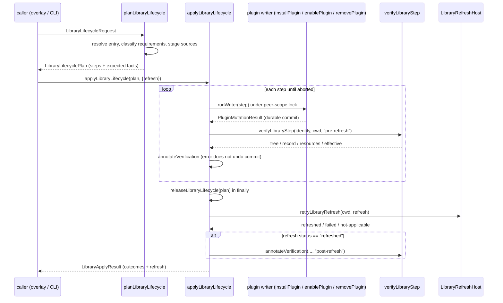

# Domains resources

## What this area does

`src/domains/resources` is the library of distributable, loadable resources Clio can discover and reason about: skills, prompt templates, agent recipes, and fleet contracts, together with the package machinery that installs, pins, validates, and removes them. The domain does two kinds of work that are kept separate. The first is a runtime read surface: it discovers what skills and prompt templates exist on the machine, resolves collisions between duplicate names, and renders the model-facing skills listing. The second is a mutation surface: it plans library operations as reviewed, per-package steps, applies them through the shared plugin writers, and reads the result back to prove what actually changed.

The read surface is exposed as a domain contract and is consumed by the context tool and the CLI. The mutation surface is consumed by the `/library` overlay and the `clio-coder library` subcommand. The two never share mutable state; the inventory is a body-free projection that composes the existing readers and never fetches, executes, reloads, or writes.

## Ownership and entry points

The domain is registered as a `DomainModule` in `src/domains/resources/index.ts`. The constant `ResourcesDomainModule` carries `ResourcesManifest` and `createResourcesBundle`; the function `createResourcesDomainModule(options)` returns a module bound to a `ResourceLoaderOptions` so a caller can inject the cwd and per-call skill options.

The manifest in `src/domains/resources/manifest.ts` declares `name: "resources"` and `dependsOn: ["config"]`. The dependency is real: `createResourcesBundle` in `src/domains/resources/extension.ts` reads the `config` contract to pull `integrations.projectResources.trustProjectImports` and folds it into the skill loader options through `skillOptions`.

The contract itself is `ResourcesContract` in `src/domains/resources/contract.ts`. It exposes six operations: `skills(cwd)`, `parsePendingSkillRequests(text, cwd, options)`, `prompts(cwd)`, `promptsForDisplay(cwd)`, `expandPromptTemplate(text, cwd)`, and `reload()`. The runtime behind it is `createResourcesLoader` in `src/domains/resources/loader.ts`.

Key modules and their symbols:

- `src/domains/resources/library.ts`: discovery and single-package install planning. `discoverLibrary`, `resolveLibraryRequirements`, `classifyLibraryRequirements`, `planLibraryInstall`, `commitLibraryInstallPlan`, `installLibraryPlan`, `resolveLibraryPackage`, `planLibraryUpdate`, `syncLibrary`, and the state predicates `libraryEntryInstalled`, `libraryEntryPin`, `libraryEntryDrift`.
- `src/domains/resources/library-actions.ts`: the lifecycle. `planLibraryLifecycle`, `applyLibraryLifecycle`, `verifyLibraryStep`, `releaseLibraryLifecycle`, `retryLibraryRefresh`, `libraryImportOutcome`, and the `LibraryOperation` union `"install" | "update" | "enable" | "disable" | "remove"`.
- `src/domains/resources/library-inventory.ts`: the body-free projection. `readLibraryInventory`, `inspectLibraryCopy`, `classifyLibraryOrigin`, `libraryCopyState`, `libraryResourceKey`, `parseLibraryResourceKey`, and `LIBRARY_INVENTORY_LIMITS`.
- `src/domains/resources/library-validation.ts`: `validateLibraryPackage`, which scans one installed copy's skills, prompts, agents, fleets, and declared components.
- `src/domains/resources/library-types.ts`: the shared kind taxonomy. `LIBRARY_KINDS`, `LIBRARY_RESOURCE_KINDS`, `LibraryPackageEntry`, and `LibraryProvidedResource`.
- `src/domains/resources/skills/loader.ts`: skill discovery. `loadSkills`, `defaultSkillRoots`, `modelVisibleSkills`, `skillCatalogValidity`, `parsePendingSkillRequests`, and the constants `SKILL_PRECEDENCE`, `MAX_SKILL_BYTES`, `SKILL_ACTIVATION_BODY_CAP_BYTES`.
- `src/domains/resources/skills/catalog-view.ts`: `buildSkillCatalogView`, the model-facing listing with query filtering, ranking, and byte-budget fitting.
- `src/domains/resources/prompts/loader.ts`: prompt discovery. `loadPromptTemplates`, `expandPromptTemplateInput`, `parsePromptCommand`, `promptTemplateDisplayText`.
- `src/domains/resources/collision.ts`: `resolveResourceCollisions`, the shared name-collision resolver.
- `src/domains/resources/common-loader.ts`: `defaultScopedResourceRoots`, `splitYamlFrontmatter`, `sourceInfoForRoot`, and `COMPAT_RESOURCE_PRECEDENCE`.
- `src/domains/resources/package-references.ts`: `resolvePackageReferences` and `resolvePackagePathReference`, which expand `${pluginRoot}` and `${component:…}` markers inside plugin-owned bodies.

## The runtime contract and how a caller uses it

The context tool is the principal read-side caller. In `src/tools/context/index.ts`, `runSkillsScope` composes the domain in four steps. It calls `loadSkills({ cwd, ...deps.getSkillLoaderOptions?.() })`, filters the result with `modelVisibleSkills(list.items)`, pulls disk install state with `installedSkillPackages(list.items, cwd, trust)`, and finally renders the view with `buildSkillCatalogView({ skills: visible, packages, marketplace, drifted, marketplaceOffered, modelActivation, query, limit, offset, capBytes, relevance })`. The reservation's `callCapBytes` is forwarded as the byte budget, and the view's `nextOffset` drives the tool's continuation notice.

`createResourcesLoader` in `src/domains/resources/loader.ts` is the seam that turns the loaders into a contract. It threads `cwd` and the optional `skills()` accessor through every call. The loader shares one trust decision across kinds: `promptOptions` copies `trustProjectCompatRoots` from the skill options, so a project compatibility root is the same trust decision whichever kind is read out of it. The `promptsForDisplay` path passes `verifyPluginTrees: false` to `loadPromptTemplates`, which takes package roots from the committed plugin snapshot without re-verifying each tree; expansion never passes it, so a drifted or revoked template can show but never runs.

Both `parsePendingSkillRequests` and `expandPromptTemplate` short-circuit before paying for a full resource walk. The loader checks `parseSkillCommand(text) === null` first, and `parsePromptCommand(text) === null` for prompts, so an ordinary submit that names no slash command does not list the whole catalog.

## Skills: discovery, precedence, and the model-facing view

`loadSkills` in `src/domains/resources/skills/loader.ts` is wrapped by `withPluginDiscoveryPass` (imported from `src/domains/plugins/discovery-pass.ts`), so one load verifies each installed plugin tree once for the whole pass. Inside the pass, `loadSkillsInPass` gathers candidates from every root, dedupes canonical file paths, resolves name collisions, and sorts winners by name.

The default root set is built by `defaultSkillRoots` and is lowest-to-highest precedence:

1. Clio's own source-checkout self-development skills, when the cwd is a Clio repo and the skill is not already installed (precedence `SKILL_PRECEDENCE.package - 1`).
2. Enabled plugin skill roots, precedence 10.
3. User compatibility roots, one per interop agent kind, precedence 20, `trusted: false`.
4. The Clio user root `<config>/skills`, precedence 30, trusted.
5. Project compatibility roots, precedence 40, `trusted: false`.
6. The Clio project root `.clio-coder/skills`, precedence 50, trusted.

Compatibility roots come from `INTEROP_AGENT_KINDS` in `src/domains/interop/registry.ts` rather than a local list, so adding an agent to that table teaches every reader about it at once. Explicit paths load at precedence 60 (`SKILL_PRECEDENCE.cli`).

Each `SKILL.md` is loaded by `loadSkillFile`. A file over `MAX_SKILL_BYTES` (1 MiB) is refused because `loadSkills` runs on every `context(scope="skills")` call and reads and hashes each file whole. A file over `SKILL_ACTIVATION_BODY_CAP_BYTES` (50 KiB) loads but carries a warning that activation delivers at most that much. Missing description is the only hard rejection; every other problem loads with a warning. The skill's `hash` is the sha256 of the raw file; `normalizedHash` is the sha256 after stripping install-lifecycle provenance frontmatter via `normalizedSkillHash` in `src/domains/resources/skills/content-hash.ts`, so an installed copy compares equal to its audited source regardless of install timestamps.

Name collisions are resolved by `resolveSkillCollisions`. `compareSkillCandidates` ranks by trust first, then by whether the skill is owned (`plugin`, `clio-coder`, `cli`, or `path`), then by `precedence`, then by the interop registry's own agent rank, then by path. This ordering means an untrusted compatibility copy cannot hide an admitted native skill and then disappear from model-visible discovery. `modelVisibleSkills` filters to `skill.trusted && !skill.disableModelInvocation`.

`skillCatalogValidity` is the single rule `clio-coder library validate` applies. A scanned file that produced no loaded skill is malformed, a collision drops a skill, and any hard error fails; benign warnings attach to a file that still loaded, so they do not fail validation. The reasons are ordered `load-error`, `collision`, `unloadable-file`, `no-skills`.

`buildSkillCatalogView` in `src/domains/resources/skills/catalog-view.ts` renders the model-facing listing. It guarantees two properties. First, an unfiltered, uncut view is byte-identical to the renderer it replaced, because narrowing and fitting are caller opt-ins and a ranked or clipped default would decide for the model which skills it is allowed to know about. Second, the footer always survives: the footer is the reply protocol, the one line a model acts on, so it is reserved first and rows are fitted into what is left. Rows are built in four kind blocks (`ready`, `session`, `package`, `marketplace`) in that order, which is also the order overflow drops them. A query runs `selectRows`, which tries lexical `all` matching and falls back to `any`, reporting the chosen `matchMode`. Ranking runs after the query and never removes a row. Bisection then finds the largest row count that fits `capBytes`; a zero-row page is measured separately because it carries a different message than a one-row page.

## Prompt templates

`loadPromptTemplates` in `src/domains/resources/prompts/loader.ts` discovers prompt roots with `defaultPromptTemplateRoots`, which shares `defaultScopedResourceRoots` from `src/domains/resources/common-loader.ts` and appends user and project compatibility roots from `INTEROP_AGENT_KINDS`. Template names are the root-relative path with colons replacing separators, so a file in a subdirectory becomes a namespaced command. A template that cannot run because a load-time failure left it with no usable body is still loaded, with `unavailable` set to the reason; invoking it then reports that reason instead of "not a command" (issue #245). `expandPromptTemplateInput` refuses an unavailable template before anything else and before the trust check, because there is no body here to be trusted or untrusted. `display-only: true` templates render locally and send nothing to a model.

## The inventory projection

`readLibraryInventory` in `src/domains/resources/library-inventory.ts` is the one body-free projection of three separate facts: catalog packages (install targets), installed scoped copies (state), and actual recipe resources (what the loaders really see). It composes the existing readers and never fetches, executes, reloads, or writes. The module docblock states it as a rule: the package and recipe readers never call back into this module.

The inventory is bounded by `LIBRARY_INVENTORY_LIMITS`. The `Bounded` class is an append-only list that refuses rows past its cap, so traversal, not a final slice, enforces the bound. The `truncated` flags on the result tell a consumer when the evidence is partial. `readLibraryInventory` is wrapped in `withPluginDiscoveryPass` so one inventory read verifies every plugin tree once.

`classifyLibraryOrigin` is the single rule shared by CLI, context, and UI that turns evidence into a `LibraryOrigin` and an optional `format`. It reads discovery, install, and adoption evidence only; author metadata never reaches it. `libraryCopyState` is the one copy-state projection shared with lifecycle verification, mapping an `InstalledPlugin` to `"loadable" | "disabled" | "shadowed" | "invalid" | "incompatible" | "damaged"`.

`libraryResourceKey` builds a key of the form `${kind}:${name}@${sourceId}#${relativePath}`, and `parseLibraryResourceKey` and `keyMatches` round-trip and compare it. The relative path is resolved against a chain of anchors (owner root, then core package root, then config dir, then project cwd, then home) so that two same-name files under one root stay distinct.

## Library lifecycle

The mutation surface is a reviewed plan applied per package above the atomic package writers. `planLibraryLifecycle` in `src/domains/resources/library-actions.ts` builds a `LibraryLifecyclePlan` with one step per package, and `applyLibraryLifecycle` applies the steps in order. Planning stages sources and writes nothing; apply rechecks reviewed facts inside each writer's lock, keeps every committed write when a later step fails, releases every staged source, and reports disk/state verification, actual recipe admission, and host refresh as separate facts.

The planning branch depends on the operation. For `install`, it resolves the package, classifies requirements, and refuses if a requirement is absent from every index or is a cycle. Unsatisfied dependencies are staged as their own install steps before the target, and `earlier` is threaded through `expectedFor` so a plan cannot stale itself. For `update`, it resolves the installed entry and calls `planLibraryUpdate`, refusing on local changes unless `force` is set and refusing interop packages that require a new reviewed adoption. For `enable`, `disable`, and `remove`, it projects `newlyBrokenDependents` and refuses when a change would break a dependent that was not already broken.

Staged sources are tracked by plan id in the module-level `staged` Map. `retain` stores them at plan time, and `releaseLibraryLifecycle` releases every staged source and writes nothing; it is idempotent and runs in the `finally` of `applyLibraryLifecycle`.

`applyStep` holds the peer-scope lock when the peer plugin directory exists, so a cross-scope operation cannot race with another scope's writer. The writer error codes `stale_plan`, `locked`, `refused`, `verification`, and `writer` map to a `next` hint through `nextFor`. A `PluginWriterRefusal` with code `dependents` becomes a `refused` outcome. After a durable commit, `annotateVerification` reads the copy back with `verifyLibraryStep`; a read-back failure attaches a `verification` error but never turns the commit into a failed step.

`verifyLibraryStep` reads back one copy as four facts: the tree (`present`, `absent`, or `changed` against the recorded digest), the install record (`recorded`, `absent`, or `unreadable`), the copy state, and the actual recipe admission read from `readLibraryInventory` filtered to the package's sources. `effective` reports the surviving effective copy across scopes.

After commits, `applyLibraryLifecycle` calls `retryLibraryRefresh` once. A refresh failure does not undo the commits; it is reported separately. After a successful refresh, each committed outcome is re-annotated with `post-refresh` evidence.

## Validation

`validateLibraryPackage` in `src/domains/resources/library-validation.ts` is the explicit, deep read of one installed copy. It reads a disabled, shadowed, or damaged copy too, which the runtime loaders never do; it is the inspection the listing deliberately avoids. It first reads the plugin manifest, then scans the declared resource roots for skills (through `loadSkills` and `skillCatalogValidity`), prompts (through `loadPromptTemplates`), agents (parsing each recipe and checking bound skills stay inside the plugin), and fleets (parsing the contract and collecting prerequisites). It then verifies declared components and reports prerequisites such as commands and agents a fleet step requires.

## Extension seams

A new library package kind is added in `src/domains/resources/library-types.ts` by extending `LibraryEntryKind` and `LIBRARY_KINDS`, and, for a resource kind, `LibraryResourceKind` and `LIBRARY_RESOURCE_KINDS`. The inventory gains a reader for it in `readLibraryInventoryInPass`, and the validation gains a scan in `validateLibraryPackage`. The lifecycle does not need a new operation for a new kind; it addresses packages by `kind:name` ref.

A new agent compatibility root is taught to the skills and prompts loaders by adding the agent to `INTEROP_AGENT_KINDS` in `src/domains/interop/registry.ts`; the loaders read that table, so there is no second list to update in the domain.

A new library operation is added to the `LibraryOperation` union in `src/domains/resources/library-actions.ts` and branched in `planLibraryLifecycle`; the writer dispatch is in `runWriter`.

## Enforced boundaries and lifecycle ordering

The discovery pass enforces that each installed plugin tree is verified once per synchronous pass. `withPluginDiscoveryPass` in `src/domains/plugins/discovery-pass.ts` keeps a module-level `active` pass; `passPluginCandidate` and `passPluginSnapshot` memoize within it. The body must be synchronous; an awaited continuation runs after the pass closes and reads from disk again. This is why `loadSkills` and `readLibraryInventory` wrap their bodies in it.

The peer-scope lock enforces cross-scope ordering during a lifecycle write. `applyStep` holds the peer's lock via `withPluginScopeLock` when the peer directory exists, so an `install` or `remove` on one scope cannot race with another scope's writer for the same package.

The staged-source registry enforces that a planned source is either applied or released. `retain` stores it, `runWriter` fetches it by plan id, and `releaseLibraryLifecycle` in the `finally` of `applyLibraryLifecycle` releases any that were not applied.

Skill containment is enforced by `escapesContainment` in `src/domains/resources/skills/loader.ts`. A discovered entry whose real path leaves the root's containing scope is refused, because the escape is invisible in every path the operator is later shown. The anchor is the workspace for a project root and the home directory for a user root; `strictContainment` additionally forbids relocating the containment through a symlink.

## Focused tests

`tests/contracts/skills-catalog-view.test.ts` asserts the model-facing listing. It carries `renderSkillsListBeforeChange`, a verbatim copy of the previous `renderSkillsList` from `src/tools/context/index.ts`, as the oracle, and asserts the new `buildSkillCatalogView` output is byte-identical to it for the default unfiltered view. The test fixtures build skills with `source: "clio-coder"`, `scope: "user"`, `trusted: true`, and marketplace entries with `origin: "catalog"`. It exercises the query filter, the `matchMode`, and the byte-budget fitting that replaced whole-string head truncation.

`tests/contracts/skill-install.test.ts` asserts the skill loader's boundaries. Its cases include `refuses repository sources that escape their clone`, `installs a complete directory atomically and records content provenance`, `preserves the installed copy when a forced replacement is invalid`, `loads an explicit skill path and carries it through request and activation provenance`, and `loads a trusted manual-only skill only after the operator names it`.

`tests/contracts/prompt-skill-policy.test.ts` asserts that compiled skill instructions agree with actual session-skill admission at each autonomy level. It builds a fixture skill with `allowed-tools: [read]` and drives the context tool with `getSkillLoaderOptions: () => ({ disableDiscovery: true, explicitSkillPaths: [path] })`, then checks `context.run({ scope: "skills", name: "fixture-skill" })` against the autonomy level's activation policy.

`tests/extended/library-lifecycle.test.ts` asserts the lifecycle ordering. The case `retains committed dependency writes, lists unattempted work and refreshes after a partial batch` installs a target with two dependencies, mutates the second dependency's source after review so its writer refuses the pinned digest, and asserts the outcomes are `["committed", "failed", "unattempted"]`, that the first committed dependency is retained, and that refresh runs once after the partial batch. The case `keeps a durable commit when read-back verification fails and still refreshes` corrupts the state file during refresh and asserts the outcome stays `committed` with an `error.code === "verification"`, `verification.record === "unreadable"`, and the committed tree still on disk. The case `fails fast with a locked code while another scope operation holds the peer lock` holds the peer lock and asserts the removal returns `error.code === "locked"`.

`tests/extended/library-inventory.test.ts` asserts the inventory projection. It builds a fixture plugin with one skill, one prompt, and one fleet, and checks the resource counts, the origin classification, and the copy inspection. The cases exercise `duplicateSkill` and `brokenPrompt` options to confirm the inventory reports shadowed and invalid rows.

## Things to watch when editing

- The byte-budget fitting in `buildSkillCatalogView` is monotone only over row counts of one or more. A zero-row page is not on that curve because it alone carries the "this row is too large, open it directly" sentence. Changing the scaffolding text or the zero-row message can break the bisection, which starts at `low = 1`.
- The discovery pass is module-level state. `withPluginDiscoveryPass` refuses to nest (`if (active) return body()`), so a synchronous loader called from inside a pass reuses the memo, but any `await` between loaders closes the pass and forces a re-verify. A new loader that reads plugin trees must call `withPluginDiscoveryPass` at its top level or it will re-walk every tree per call.
- `skillCatalogValidity` and the context tool's listing are two callers of the same loaders. A rule that drifts between the terminal and the GUI is worse than no verdict, so keep the verdict in one place. The test `skills-catalog-view.test.ts` pins the default view byte-for-byte; changing section headers, the interop note, or the activation protocol line breaks it.
- Provenance stripping in `normalizedSkillHash` recognizes lifecycle keys both at the top level and one level down inside a top-level `clio-coder:` block, and registry identity (`registry-id`, `registry-url`) is deliberately not stripped. Adding a new install-lifecycle frontmatter key requires adding it to `PROVENANCE_KEYS` in `src/domains/resources/skills/content-hash.ts`, or an install timestamp will read as drift.
- The lifecycle never releases a staged source on a refused plan's step that was never staged. `installStep` calls `retain` only for steps that pass the requirement check, and a refusal before staging pushes a step without a staged source. `runWriter` throws if a plan has no staged source, so keep the refusal path from staging.
- `library-inventory.ts` caps are enforced during traversal by `Bounded.push`. A caller that wants a filtered view must apply the filter before the cap (the code does `if (packageMatches(...) && !packages.push(record)) break`), because a final slice after the cap would drop admitted rows in favor of unadmitted ones.
- The inventory's `keyPath` anchor chain resolves relative paths against owner root first, then core, config, project, and home. A new resource kind that carries a file path must either supply an owner or land under one of those anchors, or it falls back to `path.basename` and loses its relative path.
