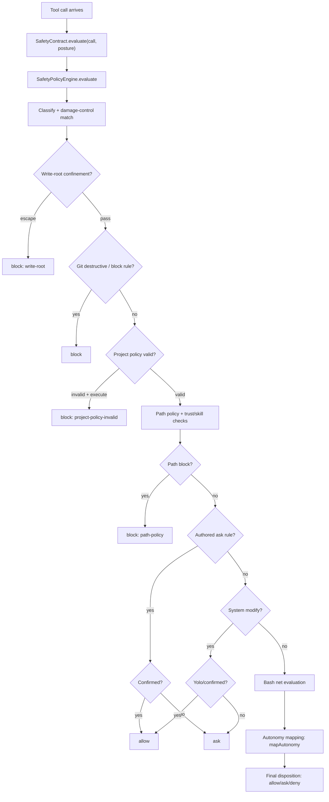

# Domains safety

The safety domain owns every layer of Clio's tool-call safety stack: action classification, damage-control rule matching, path-policy enforcement, project-policy validation, autonomy-level mapping, NDJSON audit recording, the finish-contract completion gate, and the scientific validation contract loader. It composes these into a single `SafetyContract` that the tool registry, the worker subprocess, the ACP delegation mediator, and the Claude SDK tool-safety bridge all consume through one interface.

## Ownership and entry points

The domain module entry point is `SafetyDomainModule` in `src/domains/safety/index.ts`, which exposes `createSafetyBundle` from `src/domains/safety/extension.ts`. The bundle returns a `DomainBundle<SafetyContract>` containing the lifecycle extension (bus subscriptions, audit writer, policy engine) and the contract object that callers depend on.



The `SafetyContract` interface in `src/domains/safety/contract.ts` declares the full public surface:

- `classify(call)` — pure classification, no audit, no bus events.
- `evaluate(call, posture?)` — full evaluation: classify + damage-control match + decision; writes the safety-net audit row and emits `BusChannels.SafetyBlocked` on a block.
- `observeLoop(key, now?)` — loop-detection verdict.
- `scopes` — readonly specs for `readonly`, `workspace`, and `confirmed`.
- `isSubset(worker, orchestrator)` — scope containment check for dispatch admission.
- `policy.metadata(posture?)` — immutable safety policy metadata for receipts and audit replay.
- `audit.recordToolCall(input)` — the registry's hook for autonomy-level final dispositions.
- `audit.recordCompletionContract(input)` — the finish-contract's hook for turn_end decisions.

Key symbols by file:

| File | Key symbols |
|---|---|
| `src/domains/safety/policy-engine.ts` | `createSafetyPolicyEngine`, `SafetyPolicyDecision`, `SafetyPolicyEngine`, `SafetyPolicyEngineOptions`, `BUILTIN_ALLOWLIST`, `TEST_RUNNER_COMMANDS`, `PROJECT_SCRIPT_COMMANDS`, `WRITE_ROOT_REFUSED_TOOLS`, `evaluateBashPolicy`, `evaluateWriteRoots`, `matchesRepositoryCommand` |
| `src/domains/safety/action-classifier.ts` | `classify`, `ActionClass`, `Classification`, `ClassifierCall`, `GIT_DESTRUCTIVE_PATTERNS`, `SYSTEM_MODIFY_PATTERNS`, `SYSTEM_WRITE_ROOT_PREFIXES`, `SYSTEM_WRITE_EXEMPT_PREFIXES`, `normalizeCallPaths` |
| `src/domains/safety/autonomy.ts` | `mapAutonomy`, `AutonomyLevel`, `AutonomyDisposition`, `autonomyFromUserInput`, `AUTONOMY_EXPOSURES` |
| `src/domains/safety/audit.ts` | `openAuditWriter`, `AuditRecord`, `ToolCallAuditRecord`, `buildAuditRecord`, `buildCompletionContractAuditRecord`, `AUDIT_FLUSH_INTERVAL_MS` |
| `src/domains/safety/finish-contract.ts` | `assessFinishContract`, `FinishContractAssessment`, `FinishContractInput`, `recentEntries`, `typedValidationSummary`, `DEFAULT_RECENT_ENTRY_LIMIT` |
| `src/domains/safety/finish-contract-registration.ts` | `createFinishContractRegistration`, `FINISH_CONTRACT_REGISTRATION_ID`, `HIGH_RIGOR_REVALIDATION_MESSAGE` |
| `src/domains/safety/project-policy.ts` | `loadProjectSafetyPolicy`, `LoadedProjectSafetyPolicy`, `ProjectCommandPolicy` |
| `src/domains/safety/validation-contract.ts` | `loadValidationContract`, `parseValidationContractText`, `describeValidationContract`, `ValidationContractLoadResult`, `VALIDATION_CONTRACT_CAPS`, `VALIDATION_CONTRACT_YAML_PATHS` |
| `src/domains/safety/path-policy.ts` | `compilePathPolicy`, `evaluatePathPolicy`, `CompiledPathPolicy`, `PathPolicyDecision` |
| `src/domains/safety/default-path-policy.ts` | `DEFAULT_DAMAGE_CONTROL_PATH_POLICY`, `OPERATOR_PATH_POLICY`, `mergePathPolicyInputs` |
| `src/domains/safety/damage-control.ts` | `match`, `DamageControlRule`, `DamageControlRuleset`, `DamageControlMatch` |
| `src/domains/safety/rule-pack-loader.ts` | `getCachedDefaultRulePacks`, `RulePacks`, `PackId` |
| `src/domains/safety/protected-artifacts.ts` | `extractCommandWriteTargets`, `extractCommandDeleteTargets`, `detectValidationCommand`, `toolMutationPaths`, `scanShellLike`, `scanShellLikeDeep` |
| `src/domains/safety/protected-artifacts-registration.ts` | `createProtectedArtifactsRegistration`, `ProtectedArtifactsRegistration` |
| `src/domains/safety/scope.ts` | `READONLY_SCOPE`, `WORKSPACE_SCOPE`, `CONFIRMED_SCOPE`, `isSubset` |
| `src/domains/safety/loop-detector.ts` | `createLoopState`, `observe`, `LoopDetectorState`, `LoopVerdict` |
| `src/domains/safety/run-effects.ts` | `RunEffects`, `createRunEffectsRecorder` |
| `src/domains/safety/rigor.ts` | `Rigor`, `resolveRigor`, `rigorResolution`, `parseRigorOverride` |

## What this area does

The safety domain separates two orthogonal axes of control:

1. **The safety net** (level-independent): hard blocks and confirm rails that apply at every autonomy level. This axis owns damage-control rule matching (`damage-control.ts`), path-policy enforcement (`path-policy.ts`), project-policy validation (`project-policy.ts`), trust and skill authority checks, and the write-root confinement for worker runs.

2. **The autonomy axis** (level-dependent): an ordered dial (`default` → `yolo`) that controls which action classes trigger the approval flow versus run immediately versus auto-deny. This axis runs *after* the safety net; a net block is final, and the mapping applies only to level-dependent rows that passed the net.

The finish contract and the validation contract are separate subsystems that ride on the same audit ledger and share the same mutation vocabulary (`extractCommandWriteTargets`, `detectValidationCommand`, `toolMutationPaths` from `protected-artifacts.ts`).

## The admission flow

### Entry point: the tool registry

The primary caller is `src/tools/registry.ts:602`. The `admit` function calls `deps.safety.evaluate(call, posture)`, where `posture` is derived from the autonomy level: a one-shot grant sets `"confirmed"`, yolo level sets `"yolo"`, and default sets `undefined`.

```
registry.admit(call)
  → deps.safety.evaluate(call, posture)
    → activePolicyEngine().evaluate(call, posture)   // extension.ts:277
      → createSafetyPolicyEngine().evaluate(call, posture)  // policy-engine.ts:269
```

### The policy engine's evaluation stages

`createSafetyPolicyEngine` in `src/domains/safety/policy-engine.ts:269` returns an object with `evaluate`, `readablePath`, and `metadata`. The `evaluate` method runs through the following stages in order, each of which can short-circuit to a final `block`, `ask`, or `allow`:

1. **Normalize and classify.** `normalizeCallPaths` strips leading `@` and folds Unicode spaces in path arguments; `classify` maps `(tool, args)` to an `ActionClass` (`read`, `write`, `execute`, `dispatch`, `system_modify`, `git_destructive`, or `unknown`).

2. **Damage-control scan.** `damageControlScans(call)` extracts the command string(s) to scan; for content-bearing tools (`Write`, `Edit`, `Artifact`, `Dispatch`, `Tasks`) it scans only the destination path, while for bash and verify it scans the full command plus `shellCommandSegments` and `normalizedGitCommands`. `matchSourcedRule` matches the scanned strings against the base rule pack from `damage-control-rules.yaml`.

3. **Write-root containment.** `evaluateWriteRoots` checks whether a write-class tool's target escapes the permitted `writeRoots`. Under active write-root confinement, execute-class tools (`bash`, `verify`, `run_script`) and `dispatch` are blocked outright (`isWriteConfinementEscape`), because they can mutate the filesystem outside the roots.

4. **Git destructive and block rules.** If the classification or the damage-control match is `git_destructive`, or the match has `block: true`, the call is a hard block. An explicit `ask: true` damage-control rule (`askRule`) is deferred to a later stage.

5. **Project policy validity.** If `.clio-coder/safety.yaml` is invalid and the tool is an execution tool (`bash`, `verify`), the call is blocked with reason `project-policy-invalid`.

6. **Trust and skill authority.** `invokesTrustMutation` detects `config trust` commands. `skillMutationReason` checks whether the command mutates Clio's settings, workspace trust records, or skill roots.

7. **Path policy.** `evaluateProjectPathPolicy` compiles and evaluates the merged path policy (defaults + project + operator) against the call's targets. A block here uses reason codes like `path-policy:zeroAccessPaths` or `path-policy:readOnlyPaths`.

8. **Bash zero-access read scan.** `evaluateBashZeroAccessRead` scans bash command tokens for zero-access paths (e.g., `cat .env`), blocking them. The only carve-out is `grep -sq "^NAME=" <file>` (exit-code-only presence check).

9. **Library confirm.** Managed library changes (`invokesClioSkillMutation`) are confirmed by `confirmed` posture or admitted by `yolo`, otherwise they ask in default.

10. **Authored ask rail.** If `askRule` matched a damage-control rule with `ask: true` and `block` is not true, the confirmed posture allows; otherwise it asks.

11. **System modify confirm.** `system_modify` action class asks in default, allows in yolo and confirmed.

12. **Bash net evaluation.** `evaluateBashPolicy` (policy-engine.ts:805) is the bash-specific net: empty commands, cwd escapes, hidden content (variable substitution, command substitution), project policy commands, `&&` chains, test runners, project scripts, built-in allowlist, and sequencing operators. It returns an `execRecognition` tag (`"recognized"` or `"unrecognized"`) that the autonomy mapping uses.

13. **Read scope escape.** For read-class tools, `readScopeEscape` checks whether the path resolves outside the workspace and outside Clio's own readable roots. The net passes; the `readScope: "outside-workspace"` flag lets the autonomy mapping ask in default.

### The autonomy mapping

After the safety net passes, `src/tools/registry.ts` calls `mapAutonomy` from `src/domains/safety/autonomy.ts`. The function takes `level` (`default` or `yolo`), `actionClass`, and options (`executeRecognized`, `dispatchPlanScale`, `exposure`, `readOutsideWorkspace`). The mapping:

- `git_destructive` → `"deny"` (defensive; the net blocks it first).
- `read` with `readOutsideWorkspace` at default → `"ask"`; at yolo → `"allow"`.
- `read` → `"allow"`.
- `write` → `"allow"` at both levels.
- `dispatch` with `dispatchPlanScale` at default → `"ask"`; at yolo → `"allow"`.
- `execute` with `executeRecognized !== false` → `"allow"`; unrecognized at default → `"ask"`, at yolo → `"allow"`.
- `unknown` → `"ask"` at default, `"allow"` at yolo.
- `system_modify` → `"ask"` at default, `"allow"` at yolo.

The registry then records the final disposition through `safety.audit.recordToolCall`.

### Worker safety

`src/engine/worker-tools.ts:55` `createWorkerSafety(options)` builds a worker-local `SafetyContract` that owns its own policy engine (with `writeRoots` confinement), per-run loop-detector state, and protected artifact state. The worker does not share the orchestrator's loop detector or audit writer.

### ACP and Claude SDK bridges

- `src/engine/acp/tool-mediator.ts:592` calls `safety.evaluate` for delegated tool calls.
- `src/engine/claude/tool-safety.ts:238` calls `safety.classify` and `safety.evaluate` for the Claude SDK tool-safety bridge.

## The finish contract

### Assessment

`assessFinishContract` in `src/domains/safety/finish-contract.ts:112` is a pure function that reads only ledger receipts. It looks at the recent window (capped at `DEFAULT_RECENT_ENTRY_LIMIT = 80` entries, bounded by the last user message) and returns a discriminated union:

```
ok/no_mutation          — no successful mutation receipt in the window
ok/validation_evidence  — validation evidence present
ok/explicit_limitation  — successful limitation receipt present
engage/unvalidated_mutation — mutation without evidence or limitation
```

The decision order is:

1. `mutatingReceipts(window)` — paths from successful write/edit/artifact receipts and bash write/delete targets.
2. `collectValidationEvidence(window, acceptanceChecks, workspaceRoot)` — validation command runs (`detectValidationCommand`), verify check runs, passed dispatch receipts, protected-artifact records.
3. `collectLimitationEvidence(window)` — successful `limitation` tool calls (non-error `tool_result`).
4. If rigor is `"high"`, it additionally requires that every check in `activeAcceptance.verification` has passing evidence or a limitation receipt naming the exact check id.

### Registration

`createFinishContractRegistration` in `src/domains/safety/finish-contract-registration.ts:67` packages the assessor as a middleware hook registration for `turn_end`. On a settled stop turn with non-empty final text, it reads session entries, resolves rigor, and calls `assessFinishContract`. On `engage`:

- At normal rigor: injects a `warn` reminder.
- At high rigor: if verification tools are available, emits `request_continuation` with `HIGH_RIGOR_REVALIDATION_MESSAGE`; otherwise injects a warning.

Every decision (ok or engage) is written to the audit ledger via `recordDecision`, which calls `options.recordDecision` (wired in production to `safety.audit.recordCompletionContract`).

## The project policy

`loadProjectSafetyPolicy` in `src/domains/safety/project-policy.ts` reads `.clio-coder/safety.yaml` from the workspace (searching upward). It validates the YAML against a strict schema:

- Root keys: `version`, `commands`, `tasks`, `disableDefaultPathPolicy`, `zeroAccessPaths`, `readOnlyPaths`, `noWritePaths`, `noDeletePaths`.
- `version` must be `1`.
- Command entries have `id`, `command`, `cwd`, `timeoutMs`, `maxOutputBytes`, `actionClass`, `shellOperators`, `env`, `requireConfirmation`, `rationale`, `owner`, `comment`.
- Path entries must be relative to the policy root, cannot be absolute, and cannot escape with `..`.

An invalid policy returns `valid: false` with `errors`; the policy engine treats this as a fail-closed condition for execution tools.

## The path policy

`compilePathPolicy` in `src/domains/safety/path-policy.ts` compiles a `PathPolicyInput` into sorted entries. The policy engine merges three layers:

1. `DEFAULT_DAMAGE_CONTROL_PATH_POLICY` from `default-path-policy.ts` — zero-access paths (`.env`, `~/.ssh/`, `*.pem`, `credentials.yaml`, etc.), read-only paths (`.clio-coder/safety.yaml`, `node_modules/`, `dist/`, etc.), no-write paths (foreign agent dirs), and no-delete paths (`CLAUDE.md`, `LICENSE`, `README.md`, etc.).
2. The project policy's path entries (gated on validity).
3. `OPERATOR_PATH_POLICY` — operator authority that survives every project-local exemption.

`evaluatePathPolicy` resolves each target path (chasing symlinks via `canonicalizeRawPath`) and checks it against entries sorted by kind (`zeroAccessPaths` → `readOnlyPaths` → `noWritePaths` → `noDeletePaths`). The first matching entry that blocks the operation wins.

## The damage-control rule pack

`getCachedDefaultRulePacks` in `src/domains/safety/rule-pack-loader.ts` loads `damage-control-rules.yaml` (schema v2) from the package root. The v2 schema stores rules in a named `base` pack. Rules are compiled by `compileDamageControlRule` in `rule-compiler.ts` into `DamageControlRule` objects with a `RegExp` pattern, an action class, and a `block` flag. The rule pack is cached in module scope.

## Rigor resolution

`rigorResolution` in `src/domains/safety/rigor.ts` resolves the effective rigor for a turn. Rigor is orthogonal to the autonomy permission levels: autonomy says what an agent may touch; rigor says what evidence "done" requires.

The resolution order is:

1. **Explicit override** (`"high"` or `"normal"`): always wins. Sourced from the `CLIO_CODER_RIGOR` env var via `parseRigorOverride`.
2. **Validation contract**: if the workspace's scientific-validation contract parses under the version-1 schema, rigor is `high`. The contract path is recorded in the resolution.
3. **Markdown advisory**: if only `VALIDATION.md` exists (no YAML), rigor stays `normal` with a diagnostic noting the advisory prose.
4. **Invalid contract**: if the YAML contract exists but fails to parse, rigor stays `normal` with a diagnostic.
5. **Default**: `normal` with source `"none"`.

This means the evidence bar is derived from what the repo actually declares, not from a filename or a global toggle. A contract that fails to parse is diagnosed and leaves rigor at `normal`.

## The validation contract

`loadValidationContract` in `src/domains/safety/validation-contract.ts` reads the workspace's scientific validation contract from `.clio-coder/validation.yaml` (or `validation.yml`). It is a strict version-1 loader:

- `VALIDATION_CONTRACT_CAPS` defines hard limits: `fileBytes: 256 KB`, `textBytes: 4096`, `notesBytes: 16 KB`, `artifacts: 256`, `validators: 128`, `modules: 64`, `mapEntries: 256`, `mapKeyBytes: 256`.
- The schema requires `version: 1` at the root, with optional `task`, `runtime`, `artifacts`, `validators`, and `notes`.
- `runtime.kind` must be one of `"local"`, `"slurm"`, `"mpi"`, `"other"`.
- `artifacts` entries require `path`, with optional `format`, `expected_dimensions`, `expected_attributes`, `numerical_tolerances`, and `preserve`.
- `numerical_tolerances.ulp` is capped at `MAX_ULP_TOLERANCE` from `tools/verify/numeric.ts`.

The loader never throws; every failure is a `{ ok: false, path, reason }` value. A `VALIDATION.md` without YAML is reported present and advisory.

## Audit recording

`openAuditWriter` in `src/domains/safety/audit.ts` creates an NDJSON writer that rotates files on local-date rollover (`YYYY-MM-DD.jsonl`). Rows are written with `writeSync`; durability `fsync` happens on `flush()`, `close()`, rotation, and a 5-second background interval (`AUDIT_FLUSH_INTERVAL_MS`). Write errors are logged to stderr with `[clio-coder:audit]` prefix and never thrown.

The writer is a discriminated union over `kind`:
- `tool_call` — emitted by `safety.evaluate()` for every classified tool call.
- `permission` — one-shot tool/action confirmation requests and resolutions.
- `abort` — `BusChannels.RunAborted` events.
- `session_park` / `session_resume` — session lifecycle events.
- `agent_status_change` — alarmable agent-status transitions.
- `completion_contract` — finish-contract decisions.

Strings are truncated at `MAX_STRING_LEN = 200`; keys matching `REDACT_KEY_RE` (password, token, secret, key, auth, credential) are redacted.

## The action classifier

`classify` in `src/domains/safety/action-classifier.ts` is a pure function with no I/O and no state. It maps `(tool, args)` to an `ActionClass`:

- **Read class:** `read`, `grep`, `find`, `ls`, `evidence`, `web_read`, `web_fetch` (GET/HEAD), `git`, `code_nav`, `self_compact`, `context`, `clio_docs`, `clio_library`, `data`, `gateway`, `monitor`, `ask_user`, `credential_present`, `tasks`, `ledger`, `panes`, `limitation`, `decide`, `consult`, `vision`.
- **Write class:** `write`, `edit`, `artifact`, `configure_clio`, and `web_fetch` with outward arguments.
- **Execute class:** `bash`, `verify`, `run_script`.
- **Dispatch class:** `dispatch`, `steer`, and `panes` with `action: "handoff"`.
- **Harness extensions:** classified as `execute`.

For bash calls, the classifier additionally:
1. Matches `GIT_DESTRUCTIVE_PATTERNS` (force push, reset --hard, checkout -- ., branch -D).
2. Matches `SYSTEM_MODIFY_PATTERNS` (sudo, rm -rf /, apt install, brew install, systemctl, chmod, chown).
3. Scans write targets in the command (`bashPathReasons`) for system-root or outside-cwd paths, escalating to `system_modify`.

For write-class tools, `writePathClass` checks the target against `SYSTEM_WRITE_ROOT_PREFIXES` (`/etc`, `/usr`, `/var`, `/bin`, `/sbin`, `/run`, `/private/etc`, `/private/var`) with exemptions for `SYSTEM_WRITE_EXEMPT_PREFIXES` (`/var/tmp`, `/var/folders`, `/private/var/tmp`, `/private/var/folders`). Paths outside the workspace (`~`-prefixed or unresolvable) also escalate to `system_modify`.

## Extension points

### Adding a new damage-control rule

Rules are added to the `base` pack in `damage-control-rules.yaml` (schema v2). The rule pack loader compiles them at load time. The policy engine matches them in rule order (first match wins). A rule with `ask: true` and `block` not true becomes a confirm rail; a rule with `block: true` is a hard block.

### Adding a new no-prompt command

Test runners are added to `TEST_RUNNER_COMMANDS` in `src/domains/safety/policy-engine.ts:169`. Project scripts are added to `PROJECT_SCRIPT_COMMANDS` at line 192. Both are regex lists. The `test-runner-vocabulary.test.ts` test enforces that every `TEST_RUNNER_COMMANDS` id maps to a `detectValidationCommand` label; the test fails if they drift.

### Adding a new path policy entry

Project-authored path entries go in `.clio-coder/safety.yaml` under `zeroAccessPaths`, `readOnlyPaths`, `noWritePaths`, or `noDeletePaths`. Built-in defaults are in `DEFAULT_DAMAGE_CONTROL_PATH_POLICY` in `src/domains/safety/default-path-policy.ts`. Operator-level entries are in `OPERATOR_PATH_POLICY`.

### Adding a new autonomy option

The `AutonomyMappingOptions` interface in `src/domains/safety/autonomy.ts` is the extension point. The registry passes `executeRecognized`, `dispatchPlanScale`, `exposure`, and `readOutsideWorkspace`. New options are added to this interface and passed by the registry's `admit` function.

### Adding a new audit record kind

The `AuditRecord` discriminated union in `src/domains/safety/audit.ts` is extended by adding a new `kind` and a corresponding builder function. The `write` method serializes any `AuditRecord` to JSON.

## Focused tests

### `tests/contracts/safety-gates.test.ts`

This is the comprehensive safety gate boundary test. It creates a `SafetyPolicyEngine` in an isolated scratch environment and tests:

- Hard-blocking zero-access paths (`read .env`, `write credentials.yaml`, `bash ": > .env"`) before confirmation or ask rails.
- The interaction between `mapAutonomy` and the policy engine: `executionDisposition` returns `"allow"`, `"ask"`, or `"block"` depending on the level and the decision.
- Write-root confinement: a worker safety with `writeRoots` confines writes to the declared roots.
- Symlink escape classification: writes through escaping symlinks classify as `system_modify`.
- Project policy command recognition: a valid `.clio-coder/safety.yaml` allows declared commands.

### `tests/contracts/test-runner-vocabulary.test.ts`

This test enforces that `TEST_RUNNER_COMMANDS` and `PROJECT_SCRIPT_COMMANDS` stay in sync with `detectValidationCommand` labels. It asserts:

- Every `VALIDATION_COMMAND_LABELS` key has a corresponding `TEST_RUNNER_COMMANDS` entry.
- Every test runner spelling is recognized by the policy engine as `allow` with `execRecognition: "recognized"`.
- Project scripts are `allow` with `execRecognition: "unrecognized"`, which maps to `ask` at default and `allow` at yolo.
- Command substitution and unsafe destinations keep their safety rails (`node --test $(cat f)` is not allowed).
- `cd build && ctest` is recognized as a chain (`bash-recognized-chain`).

### `tests/contracts/symlink-escape.test.ts`

This test verifies that the policy engine and classifier handle symlink escapes correctly:

- A write through a dangling escaping link classifies as `system_modify` with reason `write-path-outside-cwd`.
- The registry's end-to-end flow refuses the write and leaves nothing outside the root.
- A read through an escaping link into a zero-access path is blocked by the path policy.
- A link loop at the target or in a parent component fails closed.
- `bash-cwd-escape` blocks a bash call with a cwd that is a link loop.

### `tests/contracts/finish-contract-limitation.test.ts`

This test verifies the finish contract's decision order:

- A mutation plus a successful `limitation` receipt settles `ok/explicit_limitation`.
- An errored `limitation` call leaves no receipt, so the contract engages.
- Prose like "not verified" without a limitation receipt does not satisfy the contract.
- A limitation receipt from before the last user message is ignored.
- Validation evidence takes precedence over a limitation receipt.
- A successful native Node test receipt settles the contract; a failed test does not.

### `tests/extended/validation-contract.test.ts`

This test verifies the validation contract loader:

- The documented example contract (a NetCDF climate output contract with slurm runtime, 4 nodes, 64 ranks, and 2 artifacts) parses under the version-1 schema.
- Cap violations (file size, text length, map entries) produce diagnostics.
- A `VALIDATION.md` without YAML is reported present and advisory.
- `parseValidationContractText` rejects unknown fields, invalid versions, and missing required fields.

## Things to watch when editing

- **Rule order is precedence.** In `matchSourcedRule` (policy-engine.ts), the outer loop stays over the rules and each one is offered every scan candidate. A rule fires on the first candidate it matches, which can only add matches, never reorder or drop one. Reordering rules in `damage-control-rules.yaml` changes behavior.

- **The autonomy mapping never overrides a block.** A `block` from the safety net is final at every level. The `mapAutonomy` function in `autonomy.ts` only applies to level-dependent rows after the net passed.

- **Write-root confinement is lexical.** `evaluateWriteRoots` uses `path.resolve` and `pathBoundaryCovers` without chasing symlinks. A symlink inside a root that points outside is not detected here; the classifier's `writePathClass` and the path policy's `canonicalizeRawPath` catch those separately.

- **The finish contract reads only ledger receipts.** The assistant's prose never enters the decision. A limitation counts only as a `limitation` tool_call paired with a non-error tool_result inside the same window the mutation scan uses.

- **The validation contract loader never throws.** Every failure is a `{ ok: false, path, reason }` value. Rigor resolution, verifier authoring, doctor, and the startup hint all read the contract through this module.

- **The audit writer never propagates errors.** Write errors are logged to stderr and swallowed. Safety must not kill the admission hot path.

- **The test runner vocabulary test is a synchronization guard.** If you add a new test runner command to `TEST_RUNNER_COMMANDS`, you must also add a corresponding `ValidationCommandLabel` to `detectValidationCommand` in `protected-artifacts.ts`, or the test will fail.

- **The damage-control rule pack is cached.** `getCachedDefaultRulePacks` stores the parsed rules in module scope. Changes to `damage-control-rules.yaml` require a restart to take effect.

- **The project policy is fail-closed for execution tools.** If `.clio-coder/safety.yaml` is invalid, `loadProjectSafetyPolicy` returns `valid: false`, and the policy engine blocks `bash` and `verify` calls with reason `project-policy-invalid`.

- **The path policy merges three layers in a specific order.** `DEFAULT_DAMAGE_CONTROL_PATH_POLICY` → project policy → `OPERATOR_PATH_POLICY`. The operator layer survives every project-local exemption.

- **The read-scope escape check only runs in non-confirmed posture.** `readScopeEscape` is called only when `posture !== "confirmed"`. A confirmed one-shot grant bypasses the read-scope ask.

- **The `&&` chain recognition is limited to 6 segments.** `CHAIN_MAX_SEGMENTS = 6` in `policy-engine.ts` caps the number of `&&`-separated segments. Chains longer than this are unrecognized.

- **The bash zero-access read scan has one carve-out.** `grep -q` or `grep -sq` with a `^NAME=`-shaped pattern and a single file argument is allowed. This is the safe protocol the credentials skill teaches for exit-code-only presence checks.
