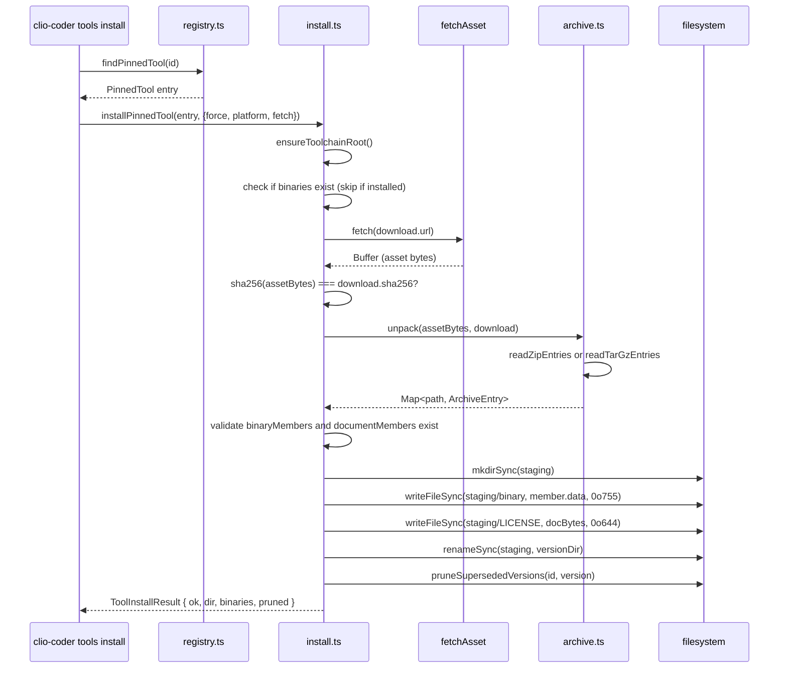

# Vendored Tool Registry and Resolution

## What this area does

Clio's toolchain domain is a vendored tool registry: it pins three external terminal
programs — herdr (terminal multiplexer), yazi (file manager), and croc (relay transfer)
— to exact upstream versions and per-platform SHA-256 checksums. When an operator
requests an install, Clio downloads the asset, verifies the checksum, unpacks it with a
dependency-free archive reader, and places it under the data root at
`<data>/tools/<id>/<version>/`. Resolution follows a three-rung ladder: PATH first,
then the vendored pin, then nothing. The domain is optional: every tool is a WARN
when absent, never an error.

## What owns it

The domain is split into focused modules under `src/domains/toolchain/`, each
exported through the barrel `src/domains/toolchain/index.ts`.

### Registry and types

`src/domains/toolchain/registry.ts` holds the `PINNED_TOOLS` constant, a
`ReadonlyArray<PinnedTool>` with three rows. Each row carries:

- `id`, `version`, `summary`, `homepage`, `license`
- `binaries` (every executable the tool installs) and `primaryBinary`
- `minimumVersion`: the floor a copy on PATH must clear
- `versionArgs`: the flags to pass for a version probe (e.g. `["--version"]`)
- `downloads`: a map of platform key (`linux-x64`, `darwin-arm64`, `win32-x64`,
  etc.) to a `PinnedToolDownload` with `url`, `sha256`, `archive` kind,
  `binaryMembers`, and `documentMembers`
- `documents`: separately downloaded files (e.g. a LICENSE)

The `ToolPlatform` type in `src/domains/toolchain/types.ts` is a union of the six
supported platform keys. `currentToolPlatform()` in `registry.ts` maps
`process.platform` and `process.arch` to one of those keys, or `null` when unmapped.
`findPinnedTool(id)` looks up by tool id; `findPinnedToolByBinary(name)` looks up by
executable name (stripping a `.exe` suffix on Windows) so that `ya` resolves to yazi.

The `PinnedTool` interface in `types.ts` requires every platform entry to carry a
`sha256`. The comment in `registry.ts` explains that this is enforced by a
registry-shape contract test, which refuses an entry that carries a platform without
a checksum.

### Paths

`src/domains/toolchain/paths.ts` defines four path helpers:

- `toolchainRoot()` returns `<data>/tools` without creating it.
- `toolVersionDir(id, version)` returns `<data>/tools/<id>/<version>` without creating it.
- `vendoredBinaryPath(id, version, binary)` returns `<data>/tools/<id>/<version>/<binary>`
  (or `<binary>.exe` on Windows) without creating it.
- `ensureToolchainRoot()` returns `<data>/tools` **creating** the data root the way
  every other writer does.

The comment in `paths.ts` explains the design: vendored tools are durable artifacts, so
they live under the data root beside memory and evidence, not under state or cache.
Every reader resolves through `resolveClioDirs()` rather than `clioDataDir()` because
the latter creates the root, and the resolution ladder promises to create nothing.

### Resolution ladder

`src/domains/toolchain/resolve.ts` implements the shared resolution ladder. The core
function is `resolveToolBinary(name)`, which:

1. Looks up the name in the registry via `findPinnedToolByBinary(name)` or
   `findPinnedTool(name)`.
2. If the name is not in the registry, it falls back to a plain PATH lookup:
   `findExecutableOnPath(name)` and returns a `ToolResolution` with `source: "path"`
   or `"none"`.
3. If the name is in the registry, it delegates to `resolveEntryBinary(entry, binary)`.

`resolveEntryBinary` implements the three-rung ladder:

1. **PATH**: probes `findExecutableOnPath(binary)`. If found, it runs the binary's
   version command via `probeBinaryVersion` and checks `satisfiesMinimum` against the
   entry's `minimumVersion`. If the version clears the floor, the PATH copy wins.
2. **Vendored**: checks `vendoredBinaryPath(entry.id, entry.version, binary)` for an
   existing file. If present, the vendored copy wins.
3. **Nothing**: returns `source: "none"`.

The `ToolResolution` interface in `types.ts` carries `source` (`"path"` | `"vendored"`
| `"none"`), `binaryPath`, `version`, `entry`, `pathCandidate`, and `vendoredPath`.

`toolStatus(entry)` and `toolStatuses()` produce per-entry and per-registry status
rows for the CLI and doctor. `describeResolution(status)` renders a single sentence
shared by `clio-coder tools status` and the doctor rows so the two cannot drift.
`describeFloorRejection(status)` names a rejected PATH copy, the floor it missed, and
the command that fixes it.

### Install

`src/domains/toolchain/install.ts` contains the install flow. The entry points are
`installTool(id, options)` and `installPinnedTool(entry, options)`.

The install sequence:

1. **Resolve the entry and platform**: `findPinnedTool(id)` looks up the registry row.
   `currentToolPlatform()` maps the running OS/arch to a platform key, or the caller
   supplies `options.platform` to install for a different target.
2. **Check if already installed**: if all `binaryMembers` files exist under the target
   version directory and `options.force` is false, the install is skipped (returns
   `skipped: true`) but pruning still runs.
3. **Download**: `fetchAsset(url)` fetches the asset with a 300-second timeout.
   The fetcher is injectable (`options.fetch`) so tests never touch the network.
4. **Verify checksum**: `sha256(assetBytes)` is compared against `download.sha256`.
   A mismatch returns a failure immediately; nothing is written.
5. **Download documents**: separately downloaded files (e.g. LICENSE) are fetched and
   checksum-verified the same way.
6. **Unpack**: `unpack(assetBytes, download)` dispatches on `download.archive`:
   - `"raw"`: the asset is the binary itself; the synthetic map key is `""`.
   - `"zip"`: `readZipEntries(bytes)` from `archive.ts`.
   - `"tar.gz"`: `readTarGzEntries(bytes)` from `archive.ts`.
7. **Validate members**: every `binaryMembers` and `documentMembers` path must be
   present in the unpacked map, or the install fails.
8. **Stage and rename**: files are written to a sibling staging directory
   (`.<version>.incomplete-<pid>-<timestamp>`) with `chmodSync(target, 0o755)` on
   binaries. Then `renameSync(staging, dir)` atomically moves the version directory
   into place. On `--force`, the old directory is renamed to a `.replaced-` staging
   name first, and deleted after the rename.
9. **Prune**: `pruneSupersededVersions(entry.id, entry.version, { root })` removes
   every version directory of the same tool except the one just installed.

The comment in `install.ts` explains three rules: nothing downloads unless an operator
asked by name; nothing is written until the checksum matches; and the version
directory appears atomically via staging and rename so a killed install leaves a
`.incomplete-` directory rather than a half-populated version.

### Archive readers

`src/domains/toolchain/archive.ts` contains just-enough zip and tar.gz reading to
unpack pinned release assets without a dependency or a shell-out.

`readZipEntries(buffer)` finds the End of Central Directory record by scanning from
the end of the buffer for the `ZIP_EOCD_SIGNATURE`. It then walks the central
directory entries, reading the local file headers to locate the compressed data.
Each member is decompressed with `inflateRawSync` (deflated) or passed through
(stored), and the Unix mode is extracted from the high 16 bits of the external
attributes. A size cap of 512 MiB (`MAX_TOTAL_UNCOMPRESSED_BYTES`) refuses archives
that expand beyond the limit.

`readTarGzEntries(buffer)` gunzips the input with `gunzipSync`, then walks 512-byte
tar blocks. It handles GNU long-name extension (type `L`), skips PAX headers and
directories (types `x`, `g`, `5`), and reads regular files (type `0` or `\0`).

`assertSafeMember(name)` rejects any archive member with an absolute path (starting
with `/`, `\`, or a drive letter) or a `..` component, preventing path traversal.

### Removal and pruning

`src/domains/toolchain/remove.ts` handles deletion. `removeTool(id)` deletes every
vendored version of a tool. `pruneSupersededVersions(id, keep)` deletes every version
except the named `keep`, which is called by the installer after a version is in place.

`sweepStaleStaging(dir, staleMs)` deletes abandoned staging directories whose
mtime is older than the cutoff (default `STALE_STAGING_MS` = 1 hour). The comment
explains that pids are not consulted because they are reused and a pid belonging to
another user answers a liveness probe with EPERM.

### Version probing

`src/domains/toolchain/version.ts` reads and compares versions. `parseVersion(output)`
extracts the first dotted triple (`(\d+)\.(\d+)\.(\d+)`) from any `--version` output.
`compareVersions(a, b)` returns -1/0/1; unparseable input sorts oldest.
`satisfiesMinimum(found, minimum)` returns false for null. `probeBinaryVersion(binaryPath, args)`
spawns the binary with `--version`, reads the version, and memoizes the result per
absolute path for the life of the process.

## How data and control flow

The CLI entry point is `src/cli/tools.ts`, which provides the `clio-coder tools`
subcommands: `list`, `status`, `install`, and `remove`. The `installOne` function
calls `installTool(id, { force, onProgress })`, forwarding the operator's flags. The
`statusTool` function calls `toolStatus(entry)` and `installedToolVersions(entry.id)`.

The doctor uses `toolchainFindings()` from `src/cli/doctor-toolchain.ts`, which calls
`toolStatuses()` and renders each row with `describeResolution(status)`.

The Yazi mux session in `src/domains/mux/yazi/session.ts` calls
`resolveYaziBinaries()`, which uses `findPinnedTool("yazi")`, `toolStatus(entry)`,
and `resolveToolBinary("ya")` to locate the binaries. If the binaries are missing,
the session returns a `missing-binary` status with `describeResolution(status)` as
the detail.

The `resolveBinary(name)` helper in `src/tools/executables.ts` calls
`resolveToolBinary(name).binaryPath`, providing a simple PATH-or-vendored-or-null
lookup for any executable Clio might run.

The GUI adapter in `apps/clio-coder-gui/server/clio/adapters/toolchain.ts` wraps the
same domain functions. `toolchainAdapter` returns an object with `list()`,
`install()`, and `remove()` methods that delegate to `toolStatuses()`,
`installPinnedTool()`, and `removeTool()` respectively. The adapter also provides a
`pinnedFetcher` that validates every download URL against the pinned registry before
invoking the fetcher.

### Install flow (from operator to disk)

## Enforced boundaries and lifecycle

### Registry shape

The `PINNED_TOOLS` constant in `registry.ts` is the single source of truth for which
tools Clio vendors. The comment explains that every checksum was computed from the
asset as downloaded, not copied from a release note. Where upstream publishes its own
checksum file, the two were compared and agree. Where upstream publishes no checksums,
only the platform whose asset was actually fetched and hashed is listed.

The `PinnedTool` interface in `types.ts` requires `sha256` on every platform entry.
The comment in `registry.ts` states that a registry-shape contract test refuses an
entry that carries a platform without a checksum.

### Floor enforcement

The resolution ladder enforces a `minimumVersion` floor. In `resolveEntryBinary`,
`probePathCandidate` calls `probeBinaryVersion` and checks `satisfiesMinimum(version,
entry.minimumVersion)`. A PATH copy below the floor is rejected and the vendored copy
is used instead. `describeFloorRejection` names the rejected PATH copy, the version
found, and the floor it missed.

### Atomic install

The install in `install.ts` uses a staging directory and `renameSync` to make the
version directory appear atomically. The staging name is
`.<version>.incomplete-<pid>-<timestamp>`. If the install is killed, the staging
directory remains but is not a valid version directory (it starts with `.`), so the
resolution ladder never sees it. `sweepStaleStaging` cleans up directories older than
one hour.

### Removal safety

`removeVersions` in `remove.ts` only ever unlinks inside `<data>/tools/<id>/`. The
comment explains that this makes removal safe without a confirmation prompt: the
worst outcome is a re-download of bytes the registry pins by checksum. Version
directories are the only thing considered; names starting with `.` are staging or
retired directories and are never deleted by `installedToolVersions` (which filters
them out). `sweepStaleStaging` uses a regex `STAGING_NAME` that matches only
`.<version>.incomplete-<pid>-<t>` and `.<version>.replaced-<pid>-<t>`.

## Extension seams

### Adding a new pinned tool

To add a new tool, append a row to `PINNED_TOOLS` in `src/domains/toolchain/registry.ts`.
The row must specify:

- A unique `id` and `version`
- `binaries` and `primaryBinary`
- A `minimumVersion` floor
- Per-platform `downloads` entries with `url`, `sha256`, `archive` kind, and
  `binaryMembers` mapping

The `archive` kind determines which reader is used: `"raw"` (bare binary), `"zip"`,
or `"tar.gz"`. The `binaryMembers` map uses the archive member path as the key and
the local name as the value. For `"raw"` archives, the key must be `""` (empty string)
because the synthetic map in `unpack` uses `""` as the path for the whole asset.

### Custom fetcher

The install flow accepts an injectable `fetch` option (`ToolInstallOptions.fetch`).
The GUI adapter uses this to validate URLs against the pinned registry. Tests use it
to fabricate install fixtures without touching the network.

### Platform override

`installPinnedTool` accepts a `platform` option that overrides the running platform.
This allows installing the win32 asset from Linux. The `executableName` function keys
off the target platform, not `process.platform`, so installing for win32 writes
`herdr.exe` regardless of the running OS.

## Focused tests

### GUI HTTP test with fixture

`apps/clio-coder-gui/tests/http-toolchain.test.ts` tests the toolchain domain through
the HTTP API with a fabricated install fixture. The fixture in
`apps/clio-coder-gui/tests/fixtures/toolchain.ts` creates a fake herdr entry with a
fabricated shell script and a LICENSE document, and provides a fetcher that returns
the fixture bytes. The test demonstrates:

- Inventory: `GET /api/toolchain/tools` returns the three pinned tools
- Install: `POST /api/toolchain/tools/herdr/install` downloads, verifies, and vendors
  the fabricated tool; the binary appears at `<data>/tools/herdr/<version>/herdr`
- Idempotency: a second install with `force: false` returns the same operationId
- Conflict: an install with `force: true` while another is in flight returns 409
- Removal: `POST /api/toolchain/tools/herdr/remove` deletes the vendored install
- Failure: an injected download failure produces a redacted terminal problem

### Doctor Yazi repair test

`tests/contracts/doctor-yazi-repair.test.ts` tests `toolchainFindings` from
`src/cli/doctor-toolchain.ts`. It creates a scratch `yazi` and `ya` binary on PATH,
sets `process.env.PATH`, and verifies that:

- A missing profile is reported as "info" level
- A stale profile (stamp.json present but mismatched) is "warn" and repaired by `fix`
- A generation failure is "warn" and retained until a successful regeneration

## Things to watch when editing

- **Checksums must match the asset**. The comment in `registry.ts` explains that
  bumping a version means re-downloading each listed asset and re-computing each hash.
  A hash nobody verified is worse than a missing platform.
- **The `binaryMembers` key for `"raw"` archives must be `""`**. The `unpack` function
  in `install.ts` creates a synthetic map entry with path `""` for raw archives. If
  the registry row uses a non-empty key, the validation loop will not find it and the
  install will fail with "the asset does not contain".
- **The floor is a property of the tool, not the binary**. In `probePathCandidate`,
  only the primary binary is probed for its version. Secondary binaries inherit the
  primary's verdict from the same install root rather than being probed with flags
  they may not have.
- **Staging directories start with `.`**. `installedToolVersions` filters out names
  starting with `.` because they are installer staging or retired directories. A prune
  that raced an install and deleted one would corrupt that install.
- **The version probe is memoized per absolute path**. `probeCache` in `version.ts`
  caches results for the life of the process. `resetVersionProbeCache()` is exported
  for tests that swap binaries under a path.
- **The archive readers refuse anything they do not understand**. `readZipEntries`
  throws on unsupported compression methods; `readTarGzEntries` skips unknown type
  flags. `assertSafeMember` rejects absolute paths and `..` components.
- **The install prunes even when skipped**. When a tool is already installed, the
  skip path still calls `prune` to clean up superseded versions, which repairs a
  machine that bumped pins before this behavior existed.
- **`describeResolution` is shared by CLI and doctor**. The comment in `resolve.ts`
  explains that the remedy is deliberately absent when the tool is vendored: printing
  an install command that would change nothing is its own kind of dishonesty.
