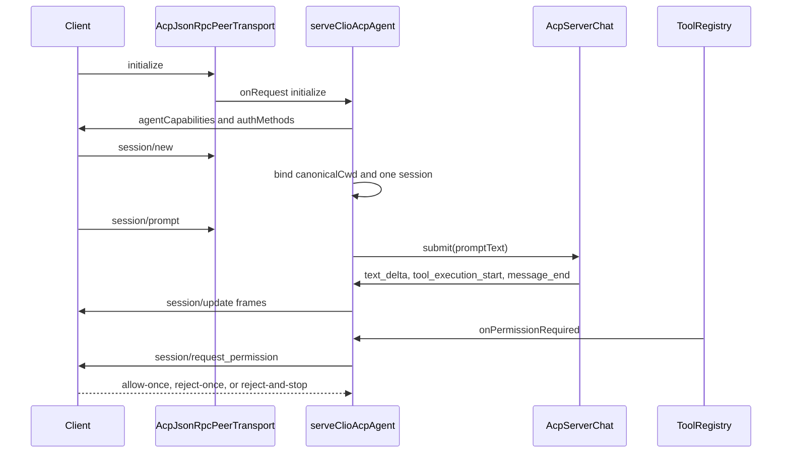

# Engine acp

`src/engine/acp` implements Agent Client Protocol (ACP) v1 in two directions. The server side exposes Clio as an ACP agent to external frontends over stdio JSON-RPC. The delegation side starts external ACP peers as child processes and converts their protocol traffic into Clio delegation events. This area is part of the broader [Engine](../engine.md) and is covered by [Contract tests](../tests/contracts.md).

## Ownership and symbols

- `serveClioAcpAgent` in `src/engine/acp/server.ts` installs the ACP request handlers, prompt state, permission bridge, bus event forwarders, and session lifecycle controls.
- `createAcpHandshake` in the same file owns `initialize`, `authenticate`, and `logout`, and projects the capability advertisement that strict clients can rely on.
- `createStdioServerTransport` in `src/engine/acp/transport.ts` accepts inbound JSON-RPC frames from a client. `StdioJsonRpcTransport` and `createStdioTransport` spawn and communicate with an outbound ACP peer.
- `startAcpDelegationRun` in `src/engine/acp/adapter.ts` drives one external ACP peer through `initialize`, `session/new`, optional model/thinking configuration, and `session/prompt`.
- `AcpToolMediator` in `src/engine/acp/tool-mediator.ts` answers a peer's `session/request_permission` by mapping the peer tool call onto Clio tool names and evaluating Clio safety policy.
- `acpCommandControl`, `acpCommandCatalog`, and `invokeAcpCommand` in `src/engine/acp/commands.ts` expose a fixed allowlist of slash commands to ACP clients.
- `AcpEventMapper` in `src/engine/acp/event-mapper.ts` converts peer `session/update` frames into Clio agent events for delegation.
- `AcpRequestError`, `acpErrorMessage`, and the fixed error constants in `src/engine/acp/errors.ts` keep untrusted failure text out of the JSON-RPC channel.
- Wire constants such as `ACP_MAX_STRING_BYTES`, `ACP_MAX_RAW_RECORD_BYTES`, and `ACP_MAX_TOOL_CALL_ID_BYTES` in `src/engine/acp/types.ts` bound client-rendered payloads.

## Entry points and registration

The CLI entry point is `runAcpCommand` in `src/cli/acp.ts`. It parses `--cwd` and `--permission-timeout`, takes over stdout for JSON-RPC, and creates a `createStdioServerTransport`. When no `--cwd` is supplied, the CLI keeps the transport open and calls `serveDeferredAcp` from `src/engine/acp/deferred-boot.ts`; the first workspace request selects the boot root. When `--cwd` is supplied, the CLI enters the process eagerly and calls `runClioCommand`.

`runClioCommand` ultimately reaches the orchestrator in `src/entry/orchestrator.ts`. When `options.acp` is present, the orchestrator creates or accepts a transport, then calls `serveClioAcpAgent` with the chat loop, session contract, provider contract, settings projection, dispatch control, bus, tool registry, and command control. The orchestrator builds the command control with `acpCommandControl`, passing `dispatch`, `bus`, `providers`, and host callbacks such as `runDoctor`, `submitOperatorNote`, and `submitTurn`.

## Server request flow

The handshake is installed before domain handlers. `createAcpHandshake` stores the initialization flag, tool-progress opt-in, enabled event kinds, and a workspace instance id. It intersects requested event kinds with the allowlist in `ACP_FORWARDABLE_EVENT_KINDS` and refuses malformed event opt-ins instead of silently accepting a subset.

`serveClioAcpAgent` then registers standard ACP methods. `session/new` requires initialization and authentication, binds the launch `canonicalCwd`, and refuses a second session while `sessionCreated` is true. It attaches client-declared stdio MCP servers when `options.mcpCapabilities` is present. `session/prompt` extracts text from content blocks through `promptText`, refuses a prompt while another prompt or streaming run is active, and either invokes a slash command if one is advertised as available or submits the text to `options.chat.submit`.

While a prompt is active, `handleChatEvent` maps Clio engine events to ACP `session/update` notifications:

- `text_delta` becomes `agent_message_chunk`, split by `ACP_MAX_CHUNK_BYTES`.
- `thinking_delta` becomes `agent_thought_chunk`.
- `tool_execution_start` becomes `tool_call` with a bounded `rawInput` and optional `locations`.
- `tool_execution_end` becomes a terminal `tool_call_update`; duplicate terminal updates are dropped.
- `message_end` and `agent_end` merge usage and apply the stop reason.

## Session and operator controls

Beyond the standard protocol, `_clio-coder/` methods expose controls supplied by the host. `initialize` advertises only the capabilities bound by the composition root; clients use that advertisement to enable controls.

| Control | Behavior |
| --- | --- |
| Session history and branches | Standard `session/list` and `session/load` discover and restore stored conversations. Extension methods expose the active tree, switch its turn, and fork a successor through the shared replay path. |
| Handoff | Prepare extracts a document for review without creating a successor. Commit seeds the reviewed document once. Conversation, branch, skills, or decisions changing during extraction or before commit invalidate the draft. Cancel discards it. |
| Fleet contracts | Preview compiles a named contract and presents its steps, resolved routes, command invocations, and budget. Run recompiles and requires the approved identity; a changed recipe, model route, command binding, plan, or budget requires another approval before dispatch. |
| Task and decision boards | Session board reads and explicit task/decision mutations use the domain stores. Completion notes remain distinct from verification evidence. |
| Context | The ledger method exposes chat context accounting. Allowlisted context commands provide recall, reset, and recovery through the shared host services. |
| Side questions and drafts | Out-of-turn questions and candidate drafts run beside the conversation. Failed provider answers stay in diagnostics; responses carry bounded host explanations. |
| Configuration and resources | Model and thinking selections, usage/quota, extensions, and library operations use the corresponding host controls. |

Prompt submission accepts text, bounded embedded text resources, and images when the host advertises image support. These inputs pass through the same prompt expansion used by the main chat loop.

## Permission mediation on the server

`installPermissionBridge` subscribes to `options.toolRegistry.onPermissionRequired`. When a parked tool call needs approval, the bridge finds the wire id that the client has already rendered, reads that call's `toolCallSnapshot`, and sends `session/request_permission`. It offers exactly three option ids: `allow-once`, `reject-once`, and `reject-and-stop`.

- `allow-once` resumes the parked calls.
- `reject-once` denies the current request.
- `reject-and-stop` denies and cancels the active prompt plus parked calls, because a released parked call could otherwise start another model request while cancellation is in flight.
- A permission timeout emits a `permission_expired` resolution and fails the active prompt through `options.chat.cancel`.

The bridge binds only to an open wire id that the client has seen; it does not mint ids for permission asks. This keeps the ask aligned with the `tool_call` frame the client rendered.

## Headless operator commands

`src/engine/acp/commands.ts` projects the slash registry onto ACP through an allowlist, `ACP_COMMAND_RULES`. The module exports thirteen commands: `mcp`, `doctor`, `share`, `archive`, `run`, `delegate`, `oracle`, `council`, `skill`, `context`, `tasks`, `memory`, and `export`. Commands that are TUI-bound or absent from the allowlist are refused by name before parsing.

`acpCommandCatalog` derives the catalog from `commandReference()` rather than from a second table, so flags, positionals, subcommands, and closed value sets stay synchronized with the slash registry. `invokeAcpCommand` joins argv without quoting and refuses quotes, control characters, whitespace in non-final argv entries, oversized argv entries, and unsupported subcommands. Commands marked `injectsUserTurn` are refused while a prompt is active; the server tells the client to use `_clio-coder/session/steer` instead.

## Delegation to external ACP peers

`startAcpDelegationRun` is the upstream entry point used by dispatch. `src/domains/dispatch/extension.ts` calls it after capacity admission and ledger resolution, forwarding the agent config, task, optional model and thinking level, system prompt, dynamic prompt messages, cwd, safety contract, readOnly flag, client version, and clocks.

The adapter creates a stdio peer transport with `createStdioTransport`, resolves `{env:NAME}` environment references for the child, then performs the ACP v1 sequence:

1. `initialize` with `protocolVersion: 1` and empty client capabilities.
2. `session/new` with the delegation cwd.
3. `session/set_config_option` when the caller requests a model or thinking level that the peer offers and the peer has not already selected.
4. `session/prompt` with the flattened system prompt, dynamic messages, and task.

Peer `session/update` frames are mapped by `AcpEventMapper`. Permission requests from the peer are handled by `AcpToolMediator`. The returned handle exposes the peer pid, an async event iterator, the final result promise, `abort`, `kill`, heartbeat stamps, and the tool call log snapshot.

## Delegation permission mediation

`AcpToolMediator.handle` maps the peer's tool call into Clio tool names and then evaluates every mapped target through `SafetyContract.evaluate`. Mapping recognizes read, edit, delete, move, search, execute, and fetch shapes, and it infers some tool classes from rawInput when a peer omits ACP metadata.

The governance branches are:

- `clio-coder-policy`: safety policy decides; an `ask` disposition is denied because delegation has no interactive operator.
- `agent-managed`: the call is approved.
- `deny-all`: the call is denied.
- unknown tool: denied unless the rawInput shape is inferred into a known Clio tool.

Approval never selects `allow_always`. It selects only `allow_once`. If the peer offers no `allow_once`, the approved call is rejected with a reason that records this rule. Denial prefers `reject_once`, then `reject_always`, then any `reject*` option. The mediator records requested/approved/denied counters and a tool call log.

## Lifecycle and enforced boundaries

- **One session per process.** `sessionCreated` in `src/engine/acp/server.ts` prevents a second `session/new` while a session is bound. The contract test in `tests/contracts/acp-v1-basics.test.ts` asserts the second `session/new` rejects with `-32602`.
- **Workspace root binding.** The server canonicalizes `options.cwd ?? process.cwd()` and compares every session cwd against it. `serveDeferredAcp` binds the first workspace request and later requests that name a different root fail with `-32602`.
- **Initialization order.** Workspace methods require `initialize`. `serveDeferredAcp` also refuses workspace binding after logout, which keeps the workspace unbound.
- **Prompt exclusivity.** `session/prompt` refuses another prompt while `session.activePrompt` is non-null or `options.chat.isStreaming()` is true. Configuration changes and safe settings patches are also refused during an active prompt.
- **Wire cardinality.** Text chunks are bounded by `ACP_MAX_CHUNK_BYTES`, raw records by `ACP_MAX_RAW_RECORD_BYTES`, strings by `ACP_MAX_STRING_BYTES`, tool-call ids by `ACP_MAX_TOOL_CALL_ID_BYTES`, and live tool-call ids by `ACP_MAX_LIVE_TOOL_CALLS`. A 129th tool start sets `toolCallLimitReached` and fails the prompt with `max_turn_requests`.
- **Error boundary.** Provider prose and unclassified handler failures do not cross the JSON-RPC wire. `errors.ts` defines fixed messages: `ACP_TURN_FAILED_MESSAGE`, `ACP_INTERNAL_ERROR_MESSAGE`, and `ACP_METHOD_NOT_FOUND_MESSAGE`. The v1 basics test asserts that an unclassified handler failure becomes code `-32603` and message `internal error`.
- **Opt-in streams.** Tool progress and forwarded bus events are not enabled by default. Tool progress requires the client to send `clio-coder/toolProgress` version 1 metadata. Forwarded events require the client to request kinds from `ACP_FORWARDABLE_EVENT_KINDS`.

## Extension seams

- **New ACP method:** add a `transport.onRequest` handler inside `serveClioAcpAgent`. Use `assertParamKeys` to reject unknown parameters, and namespace extension methods under `_clio-coder/` so strict ACP clients see only the stable protocol surface.
- **New forwarded bus event:** add the literal `BusChannels` value to `ACP_FORWARDABLE_EVENT_KINDS`, then subscribe in `serveClioAcpAgent` and project payload fields through `safeStoredIdentifier`, `safeStoredString`, or `safeCount` before sending `_clio-coder/event`.
- **New operator command:** add the command to `ACP_COMMAND_RULES` in `src/engine/acp/commands.ts`, and add host requirements in `COMMAND_REQUIREMENTS` or `CONTEXT_REQUIREMENTS` when the command needs a host callback. The name must already exist in `BUILTIN_SLASH_COMMANDS`; a module-level check throws on load if the allowlist names an unregistered command.
- **New delegated ACP agent:** configure a `DelegationAgentConfig` for dispatch, or call `startAcpDelegationRun` directly with agent command, args, task, cwd, and safety contract.
- **New peer tool mediation:** extend `mapToolCall` and the mutation/path extraction helpers in `src/engine/acp/tool-mediator.ts`. Unknown rawInput shapes default to denial unless they are inferred into a known Clio tool.

## Focused tests

- `tests/contracts/acp-v1-basics.test.ts` calls `initialize` with `protocolVersion: 42` and `clientCapabilities: { auth: { terminal } }`. It asserts the response `protocolVersion` is `1`, that `authMethods` contains `["auth", "login"]` only when terminal auth is requested, that `authenticate` with an unknown method rejects with `-32602`, and that `session/new` after `logout` rejects with `-32000`. It also verifies that a second `session/new` rejects with `-32602` and that a prompt containing a resource link forwards the URI into the chat submission.
- `tests/contracts/acp-permission-options.test.ts` constructs `AcpToolMediator` with `createWorkerSafety` and `toolGovernance: "clio-coder-policy"`. For an approved read of `notes.txt`, it passes options including `allow_always`, `allow_once`, and `reject_once`, then asserts the response selects `opt-allow_once`. It also asserts that an approved call with no `allow_once` option is denied with a reason matching `no allow_once option` and `never selects allow_always`.
- `tests/contracts/acp-deferred-boot.test.ts` sends `initialize`, then `session/new` with a temporary root, then `session/new` with a different root. It asserts the first root binds the boot process, the later cwd mismatch rejects with `-32602`, and preboot logout keeps the workspace unbound.
- `tests/contracts/acp-client-mcp.test.ts` calls `session/new` with a stdio MCP fixture, invokes the gateway capability, and asserts that `session/close` detaches the client MCP server and removes its tools from the registry.
- `tests/contracts/acp-peer-error.test.ts` streams a provider-style error envelope through `AcpEventMapper.reportedFailure` and asserts that `startAcpDelegationRun` returns `exitCode: 1`, `stopReason: "error"`, and a failure message that names the peer-reported HTTP status.
- `tests/extended/acp-commands.test.ts` asserts that `acpCommandCatalog` contains the thirteen allowlisted commands, that `/context` and `/tasks` are exposed only through projected subcommands, that non-allowlisted names reject with `command_not_exposed`, and that `/skill` expands through `parsePendingSkillRequests` before `submitTurn`.

## Things to watch when editing

- Stdout is JSON-RPC only. Put operator-facing detail in `diagnostics` so it can land on stderr; do not echo provider bodies, file contents, or unbounded error messages into responses.
- Extensions must ride `_meta` keys. Adding a top-level field to a standard response can break strict ACP clients.
- The permission option set is closed. A client returning an option id outside `ACP_PERMISSION_OPTION_IDS` is denied; do not add prefix matching such as `startsWith("allow")`.
- Wire ids are unique per prompt. A permission ask, progress frame, or terminal update must resolve through `openWireIdFor` or the snapshot map; minting a new id for an update would announce a call the client never started.
- The command allowlist is a security boundary. `invokeAcpCommand` must refuse TUI-bound commands before `dispatchSlashCommand` can reach them, because those commands may dereference missing host members such as `keyboardActions`.
- Deferred boot answers handshake methods before boot, but workspace binding must not begin until `initialize` succeeds. Logout before boot must leave the workspace unbound.
- ACP v1 has no error `stopReason`. A failed prompt turn is signaled by throwing `AcpRequestError` from `session/prompt`, with the machine-readable code in `detail` and the original failure text in diagnostics.
- Steering and user-turn commands are different paths. Commands that inject a user turn are refused while a prompt is active; use `_clio-coder/session/steer` for mid-run guidance.
