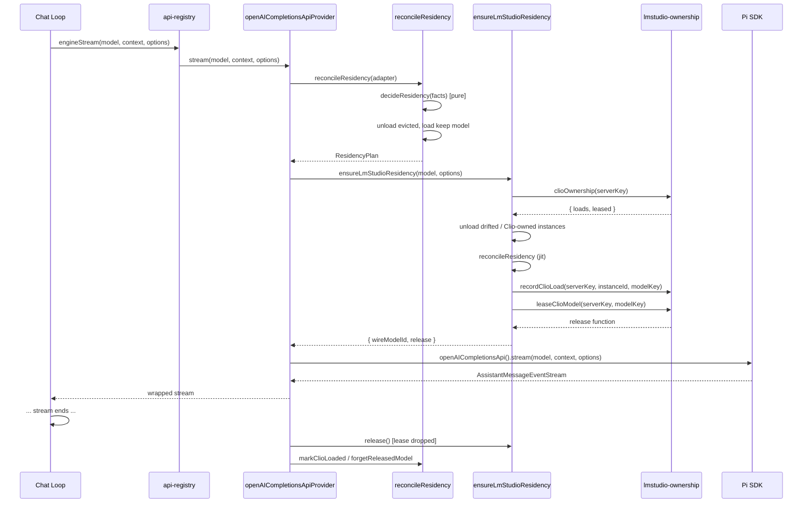

# Engine apis

## What this area does

`src/engine/apis/` implements the engine's provider API layer. It registers two Clio-specific API providers with the engine registry: `openai-completions` (for all OpenAI-compatible servers including LM Studio, llama.cpp router, LiteLLM gateway, and vLLM) and `ollama-native` (for Ollama's native `/api/chat` endpoint). Both providers wrap Pi SDK's built-in streaming APIs with Clio-specific logic: residency management for local servers, thinking payload mutations, sampling overrides, response metadata observation, sentinel stripping, and degraded-inference watching.

The area also contains a shared capacity-aware model-residency reconciler (`residency.ts`) that decides load and evict for local runtimes. Each local runtime provides an adapter that plugs into this shared policy, so co-residency math, protection tiers, TTL dedup, and cross-process locking all come from one place.

## Entry point and registration

`src/engine/apis/index.ts` exports `registerClioApiProviders()`, which calls `registerEngineApiProvider` (from `src/engine/api-registry.ts`) twice: once for `openAICompletionsApiProvider` with source `"clio"`, once for `ollamaNativeApiProvider` with source `"clio"`. The registry's `wrappedProvider` verifies that `model.api` matches the registered API before dispatching. The engine's dispatch path (`engineStream` / `engineStreamSimple` in `api-registry.ts`) resolves the registered provider for a given `api` string and calls its `stream` or `streamSimple`.

## The two providers

### `openAICompletionsApiProvider` (`src/engine/apis/openai-completions.ts`)

The provider's `stream` and `streamSimple` both call `streamCompletions`, which builds a pipeline of stream wrappers over Pi's `openAICompletionsApi()`. The pipeline order (outermost to innermost) is:

1. `guardMalformedToolCalls` — fails the stream when a tool call arrives with empty arguments and `stopReason !== "length"` (the latter case is Pi's length-truncation salvage, which Clio does not treat as malformed).
2. `withReasoningTokenEstimate` — adds `usage.reasoningTokens` when the provider did not report reasoning usage.
3. `stripSentinelsFromStream` — removes tokenizer special-token sentinels (e.g., `<tool_call>`, `
`) from text deltas. Skipped for diffusion providers.
4. `stripNeverReasoningFromStream` — strips thinking events and thinking content from `done`/`error` messages when the model's thinking mechanism is `"never"`.
5. `filterGemmaChannelStream` — splits reasoning and text channels for Gemma models that use channel markers.
6. `withLiteLLMRouteFailureAdvice` — enriches error messages with LiteLLM routing context.
7. `withResponseModelIdCapture` — wraps the `fetch` to observe response model ID, backend timings, gateway routing headers, and diffusion frames; annotates `done` and `error` events.
8. `withLocalResidency` — ensures local residency (LM Studio, llama.cpp, Ollama via gateway) and wraps the stream in the degraded-inference watchdog.
9. `start` — the actual Pi SDK stream (`piOpenAICompletions.stream`).

Arguments forwarded: `normalizeContext(preserveInterruptedReasoning(effectiveContext, requestModel, resolved))` and `withRemainingContextBudget(requestModel, effectiveContext, withSamplingOverrides(requestModel, capturedOptions, resolved))`.

**Thinking payload mutations** are applied by `composeThinkingOnPayload`, which calls `applyThinkingPayload` and `applyLmStudioPayload` after Pi applies its own sampling. The mechanism branches:
- `"none"`: strips thinking request fields; restores `enable_thinking` etc. from `model.samplingParams` for Inception P1.
- `"effort-levels"`: writes `reasoning_effort` when the family resolved one; off also carries `chat_template_kwargs.enable_thinking=false` for strict templates.
- `"budget-tokens"`: writes `thinking: { type: "enabled", budget_tokens }` when the family declares `thinkingFormat: "anthropic-extended"` and the runtime is not vLLM.
- `"on-off"`: writes `chat_template_kwargs.enable_thinking`.
- `"always-on"`: does not touch the payload.

**LM Studio-specific**: `applyLmStudioPayload` deletes `chat_template_kwargs` (LM Studio does not use it), sets `ttl` and `draft_model` from the load profile, and maps reasoning levels through `lmStudioReasoningEffort`.

**LiteLLM-specific**: `withLiteLLMRequestOptions` sets `x-litellm-*` headers (tags, session-id, timeout, stream-timeout, num-retries) and forces `maxRetries: 0` so the OpenAI SDK does not retry below Clio's visible recovery loop.

**llama.cpp-specific**: `applyLlamaCppPromptCachePayload` sets `cache_prompt` based on `cacheRetention`.

### `ollamaNativeApiProvider` (`src/engine/apis/ollama-native.ts`)

The provider's `stream` and `streamSimple` both call `runStream`, which:

1. Builds request headers from `model.headers` and `options.headers`.
2. Wraps the stream in `createDegradedInferenceStream` (the watchdog).
3. Calls `reconcileOllamaResidency` to decide whether to pin the model with `keep_alive: -1`.
4. Builds the request via `buildRequest`, which translates messages to Ollama format and applies thinking and sampling options.
5. Streams via `streamOllamaChat` from `./ollama-http.js`.
6. Emits `text_start`/`text_delta`/`text_end` events for text, `thinking_start`/`thinking_delta`/`thinking_end` for reasoning, and `toolcall_start`/`toolcall_delta`/`toolcall_end` for tool calls.
7. Tracks ownership: when `pin` is true and the first response arrives, the model is recorded in `ownedModelsByTarget` and `markClioLoaded` is called. A `reportClioModelLoad` forwards the load to the orchestrator in a worker.

Message translation: `buildMessages` calls `translateMessage` for each message, which handles user (text + images), assistant (text + tool calls + thinking), and toolResult (text with `tool_name`) roles.

**Thinking**: `ollamaThinkValue` maps the applied thinking mechanism to Ollama's `think` field: `"always-on"` returns `undefined` (Ollama owns it), `"none"` returns the thinking-active boolean, `"effort-levels"` returns the effort level or `true`.

**Ownership and release on exit**: `releaseClioLoadedOllamaModels` is registered via `registerExitRelease`. It reads the resident list first, then unloads only models that are both in `ownedModelsByTarget` and `isClioLoaded`. A `scope` narrows the release (used by one-shot probes). The release is bounded by `EXIT_RELEASE_MS` (2000ms) via an `AbortController`.

## Residency management

### Shared reconciler (`src/engine/apis/residency.ts`)

`reconcileResidency(adapter)` is the single decision point for load and evict. It:

1. Checks the TTL cache (60s) — a clean reconcile within the window returns the cached decision.
2. For `"router"` strategy, acquires the cross-process lock before reading capacity.
3. Calls `adapter.listResident()` to get the resident set.
4. Calls `adapter.capacity()` (router strategy) and `adapter.keepModelTags()` to gather facts.
5. Classifies residents: `loadedByClio` (from the `clioLoaded` registry), `protection` (`"tag"` for `pinned:true`/`role:scout`, `"config"` for operator-config references, `"worker"` for adopted worker loads), and `role` (from config).
6. Calls `decideResidency(facts)` (pure) to produce a `ResidencyPlan`:
   - **Stress notices**: context length exceeding model max, CPU-split residents, over-capacity.
   - **Observe-only**: `facts.managed === false` (user-managed lifecycle).
   - **Already resident**: co-residents stay; reports once per TTL.
   - **JIT strategy** (LM Studio): attempts co-residency first; `fallbackEvict` carries ranked candidates for retry after capacity rejection.
   - **Scheduler strategy** (Ollama): releases only Clio's own unprotected stragglers.
   - **Router strategy** (llama.cpp): computes slots needed; declines if unknown capacity with existing residents; evicts only Clio-owned candidates (unprotected first, then config-protected only if `keepTagProtected` is false).
7. If the plan would evict, calls `adapter.assertLoadable()` first — a `ResidencyPreconditionError` declines the reconcile before any mutation.
8. Emits notices, then performs mutations under the lock: unload each evicted model, then load the keep model.
9. On load failure, `restoreEvictedModels` puts back the evicted models via `adapter.reloadEvicted`.
10. Marks the keep model as Clio-loaded and caches the decision.

**Protection tiers**: `"tag"` (server operator pins), `"config"` (operator's Clio configuration references), `"worker"` (adopted worker loads). No Clio profile silently evicts another profile's model.

**Notice system**: `declareRuntimeNoticeProducer` registers a producer with specific kinds; `deliverNotice` emits to the active sink (shared bus or stderr). The reconciler declares kinds `"will-not-fit"`, `"about-to-evict"`, `"swap"`, `"co-resident"`, `"stress"`.

### llama.cpp router adapter (`src/engine/apis/llamacpp-residency.ts`)

`ensureLlamaCppResidency(input)` builds a `ResidencyAdapter` with `strategy: "router"`:
- `listResident`: fetches `/v1/models` and filters to resident states (`loaded`, `loading`, `sleeping`).
- `capacity`: reads `max_instances` from `/props`.
- `assertLoadable`: checks the snapshot for the keep model; throws `ResidencyPreconditionError` if absent.
- `load`: POSTs to `/models/load`, then polls `/models` until the model is `loaded` or `sleeping` (sleeping is a resident state — a router with `--sleep-idle-seconds` parks idle models while keeping the slot).
- `unload`: POSTs to `/models/unload`.
- `reloadEvicted`: forced reload with its own timeout (recovery must survive request cancellation).
- After loading, `restoreDisplacedPinned` reloads any tag-pinned residents the load displaced.

`listLlamaCppResidentModels` is exported for the degraded-inference watchdog.

### LM Studio residency (`src/engine/apis/lmstudio.ts`)

`ensureLmStudioResidency(model, options)` handles LM Studio's just-in-time loading:
- For a managed target with an explicit load profile, acquires the residency lock and calls `ensureLmStudioResidencyUnlocked`.
- Reads the catalog via `listLmStudioModels`.
- Resolves the instance via `resolveLmStudioInstance`.
- If the instance drifted from the load profile (`lmStudioLoadDrift`), unloads it and reloads — unless another Clio process holds a lease.
- Releases Clio's earlier loads on this server (from `clioOwnership`) before loading.
- Calls `reconcileResidency` with `strategy: "jit"` and `ttlMs: 0` (fresh catalog each turn).
- On capacity rejection, tries `plan.fallbackEvict` candidates and restores them on retry failure.
- Returns a `LmStudioResidency` with `wireModelId` and `release` (the lease).

`ensureGatewayLmStudioResidency` handles LiteLLM gateway routes: reads the deployment from `/v1/model/info`, builds a control model, and calls `ensureLmStudioResidency` on the LM Studio server. The request itself still goes through the gateway.

### LM Studio ownership (`src/engine/apis/lmstudio-ownership.ts`)

Cross-process ownership via a state file per LM Studio server:
- `recordClioLoad`: adds a load record to the state file.
- `leaseClioModel`: adds a lease (pid, birth token, host, timestamp) and returns a release function. The lease is checked with `leaseHeld` (pid alive and birth token matches, or host mismatch or synthetic lease within 6h age).
- `clioOwnership`: reads loads and live leases.
- All operations are best-effort: an unreadable file reads as empty, and a lock failure runs unlocked.

## Degraded inference watchdog (`src/engine/apis/degraded-inference.ts`)

`createDegradedInferenceStream(options)` wraps an event stream to watch for slow token generation:
- Starts a watchdog on the `start` event (model load is not judged as slow generation).
- Counts tokens from `text_delta`, `thinking_delta`, and `toolcall_delta` events.
- After `DEGRADED_GRACE_MS` (30s), checks the rate every 5s. If below `DEGRADED_FLOOR_TOKENS_PER_SECOND` (2), emits a `"degraded"` notice once with the resident model summary.
- `runningDegradedInferenceWatchdogs()` returns the count of active timers (every finished turn returns it to zero).

The watchdog never cancels a turn; it observes and reports.

## Supporting modules

### `types.ts`
Defines `EngineApiProvider<TApi, TOptions>` with `api`, `stream`, and `streamSimple` methods.

### `resident-models.ts`
Defines `ResidentModelInfo` (`modelId`, `aliasIds`, `sizeVramBytes`, `sizeBytes`, `tags`) and `residentMatchesKeep` (matches on `modelId` or any `aliasIds`).

### `sampling-overrides.ts`
`pickSamplingProfile` selects the quirks-based profile for thinking or instruct mode. `samplingParamsFromProfile` maps the profile to wire parameters (`top_p`, `top_k`, `min_p`, `repeat_penalty`/`repetition_penalty`, `presence_penalty`, `frequency_penalty`). Run-scoped overrides from `core/run-overrides.ts` merge on top.

### `output-budget.ts`
`remainingContextMaxTokens` computes the output token budget: `min(requested, model.maxTokens, contextWindow - inputTokens - CONTEXT_BUDGET_SAFETY_TOKENS)`. The requested value comes from (in order): tool-turn limit, `globalDefaultMaxOutputTokens` (set at session start), `model.maxTokens`, or `DEFAULT_MAX_OUTPUT_TOKENS`.

## Data flow through an actual caller

For the Ollama path, `runStream` calls `reconcileOllamaResidency` (which builds a scheduler-strategy adapter and calls `reconcileResidency`), then `streamOllamaChat` with `keep_alive: -1` when pinning.

## Enforced boundaries and lifecycle

**Boundary: Pi SDK imports.** Only `src/engine/**` imports `@earendil-works/pi-*`. The API providers receive `Model`, `Context`, and `StreamOptions` shapes from the Pi SDK.

**Boundary: Residency protection.** The reconciler's `decideResidency` enforces:
- Residents tagged `pinned:true` or `role:scout` are never evicted.
- Residents referenced by the operator's Clio configuration (via `setProtectedModelsProvider`) carry their role and are never evicted while an unprotected candidate exists.
- Worker-loaded models (adopted via `adoptWorkerLoadedModel`) carry `"worker"` protection.
- The `keepTagProtected` flag prevents a pinned keep model from evicting a config-protected resident (one-way swap that the configured role could never undo).

**Boundary: Cross-process locking.** Mutations are serialized through `withResidencyLock` (state-dir lock file) for the `"router"` strategy. LM Studio uses `withResidencyLock` for load-profile enforcement.

**Boundary: Lease protection.** A model with a live lease (another Clio process streaming on it) is never unloaded. `leaseHeld` checks pid liveness and birth token.

**Lifecycle: Release on exit.** Each runtime registers via `registerExitRelease`. `releaseClioLoadedModelsOnExit` runs all releasers in parallel, each bounded by `EXIT_RELEASE_MS` (2000ms). Failures are swallowed (best-effort).

**Lifecycle: Scoped release.** `releaseModelsLoadedDuring` snapshots the `clioLoaded` registry before the task, then releases only models that became Clio-loaded during the task. Used by one-shot probes.

## Extension seams

**New API provider**: Add a module in `src/engine/apis/` that exports an `EngineApiProvider` object, import it in `src/engine/apis/index.ts`, and call `registerEngineApiProvider(provider, "clio")` in `registerClioApiProviders`.

**New residency strategy**: The reconciler's `ResidencyStrategy` type (`"router"`, `"jit"`, `"scheduler"`) is the extension point. A new strategy would be added to `decideResidency`'s branching, and a new adapter would implement the `ResidencyAdapter` interface.

**New runtime adapter**: Implement the `ResidencyAdapter` interface (`targetKey`, `listResident`, `unload`, `load`, `capacity`, `assertLoadable`, `reloadEvicted`, `withLock`) and call `reconcileResidency`. The llama.cpp router adapter in `llamacpp-residency.ts` and the LM Studio adapter in `lmstudio.ts` are reference implementations.

**New notice kind**: Add the kind to the `RuntimeNoticeKind` union and declare a producer via `declareRuntimeNoticeProducer`. A contract test checks that every kind is registered by some producer.

## Focused tests

### `tests/contracts/lmstudio-load-profile.test.ts`

Demonstrates LM Studio load profile enforcement:
- **Settings validation**: `validateSettings` accepts `parallel`, `speculativeDraftMaxTokens`, and per-model overrides; rejects `parallel: 0` and unknown `mtp` keys.
- **Per-model override**: `effectiveLmStudioLoad` merges the target profile with the model-specific override on top.
- **Drift detection**: `lmStudioLoadDrift` names only the fields the instance reports and the profile sets.
- **Direct LM Studio target loads with profile**: A turn triggers one load with the profile wire keys; a second turn reuses the matching instance (no reload).
- **Reload on drift**: An instance loaded with GUI defaults is unloaded and reloaded with the profile.
- **User-managed target is never touched**: `lifecycle: "user-managed"` produces no loads or unloads.
- **Gateway route loads LM Studio model**: A LiteLLM gateway route with `model_info.runtime: "lm-studio"` triggers a load on the LM Studio server; the request itself still goes through the gateway; the gateway key never reaches LM Studio.
- **Cross-process ownership**: A load releases a model an earlier Clio process loaded on the same server; back-to-back turns on one model stay warm; a model another client loaded is never released; a model a live Clio process is streaming on stays and is released once that process is gone; a drifted instance is not reloaded under a live Clio request; a stream holds its lease while the request runs and drops it after.

### `tests/extended/ollama-residency.test.ts`

Demonstrates Ollama residency and ownership:
- **Preserves operator models, unloads Clio-pinned on model switch**: An operator-loaded model is never evicted; Clio's own pinned model is unloaded on a model switch.
- **Does not claim a failed load**: A failed chat does not record ownership; a subsequent operator load is not treated as Clio's.
- **Does not transfer ownership between servers**: Ownership is per-server.
- **Forgets successful unloads, retains after failed unloads**: A failed unload retains ownership; a successful unload forgets it.
- **Releases on exit only Clio-loaded models**: After a model switch, exit release unloads only Clio's current model; an operator model is untouched.
- **Bounds release on exit**: A hung server does not block exit past the timeout.
- **Reports worker loads once**: `reportClioModelLoad` reports a cold model once; a warm model is never reported.
- **Releases worker-reported models at exit**: An adopted worker load is released at exit; operator models are untouched.
- **Refuses worker reports for wrong target/model/node**: Security checks on the adoption path.
- **Never evicts a worker-reported model mid-session**: A chat turn does not evict a worker-loaded model.
- **Scoped release for probes**: `releaseModelsLoadedDuring` with `releaseScopeFor` releases only the probed model.

## Things to watch when editing

- **The `openAICompletionsApiProvider` pipeline is order-sensitive.** The wrapper chain in `streamCompletions` is built outermost-to-innermost. Moving a wrapper changes which events it sees (e.g., `withResponseModelIdCapture` must be outside `withLocalResidency` to observe the raw fetch; `stripSentinelsFromStream` must be inside `stripNeverReasoningFromStream` to see the unstripped stream).
- **The residency TTL cache (60s) can mask changes.** A clean reconcile within the window returns the cached decision without re-listing. The LM Studio JIT adapter passes `ttlMs: 0` to force a fresh catalog each turn. A new adapter must decide whether it needs the TTL fast path.
- **`sleeping` is a resident state for the llama.cpp router.** A router with `--sleep-idle-seconds` parks idle models while keeping the slot and weights. Reading it as unloaded costs twice: capacity math sees a free slot that does not exist, and the load path re-requests a model the router is already running.
- **The LM Studio ownership file is an optimization, not a precondition.** An unreadable file reads as empty, and a lock failure runs unlocked. The system degrades to co-residency rather than failing a turn.
- **The degraded-inference watchdog uses a monotonic clock.** A stepped wall clock would fake a collapse on a forward step and hide one on a backward step. The default is `performance.now`.
- **Ollama's `keep_alive: -1` pins the model forever.** The only release path is `unloadOllamaModel` (which fires `keep_alive: 0`) or `releaseClioLoadedOllamaModels` at exit. A model Clio pinned but never released holds its weights indefinitely on a shared server.
- **The `exactOptionalPropertyTypes` convention is enforced.** Optional fields are passed with `...(x !== undefined ? { x } : {})`, never `x: undefined`. The `LlamaCppResidencyInput` and `WatchDegradedInferenceOptions` interfaces rely on this.
- **The `piOpenAICompletions` const is a module-level singleton** (`openAICompletionsApi()`). It is not per-request; the stream wrappers are what make each call distinct.

<!-- clio-coder:wiki unresolved sources: src/engine/** -->
