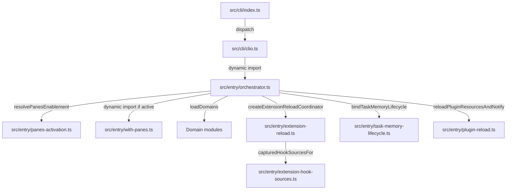

# Entry point

## What this area does

The entry point is the composition root for the Clio Coder orchestrator. It receives `BootOptions`, wires seventeen domain bundles into a single process, and returns a `BootResult` whose `exitCode` and `bootTimeMs` record the outcome. The module `src/entry/orchestrator.ts` is the single file that imports `src/engine`, `src/interactive`, `src/tools`, and every `src/domains/*` contract. The CLI subcommand `src/cli/clio.ts` (see [Cli](cli.md)) dynamically imports `src/entry/orchestrator.ts` and calls `bootOrchestrator`, which is the only entry point that can load the full domain graph.

Three smaller modules under `src/entry/` split out concerns that the heavyweight orchestrator would otherwise drag into every boot:

- `boot-options.ts` defines the `BootOptions` contract, kept type-only so callers never pay for the orchestrator graph just to read a type.
- `extension-reload.ts` coordinates the two-domain publication of extension resources and their user-hook registrations (detailed below).
- `with-panes.ts` is the sole static importer of panes-only code, dynamically imported only when the panes extension resolves to an active rung (detailed below).

## Ownership

| Concern | Module | Key symbols |
|---|---|---|
| Domain wiring, boot phases, headless/ACP/interactive dispatch | `src/entry/orchestrator.ts` | `bootOrchestrator`, `BootResult`, `bannerConfigurationLine`, `buildBanner`, `applyHeadlessSettingsOverlay` |
| Boot contract types | `src/entry/boot-options.ts` | `BootOptions`, `HeadlessRunDeadline`, `HeadlessSamplingOverrides` |
| Extension generation coordination | `src/entry/extension-reload.ts` | `createExtensionReloadCoordinator`, `ExtensionReloadCoordinator`, `ExtensionReloadCoordinatorDeps`, `ExtensionGenerationCommitted` |
| Extension-to-middleware shape adapter | `src/entry/extension-hook-sources.ts` | `capturedHookSourcesFor` |
| Panes activation decision | `src/entry/panes-activation.ts` | `resolvePanesEnablement`, `PanesEnablement` |
| Panes composition surface | `src/entry/with-panes.ts` | re-exports `createMuxDomainModule`, `createMuxBridge`, `createPanesRuntime`, `createWatchPaneController`, `createYaziBridge` |
| Task memory lifecycle | `src/entry/task-memory-lifecycle.ts` | `bindTaskMemoryLifecycle`, `captureTaskMemoryUsage` |
| Plugin reload and notification | `src/entry/plugin-reload.ts` | `reloadPluginResourcesAndNotify` |

## Boot flow

### 1. Entry and phase boundaries

`bootOrchestrator(options)` in `src/entry/orchestrator.ts:1194` sets up a `StartupTimer` and a shared event bus. When `options.terminalLease` is present (interactive mode with an instant shell), each boot phase ends with `bootPhaseBoundary?.()` which calls `yieldToEventLoop()` and checks the lease's abort signal. This lets the Stage 0 shell answer the terminal (typing, Ctrl+C, resize) while Stage 1 hydrates.

### 2. Trust check and worktree recovery

Before domains load, the boot reads project surface files under `.clio-coder/safety.yaml` and `.clio-coder/settings.yaml`. Untrusted files are announced on stderr. If the workspace is a git repository, the boot recovers abandoned compete worktrees and task worktrees (`recoverCleanupReadyCompeteGroups`, `recoverTaskWorktrees`) so that a dead worker's empty worktree cannot be reused.

### 3. Panes activation

The decision to load the panes extension is made **before** any domain module loads, in `src/entry/panes-activation.ts:19`. The function `resolvePanesEnablement(flag, setting)` returns `"off"`, `"auto"`, or `"embedded"`. The CLI flag wins in both directions: `--no-panes` forces `"off"`; `--with-panes` forces `"auto"`. Without a flag, the setting `panes.enabled` is read, defaulting to `"off"`.

Only when the rung is not `"off"` and the boot is interactive (`!options.headless && !acpMode && CLIO_CODER_INTERACTIVE === "1"`) does the orchestrator perform `await import("./with-panes.js")`. This is the dynamic import that keeps panes-only code out of the default boot chunk. The built import graph is pinned by `tests/contracts/instant-shell-import-graph.test.ts`: the default chunk must carry no mux domain code.

### 4. Domain loading

`loadDomains` receives an array of domain module factories. The order matters: config and extensions come first because later domains resolve through them. The `withPanes` value, if not null, contributes `withPanes.createMuxDomainModule` to the list. The loader runs each factory in sequence, calling `bootPhaseBoundary` between them so that the instant shell can interleave input handling.

After loading, the orchestrator retrieves contracts via `result.getContract` for dispatch, safety, middleware, session, providers, observability, prompts, agents, resources, extensions, share, mux, context, and interop.

### 5. Extension reload coordination

The `createExtensionReloadCoordinator` in `src/entry/extension-reload.ts:127` is the composition root's only writer of both the extensions bundle's snapshot store and the middleware bundle's registration table. It sequences them so that no observer can see extension resources from one generation paired with hooks from another.

The protocol:

1. Capture and canonicalize the workspace via `realpathSync`.
2. Call `extensions.prepareReload()` to prepare an extension candidate (build, validate, reserve generation).
3. Build user-hook registrations via `buildUserHookRegistrations` using `capturedHookSourcesFor(candidate.snapshot)` as the bridge between extension and middleware shapes.
4. Call `middleware.prepareRegistrationReplacement("user-hooks", candidate.generation, registrations)` to prepare the middleware replacement.
5. Validate both prepared states are still current (`candidate.current()` and `replacement.current()`).
6. Publish both with adjacent `candidate.publish()` and `replacement.publish()` calls.
7. Only after both are live, emit conflicts, the reload event, and issue lines.

The `capturedHookSourcesFor` function in `src/entry/extension-hook-sources.ts:9` adapts the extension snapshot's `hookSources` array into the middleware-native `CapturedHookSourceSet`. This is the only place the two domains' shapes meet; middleware never imports extension types.

The coordinator is created with `applyBoot()` (generation 0 to 1) and `reload()` (runtime reload). The boot path calls `applyBoot()` immediately after the coordinator is constructed. The `onCommitted` callback invokes `reloadPluginResourcesAndNotify`, which reloads plugin resources and emits a `PluginsReloaded` bus event.

### 6. Task memory lifecycle

`bindTaskMemoryLifecycle(bus, memory)` in `src/entry/task-memory-lifecycle.ts:11` subscribes four bus channels:

- `BusChannels.SessionParked` → `memory.reset()`
- `BusChannels.SessionResumed` → `memory.reset()`
- `BusChannels.SessionTurnSwitched` → `memory.reset()`
- `BusChannels.SessionEnd` → `memory.dispose()`

The returned cleanup function calls `memory.dispose()` and unsubscribes all listeners. The orchestrator calls this immediately after registering the memory intervention hook, and registers the returned cleanup with `termination.onDrain`.

### 7. Panes runtime composition

When `withPanes` is non-null and `mux` contract is available, the orchestrator constructs a `PanesOperations` instance via `withPanes.createPanesRuntime`. This single instance drives both the `panes` tool (model-facing) and the `/panes` slash command (operator-facing), ensuring the model and operator cannot be told different things about the same pane. It also owns the no-mux Yazi chooser.

## Data flow: extension boot

A concrete trace of how an extension's hook declarations reach a middleware registration during boot:

1. `bootOrchestrator` calls `createExtensionReloadCoordinator` with `extensions` (the extensions domain contract), `middleware` (the middleware contract), `cwd: () => process.cwd()`, and an `onCommitted` that calls `reloadPlugins`.
2. `extensionReload.applyBoot()` is called.
3. Inside `run(true)` in `extension-reload.ts:129`, the coordinator canonicalizes the workspace, then calls `extensions.prepareReload()`.
4. If the extension candidate is prepared, `capturedHookSourcesFor(candidate.snapshot)` maps each `hookSources[i]` entry to a `CapturedHookSource` with provenance and declarations.
5. `buildUserHookRegistrations` consumes this shape and returns `built.registrations`.
6. `middleware.prepareRegistrationReplacement("user-hooks", candidate.generation, built.registrations)` returns a prepared replacement.
7. `candidate.publish()` and `replacement.publish()` execute adjacently.
8. `replacement.emitConflicts()` fires any conflicts (e.g., duplicate hook IDs).
9. `deps.onCommitted?.({ generation, previousGeneration, changed, digest })` triggers `reloadPluginResourcesAndNotify`.

## Enforced boundaries

**Partial publication is impossible by construction.** The `ExtensionReloadCoordinatorDeps` comment states: "Neither publish primitive validates, refuses, throws, or calls out, so a partial publication is impossible by construction: every failure or stale state is detected before step 5 and discards both prepared states." The test `tests/extended/extension-reload-coordinator.test.ts` verifies this: `observePublications` wraps both publish primitives with logging, and asserts that the log shows `"ext-publish:1"` immediately followed by `"mw-publish:1"` (no interleaving).

**Reentrancy guard.** The coordinator maintains an `inFlight` boolean. If `applyBoot()` or `reload()` is called while already in flight, it returns a `rejected` outcome with reason `"reentrant"`.

**Workspace canonicalization.** The coordinator requires the extension snapshot's `cwd` to match the canonicalized `realpathSync(process.cwd())`. A mismatch returns `reason: "workspace-changed"` and discards the candidate.

**Panes exclusion from default chunk.** The dynamic import of `with-panes.ts` is the boundary. The `resolvePanesEnablement` decision runs before any mux domain code loads, so an inactive boot never resolves a socket path, never performs guest-mode detection, and never pulls the mux domain into the import closure.

## Extension seams

- **Adding a new domain**: insert its factory in the `loadDomains` array in `bootOrchestrator` (after config if it depends on config). The loader will call its `start()` method.
- **Adding a panes-dependent feature**: statically import it in `src/entry/with-panes.ts` and re-export the factory. Do not import panes code from `src/entry/orchestrator.ts`; the dynamic import boundary is load-bearing.
- **Adding a new extension owner**: the coordinator hardcodes `"user-hooks"` as the middleware owner. A new owner would need a parallel coordinator or a refactored coordinator that accepts the owner ID as a parameter.
- **Adding a task-memory event**: extend `bindTaskMemoryLifecycle` in `src/entry/task-memory-lifecycle.ts`. Currently it only responds to `SessionParked`, `SessionResumed`, `SessionTurnSwitched`, and `SessionEnd`.

## Focused tests

**`tests/extended/extension-reload-coordinator.test.ts`** exercises the publication protocol end-to-end. The test `keeps boot at generation zero until the composition root publishes the paired first generation` installs an extension fixture, constructs a live harness with a real extensions bundle and middleware contract, wraps both publish primitives with logging, and asserts:

- Before `applyBoot()`: `harness.extensions.snapshot()` is `null` (generation 0), `harness.middleware.ownedGeneration("user-hooks")` is 0, and `extensionSnapshotFor(project)` returns the ephemeral path with generation 0.
- After `applyBoot()`: the log is `["ext-publish:1", "mw-publish:1", "committed:1"]`, proving adjacency. The extensions snapshot shows generation 1, and the middleware `ownedGeneration` is 1. The hook `ext-a.hook` runs when `turn_start` fires, and its receipt carries `extension.generation: 1`.

**`tests/contracts/cli-ignored-flags.test.ts`** verifies that panes flags are refused by subcommands that cannot honor them. The case `refuses --with-panes and names --with-panes and run` runs `clio-coder --with-panes run hello` and asserts exit code 2 with stderr containing `--with-panes` and `clio-coder run`.

**`tests/contracts/panes-tool.test.ts`** tests the `panes` tool through the session registry over the real pane runtime. It uses a fake mux that records every request, proving that a refusal reaches no host.

## Things to watch when editing

1. **The dynamic import of `with-panes.ts` is load-bearing.** If you statically import mux domain code from `orchestrator.ts`, the default boot chunk will include it and the import-graph contract test will fail. The comment in `src/entry/with-panes.ts:5` warns: "The built import graph is pinned by tests/contracts/instant-shell-import-graph.test.ts: the default boot chunk must carry no mux domain code."

2. **`applyHeadlessSettingsOverlay` clones settings via `structuredClone`.** It is called at the top of the boot to compute the effective settings for headless runs. It reads `options.headless.target`, `model`, `thinking`, and `autonomy`. Do not mutate the input object; the function expects a clone-safe structure.

3. **The ExtensionReloadCoordinator's `onCommitted` callback runs after both publications are live.** The comment says: "Publication is already complete. An observability callback cannot turn a live paired generation into a thrown or rejected outcome." If your callback throws, the coordinator catches it and logs it as an issue line rather than failing the boot.

4. **`bindTaskMemoryLifecycle` returns a cleanup function that must be called on drain.** The orchestrator registers this cleanup with `termination.onDrain`. If you add new bus channels to the lifecycle, make sure the returned cleanup unsubscribes them.

5. **The coordinator's `report` function is called for every issue line.** In the orchestrator, it writes to stderr for non-interactive runs and pushes to `initialNotices` for the first boot, then emits `BusChannels.ExtensionsLoadIssue` for subsequent lines. Do not assume `report` is only called during boot.

6. **`reloadPluginResourcesAndNotify` compares the previous committed snapshot to the next.** It only emits a `PluginsReloaded` event if the digest changed. The `changed` field is computed as `previous === undefined || previous.digest !== next.digest`. If you modify plugin resources without changing the digest, the notification will not fire.

<!-- clio-coder:wiki unresolved sources: src/domains/* -->
