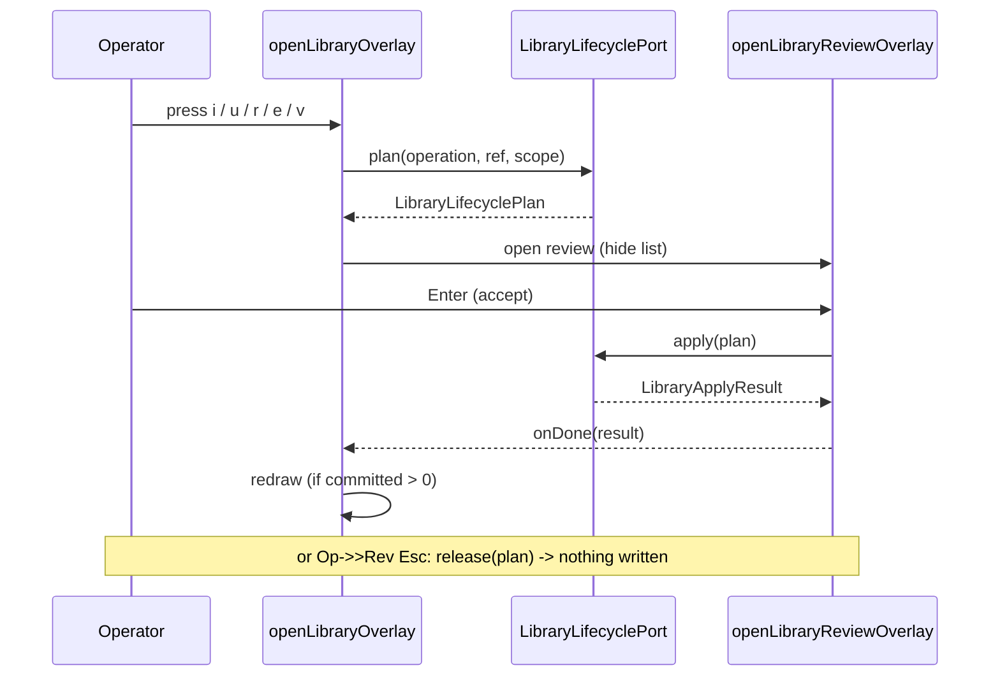

# Interactive overlays

The interactive overlays are the TUI's panels that temporarily take over the keyboard and
screen — a full-screen browser, a centered modal, or a scrolling review body. They live under
`src/interactive/overlays` and are all components against the engine's `TUI` contract
(`render(width)` / `handleInput(data)` / `invalidate()`). The area has two kinds of member:

- **Generic surfaces** that other overlays reuse: the tabbed list browser
  (`src/interactive/overlays/list-overlay.ts`) and the Settings Center
  (`src/interactive/overlays/settings.ts`).
- **Domain overlays** built on top of them: the Library browser and its review/outcome
  surface (`src/interactive/overlays/library.ts`, `library-model.ts`, `library-review.ts`,
  `library-lifecycle.ts`, `library-tabs.ts`), the model picker
  (`src/interactive/overlays/model-selector.ts`), the ask-user interview
  (`src/interactive/overlays/ask-user.ts`), and the session-tree navigator
  (`src/interactive/overlays/tree-selector.ts`).

Every opener — `openListOverlay`, `openLibraryOverlay`, `openSettingsOverlay`,
`openModelOverlay`, `openAskUserOverlay`, `openTreeOverlay` — mounts its view through the shared
frame in `src/interactive/overlay-frame.ts` (`showClioOverlayFrame`) and returns an
`OverlayHandle` whose `hide()` is the only guaranteed way to release keyboard ownership.

## Ownership

| File | Owns | Key symbols |
| --- | --- | --- |
| `src/interactive/overlays/list-overlay.ts` | The reusable tabbed, filterable list browser with an optional detail pane. | `ListOverlayView` (line 115), `openListOverlay` (line 931), `NARROW_ROW_WIDTH` (line 22) |
| `src/interactive/overlays/library.ts` | The Library browser's view state, key bindings, and the bridge to the lifecycle. | `openLibraryOverlay`, `LIBRARY_TITLE`, `LIBRARY_EMPTY_BROWSE`, `LIBRARY_EMPTY_INSTALLED` |
| `src/interactive/overlays/library-model.ts` | Pure projection of one inventory read into rows, status line, and detail panes. | `buildLibraryRows` (line 532), `libraryRowActions` (line 166), `selectForCategory` (line 486), `libraryStatusLine` (line 109) |
| `src/interactive/overlays/library-review.ts` | The plan review and the outcome it is replaced by; the one scrollable review body. | `openLibraryReviewOverlay` (line 492), `openLibraryImportOverlay` (line 535), `formatLibraryPlanReview` (line 59), `formatLibraryOutcome` (line 247), `LibraryReviewBody` (line 354) |
| `src/interactive/overlays/library-lifecycle.ts` | The binding between the browser and the resource lifecycle domain. | `LibraryLifecyclePort`, `createLibraryLifecycle`, `libraryRefreshHost` |
| `src/interactive/overlays/library-tabs.ts` | The five Library categories in keyboard order. | `LIBRARY_TABS`, `isLibraryTab` |
| `src/interactive/overlays/settings.ts` | The Settings Center: sections, rows, submenus, and scoped commit planning. | `SettingsCenter`, `openSettingsOverlay`, `createSettingsChangePlan`, `applySettingChange` |
| `src/interactive/overlays/model-selector.ts` | The target-first model picker and its row resolution. | `ModelOverlayView`, `openModelOverlay`, `buildModelItems`, `modelsForTarget` |
| `src/interactive/overlays/ask-user.ts` | The multi-question interview an `ask_user` tool request drives. | `openAskUserOverlay`, `AskUserOverlaySession` |
| `src/interactive/overlays/tree-selector.ts` | The current session's turn tree navigator. | `TreeOverlayView`, `openTreeOverlay` |

The composition root that opens these is `src/interactive/overlay-lifecycle.ts`, whose
`OverlayLifecycleRuntimeDeps` interface lists the injectable openers (`openAskUserOverlay`,
`openModelOverlay`, `openSettingsOverlay`, `openSkillsHub` aliased to
`openLibraryOverlay`, and so on). Each opener is wired with the session's `TUI` plus the
domain ports it needs (providers, lifecycle, settings, session contract).

The generic list browser and the Settings Center are documented with the other interactive
surfaces on the [Interactive](../interactive.md) and [Interactive renderers](renderers.md) pages;
the Library's read/write path is the [Resources](../domains/resources.md) domain, and its scope
vocabulary is the [Plugins](../domains/plugins.md) domain.

## How a call flows through an overlay

Take the Library browser, which composes the two generic surfaces. `/library` reaches
`openLibraryOverlay` (`src/interactive/overlays/library.ts`), which keeps a small `LibraryView`
state object (`category`, `mode`, `scope`, and an optional `member` when drilled into one
package's rows). It builds one tab per entry in `LIBRARY_TABS` and mounts them on
`openListOverlay` (`src/interactive/overlays/list-overlay.ts`), passing `fullScreen: true`,
`layout: "split"`, and a `status` callback that calls `libraryStatusLine`
(`src/interactive/overlays/library-model.ts`). Each tab's `items()` calls
`rowsFor(tab.id)`, which does one cached inventory read, narrows it with
`selectForCategory(inventory, { ...view, category })`, and projects it through
`buildLibraryRows`. The row set is rebuilt on demand, so `refreshTabs()` re-reads whatever the
rows describe rather than serving a snapshot taken when the overlay opened.

Row identity is the boundary between the list and the actions. `buildLibraryRows` returns both
the `ListOverlayItem[]` and a `subjects` map from row id to a `LibraryRowSubject` (the package
record, the installed copy, the loaded recipe, or a member). When the operator presses a
management key (`i`, `u`, `r`, `e`, `v`), `openLibraryOverlay` looks the selected item up in
`rowSet.subjects`, computes the allowed actions with `libraryRowActions(subject, view)`, and
only then calls `manage(operation, item)`. `manage` refuses the write if the action is not
allowed for that row and that scope, then asks the lifecycle port for a plan, hides the list, and
opens the review overlay through `openLibraryReviewOverlay`
(`src/interactive/overlays/library-review.ts`). `manage` is the wrapper; `deps.lifecycle.plan`
is the direct helper. The two exits are exact: `onCancel` calls
`deps.lifecycle.release(plan)` (staged source removed, nothing written) and `onDone` reports the
`LibraryApplyResult` counts and redraws the list if any step committed.

`openListOverlay` itself is the generic side of the flow: it constructs `ListOverlayView`
with `() => tui.requestRender()` as the change callback and `showClioOverlayFrame` as the
mount, then augments the returned handle with `setItems`, `refreshTabs`, `setActiveTab`,
`activeTabId`, `selectById`, and `toggleDetail`. The view's `handleInput` (`list-overlay.ts`) is
where the key vocabulary is enforced: Esc routes through `clearFilterOrClose`, a typed letter
routes into the filter input, and `runAction(data, filteredItems)` dispatches a keyed secondary
action only when a row is selected.

The Settings Center follows the same shape with a richer interior. `openSettingsOverlay`
(`src/interactive/overlays/settings.ts`) builds the row list with `buildSettingItems`, hands it to
`new SettingsCenter`, and mounts it with `anchor: "top-left"` and `width: SETTINGS_OVERLAY_WIDTH`.
`SettingsCenter` owns a two-lane navigation state ("sections" / "rows") plus an open submenu
component and a filter draft. Enter on a row opens a submenu (a pick-list, an edit-text field, or
a profile workbench). Committing a value does not write: `prepareChange` calls
`createSettingsChangePlan`, which deep-clones the settings, applies `applySettingChange`, runs
`validateSettings`, and returns a frozen `SettingsChangePlan` naming the changed leaves and their
propagation timing ("now", "next-request", "next-dispatch", "next-session"). Only after the
operator chooses session/project/global does `onApply` call `deps.commitSetting` per leaf and
then `refreshRows()` re-derives every row from the live effective settings.

The model picker resolves each row through the same provider contract the chat loop uses.
`buildModelItems` (`src/interactive/overlays/model-selector.ts`) iterates `providers.list()`,
keeps only orchestrator-eligible runtimes, and for each candidate wire model calls
`resolveOverlayRuntimeTarget` (a wrapper over `resolveRuntimeTarget` with `use: "orchestrator"`,
`requireTools`, `requireStreaming`, `requireOutputBudget`). A row is `selectable` only when
`supportsAgentRoleTools(decisions)`; a model that cannot call tools stays listed so the operator
sees why it is refused. `openModelOverlay` mounts `ModelOverlayView` on the shared frame, wires
`providers.probeTarget` / `providers.probeAllLive` to the `r`/`R` refresh keys, and subscribes to
`BusChannels.ProviderHealth` so the rows re-render when health changes while open. Its
`handleInput` closes the picker **before** calling `deps.onSelect`, because the application opens
a follow-up session/global scope confirmation from `onSelect` and closing afterwards would kill
that new overlay.

The ask-user overlay is a multi-question interview. `openAskUserOverlay`
(`src/interactive/overlays/ask-user.ts`) returns an `AskUserOverlaySession` whose `ask(questions,
decisionPresentation)` awaits the operator's answers. Its caller,
`createOverlayAskUserLifecycle` (`src/interactive/overlay-ask-user-lifecycle.ts`), owns the
session: `ensureSession` opens it once per interview, `handler` sets `pendingCancel = cancel` and
awaits the result, and `close()` clears the overlay state and releases the handle. A cancel fired
while the interview is parked propagates through `session.cancel()` and is remembered as
`cancelledForTurn` so a later tool-backed request returns a cancelled result immediately.

The Library's plan/review/apply cycle is the lifecycle the browser enforces end to end:

The tree navigator, `openTreeOverlay` (`src/interactive/overlays/tree-selector.ts`), reads the
current session's turn tree via `session.tree()` and renders one row per node. `Enter` on a row
calls `deps.onSwitchTurn(turnId)` and closes; structural rows (compaction markers, branch
returns) are marked `switchable: false` because `switchTurn` only knows message-tree nodes, and
pressing Enter on them would throw. `e` enters a label-edit submode; commit calls
`deps.session.editLabel` and then `refresh()` re-reads the tree so the edit is visible without a
close/reopen cycle.

## Boundaries and lifecycle ordering

The Library browser is the clearest example of an enforced boundary: it never calls a writer
directly. `createLibraryLifecycle` (`src/interactive/overlays/library-lifecycle.ts`) adapts the
domain's `planLibraryLifecycle` / `applyLibraryLifecycle` / `releaseLibraryLifecycle` / `retryLibraryRefresh`
behind the `LibraryLifecyclePort`, and the port is what `openLibraryOverlay` is handed. The
browser adds no lifecycle semantics of its own — no second planner, no fallback writer. The
result is that "cancel wrote nothing" is a property of the code: `manage` holds a reference to the
child review overlay plus a `release` closure, and the overlay's `hide()` calls
`pending.release()` on the staged source before hiding the child. `libraryRefreshHost` is the
separate seam that reloads session resources after the last committed step and reports its result
independently, so a failed refresh never restates a successful write as a failure.

The list browser enforces a staged unwind on Esc. `clearFilterOrClose` (`list-overlay.ts`) checks,
in order: a nonempty filter clears first; `explicitSearch` then leaves search focus; then an
`onBack` inner level (e.g. a package's member list) is asked through
`this.options.onBack?.active()` and its `back()` is called; and only then does `onClose` fire.
The footer verb `escapeVerb()` mirrors this exactly, so the key the operator is shown is the key
they will get. `getHint` likewise drops the select/invoke/act verbs entirely when a tab has no
rows, keeping only the tab-switch and global hints — an empty list has no row to select, and
offering those keys anyway would be a lie the empty state exists to stop.

Selection survives refresh by anchoring on id. `setItems` (`list-overlay.ts`) re-anchors the
cursor on the previously selected row's `id` rather than its index, so a refresh that prepends a
row does not slide the cursor onto a different entry; the detail scroll only survives while the
same id stays selected. `selectById` returns `false` when no such row exists, reporting a miss
rather than silently landing on row zero. The render path memoizes the whole frame on a key of
every render input (`renderMemo`), and `itemsEpoch` / `inputEpoch` bump on row replacement and
keystrokes so a replaced set never serves a stale frame.

The review overlay matches keys by name, not by raw bytes. `openReviewOverlay`
(`library-review.ts`) wraps its body in a `FocusBox` whose `onInput` uses `matchesKey` and
`isKeyRelease`, because under the kitty keyboard protocol Esc arrives as `CSI 27 u` and a byte
comparison would leave the overlay unanswerable. The two-phase body is ordered: while
`body.outcome` is null the keys are Enter (commit), Esc (cancel), and `d` (toggle paths/digests);
onece an outcome is shown the keys are `R` (retry refresh only), Esc, and Enter. `R` calls
`spec.retryRefresh()`, which returns a replacement outcome body and never repeats a write.

## Extension seams

Other overlays build on `openListOverlay` rather than reimplementing the browser:
`src/interactive/overlays/extensions.ts` (the Extensions Reference),
`src/interactive/overlays/help-reference.ts` (the Help Center), and
`src/interactive/overlays/interop.ts` (the interop proposal list) each assemble
`ListOverlayItem[]` and call `openListOverlay` with their own `markerId`, `filterable`, and
secondary `actions`. The Library notices surface does the same: `openNotices` in
`src/interactive/overlays/library.ts` opens a second `openListOverlay` scoped to the notice rows
and sets `globalActions: { n: close }` so `n` returns to the resources.

The Library is dependency-injected for tests through `LibraryOverlayDeps`: `readInventory`,
`inspectCopy`, `openReview`, `openImportReview`, `openList`, `planImport`, `applyImport`, and
`scheduleInitial` all default to the live implementations but are replaceable, which is what lets
the contract tests drive `openLibraryOverlay` against a fake `TUI` and a canned
`ListOverlayHandle`. The Settings Center is injected through `SettingsCenterOptions`
(`prepareChange`, `onApply`, `onCancel`, `getBodyHeight`, `requestRender`), and the model picker
through `OpenModelOverlayDeps` (`settings`, `providers`, `bus`, `onSelect`, `onToggleFavorite`,
`getSettings`, `autoRefresh`).

## Focused tests

- `tests/contracts/overlay-render-fit.test.ts` drives `ListOverlayView.render` directly at widths
  60/80/120/200 and asserts a row that fits closes without an ellipsis while a row that does not
closes with one; it also covers a row with `meta`. This is the test that pins the label/meta
  splitting that `renderList` performs at or below `NARROW_ROW_WIDTH`.
- `tests/contracts/tui-library-ergonomics.test.ts` opens `openLibraryOverlay` against a fake `TUI`
  and a stubbed `ListOverlayHandle`, then drives `view.handleInput` to exercise the real key
  routing. It asserts that notice navigation and rendering use the cached inventory (`reads` stays
  1), that search typing is preserved across mode switches, that `v` on a loaded agent writes
  `/run <name> ` to the editor and on a fleet routes through `openFleetRun`, and that terminal
  control sequences in package names are neutralized while Unicode identity is preserved.
- `tests/contracts/routes-model-picker.test.ts` constructs `ModelOverlayView` with synthetic
  `ModelRow`s and asserts the active/favorite/recent state marks (`✓` / `★` / `↺`), that scoped and
default rows are selected by id, and that no origin/health glyphs leak into the row; it also
  checks wide grapheme fitting in the model cell.
- `tests/extended/keyboard-routing.test.ts` mounts the real openers (including `openAskUserOverlay`,
  `openLibraryReviewOverlay`, `ListOverlayView`, `ModelOverlayView`, `SettingsCenter`) under a fake
  keyboard terminal and verifies that the overlay frame's footer hints and the view's keyboard
  scope agree as input focus moves between levels.

These contract tests are part of the [Contract tests](../tests/contracts.md) suite; the Library
browser's projection and review wording are also covered by the
[Tests extended](../tests/extended.md) suite in `tests/extended/library-browser.test.ts`.

## Things to watch when editing

- `NARROW_ROW_WIDTH` is 76 (`list-overlay.ts:22`): a row at or below this draws `narrowLabel`
  when present, so a new list surface that wants a short form must supply `narrowLabel`, and
  filtering still matches the full `label`.
- The Library reads the inventory once per rebuild and shares it across all five tabs; `invalidate()`
  clears both `inventoryCache` and `inspectionCache`, and `redraw()` calls it. Adding a second read
  path per tab would repeat the root-enumeration precedence work that the cache exists to avoid.
- `libraryRowActions` is the single source of truth for which keys a row offers; the footer hints
  in `openLibraryOverlay` are derived from it. Change one without the other and the footer will
  advertise a key the row refuses (or hide one it accepts).
- The Library's review width is clamped by `MIN_WIDTH` (48) and `MAX_WIDTH` (110) in
  `libraryReviewWidth`; the body itself computes its row budget from
  `process.stdout.rows - 10`, so a very short terminal still renders but scrolls.
- `createSettingsChangePlan` throws `SettingsValidationError` if the proposed settings fail
  `validateSettings`; `openSettingsOverlay` relies on this to reject a bad value before any
  leaf is committed, so `applySettingChange` must leave a well-formed tree even for values the
  operator is still editing.
- The model picker's close-before-select ordering in `handleInput` is load-bearing; moving
  `deps.onSelect` before `this.onClose()` reopens the follow-up scope overlay and closes it
  immediately. `dispose()` on `ModelOverlayView` aborts its lifecycle `AbortController`, so a
  refresh in flight must check `signal.aborted` before touching `this.rows`.
- The Settings Center's `Esc` is component-owned (`back()`), so the application router forwards
  Esc into it rather than closing the overlay; one press moves up exactly one level, and every
  physical encoding of Esc (raw, Kitty `CSI 27 u`, modifyOtherKeys) is recognized before any
  delegation. Key releases (`isKeyRelease`) do nothing.

<!-- clio-coder:wiki unresolved sources: tests/extended/keyboard-routing.test.ts -->
