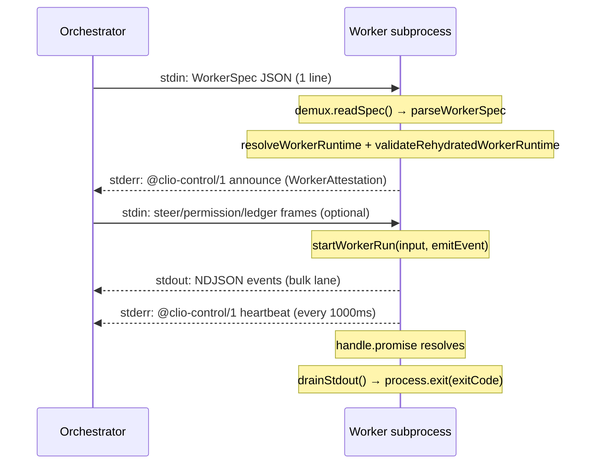

# Worker runtime

## What the area does

The worker runtime is the subprocess that executes one dispatched agent run.
It reads a `WorkerSpec` JSON document from stdin, re-hydrates the runtime
descriptor from the runtime registry (because `RuntimeDescriptor` carries
functions and cannot cross the stdin boundary), builds a `WorkerRunInput`, and
dispatches to `startWorkerRun` from the engine boundary (`src/engine/worker-runtime.ts`).
Events flow back to the orchestrator on stdout as NDJSON (one JSON object per
line), while control frames (announce, heartbeats, cancellation acknowledgements,
ledger posts, model-load reports) flow on stderr behind the `@clio-control/1 `
marker.

The protocol exists to keep two lanes isolated. The **bulk lane** is stdout:
high-volume model and tool events. The **control lane** is stderr: small,
fixed-shape frames that must never be delayed by a bulk flood. The module
lives under `src/worker` because both the worker and the orchestrator need the
wire schema, and `src/worker` may not value-import `src/domains` — the
orchestrator-facing half is re-exported from `src/domains/dispatch/worker-protocol.ts`.

## Ownership

| Concern | Source | Key symbols |
|---------|--------|-------------|
| Entry point and lifecycle | `src/worker/entry.ts` | `main`, `announceWorker` |
| Wire protocol (lanes, bounds, schema) | `src/worker/protocol.ts` | `WORKER_PROTOCOL_VERSION`, `CONTROL_FRAME_PREFIX`, `WorkerAttestation`, `parseControlFrame`, `parseBulkFrame`, `WorkerControlFrame`, `canonicalJson`, `endpointIdentityHash`, `workerSpecDigest`, `toolSignatureOf`, `WORKER_BULK_FRAME_MAX_BYTES`, `WORKER_CONTROL_FRAME_MAX_BYTES`, `WORKER_STDIN_FRAME_MAX_BYTES` |
| Spec contract and validation | `src/worker/spec-contract.ts` | `WORKER_SPEC_VERSION` (= 5), `WORKER_RUNTIME_DESCRIPTOR_VERSION` (= 2), `WorkerSpec`, `parseWorkerSpec`, `validateRehydratedWorkerRuntime`, `WORKER_EXIT_PERMISSION_REQUIRED` (= 3) |
| Stdin demux and steering | `src/worker/stdin-demux.ts` | `createWorkerStdinDemux`, `createOrderedSteerHandler`, `WorkerSteerMessage` |
| Context seed parsing | `src/worker/context-seed.ts` | `parseWorkerContextSeed`, `WORKER_CONTEXT_MAX_BYTES`, `contextHash`, `completeHistoryLength` |
| Agent ledger mirror | `src/worker/ledger-mirror.ts` | `createWorkerAgentLedgerMirror`, `createWorkerAgentLedgerPort`, `WORKER_AGENT_LEDGER_POST_CAP` (= 20) |
| Heartbeat emitter | `src/worker/heartbeat.ts` | `startWorkerHeartbeat` |
| Resource observation | `src/worker/resource-facts.ts` | `observeWorkerResourceFacts`, `probeNvidiaGpus`, `observeHostIdentity`, `GPU_PROBE_TIMEOUT_MS` (= 1000) |
| Control-lane writer | `src/worker/control-lane.ts` | `emitControlFrame` |
| NDJSON stdout emitter | `src/worker/ndjson.ts` | `emitEvent`, `drainStdout` |
| Event projection (stdout slimming) | `src/worker/event-projection.ts` | `projectWorkerEventForStdout` |
| Runtime rehydration | `src/worker/runtime-registry.ts` | `resolveWorkerRuntime` |
| Engine run boundary | `src/engine/worker-runtime.ts` | `startWorkerRun`, `WorkerRunInput`, `WorkerRunHandle` |
| Worker tool registry and safety | `src/engine/worker-tools.ts` | `createWorkerToolRegistry`, `createWorkerSafety`, `attestedToolSignature`, `INTERNAL_HELPER_RESULT_TOOL` |
| Orchestrator-side admission | `src/domains/dispatch/worker-protocol.ts` | `verifyWorkerAttestation`, `approvedIdentityForSpec`, `createBoundedEventQueue`, `computeSettingsFingerprint`, `WorkerChannelFailure` |

## Lifecycle and data flow

The lifecycle has five phases, visible in `src/worker/entry.ts` (`main`):

1. **Bootstrap.** `process.title` is set to `"clio-coder-worker"` before the spec
   arrives so an early failure is identifiable in the process table. The
   compile-cache pair the dispatcher injected is consumed from the environment
   so that every child the worker spawns (bash tool commands, hooks, external
   runtimes) does not inherit it. `CLIO_CODER_WORKER_RUN=1` is set to mark
   skill provenance as worker-installed rather than operator-installed.

2. **Spec read.** A `WorkerStdinDemux` is created and fed every chunk from
   `process.stdin`. The demux buffers lines until `readSpec()` resolves. The
   first line is the `WorkerSpec` JSON document, validated by `parseWorkerSpec`
   in `src/worker/spec-contract.ts`. The spec carries `specVersion` (must be
   `WORKER_SPEC_VERSION` = 5), `settingsFingerprint` (sha256 of the orchestrator's
   settings snapshot), the serialized runtime descriptor, the target descriptor,
   the budget, allowed tools, and all optional run configuration. After the
   spec, stdin lines are demuxed into steer messages, permission decisions,
   ledger deltas, or dropped as unrecognized.

3. **Rehydration and attestation.** `resolveWorkerRuntime` re-hydrates the
   runtime descriptor from the runtime registry (builtins + plugins), and
   `validateRehydratedWorkerRuntime` compares the rehydrated descriptor against
   the serialized one in the spec (id, kind, apiFamily, auth). The
   `announceWorker` function then emits an `announce` control frame on stderr
   containing a `WorkerAttestation` with: protocol version, spec version, PID,
   process-group leader, hostname, settings fingerprint, spec digest
   (computed by `workerSpecDigest`), runtime/target/endpoint/wire-model
   identities, tool signature, and observed resource facts. The orchestrator
   compares every field against the approved plan via `verifyWorkerAttestation`
   in `src/domains/dispatch/worker-protocol.ts` and kills a drifting peer
   before any model call.

4. **Run.** `startWorkerRun` from `src/engine/worker-runtime.ts` owns the
   `pi-agent-core` `Agent` instance for the run. Events are forwarded to the
   `emitEvent` callback, which serializes them to NDJSON stdout after passing
   through `projectWorkerEventForStdout` (which drops the two per-delta
   cumulative message snapshots from `message_update` events to keep stdout
   linear rather than quadratic). The run handle exposes `promise`, `abort()`,
   and optionally `steer` and `resolvePermission`.

5. **Exit.** `drainStdout()` flushes all queued stdout lines to the OS before
   `process.exit`. A 2000 ms timeout bounds the drain for a wedged pipe.
   `stopHeartbeat` is called first to stop the interval timer. Any dropped
   unrecognized stdin lines are reported to stderr.

## The spec contract

The `WorkerSpec` is the admission-time planning document the orchestrator emits
for each dispatch. The current version is 5 (`WORKER_SPEC_VERSION` in
`src/worker/spec-contract.ts`). Key fields and their validation:

- **`specVersion`**: must equal 5. A different version is a fatal rejection.
- **`settingsFingerprint`**: sha256 hex digest of the immutable settings
  snapshot. The worker echoes it in its announcement so the orchestrator can
  refuse a peer running against a different configuration.
- **`runtime`**: a `SerializedWorkerRuntimeDescriptor` (version 2) carrying
  id, kind, apiFamily, auth, and optional aliases. The worker rehydrates this
  from the registry and `validateRehydratedWorkerRuntime` verifies id, kind,
  apiFamily, and auth all match.
- **`budget`**: a `WorkerBudget` with `toolCalls`, `readReserve`, `synthesis`,
  `hardCap`, and optional `mode` (`"advisory"` | `"enforced"`) and `revision`.
  Enforced mode uses phase boundaries; advisory mode never forces synthesis.
  `readReserve` must be in `[0, toolCalls)`.
- **`allowedTools`**: closed array of tool names the worker may expose.
- **`onPermission`**: `"deny"` (default), `"fail"` (abort with
  `WORKER_EXIT_PERMISSION_REQUIRED` = 3), or `"escalate"` (park and wait for
  an operator permission decision on stdin).
- **`escalation`**: bounds for the escalate posture — `timeoutMs` (default
  120000) and `fallback` (`"deny"` default).
- **`writeRoots`**: absolute path boundaries for write-class tools, enforced at
  the shared worker safety seam.
- **`contextSeed`**: optional parent-session history seed, validated by
  `parseWorkerContextSeed` in `src/worker/context-seed.ts`. A `fork` seed
  carries the full message array; a `splice` seed carries exactly one user
  message. The seed is bounded to 512 KiB (`WORKER_CONTEXT_MAX_BYTES`).

The spec is validated twice: once by the worker at the stdin boundary
(`parseWorkerSpec`) and once by the orchestrator at dispatch admission. The
worker-side validation in `src/worker/spec-contract.ts` uses pure local helpers
(`readRecord`, `readString`, `readEnum`, etc.) and never value-imports from
`src/domains`, because the worker build boundary forbids it. The only exceptions
are the three provider modules allow-listed in
`isAllowedWorkerProviderValueImport` (`tests/boundaries/check-boundaries.ts:377`):
`plugins.ts`, `registry.ts`, and `runtimes/builtins.ts`.

## The NDJSON protocol

Two lanes cross every transport, and they never share a queue
(`src/worker/protocol.ts`):

### Bulk lane (stdout)

- Carries model and tool events as NDJSON (one JSON object per line).
- Bounded by `WORKER_BULK_FRAME_MAX_BYTES` (4 MiB) per line.
- `parseBulkFrame` validates the byte budget before JSON.parse and normalizes
  legacy event IDs through `normalizeClioCoderEventRecord`.
- The orchestrator consumes stdout line-by-line and may drop display-only
  frames under backpressure. `isReceiptBearingFrame` marks the frames whose
  loss would destroy receipt evidence (e.g., `message_end`,
  `clio_coder_run_outcome`, `clio_coder_tool_start/finish`, steer receipts,
  permission escalations, spawn errors).

### Control lane (stderr)

- Carries `WorkerControlFrame` lines prefixed with `@clio-control/1 `.
- Bounded by `WORKER_CONTROL_FRAME_MAX_BYTES` (16 KiB) per line.
- `emitControlFrame` in `src/worker/control-lane.ts` writes synchronously to
  stderr; a failed write is not worth aborting a run because the orchestrator's
  stall watchdog covers a wedged control lane.
- Frame kinds: `announce`, `heartbeat`, `cancel_ack`, `ledger_post`, `model_loaded`.

### Stdin lane (orchestrator → worker)

- Bounded by `WORKER_STDIN_FRAME_MAX_BYTES` (1 MiB) per line.
- The demux checks the byte budget before JSON.parse so an oversized or
  adversarial line costs a length comparison, not a parse and allocation.
- The first line is the spec; subsequent lines are steer, permission decision,
  or ledger delta frames. Unrecognized lines increment a dropped count and are
  reported at exit.

### Canonical hashing

`canonicalJson` in `src/worker/protocol.ts` produces deterministic JSON with
sorted keys and `undefined` values omitted. All digests (settings fingerprint,
spec digest, tool signature, endpoint identity hash) use `canonicalJson` so
two peers agree byte-for-byte regardless of construction order.

## Steering and escalation

The `createWorkerStdinDemux` in `src/worker/stdin-demux.ts` demuxes post-spec
stdin lines into three handler channels:

- **Steer** (`{"type":"steer","text":"...","sequence":N}`): the sequence is
  assigned by the parent and is what lets `clio_coder_steer_received`
  acknowledge one exact receipt entry. Steers arriving before the handler is
  registered are buffered and flushed in order.
- **Permission decision** (`{"type":"permission_decision","requestId":"...","decision":"approve"|"deny"}`):
  resolves a parked escalation. Unknown or duplicate requestIds return false
  and are dropped without crashing the worker.
- **Ledger delta** (`{"type":"ledger_delta","entries":[...]}`): pushes newly
  admitted entries toward the worker's local mirror.

`createOrderedSteerHandler` in `src/worker/stdin-demux.ts` preserves stdin
order while the runtime accepts guidance asynchronously. It chains each steer
delivery to the tail of a Promise, so a later steer never reaches the runtime
ahead of an earlier pending one. Rejected steers produce a diagnostic on
stderr without poisoning subsequent delivery.

The entry point wires these to the run handle:

- `demux.onSteer(createOrderedSteerHandler(...))` — the deliver callback calls
  `handle.steer?.(text)`, and the on-accepted callback emits a
  `clio_coder_steer_received` event.
- `demux.onPermissionDecision(...)` — calls `handle.resolvePermission?.(requestId, decision)`.
- `demux.onLedgerDelta(...)` — feeds `ledgerPort.acceptDelta(entries)`.

## Agent ledger mirror

The agent ledger is the bounded coordination surface concurrent dispatch
workers share. The worker-side mirror (`src/worker/ledger-mirror.ts`) is the
worker's whole view of the board: the orchestrator pushes `ledger_delta` frames
down stdin and the mirror dedupes them by sequence, so a read answers locally
with an explicit watermark instead of blocking a tool call on a round trip.

The port (`createWorkerAgentLedgerPort`) enforces body bounds and the per-run
post cap locally to give the model a synchronous typed refusal, while the
orchestrator enforces the same rules authoritatively at append. The control
lane is one-way, so a post cannot learn the orchestrator's verdict; only what
the orchestrator admitted is what a receipt counts.

The ledger body taxonomy is closed on purpose: `claim` (stakes a scope),
`finding` (carries a citation), and `review` (targets another entry). Bounds
are enforced in `parseAgentLedgerBody` in `src/worker/protocol.ts`:
- `AGENT_LEDGER_SCOPE_MAX_ENTRIES` = 8
- `AGENT_LEDGER_SCOPE_ENTRY_MAX_CHARS` = 200
- `AGENT_LEDGER_INTENT_MAX_CHARS` = 200
- `AGENT_LEDGER_CLAIM_MAX_CHARS` = 400
- `AGENT_LEDGER_EVIDENCE_MAX_CHARS` = 400

## Heartbeat and stall detection

`startWorkerHeartbeat` in `src/worker/heartbeat.ts` emits an initial
`{ kind: "heartbeat" }` control frame immediately, then one every `intervalMs`
(default 1000 ms) via `setInterval`. The interval timer is `unref`'d so it
cannot keep the worker process alive past the agent run. The stop function
returned by `startWorkerHeartbeat` is called from the worker entry once
`handle.promise` resolves.

The orchestrator's stall watchdog uses the heartbeat arrival time on its own
clock as the only instant liveness math may read. A saturated bulk stdout queue
cannot starve heartbeats because they ride the separate stderr control lane.

## Resource observation and attestation

`observeWorkerResourceFacts` in `src/worker/resource-facts.ts` takes the
node's bounded resource facts at announce time:

- **CPU count** from `os.cpus()`.
- **Total/free memory** from `os.totalmem()` / `os.freemem()`.
- **GPU count and VRAM** from a bounded `nvidia-smi` probe (1000 ms timeout).
  A node without the tool, without a GPU, or with a probe that does not answer
  reports `{ known: false }` rather than zero.
- **Resident models** are always `{ known: false }` because a worker only
  observes the models it loads itself.
- **Labels** come from the `CLIO_CODER_WORKER_LABELS` environment variable
  (comma-separated), bounded to `WORKER_RESOURCE_LABEL_MAX` (32) entries.

The `WorkerAttestation` interface in `src/worker/protocol.ts` requires every
field to be a non-empty string (or null for `processGroupId`), a finite number
(for `specVersion`, `pid`), a sha256 hex digest (for fingerprints and hashes),
or a `WorkerResourceFacts` object. `parseAttestation` in
`src/worker/protocol.ts` validates all of these on the orchestrator side.

## Boundary invariants

The worker boundary is enforced by `tests/boundaries/check-boundaries.ts`:

1. **Type-only imports from domains.** `src/worker/**` may only
   type-import `src/domains/**` (rule 2). The three provider modules
   `plugins.ts`, `registry.ts`, and `runtimes/builtins.ts` are allow-listed
   for value imports because `resolveWorkerRuntime` needs them to rehydrate
   the runtime descriptor.

2. **Stdout is the bulk lane.** Any stray `console.log` in worker code
   corrupts the NDJSON protocol. `drainStdout()` in `src/worker/ndjson.ts`
   must be called before `process.exit` to flush queued lines.

3. **Control lane isolation.** `emitControlFrame` writes to stderr, never to
   stdout. The `@clio-control/1 ` marker promotes one stderr line into the
   structured control lane; unmarked stderr stays free-form operator
   diagnostics.

4. **Attestation before model.** `announceWorker` is called after the runtime
   is rehydrated and the run input is fully resolved, strictly before
   `startWorkerRun` reaches a model. The orchestrator compares every field and
   kills a drifting peer.

5. **Model release ownership.** The orchestrator owns the release of every
   model a worker loads. The worker reports each load via a `model_loaded`
   control frame and never releases on its own exit.

## Extension seams

- **New control frame kinds**: add a new variant to `WorkerControlFrame` in
  `src/worker/protocol.ts`, add a case to `parseControlFrame`, and add the
  emitter call in `src/worker/entry.ts`. The orchestrator side must parse it
  in `src/domains/dispatch/worker-protocol.ts`.

- **New spec fields**: add the field to `WorkerSpecFields` in
  `src/worker/spec-contract.ts`, validate it in `parseWorkerSpec`, and forward
  it to `WorkerRunInput` in `src/worker/entry.ts`. Bump `WORKER_SPEC_VERSION`
  if the field is required.

- **New runtime kinds**: add to `RUNTIME_KINDS` in
  `src/worker/spec-contract.ts`, register in the runtime registry
  (`src/domains/providers/runtimes/builtins.ts`), and add a branch in
  `src/engine/worker-runtime.ts` (`startWorkerRun` dispatches to
  `startClaudeSdkWorkerRun` or `startExternalCliWorkerRun` for non-native
  runtimes).

- **New ledger body kinds**: add to the `AgentLedgerBody` type in
  `src/worker/protocol.ts`, validate in `parseAgentLedgerBody`, and update
  the ledger tool's argument handling in the worker tool registry.

## Focused tests

- **`tests/contracts/worker-boundary.test.ts`** — Exercises the permission
  cache key (exact call and permission conditions), recipe normalization,
  capability merging, result contract round-trip, attestation admission
  (full-field comparison via `verifyWorkerAttestation`), canonical hash
  domains (`computeSettingsFingerprint`, `workerSpecDigest`, `toolSignatureOf`,
  `endpointIdentityHash`), event projection (drops cumulative snapshots from
  `message_update`), bounded event queue (drops display frames under
  backpressure), and ordered steer handler (serializes live steering and
  acknowledges exact accepted sequences).

- **`tests/contracts/ledger-tool.test.ts`** — Exercises the ledger tool through
  a worker registry bound to the real worker-side port. Tests: typed posts as
  control frames, weak-model argument shape repair, read with watermark and
  kind/sequence narrowing, dedup by sequence on replay, per-field malformed
  post refusal, per-run post cap (20), and no-board behavior.

- **`tests/contracts/gateway-worker.test.ts`** — Exercises the gateway on the
  worker surface: intersects explicit turn scope with recipe schemas and
  gateway admission, refuses delegation that would widen the parent's explicit
  tools, narrows a recipe that lists git to a surface that carries gateway,
  and attests the same signature the orchestrator approves.

- **`tests/extended/dispatch-worker-signal.test.ts`** — Drives the dispatch
  harness through its real process spawner. A fixture child process announces
  the approved identity, then signals only itself. Tests ordinary exit,
  SIGKILL, and SIGKILL with bounded stderr. Seals missing-result failure and
  observed cause for each scenario.

## Things to watch when editing

- **`console.log` is fatal in worker code.** Any stdout write outside the
  NDJSON emitter corrupts the protocol. Use `process.stderr.write` for
  diagnostics, or `emitControlFrame` for structured control frames.
- **`drainStdout()` must be called before `process.exit`.** A large single
  NDJSON line (a big tool result) can still be buffered when the run settles;
  `process.exit` would truncate it mid-line.
- **The stdin frame budget is checked before JSON.parse.** If you add a new
  frame type to the demux, the byte ceiling check must come first. An
  oversized line costs a length comparison, not a parse and allocation.
- **`WORKER_SPEC_VERSION` is part of the wire contract.** Bumping it invalidates
  all in-flight workers; the orchestrator must re-dispatch them.
- **`validateRehydratedWorkerRuntime` is a full-field comparison.** If you add
  a field to the serialized runtime descriptor, you must also compare it in
  this function or the rehydration mismatch check will miss drift.
- **The ledger mirror dedupes by sequence.** If you change the sequence
  assignment scheme, both the worker mirror and the orchestrator's board must
  agree on the watermark semantics.
- **`event-projection.ts` drops cumulative message snapshots.** If a new
  worker-stdout consumer reads `message.message` or
  `assistantMessageEvent.partial`, it will break because those fields are
  deliberately removed. Add the consumer to the exclusion list in
  `projectWorkerEventForStdout`.
- **The heartbeat timer is `unref`'d.** If you add another timer to the worker
  entry, remember to unref it so it cannot keep the process alive past the
  run.
- **The compile-cache pair must be consumed from the environment.** If you
  add a new child process spawner in the worker, it must not inherit the
  dispatcher's compile-cache environment variables. `deleteInjectedCompileCacheFrom`
  handles this for the entry's own children.
- **`WORKER_EXIT_PERMISSION_REQUIRED` = 3** is a magic number the orchestrator
  maps to `failed/permission_required`. Do not change it without updating the
  orchestrator's outcome resolver.

<!-- clio-coder:wiki unresolved sources: src/worker/**, src/domains/** -->
